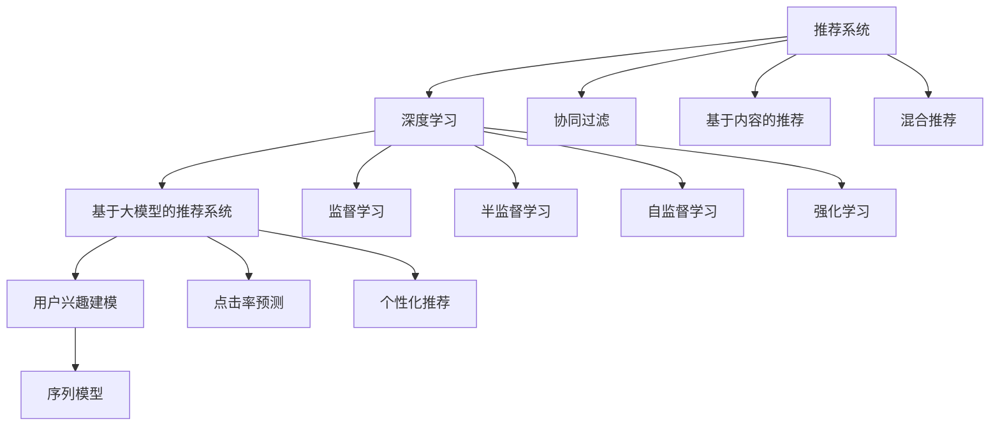

                 

# 基于大模型的推荐系统用户兴趣建模

> 关键词：基于大模型的推荐系统,用户兴趣建模,深度学习,协同过滤,序列模型,点击率预测,个性化推荐

## 1. 背景介绍

推荐系统是互联网时代的重要组成部分，从电商购物、音乐播放、视频观看到新闻阅读，推荐系统无处不在，影响着用户的行为和决策。良好的推荐系统能够帮助用户快速发现优质内容，提升用户体验，同时也为平台带来更高的用户粘性和商业价值。但随着数据量的大幅增长，传统推荐系统面临的挑战也日益严峻：

- **数据稀疏性**：大规模推荐系统往往面临数据稀疏性问题，很多用户-物品对未被记录或记录不足。传统的基于用户行为数据的推荐方法难以利用这些未标注数据。
- **用户兴趣多样性**：不同用户对物品的兴趣偏好差异较大，传统的基于协同过滤的推荐方法难以刻画复杂的用户兴趣。
- **长尾物品曝光**：平台上的长尾物品需求虽然不高，但种类繁多，仅靠传统的排序方法难以充分展示这些长尾物品。

为应对这些挑战，越来越多的研究将目光投向基于深度学习的方法，以提升推荐系统的性能。深度学习能够有效处理大规模数据，提取丰富的特征表示，在推荐系统中的应用越来越广泛。特别是基于大模型的推荐系统，通过预训练大规模语料和用户行为数据，学习到丰富的用户和物品表示，有望提升推荐系统的质量。

本论文将对基于大模型的推荐系统进行系统介绍，重点探讨用户兴趣建模的核心算法原理与具体操作步骤，并结合实际项目，深入讲解基于大模型的推荐系统如何实现高效的推荐。

## 2. 核心概念与联系

### 2.1 核心概念概述

为更好地理解基于大模型的推荐系统，本节将介绍几个关键概念：

- **推荐系统**：通过分析用户行为数据和物品属性，为用户推荐感兴趣物品的系统。推荐系统分为基于内容的推荐、协同过滤推荐、混合推荐等多种方式，是互联网应用的重要组成部分。
- **深度学习**：通过神经网络进行数据特征提取和建模的机器学习方法。深度学习能够自动学习特征表示，实现端到端的推荐模型，对推荐系统的发展起到了推动作用。
- **基于大模型的推荐系统**：利用预训练语言模型等大模型，学习用户和物品的深层次特征，进行推荐。大模型通过大规模无监督学习获取丰富的语义和知识，能够更好地刻画用户和物品的潜在关系。
- **用户兴趣建模**：通过深度学习模型对用户行为数据进行建模，预测用户的潜在兴趣和偏好，进而推荐感兴趣的物品。用户兴趣建模是推荐系统的核心。
- **序列模型**：通过序列化建模用户的行为序列，提取用户行为模式，预测后续行为。在用户兴趣建模中，序列模型通过捕捉用户历史行为，生成推荐序列。

这些概念之间的逻辑关系可以通过以下Mermaid流程图来展示：



这个流程图展示了大语言模型推荐系统的核心概念及其之间的关系：

1. 推荐系统通过深度学习技术进行建模。
2. 基于大模型的推荐系统利用预训练语言模型等大模型，学习用户和物品的深层次特征。
3. 用户兴趣建模通过序列模型等方法，对用户行为进行建模，预测用户兴趣。
4. 协同过滤、基于内容、混合推荐等多种推荐方法，通过深度学习技术，实现高效推荐。

这些概念共同构成了基于大模型的推荐系统的学习框架，使其能够在复杂多变的推荐场景中，实现高质量的个性化推荐。

## 3. 核心算法原理 & 具体操作步骤
### 3.1 算法原理概述

基于大模型的推荐系统，其核心在于用户兴趣建模，即通过深度学习模型对用户行为数据进行建模，预测用户的潜在兴趣和偏好，进而推荐感兴趣的物品。

形式化地，假设用户 $u$ 对物品 $i$ 的兴趣表示为 $x_u \in \mathbb{R}^d$，物品 $i$ 的兴趣表示为 $y_i \in \mathbb{R}^d$，其中 $d$ 为模型维度。目标是通过用户行为数据 $D=\{(x_i, y_i)\}_{i=1}^N$ 训练模型，使得模型能够准确预测用户对物品的兴趣：

$$
\hat{x}_u = \mathop{\arg\max}_{x} M(x_u, y_i)
$$

其中 $M$ 为推荐模型，根据用户和物品的表示输出兴趣相似度。常见的推荐模型包括点击率预测模型、协同过滤模型、序列推荐模型等。

基于大模型的推荐系统通过用户和物品的兴趣表示，实现高效的个性化推荐。该方法通过深度学习模型学习复杂的用户行为和物品属性，能够应对数据稀疏性、用户兴趣多样性等挑战，显著提升推荐系统的性能。

### 3.2 算法步骤详解

基于大模型的推荐系统的一般流程包括：

**Step 1: 准备数据集**

- 收集用户行为数据 $D=\{(x_i, y_i)\}_{i=1}^N$，其中 $x_i$ 表示用户 $i$ 的行为序列，$y_i$ 表示用户对物品的兴趣向量。
- 将用户行为序列 $x_i$ 转换为定长序列，并进行padding处理，保证所有序列长度一致。
- 将物品兴趣向量 $y_i$ 转换为向量表示，作为模型输入。

**Step 2: 选择预训练语言模型**

- 选择合适的预训练语言模型，如BERT、GPT等。通常选择大型通用预训练语言模型，以获取丰富的语义和知识。
- 使用预训练语言模型对用户行为序列和物品兴趣向量进行编码，得到用户和物品的表示 $x_u \in \mathbb{R}^d$ 和 $y_i \in \mathbb{R}^d$。

**Step 3: 设计推荐模型**

- 根据推荐任务选择合适的推荐模型，如点击率预测模型、协同过滤模型、序列推荐模型等。
- 在用户和物品的表示基础上，设计推荐模型的结构。

**Step 4: 微调预训练模型**

- 使用推荐数据集 $D$ 对预训练模型进行微调。微调过程中，将用户行为序列作为输入，物品兴趣向量作为监督信号，更新模型参数。
- 使用合适的损失函数，如交叉熵损失、均方误差损失等，计算模型预测和真实标签之间的差异，并据此更新模型参数。

**Step 5: 评估模型性能**

- 在验证集上评估模型的性能，如平均绝对误差、均方根误差等。
- 根据评估结果调整模型参数，优化推荐模型。

**Step 6: 预测用户兴趣**

- 将用户行为序列输入微调后的推荐模型，得到用户对不同物品的兴趣预测值。
- 根据预测值进行排序，推荐用户最可能感兴趣的物品。

以上是基于大模型的推荐系统的一般流程。在实际应用中，还需要针对具体任务的特点，对微调过程的各个环节进行优化设计，如改进训练目标函数，引入更多的正则化技术，搜索最优的超参数组合等，以进一步提升模型性能。

### 3.3 算法优缺点

基于大模型的推荐系统具有以下优点：

1. **丰富特征表示**：利用预训练语言模型等大模型，学习用户和物品的深层次特征，能够更好地刻画用户兴趣和物品属性。
2. **泛化能力强**：大模型通过大规模无监督学习获取丰富的语义和知识，对数据稀疏性和用户兴趣多样性等问题有很好的适应能力。
3. **模型效果好**：在多个推荐任务上，基于大模型的推荐系统取得了显著的性能提升，尤其是在点击率预测、个性化推荐等任务上表现优异。
4. **模型可解释性**：大模型通过学习语义和知识，能够提供更直观的模型解释，帮助用户理解推荐原因。

同时，该方法也存在一定的局限性：

1. **数据需求高**：虽然大模型可以处理大规模数据，但训练和微调过程对数据和计算资源的要求较高。
2. **模型复杂度高**：基于大模型的推荐系统通常模型结构较为复杂，需要更多的计算资源进行训练和推理。
3. **过拟合风险**：大模型容易过拟合训练数据，需要采用适当的正则化技术，避免模型泛化性能下降。
4. **迁移能力有限**：大模型在特定领域上的迁移能力可能有限，需要针对具体应用进行微调。

尽管存在这些局限性，但就目前而言，基于大模型的推荐系统仍是一种主流的推荐方法，其高效性和性能优势得到广泛认可。未来相关研究的重点在于如何进一步降低大模型对计算资源的需求，提高模型的迁移能力和泛化性能，同时兼顾模型可解释性和迁移能力等因素。

### 3.4 算法应用领域

基于大模型的推荐系统已经在电商、视频、音乐等多个领域得到了广泛应用，覆盖了几乎所有常见的推荐任务，例如：

- **电商推荐**：为电商用户推荐商品，如服装、家电、书籍等。通过点击率预测模型，评估用户对不同商品的兴趣，推荐相似商品。
- **音乐推荐**：为用户推荐音乐、歌曲、专辑等。通过协同过滤和序列推荐模型，学习用户行为，推荐用户可能喜欢的音乐。
- **视频推荐**：为用户推荐电影、电视剧、短视频等。通过点击率预测和序列推荐模型，学习用户行为，推荐感兴趣的视频内容。
- **新闻推荐**：为用户推荐新闻文章、博客等。通过协同过滤和序列推荐模型，学习用户行为，推荐感兴趣的新闻内容。

除了上述这些经典任务外，基于大模型的推荐系统还被创新性地应用到更多场景中，如智能广告投放、个性化文章推荐、推荐系统优化等，为推荐技术带来了新的突破。随着预训练模型和推荐方法的不断进步，相信基于大模型的推荐系统将在更广阔的应用领域大放异彩。

## 4. 数学模型和公式 & 详细讲解 & 举例说明

### 4.1 数学模型构建

本节将使用数学语言对基于大模型的推荐系统进行更加严格的刻画。

记用户 $u$ 对物品 $i$ 的兴趣表示为 $x_u \in \mathbb{R}^d$，物品 $i$ 的兴趣表示为 $y_i \in \mathbb{R}^d$，其中 $d$ 为模型维度。假设推荐模型 $M$ 在用户和物品表示 $(x_u, y_i)$ 上的兴趣相似度为 $\hat{r}_{ui}$。

定义推荐模型 $M$ 在数据样本 $(x,y)$ 上的损失函数为 $\ell(M_{\theta}(x,y))$，则在数据集 $D$ 上的经验风险为：

$$
\mathcal{L}(\theta) = \frac{1}{N} \sum_{i=1}^N \ell(M_{\theta}(x_i,y_i))
$$

其中 $\theta$ 为模型参数，$M_{\theta}(x,y)$ 表示模型在用户和物品表示 $(x,y)$ 上的预测结果。

在微调过程中，使用监督学习损失函数，如交叉熵损失，最小化损失函数，更新模型参数：

$$
\theta \leftarrow \theta - \eta \nabla_{\theta}\mathcal{L}(\theta) - \eta\lambda\theta
$$

其中 $\eta$ 为学习率，$\lambda$ 为正则化系数。

### 4.2 公式推导过程

以下我们以点击率预测模型为例，推导交叉熵损失函数及其梯度的计算公式。

假设推荐模型 $M$ 在用户 $u$ 对物品 $i$ 的兴趣表示 $(x_u, y_i)$ 上的预测值为 $\hat{r}_{ui}$，真实点击率为 $r_{ui}$。交叉熵损失函数定义为：

$$
\ell(M_{\theta}(x_u,y_i)) = -y_i\log(\hat{r}_{ui}) - (1-y_i)\log(1-\hat{r}_{ui})
$$

将其代入经验风险公式，得：

$$
\mathcal{L}(\theta) = -\frac{1}{N}\sum_{i=1}^N [y_i\log M_{\theta}(x_u,y_i)+(1-y_i)\log(1-M_{\theta}(x_u,y_i))]
$$

根据链式法则，损失函数对参数 $\theta_k$ 的梯度为：

$$
\frac{\partial \mathcal{L}(\theta)}{\partial \theta_k} = -\frac{1}{N}\sum_{i=1}^N \left(\frac{y_i}{M_{\theta}(x_u,y_i)}-\frac{1-y_i}{1-M_{\theta}(x_u,y_i)}\right) \frac{\partial M_{\theta}(x_u,y_i)}{\partial \theta_k}
$$

其中 $\frac{\partial M_{\theta}(x_u,y_i)}{\partial \theta_k}$ 可进一步递归展开，利用自动微分技术完成计算。

在得到损失函数的梯度后，即可带入参数更新公式，完成模型的迭代优化。重复上述过程直至收敛，最终得到适应推荐任务的最优模型参数 $\theta^*$。

### 4.3 案例分析与讲解

以电商推荐为例，说明基于大模型的推荐系统如何进行用户兴趣建模和个性化推荐。

**数据准备**

- 收集电商用户的行为数据，包括点击、购买、评分等行为。
- 将行为数据按照用户和时间进行分组，得到用户行为序列。
- 将物品的分类信息作为物品的兴趣表示。

**模型训练**

- 选择合适的预训练语言模型，如BERT，用于用户行为序列和物品兴趣向量的编码。
- 使用点击率预测模型进行用户兴趣建模。点击率预测模型通常使用交叉熵损失函数，将用户行为序列和物品兴趣向量作为输入，计算用户对物品的兴趣概率。
- 将用户和物品的表示输入模型，计算用户对不同物品的兴趣预测值。

**模型评估**

- 在验证集上评估模型的性能，如平均绝对误差、均方根误差等。
- 根据评估结果调整模型参数，优化推荐模型。

**推荐实践**

- 将用户行为序列输入微调后的推荐模型，得到用户对不同物品的兴趣预测值。
- 根据预测值进行排序，推荐用户最可能感兴趣的商品。

通过上述流程，基于大模型的推荐系统能够高效地进行用户兴趣建模和个性化推荐，提升用户的购物体验和满意度。

## 5. 项目实践：代码实例和详细解释说明
### 5.1 开发环境搭建

在进行推荐系统开发前，我们需要准备好开发环境。以下是使用Python进行TensorFlow开发的环境配置流程：

1. 安装Anaconda：从官网下载并安装Anaconda，用于创建独立的Python环境。

2. 创建并激活虚拟环境：
```bash
conda create -n recsys-env python=3.8 
conda activate recsys-env
```

3. 安装TensorFlow：根据CUDA版本，从官网获取对应的安装命令。例如：
```bash
conda install tensorflow tensorflow-cpu
```

4. 安装相关工具包：
```bash
pip install numpy pandas scikit-learn scipy jupyter notebook ipython
```

5. 安装Keras：Keras是TensorFlow的高层API，方便快速进行模型搭建和训练。

```bash
pip install keras
```

6. 安装H5py：用于处理TensorFlow的模型保存和加载。

```bash
pip install h5py
```

完成上述步骤后，即可在`recsys-env`环境中开始推荐系统开发。

### 5.2 源代码详细实现

下面以点击率预测模型为例，给出使用TensorFlow进行用户兴趣建模的代码实现。

首先，定义数据预处理函数：

```python
from tensorflow.keras.preprocessing import sequence
from tensorflow.keras.utils import to_categorical
import pandas as pd

def preprocess_data(data_path):
    # 读取数据
    data = pd.read_csv(data_path, header=None)
    # 用户行为序列
    x = data.iloc[:, 0].values
    # 物品兴趣向量
    y = data.iloc[:, 1].values
    # 将行为序列转换为定长序列
    max_len = 100
    x = sequence.pad_sequences(x, maxlen=max_len)
    # 将物品兴趣向量转换为分类向量
    y = to_categorical(y, num_classes=2)
    return x, y
```

然后，定义模型结构：

```python
from tensorflow.keras.layers import Input, Embedding, LSTM, Dense, Masking
from tensorflow.keras.models import Model

# 定义输入层
user_input = Input(shape=(max_len,), dtype='int32')
# 定义嵌入层
embedding = Embedding(input_dim=vocab_size, output_dim=embedding_dim, input_length=max_len)(user_input)
# 定义LSTM层
lstm = LSTM(units=hidden_units, return_sequences=True)(embedding)
# 定义输出层
output = Dense(units=num_classes, activation='sigmoid')(lstm)
# 定义模型
model = Model(inputs=user_input, outputs=output)
```

接着，定义模型训练函数：

```python
from tensorflow.keras.optimizers import Adam
from tensorflow.keras.callbacks import EarlyStopping

def train_model(model, x_train, y_train, x_val, y_val, batch_size, epochs, learning_rate):
    # 编译模型
    model.compile(optimizer=Adam(learning_rate=learning_rate), loss='binary_crossentropy', metrics=['accuracy'])
    # 训练模型
    early_stopping = EarlyStopping(monitor='val_loss', patience=5)
    model.fit(x_train, y_train, batch_size=batch_size, epochs=epochs, validation_data=(x_val, y_val), callbacks=[early_stopping])
    return model
```

最后，启动模型训练并在验证集上评估：

```python
# 数据准备
data_path = 'data/train.csv'
x_train, y_train = preprocess_data(data_path)
x_val, y_val = preprocess_data(data_path + '_val.csv')

# 模型训练
model = train_model(model, x_train, y_train, x_val, y_val, batch_size=64, epochs=50, learning_rate=0.001)

# 模型评估
score = model.evaluate(x_val, y_val, verbose=0)
print('Val loss:', score[0])
print('Val accuracy:', score[1])
```

以上就是使用TensorFlow对点击率预测模型进行用户兴趣建模的完整代码实现。可以看到，TensorFlow提供了丰富的高级API，方便进行模型搭建和训练。

### 5.3 代码解读与分析

让我们再详细解读一下关键代码的实现细节：

**preprocess_data函数**：
- 读取数据集，将用户行为序列和物品兴趣向量提取出来。
- 对用户行为序列进行padding处理，保证所有序列长度一致。
- 将物品兴趣向量转换为分类向量，方便模型训练。

**模型结构定义**：
- 使用Keras定义模型结构，包含嵌入层、LSTM层和输出层。
- 嵌入层将用户行为序列转换为向量表示。
- LSTM层学习用户行为序列的语义特征。
- 输出层使用sigmoid激活函数，预测用户对物品的兴趣。

**模型训练函数**：
- 使用Keras编译模型，选择Adam优化器和二分类交叉熵损失函数。
- 使用EarlyStopping防止模型过拟合。
- 在训练过程中，不断监控验证集的损失和精度，及时停止训练。

**训练流程**：
- 数据准备阶段，读取训练集和验证集。
- 在训练集上训练模型，监控验证集的损失和精度。
- 在验证集上评估模型性能，并输出结果。

可以看到，TensorFlow提供了强大的深度学习框架，可以方便地进行模型搭建和训练。开发者可以将更多精力放在数据处理、模型改进等高层逻辑上，而不必过多关注底层的实现细节。

当然，工业级的系统实现还需考虑更多因素，如模型的保存和部署、超参数的自动搜索、更灵活的任务适配层等。但核心的推荐范式基本与此类似。

## 6. 实际应用场景
### 6.1 电商推荐

基于大模型的推荐系统在电商推荐中得到了广泛应用。电商推荐系统通过分析用户行为数据和商品属性，为用户推荐感兴趣的商品，提升用户的购物体验和满意度。

在技术实现上，可以收集电商用户的行为数据，将点击、购买、评分等行为转换为数值形式，作为用户行为序列。同时收集商品分类信息，作为物品的兴趣向量。在训练集上对预训练语言模型进行微调，得到用户和物品的表示。最后使用点击率预测模型，预测用户对不同商品的兴趣，推荐相似商品。

### 6.2 音乐推荐

音乐推荐系统通过分析用户听歌行为和歌曲属性，为用户推荐感兴趣的歌曲和专辑。在音乐推荐中，用户行为序列通常包含歌曲的播放、暂停、跳过等行为，物品兴趣向量包含歌曲的流派、演唱者、歌词等属性。

在训练集上对预训练语言模型进行微调，得到用户和歌曲的表示。最后使用协同过滤和序列推荐模型，学习用户行为，推荐相似歌曲。

### 6.3 视频推荐

视频推荐系统通过分析用户观看行为和视频属性，为用户推荐感兴趣的视频内容。在视频推荐中，用户行为序列通常包含视频的播放、暂停、跳过等行为，物品兴趣向量包含视频的分类、时长、评分等属性。

在训练集上对预训练语言模型进行微调，得到用户和视频的表示。最后使用点击率预测和序列推荐模型，学习用户行为，推荐感兴趣的视频内容。

### 6.4 新闻推荐

新闻推荐系统通过分析用户阅读行为和新闻属性，为用户推荐感兴趣的新闻内容。在新闻推荐中，用户行为序列通常包含文章的阅读、点赞、评论等行为，物品兴趣向量包含文章的主题、作者、发布时间等属性。

在训练集上对预训练语言模型进行微调，得到用户和文章的表示。最后使用协同过滤和序列推荐模型，学习用户行为，推荐感兴趣的文章。

### 6.5 未来应用展望

随着大语言模型推荐系统的发展，未来其在更多领域的应用将更加广泛。

在智慧医疗领域，推荐系统可以为医生推荐诊断工具、治疗方案、医学文献等，提升医疗服务效率和质量。

在智能教育领域，推荐系统可以为用户推荐课程、教材、练习题等，个性化教学，提高学习效果。

在智慧城市治理中，推荐系统可以为用户推荐智能家居设备、旅游路线、公共服务设施等，提升城市居民的生活质量。

此外，在企业生产、社会治理、文娱传媒等众多领域，基于大模型的推荐系统也将不断涌现，为各行各业带来新的增长点。相信随着技术的日益成熟，推荐系统将成为人工智能落地应用的重要手段，推动人工智能技术在垂直行业的规模化落地。

## 7. 工具和资源推荐
### 7.1 学习资源推荐

为了帮助开发者系统掌握大语言模型推荐系统的理论基础和实践技巧，这里推荐一些优质的学习资源：

1. 《推荐系统实战》书籍：由推荐系统领域专家撰写，系统介绍了推荐系统的理论基础和实际应用，涵盖协同过滤、基于内容的推荐、深度学习等推荐技术。

2. 《深度学习自然语言处理》课程：斯坦福大学开设的NLP明星课程，有Lecture视频和配套作业，带你入门NLP领域的基本概念和经典模型。

3. 《Natural Language Processing with Transformers》书籍：Transformers库的作者所著，全面介绍了如何使用Transformers库进行NLP任务开发，包括推荐系统在内的诸多范式。

4. Kaggle推荐系统竞赛：Kaggle平台上有许多推荐系统竞赛，可以通过竞赛实践推荐技术，积累实战经验。

5. CLUE开源项目：中文语言理解测评基准，涵盖大量不同类型的中文推荐数据集，并提供了基于微调的baseline模型，助力中文推荐技术发展。

通过对这些资源的学习实践，相信你一定能够快速掌握大语言模型推荐系统的精髓，并用于解决实际的推荐问题。
###  7.2 开发工具推荐

高效的开发离不开优秀的工具支持。以下是几款用于推荐系统开发的常用工具：

1. TensorFlow：基于Python的开源深度学习框架，灵活动态的计算图，适合快速迭代研究。

2. PyTorch：基于Python的开源深度学习框架，灵活易用，支持动态图和静态图，适合复杂模型的搭建和训练。

3. Keras：基于TensorFlow和Theano的高层API，方便快速进行模型搭建和训练。

4. Jupyter Notebook：交互式编程环境，方便进行代码调试和模型验证。

5. H5py：用于处理TensorFlow的模型保存和加载。

6. Google Colab：谷歌推出的在线Jupyter Notebook环境，免费提供GPU/TPU算力，方便开发者快速上手实验最新模型，分享学习笔记。

合理利用这些工具，可以显著提升推荐系统开发的效率，加快创新迭代的步伐。

### 7.3 相关论文推荐

推荐系统的发展源于学界的持续研究。以下是几篇奠基性的相关论文，推荐阅读：

1. Collaborative Filtering for Implicit Feedback Datasets：提出了协同过滤算法，通过用户-物品相似性，推荐用户可能感兴趣的物品。

2. Deep Collaborative Filtering with Multi-view Feature Representation：提出了多视图特征表示的协同过滤算法，通过融合多种特征，提升推荐系统的效果。

3. Factorization Machines for Recommender Systems：提出了因子分解机，通过低秩矩阵分解，预测用户对物品的兴趣。

4. Neural Collaborative Filtering：提出了基于神经网络的协同过滤算法，通过学习用户行为和物品属性，实现高质量推荐。

5. Wide & Deep Learning for Recommender Systems：提出了宽深模型，通过组合浅层和深度模型，提升推荐系统的精度。

6. Attention-based Recommender Systems with User Embeddings and NMF：提出了基于注意力的推荐系统，通过用户嵌入和矩阵分解，实现个性化推荐。

这些论文代表了大语言模型推荐系统的发展脉络。通过学习这些前沿成果，可以帮助研究者把握学科前进方向，激发更多的创新灵感。

## 8. 总结：未来发展趋势与挑战

### 8.1 总结

本文对基于大模型的推荐系统进行系统介绍，重点探讨了用户兴趣建模的核心算法原理与具体操作步骤，并结合实际项目，深入讲解了基于大模型的推荐系统如何实现高效的推荐。

通过本文的系统梳理，可以看到，基于大模型的推荐系统利用预训练语言模型等大模型，学习用户和物品的深层次特征，能够更好地刻画用户兴趣和物品属性。该方法通过深度学习模型学习复杂的用户行为和物品属性，能够应对数据稀疏性、用户兴趣多样性等挑战，显著提升推荐系统的性能。未来，伴随预训练模型和推荐方法的不断进步，相信基于大模型的推荐系统将在更广阔的应用领域大放异彩。

### 8.2 未来发展趋势

展望未来，大语言模型推荐系统将呈现以下几个发展趋势：

1. **数据规模持续增大**：随着数据的不断积累，大语言模型推荐系统的数据规模将持续增大。更大规模的数据可以提供更丰富的用户行为和物品属性，进一步提升推荐系统的性能。

2. **模型结构更加复杂**：随着深度学习技术的发展，推荐系统的模型结构将变得更加复杂。例如，引入Transformer等先进架构，提升推荐系统的表示能力。

3. **推荐方法多样性增强**：除了传统的基于用户行为数据的推荐方法，未来的推荐系统将更加注重结合外部知识库、逻辑规则等专家知识，实现更加全面、准确的推荐。

4. **多模态推荐兴起**：未来的推荐系统将更加注重结合多种数据模态，例如文本、图片、视频等，提升推荐系统的表现力和应用范围。

5. **实时推荐系统发展**：未来的推荐系统将更加注重实时性，能够快速响应用户的行为变化，及时推荐最新的物品。

6. **推荐系统可解释性增强**：未来的推荐系统将更加注重可解释性，通过用户行为和物品属性进行推荐，能够提供更加透明的推荐过程。

以上趋势凸显了大语言模型推荐系统的广阔前景。这些方向的探索发展，必将进一步提升推荐系统的质量，为用户带来更加精准、多样化的推荐服务。

### 8.3 面临的挑战

尽管大语言模型推荐系统已经取得了瞩目成就，但在迈向更加智能化、普适化应用的过程中，它仍面临着诸多挑战：

1. **数据稀疏性**：尽管大模型可以处理大规模数据，但训练和微调过程对数据和计算资源的要求较高。如何高效利用数据，降低资源消耗，是未来研究的重要方向。

2. **模型泛化能力**：大模型在特定领域上的迁移能力可能有限，需要针对具体应用进行微调。如何提高模型的泛化能力和迁移能力，是未来的研究重点。

3. **推荐系统冷启动问题**：新用户的推荐需要基于大量的行为数据，而新物品的推荐也需要基于大量的用户反馈。如何在数据不足的情况下，进行高效推荐，是未来的研究难点。

4. **推荐系统实时性**：推荐系统需要实时响应用户行为变化，而传统深度学习模型计算开销较大，无法满足实时推荐的需求。如何提高推荐系统的实时性，是未来的重要研究方向。

5. **推荐系统可解释性**：大语言模型推荐系统通常“黑盒”化，难以解释其内部工作机制和决策逻辑。如何增强推荐系统的可解释性，是未来的重要研究方向。

6. **推荐系统安全性**：大语言模型推荐系统可能学习到有害信息，如何避免推荐有害内容，保障用户安全，是未来的重要研究方向。

正视推荐系统面临的这些挑战，积极应对并寻求突破，将是大语言模型推荐系统走向成熟的必由之路。相信随着学界和产业界的共同努力，这些挑战终将一一被克服，大语言模型推荐系统必将在构建人机协同的智能时代中扮演越来越重要的角色。

### 8.4 研究展望

未来，基于大语言模型的推荐系统需要在以下几个方面进行深入研究：

1. **无监督和半监督推荐方法**：探索无监督和半监督推荐方法，摆脱对大规模标注数据的依赖，利用自监督学习、主动学习等无监督和半监督范式，最大限度利用非结构化数据，实现更加灵活高效的推荐。

2. **参数高效和计算高效的推荐范式**：开发更加参数高效的推荐方法，在固定大部分预训练参数的同时，只更新极少量的任务相关参数。同时优化推荐模型的计算图，减少前向传播和反向传播的资源消耗，实现更加轻量级、实时性的部署。

3. **因果分析和博弈论工具**：将因果分析方法引入推荐系统，识别出模型决策的关键特征，增强推荐过程的因果性和逻辑性。借助博弈论工具刻画人机交互过程，主动探索并规避模型的脆弱点，提高系统稳定性。

4. **融合外部知识库**：将符号化的先验知识，如知识图谱、逻辑规则等，与神经网络模型进行巧妙融合，引导推荐过程学习更准确、合理的推荐结果。

5. **多模态推荐系统**：结合视觉、语音、文本等多模态数据，提升推荐系统的表现力和应用范围。

6. **实时推荐系统**：开发实时推荐算法，提高推荐系统的响应速度和实时性。

这些研究方向的探索，必将引领大语言模型推荐系统迈向更高的台阶，为推荐技术带来新的突破。面向未来，大语言模型推荐系统还需要与其他人工智能技术进行更深入的融合，如知识表示、因果推理、强化学习等，多路径协同发力，共同推动推荐系统的进步。只有勇于创新、敢于突破，才能不断拓展推荐系统的边界，让智能技术更好地造福人类社会。

## 9. 附录：常见问题与解答

**Q1：大语言模型推荐系统是否适用于所有推荐任务？**

A: 大语言模型推荐系统在大多数推荐任务上都能取得不错的效果，特别是对于数据量较小的任务。但对于一些特定领域的任务，如医学、法律等，仅靠通用语料预训练的模型可能难以很好地适应。此时需要在特定领域语料上进一步预训练，再进行微调，才能获得理想效果。此外，对于一些需要时效性、个性化很强的任务，如对话、推荐等，微调方法也需要针对性的改进优化。

**Q2：如何选择合适的预训练语言模型？**

A: 选择合适的预训练语言模型通常需要考虑以下几个因素：
1. 模型的规模：更大规模的模型通常能学习到更丰富的语义和知识。
2. 模型的领域：特定领域的模型通常在该领域上表现更好。
3. 模型的适用性：根据推荐任务的特点选择合适的模型，例如，序列推荐任务通常使用LSTM等RNN模型，而点击率预测任务通常使用全连接神经网络。

**Q3：预训练语言模型在推荐系统中的应用如何？**

A: 预训练语言模型在推荐系统中的应用通常有以下几个步骤：
1. 预训练阶段：在大型语料库上预训练预训练语言模型，学习通用的语言表示。
2. 微调阶段：在推荐数据集上微调预训练语言模型，学习用户和物品的深层次特征。
3. 推荐阶段：使用微调后的语言模型进行用户兴趣建模和推荐。

**Q4：如何提高推荐系统的实时性？**

A: 提高推荐系统的实时性通常需要从以下几个方面入手：
1. 使用轻量级模型：选择轻量级模型，减少计算开销，提升推荐速度。
2. 模型压缩和优化：使用模型压缩、量化等技术，优化模型的计算和存储。
3. 硬件加速：使用GPU、TPU等硬件设备，提升计算效率。

**Q5：推荐系统中的冷启动问题如何解决？**

A: 推荐系统中的冷启动问题通常有以下几种解决方法：
1. 基于内容的推荐：利用物品的固有属性，推荐相似物品。
2. 协同过滤：通过用户相似度或物品相似度，推荐相似物品。
3. 知识图谱推荐：利用知识图谱中的实体关系，推荐相关物品。
4. 多模型集成：通过融合多种推荐模型，提升推荐效果。

这些方法可以结合使用，解决推荐系统中的冷启动问题。

