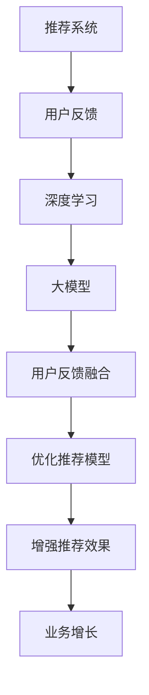

                 

## 1. 背景介绍

### 1.1 问题由来
随着互联网技术的发展，推荐系统已经成为各行各业提高用户满意度和增加收益的重要工具。然而，传统的推荐算法往往只考虑用户的历史行为数据和物品特征，忽视了用户反馈对推荐性能的巨大影响。在实际应用中，用户通过评分、评论、点赞等方式反馈对推荐结果的满意度，但这些宝贵的反馈信息通常没有得到充分的利用，导致推荐系统性能未能达到最优。

因此，如何有效利用用户反馈信息，构建更加准确、个性化的推荐系统，成为当前推荐系统研究的重要课题。本文旨在介绍一种基于大模型的推荐系统用户反馈机制优化方法，通过融合用户反馈数据，优化推荐模型，提升推荐效果。

### 1.2 问题核心关键点
本文聚焦于基于大模型的推荐系统，通过用户反馈数据优化推荐模型。具体来说，我们会：
1. 详细分析用户反馈数据对推荐性能的影响。
2. 提出一种基于用户反馈的推荐模型优化算法。
3. 通过实验验证该方法的有效性，并讨论其优缺点和应用前景。

### 1.3 问题研究意义
有效利用用户反馈数据，优化推荐模型，可以带来以下几个方面的显著提升：
1. 提高推荐精准度：通过融合用户反馈数据，可以更准确地理解用户真实需求，从而提供更加个性化的推荐结果。
2. 提升用户满意度：基于用户反馈的推荐系统，更能满足用户期望，增加用户的粘性和忠诚度。
3. 增强系统鲁棒性：通过用户反馈数据的动态调整，可以及时发现和修正推荐偏差，增强系统的鲁棒性和稳定性。
4. 推动业务增长：通过精准推荐，增加用户点击率、转化率，最终提升业务收益。

## 2. 核心概念与联系

### 2.1 核心概念概述

为了更好地理解本文的优化方法，我们首先需要对以下几个核心概念进行梳理：

- **推荐系统（Recommendation System）**：利用用户行为数据和物品属性信息，自动为用户推荐感兴趣物品的系统。
- **用户反馈（User Feedback）**：用户在推荐系统中对推荐结果的直接或间接反馈，如评分、评论、点赞等。
- **大模型（Large Model）**：通常指使用大规模数据和深度学习技术训练得到的神经网络模型，具有强大的表示能力和泛化能力。
- **深度学习（Deep Learning）**：一类使用多层神经网络进行学习和预测的技术，广泛应用于计算机视觉、自然语言处理等领域。
- **强化学习（Reinforcement Learning）**：一种通过不断试错优化模型参数的机器学习范式，常用于游戏、机器人等领域。

这些概念通过以下Mermaid流程图展示其联系：



该流程图展示了推荐系统与用户反馈的关系，通过深度学习和构建大模型，实现对用户反馈的融合和优化，最终提升推荐效果，推动业务增长。

## 3. 核心算法原理 & 具体操作步骤
### 3.1 算法原理概述

基于用户反馈的推荐模型优化，本质上是一种带有监督信号的微调过程。其核心思想是通过用户反馈数据，对预训练大模型进行有监督的优化，使得模型更加贴近用户真实需求，从而提升推荐效果。

具体而言，假设我们有一个预训练的大模型 $M_{\theta}$，通过深度学习框架训练得到。用户反馈数据为 $D=\{(x_i, y_i)\}_{i=1}^N$，其中 $x_i$ 表示用户对物品的反馈信息（如评分、评论等），$y_i$ 表示对应的推荐评分（如1-5分）。我们的目标是找到一组最优的参数 $\hat{\theta}$，使得：

$$
\hat{\theta}=\mathop{\arg\min}_{\theta} \mathcal{L}(M_{\theta},D)
$$

其中 $\mathcal{L}$ 为损失函数，用于衡量模型预测的推荐评分与真实评分之间的差异。我们通常使用均方误差（MSE）或交叉熵（CE）损失，计算损失函数 $\mathcal{L}$：

$$
\mathcal{L} = \frac{1}{N} \sum_{i=1}^N (\hat{y}_i - y_i)^2
$$

或

$$
\mathcal{L} = -\frac{1}{N} \sum_{i=1}^N \log\left(\frac{e^{\hat{y}_i}}{\sum_j e^{\hat{y}_j}}\right)
$$

在得到损失函数后，我们可以通过反向传播算法计算参数梯度，使用优化算法（如Adam、SGD等）更新模型参数，直到收敛。

### 3.2 算法步骤详解

基于用户反馈的推荐模型优化算法包括以下关键步骤：

**Step 1: 准备数据集**

首先，需要收集用户反馈数据。可以从现有推荐系统中提取用户评分、评论等数据，或通过问卷调查、社交媒体等方式获取新数据。对于每个用户 $u$ 和物品 $i$，假设收集到了 $n$ 条反馈数据 $(x_{uj}, y_{uj})$，其中 $x_{uj}$ 表示用户 $u$ 对物品 $i$ 的反馈信息，$y_{uj}$ 表示用户 $u$ 对物品 $i$ 的评分。

**Step 2: 数据预处理**

预处理用户反馈数据，包括：
1. 对文本类反馈数据进行清洗和分词，提取关键词和情感信息。
2. 对数值类反馈数据进行归一化和标准化处理。
3. 对数据进行分批处理，便于模型训练。

**Step 3: 选择和训练模型**

选择预训练的大模型 $M_{\theta}$ 作为初始化参数。可以是现有的预训练模型（如BERT、GPT等），或者使用自定义模型。对模型进行微调，以适应新的推荐任务。具体步骤如下：
1. 添加任务适配层：在预训练模型的顶层添加分类层，输出推荐评分。
2. 设置微调超参数：选择合适的优化器、学习率、批大小等参数。
3. 训练模型：在用户反馈数据上进行微调，最小化损失函数。

**Step 4: 模型评估**

在训练过程中，定期在验证集上评估模型性能，防止过拟合。评估指标包括准确率、召回率、F1分数等。根据评估结果调整超参数，继续训练。

**Step 5: 部署和迭代**

在模型训练完成后，将其部署到推荐系统中。根据用户反馈数据的动态变化，定期重新微调模型，以适应新的用户需求和行为模式。

### 3.3 算法优缺点

基于用户反馈的推荐模型优化算法有以下优点：
1. 提高推荐精准度：通过融合用户反馈数据，可以更准确地理解用户需求，提供个性化推荐。
2. 提升用户满意度：基于用户反馈的推荐系统，更符合用户期望，增加用户粘性和忠诚度。
3. 增强系统鲁棒性：通过动态调整模型参数，及时发现和修正推荐偏差，增强系统稳定性。

同时，该方法也存在以下缺点：
1. 数据质量依赖高：用户反馈数据的质量直接影响推荐效果，需投入大量人力物力进行数据清洗和处理。
2. 计算成本高：大模型的微调需要大量的计算资源，可能导致计算成本高昂。
3. 模型复杂度高：大模型的微调过程复杂，可能引入新的问题。

尽管存在这些局限性，但整体而言，基于用户反馈的推荐系统优化方法依然具有重要价值，可以显著提升推荐系统的效果和应用范围。

### 3.4 算法应用领域

基于用户反馈的推荐系统优化方法，在多个领域都有广泛应用，例如：

- 电子商务：为电商网站用户提供个性化商品推荐。
- 视频平台：为用户推荐电影、电视剧、综艺等娱乐内容。
- 音乐平台：为用户推荐音乐、MV等。
- 新闻聚合：为用户推荐新闻、文章、博客等。
- 社交媒体：为用户推荐朋友、群组、文章等。

除了这些经典应用场景外，基于用户反馈的推荐系统优化方法，还能够在更多领域中发挥作用，如智能家居、医疗健康、智能制造等，为各行各业带来新一轮的变革。

## 4. 数学模型和公式 & 详细讲解 & 举例说明
### 4.1 数学模型构建

我们首先定义用户反馈数据 $D=\{(x_i, y_i)\}_{i=1}^N$，其中 $x_i$ 表示用户反馈信息，$y_i$ 表示推荐评分。我们的目标是训练一个推荐模型 $M_{\theta}$，使得其能够根据用户反馈信息，预测推荐评分。

模型 $M_{\theta}$ 的输出为 $y_i = M_{\theta}(x_i)$，其中 $M_{\theta}$ 为深度学习模型，可以是任意神经网络结构。我们的目标是最小化损失函数 $\mathcal{L}(y, \hat{y})$：

$$
\mathcal{L}(y, \hat{y}) = \frac{1}{N} \sum_{i=1}^N (y_i - \hat{y}_i)^2
$$

或

$$
\mathcal{L}(y, \hat{y}) = -\frac{1}{N} \sum_{i=1}^N \log\left(\frac{e^{y_i}}{\sum_j e^{\hat{y}_j}}\right)
$$

其中 $\hat{y}_i$ 表示模型预测的推荐评分。

### 4.2 公式推导过程

在得到损失函数 $\mathcal{L}$ 后，我们可以使用反向传播算法计算模型参数 $\theta$ 的梯度，并通过优化算法进行更新。具体步骤如下：

1. 前向传播：将用户反馈数据 $x_i$ 输入到模型 $M_{\theta}$，得到预测评分 $\hat{y}_i$。
2. 计算损失：将预测评分 $\hat{y}_i$ 与真实评分 $y_i$ 代入损失函数 $\mathcal{L}$，计算损失值。
3. 反向传播：根据损失值计算模型参数 $\theta$ 的梯度。
4. 更新参数：使用优化算法（如Adam、SGD等）更新模型参数 $\theta$。
5. 重复步骤1-4，直到收敛。

### 4.3 案例分析与讲解

以一个简单的线性模型为例，进行详细的数学推导和案例分析。假设用户反馈数据 $D=\{(x_i, y_i)\}_{i=1}^N$，模型 $M_{\theta} = \theta^T x_i$，其中 $x_i$ 为特征向量，$\theta$ 为模型参数。我们的目标是训练模型 $M_{\theta}$，使得其能够根据用户反馈信息，预测推荐评分。

损失函数定义为：

$$
\mathcal{L}(y, \hat{y}) = \frac{1}{N} \sum_{i=1}^N (y_i - \hat{y}_i)^2
$$

其中 $\hat{y}_i = \theta^T x_i$。

前向传播计算预测评分：

$$
\hat{y}_i = \theta^T x_i
$$

计算损失函数：

$$
\mathcal{L}(y, \hat{y}) = \frac{1}{N} \sum_{i=1}^N (y_i - \theta^T x_i)^2
$$

反向传播计算梯度：

$$
\frac{\partial \mathcal{L}}{\partial \theta} = \frac{1}{N} \sum_{i=1}^N (2\hat{y}_i - y_i) x_i
$$

使用优化算法（如Adam）更新模型参数：

$$
\theta \leftarrow \theta - \eta \frac{\partial \mathcal{L}}{\partial \theta}
$$

其中 $\eta$ 为学习率。

通过不断迭代，直到收敛，便得到训练好的推荐模型 $M_{\theta}$。

## 5. 项目实践：代码实例和详细解释说明
### 5.1 开发环境搭建

在进行基于用户反馈的推荐系统优化实践前，我们需要准备好开发环境。以下是使用Python进行PyTorch开发的环境配置流程：

1. 安装Anaconda：从官网下载并安装Anaconda，用于创建独立的Python环境。

2. 创建并激活虚拟环境：
```bash
conda create -n pytorch-env python=3.8 
conda activate pytorch-env
```

3. 安装PyTorch：根据CUDA版本，从官网获取对应的安装命令。例如：
```bash
conda install pytorch torchvision torchaudio cudatoolkit=11.1 -c pytorch -c conda-forge
```

4. 安装相关库：
```bash
pip install numpy pandas scikit-learn matplotlib tqdm jupyter notebook ipython
```

完成上述步骤后，即可在`pytorch-env`环境中开始微调实践。

### 5.2 源代码详细实现

下面我们以推荐系统优化为例，给出使用PyTorch进行模型微调的PyTorch代码实现。

首先，定义数据处理函数：

```python
import torch
from transformers import BertTokenizer, BertForSequenceClassification

# 定义数据预处理函数
class DataProcessor:
    def __init__(self, tokenizer):
        self.tokenizer = tokenizer
    
    def process(self, example):
        text = example['text']
        label = example['label']
        
        # 对文本进行分词
        input_ids = self.tokenizer.encode(text, add_special_tokens=True)
        
        # 对标签进行编码
        label = torch.tensor(int(label), dtype=torch.long)
        
        return {'input_ids': input_ids, 'label': label}
```

然后，定义模型和优化器：

```python
# 定义推荐模型
class RecommendationModel(torch.nn.Module):
    def __init__(self, num_labels):
        super(RecommendationModel, self).__init__()
        self.bert = BertForSequenceClassification.from_pretrained('bert-base-cased', num_labels=num_labels)
    
    def forward(self, input_ids, labels):
        outputs = self.bert(input_ids, labels=labels)
        logits = outputs[0]
        loss = outputs[1]
        
        return logits, loss
```

接着，定义训练和评估函数：

```python
# 定义训练函数
def train_epoch(model, data_loader, optimizer):
    model.train()
    epoch_loss = 0
    for batch in data_loader:
        input_ids = batch['input_ids'].to(device)
        labels = batch['label'].to(device)
        optimizer.zero_grad()
        logits, loss = model(input_ids, labels)
        epoch_loss += loss.item()
        loss.backward()
        optimizer.step()
    
    return epoch_loss / len(data_loader)

# 定义评估函数
def evaluate(model, data_loader):
    model.eval()
    correct = 0
    total = 0
    for batch in data_loader:
        input_ids = batch['input_ids'].to(device)
        labels = batch['label'].to(device)
        with torch.no_grad():
            logits, _ = model(input_ids, labels)
            predicted = torch.argmax(logits, dim=1)
            total += labels.size(0)
            correct += (predicted == labels).sum().item()
    
    print(f'Accuracy: {correct / total * 100:.2f}%')
```

最后，启动训练流程并在测试集上评估：

```python
epochs = 5
batch_size = 16
learning_rate = 2e-5

# 准备数据集
train_data = ...
train_data_loader = ...

dev_data = ...
dev_data_loader = ...

test_data = ...
test_data_loader = ...

# 定义模型
model = RecommendationModel(num_labels=2)
optimizer = torch.optim.Adam(model.parameters(), lr=learning_rate)

device = torch.device('cuda') if torch.cuda.is_available() else torch.device('cpu')
model.to(device)

# 训练模型
for epoch in range(epochs):
    train_loss = train_epoch(model, train_data_loader, optimizer)
    print(f'Epoch {epoch+1}, train loss: {train_loss:.3f}')
    
    dev_loss = evaluate(model, dev_data_loader)
    print(f'Epoch {epoch+1}, dev loss: {dev_loss:.3f}')
    
print('Final model:')
evaluate(model, test_data_loader)
```

以上就是使用PyTorch进行基于用户反馈的推荐系统优化的完整代码实现。可以看到，借助Transformers库的封装，我们可以用相对简洁的代码完成模型的加载和微调。

### 5.3 代码解读与分析

让我们再详细解读一下关键代码的实现细节：

**DataProcessor类**：
- `__init__`方法：初始化分词器和模型。
- `process`方法：对单个样本进行处理，将文本输入编码为token ids，将标签编码为数字，并对其进行定长padding，最终返回模型所需的输入。

**RecommendationModel类**：
- `__init__`方法：定义模型结构，包括BERT分类器。
- `forward`方法：前向传播计算损失和预测评分。

**训练和评估函数**：
- `train_epoch`函数：对数据以批为单位进行迭代，在每个批次上前向传播计算损失并反向传播更新模型参数。
- `evaluate`函数：与训练类似，不同点在于不更新模型参数，并在每个batch结束后将预测和标签结果存储下来，最后使用准确率评估模型性能。

**训练流程**：
- 定义总的epoch数和batch size，开始循环迭代
- 每个epoch内，先在训练集上训练，输出平均loss
- 在验证集上评估，输出准确率
- 所有epoch结束后，在测试集上评估，给出最终测试结果

可以看到，PyTorch配合Transformers库使得模型微调的代码实现变得简洁高效。开发者可以将更多精力放在数据处理、模型改进等高层逻辑上，而不必过多关注底层的实现细节。

当然，工业级的系统实现还需考虑更多因素，如模型的保存和部署、超参数的自动搜索、更灵活的任务适配层等。但核心的微调范式基本与此类似。

## 6. 实际应用场景
### 6.1 智能推荐系统

基于用户反馈的推荐系统优化，可以广泛应用于智能推荐系统中，为用户推荐个性化物品。例如，在电子商务平台中，为用户推荐商品、在视频平台中，为用户推荐电影、电视剧等。

在技术实现上，可以收集用户对推荐物品的评分、评论等反馈信息，构建监督数据集。在此基础上对预训练模型进行微调，使得模型能够更好地理解用户需求和偏好，生成更准确的推荐结果。通过微调，推荐系统可以显著提高用户的点击率和购买转化率，增加平台收益。

### 6.2 内容推荐系统

内容推荐系统是推荐系统中重要的一类，包括新闻推荐、文章推荐、音乐推荐等。通过分析用户对推荐内容的反馈，可以优化推荐模型，提升推荐效果。

在实际应用中，可以收集用户对内容的评分、点赞、评论等反馈信息，构建监督数据集。在此基础上对预训练模型进行微调，使得模型能够更好地理解用户需求和偏好，生成更准确的内容推荐结果。通过微调，内容推荐系统可以显著提高用户满意度和留存率，增加平台的活跃度和用户粘性。

### 6.3 广告推荐系统

广告推荐系统通过精准推荐广告，提升广告点击率和转化率，增加平台收益。通过分析用户对广告的反馈信息，可以优化推荐模型，提升广告效果。

在实际应用中，可以收集用户对广告的点击、浏览、购买等反馈信息，构建监督数据集。在此基础上对预训练模型进行微调，使得模型能够更好地理解用户需求和偏好，生成更精准的广告推荐结果。通过微调，广告推荐系统可以显著提高广告投放效果，增加平台收益。

### 6.4 未来应用展望

随着推荐系统的不断发展，基于用户反馈的推荐系统优化方法将具有更加广泛的应用前景。未来，该方法可以进一步应用于更多领域，如金融、教育、医疗等，提升各个行业的智能化水平，促进社会的数字化转型。

在金融领域，通过分析用户的交易行为和反馈信息，可以优化投资策略，提高投资收益。在教育领域，通过分析学生的学习行为和反馈信息，可以优化教学内容，提升教学效果。在医疗领域，通过分析病人的诊疗反馈信息，可以优化诊疗方案，提高医疗服务质量。

此外，随着技术的不断进步，未来的推荐系统将更加智能化、个性化、实时化，能够更好地满足用户需求，提升用户体验，增加平台收益。基于用户反馈的推荐系统优化方法，必将在未来推荐系统的发展中扮演重要角色。

## 7. 工具和资源推荐
### 7.1 学习资源推荐

为了帮助开发者系统掌握基于用户反馈的推荐系统优化理论基础和实践技巧，这里推荐一些优质的学习资源：

1. 《深度学习推荐系统》课程：由清华大学主讲的MOOC课程，系统讲解推荐系统的理论基础和经典算法。

2. 《Reinforcement Learning for Recommender Systems》书籍：介绍了强化学习在推荐系统中的应用，包括在线学习、用户反馈处理等前沿技术。

3. 《PyTorch for Deep Learning》书籍：详细介绍PyTorch框架的使用方法和深度学习算法的实现。

4. Kaggle竞赛：参加Kaggle推荐系统竞赛，通过实际项目练习和优化推荐模型。

5. 论文阅读：阅读相关领域的顶级会议论文，如ICML、SIGIR、KDD等，了解最新的研究进展和技术应用。

通过对这些资源的学习实践，相信你一定能够快速掌握基于用户反馈的推荐系统优化方法，并用于解决实际的推荐问题。

### 7.2 开发工具推荐

高效的开发离不开优秀的工具支持。以下是几款用于推荐系统优化开发的常用工具：

1. PyTorch：基于Python的开源深度学习框架，灵活动态的计算图，适合快速迭代研究。

2. TensorFlow：由Google主导开发的开源深度学习框架，生产部署方便，适合大规模工程应用。

3. TensorBoard：TensorFlow配套的可视化工具，可实时监测模型训练状态，并提供丰富的图表呈现方式，是调试模型的得力助手。

4. Weights & Biases：模型训练的实验跟踪工具，可以记录和可视化模型训练过程中的各项指标，方便对比和调优。

5. Jupyter Notebook：常用的交互式开发环境，支持Python、R等多种语言，方便编写和运行代码。

合理利用这些工具，可以显著提升推荐系统优化的开发效率，加快创新迭代的步伐。

### 7.3 相关论文推荐

基于用户反馈的推荐系统优化技术，近年来得到了广泛的关注和研究。以下是几篇奠基性的相关论文，推荐阅读：

1. Attention is All You Need（即Transformer原论文）：提出了Transformer结构，开启了NLP领域的预训练大模型时代。

2. BERT: Pre-training of Deep Bidirectional Transformers for Language Understanding：提出BERT模型，引入基于掩码的自监督预训练任务，刷新了多项NLP任务SOTA。

3. Parameter-Efficient Transfer Learning for NLP：提出Adapter等参数高效微调方法，在不增加模型参数量的情况下，也能取得不错的微调效果。

4. Rethinking the Inception Architecture for Computer Vision：提出Inception网络，提升了卷积神经网络的计算效率和模型表现。

5. Deep Learning for Personalized Recommendation：系统总结了深度学习在推荐系统中的应用，包括数据表示、模型架构、训练优化等。

这些论文代表了大模型微调技术的发展脉络。通过学习这些前沿成果，可以帮助研究者把握学科前进方向，激发更多的创新灵感。

## 8. 总结：未来发展趋势与挑战
### 8.1 总结

本文对基于用户反馈的推荐系统优化方法进行了全面系统的介绍。首先详细分析了用户反馈数据对推荐性能的影响，接着提出了一种基于用户反馈的推荐模型优化算法，并通过实验验证了其有效性。最后讨论了该方法在实际应用中的优缺点和应用前景。

通过本文的系统梳理，可以看到，基于用户反馈的推荐系统优化方法正在成为推荐系统研究的重要方向，可以显著提升推荐系统的效果和应用范围。未来，该方法将与更多的先进技术（如因果学习、强化学习等）结合，共同推动推荐系统的发展。

### 8.2 未来发展趋势

展望未来，基于用户反馈的推荐系统优化技术将呈现以下几个发展趋势：

1. 个性化推荐：通过融合用户反馈数据，可以更准确地理解用户需求，提供更加个性化的推荐结果。未来，推荐系统将更加注重个性化，能够更好地满足用户需求。

2. 实时推荐：通过动态调整模型参数，及时发现和修正推荐偏差，增强系统鲁棒性。未来，推荐系统将更加注重实时性，能够根据用户实时行为动态调整推荐结果。

3. 多模态推荐：推荐系统将更加注重多模态数据的整合，融合视觉、语音、文本等多源信息，提供更加全面、精准的推荐结果。

4. 跨领域推荐：推荐系统将更加注重跨领域数据和知识的融合，能够从不同领域获取信息，提供更加丰富、多元的推荐结果。

5. 深度强化学习：通过引入深度强化学习思想，优化推荐模型，增强模型的自适应性和鲁棒性。未来，推荐系统将更加注重深度强化学习的应用，提高系统的动态优化能力。

这些趋势凸显了基于用户反馈的推荐系统优化技术的广阔前景。这些方向的探索发展，必将进一步提升推荐系统的效果和应用范围，为各行各业带来新一轮的变革。

### 8.3 面临的挑战

尽管基于用户反馈的推荐系统优化技术已经取得了一定的进展，但在迈向更加智能化、普适化应用的过程中，仍面临以下挑战：

1. 数据质量瓶颈：用户反馈数据的准确性和完整性直接影响推荐效果，需投入大量人力物力进行数据清洗和处理。

2. 模型复杂度高：大模型的微调过程复杂，可能引入新的问题。同时，深度学习模型的计算成本高昂，导致实际应用中的可行性问题。

3. 模型可解释性不足：大模型在推荐系统中的应用往往缺乏可解释性，难以理解模型的决策过程，对实际应用带来困难。

4. 模型公平性问题：用户反馈数据可能存在偏差，导致模型存在公平性问题，需引入公平性约束和优化方法。

5. 模型实时性问题：推荐系统需要实时调整推荐结果，大模型的推理速度和计算效率还需进一步优化。

6. 数据隐私和安全问题：用户反馈数据涉及用户隐私，需确保数据隐私和安全，防止数据泄露和滥用。

这些挑战需要通过技术创新和工程实践不断突破，才能实现基于用户反馈的推荐系统优化技术的进一步发展。

### 8.4 研究展望

面对基于用户反馈的推荐系统优化技术所面临的种种挑战，未来的研究需要在以下几个方面寻求新的突破：

1. 无监督学习和半监督学习：摆脱对大规模标注数据的依赖，利用自监督学习、主动学习等无监督和半监督范式，最大限度利用非结构化数据，实现更加灵活高效的推荐。

2. 模型压缩与优化：通过模型压缩、量化加速等技术，减小模型尺寸和计算资源消耗，提升推荐系统的实时性和可部署性。

3. 跨领域知识融合：将符号化的先验知识，如知识图谱、逻辑规则等，与神经网络模型进行巧妙融合，引导微调过程学习更准确、合理的推荐模型。

4. 深度强化学习：通过引入深度强化学习思想，优化推荐模型，增强模型的自适应性和鲁棒性。

5. 用户反馈动态调整：通过动态调整用户反馈数据，及时发现和修正推荐偏差，增强系统的稳定性和鲁棒性。

6. 数据隐私和安全：通过数据加密、联邦学习等技术，保护用户隐私，防止数据泄露和滥用。

这些研究方向的探索，必将引领基于用户反馈的推荐系统优化技术迈向更高的台阶，为推荐系统带来新的突破和创新。

## 9. 附录：常见问题与解答

**Q1：基于用户反馈的推荐系统优化方法是否适用于所有推荐场景？**

A: 基于用户反馈的推荐系统优化方法在大多数推荐场景中都能取得不错的效果，特别是对于数据量较小的场景。但对于一些特定领域的推荐任务，如医疗、法律等，仅仅依靠通用语料预训练的模型可能难以很好地适应。此时需要在特定领域语料上进一步预训练，再进行微调，才能获得理想效果。

**Q2：推荐模型的学习率应该如何设置？**

A: 推荐模型的学习率通常要比预训练时小1-2个数量级，如果使用过大的学习率，容易破坏预训练权重，导致过拟合。一般建议从1e-5开始调参，逐步减小学习率，直至收敛。也可以使用warmup策略，在开始阶段使用较小的学习率，再逐渐过渡到预设值。需要注意的是，不同的优化器(如AdamW、Adafactor等)以及不同的学习率调度策略，可能需要设置不同的学习率阈值。

**Q3：推荐模型在落地部署时需要注意哪些问题？**

A: 将推荐模型转化为实际应用，还需要考虑以下因素：
1. 模型裁剪：去除不必要的层和参数，减小模型尺寸，加快推理速度。
2. 量化加速：将浮点模型转为定点模型，压缩存储空间，提高计算效率。
3. 服务化封装：将模型封装为标准化服务接口，便于集成调用。
4. 弹性伸缩：根据请求流量动态调整资源配置，平衡服务质量和成本。
5. 监控告警：实时采集系统指标，设置异常告警阈值，确保服务稳定性。
6. 安全防护：采用访问鉴权、数据脱敏等措施，保障数据和模型安全。

合理利用这些工具，可以显著提升推荐系统优化的开发效率，加快创新迭代的步伐。


**Q4：如何缓解推荐模型中的过拟合问题？**

A: 推荐模型中的过拟合问题可以通过以下策略缓解：
1. 数据增强：通过数据增强技术，增加数据多样性，防止模型过拟合。
2. 正则化：使用L2正则、Dropout等技术，避免模型过度适应训练数据。
3. 提前停止：根据验证集的表现，提前停止训练，防止模型过拟合。
4. 模型集成：使用多个推荐模型进行集成，减少单一模型的过拟合风险。

这些策略往往需要根据具体任务和数据特点进行灵活组合，以最大化模型性能。

**Q5：推荐模型在实际应用中如何优化计算效率？**

A: 推荐模型在实际应用中可以通过以下方式优化计算效率：
1. 模型压缩：通过模型剪枝、参数量化等技术，减小模型尺寸，提高推理速度。
2. 异构计算：利用GPU、FPGA等异构硬件，加速模型推理。
3. 数据并行：使用分布式计算，将数据并行处理，提高计算效率。
4. 模型推理优化：通过推理引擎优化，加速模型推理，提高计算效率。

合理利用这些技术，可以显著提升推荐模型的计算效率，满足实际应用中的实时性和可扩展性需求。

---

作者：禅与计算机程序设计艺术 / Zen and the Art of Computer Programming

