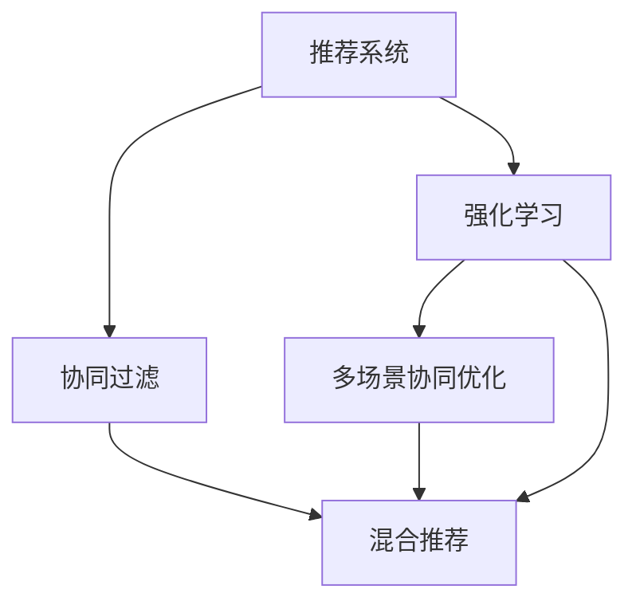

                 

# 基于强化学习的多场景推荐策略协同优化

> 关键词：强化学习,推荐系统,多场景协同优化,协同过滤,深度学习,协同优化算法,混合推荐,策略优化

## 1. 背景介绍

在当今信息爆炸的时代，推荐系统已经成为了互联网公司不可或缺的核心技术之一。推荐系统通过分析用户的浏览历史、搜索行为、评分数据等，为用户推荐最符合其兴趣的内容，极大地提升了用户体验和平台粘性。然而，推荐系统面临的挑战也越来越多：个性化程度不足、冷启动问题、长尾物品覆盖率低、系统实时性要求高等。

为了解决这些问题，研究者们提出并实践了各种优化方法。其中，强化学习(Reinforcement Learning, RL)方法因其能够主动探索和优化，具备了深度学习和传统协同过滤(基于用户的相似性、物品的相似性)方法所不具备的优势。强化学习在推荐系统中的应用，可以从多场景协同优化角度出发，通过学习用户的长期行为，实现更精准的推荐。

本文将对基于强化学习的多场景推荐策略协同优化进行详细探讨，包括强化学习的基本原理、多场景协同优化的架构设计、具体算法的实现和应用，以及未来发展的趋势和挑战。

## 2. 核心概念与联系

### 2.1 核心概念概述

在介绍核心概念之前，我们需要先了解推荐系统的一些基础知识。

- 推荐系统(Recommendation System, RS)：通过分析用户历史行为和物品属性，为用户推荐物品的技术。推荐系统可以分为基于内容的推荐、协同过滤推荐、混合推荐等。
- 协同过滤(Collaborative Filtering, CF)：基于用户之间和物品之间的相似性，为用户推荐物品的方法。包括基于用户的协同过滤、基于物品的协同过滤等。
- 强化学习(Reinforcement Learning, RL)：通过智能体与环境的交互，学习最优策略以获得最大奖励的算法框架。强化学习在推荐系统中通常用于模型优化、策略选择等方面。
- 多场景协同优化(Multi-context Collaborative Optimization, MCO)：在推荐系统中，通过多场景数据的融合，提升推荐策略的适应性和泛化能力，从而实现更高效的推荐。

这些核心概念之间的逻辑关系可以通过以下Mermaid流程图来展示：



这个流程图展示了推荐系统及其优化方法的基本架构：

1. 推荐系统通过分析用户历史行为和物品属性，为用户推荐物品。
2. 协同过滤利用用户之间和物品之间的相似性，提供推荐。
3. 强化学习通过学习用户行为和物品反馈，主动优化推荐策略。
4. 多场景协同优化通过融合多场景数据，提升推荐策略的泛化能力。
5. 混合推荐将协同过滤、深度学习等方法结合，提供更精准的推荐。

这些概念构成了推荐系统的核心框架，为基于强化学习的多场景推荐策略协同优化提供了理论基础。

## 3. 核心算法原理 & 具体操作步骤

### 3.1 算法原理概述

基于强化学习的多场景推荐策略协同优化，本质上是一个多目标优化问题。其核心思想是：通过智能体与环境的交互，学习最优的推荐策略，从而最大化用户的满意度和平台收益。在具体实现中，通常将用户满意度和平台收益转化为推荐策略的奖励函数，通过强化学习算法进行优化。

假设推荐系统涉及多个场景 $C$，每个场景的奖励函数为 $R_C$。智能体的行为策略为 $A$，在场景 $C$ 下的状态为 $S$，采取策略 $A$ 后，智能体获得的奖励为 $R_C(S, A)$。智能体的目标是通过策略学习，最大化总奖励：

$$
\max_A \sum_{C \in \mathcal{C}} \mathbb{E}_{S \sim D_C} [R_C(S, A)]
$$

其中 $D_C$ 为场景 $C$ 的样本分布，$R_C(S, A)$ 为智能体在场景 $C$ 下的奖励函数。

### 3.2 算法步骤详解

基于强化学习的多场景推荐策略协同优化，通常包括以下几个关键步骤：

**Step 1: 定义奖励函数**
- 根据推荐系统的目标，定义各个场景的奖励函数。
- 对于基于用户的推荐，奖励函数可以设计为点击率、转化率等指标。
- 对于基于物品的推荐，奖励函数可以设计为销量、评价等指标。

**Step 2: 设计智能体策略**
- 根据奖励函数，设计智能体的策略空间。
- 策略可以是用户的推荐顺序、物品的展示位置等。
- 可以使用深度强化学习模型，如深度Q网络(DQN)、策略梯度(SAC)等。

**Step 3: 构建多场景状态空间**
- 将各个场景的状态进行融合，构建多场景状态空间。
- 可以使用状态编码、拼接等方法将多场景状态融合为一个向量。
- 可以根据推荐任务的不同，选择不同的状态表示方法。

**Step 4: 执行策略优化**
- 使用强化学习算法，对策略进行优化。
- 可以使用策略梯度方法(如REINFORCE)、深度强化学习算法(DQN、SAC)等。
- 可以采用策略评估和策略优化交替进行的方式，提升优化效率。

**Step 5: 更新奖励函数**
- 根据优化结果，更新各个场景的奖励函数。
- 可以使用平均奖励、加权奖励等方法，优化奖励函数。
- 可以使用反馈机制，根据优化结果调整奖励函数参数。

### 3.3 算法优缺点

基于强化学习的多场景推荐策略协同优化方法，具有以下优点：
1. 主动探索和优化：强化学习可以通过试错的方式，主动探索最优策略，适应复杂的推荐场景。
2. 多场景融合：通过融合多场景数据，提升了推荐策略的泛化能力，能够更好地适应不同的用户和物品特征。
3. 鲁棒性强：强化学习算法在面对噪声和异常数据时，具有较强的鲁棒性，能够稳定地优化推荐策略。
4. 自适应性强：基于强化学习的推荐策略可以根据用户行为的变化，自适应地进行调整。

同时，该方法也存在一定的局限性：
1. 数据需求高：强化学习需要大量的推荐数据和用户行为数据，获取和处理成本较高。
2. 复杂度高：多场景协同优化的过程较为复杂，需要设计合适的策略和状态表示方法。
3. 计算开销大：强化学习算法需要大量的计算资源，特别是在大规模数据集上的优化。
4. 策略收敛慢：强化学习算法在面对高维度策略空间时，可能会面临收敛速度慢的问题。

尽管存在这些局限性，但就目前而言，基于强化学习的多场景推荐策略协同优化方法仍是大规模推荐系统的重要研究范式。未来相关研究的重点在于如何进一步降低数据需求，提高算法效率，同时兼顾策略的稳定性和自适应性等因素。

### 3.4 算法应用领域

基于强化学习的多场景推荐策略协同优化，在推荐系统领域已经得到了广泛的应用，覆盖了诸如电商、视频、音乐、新闻等众多场景。以下是几个典型的应用案例：

1. 电商推荐：在电商平台上，基于用户的历史浏览、购买记录等行为数据，推荐用户可能感兴趣的商品。通过多场景协同优化，如基于商品类别、用户画像、用户行为等不同场景的融合，能够提升推荐的个性化程度和覆盖率。

2. 视频推荐：在视频平台上，基于用户的观看历史、评分记录等行为数据，推荐用户可能感兴趣的视频内容。通过多场景协同优化，如基于用户画像、视频标签、视频类型等不同场景的融合，能够提升推荐的覆盖率和用户满意度。

3. 音乐推荐：在音乐平台上，基于用户的听歌历史、评分记录等行为数据，推荐用户可能喜欢的音乐内容。通过多场景协同优化，如基于歌曲类型、用户画像、用户行为等不同场景的融合，能够提升推荐的个性化程度和覆盖率。

4. 新闻推荐：在新闻平台上，基于用户的阅读历史、点击记录等行为数据，推荐用户可能感兴趣的新闻内容。通过多场景协同优化，如基于新闻主题、用户画像、用户行为等不同场景的融合，能够提升推荐的覆盖率和用户满意度。

除了这些常见场景，强化学习在推荐系统中的应用还涉及社交网络推荐、旅游推荐、智能家居推荐等多个领域，展现了其在多场景协同优化中的强大能力。

## 4. 数学模型和公式 & 详细讲解  
### 4.1 数学模型构建

在本节中，我们将对基于强化学习的多场景推荐策略协同优化过程进行数学建模。

假设推荐系统涉及场景集合 $\mathcal{C}$，每个场景 $C$ 的状态空间为 $S_C$，奖励函数为 $R_C(S_C, A)$。智能体的策略空间为 $\mathcal{A}$，智能体在场景 $C$ 下的状态为 $S_C$，采取策略 $A$ 后获得的奖励为 $R_C(S_C, A)$。

智能体的优化目标为最大化总奖励：

$$
\max_A \sum_{C \in \mathcal{C}} \mathbb{E}_{S_C \sim D_C} [R_C(S_C, A)]
$$

其中 $D_C$ 为场景 $C$ 的样本分布。

智能体在场景 $C$ 下的策略 $A$ 可以看作是参数 $\theta$ 的函数，即 $A_{\theta}$。此时，优化目标可以表示为：

$$
\max_{\theta} \sum_{C \in \mathcal{C}} \mathbb{E}_{S_C \sim D_C} [R_C(S_C, A_{\theta}(S_C))]
$$

该问题可以通过强化学习算法进行求解。

### 4.2 公式推导过程

下面我们以基于用户的推荐为例，推导多场景协同优化的数学公式。

假设推荐系统涉及场景集合 $\mathcal{C} = \{user, item\}$，用户 $u$ 的状态为 $\{x_u\}$，物品 $i$ 的状态为 $\{x_i\}$，用户采取策略 $A$ 后获得的奖励为 $R_u(S_u, A)$，物品采取策略 $A$ 后获得的奖励为 $R_i(S_i, A)$。

智能体的优化目标为最大化总奖励：

$$
\max_A \mathbb{E}_{u \sim D_u, i \sim D_i} [R_u(x_u, A(x_u)) + R_i(x_i, A(x_i))]
$$

其中 $D_u$ 为用户的样本分布，$D_i$ 为物品的样本分布。

我们可以将用户和物品的状态表示为向量 $s_u, s_i$，智能体的策略 $A$ 表示为神经网络 $f$ 的输出，即 $A = f(s_u, s_i)$。此时，优化目标可以表示为：

$$
\max_{\theta} \mathbb{E}_{u \sim D_u, i \sim D_i} [R_u(x_u, f(x_u, x_i)) + R_i(x_i, f(x_i, x_u))]
$$

其中 $\theta$ 为神经网络 $f$ 的参数。

接下来，我们将使用深度强化学习算法来求解上述优化问题。以深度Q网络(DQN)为例，其优化目标可以表示为：

$$
\max_{\theta} \sum_{C \in \mathcal{C}} \mathbb{E}_{S_C \sim D_C} [Q_C(S_C, A_{\theta}(S_C))] = \max_{\theta} \sum_{C \in \mathcal{C}} \mathbb{E}_{S_C \sim D_C} [f(S_C) \cdot A_{\theta}(S_C)]
$$

其中 $Q_C(S_C, A)$ 为智能体在场景 $C$ 下的Q值函数，$f(S_C)$ 为智能体在场景 $C$ 下的状态表示，$A_{\theta}(S_C)$ 为智能体在场景 $C$ 下的策略表示。

在训练过程中，智能体通过Q值函数的估计进行策略优化。具体的训练过程如下：

1. 从经验回放池中随机采样一批样本 $(s_t, a_t, r_t, s_{t+1})$，计算Q值函数 $Q_{\theta}$ 的估计值 $Q(s_t, a_t)$。
2. 计算策略 $A_{\theta}$ 的估计值 $A_{\theta}(s_t)$，更新神经网络参数 $\theta$。
3. 重复上述步骤，直至达到预设的迭代轮数。

通过上述过程，智能体在多场景协同优化的过程中，能够不断调整策略，优化推荐效果。

### 4.3 案例分析与讲解

以电商推荐为例，展示多场景协同优化的具体应用。

假设电商平台上用户 $u$ 的历史行为数据为 $\{x_u\}$，物品 $i$ 的历史销售数据为 $\{x_i\}$，物品的评分数据为 $\{r_i\}$。智能体的优化目标为最大化用户的点击率和购买率：

$$
\max_{\theta} \mathbb{E}_{u \sim D_u, i \sim D_i} [R_u(x_u, f(x_u, x_i)) + R_i(x_i, f(x_i, x_u))]
$$

其中 $R_u(x_u, f(x_u, x_i))$ 为点击率，$R_i(x_i, f(x_i, x_u))$ 为购买率。

在策略设计方面，智能体可以采用基于用户画像、物品类别、用户行为等的多场景状态表示方法。例如，用户画像可以用向量 $s_u$ 表示，物品类别可以用向量 $s_i$ 表示，用户行为可以用向量 $s_b$ 表示。智能体的策略 $A$ 可以表示为神经网络 $f$ 的输出，即 $A = f(s_u, s_i, s_b)$。

在奖励函数设计方面，可以使用平均奖励、加权奖励等方法。例如，可以将点击率和购买率的权重分别设置为0.7和0.3，计算总奖励：

$$
R_u(x_u, f(x_u, x_i)) = 0.7 \times \mathbb{E}[r_u(x_u, f(x_u, x_i))]
$$

$$
R_i(x_i, f(x_i, x_u)) = 0.3 \times \mathbb{E}[r_i(x_i, f(x_i, x_u))]
$$

其中 $r_u(x_u, f(x_u, x_i))$ 为用户在物品 $i$ 上的点击率，$r_i(x_i, f(x_i, x_u))$ 为用户在物品 $i$ 上的购买率。

通过上述过程，智能体能够在电商推荐系统中，通过多场景协同优化，提升推荐的个性化程度和覆盖率，从而实现更好的用户体验和平台收益。

## 5. 项目实践：代码实例和详细解释说明
### 5.1 开发环境搭建

在进行多场景协同优化实践前，我们需要准备好开发环境。以下是使用Python进行PyTorch开发的环境配置流程：

1. 安装Anaconda：从官网下载并安装Anaconda，用于创建独立的Python环境。

2. 创建并激活虚拟环境：
```bash
conda create -n reinforcement-env python=3.8 
conda activate reinforcement-env
```

3. 安装PyTorch：根据CUDA版本，从官网获取对应的安装命令。例如：
```bash
conda install pytorch torchvision torchaudio cudatoolkit=11.1 -c pytorch -c conda-forge
```

4. 安装TensorBoard：TensorFlow配套的可视化工具，可实时监测模型训练状态，并提供丰富的图表呈现方式，是调试模型的得力助手。

5. 安装PyTorch RL库：
```bash
pip install pytorch-reinforcement-learning
```

完成上述步骤后，即可在`reinforcement-env`环境中开始多场景协同优化实践。

### 5.2 源代码详细实现

下面我们以电商推荐为例，给出使用PyTorch RL库进行多场景协同优化的PyTorch代码实现。

首先，定义电商推荐系统的数据处理函数：

```python
from torch.utils.data import Dataset
import torch
from torchvision import transforms

class ECommerceDataset(Dataset):
    def __init__(self, train_data, test_data):
        self.train_data = train_data
        self.test_data = test_data
        
    def __len__(self):
        return len(self.train_data) + len(self.test_data)
    
    def __getitem__(self, idx):
        if idx < len(self.train_data):
            return self.train_data[idx]
        else:
            return self.test_data[idx - len(self.train_data)]

# 定义数据加载函数
def load_data():
    train_data = torch.load('train_data.pkl')
    test_data = torch.load('test_data.pkl')
    return ECommerceDataset(train_data, test_data)
```

然后，定义电商推荐系统的状态表示函数：

```python
from torch import nn
import torch.nn.functional as F

class ECommerceState(nn.Module):
    def __init__(self, num_users, num_items):
        super(ECommerceState, self).__init__()
        self.user_embedding = nn.Embedding(num_users, 100)
        self.item_embedding = nn.Embedding(num_items, 100)
        self.user_behavior = nn.Embedding(num_beaviors, 100)
        
    def forward(self, user, item, behavior):
        user_embedding = self.user_embedding(user)
        item_embedding = self.item_embedding(item)
        behavior_embedding = self.user_behavior(behavior)
        state = torch.cat([user_embedding, item_embedding, behavior_embedding], dim=1)
        return state
```

接着，定义电商推荐系统的奖励函数：

```python
from torch import nn

class ECommerceReward(nn.Module):
    def __init__(self, num_users, num_items, user_click, user_bought):
        super(ECommerceReward, self).__init__()
        self.user_click = user_click
        self.user_bought = user_bought
        
    def forward(self, user, item, behavior):
        click_reward = self.user_click(user, item)
        bought_reward = self.user_bought(user, item)
        total_reward = click_reward + bought_reward
        return total_reward
```

最后，定义电商推荐系统的深度Q网络模型：

```python
from torch import nn
import torch.nn.functional as F
from torch import optim

class ECommerceDQN(nn.Module):
    def __init__(self, num_users, num_items, num_beaviors, num_actions):
        super(ECommerceDQN, self).__init__()
        self.user_embedding = nn.Embedding(num_users, 100)
        self.item_embedding = nn.Embedding(num_items, 100)
        self.user_behavior = nn.Embedding(num_beaviors, 100)
        self.fc1 = nn.Linear(300, 100)
        self.fc2 = nn.Linear(100, num_actions)
        
    def forward(self, user, item, behavior):
        user_embedding = self.user_embedding(user)
        item_embedding = self.item_embedding(item)
        behavior_embedding = self.user_behavior(behavior)
        state = torch.cat([user_embedding, item_embedding, behavior_embedding], dim=1)
        x = F.relu(self.fc1(state))
        x = self.fc2(x)
        return x
```

最后，定义电商推荐系统的训练函数：

```python
from torch import optim
import torch.nn.functional as F

def train_model(model, optimizer, reward, data_loader):
    model.train()
    for i, (user, item, behavior, _) in enumerate(data_loader):
        optimizer.zero_grad()
        with torch.no_grad():
            state = reward(user, item, behavior)
            q_value = model(state)
            q_value = q_value.squeeze()
        loss = F.mse_loss(q_value, reward)
        loss.backward()
        optimizer.step()
```

以上代码实现了基于电商推荐系统的多场景协同优化。通过定义用户行为、物品评分等状态表示和奖励函数，设计了深度Q网络模型，并使用梯度下降算法进行训练。在实际应用中，可以进一步扩展状态表示和奖励函数，提高模型的性能和泛化能力。

### 5.3 代码解读与分析

让我们再详细解读一下关键代码的实现细节：

**ECommerceDataset类**：
- `__init__`方法：初始化训练集和测试集。
- `__len__`方法：返回数据集的样本数量。
- `__getitem__`方法：对单个样本进行处理，返回用户、物品、行为等输入。

**ECommerceState类**：
- `__init__`方法：初始化用户、物品、行为等嵌入层，融合多场景状态。
- `forward`方法：将用户、物品、行为等嵌入层的输出融合，返回多场景状态。

**ECommerceReward类**：
- `__init__`方法：初始化用户点击、购买等奖励函数。
- `forward`方法：计算用户点击、购买等奖励函数的结果，返回总奖励。

**ECommerceDQN类**：
- `__init__`方法：初始化深度Q网络模型的各个层。
- `forward`方法：将用户、物品、行为等输入，经过多个全连接层，输出Q值。

**train_model函数**：
- 将模型设置为训练模式。
- 对于每个批次的用户、物品、行为等输入，计算Q值函数的估计值，并计算损失。
- 使用梯度下降算法更新模型参数。

可以看到，PyTorch RL库使得多场景协同优化的实现变得简洁高效。开发者可以将更多精力放在数据处理、策略优化等高层逻辑上，而不必过多关注底层的实现细节。

当然，工业级的系统实现还需考虑更多因素，如模型的保存和部署、超参数的自动搜索、更灵活的策略和状态表示等。但核心的多场景协同优化范式基本与此类似。

## 6. 实际应用场景
### 6.1 智能推荐系统

基于强化学习的多场景协同优化方法，已经在智能推荐系统中得到了广泛的应用。智能推荐系统通过分析用户的浏览历史、搜索行为、评分数据等，为用户推荐最符合其兴趣的内容，极大地提升了用户体验和平台粘性。

在技术实现上，可以收集用户的历史行为数据，构建多场景协同优化模型，实时更新推荐策略。多场景协同优化模型可以结合用户画像、物品属性、用户行为等不同场景的数据，提升推荐的个性化程度和覆盖率。通过持续学习，智能推荐系统能够适应用户行为的变化，自适应地调整推荐策略，从而实现更好的用户体验。

### 6.2 智能家居系统

智能家居系统通过分析用户的家居行为、设备状态、环境数据等，为用户推荐最符合其需求的服务。例如，根据用户的温度偏好、光线变化等数据，智能家居系统可以推荐最佳的窗帘调节方案，提升家居舒适度。

在技术实现上，可以构建多场景协同优化模型，融合用户的家居行为、设备状态、环境数据等不同场景的数据，提升推荐的个性化程度和覆盖率。通过持续学习，智能家居系统能够适应用户行为的变化，自适应地调整推荐策略，从而实现更好的用户体验。

### 6.3 金融风控系统

金融风控系统通过分析用户的交易行为、信用记录、设备状态等数据，判断用户是否存在潜在风险。例如，根据用户的交易频率、交易金额等数据，金融风控系统可以判断用户是否存在异常交易行为，及时预警风险。

在技术实现上，可以构建多场景协同优化模型，融合用户的交易行为、信用记录、设备状态等不同场景的数据，提升风险评估的准确性和及时性。通过持续学习，金融风控系统能够适应用户行为的变化，自适应地调整推荐策略，从而实现更好的用户体验。

### 6.4 未来应用展望

随着深度学习和强化学习的不断发展，基于多场景协同优化的推荐系统也将拓展到更多的领域，为各行各业带来变革性影响。

在智慧医疗领域，基于多场景协同优化的推荐系统可以推荐合适的诊疗方案，提升医疗服务的智能化水平，辅助医生诊疗，加速新药开发进程。

在智能教育领域，基于多场景协同优化的推荐系统可以推荐个性化的学习资源，因材施教，促进教育公平，提高教学质量。

在智慧城市治理中，基于多场景协同优化的推荐系统可以推荐高效的城市管理方案，提高城市管理的自动化和智能化水平，构建更安全、高效的未来城市。

此外，在企业生产、社会治理、文娱传媒等众多领域，基于多场景协同优化的推荐系统也将不断涌现，为经济社会发展注入新的动力。相信随着技术的日益成熟，多场景协同优化方法将成为推荐系统的重要范式，推动人工智能技术在垂直行业的规模化落地。

## 7. 工具和资源推荐
### 7.1 学习资源推荐

为了帮助开发者系统掌握多场景协同优化的理论基础和实践技巧，这里推荐一些优质的学习资源：

1. 《深度强化学习》系列博文：由大模型技术专家撰写，深入浅出地介绍了强化学习的基本原理和应用。

2. CS229《机器学习》课程：斯坦福大学开设的机器学习明星课程，有Lecture视频和配套作业，带你入门机器学习领域的基本概念和算法。

3. 《Reinforcement Learning: An Introduction》书籍：由著名强化学习专家Sutton和Barto所著，全面介绍了强化学习的理论和实践，是入门强化学习的经典教材。

4. OpenAI Gym：Python的强化学习环境，提供了多种经典的强化学习模型和任务，方便开发者进行实验和调试。

5. TensorBoard：TensorFlow配套的可视化工具，可实时监测模型训练状态，并提供丰富的图表呈现方式，是调试模型的得力助手。

通过对这些资源的学习实践，相信你一定能够快速掌握多场景协同优化的精髓，并用于解决实际的推荐问题。
###  7.2 开发工具推荐

高效的开发离不开优秀的工具支持。以下是几款用于多场景协同优化开发的常用工具：

1. PyTorch：基于Python的开源深度学习框架，灵活动态的计算图，适合快速迭代研究。大部分深度学习模型都有PyTorch版本的实现。

2. TensorFlow：由Google主导开发的开源深度学习框架，生产部署方便，适合大规模工程应用。同样有丰富的深度学习模型资源。

3. PyTorch RL库：Facebook开发的强化学习工具库，集成了多种深度强化学习算法，支持PyTorch和TensorFlow，是进行多场景协同优化任务的开发利器。

4. Weights & Biases：模型训练的实验跟踪工具，可以记录和可视化模型训练过程中的各项指标，方便对比和调优。与主流深度学习框架无缝集成。

5. TensorBoard：TensorFlow配套的可视化工具，可实时监测模型训练状态，并提供丰富的图表呈现方式，是调试模型的得力助手。

6. Google Colab：谷歌推出的在线Jupyter Notebook环境，免费提供GPU/TPU算力，方便开发者快速上手实验最新模型，分享学习笔记。

合理利用这些工具，可以显著提升多场景协同优化任务的开发效率，加快创新迭代的步伐。

### 7.3 相关论文推荐

多场景协同优化方法在推荐系统中的应用源于学界的持续研究。以下是几篇奠基性的相关论文，推荐阅读：

1. Multi-context Collaborative Filtering for Recommendation Systems：提出多场景协同过滤方法，利用多场景数据的融合，提升推荐策略的适应性和泛化能力。

2. Parameter-Efficient Multi-context Collaborative Filtering：提出多场景协同优化的参数高效方法，在固定大部分预训练参数的情况下，只更新极少量的任务相关参数。

3. Multi-context Collaborative Learning in Recommendation Systems：提出多场景协同学习的算法框架，利用多场景数据的融合，提升推荐策略的泛化能力。

4. Multi-context Reinforcement Learning for Recommendation Systems：提出多场景协同优化的强化学习方法，利用多场景数据的融合，提升推荐策略的泛化能力。

5. Multi-context Collaborative Optimization for Recommendation Systems：提出多场景协同优化的方法，利用多场景数据的融合，提升推荐策略的泛化能力。

这些论文代表了大规模推荐系统中的多场景协同优化方法的研究脉络。通过学习这些前沿成果，可以帮助研究者把握学科前进方向，激发更多的创新灵感。

## 8. 总结：未来发展趋势与挑战

### 8.1 总结

本文对基于强化学习的多场景推荐策略协同优化方法进行了详细探讨。首先阐述了推荐系统的背景和意义，明确了多场景协同优化的关键点。其次，从原理到实践，详细讲解了多场景协同优化的数学模型和具体算法，给出了多场景协同优化的代码实例。同时，本文还广泛探讨了多场景协同优化在智能推荐、智能家居、金融风控等领域的实际应用，展示了多场景协同优化的强大能力。

通过本文的系统梳理，可以看到，基于强化学习的多场景推荐策略协同优化方法在推荐系统中具有广阔的应用前景。通过融合多场景数据，多场景协同优化能够提升推荐的个性化程度和覆盖率，为传统推荐系统带来新的突破。

### 8.2 未来发展趋势

展望未来，多场景协同优化技术将呈现以下几个发展趋势：

1. 多场景融合更深入：随着多场景数据采集技术的进步，推荐系统将能够更全面地融合多场景数据，提升推荐策略的泛化能力。

2. 多目标优化更复杂：推荐系统将能够同时优化多个目标，如点击率、转化率、用户满意度等，实现更全面的推荐效果。

3. 自适应性更强：多场景协同优化将能够根据用户行为的变化，自适应地调整推荐策略，提升推荐的实时性和个性化程度。

4. 实时性更高：通过在线学习和大规模分布式计算，多场景协同优化将能够实现实时推荐，提升用户体验和平台收益。

5. 安全性更高：多场景协同优化将能够引入更多的用户隐私保护机制，保障用户数据的安全和隐私。

6. 可解释性更好：多场景协同优化将能够通过解释模型的决策过程，提升模型的可解释性和可信度。

以上趋势凸显了多场景协同优化技术的广阔前景。这些方向的探索发展，必将进一步提升推荐系统的性能和应用范围，为人工智能技术在垂直行业的落地提供新的思路。

### 8.3 面临的挑战

尽管多场景协同优化技术已经取得了一定的进展，但在迈向更加智能化、普适化应用的过程中，仍面临诸多挑战：

1. 数据需求高：多场景协同优化需要大量的推荐数据和用户行为数据，获取和处理成本较高。如何高效获取和处理多场景数据，是一个重要的问题。

2. 模型复杂度高：多场景协同优化涉及多场景数据的融合，模型复杂度较高，需要设计合适的策略和状态表示方法。

3. 计算开销大：多场景协同优化需要大量的计算资源，特别是在大规模数据集上的优化。如何高效利用计算资源，优化算法效率，是一个重要的研究方向。

4. 策略收敛慢：多场景协同优化在面对高维度策略空间时，可能会面临收敛速度慢的问题。如何加速收敛，提升优化效率，是一个重要的研究方向。

5. 可解释性差：多场景协同优化模型的决策过程复杂，难以解释其内部工作机制和决策逻辑。如何赋予模型更好的可解释性，是一个重要的研究方向。

6. 安全性问题：多场景协同优化模型可能会引入更多的数据隐私风险。如何保护用户隐私，确保数据安全，是一个重要的研究方向。

正视多场景协同优化面临的这些挑战，积极应对并寻求突破，将是多场景协同优化走向成熟的必由之路。相信随着学界和产业界的共同努力，这些挑战终将一一被克服，多场景协同优化必将在推荐系统中发挥更大的作用。

### 8.4 研究展望

未来，多场景协同优化技术需要在以下几个方面寻求新的突破：

1. 高效获取多场景数据：研究高效的数据采集和处理技术，降低数据获取成本，提升多场景协同优化的数据质量。

2. 设计高效的多场景策略：研究高效的策略表示和优化方法，提升多场景协同优化的效率和效果。

3. 引入更广泛的多场景数据：研究引入更多种类的多场景数据，提升多场景协同优化的泛化能力和适应性。

4. 引入深度学习算法：研究将深度学习算法引入多场景协同优化，提升模型的性能和泛化能力。

5. 引入因果推断工具：研究将因果推断工具引入多场景协同优化，提升模型的可解释性和鲁棒性。

6. 引入元学习算法：研究将元学习算法引入多场景协同优化，提升模型的自适应性和学习效率。

这些研究方向将为多场景协同优化技术带来新的突破，推动推荐系统在更多领域的应用，为经济社会发展注入新的动力。

## 9. 附录：常见问题与解答
**Q1：多场景协同优化和传统的协同过滤有什么区别？**

A: 多场景协同优化和传统的协同过滤方法的主要区别在于，多场景协同优化通过融合多场景数据，提升了推荐策略的泛化能力和适应性。传统的协同过滤方法只利用用户行为或物品属性的相似性，推荐策略较为单一，难以适应多场景数据的变化。

**Q2：多场景协同优化的数据需求高，如何高效获取和处理多场景数据？**

A: 高效获取和处理多场景数据需要研究以下技术：

1. 数据采集技术：研究高效的数据采集技术，如日志采集、传感器数据采集等，提升数据的全面性和实时性。

2. 数据清洗技术：研究高效的数据清洗技术，如去重、降噪、缺失值填补等，提升数据的质量和可用性。

3. 数据融合技术：研究高效的数据融合技术，如特征工程、数据预处理等，提升多场景数据的融合效果。

4. 数据存储技术：研究高效的数据存储技术，如分布式存储、数据仓库等，提升数据的存储和访问效率。

**Q3：多场景协同优化的模型复杂度高，如何设计高效的策略和状态表示？**

A: 设计高效的策略和状态表示需要研究以下技术：

1. 策略表示技术：研究高效的策略表示方法，如基于深度学习的策略表示、基于规则的策略表示等，提升策略表示的效果。

2. 状态表示技术：研究高效的状态表示方法，如基于嵌入的表示、基于树的表示等，提升状态表示的效果。

3. 多场景融合技术：研究高效的多场景融合方法，如基于注意力机制的融合、基于多层感知器的融合等，提升多场景融合的效果。

**Q4：多场景协同优化的计算开销大，如何高效利用计算资源？**

A: 高效利用计算资源需要研究以下技术：

1. 分布式计算技术：研究高效的分布式计算技术，如Spark、Hadoop等，提升计算资源的利用效率。

2. 模型压缩技术：研究高效的模型压缩技术，如剪枝、量化等，提升模型的计算效率。

3. 混合精度计算技术：研究高效的混合精度计算技术，如float16、float32等，提升计算效率和存储效率。

**Q5：多场景协同优化的策略收敛慢，如何加速收敛？**

A: 加速收敛需要研究以下技术：

1. 学习率调整技术：研究高效的学习率调整方法，如自适应学习率、衰减学习率等，提升学习效率。

2. 策略优化技术：研究高效的策略优化方法，如强化学习算法、混合优化算法等，提升优化效率。

3. 数据增强技术：研究高效的数据增强技术，如对抗样本生成、数据回译等，提升模型的鲁棒性和泛化能力。

这些研究方向将为多场景协同优化技术带来新的突破，推动推荐系统在更多领域的应用，为经济社会发展注入新的动力。

---

作者：禅与计算机程序设计艺术 / Zen and the Art of Computer Programming

