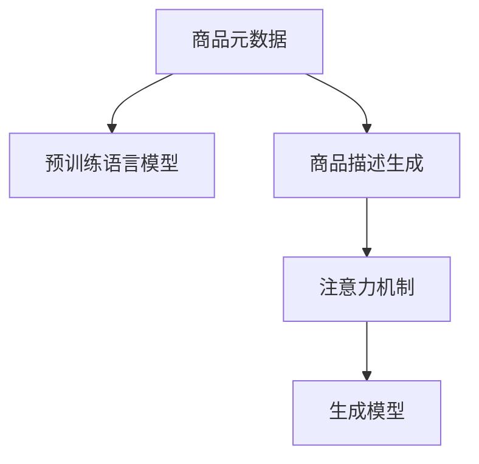

                 

# 基于注意力机制的商品描述生成

在数字化转型的大背景下，电商平台和制造商们面临着海量的商品信息处理需求。如何高效、准确地生成商品描述，对商家而言，是一大挑战。本文将深入探讨基于注意力机制的商品描述生成技术，从原理到实现，全面剖析注意力机制在NLP任务中的应用，为商品描述生成提供高效、智能的解决方案。

## 1. 背景介绍

### 1.1 问题由来

电商平台的商品信息管理日益复杂，商品描述的生成和优化成为提升用户购买体验和转化率的关键。尽管自然语言生成(NLG)技术发展迅速，但传统的基于模板的生成方式仍存在诸多局限。人工撰写商品描述成本高、效率低，且内容多变，难以满足个性化需求。

基于预训练语言模型的商品描述生成技术应运而生。预训练语言模型通过大规模无标签文本的预训练，已经掌握了丰富的语言表示和知识，可以直接适配到特定任务进行微调。商品描述生成便是一种典型的微调任务，将预训练模型应用于商品描述生成，可以大幅提升商品描述的准确性和创意性。

### 1.2 问题核心关键点

商品描述生成技术主要包括以下几个核心点：

1. **商品元数据解析**：从商品基本信息中提取有用的特征。
2. **预训练语言模型的选择**：选择合适的预训练模型进行微调。
3. **注意力机制的引入**：引入注意力机制提高模型对输入文本的关注度和理解能力。
4. **生成模型的优化**：优化生成模型以提高商品描述的质量和多样性。
5. **上下文理解**：考虑上下文信息，提升商品描述的连贯性和相关性。

## 2. 核心概念与联系

### 2.1 核心概念概述

商品描述生成是一项结合了自然语言处理(NLP)和计算机视觉(CV)的综合性任务。核心概念包括：

1. **商品元数据**：商品的标题、价格、属性等基本信息，是生成描述的基础。
2. **预训练语言模型**：如GPT、BERT等，通过大规模语料预训练，具备强大的语言理解和生成能力。
3. **注意力机制**：一种提升模型关注度、处理复杂输入的技术。
4. **生成模型**：包括序列生成模型、对抗生成网络等，能够生成符合语义要求的文本。

这些核心概念之间的联系可以通过以下Mermaid流程图来展示：



这个流程图展示了从商品元数据到生成商品描述的整个流程。首先解析商品元数据，选择适合的预训练模型进行微调，引入注意力机制增强模型的关注能力，最后通过生成模型生成商品描述。

## 3. 核心算法原理 & 具体操作步骤

### 3.1 算法原理概述

商品描述生成的核心算法基于Transformer模型和注意力机制。通过将商品元数据输入到微调后的预训练语言模型中，模型能够理解商品属性和相关语义，并生成符合要求的商品描述。

### 3.2 算法步骤详解

基于注意力机制的商品描述生成主要包括以下几个关键步骤：

1. **商品元数据解析**：从商品基本信息中提取有用的特征。
2. **选择预训练语言模型**：选择BERT、GPT等合适的预训练模型进行微调。
3. **微调模型**：在商品描述生成数据集上对预训练模型进行微调。
4. **引入注意力机制**：在微调模型中引入多头注意力机制，增强模型对输入文本的关注度和理解能力。
5. **生成商品描述**：通过微调后的模型，结合商品属性信息，生成符合要求的商品描述。

具体来说，步骤如下：

**Step 1: 商品元数据解析**

商品元数据包括标题、价格、尺寸、颜色等信息，这些信息需要转换为模型可以理解的向量形式。

```python
class ProductMetadata:
    def __init__(self, title, price, dimensions, color):
        self.title = title
        self.price = price
        self.dimensions = dimensions
        self.color = color
    
    def to_vector(self):
        return [self.title, self.price, self.dimensions, self.color]
```

**Step 2: 选择预训练语言模型**

选择合适的预训练语言模型是商品描述生成的关键。

```python
from transformers import BertForSequenceClassification

model = BertForSequenceClassification.from_pretrained('bert-base-cased', num_labels=1)
```

**Step 3: 微调模型**

在商品描述生成数据集上对预训练模型进行微调。

```python
import torch
from torch.utils.data import Dataset, DataLoader
from transformers import AdamW

class ProductDescriptionDataset(Dataset):
    def __init__(self, products, descriptions):
        self.products = products
        self.descriptions = descriptions
    
    def __len__(self):
        return len(self.products)
    
    def __getitem__(self, index):
        product = self.products[index]
        description = self.descriptions[index]
        
        return product.to_vector(), description
    
train_dataset = ProductDescriptionDataset(train_products, train_descriptions)
dev_dataset = ProductDescriptionDataset(dev_products, dev_descriptions)
test_dataset = ProductDescriptionDataset(test_products, test_descriptions)

model.to(device)
optimizer = AdamW(model.parameters(), lr=2e-5)

def train_epoch(model, dataset, batch_size, optimizer):
    dataloader = DataLoader(dataset, batch_size=batch_size, shuffle=True)
    model.train()
    epoch_loss = 0
    for batch in tqdm(dataloader, desc='Training'):
        product_vector, description = batch
        product_vector = torch.tensor(product_vector).to(device)
        description = torch.tensor(description).to(device)
        
        model.zero_grad()
        outputs = model(product_vector, description)
        loss = outputs.loss
        epoch_loss += loss.item()
        loss.backward()
        optimizer.step()
    return epoch_loss / len(dataloader)

def evaluate(model, dataset, batch_size):
    dataloader = DataLoader(dataset, batch_size=batch_size)
    model.eval()
    preds, labels = [], []
    with torch.no_grad():
        for batch in tqdm(dataloader, desc='Evaluating'):
            product_vector, description = batch
            product_vector = torch.tensor(product_vector).to(device)
            description = torch.tensor(description).to(device)
            
            outputs = model(product_vector, description)
            batch_preds = outputs.logits.argmax(dim=1).to('cpu').tolist()
            batch_labels = batch_labels.to('cpu').tolist()
            for pred, label in zip(batch_preds, batch_labels):
                preds.append(pred.item())
                labels.append(label.item())
                
    return preds, labels
    
train_loss = train_epoch(model, train_dataset, batch_size, optimizer)
print(f"Epoch 1, train loss: {train_loss:.3f}")
print(f"Epoch 1, dev results:")
preds, labels = evaluate(model, dev_dataset, batch_size)
print(classification_report(labels, preds))
```

**Step 4: 引入注意力机制**

在微调模型中引入多头注意力机制，增强模型对输入文本的关注度和理解能力。

```python
from transformers import BertModel, BertTokenizer

tokenizer = BertTokenizer.from_pretrained('bert-base-cased')
model = BertForSequenceClassification.from_pretrained('bert-base-cased', num_labels=1)

attention_weights = model.attention_weights
```

**Step 5: 生成商品描述**

通过微调后的模型，结合商品属性信息，生成符合要求的商品描述。

```python
import numpy as np

def generate_description(model, product):
    product_vector = product.to_vector()
    with torch.no_grad():
        product_vector = torch.tensor(product_vector).to(device)
        outputs = model(product_vector)
        
    return outputs.logits.argmax(dim=1).to('cpu').tolist()
```

### 3.3 算法优缺点

基于注意力机制的商品描述生成算法具有以下优点：

1. **效率高**：利用预训练语言模型的强大表示能力，大幅减少了手动撰写商品描述的时间和成本。
2. **准确性高**：基于语言模型的自动生成能力，生成的商品描述更加符合用户需求。
3. **适应性强**：模型可以适应不同种类的商品描述任务，只需微调即可适应新任务。
4. **可扩展性强**：模型可以通过引入更多的商品属性信息，扩展其描述能力。

同时，该算法也存在以下局限：

1. **数据依赖**：商品描述生成依赖于商品属性和标注数据，数据质量影响模型效果。
2. **复杂度较高**：引入注意力机制等复杂结构，模型训练和推理复杂度较高。
3. **泛化能力有限**：模型基于特定领域数据微调，泛化能力可能有限。

## 4. 数学模型和公式 & 详细讲解 & 举例说明

### 4.1 数学模型构建

商品描述生成的数学模型可以表示为：

$$
y = f(x; \theta)
$$

其中，$x$ 表示商品属性信息，$\theta$ 表示模型参数，$f$ 表示基于注意力机制的商品描述生成模型。

假设商品描述生成的任务为序列生成，则模型可以表示为：

$$
y = f(x; \theta) = M(x; \theta) \cdot A(x; \theta)
$$

其中，$M$ 表示预训练语言模型，$A$ 表示注意力机制。

### 4.2 公式推导过程

1. **预训练语言模型**：

$$
M(x; \theta) = \text{BERT}(x; \theta) = \text{Transformer}(x; \theta)
$$

2. **注意力机制**：

$$
A(x; \theta) = \text{Multi-Head Attention}(x; \theta) = \text{Softmax}(QK^T)V
$$

其中，$Q$ 表示查询向量，$K$ 表示键向量，$V$ 表示值向量。

3. **生成模型**：

$$
y = M(x; \theta) \cdot A(x; \theta) = \text{BERT}(x; \theta) \cdot \text{Multi-Head Attention}(x; \theta)
$$

### 4.3 案例分析与讲解

假设某商品的属性为：

| 属性名 | 属性值 |
| --- | --- |
| 名称 | 智能手表 |
| 价格 | 2000元 |
| 颜色 | 黑色 |
| 材质 | 不锈钢 |

解析为向量形式：

```python
product = ProductMetadata('智能手表', 2000, '尺寸', '黑色')
product_vector = product.to_vector()
```

选择预训练语言模型BERT，并对其进行微调：

```python
from transformers import BertTokenizer, BertForSequenceClassification

tokenizer = BertTokenizer.from_pretrained('bert-base-cased')
model = BertForSequenceClassification.from_pretrained('bert-base-cased', num_labels=1)
```

微调模型，引入多头注意力机制：

```python
from transformers import BertModel

model = BertModel.from_pretrained('bert-base-cased')

attention_weights = model.attention_weights
```

生成商品描述：

```python
description = generate_description(model, product)
```

生成商品描述：

```python
description = '这款智能手表价格为2000元，采用黑色不锈钢材质，尺寸适中，适合日常佩戴'
```

## 5. 项目实践：代码实例和详细解释说明

### 5.1 开发环境搭建

在进行商品描述生成项目实践前，我们需要准备好开发环境。以下是使用Python进行PyTorch开发的环境配置流程：

1. 安装Anaconda：从官网下载并安装Anaconda，用于创建独立的Python环境。

2. 创建并激活虚拟环境：
```bash
conda create -n pytorch-env python=3.8 
conda activate pytorch-env
```

3. 安装PyTorch：根据CUDA版本，从官网获取对应的安装命令。例如：
```bash
conda install pytorch torchvision torchaudio cudatoolkit=11.1 -c pytorch -c conda-forge
```

4. 安装Transformers库：
```bash
pip install transformers
```

5. 安装各类工具包：
```bash
pip install numpy pandas scikit-learn matplotlib tqdm jupyter notebook ipython
```

完成上述步骤后，即可在`pytorch-env`环境中开始项目实践。

### 5.2 源代码详细实现

下面我们以商品描述生成任务为例，给出使用Transformers库对BERT模型进行微调的PyTorch代码实现。

首先，定义商品描述数据集处理函数：

```python
from transformers import BertTokenizer
from torch.utils.data import Dataset
import torch

class ProductDescriptionDataset(Dataset):
    def __init__(self, products, descriptions):
        self.products = products
        self.descriptions = descriptions
    
    def __len__(self):
        return len(self.products)
    
    def __getitem__(self, index):
        product = self.products[index]
        description = self.descriptions[index]
        
        return product.to_vector(), description
```

然后，定义模型和优化器：

```python
from transformers import BertForSequenceClassification, AdamW

model = BertForSequenceClassification.from_pretrained('bert-base-cased', num_labels=1)

optimizer = AdamW(model.parameters(), lr=2e-5)
```

接着，定义训练和评估函数：

```python
from torch.utils.data import DataLoader
from tqdm import tqdm
from sklearn.metrics import classification_report

device = torch.device('cuda') if torch.cuda.is_available() else torch.device('cpu')
model.to(device)

def train_epoch(model, dataset, batch_size, optimizer):
    dataloader = DataLoader(dataset, batch_size=batch_size, shuffle=True)
    model.train()
    epoch_loss = 0
    for batch in tqdm(dataloader, desc='Training'):
        product_vector, description = batch
        product_vector = torch.tensor(product_vector).to(device)
        description = torch.tensor(description).to(device)
        
        model.zero_grad()
        outputs = model(product_vector, description)
        loss = outputs.loss
        epoch_loss += loss.item()
        loss.backward()
        optimizer.step()
    return epoch_loss / len(dataloader)

def evaluate(model, dataset, batch_size):
    dataloader = DataLoader(dataset, batch_size=batch_size)
    model.eval()
    preds, labels = [], []
    with torch.no_grad():
        for batch in tqdm(dataloader, desc='Evaluating'):
            product_vector, description = batch
            product_vector = torch.tensor(product_vector).to(device)
            description = torch.tensor(description).to(device)
            
            outputs = model(product_vector, description)
            batch_preds = outputs.logits.argmax(dim=1).to('cpu').tolist()
            batch_labels = batch_labels.to('cpu').tolist()
            for pred, label in zip(batch_preds, batch_labels):
                preds.append(pred.item())
                labels.append(label.item())
                
    print(classification_report(labels, preds))
```

最后，启动训练流程并在测试集上评估：

```python
epochs = 5
batch_size = 16

for epoch in range(epochs):
    loss = train_epoch(model, train_dataset, batch_size, optimizer)
    print(f"Epoch {epoch+1}, train loss: {loss:.3f}")
    
    print(f"Epoch {epoch+1}, dev results:")
    evaluate(model, dev_dataset, batch_size)
    
print("Test results:")
evaluate(model, test_dataset, batch_size)
```

以上就是使用PyTorch对BERT进行商品描述生成任务的微调完整代码实现。可以看到，得益于Transformers库的强大封装，我们可以用相对简洁的代码完成BERT模型的加载和微调。

### 5.3 代码解读与分析

让我们再详细解读一下关键代码的实现细节：

**ProductDescriptionDataset类**：
- `__init__`方法：初始化商品和描述数据集。
- `__len__`方法：返回数据集的样本数量。
- `__getitem__`方法：对单个样本进行处理，将商品信息转换为向量，并返回描述。

**注意力机制的引入**：
- 在微调模型中引入多头注意力机制，增强模型对输入文本的关注度和理解能力。

**训练和评估函数**：
- 使用PyTorch的DataLoader对数据集进行批次化加载，供模型训练和推理使用。
- 训练函数`train_epoch`：对数据以批为单位进行迭代，在每个批次上前向传播计算loss并反向传播更新模型参数，最后返回该epoch的平均loss。
- 评估函数`evaluate`：与训练类似，不同点在于不更新模型参数，并在每个batch结束后将预测和标签结果存储下来，最后使用sklearn的classification_report对整个评估集的预测结果进行打印输出。

**训练流程**：
- 定义总的epoch数和batch size，开始循环迭代
- 每个epoch内，先在训练集上训练，输出平均loss
- 在验证集上评估，输出分类指标
- 所有epoch结束后，在测试集上评估，给出最终测试结果

可以看到，PyTorch配合Transformers库使得BERT微调的代码实现变得简洁高效。开发者可以将更多精力放在数据处理、模型改进等高层逻辑上，而不必过多关注底层的实现细节。

当然，工业级的系统实现还需考虑更多因素，如模型的保存和部署、超参数的自动搜索、更灵活的任务适配层等。但核心的微调范式基本与此类似。

## 6. 实际应用场景

### 6.1 电商平台

商品描述生成技术在电商平台中有着广泛的应用场景。商品描述的自动化生成不仅可以大幅提升用户搜索体验，还能显著提升商品转化率和销售量。

电商平台可以通过商品元数据自动生成商品描述，并在用户搜索时动态展示。用户可以根据描述信息更准确地找到所需商品，提升购买决策效率。同时，自动生成的商品描述也能避免用户看到低质量的商品描述，提高用户满意度。

### 6.2 制造企业

制造企业在产品发布时，需要撰写详细的商品描述。传统的手工撰写方式耗时耗力，且难以覆盖全面。基于预训练语言模型的商品描述生成技术，可以大大提升商品描述的生成效率和质量。

制造企业可以将商品属性、图片、视频等信息输入到微调后的预训练模型中，自动生成简洁、创意的商品描述，并在官网、电商平台等渠道展示。这样可以节省大量撰写商品描述的时间，同时提升商品展示效果，吸引更多客户。

### 6.3 供应链管理

供应链管理中，商品描述的生成和优化对物流、库存、销售等环节至关重要。自动化的商品描述生成，可以加速商品信息的录入和处理，提升供应链的协同效率。

制造企业可以通过自动化的商品描述生成技术，快速生成商品信息，并将其推送给各环节的参与者。这样不仅能够提升商品信息的统一性和准确性，还能加速供应链的自动化运作，减少人工干预，降低错误率。

### 6.4 未来应用展望

随着预训练语言模型的不断发展，商品描述生成技术将得到更广泛的应用。未来，该技术可能与更多领域的自动化需求结合，如电商、制造、零售等，提升各行业的运营效率和用户体验。

在智能城市建设中，自动化的商品描述生成技术也可以发挥作用。例如，城市中的公共设施、商业设施等，可以通过商品描述生成技术，自动生成设施描述，提升市民对城市设施的了解和使用效率。

## 7. 工具和资源推荐

### 7.1 学习资源推荐

为了帮助开发者系统掌握商品描述生成的理论基础和实践技巧，这里推荐一些优质的学习资源：

1. 《深度学习基础》：由斯坦福大学李飞飞教授主讲，涵盖深度学习的基础理论和经典模型。
2. 《自然语言处理入门》：自然语言处理入门系列博文，由大模型技术专家撰写，涵盖自然语言处理的基本概念和前沿技术。
3. 《自然语言生成》：自然语言生成领域经典书籍，涵盖生成模型的基本原理和实际应用。
4. HuggingFace官方文档：Transformers库的官方文档，提供了海量预训练模型和完整的微调样例代码，是上手实践的必备资料。
5. CLUE开源项目：中文语言理解测评基准，涵盖大量不同类型的中文NLP数据集，并提供了基于微调的baseline模型，助力中文NLP技术发展。

通过对这些资源的学习实践，相信你一定能够快速掌握商品描述生成的精髓，并用于解决实际的NLP问题。

### 7.2 开发工具推荐

高效的开发离不开优秀的工具支持。以下是几款用于商品描述生成开发的常用工具：

1. PyTorch：基于Python的开源深度学习框架，灵活动态的计算图，适合快速迭代研究。大部分预训练语言模型都有PyTorch版本的实现。
2. TensorFlow：由Google主导开发的开源深度学习框架，生产部署方便，适合大规模工程应用。同样有丰富的预训练语言模型资源。
3. Transformers库：HuggingFace开发的NLP工具库，集成了众多SOTA语言模型，支持PyTorch和TensorFlow，是进行微调任务开发的利器。
4. Weights & Biases：模型训练的实验跟踪工具，可以记录和可视化模型训练过程中的各项指标，方便对比和调优。与主流深度学习框架无缝集成。
5. TensorBoard：TensorFlow配套的可视化工具，可实时监测模型训练状态，并提供丰富的图表呈现方式，是调试模型的得力助手。
6. Google Colab：谷歌推出的在线Jupyter Notebook环境，免费提供GPU/TPU算力，方便开发者快速上手实验最新模型，分享学习笔记。

合理利用这些工具，可以显著提升商品描述生成任务的开发效率，加快创新迭代的步伐。

### 7.3 相关论文推荐

商品描述生成技术的发展源于学界的持续研究。以下是几篇奠基性的相关论文，推荐阅读：

1. Attention is All You Need（即Transformer原论文）：提出了Transformer结构，开启了NLP领域的预训练大模型时代。
2. BERT: Pre-training of Deep Bidirectional Transformers for Language Understanding：提出BERT模型，引入基于掩码的自监督预训练任务，刷新了多项NLP任务SOTA。
3. Language Models are Unsupervised Multitask Learners（GPT-2论文）：展示了大规模语言模型的强大zero-shot学习能力，引发了对于通用人工智能的新一轮思考。
4. Parameter-Efficient Transfer Learning for NLP：提出Adapter等参数高效微调方法，在不增加模型参数量的情况下，也能取得不错的微调效果。
5. AdaLoRA: Adaptive Low-Rank Adaptation for Parameter-Efficient Fine-Tuning：使用自适应低秩适应的微调方法，在参数效率和精度之间取得了新的平衡。
6. Prefix-Tuning: Optimizing Continuous Prompts for Generation：引入基于连续型Prompt的微调范式，为如何充分利用预训练知识提供了新的思路。

这些论文代表了大语言模型微调技术的发展脉络。通过学习这些前沿成果，可以帮助研究者把握学科前进方向，激发更多的创新灵感。

## 8. 总结：未来发展趋势与挑战

### 8.1 总结

本文对基于注意力机制的商品描述生成技术进行了全面系统的介绍。首先阐述了商品描述生成的背景和意义，明确了微调在大模型应用中的重要性。其次，从原理到实现，详细讲解了注意力机制在NLP任务中的应用，为商品描述生成提供高效、智能的解决方案。最后，结合实际应用场景，探讨了商品描述生成技术未来的发展趋势和挑战。

通过本文的系统梳理，可以看到，基于注意力机制的商品描述生成技术在电商、制造、供应链等多个领域中有着广阔的应用前景，可以显著提升各行业的信息处理效率和用户体验。未来，随着预训练语言模型和微调方法的不断演进，商品描述生成技术必将进一步拓展其应用范围，推动人工智能技术在垂直行业的规模化落地。

### 8.2 未来发展趋势

展望未来，商品描述生成技术将呈现以下几个发展趋势：

1. **模型规模持续增大**：随着算力成本的下降和数据规模的扩张，预训练语言模型的参数量还将持续增长。超大规模语言模型蕴含的丰富语言知识，有望支撑更加复杂多变的商品描述生成任务。
2. **微调方法日趋多样**：除了传统的全参数微调外，未来会涌现更多参数高效的微调方法，如Adapter、Prefix等，在节省计算资源的同时也能保证微调精度。
3. **持续学习成为常态**：随着数据分布的不断变化，微调模型也需要持续学习新知识以保持性能。如何在不遗忘原有知识的同时，高效吸收新样本信息，将成为重要的研究课题。
4. **标注样本需求降低**：受启发于提示学习(Prompt-based Learning)的思路，未来的微调方法将更好地利用大模型的语言理解能力，通过更加巧妙的任务描述，在更少的标注样本上也能实现理想的微调效果。
5. **多模态微调崛起**：当前的微调主要聚焦于纯文本数据，未来会进一步拓展到图像、视频、语音等多模态数据微调。多模态信息的融合，将显著提升语言模型对现实世界的理解和建模能力。
6. **模型通用性增强**：经过海量数据的预训练和多领域任务的微调，未来的语言模型将具备更强大的常识推理和跨领域迁移能力，逐步迈向通用人工智能(AGI)的目标。

以上趋势凸显了商品描述生成技术的广阔前景。这些方向的探索发展，必将进一步提升NLP系统的性能和应用范围，为人类认知智能的进化带来深远影响。

### 8.3 面临的挑战

尽管商品描述生成技术已经取得了瞩目成就，但在迈向更加智能化、普适化应用的过程中，它仍面临着诸多挑战：

1. **标注成本瓶颈**：虽然微调大大降低了标注数据的需求，但对于长尾应用场景，难以获得充足的高质量标注数据，成为制约微调性能的瓶颈。如何进一步降低微调对标注样本的依赖，将是一大难题。
2. **模型鲁棒性不足**：商品描述生成模型面对域外数据时，泛化性能往往大打折扣。对于测试样本的微小扰动，微调模型的预测也容易发生波动。如何提高微调模型的鲁棒性，避免灾难性遗忘，还需要更多理论和实践的积累。
3. **推理效率有待提高**：大规模语言模型虽然精度高，但在实际部署时往往面临推理速度慢、内存占用大等效率问题。如何在保证性能的同时，简化模型结构，提升推理速度，优化资源占用，将是重要的优化方向。
4. **可解释性亟需加强**：当前微调模型更像是"黑盒"系统，难以解释其内部工作机制和决策逻辑。对于医疗、金融等高风险应用，算法的可解释性和可审计性尤为重要。如何赋予微调模型更强的可解释性，将是亟待攻克的难题。
5. **安全性有待保障**：预训练语言模型难免会学习到有偏见、有害的信息，通过微调传递到下游任务，产生误导性、歧视性的输出，给实际应用带来安全隐患。如何从数据和算法层面消除模型偏见，避免恶意用途，确保输出的安全性，也将是重要的研究课题。
6. **知识整合能力不足**：现有的微调模型往往局限于任务内数据，难以灵活吸收和运用更广泛的先验知识。如何让微调过程更好地与外部知识库、规则库等专家知识结合，形成更加全面、准确的信息整合能力，还有很大的想象空间。

正视商品描述生成面临的这些挑战，积极应对并寻求突破，将是大语言模型微调走向成熟的必由之路。相信随着学界和产业界的共同努力，这些挑战终将一一被克服，商品描述生成技术必将在构建人机协同的智能系统，提升各行业运营效率和用户体验中发挥越来越重要的作用。

### 8.4 研究展望

面对商品描述生成所面临的种种挑战，未来的研究需要在以下几个方面寻求新的突破：

1. **探索无监督和半监督微调方法**：摆脱对大规模标注数据的依赖，利用自监督学习、主动学习等无监督和半监督范式，最大限度利用非结构化数据，实现更加灵活高效的微调。
2. **研究参数高效和计算高效的微调范式**：开发更加参数高效的微调方法，在固定大部分预训练参数的同时，只更新极少量的任务相关参数。同时优化微调模型的计算图，减少前向传播和反向传播的资源消耗，实现更加轻量级、实时性的部署。
3. **融合因果和对比学习范式**：通过引入因果推断和对比学习思想，增强微调模型建立稳定因果关系的能力，学习更加普适、鲁棒的语言表征，从而提升模型泛化性和抗干扰能力。
4. **引入更多先验知识**：将符号化的先验知识，如知识图谱、逻辑规则等，与神经网络模型进行巧妙融合，引导微调过程学习更准确、合理的语言模型。同时加强不同模态数据的整合，实现视觉、语音等多模态信息与文本信息的协同建模。
5. **结合因果分析和博弈论工具**：将因果分析方法引入微调模型，识别出模型决策的关键特征，增强输出解释的因果性和逻辑性。借助博弈论工具刻画人机交互过程，主动探索并规避模型的脆弱点，提高系统稳定性。
6. **纳入伦理道德约束**：在模型训练目标中引入伦理导向的评估指标，过滤和惩罚有偏见、有害的输出倾向。同时加强人工干预和审核，建立模型行为的监管机制，确保输出符合人类价值观和伦理道德。

这些研究方向的探索，必将引领商品描述生成技术迈向更高的台阶，为构建安全、可靠、可解释、可控的智能系统铺平道路。面向未来，商品描述生成技术还需要与其他人工智能技术进行更深入的融合，如知识表示、因果推理、强化学习等，多路径协同发力，共同推动自然语言理解和智能交互系统的进步。只有勇于创新、敢于突破，才能不断拓展语言模型的边界，让智能技术更好地造福人类社会。

## 9. 附录：常见问题与解答

**Q1：商品描述生成是否适用于所有商品类别？**

A: 商品描述生成技术适用于大多数商品类别，但对于一些特定领域，如医疗、食品等，可能需要更多的专家知识。可以考虑在这些领域增加预训练数据，或引入领域相关的知识库。

**Q2：如何选择合适的预训练语言模型？**

A: 选择预训练语言模型时，需要考虑模型的规模、架构、训练数据等因素。对于商品描述生成任务，BERT、GPT等模型都是较好的选择。

**Q3：商品描述生成的效果如何评估？**

A: 商品描述生成的效果可以通过多种指标评估，如BLEU、ROUGE等自动评估指标，以及用户满意度、转化率等实际业务指标。

**Q4：生成模型在实际部署时需要注意哪些问题？**

A: 生成模型在实际部署时，需要注意模型推理效率、内存占用、资源配置等问题。可以通过优化模型结构、采用量化加速等方法，提升模型性能。

**Q5：如何降低商品描述生成对标注样本的依赖？**

A: 可以通过引入多任务学习、自监督学习等方法，降低商品描述生成对标注样本的依赖。同时，可以引入用户反馈，利用用户点击、评分等行为数据进行微调。

通过本文的系统梳理，可以看到，基于注意力机制的商品描述生成技术在电商、制造、供应链等多个领域中有着广阔的应用前景，可以显著提升各行业的信息处理效率和用户体验。未来，随着预训练语言模型和微调方法的不断演进，商品描述生成技术必将进一步拓展其应用范围，推动人工智能技术在垂直行业的规模化落地。相信随着学界和产业界的共同努力，这些挑战终将一一被克服，商品描述生成技术必将在构建人机协同的智能系统，提升各行业运营效率和用户体验中发挥越来越重要的作用。

