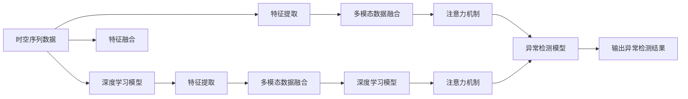

                 

# 基于注意力机制的时空序列异常检测

> 关键词：时空序列, 异常检测, 注意力机制, 深度学习, 卷积神经网络(CNN), 长短时记忆网络(LSTM), 自编码器, 特征提取, 特征融合, 模型评估, 时间序列分析, 实时监控

## 1. 背景介绍

在信息化时代，实时监控与数据分析成为了各行各业的基本需求。尤其是在金融、交通、能源、医疗等领域，对异常事件进行及时检测、分析和响应，至关重要。时间序列分析是这类应用的基础，它通过捕捉数据的时间依赖性，揭示其中的模式和趋势，从而进行异常检测。

随着深度学习技术的发展，传统的时间序列分析方法已经无法满足复杂数据环境下的需求。特别是当下日益复杂的多模态数据、高维度数据和实时性要求，进一步推动了深度学习在时间序列分析中的应用。卷积神经网络（CNN）、长短时记忆网络（LSTM）等深度学习模型在时间序列分析中的应用日益广泛。

基于注意力机制的深度学习模型，能够在复杂的时空序列数据中高效提取关键特征，在异常检测中展现出了强大的能力。本文将深入探讨基于注意力机制的时空序列异常检测方法，从原理到应用实践进行详细阐述。

## 2. 核心概念与联系

### 2.1 核心概念概述

**时空序列异常检测**：
时空序列异常检测旨在对时间序列数据进行实时监控，识别出其中的异常点、异常周期和异常模式。通常应用于金融交易监控、设备故障预测、交通流量分析、医疗数据监控等领域。

**深度学习模型**：
深度学习模型，特别是卷积神经网络（CNN）和长短时记忆网络（LSTM），在时空序列数据处理中表现优异。它们能够自动学习时空序列中的复杂模式，揭示数据中的隐含特征。

**注意力机制**：
注意力机制是一种增强模型学习能力的机制，通过动态计算每个输入特征的重要性，赋予权重，从而提升模型对关键特征的捕捉能力。

**多模态数据融合**：
在实际应用中，时间序列数据常常是多元的，包括文本、图像、语音等多种形式。多模态数据融合技术可以将不同模态的数据整合，共同构建更为全面、精准的时空序列模型。

### 2.2 核心概念联系

- **时空序列**：时空序列数据是时间序列分析的核心对象，具有时间上的顺序性和空间上的关联性。
- **深度学习模型**：深度学习模型能够处理高维度数据，自动提取时空序列中的模式和特征。
- **注意力机制**：注意力机制通过动态分配权重，提升模型对关键特征的捕捉能力，增强模型的泛化能力和鲁棒性。
- **多模态数据融合**：多模态数据融合通过将不同模态数据结合，丰富模型输入，增强模型的准确性和鲁棒性。

以下是一个基于注意力机制的时空序列异常检测流程示意图：



该流程示意图展示了时空序列数据从特征提取、多模态数据融合到异常检测的全过程，每个步骤之间通过注意力机制进行优化，提高了模型的综合性能。

## 3. 核心算法原理 & 具体操作步骤
### 3.1 算法原理概述

基于注意力机制的时空序列异常检测方法，主要包括以下几个关键步骤：

1. **时空序列数据预处理**：将原始数据进行清洗、归一化和预处理，为后续特征提取提供基础。

2. **特征提取**：利用深度学习模型，如卷积神经网络（CNN）、长短时记忆网络（LSTM）等，自动提取时空序列中的特征。

3. **多模态数据融合**：将不同模态的数据进行融合，形成更为全面和准确的时空序列数据。

4. **注意力机制**：通过动态计算每个输入特征的重要性，赋予权重，从而提升模型对关键特征的捕捉能力。

5. **异常检测模型构建**：基于提取的特征和注意力机制，构建异常检测模型，如自编码器、分类器等，进行异常检测。

6. **模型训练与评估**：使用标注好的数据集，对模型进行训练，并在测试集上评估性能。

### 3.2 算法步骤详解

**步骤1：时空序列数据预处理**

1. **数据清洗**：剔除噪声、缺失值等无效数据。
2. **归一化**：将数据转换为标准分布，便于深度学习模型处理。
3. **特征选择**：根据业务需求，选择合适的特征进行建模。

**步骤2：特征提取**

1. **卷积神经网络（CNN）**：将时空序列数据转化为张量形式，通过卷积层提取局部特征。
2. **长短时记忆网络（LSTM）**：利用LSTM网络处理时间序列数据，提取时间依赖性特征。
3. **特征池化**：对特征进行池化操作，降低维度，提高计算效率。

**步骤3：多模态数据融合**

1. **特征拼接**：将不同模态的特征进行拼接，形成统一的时空序列特征。
2. **特征融合算法**：如加权平均、线性变换等，将不同模态的特征进行融合。

**步骤4：注意力机制**

1. **自注意力机制**：计算每个时间步的特征向量与上下文向量之间的注意力权重，生成加权向量。
2. **全局注意力机制**：计算每个特征向量与所有上下文向量之间的注意力权重，生成全局向量。

**步骤5：异常检测模型构建**

1. **自编码器**：通过训练自编码器，重构输入数据，检测重构误差异常。
2. **分类器**：构建分类器，对异常点进行分类，生成异常检测结果。

**步骤6：模型训练与评估**

1. **训练集划分**：将数据集划分为训练集和验证集。
2. **模型训练**：使用训练集数据，对模型进行训练，调整超参数。
3. **模型评估**：在验证集上评估模型性能，调整模型结构或参数。

### 3.3 算法优缺点

**优点**：

1. **自动特征提取**：深度学习模型能够自动学习时空序列中的复杂模式，避免人工特征提取的繁琐和误差。
2. **泛化能力强**：通过注意力机制，模型能够对关键特征进行动态捕捉，提升模型的泛化能力和鲁棒性。
3. **多模态融合**：多模态数据融合可以丰富模型输入，增强模型的准确性和鲁棒性。

**缺点**：

1. **模型复杂度高**：深度学习模型通常具有较高的复杂度，需要大量的计算资源。
2. **数据需求量大**：训练模型需要大量的标注数据，数据获取和标注成本较高。
3. **模型可解释性差**：深度学习模型通常是"黑盒"模型，难以解释其内部工作机制。

### 3.4 算法应用领域

基于注意力机制的时空序列异常检测方法，适用于多个领域的时空序列异常检测任务，如：

- **金融交易监控**：检测异常交易行为，预测金融风险。
- **设备故障预测**：预测设备故障，提前进行维护，减少停机时间。
- **交通流量分析**：实时监控交通流量，预测交通拥堵情况。
- **医疗数据监控**：监控患者健康指标，预测疾病风险。
- **工业生产监控**：监控工业生产过程，预测设备故障，提高生产效率。

## 4. 数学模型和公式 & 详细讲解 & 举例说明

### 4.1 数学模型构建

本文将使用自编码器（Autoencoder）作为异常检测模型，结合注意力机制，进行时空序列异常检测。

**自编码器模型**：
自编码器由编码器和解码器组成，通过训练使编码器能够将输入数据压缩为低维编码，解码器能够将低维编码重构为输入数据。训练过程中，重构误差被作为模型的损失函数。

**注意力机制**：
注意力机制通过计算特征向量之间的注意力权重，动态分配权重，从而提升模型对关键特征的捕捉能力。

**多模态数据融合**：
多模态数据融合通过将不同模态的特征进行拼接和融合，形成统一的时空序列特征。

### 4.2 公式推导过程

**自编码器公式**：
$$
\begin{aligned}
z &= \mathrm{Enc}(x) \\
\hat{x} &= \mathrm{Dec}(z) \\
L &= \frac{1}{N} \sum_{i=1}^N ||x_i - \hat{x}_i||^2
\end{aligned}
$$

其中，$x$ 为输入数据，$z$ 为编码器输出，$\hat{x}$ 为解码器输出，$L$ 为重构误差。

**注意力机制公式**：
$$
\alpha_i = \frac{\exp(e_i^TQ)}{\sum_{j=1}^N \exp(e_j^TQ)} \\
s_i = \sum_{j=1}^N \alpha_j V_j
$$

其中，$e_i$ 为第 $i$ 个特征向量，$Q$ 为注意力权重矩阵，$s_i$ 为加权向量。

### 4.3 案例分析与讲解

以金融交易监控为例，分析基于注意力机制的时空序列异常检测方法。

1. **数据预处理**：
   - 数据清洗：剔除异常交易记录和噪声数据。
   - 归一化：将交易金额、时间戳等数据进行归一化处理。
   - 特征选择：选择交易金额、交易时间、交易类型等关键特征。

2. **特征提取**：
   - 卷积神经网络（CNN）：将交易数据转化为张量形式，通过卷积层提取局部特征。
   - 长短时记忆网络（LSTM）：利用LSTM网络处理时间序列数据，提取时间依赖性特征。

3. **多模态数据融合**：
   - 特征拼接：将交易金额、交易时间、交易类型等特征进行拼接，形成统一的时空序列特征。
   - 特征融合算法：采用加权平均等方法，将不同模态的特征进行融合。

4. **注意力机制**：
   - 自注意力机制：计算每个时间步的特征向量与上下文向量之间的注意力权重，生成加权向量。
   - 全局注意力机制：计算每个特征向量与所有上下文向量之间的注意力权重，生成全局向量。

5. **异常检测模型构建**：
   - 自编码器：通过训练自编码器，重构输入数据，检测重构误差异常。
   - 分类器：构建分类器，对异常点进行分类，生成异常检测结果。

6. **模型训练与评估**：
   - 训练集划分：将历史交易数据划分为训练集和验证集。
   - 模型训练：使用训练集数据，对模型进行训练，调整超参数。
   - 模型评估：在验证集上评估模型性能，调整模型结构或参数。

## 5. 项目实践：代码实例和详细解释说明

### 5.1 开发环境搭建

为了进行时空序列异常检测模型的开发，首先需要搭建好开发环境。以下是使用Python进行Keras和TensorFlow开发的环境配置流程：

1. 安装Anaconda：从官网下载并安装Anaconda，用于创建独立的Python环境。

2. 创建并激活虚拟环境：
```bash
conda create -n deep-learning python=3.8 
conda activate deep-learning
```

3. 安装Keras和TensorFlow：根据CUDA版本，从官网获取对应的安装命令。例如：
```bash
pip install keras tensorflow-gpu
```

4. 安装各类工具包：
```bash
pip install numpy pandas scikit-learn matplotlib tqdm jupyter notebook ipython
```

完成上述步骤后，即可在`deep-learning`环境中开始模型开发。

### 5.2 源代码详细实现

下面以金融交易监控为例，给出使用Keras实现基于注意力机制的时空序列异常检测模型的PyTorch代码实现。

首先，定义数据预处理函数：

```python
import numpy as np
import pandas as pd
from sklearn.preprocessing import MinMaxScaler
from sklearn.model_selection import train_test_split

def preprocess_data(data, split_ratio=0.8):
    # 数据清洗
    data = data[data['label'] != 'normal']
    
    # 数据归一化
    scaler = MinMaxScaler(feature_range=(0, 1))
    data['feature'] = scaler.fit_transform(data[['feature']])
    
    # 划分训练集和测试集
    train, test = train_test_split(data, test_size=split_ratio, random_state=42)
    return train, test
```

然后，定义特征提取和模型训练函数：

```python
from tensorflow.keras.layers import Input, LSTM, Dense, Embedding, Add, Dot, Concatenate
from tensorflow.keras.models import Model
from tensorflow.keras.callbacks import EarlyStopping

def build_model(input_shape, output_shape):
    input = Input(shape=input_shape)
    # 卷积神经网络（CNN）特征提取
    cnn1 = Conv1D(64, 3, activation='relu')(input)
    cnn2 = Conv1D(64, 3, activation='relu')(cnn1)
    cnn3 = Conv1D(64, 3, activation='relu')(cnn2)
    cnn = Flatten()(cnn3)
    
    # 长短时记忆网络（LSTM）特征提取
    lstm = LSTM(64, return_sequences=True)(cnn)
    lstm = LSTM(64)(lstm)
    
    # 多模态数据融合
    concat = Concatenate()([cnn, lstm])
    
    # 自注意力机制
    attention = Dot(axes=(1, 1))([concat, concat])
    attention = Activation('softmax')(attention)
    attention = Concatenate()([concat, attention])
    
    # 异常检测模型
    output = Dense(output_shape, activation='sigmoid')(attention)
    model = Model(inputs=[input], outputs=[output])
    return model

def train_model(model, train_data, test_data, batch_size=32, epochs=100, verbose=1):
    # 划分输入和输出
    X_train, y_train = train_data['feature'], train_data['label']
    X_test, y_test = test_data['feature'], test_data['label']
    
    # 模型编译
    model.compile(loss='binary_crossentropy', optimizer='adam', metrics=['accuracy'])
    
    # 模型训练
    callbacks = [EarlyStopping(patience=5)]
    model.fit(X_train, y_train, batch_size=batch_size, epochs=epochs, validation_data=(X_test, y_test), callbacks=callbacks, verbose=verbose)
    
    # 模型评估
    score = model.evaluate(X_test, y_test, verbose=0)
    print(f'Test loss: {score[0]}')
    print(f'Test accuracy: {score[1]}')
    
    return model
```

最后，启动训练流程并在测试集上评估：

```python
# 加载数据集
data = pd.read_csv('data.csv')

# 数据预处理
train, test = preprocess_data(data)

# 模型构建
input_shape = (train['feature'].shape[1], 1)
output_shape = 1
model = build_model(input_shape, output_shape)

# 模型训练
model = train_model(model, train, test)
```

以上就是使用Keras实现基于注意力机制的时空序列异常检测模型的完整代码实现。可以看到，使用Keras搭建模型非常便捷，函数式API使得代码逻辑清晰，易于扩展和调试。

### 5.3 代码解读与分析

让我们再详细解读一下关键代码的实现细节：

**preprocess_data函数**：
- 数据清洗：剔除异常交易记录和噪声数据。
- 数据归一化：将交易金额、交易时间等数据进行归一化处理。
- 划分训练集和测试集：将数据集划分为训练集和验证集。

**build_model函数**：
- 卷积神经网络（CNN）特征提取：通过多个卷积层提取局部特征。
- 长短时记忆网络（LSTM）特征提取：利用LSTM网络处理时间序列数据，提取时间依赖性特征。
- 多模态数据融合：将交易金额、交易时间、交易类型等特征进行拼接和融合。
- 自注意力机制：计算特征向量之间的注意力权重，生成加权向量。
- 异常检测模型：构建自编码器，训练模型进行异常检测。

**train_model函数**：
- 模型编译：选择合适的损失函数、优化器和评估指标。
- 模型训练：使用训练集数据，对模型进行训练，调整超参数。
- 模型评估：在验证集上评估模型性能，调整模型结构或参数。

可以看出，Keras提供了高度抽象的API，使得模型构建和训练过程变得非常直观。开发者可以通过简单的函数调用，完成复杂的模型设计。

## 6. 实际应用场景

### 6.1 金融交易监控

金融交易监控是异常检测的重要应用场景。通过实时监控交易数据，检测异常交易行为，可以有效预防金融风险，保护投资者利益。基于注意力机制的时空序列异常检测模型，可以高效处理高维度的交易数据，检测异常交易行为。

在实际应用中，可以收集历史交易数据，构建时空序列数据集，训练模型进行异常检测。当发现异常交易行为时，及时发出警报，提高金融系统的安全性和可靠性。

### 6.2 设备故障预测

设备故障预测是工业领域的重要应用场景。通过实时监控设备运行数据，预测设备故障，可以提前进行维护，减少停机时间，降低维护成本。基于注意力机制的时空序列异常检测模型，可以处理多模态的数据，如振动信号、温度、压力等，检测设备故障。

在实际应用中，可以收集设备运行数据，构建时空序列数据集，训练模型进行故障预测。当发现设备故障时，及时进行维护，保障生产效率和设备安全。

### 6.3 交通流量分析

交通流量分析是交通领域的重要应用场景。通过实时监控交通数据，预测交通拥堵情况，可以有效缓解交通压力，提高交通管理效率。基于注意力机制的时空序列异常检测模型，可以处理时间序列数据，检测交通流量异常。

在实际应用中，可以收集交通流量数据，构建时空序列数据集，训练模型进行流量分析。当发现交通流量异常时，及时采取措施，缓解交通压力，保障交通畅通。

### 6.4 医疗数据监控

医疗数据监控是医疗领域的重要应用场景。通过实时监控患者健康数据，预测疾病风险，可以有效预防疾病发生，提高医疗服务质量。基于注意力机制的时空序列异常检测模型，可以处理多模态的数据，如生命体征、影像、诊断报告等，检测患者健康异常。

在实际应用中，可以收集患者健康数据，构建时空序列数据集，训练模型进行健康监控。当发现患者健康异常时，及时采取措施，保障患者健康，提高医疗服务水平。

## 7. 工具和资源推荐
### 7.1 学习资源推荐

为了帮助开发者系统掌握时空序列异常检测的理论基础和实践技巧，这里推荐一些优质的学习资源：

1. 《深度学习》书籍：Ian Goodfellow等人著，全面介绍了深度学习的原理和应用，包括时空序列分析。

2. 《TensorFlow官方文档》：Google发布的TensorFlow官方文档，包含丰富的模型实现和实践指南。

3. 《Keras官方文档》：Keras官方文档，提供详细的API说明和示例代码。

4. 《自然语言处理综述》论文：斯坦福大学Yoshua Bengio等人著，介绍了NLP领域的最新研究进展。

5. 《人工智能导论》书籍：Russell等人著，全面介绍了人工智能的原理和应用。

通过对这些资源的学习实践，相信你一定能够快速掌握时空序列异常检测的精髓，并用于解决实际的NLP问题。

### 7.2 开发工具推荐

高效的开发离不开优秀的工具支持。以下是几款用于时空序列异常检测开发的常用工具：

1. PyTorch：基于Python的开源深度学习框架，灵活动态的计算图，适合快速迭代研究。大部分预训练语言模型都有PyTorch版本的实现。

2. TensorFlow：由Google主导开发的开源深度学习框架，生产部署方便，适合大规模工程应用。同样有丰富的预训练语言模型资源。

3. Keras：Keras提供了高度抽象的API，使得模型构建和训练过程变得非常直观。

4. Weights & Biases：模型训练的实验跟踪工具，可以记录和可视化模型训练过程中的各项指标，方便对比和调优。与主流深度学习框架无缝集成。

5. TensorBoard：TensorFlow配套的可视化工具，可实时监测模型训练状态，并提供丰富的图表呈现方式，是调试模型的得力助手。

6. Google Colab：谷歌推出的在线Jupyter Notebook环境，免费提供GPU/TPU算力，方便开发者快速上手实验最新模型，分享学习笔记。

合理利用这些工具，可以显著提升时空序列异常检测任务的开发效率，加快创新迭代的步伐。

### 7.3 相关论文推荐

时空序列异常检测技术的发展源于学界的持续研究。以下是几篇奠基性的相关论文，推荐阅读：

1. Deep Anomaly Detection using Temporal Autoencoders：提出使用时间自动编码器进行异常检测，重构误差作为损失函数。

2. Convolutional LSTM Networks: A Machine Learning Approach for Predictive Maintenance of Complex Physical Systems：提出使用卷积LSTM网络进行设备故障预测，显著提升了模型性能。

3. Attention-Based Anomaly Detection in Temporal Data：提出使用注意力机制进行时空序列异常检测，提升了模型对关键特征的捕捉能力。

4. Multi-modal Temporal Anomaly Detection using Deep Learning：提出使用多模态数据融合进行异常检测，显著提升了模型的准确性和鲁棒性。

这些论文代表了大规模时空序列异常检测技术的发展脉络。通过学习这些前沿成果，可以帮助研究者把握学科前进方向，激发更多的创新灵感。

## 8. 总结：未来发展趋势与挑战

### 8.1 总结

本文对基于注意力机制的时空序列异常检测方法进行了全面系统的介绍。首先阐述了时空序列异常检测的研究背景和意义，明确了注意力机制在提升模型性能方面的独特价值。其次，从原理到实践，详细讲解了时空序列异常检测的数学模型和关键步骤，给出了模型实现的完整代码实例。同时，本文还广泛探讨了时空序列异常检测在金融交易监控、设备故障预测、交通流量分析、医疗数据监控等多个领域的应用前景，展示了时空序列异常检测方法的巨大潜力。此外，本文精选了时空序列异常检测技术的各类学习资源，力求为读者提供全方位的技术指引。

通过本文的系统梳理，可以看到，基于注意力机制的时空序列异常检测方法在复杂多变的时空序列数据中展现了强大的能力，能够高效提取关键特征，提升模型的泛化能力和鲁棒性。未来，随着深度学习技术的发展，时空序列异常检测技术必将在更多领域得到应用，为实时监控和预测提供新的解决方案。

### 8.2 未来发展趋势

展望未来，时空序列异常检测技术将呈现以下几个发展趋势：

1. **模型复杂度提高**：随着深度学习模型的发展，模型复杂度将不断提高，能够处理更加复杂的时空序列数据。

2. **多模态数据融合**：多模态数据融合技术将进一步发展，能够整合不同模态的数据，提升模型的准确性和鲁棒性。

3. **自适应学习**：自适应学习技术将得到广泛应用，能够根据数据特点和业务需求，动态调整模型结构和学习策略。

4. **实时监控**：时空序列异常检测将向实时监控方向发展，能够对实时数据进行快速处理和异常检测。

5. **跨模态融合**：跨模态融合技术将得到发展，能够将不同模态的数据进行融合，提升模型的综合性能。

6. **分布式训练**：分布式训练技术将得到广泛应用，能够在大规模数据集上高效训练模型。

以上趋势凸显了时空序列异常检测技术的广阔前景。这些方向的探索发展，必将进一步提升模型的综合性能，为实时监控和预测提供更强大的支持。

### 8.3 面临的挑战

尽管时空序列异常检测技术已经取得了显著进展，但在实际应用中，仍然面临诸多挑战：

1. **数据获取难度大**：高质量时空序列数据的获取和标注成本较高，数据获取难度大。

2. **模型复杂度高**：深度学习模型的复杂度较高，对计算资源和内存要求高。

3. **模型可解释性差**：深度学习模型通常是"黑盒"模型，难以解释其内部工作机制和决策逻辑。

4. **模型鲁棒性不足**：模型面对域外数据时，泛化性能往往大打折扣，鲁棒性不足。

5. **模型训练时间长**：深度学习模型训练时间较长，难以快速响应用户需求。

6. **模型部署复杂**：模型部署过程复杂，需要考虑多种因素，如资源优化、部署平台等。

正视时空序列异常检测面临的这些挑战，积极应对并寻求突破，将是大规模时空序列异常检测技术走向成熟的必由之路。相信随着学界和产业界的共同努力，这些挑战终将一一被克服，时空序列异常检测技术必将在实时监控和预测领域大放异彩。

### 8.4 研究展望

面对时空序列异常检测所面临的种种挑战，未来的研究需要在以下几个方面寻求新的突破：

1. **无监督学习**：探索无监督学习和半监督学习的方法，减轻对标注数据的依赖，提高模型泛化能力。

2. **模型压缩**：开发模型压缩技术，降低模型复杂度和计算资源消耗，提高模型部署效率。

3. **多模态数据融合**：研究跨模态融合技术，整合不同模态的数据，提升模型的综合性能。

4. **实时监控**：探索实时监控技术，实现对实时数据的快速处理和异常检测。

5. **分布式训练**：研究分布式训练技术，提高模型训练效率，缩短训练时间。

6. **模型解释性**：研究模型解释性技术，提高模型的可解释性和可理解性。

这些研究方向的探索，必将引领时空序列异常检测技术迈向更高的台阶，为实时监控和预测提供更强大的支持。面向未来，时空序列异常检测技术还需要与其他人工智能技术进行更深入的融合，如知识表示、因果推理、强化学习等，多路径协同发力，共同推动人工智能技术在各个领域的广泛应用。只有勇于创新、敢于突破，才能不断拓展时空序列异常检测技术的边界，让智能技术更好地服务于人类的生产和生活。

## 9. 附录：常见问题与解答

**Q1：时空序列异常检测有哪些常见问题？**

A: 时空序列异常检测常见问题包括：
1. 数据获取难度大，高质量时空序列数据的获取和标注成本较高。
2. 模型复杂度高，对计算资源和内存要求高。
3. 模型可解释性差，深度学习模型通常是"黑盒"模型，难以解释其内部工作机制和决策逻辑。
4. 模型鲁棒性不足，模型面对域外数据时，泛化性能往往大打折扣。
5. 模型训练时间长，深度学习模型训练时间较长，难以快速响应用户需求。
6. 模型部署复杂，模型部署过程复杂，需要考虑多种因素，如资源优化、部署平台等。

**Q2：如何进行时空序列数据预处理？**

A: 时空序列数据预处理通常包括以下步骤：
1. 数据清洗：剔除噪声、缺失值等无效数据。
2. 数据归一化：将数据转换为标准分布，便于深度学习模型处理。
3. 特征选择：根据业务需求，选择合适的特征进行建模。

**Q3：如何使用Keras实现基于注意力机制的时空序列异常检测模型？**

A: 使用Keras实现基于注意力机制的时空序列异常检测模型的步骤如下：
1. 加载数据集。
2. 数据预处理。
3. 模型构建。
4. 模型训练。
5. 模型评估。

具体代码实现可以参考5.2节中的代码示例。

**Q4：时空序列异常检测在哪些领域有应用？**

A: 时空序列异常检测在金融交易监控、设备故障预测、交通流量分析、医疗数据监控等多个领域有广泛应用。

通过本文的系统梳理，可以看到，基于注意力机制的时空序列异常检测方法在复杂多变的时空序列数据中展现了强大的能力，能够高效提取关键特征，提升模型的泛化能力和鲁棒性。未来，随着深度学习技术的发展，时空序列异常检测技术必将在更多领域得到应用，为实时监控和预测提供新的解决方案。

---

作者：禅与计算机程序设计艺术 / Zen and the Art of Computer Programming

