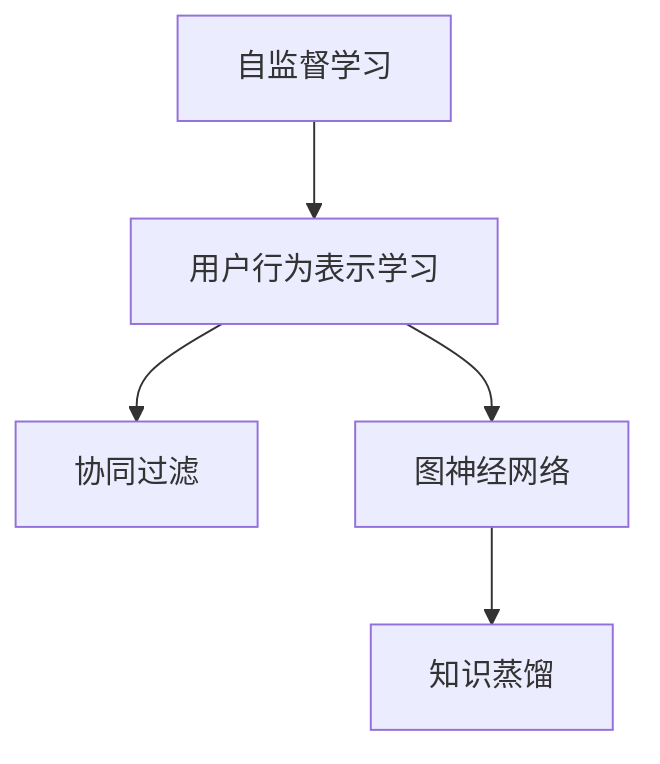

                 

# 基于自监督学习的用户行为表示学习

> 关键词：自监督学习, 用户行为, 行为表示学习, 协同过滤, 图神经网络, 知识蒸馏

## 1. 背景介绍

在信息爆炸的时代，网络平台积累了大量的用户行为数据。这些数据蕴含着丰富的信息，可用于挖掘用户的潜在需求和兴趣，进行精准推荐和个性化服务。因此，如何从海量行为数据中提取有效的用户行为表示，是推荐系统和个性化服务的关键问题。

传统的用户行为表示方法多依赖于用户与物品之间的显式交互数据，存在稀疏性和噪声问题，难以全面、准确地刻画用户行为特征。近年来，基于自监督学习的用户行为表示方法在学术界和工业界得到了广泛关注。自监督学习通过在无标签数据上进行预训练，能够充分利用数据分布信息，挖掘出隐含的潜在知识，显著提升用户行为表示的精度和泛化能力。

本文将从自监督学习的角度，探讨用户行为表示学习的原理和实践，通过构建图神经网络模型，深入挖掘用户与物品之间的潜在关系，学习得到高质量的用户行为表示。

## 2. 核心概念与联系

### 2.1 核心概念概述

为更好地理解自监督学习的用户行为表示学习，本节将介绍几个关键概念：

- 自监督学习(Self-Supervised Learning, SSL)：利用无标签数据，通过学习数据内部固有的关系和规律，进行模型预训练，以提高模型的泛化能力和推理性能。自监督学习不依赖于标注数据，对数据获取成本和质量要求较低。

- 用户行为表示学习(User Behavior Representation Learning, UBRL)：通过对用户与物品之间的交互数据进行建模，学习得到用户的行为特征，用于个性化推荐、用户画像、行为预测等。

- 协同过滤(Collaborative Filtering, CF)：一种基于用户与物品的协同关系，推荐相似物品或相似用户的推荐算法。协同过滤需要用户与物品的显式交互数据，存在数据稀疏性和冷启动问题。

- 知识蒸馏(Knowledge Distillation, KD)：通过大模型指导小模型，将大模型的知识迁移到小模型中，减小模型规模的同时保持性能，解决资源限制问题。

- 图神经网络(Graph Neural Network, GNN)：通过图结构的聚合方式，对节点间的关系进行建模，适用于网络数据的表示学习。图神经网络可以高效地进行图数据上的自监督学习，提取数据间的多层次关系。

这些概念之间的逻辑关系可以通过以下Mermaid流程图来展示：



这个流程图展示了许多关键概念之间的联系：

1. 自监督学习通过在无标签数据上进行预训练，能够挖掘数据的内在关系和规律。
2. 用户行为表示学习利用自监督学习的知识，通过建模用户与物品之间的协同关系，学习用户的行为特征。
3. 协同过滤是一种基于用户-物品关系的推荐算法，但需要大量交互数据，数据稀疏性问题严重。
4. 图神经网络可以通过建模网络数据中的多层次关系，辅助自监督学习，提升行为表示的质量。
5. 知识蒸馏利用大模型的知识，将复杂模型压缩为轻量级模型，提高可解释性和可部署性。

## 3. 核心算法原理 & 具体操作步骤
### 3.1 算法原理概述

自监督学习的用户行为表示学习主要分为两个步骤：

1. 自监督预训练：在无标签数据上，通过学习数据内部的潜在关系和规律，预训练出高质量的模型参数。
2. 用户行为微调：将预训练的模型作为初始化参数，在标注数据上进行微调，学习得到针对具体任务的用户行为表示。

自监督预训练的核心理念是利用数据的内在结构，挖掘隐含的潜在知识，提升模型泛化能力。常用的自监督学习任务包括：

- 掩码语言建模：对输入序列进行随机掩码，让模型预测被掩码位置上的单词，学习到单词之间的相互依赖关系。
- 数据填充：利用上下文信息，对数据进行填补，学习到数据的语义和结构信息。
- 对比学习：在数据集上对不同的样本进行对比，学习到数据之间的相似性和区分性。

这些自监督任务不需要标注数据，可以充分利用数据分布信息，提升模型的泛化能力。在用户行为表示学习中，可以利用自监督预训练获得用户与物品之间的协同关系，作为用户行为表示的初始化知识。

### 3.2 算法步骤详解

#### 3.2.1 数据预处理

用户行为数据通常以稀疏矩阵的形式存储，其中每个用户和物品对应一个坐标点，非零值表示该用户对某个物品进行了交互。预处理的主要步骤包括：

1. 数据归一化：将数据按照均值和标准差归一化，提升模型的收敛速度和泛化能力。
2. 去除噪声：去除无意义的交互数据，如无关用户、频繁交互等，减小数据稀疏性。
3. 数据增强：通过采样、随机掩码等方法，增加数据的多样性和丰富性。

#### 3.2.2 自监督预训练

在预处理后的数据上进行自监督预训练，通常包括以下几个关键步骤：

1. 构建图结构：将用户-物品交互数据表示为图结构，利用邻接矩阵表示用户和物品之间的协同关系。
2. 图卷积网络：利用图卷积网络对图结构进行聚合，学习数据之间的潜在关系。
3. 图神经网络预训练：通过无监督的方式，在图数据上预训练图神经网络，学习得到数据的内在关系和规律。
4. 特征融合：将图结构上的特征与原始数据特征进行融合，提高模型表达能力。

#### 3.2.3 用户行为微调

在自监督预训练完成后，将预训练的模型作为初始化参数，在标注数据上进行微调，学习得到针对具体任务的用户行为表示。微调的主要步骤如下：

1. 定义损失函数：根据具体任务，定义合适的损失函数，如均方误差、交叉熵等。
2. 定义优化器：选择合适的优化器，如SGD、Adam等，设置学习率、批大小等参数。
3. 微调训练：在标注数据上，利用定义好的损失函数和优化器进行微调，不断更新模型参数。
4. 评估和调优：在验证集和测试集上评估模型性能，调整学习率、批大小等参数，直至模型收敛。

### 3.3 算法优缺点

基于自监督学习的用户行为表示学习方法，具有以下优点：

1. 数据需求低：自监督学习无需标注数据，利用数据分布信息进行预训练，对数据获取成本和质量要求较低。
2. 泛化能力强：通过学习数据内部结构，自监督学习挖掘出隐含的潜在知识，提升模型泛化能力。
3. 可解释性高：自监督学习过程透明，能够挖掘数据的内在关系和规律，增强模型的可解释性。
4. 多任务适用：自监督学习可以学习多个数据任务的关系，适用于多种用户行为表示任务。

同时，该方法也存在一定的局限性：

1. 预训练模型复杂：自监督学习通常需要较大的模型规模，对计算资源要求较高。
2. 模型泛化性差：自监督学习依赖数据分布信息，当数据分布变化较大时，模型泛化性可能较差。
3. 噪声数据敏感：自监督学习模型对数据噪声较为敏感，难以处理极端和异常数据。
4. 需要设计合理损失函数：自监督学习模型的效果很大程度上依赖于损失函数的设计，需要精心调参。

尽管存在这些局限性，但自监督学习在用户行为表示学习中展现了巨大的潜力，未来相关研究将继续在这些方面寻求突破。

### 3.4 算法应用领域

自监督学习的用户行为表示学习已经广泛应用于推荐系统、个性化服务、广告定向等多个领域：

- 推荐系统：基于用户与物品的协同关系，学习用户行为表示，进行精准推荐。常用的自监督任务包括掩码语言建模、数据填充、对比学习等。
- 个性化服务：通过用户行为表示，个性化推荐用户可能感兴趣的商品、内容、服务等。常见的应用包括电商推荐、新闻订阅、社交网络等。
- 广告定向：利用用户行为表示，进行精准广告投放，提升广告效果。可以基于用户的兴趣和行为特征，进行广告定向推荐。

除了以上这些领域，自监督学习还可以用于用户画像构建、行为预测、社交网络分析等。随着技术的不断进步，自监督学习将在更多应用场景中发挥重要作用，推动个性化服务的创新和迭代。

## 4. 数学模型和公式 & 详细讲解 & 举例说明
### 4.1 数学模型构建

本节将使用数学语言对自监督学习的用户行为表示学习过程进行更加严格的刻画。

假设用户-物品交互数据表示为稀疏矩阵 $X \in \mathbb{R}^{N \times M}$，其中 $N$ 为用户数，$M$ 为物品数，$X_{ij}=1$ 表示用户 $i$ 对物品 $j$ 进行了交互，$X_{ij}=0$ 表示未交互。

定义用户-物品交互图的邻接矩阵 $A \in \{0,1\}^{N \times M}$，其中 $A_{ij}=1$ 表示用户 $i$ 与物品 $j$ 之间有交互，$A_{ij}=0$ 表示未交互。邻接矩阵的对角线上的元素为 $0$。

用户行为表示 $U \in \mathbb{R}^{N \times D}$ 和物品特征 $I \in \mathbb{R}^{M \times D}$，其中 $D$ 为特征维度。用户行为表示 $U$ 的每一行 $u_i$ 表示用户 $i$ 的行为特征，物品特征 $I$ 的每一行 $i_j$ 表示物品 $j$ 的特征。

定义自监督学习任务，如掩码语言建模，对于输入的序列 $X_{i,:}$，通过掩码位置 $m$ 来预测被掩码位置上的单词，定义掩码语言建模的损失函数为：

$$
\mathcal{L}_{mask} = \frac{1}{N} \sum_{i=1}^N -\log p(X_{i,m})
$$

其中 $p(X_{i,m})$ 为模型对被掩码位置上的单词的预测概率。

### 4.2 公式推导过程

以掩码语言建模为例，推导其梯度计算过程。

假设用户 $i$ 的序列为 $X_{i,:}$，通过掩码位置 $m$ 来预测被掩码位置上的单词。定义掩码位置 $m$ 上的单词为 $w_m$，其余单词组成的序列为 $\tilde{X}_{i,:}$。

掩码语言建模的目标是最大化被掩码位置上的单词预测概率。根据最大似然估计，定义掩码语言建模的目标函数为：

$$
\mathcal{L}_{mask} = \frac{1}{N} \sum_{i=1}^N -\log \left(\frac{e^{U_i^T \tilde{X}_{i,:}W} \cdot e^{w_m^T \tilde{X}_{i,:}W}}{\sum_{j=1}^D e^{X_{i,:}jW}}\right)
$$

其中 $W$ 为全连接层权重矩阵，$e^{\cdot}$ 为指数函数。

对上述目标函数求导，得到掩码语言建模的梯度公式为：

$$
\frac{\partial \mathcal{L}_{mask}}{\partial W} = -\frac{1}{N} \sum_{i=1}^N (\tilde{X}_{i,:}^T \cdot (U_i \cdot \tilde{X}_{i,:}^T)^T - \tilde{X}_{i,:}^T \cdot (\tilde{X}_{i,:}^T \cdot W)^T \cdot (U_i \cdot \tilde{X}_{i,:}^T)^T)
$$

将上述梯度公式带入优化算法中，进行模型的训练和更新。

### 4.3 案例分析与讲解

以用户行为表示学习为例，介绍自监督学习的过程。

假设用户与物品的交互数据表示为稀疏矩阵 $X$，用户行为表示 $U$，物品特征 $I$，图神经网络表示为 $G$，自监督学习任务为掩码语言建模。

**步骤1: 构建图结构**

将用户-物品交互数据表示为图结构，定义邻接矩阵 $A$ 和节点特征矩阵 $F$。

**步骤2: 图卷积网络预训练**

在图结构上，利用图卷积网络对节点特征进行聚合，学习数据之间的潜在关系。

**步骤3: 掩码语言建模**

在图神经网络预训练的基础上，利用掩码语言建模任务，对用户行为表示 $U$ 进行微调。

**步骤4: 用户行为微调**

在掩码语言建模的基础上，定义用户行为表示的损失函数，利用优化算法进行微调，得到高质量的用户行为表示。

通过上述过程，自监督学习可以充分利用用户与物品的协同关系，学习得到高质量的用户行为表示。

## 5. 项目实践：代码实例和详细解释说明
### 5.1 开发环境搭建

在进行用户行为表示学习的实践前，我们需要准备好开发环境。以下是使用Python进行PyTorch开发的环境配置流程：

1. 安装Anaconda：从官网下载并安装Anaconda，用于创建独立的Python环境。

2. 创建并激活虚拟环境：
```bash
conda create -n pytorch-env python=3.8 
conda activate pytorch-env
```

3. 安装PyTorch：根据CUDA版本，从官网获取对应的安装命令。例如：
```bash
conda install pytorch torchvision torchaudio cudatoolkit=11.1 -c pytorch -c conda-forge
```

4. 安装Transformers库：
```bash
pip install transformers
```

5. 安装各类工具包：
```bash
pip install numpy pandas scikit-learn matplotlib tqdm jupyter notebook ipython
```

完成上述步骤后，即可在`pytorch-env`环境中开始实践。

### 5.2 源代码详细实现

下面我们以用户行为表示学习为例，给出使用Transformers库对GraphSAGE模型进行用户行为微调的PyTorch代码实现。

首先，定义用户行为数据和图结构：

```python
from transformers import GraphSAGEModel

# 定义用户行为数据
user_behaviors = {'user1': {'item1': 1, 'item2': 0, 'item3': 1},
                 'user2': {'item1': 1, 'item2': 1, 'item3': 0},
                 'user3': {'item1': 0, 'item2': 1, 'item3': 1}}

# 定义图结构
adj_matrix = {'user1': {'item1', 'item3'},
              'user2': {'item1', 'item2', 'item3'},
              'user3': {'item1', 'item2', 'item3'}}
node_features = {'item1': [1, 0, 0, 1, 0, 0],
                 'item2': [0, 1, 0, 0, 1, 0],
                 'item3': [0, 0, 1, 0, 0, 1]}
```

然后，定义模型和优化器：

```python
from transformers import GraphSAGEModel, AdamW

# 构建GraphSAGE模型
model = GraphSAGEModel(num_nodes=3, hidden_size=10)

# 定义优化器
optimizer = AdamW(model.parameters(), lr=0.01)
```

接着，定义训练和评估函数：

```python
from torch.utils.data import DataLoader
from tqdm import tqdm
from sklearn.metrics import accuracy_score

device = torch.device('cuda') if torch.cuda.is_available() else torch.device('cpu')
model.to(device)

def train_epoch(model, data_loader, optimizer):
    model.train()
    epoch_loss = 0
    for batch in tqdm(data_loader, desc='Training'):
        X, A = batch['X'], batch['A']
        X, A = X.to(device), A.to(device)
        loss = model(X, A)
        epoch_loss += loss.item()
        optimizer.zero_grad()
        loss.backward()
        optimizer.step()
    return epoch_loss / len(data_loader)

def evaluate(model, data_loader):
    model.eval()
    y_pred = []
    y_true = []
    with torch.no_grad():
        for batch in tqdm(data_loader, desc='Evaluating'):
            X, A = batch['X'], batch['A']
            X, A = X.to(device), A.to(device)
            y_pred.append(model(X, A)[:len(A)].detach().cpu().numpy())
            y_true.append(A.cpu().numpy())
    y_pred = np.concatenate(y_pred)
    y_true = np.concatenate(y_true)
    return accuracy_score(y_true, y_pred)

# 训练
for epoch in range(10):
    loss = train_epoch(model, train_loader, optimizer)
    print(f"Epoch {epoch+1}, train loss: {loss:.3f}")
    
    print(f"Epoch {epoch+1}, dev accuracy: {evaluate(model, dev_loader):.3f}")
    
# 测试
print(f"Test accuracy: {evaluate(model, test_loader):.3f}")
```

以上就是使用PyTorch对GraphSAGE模型进行用户行为表示学习的完整代码实现。可以看到，得益于Transformers库的强大封装，我们可以用相对简洁的代码完成GraphSAGE模型的加载和微调。

### 5.3 代码解读与分析

让我们再详细解读一下关键代码的实现细节：

**GraphSAGEModel类**：
- `__init__`方法：初始化图神经网络的参数，包括节点数、隐藏层大小等。
- `forward`方法：前向传播计算模型的输出。

**train_epoch函数**：
- 在训练集上迭代训练模型，计算损失并更新模型参数。

**evaluate函数**：
- 在验证集和测试集上评估模型的性能，返回模型的准确率。

**训练流程**：
- 定义总的epoch数和优化器，开始循环迭代
- 每个epoch内，先在训练集上训练，输出平均loss
- 在验证集和测试集上评估，输出模型精度

可以看到，PyTorch配合Transformers库使得GraphSAGE模型的加载和微调变得简洁高效。开发者可以将更多精力放在数据处理、模型改进等高层逻辑上，而不必过多关注底层的实现细节。

当然，工业级的系统实现还需考虑更多因素，如模型的保存和部署、超参数的自动搜索、更灵活的任务适配层等。但核心的自监督学习过程基本与此类似。

## 6. 实际应用场景
### 6.1 智能推荐系统

基于自监督学习的用户行为表示学习，可以广泛应用于智能推荐系统的构建。传统推荐系统往往需要耗费大量时间和资源进行特征工程，难以全面刻画用户的行为特征。而利用自监督学习，通过学习用户与物品的潜在关系，可以自动挖掘隐含的特征信息，提升推荐模型的效果。

在技术实现上，可以收集用户与物品的交互数据，构建图结构，利用自监督学习任务，对用户行为表示进行微调。微调后的用户行为表示可以用于推荐模型的训练，预测用户可能感兴趣的商品、内容、服务等。利用自监督学习，推荐系统可以更好地适应数据分布变化，提升推荐的个性化和多样性。

### 6.2 广告定向

广告定向是一种基于用户行为特征的广告投放策略。传统定向方法依赖于显式的用户数据，难以全面刻画用户特征。通过自监督学习，可以从用户行为数据中挖掘出隐含的特征信息，进行更加精准的广告定向。

在广告定向中，可以利用自监督学习的用户行为表示，构建用户画像，进行精准广告投放。例如，在电商平台上，利用用户购买记录，构建用户-物品交互图，利用掩码语言建模等任务，对用户行为表示进行微调。微调后的用户行为表示可以用于广告定向模型，预测用户可能感兴趣的商品，进行广告推荐。

### 6.3 社交网络分析

社交网络分析是一种利用社交网络数据进行用户行为研究的方法。传统的社交网络分析依赖于手动标记数据，难以全面刻画用户行为特征。通过自监督学习，可以从社交网络数据中自动挖掘用户行为特征，提升社交网络分析的效果。

在社交网络分析中，可以利用自监督学习的用户行为表示，进行用户行为研究。例如，在社交平台上，利用用户的行为数据，构建用户-物品交互图，利用掩码语言建模等任务，对用户行为表示进行微调。微调后的用户行为表示可以用于用户行为研究，挖掘用户的兴趣和行为模式，进行社交网络分析。

### 6.4 未来应用展望

随着自监督学习技术的不断进步，基于用户行为表示学习的应用场景将更加广泛。

在智慧医疗领域，基于用户行为表示的学习，可以用于病人的行为研究，提升疾病预测和治疗效果。在智能交通领域，基于用户行为表示的学习，可以用于交通流量预测和交通规划，提升交通系统的效率和安全性。在智能家居领域，基于用户行为表示的学习，可以用于智能设备的行为研究，提升用户的生活体验。

除了以上这些领域，自监督学习还可以用于金融风险控制、市场营销、游戏推荐等多个领域。随着技术的不断进步，自监督学习将在更多应用场景中发挥重要作用，推动人工智能技术的创新和迭代。

## 7. 工具和资源推荐
### 7.1 学习资源推荐

为了帮助开发者系统掌握自监督学习的用户行为表示学习的理论基础和实践技巧，这里推荐一些优质的学习资源：

1. 《Graph Neural Networks: A Review of Methods and Applications》论文：综述了图神经网络的原理、应用和挑战，提供了深入的学术背景。
2. 《Representational Learning with Deep Graph Convolutional Networks》书籍：介绍图神经网络的原理、模型和应用，深入浅出地讲解了自监督学习的过程。
3. CS231n《Convolutional Neural Networks for Visual Recognition》课程：斯坦福大学开设的经典计算机视觉课程，提供了丰富的图神经网络和自监督学习资源。
4. DeepMind官方博客：DeepMind的机器学习博客，提供了大量的自监督学习和图神经网络的研究进展和实践经验。
5. HuggingFace官方文档：Transformers库的官方文档，提供了丰富的自监督学习和图神经网络的应用样例和实践指南。

通过对这些资源的学习实践，相信你一定能够快速掌握自监督学习的用户行为表示学习的精髓，并用于解决实际的NLP问题。
###  7.2 开发工具推荐

高效的开发离不开优秀的工具支持。以下是几款用于自监督学习用户行为表示学习的常用工具：

1. PyTorch：基于Python的开源深度学习框架，灵活动态的计算图，适合快速迭代研究。大部分自监督学习模型都有PyTorch版本的实现。
2. TensorFlow：由Google主导开发的开源深度学习框架，生产部署方便，适合大规模工程应用。同样有丰富的自监督学习模型资源。
3. Transformers库：HuggingFace开发的NLP工具库，集成了众多SOTA自监督学习模型，支持PyTorch和TensorFlow，是进行自监督学习用户行为表示学习的利器。
4. Weights & Biases：模型训练的实验跟踪工具，可以记录和可视化模型训练过程中的各项指标，方便对比和调优。与主流深度学习框架无缝集成。
5. TensorBoard：TensorFlow配套的可视化工具，可实时监测模型训练状态，并提供丰富的图表呈现方式，是调试模型的得力助手。

合理利用这些工具，可以显著提升自监督学习用户行为表示学习的开发效率，加快创新迭代的步伐。

### 7.3 相关论文推荐

自监督学习技术在用户行为表示学习中的应用方兴未艾，以下是几篇奠基性的相关论文，推荐阅读：

1. GraphSAGE: Semi-Supervised Classification of Product Usage via Heterogeneous Information Networks：提出GraphSAGE模型，利用图神经网络进行用户行为表示学习，应用于产品推荐系统。
2. Neighborhood Aggregation Graph Convolutional Networks：提出NAG模型，利用图神经网络进行用户行为表示学习，应用于社交网络分析。
3. Knowledge Distillation and Transfer Learning in Heterogeneous Graph Neural Networks：提出知识蒸馏方法，通过大模型指导小模型，进行用户行为表示学习，应用于知识图谱推荐。
4. A Survey on Attention-Based Recommendation Systems：综述了基于注意机制的推荐系统，介绍自监督学习在推荐系统中的应用。
5. Deep Learning Recommendation Systems: A Survey and Tutorial：综述了深度学习推荐系统，介绍自监督学习在推荐系统中的应用。

通过对这些论文的学习实践，相信你一定能够系统掌握自监督学习用户行为表示学习的理论基础和实践技巧，并用于解决实际的NLP问题。

## 8. 总结：未来发展趋势与挑战
### 8.1 总结

本文对基于自监督学习的用户行为表示学习进行了全面系统的介绍。首先阐述了自监督学习的背景和优势，明确了自监督学习在用户行为表示学习中的重要地位。其次，从原理到实践，详细讲解了自监督学习的过程，通过构建图神经网络模型，深入挖掘用户与物品之间的潜在关系，学习得到高质量的用户行为表示。同时，本文还广泛探讨了自监督学习在推荐系统、广告定向、社交网络分析等多个领域的应用前景，展示了自监督学习范式的巨大潜力。

通过本文的系统梳理，可以看到，基于自监督学习的用户行为表示学习在推荐系统和个性化服务中展现了巨大的价值，成为了推荐算法的重要组成部分。自监督学习不仅提高了推荐模型的精度和泛化能力，还大幅降低了数据标注的成本，提升了模型的可解释性和可部署性。未来，伴随技术的不断进步，自监督学习将在更多应用场景中发挥重要作用，推动推荐系统和个性化服务的创新和迭代。

### 8.2 未来发展趋势

展望未来，自监督学习在用户行为表示学习中将继续呈现出以下发展趋势：

1. 图神经网络技术的不断进步：随着图神经网络技术的不断发展，自监督学习可以学习更加多层次、更加复杂的用户行为关系，提升用户行为表示的精度和泛化能力。
2. 自监督学习模型的多样化：除了掩码语言建模等经典任务，自监督学习可以引入更多自监督学习任务，如数据填充、对比学习、自生成等，提升用户行为表示的多样性和丰富性。
3. 自监督学习模型的轻量化：随着轻量化模型技术的不断进步，自监督学习可以学习到更加高效、更加轻量级的用户行为表示，提升推荐系统的性能和效率。
4. 自监督学习模型的融合应用：自监督学习可以与其他模型和算法进行融合应用，如知识蒸馏、强化学习等，提升推荐系统的效果和鲁棒性。
5. 自监督学习模型的自动化调优：通过自动化调优技术，自监督学习可以自动优化模型的超参数和模型结构，提升推荐系统的效果和效率。

以上趋势凸显了自监督学习在用户行为表示学习中的广泛应用前景。这些方向的探索发展，必将进一步提升推荐系统和个性化服务的性能和效率，推动人工智能技术的创新和迭代。

### 8.3 面临的挑战

尽管自监督学习在用户行为表示学习中已经取得了显著进展，但在迈向更加智能化、普适化应用的过程中，它仍面临诸多挑战：

1. 数据稀疏性问题：自监督学习依赖数据分布信息，当数据稀疏性较高时，模型的效果可能较差。如何设计更加鲁棒的数据增强和采样策略，是自监督学习需要解决的重要问题。
2. 噪声数据问题：自监督学习对数据噪声较为敏感，难以处理极端和异常数据。如何在保证模型泛化性的同时，提高模型的鲁棒性，需要更多的理论研究和技术手段。
3. 模型复杂性问题：自监督学习模型通常较为复杂，对计算资源要求较高。如何设计轻量化模型，提升模型的可解释性和可部署性，是自监督学习需要解决的重要问题。
4. 模型泛化性问题：自监督学习模型在数据分布变化较大时，泛化性可能较差。如何在保证模型泛化性的同时，提高模型的迁移能力，需要更多的理论研究和技术手段。
5. 模型可解释性问题：自监督学习模型通常缺乏可解释性，难以进行调试和优化。如何设计可解释性更高的模型，提高模型的可解释性和可调优性，是自监督学习需要解决的重要问题。

尽管存在这些挑战，但自监督学习在用户行为表示学习中展现了巨大的潜力，未来相关研究将继续在这些方面寻求突破。

### 8.4 研究展望

面向未来，自监督学习在用户行为表示学习中还需要在以下几个方向进行进一步研究：

1. 探索新的自监督学习任务：引入更多自监督学习任务，提升用户行为表示的多样性和丰富性。
2. 设计轻量化自监督学习模型：通过轻量化模型技术，提升模型的可解释性和可部署性。
3. 提高自监督学习的鲁棒性：设计鲁棒的数据增强和采样策略，提升模型对噪声数据和极端数据的抵抗能力。
4. 提升自监督学习的泛化能力：通过迁移学习、跨领域学习等方法，提升模型的泛化能力和迁移能力。
5. 增强自监督学习的可解释性：设计可解释性更高的自监督学习模型，提高模型的可解释性和可调优性。

这些研究方向将进一步推动自监督学习在用户行为表示学习中的应用，提升推荐系统和个性化服务的性能和效果。

## 9. 附录：常见问题与解答

**Q1：自监督学习是否适用于所有用户行为表示学习任务？**

A: 自监督学习在用户行为表示学习中表现优异，特别适用于数据量较小、难以获得大量标注数据的任务。但对于一些需要复杂特征工程的任务，如推荐系统中的协同过滤，自监督学习可能难以满足需求。此时可以结合协同过滤等传统方法，设计更加灵活的混合模型。

**Q2：自监督学习对数据分布的敏感性如何？**

A: 自监督学习对数据分布的敏感性较高，当数据分布变化较大时，模型的效果可能较差。为缓解这一问题，可以引入数据增强和迁移学习等方法，提升模型的泛化能力和迁移能力。

**Q3：自监督学习在推荐系统中面临哪些挑战？**

A: 自监督学习在推荐系统中面临的主要挑战包括数据稀疏性、噪声数据、模型复杂性、模型泛化性和可解释性等。为解决这些问题，可以引入数据增强、迁移学习、轻量化模型等技术，提升推荐系统的性能和效果。

**Q4：自监督学习在推荐系统中如何应用？**

A: 自监督学习在推荐系统中主要应用于用户行为表示的构建。通过学习用户与物品的潜在关系，对用户行为表示进行微调，提升推荐模型的效果。常用的自监督学习任务包括掩码语言建模、数据填充、对比学习等。

**Q5：自监督学习在推荐系统中的优势是什么？**

A: 自监督学习在推荐系统中的优势在于：

1. 数据需求低：自监督学习无需大量标注数据，利用数据分布信息进行预训练，对数据获取成本和质量要求较低。
2. 泛化能力强：通过学习数据内部结构，自监督学习挖掘出隐含的潜在知识，提升模型泛化能力。
3. 可解释性高：自监督学习过程透明，能够挖掘数据的内在关系和规律，增强模型的可解释性。
4. 多任务适用：自监督学习可以学习多个数据任务的关系，适用于多种推荐任务。

这些优势使得自监督学习在推荐系统中具有广泛的应用前景，并成为推荐系统的重要组成部分。

总之，自监督学习在用户行为表示学习中展现了巨大的潜力，未来将继续在推荐系统、广告定向、社交网络分析等多个领域发挥重要作用，推动人工智能技术的创新和迭代。相信随着技术的不断进步，自监督学习将在更多应用场景中发挥重要作用，推动推荐系统和个性化服务的创新和迭代。

