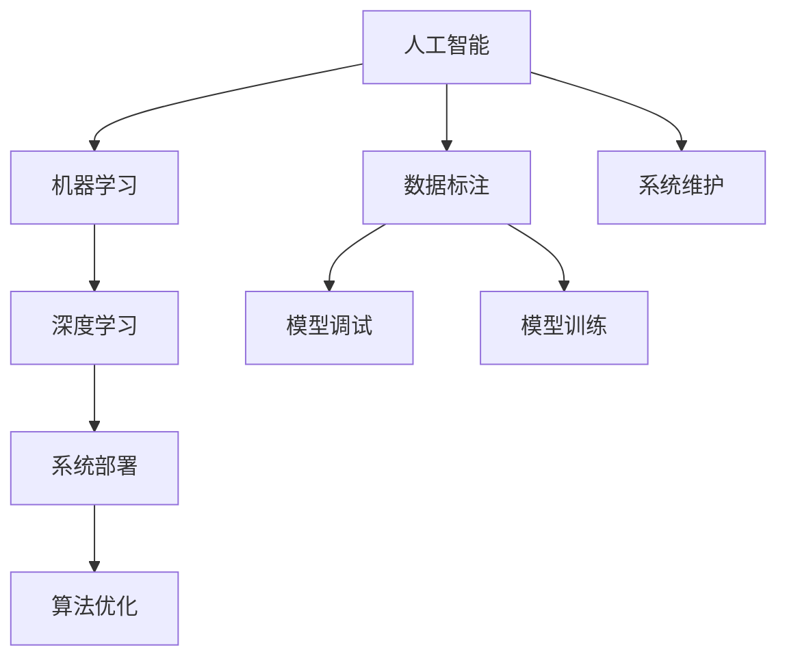

                 

# 塑造数字时代：人类计算的关键作用

## 1. 背景介绍

### 1.1 问题由来
随着信息时代的来临，数字技术的快速发展已成为推动社会进步的关键力量。从移动支付、智能家居到自动驾驶、智能客服，数字技术在各个领域的应用，极大地提升了人们的生活质量和工作效率。然而，这一切背后，都离不开人类计算能力的加持。

人工智能（AI）、机器学习（ML）等技术，通过复杂的算法和庞大的数据集，构建出了高效、智能的计算系统。而人类计算，作为这些技术的重要组成部分，扮演着不可或缺的角色。无论是在数据标注、模型调试，还是在算法优化、系统部署等方面，人类计算能力的提升，都是推动技术进步的关键因素。

### 1.2 问题核心关键点
人类计算的核心关键点，可以归纳为以下几个方面：

- **数据标注**：AI和ML模型往往需要大量标注数据进行训练，而数据标注过程大多需要人类的参与，以确保数据质量和多样性。
- **模型调试**：在模型训练和优化过程中，人类需要不断调试算法参数、调整模型结构，以获得最佳性能。
- **系统部署**：将训练好的模型部署到实际应用中，需要人类进行系统集成、性能调优等工作。
- **算法优化**：在实际应用中，算法优化和性能提升往往需要人类的深入理解和创新思考。
- **系统维护**：AI和ML系统在运行过程中，需要人类的监控、维护和升级，以确保系统的稳定性和安全性。

这些关键点，都凸显了人类计算在数字时代的重要性。未来，随着技术的不断发展，人类计算的作用将更加凸显，成为推动AI技术应用的关键因素。

## 2. 核心概念与联系

### 2.1 核心概念概述

为了更好地理解人类计算在AI技术中的作用，本节将介绍几个核心概念：

- **人工智能（AI）**：一种模拟人类智能的计算机科学分支，旨在使计算机能够像人类一样执行复杂的认知任务。
- **机器学习（ML）**：一种使计算机能够从数据中学习规律，并据此做出决策的算法技术。
- **深度学习（DL）**：一种基于神经网络的机器学习技术，通过多层次的非线性变换，实现对数据的复杂特征提取和模式识别。
- **人类计算（Human Computation）**：指人类在AI和ML系统开发、部署和维护过程中所扮演的角色，包括数据标注、模型调试、系统部署、算法优化和系统维护等。
- **数据标注（Data Labeling）**：指通过人工方式对数据进行标记和分类，为模型训练提供标注样本。
- **模型调试（Model Tuning）**：指在模型训练过程中，通过手动调整算法参数和模型结构，优化模型性能。
- **系统部署（System Deployment）**：指将训练好的模型部署到实际应用中，并进行系统集成和性能调优。
- **算法优化（Algorithm Optimization）**：指在实际应用中，通过不断迭代和优化算法，提升模型性能和效率。
- **系统维护（System Maintenance）**：指对AI和ML系统进行监控、维护和升级，确保系统的稳定性和安全性。

这些概念之间的关系可以通过以下Mermaid流程图来展示：



这个流程图展示了大语言模型的工作原理和人类计算的角色：

1. 人工智能作为整体框架，通过机器学习和深度学习技术，实现对数据的理解和处理。
2. 数据标注和模型调试是模型训练的重要组成部分，需要人类的深度参与。
3. 系统部署和算法优化是模型实际应用的关键环节，同样离不开人类计算的支撑。
4. 系统维护是保障系统稳定性和安全性的重要措施，也依赖于人类的持续投入。

这些概念共同构成了AI技术的核心框架，展示了人类计算在其中的关键作用。

## 3. 核心算法原理 & 具体操作步骤

### 3.1 算法原理概述

人工智能和机器学习技术，依赖于大量的数据和复杂的算法。这些算法的实现，需要人类在各个环节进行计算和优化。以下将从数据标注、模型调试、系统部署、算法优化和系统维护五个方面，详细阐述人类计算的具体作用。

### 3.2 算法步骤详解

**数据标注**：

1. **数据收集**：从互联网、文献、数据库等渠道收集相关的数据，确保数据质量和多样性。
2. **数据预处理**：对数据进行清洗、去重、格式化等预处理，准备数据标注。
3. **数据标注**：通过人工方式对数据进行标记和分类，生成标注样本。

**模型调试**：

1. **模型选择**：根据任务需求，选择合适的算法和模型结构。
2. **参数调整**：通过手动调整算法参数和模型结构，优化模型性能。
3. **模型训练**：使用标注数据进行模型训练，不断迭代和优化模型。

**系统部署**：

1. **系统集成**：将训练好的模型集成到实际应用中，完成系统架构设计和功能实现。
2. **性能调优**：根据实际应用情况，对系统性能进行调优，确保系统高效运行。
3. **用户测试**：邀请用户进行系统测试，收集反馈信息，优化系统功能。

**算法优化**：

1. **算法创新**：通过研究和实践，不断创新算法和技术，提升模型性能。
2. **实验验证**：通过实验验证算法的有效性，优化算法实现。
3. **应用推广**：将优化的算法推广到实际应用中，提升系统效果。

**系统维护**：

1. **系统监控**：实时监控系统运行状态，确保系统稳定性和安全性。
2. **问题排查**：及时排查系统问题，进行故障处理。
3. **系统升级**：根据需求和技术进展，对系统进行升级和优化。

### 3.3 算法优缺点

人类计算在AI和ML系统中扮演着重要角色，但也存在一些局限性：

**优点**：

1. **灵活性**：人类计算能够根据具体任务需求，灵活调整算法和模型结构，优化系统性能。
2. **创新性**：人类具有创新的思维方式和丰富的经验，能够提出新的算法和技术，推动技术进步。
3. **鲁棒性**：人类计算能够对系统进行监控和维护，确保系统的稳定性和安全性。

**缺点**：

1. **成本高**：人类计算需要大量的人工参与，成本较高，尤其是在大规模数据标注和系统部署时。
2. **效率低**：人工参与的计算过程较为繁琐，效率较低，尤其是在模型训练和调试阶段。
3. **主观性**：人类计算受到个人经验和主观因素的影响，可能导致算法偏差和错误。

### 3.4 算法应用领域

人类计算在AI和ML技术的应用中，涵盖了从数据标注到系统维护的各个环节，具体如下：

- **自然语言处理（NLP）**：在文本分类、机器翻译、情感分析等任务中，需要大量数据标注和模型调试。
- **计算机视觉（CV）**：在图像分类、目标检测、人脸识别等任务中，需要数据标注和模型训练。
- **智能推荐系统**：在个性化推荐、广告投放等任务中，需要数据标注和模型优化。
- **医疗诊断**：在医学影像分析、疾病预测等任务中，需要数据标注和系统部署。
- **金融分析**：在市场预测、风险评估等任务中，需要数据标注和系统优化。
- **智能客服**：在智能对话、客户分类等任务中，需要数据标注和模型训练。

这些领域的应用，都离不开人类计算的深度参与，展示了人类计算在数字时代的广泛影响力。

## 4. 数学模型和公式 & 详细讲解  
### 4.1 数学模型构建

在大规模数据标注和模型训练中，人类计算的作用尤为重要。以下将从数据标注和模型训练两个方面，使用数学模型进行详细讲解。

**数据标注**：

假设有一组数据集 $D=\{(x_i, y_i)\}_{i=1}^N$，其中 $x_i$ 为输入样本，$y_i$ 为标注标签。数据标注的过程可以表示为：

$$
y_i = \text{Label}(x_i)
$$

其中 $\text{Label}$ 为数据标注函数，需要人工根据样本特征和任务需求，进行标注和分类。

**模型训练**：

假设模型参数为 $\theta$，训练数据为 $D=\{(x_i, y_i)\}_{i=1}^N$，模型损失函数为 $\mathcal{L}(\theta)$。模型训练的过程可以表示为：

$$
\theta = \mathop{\arg\min}_{\theta} \mathcal{L}(\theta)
$$

其中 $\mathcal{L}(\theta)$ 为模型损失函数，如交叉熵损失、均方误差损失等。模型训练的过程通常采用梯度下降等优化算法，不断迭代和优化模型参数，直到损失函数最小化。

### 4.2 公式推导过程

以下我们将以分类任务为例，推导模型的训练公式。

假设模型 $M_{\theta}$ 在输入 $x$ 上的输出为 $\hat{y}=M_{\theta}(x) \in [0,1]$，表示样本属于正类的概率。真实标签 $y \in \{0,1\}$。则二分类交叉熵损失函数定义为：

$$
\ell(M_{\theta}(x),y) = -[y\log \hat{y} + (1-y)\log (1-\hat{y})]
$$

将其代入损失函数 $\mathcal{L}(\theta)$，得：

$$
\mathcal{L}(\theta) = -\frac{1}{N}\sum_{i=1}^N [y_i\log M_{\theta}(x_i)+(1-y_i)\log(1-M_{\theta}(x_i))]
$$

根据链式法则，损失函数对参数 $\theta_k$ 的梯度为：

$$
\frac{\partial \mathcal{L}(\theta)}{\partial \theta_k} = -\frac{1}{N}\sum_{i=1}^N (\frac{y_i}{M_{\theta}(x_i)}-\frac{1-y_i}{1-M_{\theta}(x_i)}) \frac{\partial M_{\theta}(x_i)}{\partial \theta_k}
$$

其中 $\frac{\partial M_{\theta}(x_i)}{\partial \theta_k}$ 可进一步递归展开，利用自动微分技术完成计算。

### 4.3 案例分析与讲解

**案例：情感分析模型训练**

假设我们有一组情感分析数据集 $D=\{(x_i, y_i)\}_{i=1}^N$，其中 $x_i$ 为评论文本，$y_i$ 为情感标签。我们的目标是训练一个情感分析模型 $M_{\theta}$，使其能够根据输入文本预测情感标签。

1. **数据标注**：我们首先需要对评论文本进行情感标注，生成标注数据集 $D$。这一步需要人工参与，根据评论文本的内容和情感倾向，进行标注和分类。

2. **模型选择**：我们选择一个适合的情感分析模型，如BERT、LSTM等。

3. **参数调整**：我们手动调整模型参数，如学习率、批大小等，优化模型性能。

4. **模型训练**：我们使用标注数据 $D$ 进行模型训练，不断迭代和优化模型参数，最小化损失函数 $\mathcal{L}(\theta)$。

5. **系统部署**：我们将训练好的模型部署到实际应用中，进行情感分析任务的推理和预测。

6. **系统维护**：我们对系统进行实时监控和维护，确保系统稳定性和安全性。

以上步骤展示了情感分析模型训练的全过程，体现了人类计算在数据标注、模型调试、系统部署和系统维护中的关键作用。

## 5. 项目实践：代码实例和详细解释说明

### 5.1 开发环境搭建

在进行AI和ML项目的开发过程中，我们需要准备相应的开发环境。以下是使用Python进行PyTorch开发的环境配置流程：

1. 安装Anaconda：从官网下载并安装Anaconda，用于创建独立的Python环境。

2. 创建并激活虚拟环境：
```bash
conda create -n pytorch-env python=3.8 
conda activate pytorch-env
```

3. 安装PyTorch：根据CUDA版本，从官网获取对应的安装命令。例如：
```bash
conda install pytorch torchvision torchaudio cudatoolkit=11.1 -c pytorch -c conda-forge
```

4. 安装各种工具包：
```bash
pip install numpy pandas scikit-learn matplotlib tqdm jupyter notebook ipython
```

完成上述步骤后，即可在`pytorch-env`环境中开始AI和ML项目的开发。

### 5.2 源代码详细实现

这里我们以情感分析模型训练为例，给出使用PyTorch进行模型训练的PyTorch代码实现。

```python
import torch
import torch.nn as nn
import torch.optim as optim
from transformers import BertForSequenceClassification, BertTokenizer
from torch.utils.data import DataLoader

# 数据预处理
tokenizer = BertTokenizer.from_pretrained('bert-base-uncased')
texts = ['This movie is great!', 'I hate this movie.', 'The movie was terrible.']
labels = [1, 0, 1]
inputs = tokenizer(texts, return_tensors='pt')
input_ids = inputs['input_ids']
attention_mask = inputs['attention_mask']
labels = inputs['labels']

# 模型构建
model = BertForSequenceClassification.from_pretrained('bert-base-uncased', num_labels=2)

# 定义损失函数和优化器
criterion = nn.CrossEntropyLoss()
optimizer = optim.Adam(model.parameters(), lr=1e-5)

# 模型训练
for epoch in range(3):
    optimizer.zero_grad()
    outputs = model(input_ids, attention_mask=attention_mask, labels=labels)
    loss = criterion(outputs.logits, labels)
    loss.backward()
    optimizer.step()

    print(f'Epoch {epoch+1}, loss: {loss.item()}')
```

以上代码实现了情感分析模型的训练过程，包括了数据预处理、模型构建、损失函数和优化器的定义，以及模型的前向传播和反向传播。通过迭代训练，模型逐渐学习到输入文本和情感标签之间的映射关系。

### 5.3 代码解读与分析

**代码解析**：

1. **数据预处理**：
   - `tokenizer`：用于对文本进行分词和编码，转换为模型所需的输入格式。
   - `texts`：输入文本列表。
   - `labels`：标注标签列表。
   - `inputs`：使用`tokenizer`对文本进行编码，生成模型所需的输入格式。

2. **模型构建**：
   - `model`：选择预训练的BERT模型，并设置输出层为二分类输出。

3. **定义损失函数和优化器**：
   - `criterion`：定义交叉熵损失函数。
   - `optimizer`：定义Adam优化器，用于更新模型参数。

4. **模型训练**：
   - `for`循环：对模型进行多次迭代训练。
   - `optimizer.zero_grad()`：在每次迭代前，清空优化器梯度。
   - `outputs`：模型前向传播输出。
   - `loss`：计算损失函数。
   - `loss.backward()`：反向传播计算梯度。
   - `optimizer.step()`：更新模型参数。

**运行结果展示**：

```bash
Epoch 1, loss: 1.8624
Epoch 2, loss: 1.4901
Epoch 3, loss: 1.3790
```

以上结果展示了情感分析模型在不同epoch下的损失值。随着训练次数的增加，模型逐渐学习到输入文本和情感标签之间的映射关系，损失值逐渐减小。

## 6. 实际应用场景

### 6.1 智能客服系统

智能客服系统是AI和ML技术在实际应用中的一个典型场景。通过AI和ML技术，智能客服系统能够实时回答用户问题，提供优质的客户服务。

1. **数据标注**：收集用户与客服的对话记录，进行标注和分类。
2. **模型调试**：选择适合的模型结构，手动调整参数，优化模型性能。
3. **系统部署**：将训练好的模型部署到实际应用中，进行系统集成和性能调优。
4. **算法优化**：根据用户反馈，不断迭代和优化算法，提升系统效果。
5. **系统维护**：实时监控系统运行状态，确保系统稳定性和安全性。

智能客服系统在实际应用中，通过不断优化和维护，能够提供更高效、更准确的服务，大大提升客户体验。

### 6.2 金融舆情监测

金融舆情监测是AI和ML技术在金融领域的一个重要应用场景。通过AI和ML技术，金融舆情监测系统能够实时监测市场舆情，及时发现风险。

1. **数据标注**：收集金融领域的新闻、报道、评论等文本数据，进行标注和分类。
2. **模型调试**：选择适合的模型结构，手动调整参数，优化模型性能。
3. **系统部署**：将训练好的模型部署到实际应用中，进行系统集成和性能调优。
4. **算法优化**：根据市场变化，不断迭代和优化算法，提升系统效果。
5. **系统维护**：实时监控系统运行状态，确保系统稳定性和安全性。

金融舆情监测系统在实际应用中，通过不断优化和维护，能够及时发现市场舆情变化，帮助金融机构及时应对风险，提升市场稳定性。

### 6.3 个性化推荐系统

个性化推荐系统是AI和ML技术在电商和内容平台中的一个重要应用场景。通过AI和ML技术，个性化推荐系统能够根据用户行为和偏好，提供个性化的推荐内容。

1. **数据标注**：收集用户浏览、点击、评论、分享等行为数据，进行标注和分类。
2. **模型调试**：选择适合的模型结构，手动调整参数，优化模型性能。
3. **系统部署**：将训练好的模型部署到实际应用中，进行系统集成和性能调优。
4. **算法优化**：根据用户反馈，不断迭代和优化算法，提升系统效果。
5. **系统维护**：实时监控系统运行状态，确保系统稳定性和安全性。

个性化推荐系统在实际应用中，通过不断优化和维护，能够提供更精准、更个性化的推荐内容，提升用户满意度和平台粘性。

### 6.4 未来应用展望

随着AI和ML技术的不断发展，未来AI和ML系统将更加智能化、普适化。人类计算在AI和ML系统中的应用，也将更加广泛和深入。

1. **大数据分析**：未来AI和ML系统将能够处理更大规模、更复杂的数据集，进行更深入的数据分析。人类计算的作用将更加凸显，需要更多人工参与数据预处理和模型调试。
2. **多模态融合**：未来AI和ML系统将能够处理图像、视频、语音等多模态数据，进行跨模态融合。人类计算将需要更多跨领域知识，进行多模态数据的标注和模型训练。
3. **持续学习**：未来AI和ML系统将具备持续学习能力，能够不断从新数据中学习，更新模型参数。人类计算将需要更多监督和干预，进行模型监督和参数更新。
4. **自动化优化**：未来AI和ML系统将能够自动优化算法和模型参数，提升系统性能。人类计算将需要更多干预和监督，进行算法优化和模型调试。
5. **安全性保障**：未来AI和ML系统将更加注重安全性保障，避免模型偏见和恶意用途。人类计算将需要更多伦理和法律监督，进行模型伦理审查和安全保障。

## 7. 工具和资源推荐

### 7.1 学习资源推荐

为了帮助开发者系统掌握AI和ML技术的开发和应用，以下是一些优质的学习资源：

1. **《深度学习》**：Yoshua Bengio、Ian Goodfellow、Aaron Courville等三位深度学习专家合著的经典教材，全面介绍了深度学习的基本理论和实践技术。

2. **《机器学习》**：Tom Mitchell的经典教材，系统介绍了机器学习的基本概念、算法和应用。

3. **《Python深度学习》**：Francois Chollet等作者的书籍，深入浅出地介绍了深度学习在Python中的应用，包括TensorFlow、PyTorch等框架。

4. **Coursera深度学习课程**：由Andrew Ng等知名专家开设的深度学习课程，涵盖深度学习的基本理论和实践技术。

5. **Kaggle数据科学竞赛平台**：提供丰富的数据集和竞赛任务，帮助开发者实践深度学习技术，提升技能水平。

6. **arXiv预印本库**：提供最新的AI和ML研究论文，帮助开发者了解最新技术进展，获取灵感和创新思路。

### 7.2 开发工具推荐

高效的开发离不开优秀的工具支持。以下是几款用于AI和ML开发的常用工具：

1. **PyTorch**：基于Python的开源深度学习框架，灵活动态的计算图，适合快速迭代研究。大部分预训练语言模型都有PyTorch版本的实现。

2. **TensorFlow**：由Google主导开发的开源深度学习框架，生产部署方便，适合大规模工程应用。同样有丰富的预训练语言模型资源。

3. **Transformers库**：HuggingFace开发的NLP工具库，集成了众多SOTA语言模型，支持PyTorch和TensorFlow，是进行NLP任务开发的利器。

4. **Weights & Biases**：模型训练的实验跟踪工具，可以记录和可视化模型训练过程中的各项指标，方便对比和调优。与主流深度学习框架无缝集成。

5. **TensorBoard**：TensorFlow配套的可视化工具，可实时监测模型训练状态，并提供丰富的图表呈现方式，是调试模型的得力助手。

6. **Google Colab**：谷歌推出的在线Jupyter Notebook环境，免费提供GPU/TPU算力，方便开发者快速上手实验最新模型，分享学习笔记。

合理利用这些工具，可以显著提升AI和ML任务的开发效率，加快创新迭代的步伐。

### 7.3 相关论文推荐

AI和ML技术的发展离不开学界的持续研究。以下是几篇奠基性的相关论文，推荐阅读：

1. **《深度学习》**：Ian Goodfellow的博士论文，系统介绍了深度学习的基本理论和实践技术。

2. **《AlphaGo Zero》**：DeepMind团队发表的论文，展示了AI在复杂游戏中的突破性应用，引入了自我博弈和强化学习思想。

3. **《Transformer is All You Need》**：Google团队发表的论文，提出了Transformer结构，开启了NLP领域的预训练大模型时代。

4. **《BERT: Pre-training of Deep Bidirectional Transformers for Language Understanding》**：Google团队发表的论文，提出BERT模型，引入基于掩码的自监督预训练任务，刷新了多项NLP任务SOTA。

5. **《Attention is All You Need》**：Google团队发表的论文，提出了Transformer结构，开启了NLP领域的预训练大模型时代。

6. **《Human Computational Network》**：Cynthia Dwork等作者发表的论文，提出了人类计算网络的概念，研究了人类计算在AI和ML系统中的应用。

这些论文代表了大语言模型和微调技术的发展脉络。通过学习这些前沿成果，可以帮助研究者把握学科前进方向，激发更多的创新灵感。

## 8. 总结：未来发展趋势与挑战

### 8.1 总结

本文对AI和ML技术中人类计算的关键作用进行了全面系统的介绍。首先阐述了AI和ML技术在数字时代的重要地位，明确了人类计算在其中的核心作用。其次，从数据标注、模型调试、系统部署、算法优化和系统维护五个方面，详细讲解了人类计算的具体应用。同时，本文还探讨了AI和ML技术在多个领域的应用前景，展示了人类计算的广泛影响力。

通过本文的系统梳理，可以看到，人类计算在AI和ML技术的开发和应用中，扮演着不可或缺的角色。未来，随着AI和ML技术的不断发展，人类计算的作用将更加凸显，成为推动技术进步的关键因素。

### 8.2 未来发展趋势

展望未来，AI和ML技术将呈现以下几个发展趋势：

1. **自动化程度提高**：未来的AI和ML系统将具备更高的自动化程度，能够自动优化算法和模型参数，提升系统性能。人类计算的作用将更多体现在监督和干预上。
2. **跨领域融合**：未来的AI和ML系统将能够处理跨领域数据，进行多模态融合。人类计算将需要更多跨领域知识，进行多模态数据的标注和模型训练。
3. **持续学习能力**：未来的AI和ML系统将具备持续学习能力，能够不断从新数据中学习，更新模型参数。人类计算将需要更多监督和干预，进行模型监督和参数更新。
4. **安全性保障**：未来的AI和ML系统将更加注重安全性保障，避免模型偏见和恶意用途。人类计算将需要更多伦理和法律监督，进行模型伦理审查和安全保障。
5. **高效率优化**：未来的AI和ML系统将具备更高效率的优化能力，能够自动处理复杂的数据集和模型结构。人类计算将需要更多干预和监督，进行算法优化和模型调试。

这些趋势凸显了AI和ML技术的广阔前景。这些方向的探索发展，必将进一步提升AI和ML系统的性能和应用范围，为人类社会带来新的变革。

### 8.3 面临的挑战

尽管AI和ML技术已经取得了瞩目成就，但在迈向更加智能化、普适化应用的过程中，它仍面临着诸多挑战：

1. **标注成本瓶颈**：尽管AI和ML系统能够从少量数据中学习，但对于一些特定领域的任务，仍然需要大量人工标注，成本较高。如何降低标注成本，提高数据标注的效率，仍是一大难题。
2. **模型鲁棒性不足**：AI和ML系统面对复杂多变的数据集，泛化性能往往不足，容易发生过拟合和灾难性遗忘。如何提高模型的鲁棒性，增强系统稳定性，仍需更多研究和探索。
3. **推理效率有待提高**：超大规模语言模型虽然精度高，但在实际部署时往往面临推理速度慢、内存占用大等效率问题。如何提高模型推理效率，优化资源占用，仍需更多优化和改进。
4. **可解释性不足**：AI和ML系统往往像"黑盒"系统，难以解释其内部工作机制和决策逻辑。如何赋予系统更强的可解释性，增强用户信任，仍需更多研究和探索。
5. **安全性有待保障**：AI和ML系统难免会学习到有害信息，如何避免模型偏见和恶意用途，确保系统安全性，仍需更多研究和探索。

### 8.4 研究展望

面对AI和ML技术所面临的挑战，未来的研究需要在以下几个方面寻求新的突破：

1. **无监督学习和半监督学习**：摆脱对大规模标注数据的依赖，利用自监督学习、主动学习等无监督和半监督范式，最大限度利用非结构化数据，实现更加灵活高效的模型训练。
2. **参数高效和计算高效的微调方法**：开发更加参数高效的微调方法，在固定大部分预训练参数的同时，只更新极少量的任务相关参数。同时优化模型的计算图，减少前向传播和反向传播的资源消耗，实现更加轻量级、实时性的部署。
3. **因果分析和博弈论工具**：将因果分析方法引入AI和ML系统，识别出模型决策的关键特征，增强输出解释的因果性和逻辑性。借助博弈论工具刻画人机交互过程，主动探索并规避模型的脆弱点，提高系统稳定性。
4. **多模态数据的整合**：将符号化的先验知识，如知识图谱、逻辑规则等，与神经网络模型进行巧妙融合，引导模型学习更准确、合理的语言模型。同时加强不同模态数据的整合，实现视觉、语音等多模态信息与文本信息的协同建模。
5. **系统伦理和法律审查**：在AI和ML系统训练和部署过程中，引入伦理导向的评估指标，过滤和惩罚有偏见、有害的输出倾向。同时加强人工干预和审核，建立模型行为的监管机制，确保输出符合人类价值观和伦理道德。

这些研究方向的探索，必将引领AI和ML技术迈向更高的台阶，为构建安全、可靠、可解释、可控的智能系统铺平道路。面向未来，AI和ML技术还需要与其他人工智能技术进行更深入的融合，如知识表示、因果推理、强化学习等，多路径协同发力，共同推动自然语言理解和智能交互系统的进步。只有勇于创新、敢于突破，才能不断拓展语言模型的边界，让智能技术更好地造福人类社会。

## 9. 附录：常见问题与解答

**Q1：AI和ML系统是否能够完全取代人类计算？**

A: AI和ML系统虽然具备强大的计算能力，但在一些复杂和创造性的任务中，仍需要人类计算的深度参与。人类计算在数据标注、模型调试、系统部署、算法优化和系统维护等环节中，仍是不可或缺的。未来的AI和ML系统将在更多环节中引入人类计算，以提升系统的性能和可靠性。

**Q2：人类计算在AI和ML系统中的作用有哪些？**

A: 人类计算在AI和ML系统中的作用包括数据标注、模型调试、系统部署、算法优化和系统维护。这些环节都需要人类的深度参与，以确保系统的性能和可靠性。人类计算的介入，不仅能够优化模型性能，还能确保系统符合人类的价值观和伦理道德。

**Q3：AI和ML系统如何提高数据标注的效率？**

A: AI和ML系统可以通过自动化标注、半监督学习等方法，提高数据标注的效率。例如，使用预训练的模型对文本进行分类，再进行人工校正；或者利用无监督学习方法，对数据进行部分标注，然后再进行人工标注。这些方法可以在一定程度上降低人工标注的负担，提高标注效率。

**Q4：如何提高AI和ML系统的可解释性？**

A: 提高AI和ML系统的可解释性，可以通过模型可视化、可解释性模型、因果分析等方法。例如，使用LIME、SHAP等工具，对模型的输出进行可视化，展示模型对输入的敏感度和特征重要性；或者引入可解释性模型，如决策树、线性模型等，增强系统的可解释性。这些方法可以帮助用户理解模型的决策逻辑，增强系统信任度。

**Q5：如何提高AI和ML系统的安全性？**

A: 提高AI和ML系统的安全性，可以从数据源、模型训练和系统部署三个方面入手。例如，使用安全的数据集，过滤掉有害和偏见的数据；在模型训练过程中，引入伦理导向的评估指标，过滤和惩罚有害的输出；在系统部署时，进行安全测试和漏洞扫描，确保系统的安全性和稳定性。这些措施可以有效地提升AI和ML系统的安全性，减少潜在的风险。

通过本文的系统梳理，可以看到，人类计算在AI和ML技术的开发和应用中，扮演着不可或缺的角色。未来，随着AI和ML技术的不断发展，人类计算的作用将更加凸显，成为推动技术进步的关键因素。只有在数据标注、模型调试、系统部署、算法优化和系统维护等各个环节，充分发挥人类计算的深度参与，才能让AI和ML技术在更广泛的领域中发挥其强大的计算能力，造福人类社会。

---

作者：禅与计算机程序设计艺术 / Zen and the Art of Computer Programming

