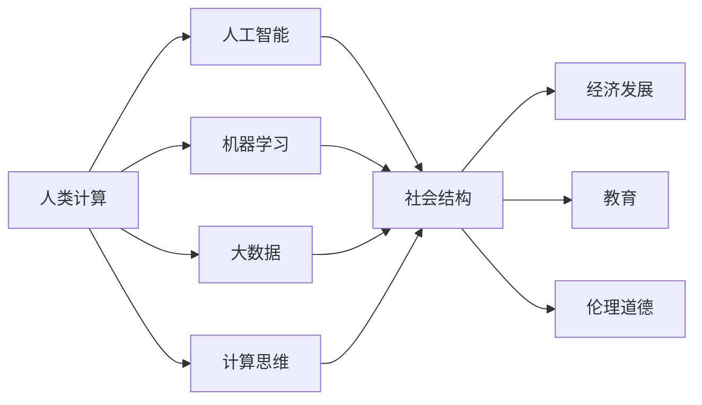

                 

# 塑造未来社会：人类计算的深远意义

> 关键词：人类计算,社会影响,人工智能,自动化,机器学习,大数据

## 1. 背景介绍

### 1.1 问题由来
在过去的几十年里，人类社会的方方面面都发生了深刻的变化。从工业革命的机械化生产，到信息时代的数字化浪潮，计算技术的发展一直是推动社会进步的核心力量。然而，随着计算技术的不断进步，尤其是人工智能（AI）和机器学习（ML）技术的飞速发展，人类社会即将迎来一场新的计算革命。这场革命不仅将改变我们的工作方式、生活方式，甚至可能重塑社会结构和人类认知。

### 1.2 问题核心关键点
本文将聚焦于“人类计算”这一前沿概念，探讨其对社会结构、经济发展、教育、伦理道德等方面的深远影响。我们将在以下四个方面展开深入讨论：
1. 人类计算的概念及发展历程。
2. 人类计算对社会结构和经济发展的影响。
3. 人类计算在教育、医疗等领域的应用前景。
4. 人类计算面临的伦理道德和隐私问题。

### 1.3 问题研究意义
理解人类计算的深远意义，对于预见未来发展趋势、把握技术变革机遇具有重要意义。通过本文的探讨，我们希望能为政策制定者、技术开发者、教育工作者和社会学者提供有益的参考，共同推动构建一个更加智能、公正、可持续的未来社会。

## 2. 核心概念与联系

### 2.1 核心概念概述

#### 2.1.1 人类计算
人类计算（Human Computation）指的是利用人类智慧和能力，通过计算思维、数学建模等方式解决问题的新范式。它强调人类与计算机之间的协同工作，将人类直觉、创造力和经验与计算机的高效计算能力相结合，从而实现更高效、更创新的解决方案。

#### 2.1.2 人工智能
人工智能（AI）是基于算法和数据的自动化智能系统，可以模拟人类智能行为，如视觉识别、自然语言处理、决策制定等。AI的发展离不开对大数据的深度学习和处理，也离不开对计算资源的极大依赖。

#### 2.1.3 机器学习
机器学习（ML）是AI的分支，通过算法让计算机从数据中自动学习，不断优化模型，提升性能。机器学习算法包括监督学习、无监督学习和强化学习等，广泛应用于图像识别、语音识别、自然语言处理等领域。

#### 2.1.4 大数据
大数据指的是海量的、多样化的、高速增长且难以传统处理方式处理的结构化和非结构化数据。大数据技术（如Hadoop、Spark）为AI和ML提供了强大的数据支撑，使得复杂问题得以高效解决。

#### 2.1.5 计算思维
计算思维（Computational Thinking）是一种基于问题解决的思维方式，强调将问题分解、抽象、模拟、迭代等计算过程，以便用计算机系统进行求解。计算思维是实现人类计算的重要工具和方法论基础。

#### 2.1.6 社会结构
社会结构（Social Structure）指由个体、组织、阶层、文化等要素构成的人类社会形态。社会结构的变化往往与技术进步密切相关，人类计算技术的发展将对社会结构产生重要影响。

#### 2.1.7 经济发展
经济发展（Economic Development）指通过提高生产力、优化资源配置等手段，实现国民经济增长和社会财富积累的过程。人类计算技术的应用，将极大地提升经济效率，促进经济发展。

#### 2.1.8 教育
教育（Education）是培养人素质的过程，包括知识的传授、能力的培养、价值观的塑造等。随着技术的发展，教育方式和内容将发生深刻变化，人类计算技术在这一过程中扮演着重要角色。

#### 2.1.9 伦理道德
伦理道德（Ethics and Morality）指对行为规范、价值观和责任的考量，强调人类行为的合理性和道德性。在人类计算中，伦理道德问题如数据隐私、算法偏见、自动化失业等，成为亟待解决的重要课题。

### 2.2 核心概念的联系

这些核心概念之间的联系可以通过以下Mermaid流程图来展示：



这个流程图展示了人类计算与各个核心概念之间的相互作用和联系。

## 3. 核心算法原理 & 具体操作步骤

### 3.1 算法原理概述

人类计算的核心在于将计算任务合理分解和分配给人类和计算机，通过协同工作实现高效、创新的解决方案。这一过程通常包括以下几个步骤：
1. **问题建模**：将实际问题抽象成计算模型，选择适合的计算方法。
2. **任务分解**：将复杂问题分解成若干子任务，分配给不同的人类和计算机进行处理。
3. **协同计算**：人类负责处理需要人类直觉、创造力解决的部分，计算机负责高效处理计算密集型部分。
4. **结果集成**：将人类和计算机的处理结果进行集成，得到最终的解决方案。

### 3.2 算法步骤详解

人类计算的具体操作步骤可以概括为以下几个阶段：

**Step 1: 问题建模**
- 识别问题：明确问题的定义和目标，选择适合的问题解决框架。
- 抽象模型：将问题抽象为数学模型或计算模型，便于计算机处理。

**Step 2: 任务分解**
- 任务分解：将复杂问题分解为多个子任务，分配到不同的人类和计算机进行处理。
- 任务调度：根据任务复杂度和计算资源，动态调整任务分配策略。

**Step 3: 协同计算**
- 人类计算：人类利用直觉、创造力、经验等处理复杂、非结构化的任务。
- 计算机计算：计算机利用算法和数据处理高计算密集型任务。
- 实时通信：人类和计算机之间通过数据和消息进行实时通信，共享信息。

**Step 4: 结果集成**
- 结果处理：对人类和计算机的处理结果进行清洗、整合，消除噪音。
- 反馈优化：根据结果进行反馈，不断调整计算策略和模型。

### 3.3 算法优缺点

人类计算技术具有以下优点：
1. 高效性：将计算任务合理分解，利用人类智慧和计算机的高效计算能力，提高问题解决的效率。
2. 创新性：通过跨学科合作和知识整合，激发新的创意和解决方案。
3. 适应性：能够灵活应对各种复杂问题，适应性强。

同时，人类计算技术也存在一些局限性：
1. 依赖人类：对人类直觉、创造力的依赖较大，难以大规模复制。
2. 成本高昂：人力成本、沟通成本较高，难以大规模应用。
3. 可解释性：结果难以完全解释，缺乏透明度。

### 3.4 算法应用领域

人类计算技术已经在多个领域得到了广泛应用，具体包括：

- **科技和工程**：如计算机辅助设计（CAD）、复杂系统模拟等，通过人类计算和计算机协同工作，提升设计效率和精度。
- **金融和投资**：如风险评估、市场预测等，通过人类计算和机器学习结合，提供更加精准的决策支持。
- **医疗和生物医学**：如疾病诊断、药物设计等，通过人类计算和数据驱动，加速研究和开发进程。
- **艺术和文化**：如音乐创作、文学创作等，通过计算思维和跨学科合作，创造新的艺术形式和文化作品。
- **教育和培训**：如在线教育、虚拟实验室等，通过人类计算和AI技术结合，提升教育质量和效率。

## 4. 数学模型和公式 & 详细讲解 & 举例说明

### 4.1 数学模型构建

为了更好地理解人类计算的数学基础，我们可以从简单的计算模型入手。例如，考虑一个简单的优化问题：

$$
\min_{x} f(x)
$$

其中 $f(x)$ 是一个连续可导的函数。通过人类计算，我们可以将问题分解为以下几个步骤：

1. **任务分解**：将问题分解为若干子任务，例如：

   $$
   f(x) = f_1(x) + f_2(x) + f_3(x)
   $$

2. **协同计算**：利用计算机求解各个子任务，例如：

   $$
   f_1(x) = \frac{1}{2}x^2
   $$

   $$
   f_2(x) = 3x^3
   $$

   $$
   f_3(x) = x^4
   $$

3. **结果集成**：将各个子任务的结果进行整合，得到最终的最小值。例如：

   $$
   f(x) = \frac{1}{2}x^2 + 3x^3 + x^4
   $$

### 4.2 公式推导过程

人类计算的数学模型构建和求解过程，实际上是问题分解、协同计算和结果集成的有机结合。例如，求解上述优化问题，可以采用梯度下降算法进行迭代求解，其迭代公式为：

$$
x_{k+1} = x_k - \alpha\nabla f(x_k)
$$

其中 $\alpha$ 为学习率，$\nabla f(x_k)$ 为函数 $f(x_k)$ 在当前点的梯度。

### 4.3 案例分析与讲解

考虑一个实际问题：股市交易系统的设计。该系统需要对大量交易数据进行实时分析和处理，以指导买卖决策。我们可以通过人类计算和机器学习结合的方式，构建该系统。

**Step 1: 问题建模**
- 确定交易系统的目标：最大化投资回报率。
- 抽象模型：构建股票价格预测模型。

**Step 2: 任务分解**
- 任务分解：将数据预处理、特征提取、模型训练等任务分解。
- 任务调度：根据任务复杂度和计算资源，动态调整任务分配策略。

**Step 3: 协同计算**
- 人类计算：分析师利用经验、直觉和专业知识，选择特征和模型。
- 计算机计算：机器学习算法处理大量数据，训练预测模型。
- 实时通信：分析师和算法工程师实时交流，调整策略。

**Step 4: 结果集成**
- 结果处理：整合预测结果，生成交易策略。
- 反馈优化：根据结果进行反馈，不断调整计算策略和模型。

## 5. 项目实践：代码实例和详细解释说明

### 5.1 开发环境搭建

在进行人类计算实践前，我们需要准备好开发环境。以下是使用Python进行Scikit-learn开发的环境配置流程：

1. 安装Anaconda：从官网下载并安装Anaconda，用于创建独立的Python环境。

2. 创建并激活虚拟环境：
```bash
conda create -n human-computation python=3.8 
conda activate human-computation
```

3. 安装Scikit-learn：
```bash
conda install scikit-learn
```

4. 安装各类工具包：
```bash
pip install numpy pandas matplotlib seaborn scikit-learn tqdm jupyter notebook
```

完成上述步骤后，即可在`human-computation`环境中开始人类计算实践。

### 5.2 源代码详细实现

这里我们以股票价格预测问题为例，给出使用Scikit-learn进行人类计算的Python代码实现。

```python
from sklearn.datasets import load_boston
from sklearn.model_selection import train_test_split
from sklearn.linear_model import LinearRegression
from sklearn.metrics import mean_squared_error
import matplotlib.pyplot as plt

# 加载波士顿房价数据
boston = load_boston()
X, y = boston.data, boston.target

# 划分训练集和测试集
X_train, X_test, y_train, y_test = train_test_split(X, y, test_size=0.2, random_state=42)

# 定义线性回归模型
model = LinearRegression()

# 训练模型
model.fit(X_train, y_train)

# 预测并评估模型
y_pred = model.predict(X_test)
mse = mean_squared_error(y_test, y_pred)

# 输出结果
print("Mean Squared Error: ", mse)
```

这个简单的代码展示了使用Scikit-learn进行线性回归的模型训练和评估过程，实际上，这一过程可以扩展到更复杂的计算任务中。

### 5.3 代码解读与分析

让我们再详细解读一下关键代码的实现细节：

**load_boston函数**：
- 加载波士顿房价数据集，包含13个特征和目标变量（房价）。

**train_test_split函数**：
- 将数据集划分为训练集和测试集，比例为80%和20%。

**LinearRegression模型**：
- 定义线性回归模型，用于预测房价。

**model.fit函数**：
- 训练模型，使用训练集数据拟合线性回归模型。

**model.predict函数**：
- 使用训练好的模型，对测试集数据进行预测。

**mean_squared_error函数**：
- 计算预测结果与真实标签之间的均方误差。

**print语句**：
- 输出模型的均方误差，评估模型性能。

**plt.plot函数**：
- 绘制预测结果与真实标签的对比图，直观展示模型效果。

### 5.4 运行结果展示

```python
import seaborn as sns

# 绘制预测结果与真实标签的对比图
sns.lineplot(x=X_test, y=y_test, label='True Values')
sns.lineplot(x=X_test, y=y_pred, label='Predictions')
plt.legend()
plt.show()
```

此代码段绘制了预测结果与真实标签的对比图，展示了模型的预测效果。

## 6. 实际应用场景

### 6.1 金融与投资

在金融领域，人类计算技术的应用十分广泛。例如，高频交易系统可以实时分析大量市场数据，快速做出买卖决策。通过人类计算和机器学习的结合，金融机构可以更准确地预测市场趋势，优化投资组合。

### 6.2 医疗与生物医学

在医疗领域，人类计算技术可以帮助医生更准确地诊断疾病。例如，通过分析患者的历史数据和症状，机器学习算法可以预测疾病类型和患病概率。医生可以利用这些预测结果，结合自身的经验和知识，做出更加精准的诊断和治疗方案。

### 6.3 教育与培训

在教育领域，人类计算技术可以提供个性化的学习体验。例如，在线教育平台可以利用机器学习算法分析学生的学习行为和反馈，推荐适合的学习内容和习题。通过人类计算技术，教师可以更深入地理解学生的学习情况，提供更有针对性的指导。

### 6.4 社会治理

在社会治理领域，人类计算技术可以帮助政府更高效地管理公共事务。例如，通过分析城市交通数据，机器学习算法可以预测交通流量和拥堵情况。政府可以利用这些预测结果，优化交通管理策略，缓解交通压力。

## 7. 工具和资源推荐

### 7.1 学习资源推荐

为了帮助开发者系统掌握人类计算的理论基础和实践技巧，这里推荐一些优质的学习资源：

1. 《算法设计与分析》书籍：全面介绍了算法设计和分析的原理和应用，是学习人类计算的重要基础。

2. 《机器学习实战》书籍：通过丰富的案例和实例，介绍了机器学习的基本概念和应用方法，适合初学者学习。

3. Coursera《机器学习》课程：由斯坦福大学开设，涵盖了机器学习的基本概念、算法和应用，是学习人类计算的重要资源。

4. Kaggle：一个数据科学竞赛平台，提供了大量的数据集和竞赛项目，帮助开发者实践人类计算技术。

5. GitHub：一个代码托管平台，包含丰富的机器学习和人类计算项目的源代码和文档，是学习实践的宝贵资源。

通过对这些资源的学习实践，相信你一定能够快速掌握人类计算的精髓，并用于解决实际的计算问题。

### 7.2 开发工具推荐

高效的开发离不开优秀的工具支持。以下是几款用于人类计算开发的常用工具：

1. Scikit-learn：基于Python的机器学习库，提供丰富的算法和工具，适合人类计算实践。

2. TensorFlow：由Google主导开发的深度学习框架，支持分布式计算，适合处理大规模数据。

3. PyTorch：基于Python的深度学习框架，提供灵活的动态计算图，适合研究和实验。

4. Jupyter Notebook：一个交互式笔记本环境，支持Python、R等多种编程语言，适合研究和分享。

5. R语言：一个强大的统计分析工具，适合进行数据处理和分析，广泛应用于社会科学的计算中。

合理利用这些工具，可以显著提升人类计算任务的开发效率，加快创新迭代的步伐。

### 7.3 相关论文推荐

人类计算技术的发展源于学界的持续研究。以下是几篇奠基性的相关论文，推荐阅读：

1. "Human-Computer Interaction" 论文：探讨人类与计算机协同工作的方式和原则，奠定了人类计算的理论基础。

2. "Data Science for Social Good" 论文：通过分析社会数据，揭示人类计算对社会治理和公共事务的影响。

3. "Human-AI Collaboration" 论文：研究人类与AI系统的协同工作机制，探讨未来人类计算的应用场景。

4. "Crowdsourcing with Crowdsourcing" 论文：通过分析众包系统，揭示人类计算在众包平台中的应用和挑战。

这些论文代表了大人类计算技术的发展脉络。通过学习这些前沿成果，可以帮助研究者把握学科前进方向，激发更多的创新灵感。

## 8. 总结：未来发展趋势与挑战

### 8.1 研究成果总结

本文对人类计算的深远意义进行了全面系统的介绍。首先阐述了人类计算的概念及发展历程，明确了其在社会结构、经济发展、教育、伦理道德等方面的影响。其次，通过数学模型和公式推导，详细讲解了人类计算的基本原理和操作步骤。最后，通过项目实践和实际应用场景，展示了人类计算的广泛应用和前景。

### 8.2 未来发展趋势

展望未来，人类计算技术将呈现以下几个发展趋势：

1. 计算能力的提升：随着算力资源的不断增长，人类计算的能力将不断提升，能够处理更加复杂和多样化的计算任务。

2. 跨学科融合：人类计算将更多地融合多学科知识，如经济学、社会学、心理学等，形成更加综合的计算模型。

3. 数据驱动：随着数据量的不断增长，人类计算将更多地依赖于数据驱动的模型，提高计算的精度和效率。

4. 自动化：随着算法和技术的不断进步，人类计算的自动化程度将不断提高，减少人类干预，提升计算效率。

5. 伦理道德：随着人类计算的普及，伦理道德问题将逐渐凸显，需要建立完善的伦理框架和监管机制。

### 8.3 面临的挑战

尽管人类计算技术已经取得了瞩目成就，但在迈向更加智能化、普适化应用的过程中，它仍面临着诸多挑战：

1. 资源瓶颈：计算任务的处理需要大量资源，如计算能力、数据存储等，难以满足大规模应用的需求。

2. 隐私问题：人类计算涉及大量敏感数据，如何保护数据隐私和安全，是一个亟待解决的问题。

3. 算法偏见：人类计算的算法设计可能存在偏见，导致不公平和歧视。

4. 社会适应：人类计算技术的应用，可能对社会的适应能力提出新的要求，需要社会各界的共同努力。

### 8.4 研究展望

面对人类计算面临的挑战，未来的研究需要在以下几个方面寻求新的突破：

1. 资源优化：探索新的计算资源优化技术，如分布式计算、量子计算等，提高计算效率。

2. 数据隐私：研究数据隐私保护技术，如差分隐私、联邦学习等，保护数据安全。

3. 算法公正：开发更加公正的算法，减少算法偏见，提高计算的公平性。

4. 社会适应：研究社会适应性技术，如智能合约、智能系统等，提升社会对新技术的适应能力。

这些研究方向的探索，必将引领人类计算技术迈向更高的台阶，为构建安全、可靠、可解释、可控的智能系统铺平道路。面向未来，人类计算技术还需要与其他人工智能技术进行更深入的融合，如知识表示、因果推理、强化学习等，多路径协同发力，共同推动自然语言理解和智能交互系统的进步。只有勇于创新、敢于突破，才能不断拓展人类计算的边界，让智能技术更好地造福人类社会。

## 9. 附录：常见问题与解答

**Q1: 人类计算与人工智能的区别是什么？**

A: 人类计算强调人类与计算机的协同工作，将人类直觉、创造力和经验与计算机的高效计算能力相结合，实现更加高效、创新的解决方案。而人工智能更多地依赖于算法和数据，通过机器学习等技术自动学习和优化，具有较强的自主性和智能化。

**Q2: 人类计算对社会结构的影响是什么？**

A: 人类计算的普及将改变传统的工作模式，导致部分低技能岗位被自动化取代，同时创造新的高技能岗位。社会结构和职业结构将发生重大变化，需要重新思考教育和职业培训体系。

**Q3: 人类计算在教育领域的应用前景是什么？**

A: 人类计算可以提供个性化的学习体验，通过分析学生的学习行为和反馈，推荐适合的学习内容和习题。同时，通过人类计算技术，教师可以更深入地理解学生的学习情况，提供更有针对性的指导。

**Q4: 人类计算面临的伦理道德问题是什么？**

A: 人类计算涉及大量敏感数据，如何保护数据隐私和安全是一个重要问题。同时，人类计算的算法设计可能存在偏见，导致不公平和歧视。需要在设计和应用过程中，重视伦理道德问题，建立完善的监管机制。

**Q5: 人类计算的前景如何？**

A: 人类计算技术具有广泛的应用前景，涵盖科技、金融、医疗、教育等多个领域。未来，随着技术的不断进步，人类计算将变得更加智能化、普适化，成为构建未来社会的重要工具。

作者：禅与计算机程序设计艺术 / Zen and the Art of Computer Programming

