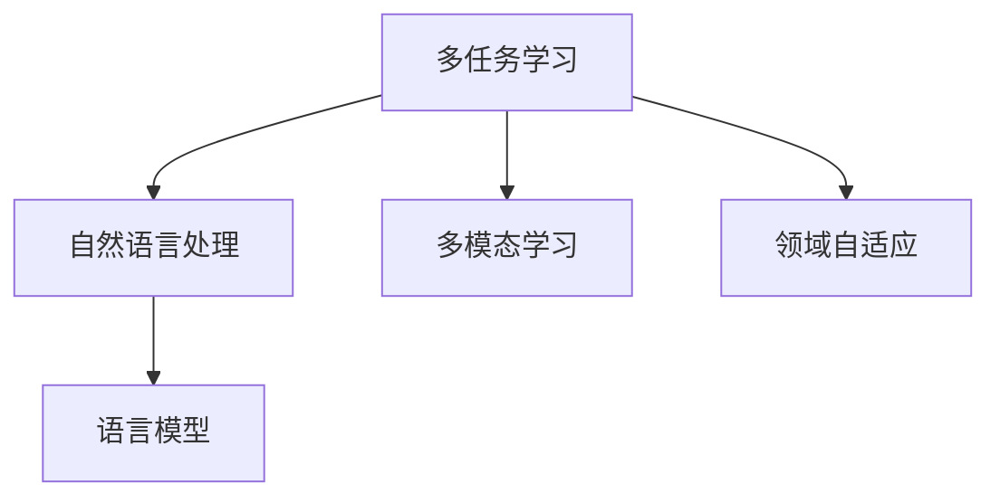

                 

# 多任务学习在NLP中的应用

> 关键词：多任务学习(Multitask Learning, MTL), 自然语言处理(Natural Language Processing, NLP), 多模态学习(Multimodal Learning), 领域自适应(F(domain Adaptation), 语言模型(Language Models)

## 1. 背景介绍

### 1.1 问题由来

多任务学习(Multitask Learning, MTL)作为一种重要的机器学习技术，通过同时学习多个相关任务，可以在不增加显著计算资源的前提下，提升模型的泛化能力和性能。在自然语言处理(Natural Language Processing, NLP)领域，多任务学习已经被证明能够显著提高模型在不同任务上的表现，特别是在数据量有限、样本分布不均衡的情况下。

近年来，随着深度学习技术的发展，多任务学习在NLP中的应用日益广泛，涵盖了文本分类、命名实体识别、情感分析、语言模型生成等诸多任务。多任务学习通过在预训练模型基础上，同时训练多个相关任务，使得模型能够更好地共享和利用多任务的共同特征，从而提高模型的整体性能。

然而，多任务学习在NLP中的应用也面临一些挑战。例如，如何设计合适的任务间关联关系、如何进行多任务模型的优化等，都是需要进一步研究的问题。此外，多任务学习的目标往往不明确，模型需要在多个任务间进行权衡，以取得最优的综合性能。

### 1.2 问题核心关键点

多任务学习在NLP中的应用核心关键点包括：

- **任务关联设计**：如何定义和设计多个相关任务的关联关系，使得模型能够充分利用多任务的共同特征，同时避免过度拟合某个特定任务。
- **模型参数共享**：如何设计多任务的参数共享机制，最大化不同任务间的知识迁移，提高模型的泛化能力。
- **模型优化策略**：如何设计有效的多任务优化算法，确保模型在不同任务间的性能平衡。
- **数据分布处理**：如何处理不同任务间数据分布不均衡的问题，确保每个任务都有足够的训练数据。
- **模型评估指标**：如何定义和评估多任务学习模型的性能，确保模型在不同任务上都能取得理想的效果。

## 2. 核心概念与联系

### 2.1 核心概念概述

为了更好地理解多任务学习在NLP中的应用，本节将介绍几个密切相关的核心概念：

- **多任务学习(MTL)**：通过同时训练多个相关任务，提升模型在不同任务上的性能。MTL可以缓解单一任务数据稀疏的问题，提高模型的泛化能力。

- **多模态学习(Multimodal Learning)**：涉及多模态数据的机器学习任务，如文本、图像、音频等，可以通过多模态学习技术，提升模型在不同模态数据上的性能。

- **领域自适应(F(Domain Adaptation)**：指在目标领域上训练模型，使其能够适应新的领域数据，提升模型的泛化能力。领域自适应是多任务学习的一个重要分支。

- **语言模型(Language Models)**：通过深度学习模型对自然语言进行建模，可以学习到丰富的语言知识，用于文本分类、语言生成、问答系统等任务。

这些核心概念之间的逻辑关系可以通过以下Mermaid流程图来展示：



这个流程图展示了大语言模型中的多任务学习技术及其与其他核心概念之间的关系：

1. 多任务学习在大语言模型中被广泛应用，提升模型在不同任务上的表现。
2. 多任务学习可以与多模态学习、领域自适应等技术结合，进一步拓展语言模型的应用边界。
3. 语言模型通过预训练和多任务学习技术，学习到丰富的语言知识和常识，用于各种NLP任务。

## 3. 核心算法原理 & 具体操作步骤
### 3.1 算法原理概述

多任务学习在NLP中的基本思想是通过同时训练多个相关任务，提升模型在不同任务上的性能。其核心算法原理如下：

假设有 $N$ 个相关任务 $T=\{T_1, T_2, ..., T_N\}$，每个任务 $T_i$ 对应的训练数据为 $D_i=\{(x_{i,j}, y_{i,j})\}_{j=1}^{n_i}$，其中 $x_{i,j}$ 为输入数据，$y_{i,j}$ 为任务 $T_i$ 对应的输出标签。

多任务学习的目标是通过训练一个共享的参数模型 $M_{\theta}$，使得模型在所有任务 $T$ 上都能取得较好的性能。因此，多任务学习的优化目标可以表示为：

$$
\min_{\theta} \sum_{i=1}^N \mathcal{L}_i(M_{\theta}, D_i)
$$

其中 $\mathcal{L}_i$ 为任务 $T_i$ 的损失函数，通常采用交叉熵、均方误差等常见损失函数。

### 3.2 算法步骤详解

多任务学习的具体步骤包括：

**Step 1: 准备预训练模型和数据集**

- 选择合适的预训练语言模型 $M_{\theta}$ 作为初始化参数，如 BERT、GPT 等。
- 准备多个相关任务的标注数据集 $D_i=\{(x_{i,j}, y_{i,j})\}_{j=1}^{n_i}$，确保每个任务都有足够的训练数据。

**Step 2: 定义任务关联关系**

- 选择合适的任务间关联关系，如单任务关联、联合训练等。
- 定义任务间的共享参数比例，如所有参数共享、部分参数共享等。

**Step 3: 设计多任务优化算法**

- 选择合适的多任务优化算法，如单任务交替优化、权重矩阵联合优化等。
- 设置适当的超参数，如学习率、批次大小、迭代轮数等。

**Step 4: 执行多任务训练**

- 对每个任务 $T_i$ 进行单独训练，计算损失函数 $\mathcal{L}_i(M_{\theta}, D_i)$。
- 计算所有任务损失的和 $\mathcal{L}(M_{\theta}, D)$。
- 使用梯度下降等优化算法，更新模型参数 $\theta$，最小化总损失 $\mathcal{L}(M_{\theta}, D)$。

**Step 5: 测试和部署**

- 在测试集上评估多任务学习模型的性能，对比预训练模型和微调模型的效果。
- 使用多任务学习模型对新样本进行推理预测，集成到实际的应用系统中。
- 持续收集新的数据，定期重新训练模型，以适应数据分布的变化。

以上是多任务学习在NLP中应用的一般流程。在实际应用中，还需要针对具体任务的特点，对多任务学习过程的各个环节进行优化设计，如改进损失函数设计，引入更多的正则化技术，搜索最优的超参数组合等，以进一步提升模型性能。

### 3.3 算法优缺点

多任务学习在NLP中的应用具有以下优点：

1. **提高泛化能力**：多任务学习通过同时训练多个相关任务，可以提升模型在不同任务上的泛化能力，缓解数据稀疏问题。
2. **优化资源利用**：多任务学习可以在不增加显著计算资源的前提下，提升模型的性能，优化资源利用。
3. **知识迁移**：多任务学习可以使得不同任务间共享知识，提升模型的综合性能。
4. **减少过拟合风险**：多任务学习可以降低过拟合风险，提高模型的稳定性。

然而，多任务学习在NLP中的应用也存在一些局限性：

1. **任务间关联设计复杂**：设计合适的任务间关联关系需要丰富的经验和深入的领域知识。
2. **任务间性能平衡难**：多任务学习需要在不同任务间进行权衡，找到最优的综合性能。
3. **模型复杂度增加**：多任务学习需要同时优化多个任务，模型复杂度增加，可能导致训练不稳定。
4. **数据分布不均衡**：多任务学习需要处理不同任务间数据分布不均衡的问题，确保每个任务都有足够的训练数据。

尽管存在这些局限性，但就目前而言，多任务学习仍是NLP领域的重要技术范式之一，能够显著提升模型在不同任务上的表现。未来相关研究的重点在于如何进一步简化任务间关联设计，提高模型的少样本学习和跨领域迁移能力，同时兼顾可解释性和伦理安全性等因素。

### 3.4 算法应用领域

多任务学习在NLP中的应用已经得到了广泛的应用，覆盖了多个领域，例如：

- **文本分类**：如情感分析、主题分类、意图识别等。通过多任务学习，模型可以同时学习多个分类任务，提高分类准确性。
- **命名实体识别**：识别文本中的人名、地名、机构名等特定实体。通过多任务学习，模型可以更好地学习实体的边界和类型。
- **关系抽取**：从文本中抽取实体之间的语义关系。通过多任务学习，模型可以同时学习实体-关系三元组和实体-实体关系。
- **问答系统**：对自然语言问题给出答案。通过多任务学习，模型可以同时学习多轮对话和生成任务，提高系统交互体验。
- **机器翻译**：将源语言文本翻译成目标语言。通过多任务学习，模型可以同时学习语言-语言映射和多模态翻译。
- **文本摘要**：将长文本压缩成简短摘要。通过多任务学习，模型可以同时学习摘要生成和语义理解。
- **对话系统**：使机器能够与人自然对话。通过多任务学习，模型可以同时学习对话生成和意图理解。

除了上述这些经典任务外，多任务学习还被创新性地应用到更多场景中，如可控文本生成、常识推理、代码生成、数据增强等，为NLP技术带来了全新的突破。随着预训练模型和多任务学习方法的不断进步，相信NLP技术将在更广阔的应用领域大放异彩。

## 4. 数学模型和公式 & 详细讲解 & 举例说明
### 4.1 数学模型构建

本节将使用数学语言对多任务学习在NLP中的应用进行更加严格的刻画。

假设有 $N$ 个相关任务 $T=\{T_1, T_2, ..., T_N\}$，每个任务 $T_i$ 对应的训练数据为 $D_i=\{(x_{i,j}, y_{i,j})\}_{j=1}^{n_i}$，其中 $x_{i,j}$ 为输入数据，$y_{i,j}$ 为任务 $T_i$ 对应的输出标签。

定义任务 $T_i$ 在输入 $x_{i,j}$ 上的损失函数为 $\ell_i(M_{\theta}(x_{i,j}),y_{i,j})$，则在数据集 $D$ 上的经验风险为：

$$
\mathcal{L}_i(M_{\theta}) = \frac{1}{n_i}\sum_{j=1}^{n_i} \ell_i(M_{\theta}(x_{i,j}),y_{i,j})
$$

多任务学习的优化目标是最小化所有任务的总损失：

$$
\mathcal{L}(M_{\theta}) = \sum_{i=1}^N \mathcal{L}_i(M_{\theta})
$$

在实践中，我们通常使用基于梯度的优化算法（如SGD、Adam等）来近似求解上述最优化问题。设 $\eta$ 为学习率，$\lambda$ 为正则化系数，则参数的更新公式为：

$$
\theta \leftarrow \theta - \eta \nabla_{\theta}\mathcal{L}(\theta) - \eta\lambda\theta
$$

其中 $\nabla_{\theta}\mathcal{L}(\theta)$ 为总损失函数对参数 $\theta$ 的梯度，可通过反向传播算法高效计算。

### 4.2 公式推导过程

以下我们以二分类任务为例，推导交叉熵损失函数及其梯度的计算公式。

假设模型 $M_{\theta}$ 在输入 $x_{i,j}$ 上的输出为 $\hat{y}_i=M_{\theta}(x_{i,j}) \in [0,1]$，表示样本属于正类的概率。真实标签 $y_{i,j} \in \{0,1\}$。则二分类交叉熵损失函数定义为：

$$
\ell_i(M_{\theta}(x_{i,j}),y_{i,j}) = -[y_{i,j}\log \hat{y}_i + (1-y_{i,j})\log (1-\hat{y}_i)]
$$

将其代入经验风险公式，得：

$$
\mathcal{L}_i(M_{\theta}) = -\frac{1}{n_i}\sum_{j=1}^{n_i} [y_{i,j}\log M_{\theta}(x_{i,j})+(1-y_{i,j})\log(1-M_{\theta}(x_{i,j}))
$$

在得到损失函数的梯度后，即可带入参数更新公式，完成模型的迭代优化。重复上述过程直至收敛，最终得到适应所有任务的共享模型参数 $\theta^*$。

### 4.3 案例分析与讲解

**案例一：多任务文本分类**

假设我们希望在两个分类任务上训练模型：情感分类和主题分类。两个任务共享相同的特征提取器，但分别使用不同的输出层和损失函数。

- 情感分类任务：将文本分类为正面或负面情感。
- 主题分类任务：将文本分类为新闻、体育、娱乐等主题。

我们设计了两个输出层，一个用于情感分类，另一个用于主题分类。训练过程中，同时计算两个任务的交叉熵损失，并求平均值作为总损失。在测试阶段，将模型输出通过softmax函数转换为概率分布，取最大值对应的类别作为预测结果。

**案例二：多任务命名实体识别**

命名实体识别任务通常包含多种类型的实体，如人名、地名、组织名等。通过多任务学习，模型可以同时学习不同类型实体的识别。

我们假设有一个预训练的BERT模型，可以通过微调来学习命名实体识别。我们将命名实体识别任务拆分为三个子任务：人名识别、地名识别、组织名识别。每个子任务使用不同的输出层和损失函数，但共享相同的BERT特征提取器。训练过程中，同时计算三个子任务的交叉熵损失，并求平均值作为总损失。在测试阶段，将模型输出通过softmax函数转换为概率分布，取最大值对应的类别作为预测结果。

## 5. 项目实践：代码实例和详细解释说明
### 5.1 开发环境搭建

在进行多任务学习实践前，我们需要准备好开发环境。以下是使用Python进行PyTorch开发的环境配置流程：

1. 安装Anaconda：从官网下载并安装Anaconda，用于创建独立的Python环境。

2. 创建并激活虚拟环境：
```bash
conda create -n pytorch-env python=3.8 
conda activate pytorch-env
```

3. 安装PyTorch：根据CUDA版本，从官网获取对应的安装命令。例如：
```bash
conda install pytorch torchvision torchaudio cudatoolkit=11.1 -c pytorch -c conda-forge
```

4. 安装Transformers库：
```bash
pip install transformers
```

5. 安装各类工具包：
```bash
pip install numpy pandas scikit-learn matplotlib tqdm jupyter notebook ipython
```

完成上述步骤后，即可在`pytorch-env`环境中开始多任务学习实践。

### 5.2 源代码详细实现

下面我们以多任务命名实体识别为例，给出使用Transformers库进行多任务学习的PyTorch代码实现。

首先，定义多任务命名实体识别的数据处理函数：

```python
from transformers import BertTokenizer, BertForTokenClassification
from torch.utils.data import Dataset, DataLoader
import torch

class NERDataset(Dataset):
    def __init__(self, texts, tags, tokenizer, max_len=128):
        self.texts = texts
        self.tags = tags
        self.tokenizer = tokenizer
        self.max_len = max_len
        
    def __len__(self):
        return len(self.texts)
    
    def __getitem__(self, item):
        text = self.texts[item]
        tags = self.tags[item]
        
        encoding = self.tokenizer(text, return_tensors='pt', max_length=self.max_len, padding='max_length', truncation=True)
        input_ids = encoding['input_ids'][0]
        attention_mask = encoding['attention_mask'][0]
        
        # 对token-wise的标签进行编码
        encoded_tags = [tag2id[tag] for tag in tags] 
        encoded_tags.extend([tag2id['O']] * (self.max_len - len(encoded_tags)))
        labels = torch.tensor(encoded_tags, dtype=torch.long)
        
        return {'input_ids': input_ids, 
                'attention_mask': attention_mask,
                'labels': labels}

# 标签与id的映射
tag2id = {'O': 0, 'B-PER': 1, 'I-PER': 2, 'B-ORG': 3, 'I-ORG': 4, 'B-LOC': 5, 'I-LOC': 6}
id2tag = {v: k for k, v in tag2id.items()}

# 创建dataset
tokenizer = BertTokenizer.from_pretrained('bert-base-cased')

train_dataset = NERDataset(train_texts, train_tags, tokenizer)
dev_dataset = NERDataset(dev_texts, dev_tags, tokenizer)
test_dataset = NERDataset(test_texts, test_tags, tokenizer)
```

然后，定义多任务学习模型和优化器：

```python
from transformers import BertForTokenClassification, AdamW

num_tasks = 3
model = BertForTokenClassification.from_pretrained('bert-base-cased', num_labels=len(tag2id) * num_tasks)

optimizer = AdamW(model.parameters(), lr=2e-5)
```

接着，定义训练和评估函数：

```python
from torch.utils.data import DataLoader
from tqdm import tqdm
from sklearn.metrics import classification_report

device = torch.device('cuda') if torch.cuda.is_available() else torch.device('cpu')
model.to(device)

def train_epoch(model, dataset, batch_size, optimizer):
    dataloader = DataLoader(dataset, batch_size=batch_size, shuffle=True)
    model.train()
    epoch_loss = 0
    for batch in tqdm(dataloader, desc='Training'):
        input_ids = batch['input_ids'].to(device)
        attention_mask = batch['attention_mask'].to(device)
        labels = batch['labels'].to(device)
        model.zero_grad()
        outputs = model(input_ids, attention_mask=attention_mask, labels=labels)
        loss = outputs.loss
        epoch_loss += loss.item()
        loss.backward()
        optimizer.step()
    return epoch_loss / len(dataloader)

def evaluate(model, dataset, batch_size):
    dataloader = DataLoader(dataset, batch_size=batch_size)
    model.eval()
    preds, labels = [], []
    with torch.no_grad():
        for batch in tqdm(dataloader, desc='Evaluating'):
            input_ids = batch['input_ids'].to(device)
            attention_mask = batch['attention_mask'].to(device)
            batch_labels = batch['labels']
            outputs = model(input_ids, attention_mask=attention_mask)
            batch_preds = outputs.logits.argmax(dim=2).to('cpu').tolist()
            batch_labels = batch_labels.to('cpu').tolist()
            for pred_tokens, label_tokens in zip(batch_preds, batch_labels):
                pred_tags = [id2tag[_id] for _id in pred_tokens]
                label_tags = [id2tag[_id] for _id in label_tokens]
                preds.append(pred_tags[:len(label_tags)])
                labels.append(label_tags)
                
    print(classification_report(labels, preds))
```

最后，启动训练流程并在测试集上评估：

```python
epochs = 5
batch_size = 16

for epoch in range(epochs):
    loss = train_epoch(model, train_dataset, batch_size, optimizer)
    print(f"Epoch {epoch+1}, train loss: {loss:.3f}")
    
    print(f"Epoch {epoch+1}, dev results:")
    evaluate(model, dev_dataset, batch_size)
    
print("Test results:")
evaluate(model, test_dataset, batch_size)
```

以上就是使用PyTorch对BERT进行多任务命名实体识别任务的多任务学习的完整代码实现。可以看到，得益于Transformers库的强大封装，我们可以用相对简洁的代码完成BERT模型的加载和多任务学习。

### 5.3 代码解读与分析

让我们再详细解读一下关键代码的实现细节：

**NERDataset类**：
- `__init__`方法：初始化文本、标签、分词器等关键组件。
- `__len__`方法：返回数据集的样本数量。
- `__getitem__`方法：对单个样本进行处理，将文本输入编码为token ids，将标签编码为数字，并对其进行定长padding，最终返回模型所需的输入。

**tag2id和id2tag字典**：
- 定义了标签与数字id之间的映射关系，用于将token-wise的预测结果解码回真实的标签。

**训练和评估函数**：
- 使用PyTorch的DataLoader对数据集进行批次化加载，供模型训练和推理使用。
- 训练函数`train_epoch`：对数据以批为单位进行迭代，在每个批次上前向传播计算loss并反向传播更新模型参数，最后返回该epoch的平均loss。
- 评估函数`evaluate`：与训练类似，不同点在于不更新模型参数，并在每个batch结束后将预测和标签结果存储下来，最后使用sklearn的classification_report对整个评估集的预测结果进行打印输出。

**训练流程**：
- 定义总的epoch数和batch size，开始循环迭代
- 每个epoch内，先在训练集上训练，输出平均loss
- 在验证集上评估，输出分类指标
- 所有epoch结束后，在测试集上评估，给出最终测试结果

可以看到，PyTorch配合Transformers库使得BERT多任务学习的代码实现变得简洁高效。开发者可以将更多精力放在数据处理、模型改进等高层逻辑上，而不必过多关注底层的实现细节。

当然，工业级的系统实现还需考虑更多因素，如模型的保存和部署、超参数的自动搜索、更灵活的任务适配层等。但核心的多任务学习范式基本与此类似。

## 6. 实际应用场景
### 6.1 智能客服系统

基于多任务学习技术的对话技术，可以广泛应用于智能客服系统的构建。传统客服往往需要配备大量人力，高峰期响应缓慢，且一致性和专业性难以保证。使用多任务学习技术的对话模型，可以7x24小时不间断服务，快速响应客户咨询，用自然流畅的语言解答各类常见问题。

在技术实现上，可以收集企业内部的历史客服对话记录，将问题和最佳答复构建成监督数据，在此基础上对预训练对话模型进行多任务学习。多任务学习后的对话模型能够自动理解用户意图，匹配最合适的答案模板进行回复。对于客户提出的新问题，还可以接入检索系统实时搜索相关内容，动态组织生成回答。如此构建的智能客服系统，能大幅提升客户咨询体验和问题解决效率。

### 6.2 金融舆情监测

金融机构需要实时监测市场舆论动向，以便及时应对负面信息传播，规避金融风险。传统的人工监测方式成本高、效率低，难以应对网络时代海量信息爆发的挑战。基于多任务学习技术的文本分类和情感分析技术，为金融舆情监测提供了新的解决方案。

具体而言，可以收集金融领域相关的新闻、报道、评论等文本数据，并对其进行主题标注和情感标注。在此基础上对预训练语言模型进行多任务学习，使其能够自动判断文本属于何种主题，情感倾向是正面、中性还是负面。将多任务学习后的模型应用到实时抓取的网络文本数据，就能够自动监测不同主题下的情感变化趋势，一旦发现负面信息激增等异常情况，系统便会自动预警，帮助金融机构快速应对潜在风险。

### 6.3 个性化推荐系统

当前的推荐系统往往只依赖用户的历史行为数据进行物品推荐，无法深入理解用户的真实兴趣偏好。基于多任务学习技术的多任务学习模型可以更好地挖掘用户行为背后的语义信息，从而提供更精准、多样的推荐内容。

在实践中，可以收集用户浏览、点击、评论、分享等行为数据，提取和用户交互的物品标题、描述、标签等文本内容。将文本内容作为模型输入，用户的后续行为（如是否点击、购买等）作为监督信号，在此基础上对预训练语言模型进行多任务学习。多任务学习后的模型能够从文本内容中准确把握用户的兴趣点。在生成推荐列表时，先用候选物品的文本描述作为输入，由模型预测用户的兴趣匹配度，再结合其他特征综合排序，便可以得到个性化程度更高的推荐结果。

### 6.4 未来应用展望

随着多任务学习技术的发展，基于多任务学习范式将在更多领域得到应用，为传统行业带来变革性影响。

在智慧医疗领域，基于多任务学习的多任务学习医疗问答、病历分析、药物研发等应用将提升医疗服务的智能化水平，辅助医生诊疗，加速新药开发进程。

在智能教育领域，多任务学习可应用于作业批改、学情分析、知识推荐等方面，因材施教，促进教育公平，提高教学质量。

在智慧城市治理中，多任务学习技术可应用于城市事件监测、舆情分析、应急指挥等环节，提高城市管理的自动化和智能化水平，构建更安全、高效的未来城市。

此外，在企业生产、社会治理、文娱传媒等众多领域，基于多任务学习的多任务学习技术也将不断涌现，为经济社会发展注入新的动力。相信随着技术的日益成熟，多任务学习范式将成为人工智能落地应用的重要范式，推动人工智能技术向更广阔的领域加速渗透。

## 7. 工具和资源推荐
### 7.1 学习资源推荐

为了帮助开发者系统掌握多任务学习理论基础和实践技巧，这里推荐一些优质的学习资源：

1. 《深度学习》系列书籍：由深度学习领域的专家撰写，全面介绍深度学习的基本概念和前沿技术，包括多任务学习在内。

2. 《Multitask Learning: A Survey》论文：该论文综述了多任务学习的主要方法和应用，是学习多任务学习的重要参考资料。

3. 《Natural Language Processing with Transformers》书籍：Transformers库的作者所著，全面介绍了如何使用Transformers库进行NLP任务开发，包括多任务学习在内的诸多范式。

4. HuggingFace官方文档：Transformers库的官方文档，提供了海量预训练模型和完整的多任务学习样例代码，是上手实践的必备资料。

5. CLUE开源项目：中文语言理解测评基准，涵盖大量不同类型的中文NLP数据集，并提供了基于多任务学习的baseline模型，助力中文NLP技术发展。

通过对这些资源的学习实践，相信你一定能够快速掌握多任务学习的精髓，并用于解决实际的NLP问题。
###  7.2 开发工具推荐

高效的开发离不开优秀的工具支持。以下是几款用于多任务学习开发的常用工具：

1. PyTorch：基于Python的开源深度学习框架，灵活动态的计算图，适合快速迭代研究。大部分预训练语言模型都有PyTorch版本的实现。

2. TensorFlow：由Google主导开发的开源深度学习框架，生产部署方便，适合大规模工程应用。同样有丰富的预训练语言模型资源。

3. Transformers库：HuggingFace开发的NLP工具库，集成了众多SOTA语言模型，支持PyTorch和TensorFlow，是多任务学习任务的开发利器。

4. Weights & Biases：模型训练的实验跟踪工具，可以记录和可视化模型训练过程中的各项指标，方便对比和调优。与主流深度学习框架无缝集成。

5. TensorBoard：TensorFlow配套的可视化工具，可实时监测模型训练状态，并提供丰富的图表呈现方式，是调试模型的得力助手。

6. Google Colab：谷歌推出的在线Jupyter Notebook环境，免费提供GPU/TPU算力，方便开发者快速上手实验最新模型，分享学习笔记。

合理利用这些工具，可以显著提升多任务学习任务的开发效率，加快创新迭代的步伐。

### 7.3 相关论文推荐

多任务学习在NLP中的应用源于学界的持续研究。以下是几篇奠基性的相关论文，推荐阅读：

1. One-shot Learning with Multitask Priors：提出多任务学习中的迁移学习和知识共享机制，开创了多任务学习的先河。

2. Cross-lingual Transfer Learning Methods: A Survey and Future Perspectives：综述了跨语言迁移学习的方法，展示了多任务学习在语言理解任务中的应用。

3. Multitask Learning with Cross-Task Feature Alignment：提出多任务学习的特征对齐方法，提升了多任务学习的性能。

4. Learning Transferable Task Representations for Scalable Multitask Learning：提出多任务学习中的任务表示学习，提高了多任务学习的泛化能力。

5. Multitask Autoencoder for Multi-Task Learning in NLP：提出多任务自编码器模型，应用于NLP任务的多任务学习。

这些论文代表了大任务学习在NLP领域的研究脉络。通过学习这些前沿成果，可以帮助研究者把握学科前进方向，激发更多的创新灵感。

## 8. 总结：未来发展趋势与挑战

### 8.1 总结

本文对多任务学习在NLP中的应用进行了全面系统的介绍。首先阐述了多任务学习的背景和意义，明确了其在提升模型泛化能力和性能方面的独特价值。其次，从原理到实践，详细讲解了多任务学习的数学原理和关键步骤，给出了多任务学习任务开发的完整代码实例。同时，本文还广泛探讨了多任务学习技术在多个行业领域的应用前景，展示了其广泛的适用性。

通过本文的系统梳理，可以看到，多任务学习技术在NLP领域得到了广泛的应用，并展现出了巨大的潜力。多任务学习能够通过同时训练多个相关任务，提升模型在不同任务上的泛化能力，缓解数据稀疏问题，提高模型的综合性能。未来，随着多任务学习技术的不断进步，其在NLP领域的应用将更加广泛和深入。

### 8.2 未来发展趋势

展望未来，多任务学习在NLP中的应用将呈现以下几个发展趋势：

1. **模型规模持续增大**：随着算力成本的下降和数据规模的扩张，预训练语言模型的参数量还将持续增长。超大规模语言模型蕴含的丰富语言知识，有望支撑更加复杂多变的下游任务多任务学习。

2. **多任务范式多样化**：除了传统的单任务关联外，未来将涌现更多多任务范式，如联合训练、单任务交替优化等，进一步提升模型的泛化能力和性能。

3. **多任务优化策略优化**：现有的多任务优化算法将不断改进，如权重矩阵联合优化、自适应学习率调整等，确保模型在不同任务间的性能平衡。

4. **领域自适应技术提升**：领域自适应是多任务学习的一个重要分支，未来将进一步提升模型的适应性和鲁棒性。

5. **多模态学习融合**：当前的多任务学习主要聚焦于纯文本数据，未来将进一步拓展到图像、视频、语音等多模态数据多任务学习。多模态信息的融合，将显著提升语言模型对现实世界的理解和建模能力。

6. **知识表示技术发展**：多任务学习中的任务表示技术将进一步发展，提升模型的迁移能力和泛化性能。

以上趋势凸显了多任务学习技术的广阔前景。这些方向的探索发展，必将进一步提升NLP系统的性能和应用范围，为人类认知智能的进化带来深远影响。

### 8.3 面临的挑战

尽管多任务学习在NLP中的应用已经取得了瞩目成就，但在迈向更加智能化、普适化应用的过程中，它仍面临着诸多挑战：

1. **任务间关联设计复杂**：设计合适的任务间关联关系需要丰富的经验和深入的领域知识，不同任务间关联关系的设计直接影响到多任务学习的性能。

2. **任务间性能平衡难**：多任务学习需要在不同任务间进行权衡，找到最优的综合性能。

3. **模型复杂度增加**：多任务学习需要同时优化多个任务，模型复杂度增加，可能导致训练不稳定。

4. **数据分布不均衡**：多任务学习需要处理不同任务间数据分布不均衡的问题，确保每个任务都有足够的训练数据。

尽管存在这些局限性，但就目前而言，多任务学习仍是NLP领域的重要技术范式之一，能够显著提升模型在不同任务上的表现。未来相关研究的重点在于如何进一步简化任务间关联设计，提高模型的少样本学习和跨领域迁移能力，同时兼顾可解释性和伦理安全性等因素。

### 8.4 研究展望

面对多任务学习面临的这些挑战，未来的研究需要在以下几个方面寻求新的突破：

1. **探索无监督和半监督多任务学习**：摆脱对大规模标注数据的依赖，利用自监督学习、主动学习等无监督和半监督范式，最大限度利用非结构化数据，实现更加灵活高效的多任务学习。

2. **研究参数高效和多任务高效方法**：开发更加参数高效和多任务高效的方法，在固定大部分预训练参数的同时，只更新极少量的任务相关参数。

3. **引入因果推断和对比学习范式**：通过引入因果推断和对比学习思想，增强多任务学习模型的稳定因果关系能力，学习更加普适、鲁棒的语言表征，从而提升模型泛化性和抗干扰能力。

4. **融合因果分析和博弈论工具**：将因果分析方法引入多任务学习模型，识别出模型决策的关键特征，增强输出解释的因果性和逻辑性。借助博弈论工具刻画人机交互过程，主动探索并规避模型的脆弱点，提高系统稳定性。

5. **纳入伦理道德约束**：在模型训练目标中引入伦理导向的评估指标，过滤和惩罚有偏见、有害的输出倾向。同时加强人工干预和审核，建立模型行为的监管机制，确保输出符合人类价值观和伦理道德。

这些研究方向的探索，必将引领多任务学习技术迈向更高的台阶，为构建安全、可靠、可解释、可控的智能系统铺平道路。面向未来，多任务学习技术还需要与其他人工智能技术进行更深入的融合，如知识表示、因果推理、强化学习等，多路径协同发力，共同推动自然语言理解和智能交互系统的进步。只有勇于创新、敢于突破，才能不断拓展语言模型的边界，让智能技术更好地造福人类社会。

## 9. 附录：常见问题与解答

**Q1：多任务学习和迁移学习有何不同？**

A: 多任务学习和迁移学习是两种重要的机器学习技术，它们的区别在于任务间的关联关系和模型参数共享方式不同。

多任务学习旨在通过同时训练多个相关任务，提升模型在不同任务上的性能。它利用多任务的共同特征，最大化不同任务间的知识迁移，从而提高模型的泛化能力。

迁移学习则是通过将一个领域学到的知识，迁移到另一个相关领域的学习过程。它通常是在一个领域训练模型，然后应用到另一个领域进行微调，以提升模型在目标领域上的性能。

因此，多任务学习更侧重于同时训练多个任务，而迁移学习更侧重于知识的跨领域迁移。

**Q2：多任务学习中的任务关联设计有哪些策略？**

A: 多任务学习中的任务关联设计是提高模型性能的关键步骤，常用的策略包括：

1. **单任务关联**：每个任务独立进行训练，共享一部分参数。这种策略适用于任务间相关性较低的情况。

2. **联合训练**：所有任务一起进行训练，共享所有参数。这种策略适用于任务间相关性较高的情况，可以提高模型的泛化能力。

3. **任务间网络**：通过构建任务间网络，如跨任务联合学习，使得不同任务之间可以进行信息传递和交互。这种策略适用于任务间存在相互作用的情况。

4. **共享子层**：不同任务共享部分子层，如BERT模型的底部几层。这种策略可以在减少模型复杂度的同时，最大化不同任务间的知识迁移。

这些策略需要根据具体任务和数据特点进行选择和优化。只有在合适的任务关联设计下，多任务学习才能最大化其性能提升。

**Q3：多任务学习中的多任务优化策略有哪些？**

A: 多任务学习中的多任务优化策略包括：

1. **单任务交替优化**：每个任务独立进行训练，交替优化每个任务。这种策略可以平衡不同任务间的性能，避免过拟合。

2. **联合优化**：所有任务一起进行训练，联合优化所有任务的损失函数。这种策略可以提高模型的泛化能力，但计算复杂度较高。

3. **权重矩阵联合优化**：通过构建权重矩阵，对不同任务间的参数进行联合优化。这种策略可以在不增加计算复杂度的情况下，最大化不同任务间的知识迁移。

4. **自适应学习率调整**：通过自适应学习率调整，确保不同任务间的学习率平衡，避免某些任务过拟合或欠拟合。

这些策略需要根据具体任务和数据特点进行选择和优化。只有在合适的多任务优化策略下，多任务学习才能最大化其性能提升。

**Q4：多任务学习在多模态学习中的应用有何优势？**

A: 多任务学习在多模态学习中的应用有以下优势：

1. **提高泛化能力**：多任务学习通过同时训练多个相关任务，可以提升模型在不同模态数据上的泛化能力，缓解数据稀疏问题。

2. **优化资源利用**：多任务学习可以在不增加显著计算资源的前提下，提升模型的性能，优化资源利用。

3. **知识迁移**：多任务学习可以使得不同模态数据间的知识进行迁移，提升模型的综合性能。

4. **提高准确性**：多任务学习可以融合不同模态数据的特征，提高模型在多模态数据上的准确性。

因此，多任务学习在多模态学习中的应用，可以提升模型的泛化能力、资源利用效率和准确性，进一步拓展语言模型的应用边界。

**Q5：多任务学习中如何处理不同任务间数据分布不均衡的问题？**

A: 处理不同任务间数据分布不均衡的问题，是保证多任务学习性能的重要步骤。常用的方法包括：

1. **重采样**：通过对数据进行重采样，使得不同任务间的数据分布更加均衡。重采样包括过采样和欠采样两种方法。

2. **数据增强**：通过对数据进行扩充，增加少数类样本的数量。数据增强包括图像翻转、旋转、加噪声等方法。

3. **权重调整**：对不同任务的数据进行权重调整，使得少数类任务的权重增加，多数类任务的权重减少。这种方法可以平衡不同任务间的损失函数。

4. **多任务优化策略**：在多任务优化算法中，引入多任务权重矩阵，对不同任务间的参数进行联合优化，使得少数类任务受到更多的关注。

这些方法需要根据具体任务和数据特点进行选择和优化。只有在合理处理不同任务间数据分布不均衡的问题下，多任务学习才能最大化其性能提升。

---

作者：禅与计算机程序设计艺术 / Zen and the Art of Computer Programming

