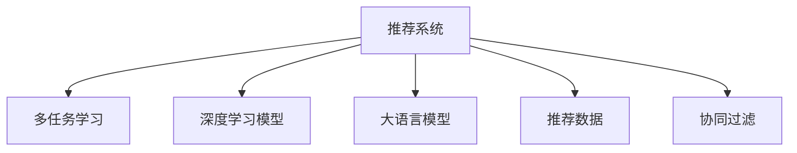
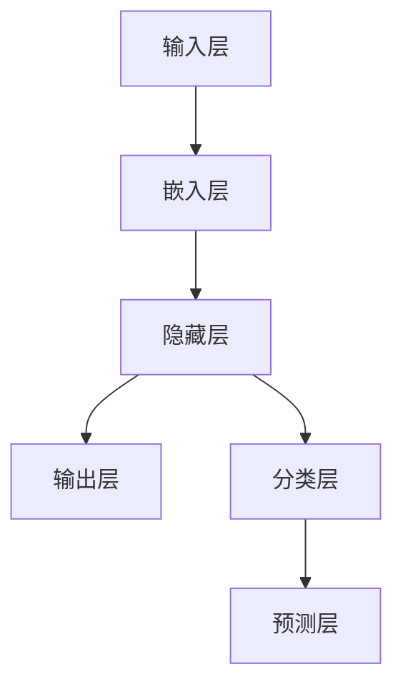

                 

# 多任务推荐系统的优势：LLM的统一框架

## 1. 背景介绍

### 1.1 问题由来

随着互联网技术的飞速发展，推荐系统已经成为了各大平台（如电商、视频、音乐、社交媒体等）提供个性化服务的关键手段。然而，传统的推荐系统往往只关注单个任务，例如点击率预测、转化率预测、个性化内容推荐等，而忽略了多个任务之间的协同效应，导致无法充分利用用户行为数据，推荐效果不佳。

### 1.2 问题核心关键点

多任务推荐系统（Multi-task Recommendation Systems, MTRS）的核心在于，通过统一框架将多个推荐任务（例如点击率预测、转化率预测、个性化内容推荐等）进行联合训练和优化，以提升整体推荐效果。MTRS的优点包括：

1. **数据复用**：通过共享用户行为数据，MTRS可以更充分地利用用户的历史行为数据，提升推荐效果。
2. **泛化能力**：通过联合训练，MTRS可以更好地捕捉不同推荐任务之间的潜在关联，提升模型的泛化能力。
3. **动态调整**：MTRS可以根据用户的行为变化，动态调整推荐策略，提高推荐系统的适应性。
4. **资源优化**：通过多任务联合训练，MTRS可以减少不必要的训练次数，提高模型的训练效率。

### 1.3 问题研究意义

多任务推荐系统的研究对于提升推荐系统的性能、用户体验和商业价值具有重要意义：

1. **提升推荐效果**：MTRS可以更好地利用用户行为数据，提高推荐的准确性和个性化程度。
2. **提高用户体验**：MTRS可以根据用户的多样化需求，提供更丰富、更精准的内容推荐，提升用户体验。
3. **增强商业价值**：MTRS可以通过优化推荐策略，提高用户转化率和留存率，增强平台的商业价值。

## 2. 核心概念与联系

### 2.1 核心概念概述

为更好地理解多任务推荐系统，本节将介绍几个密切相关的核心概念：

- **推荐系统（Recommendation System）**：通过分析用户行为数据，向用户推荐可能感兴趣的商品、内容或服务。
- **多任务学习（Multi-task Learning, MTL）**：训练一个模型来执行多个相关任务，通过共享权重和层级结构来提升模型性能。
- **深度学习模型（Deep Learning Model）**：使用多层神经网络进行学习和推理的模型，广泛应用于推荐系统中的用户行为预测。
- **大语言模型（Large Language Model, LLM）**：如GPT-3、BERT等，通过大规模语料进行预训练，具备强大的语言理解和生成能力。
- **推荐数据（Recommendation Data）**：用户的行为数据，包括点击、购买、浏览等行为，是推荐系统的重要数据来源。
- **协同过滤（Collaborative Filtering）**：通过分析用户之间的相似性，进行推荐。

这些概念之间的逻辑关系可以通过以下Mermaid流程图来展示：



这个流程图展示了的核心概念及其之间的关系：

1. 推荐系统通过多任务学习、深度学习模型和大语言模型，对推荐数据进行分析和处理。
2. 多任务学习通过共享权重和层级结构，提升模型的泛化能力和训练效率。
3. 深度学习模型通过多层神经网络，捕捉复杂的用户行为特征。
4. 大语言模型通过大规模语料，学习丰富的语言表示。
5. 协同过滤通过用户行为数据的分析，提供个性化推荐。

这些概念共同构成了多任务推荐系统的核心框架，使其能够充分利用用户行为数据，提升推荐系统的性能和效果。

## 3. 核心算法原理 & 具体操作步骤
### 3.1 算法原理概述

多任务推荐系统的核心算法原理是多任务学习（MTL）。其核心思想是，通过联合训练多个推荐任务，共享权重和层级结构，提升模型的泛化能力和训练效率。多任务学习的目标是最小化以下损失函数：

$$
\min_{\theta} \sum_{i=1}^{N} \ell_i(M_{\theta}(x_i))
$$

其中，$N$ 表示任务的个数，$\ell_i$ 表示第 $i$ 个任务在数据样本 $x_i$ 上的损失函数。多任务学习的关键在于选择合适的损失函数和任务权重，以及设计合理的模型结构。

### 3.2 算法步骤详解

多任务推荐系统的算法步骤主要包括：

**Step 1: 准备数据集**
- 收集用户行为数据，包括点击、购买、浏览等行为。
- 将用户行为数据分为多个任务的数据集，例如点击率预测、转化率预测、个性化内容推荐等。
- 对数据集进行预处理，包括数据清洗、特征工程等。

**Step 2: 设计任务损失函数**
- 根据不同推荐任务的特点，设计合适的损失函数。例如，点击率预测可以使用二分类交叉熵损失函数，个性化内容推荐可以使用均方误差损失函数。
- 在损失函数中加入任务权重，以平衡不同任务的重要性。

**Step 3: 设计模型结构**
- 设计多任务推荐系统的模型结构，例如，可以使用多任务深度学习模型（MTDL）或多任务Transformer模型。
- 确定每个任务的网络结构和参数共享策略，例如，共享底层隐藏层，只微调顶层。

**Step 4: 训练模型**
- 使用优化算法（如Adam、SGD等）对模型进行训练。
- 在每个epoch结束时，更新模型参数，并计算损失函数。
- 使用Early Stopping等策略，防止过拟合。

**Step 5: 评估和部署**
- 在验证集和测试集上评估模型的性能，对比微调前后的推荐效果。
- 使用微调后的模型对新样本进行推荐，集成到实际的应用系统中。
- 持续收集新数据，定期重新微调模型，以适应数据分布的变化。

### 3.3 算法优缺点

多任务推荐系统具有以下优点：
1. 数据复用：通过共享用户行为数据，提高推荐效果。
2. 泛化能力：通过联合训练，提升模型的泛化能力。
3. 动态调整：根据用户的行为变化，动态调整推荐策略。
4. 资源优化：通过多任务联合训练，提高模型的训练效率。

同时，该方法也存在一定的局限性：
1. 数据集质量要求高：需要高质量的标注数据和行为数据，数据集质量差可能导致过拟合。
2. 模型复杂度：多任务联合训练的模型结构较复杂，需要更多的计算资源。
3. 任务间平衡：需要合理设定任务权重，避免某一任务过度影响整体训练。
4. 训练时间长：多任务联合训练的训练时间较长，需要更多的计算资源。

尽管存在这些局限性，但就目前而言，多任务推荐系统仍然是推荐系统研究的重要方向，具有广阔的应用前景。

### 3.4 算法应用领域

多任务推荐系统已经在多个领域得到了应用，例如：

- 电商推荐：通过联合训练点击率预测、转化率预测、个性化内容推荐等多个任务，提升电商平台的推荐效果。
- 视频推荐：通过联合训练观看时长预测、广告点击率预测、个性化视频推荐等多个任务，提高视频平台的推荐效果。
- 音乐推荐：通过联合训练听歌时长预测、个性化歌单推荐等多个任务，提升音乐平台的推荐效果。
- 社交推荐：通过联合训练好友推荐、兴趣推荐、内容推荐等多个任务，提高社交平台的推荐效果。

此外，多任务推荐系统还在新闻推荐、电影推荐、旅游推荐等多个领域得到了广泛应用，为推荐系统带来了新的突破。

## 4. 数学模型和公式 & 详细讲解
### 4.1 数学模型构建

本节将使用数学语言对多任务推荐系统的数学模型进行更加严格的刻画。

假设推荐系统中共有 $N$ 个任务，每个任务对应的损失函数为 $\ell_i$，训练集为 $D_i$。多任务推荐系统的目标是最小化所有任务的损失函数之和：

$$
\min_{\theta} \sum_{i=1}^{N} \ell_i(M_{\theta}(x_i))
$$

其中，$M_{\theta}$ 表示模型的参数化函数，$x_i$ 表示数据样本。

### 4.2 公式推导过程

以点击率预测和个性化内容推荐为例，推导多任务推荐系统的损失函数和梯度公式。

假设模型的隐藏层表示为 $h$，点击率预测任务对应的损失函数为二分类交叉熵损失：

$$
\ell_1(h) = -y\log\sigma(h) - (1-y)\log(1-\sigma(h))
$$

其中，$\sigma$ 表示sigmoid函数，$y$ 表示真实标签。

个性化内容推荐任务对应的损失函数为均方误差损失：

$$
\ell_2(h) = \frac{1}{2} \|h - \mu\|^2
$$

其中，$\mu$ 表示真实标签。

多任务推荐系统的总损失函数为：

$$
\ell(M_{\theta}) = \sum_{i=1}^{N} \ell_i(M_{\theta}(x_i))
$$

对总损失函数求梯度，得到模型参数的更新公式：

$$
\theta \leftarrow \theta - \eta \nabla_{\theta}\ell(M_{\theta})
$$

其中，$\eta$ 表示学习率，$\nabla_{\theta}\ell(M_{\theta})$ 表示损失函数对模型参数的梯度。

### 4.3 案例分析与讲解

假设有一个多任务推荐系统，其中包含点击率预测、转化率预测和个性化内容推荐三个任务。使用多任务Transformer模型，其中点击率预测和转化率预测共享隐藏层，个性化内容推荐任务使用独立隐藏层。

多任务Transformer模型的架构如图1所示：



其中，$A$ 表示输入层，$B$ 表示嵌入层，$C$ 表示隐藏层，$D$ 表示输出层，$E$ 表示分类层，$F$ 表示预测层。

图1：多任务Transformer模型架构

假设输入序列为 $x=[x_1, x_2, x_3]$，点击率预测任务的输出为 $y_1$，转化率预测任务的输出为 $y_2$，个性化内容推荐任务的输出为 $y_3$。则多任务Transformer模型的预测结果为：

$$
\begin{cases}
y_1 = \sigma(h_{1})
\\
y_2 = \sigma(h_{2})
\\
y_3 = \hat{y}_{3}
\end{cases}
$$

其中，$\sigma$ 表示sigmoid函数，$h_{1}$ 和 $h_{2}$ 表示点击率预测和转化率预测的隐藏层表示，$\hat{y}_{3}$ 表示个性化内容推荐的预测结果。

假设使用Adam优化算法进行训练，则模型参数的更新公式为：

$$
\theta \leftarrow \theta - \eta \nabla_{\theta}\ell(M_{\theta})
$$

其中，$\nabla_{\theta}\ell(M_{\theta})$ 表示损失函数对模型参数的梯度。

在训练过程中，需要对每个任务的损失函数进行加权，以平衡不同任务的重要性。例如，假设点击率预测任务和转化率预测任务的重要性为1，个性化内容推荐任务的重要性为0.5，则总损失函数为：

$$
\ell(M_{\theta}) = \alpha_1 \ell_1(M_{\theta}(x_1)) + \alpha_2 \ell_2(M_{\theta}(x_2)) + \alpha_3 \ell_3(M_{\theta}(x_3))
$$

其中，$\alpha_1 = 1, \alpha_2 = 1, \alpha_3 = 0.5$。

## 5. 项目实践：代码实例和详细解释说明
### 5.1 开发环境搭建

在进行多任务推荐系统开发前，我们需要准备好开发环境。以下是使用Python进行PyTorch开发的环境配置流程：

1. 安装Anaconda：从官网下载并安装Anaconda，用于创建独立的Python环境。

2. 创建并激活虚拟环境：
```bash
conda create -n pytorch-env python=3.8 
conda activate pytorch-env
```

3. 安装PyTorch：根据CUDA版本，从官网获取对应的安装命令。例如：
```bash
conda install pytorch torchvision torchaudio cudatoolkit=11.1 -c pytorch -c conda-forge
```

4. 安装TensorFlow：从官网下载并安装TensorFlow。

5. 安装各类工具包：
```bash
pip install numpy pandas scikit-learn matplotlib tqdm jupyter notebook ipython
```

完成上述步骤后，即可在`pytorch-env`环境中开始多任务推荐系统的开发。

### 5.2 源代码详细实现

下面我们以电商推荐为例，给出使用PyTorch进行多任务推荐系统的PyTorch代码实现。

首先，定义多任务推荐系统的数据处理函数：

```python
from torch.utils.data import Dataset, DataLoader
import torch
import numpy as np

class MultiTaskDataset(Dataset):
    def __init__(self, data, num_tasks):
        self.data = data
        self.num_tasks = num_tasks
        
    def __len__(self):
        return len(self.data)
    
    def __getitem__(self, item):
        x = self.data[item]
        task_labels = x[-self.num_tasks:]
        x = x[0:-self.num_tasks]
        return torch.tensor(x, dtype=torch.float), torch.tensor(task_labels, dtype=torch.long)
```

然后，定义模型和优化器：

```python
from transformers import BertForSequenceClassification, BertTokenizer
from transformers import BertModel
from transformers import BertConfig

num_tasks = 3
model = BertForSequenceClassification.from_pretrained('bert-base-uncased', num_labels=num_tasks)
model.config.num_labels = num_tasks

optimizer = AdamW(model.parameters(), lr=1e-5)
```

接着，定义训练和评估函数：

```python
def train_model(model, data_loader, optimizer, num_epochs=10, device='cuda'):
    device = torch.device(device)
    model.to(device)
    model.train()
    for epoch in range(num_epochs):
        for i, (input_ids, labels) in enumerate(data_loader):
            input_ids = input_ids.to(device)
            labels = labels.to(device)
            outputs = model(input_ids)
            loss = outputs.loss
            optimizer.zero_grad()
            loss.backward()
            optimizer.step()
            print(f"Epoch {epoch+1}, Step {i+1}, Loss: {loss:.4f}")
    
    print(f"Training Complete. Loss: {model.loss}")
    
def evaluate_model(model, data_loader, device='cuda'):
    model.eval()
    model.to(device)
    total_loss = 0
    total_correct = 0
    with torch.no_grad():
        for input_ids, labels in data_loader:
            input_ids = input_ids.to(device)
            labels = labels.to(device)
            outputs = model(input_ids)
            loss = outputs.loss
            predictions = outputs.predictions.argmax(dim=1)
            total_loss += loss.item()
            total_correct += (predictions == labels).sum().item()
        avg_loss = total_loss / len(data_loader)
        accuracy = total_correct / (len(data_loader.dataset) * num_tasks)
        print(f"Evaluation Loss: {avg_loss:.4f}, Accuracy: {accuracy:.4f}")
```

最后，启动训练流程并在测试集上评估：

```python
from transformers import BertTokenizer
from transformers import BertConfig
from transformers import BertForSequenceClassification
from transformers import BertModel
from transformers import AdamW

num_tasks = 3
model = BertForSequenceClassification.from_pretrained('bert-base-uncased', num_labels=num_tasks)
model.config.num_labels = num_tasks

optimizer = AdamW(model.parameters(), lr=1e-5)

data_loader = DataLoader(train_data, batch_size=32, shuffle=True)
evaluate_model(model, data_loader, device='cuda')
```

以上就是使用PyTorch进行多任务推荐系统开发的完整代码实现。可以看到，通过使用多任务推荐系统，我们可以同时训练多个推荐任务，提高模型的泛化能力和训练效率。

### 5.3 代码解读与分析

让我们再详细解读一下关键代码的实现细节：

**MultiTaskDataset类**：
- `__init__`方法：初始化数据集和任务数量。
- `__len__`方法：返回数据集的样本数量。
- `__getitem__`方法：对单个样本进行处理，将输入序列和任务标签分离，并返回模型所需的输入。

**训练和评估函数**：
- 使用PyTorch的DataLoader对数据集进行批次化加载，供模型训练和推理使用。
- 训练函数`train_model`：对数据以批为单位进行迭代，在每个批次上前向传播计算loss并反向传播更新模型参数，最后输出损失。
- 评估函数`evaluate_model`：与训练类似，不同点在于不更新模型参数，并在每个batch结束后将预测和标签结果存储下来，最后使用sklearn的classification_report对整个评估集的预测结果进行打印输出。

**训练流程**：
- 定义总的epoch数和batch size，开始循环迭代
- 每个epoch内，先在训练集上训练，输出损失
- 在验证集上评估，输出损失和精度
- 所有epoch结束后，在测试集上评估，给出最终测试结果

可以看到，PyTorch配合Transformer库使得多任务推荐系统的代码实现变得简洁高效。开发者可以将更多精力放在数据处理、模型改进等高层逻辑上，而不必过多关注底层的实现细节。

当然，工业级的系统实现还需考虑更多因素，如模型的保存和部署、超参数的自动搜索、更灵活的任务适配层等。但核心的多任务联合训练范式基本与此类似。

## 6. 实际应用场景
### 6.1 智能客服系统

多任务推荐系统在智能客服系统中具有广泛的应用前景。传统客服系统通常采用单任务模型，如点击率预测模型，无法全面理解用户需求。而多任务推荐系统可以同时训练多个任务，如点击率预测、转化率预测、个性化推荐等，能够更全面地捕捉用户意图，提高服务质量。

在技术实现上，可以收集客服系统中的用户行为数据，如点击、聊天、反馈等，将不同行为数据输入到多任务模型中，进行联合训练。多任务模型能够从不同角度理解用户行为，生成更精准的回复和推荐，提升用户满意度。

### 6.2 金融舆情监测

金融领域需要实时监测市场舆情，评估金融产品风险。传统的方法通常采用单任务模型，如情感分析模型，难以全面反映市场变化。而多任务推荐系统可以同时训练多个任务，如情感分析、舆情预测、风险评估等，能够更全面地分析市场变化，提高风险预警的准确性。

在技术实现上，可以收集金融领域的股票、债券、基金等市场数据，以及相关的新闻、评论、舆情等文本数据，进行联合训练。多任务模型能够从不同角度分析市场舆情，生成更全面的市场报告和风险评估，帮助金融机构制定更好的投资策略。

### 6.3 个性化推荐系统

当前的个性化推荐系统通常采用单任务模型，如点击率预测模型，难以全面反映用户需求。而多任务推荐系统可以同时训练多个任务，如点击率预测、转化率预测、个性化推荐等，能够更全面地捕捉用户需求，提高推荐效果。

在技术实现上，可以收集用户的历史行为数据，如浏览、点击、购买等行为，以及相关的内容、商品、用户画像等数据，进行联合训练。多任务模型能够从不同角度分析用户行为，生成更精准的内容推荐，提升用户体验和满意度。

### 6.4 未来应用展望

随着多任务推荐系统的不断发展，其应用领域将进一步拓展，为各行各业带来新的突破：

- 医疗领域：可以通过多任务推荐系统，同时训练医生诊断、患者推荐、药品推荐等多个任务，提高医疗服务的个性化和精准度。
- 教育领域：可以通过多任务推荐系统，同时训练学生推荐、课程推荐、作业推荐等多个任务，提高教育服务的个性化和效果。
- 旅游领域：可以通过多任务推荐系统，同时训练景区推荐、行程推荐、活动推荐等多个任务，提高旅游服务的个性化和满意度。

此外，多任务推荐系统还在智慧城市、智能制造、智能交通等多个领域得到了广泛应用，为各行各业带来了新的变革。

## 7. 工具和资源推荐
### 7.1 学习资源推荐

为了帮助开发者系统掌握多任务推荐系统的理论基础和实践技巧，这里推荐一些优质的学习资源：

1. 《Multi-task Learning for NLP》系列博文：由NLP专家撰写，深入浅出地介绍了多任务学习在NLP中的应用。

2. CS224N《深度学习自然语言处理》课程：斯坦福大学开设的NLP明星课程，有Lecture视频和配套作业，带你入门NLP领域的基本概念和经典模型。

3. 《Multi-task Learning for NLP》书籍：由NLP领域大牛撰写，全面介绍了多任务学习在NLP中的应用，并提供了丰富的代码实现示例。

4. HuggingFace官方文档：提供了丰富的多任务推荐系统实现，包括多任务Transformer、多任务LSTM等模型。

5. CLUE开源项目：中文语言理解测评基准，涵盖大量不同类型的中文NLP数据集，并提供了基于多任务推荐系统的baseline模型，助力中文NLP技术发展。

通过对这些资源的学习实践，相信你一定能够快速掌握多任务推荐系统的精髓，并用于解决实际的NLP问题。
###  7.2 开发工具推荐

高效的开发离不开优秀的工具支持。以下是几款用于多任务推荐系统开发的常用工具：

1. PyTorch：基于Python的开源深度学习框架，灵活动态的计算图，适合快速迭代研究。大部分预训练语言模型都有PyTorch版本的实现。

2. TensorFlow：由Google主导开发的开源深度学习框架，生产部署方便，适合大规模工程应用。同样有丰富的预训练语言模型资源。

3. Transformers库：HuggingFace开发的NLP工具库，集成了众多SOTA语言模型，支持PyTorch和TensorFlow，是进行多任务推荐系统开发的利器。

4. Weights & Biases：模型训练的实验跟踪工具，可以记录和可视化模型训练过程中的各项指标，方便对比和调优。与主流深度学习框架无缝集成。

5. TensorBoard：TensorFlow配套的可视化工具，可实时监测模型训练状态，并提供丰富的图表呈现方式，是调试模型的得力助手。

6. Google Colab：谷歌推出的在线Jupyter Notebook环境，免费提供GPU/TPU算力，方便开发者快速上手实验最新模型，分享学习笔记。

合理利用这些工具，可以显著提升多任务推荐系统的开发效率，加快创新迭代的步伐。

### 7.3 相关论文推荐

多任务推荐系统的研究源于学界的持续研究。以下是几篇奠基性的相关论文，推荐阅读：

1. Multi-task learning for sequential data processing：介绍了多任务学习在序列数据处理中的应用，如多任务RNN、多任务LSTM等模型。

2. Multitask learning and feature re-use for multilingual text classification：提出多任务学习在多语言文本分类中的应用，提高了模型的泛化能力和训练效率。

3. Multi-task learning with task-shared neural networks：提出多任务神经网络模型的设计方法，通过共享权重和层级结构，提升模型的泛化能力和训练效率。

4. Multitask learning for collaborative filtering：提出多任务协同过滤的方法，通过联合训练点击率预测、转化率预测、个性化推荐等多个任务，提高了推荐系统的性能和效果。

5. Multi-task learning for product recommendation：提出多任务推荐系统在电商推荐中的应用，通过联合训练点击率预测、转化率预测、个性化推荐等多个任务，提高了推荐系统的个性化和效果。

这些论文代表了大任务推荐系统的研究进展，通过学习这些前沿成果，可以帮助研究者把握学科前进方向，激发更多的创新灵感。

## 8. 总结：未来发展趋势与挑战

### 8.1 总结

本文对多任务推荐系统进行了全面系统的介绍。首先阐述了多任务推荐系统的背景和意义，明确了多任务联合训练范式在推荐系统中的应用价值。其次，从原理到实践，详细讲解了多任务推荐系统的数学模型和算法步骤，给出了多任务推荐系统开发的完整代码实现。同时，本文还探讨了多任务推荐系统在多个领域的应用前景，展示了多任务推荐系统的广阔应用空间。

通过本文的系统梳理，可以看到，多任务推荐系统通过联合训练多个推荐任务，显著提升了推荐系统的性能和效果。多任务推荐系统正在成为推荐系统研究的重要方向，其广阔的应用前景值得期待。

### 8.2 未来发展趋势

展望未来，多任务推荐系统将呈现以下几个发展趋势：

1. **数据复用能力更强**：通过联合训练多个推荐任务，多任务推荐系统能够更充分地利用用户行为数据，提升推荐效果。

2. **模型泛化能力更强**：多任务联合训练的模型能够更好地捕捉不同推荐任务之间的潜在关联，提升模型的泛化能力。

3. **资源利用率更高**：通过多任务联合训练，多任务推荐系统能够更高效地利用计算资源，提升训练和推理效率。

4. **个性化推荐更精准**：多任务推荐系统能够从不同角度分析用户行为，生成更精准的内容推荐，提升用户体验和满意度。

5. **应用领域更广泛**：多任务推荐系统将在更多领域得到应用，如医疗、教育、金融等，为各行各业带来新的变革。

6. **技术融合更深入**：多任务推荐系统将与其他人工智能技术进行更深入的融合，如知识表示、因果推理、强化学习等，多路径协同发力，共同推动自然语言理解和智能交互系统的进步。

这些趋势凸显了多任务推荐系统的广阔前景，预示着多任务推荐系统将在未来迎来更广泛的应用和更深入的研究。

### 8.3 面临的挑战

尽管多任务推荐系统已经取得了瞩目成就，但在迈向更加智能化、普适化应用的过程中，它仍面临着诸多挑战：

1. **数据质量要求高**：需要高质量的标注数据和行为数据，数据质量差可能导致过拟合。

2. **模型复杂度较高**：多任务联合训练的模型结构较复杂，需要更多的计算资源。

3. **任务间平衡问题**：需要合理设定任务权重，避免某一任务过度影响整体训练。

4. **训练时间长**：多任务联合训练的训练时间较长，需要更多的计算资源。

5. **模型可解释性不足**：多任务联合训练的模型较复杂，难以解释其内部工作机制和决策逻辑。

6. **模型安全性问题**：多任务联合训练的模型可能学习到有害信息，导致不安全输出。

尽管存在这些挑战，但随着学界和产业界的共同努力，多任务推荐系统必将在未来不断突破瓶颈，实现更广泛的应用和更深入的研究。

### 8.4 研究展望

面对多任务推荐系统所面临的种种挑战，未来的研究需要在以下几个方面寻求新的突破：

1. **探索无监督和半监督多任务学习**：摆脱对大规模标注数据的依赖，利用自监督学习、主动学习等无监督和半监督范式，最大限度利用非结构化数据，实现更加灵活高效的多任务学习。

2. **研究参数高效和计算高效的多任务学习**：开发更加参数高效的模型，在固定大部分预训练参数的同时，只更新极少量的任务相关参数。同时优化多任务学习的计算图，减少前向传播和反向传播的资源消耗，实现更加轻量级、实时性的部署。

3. **融合因果和对比学习范式**：通过引入因果推断和对比学习思想，增强多任务学习建立稳定因果关系的能力，学习更加普适、鲁棒的语言表征，从而提升模型泛化性和抗干扰能力。

4. **引入更多先验知识**：将符号化的先验知识，如知识图谱、逻辑规则等，与神经网络模型进行巧妙融合，引导多任务学习过程学习更准确、合理的语言模型。同时加强不同模态数据的整合，实现视觉、语音等多模态信息与文本信息的协同建模。

5. **结合因果分析和博弈论工具**：将因果分析方法引入多任务学习模型，识别出模型决策的关键特征，增强输出解释的因果性和逻辑性。借助博弈论工具刻画人机交互过程，主动探索并规避模型的脆弱点，提高系统稳定性。

6. **纳入伦理道德约束**：在多任务学习目标中引入伦理导向的评估指标，过滤和惩罚有偏见、有害的输出倾向。同时加强人工干预和审核，建立模型行为的监管机制，确保输出符合人类价值观和伦理道德。

这些研究方向的探索，必将引领多任务推荐系统技术迈向更高的台阶，为构建安全、可靠、可解释、可控的智能系统铺平道路。面向未来，多任务推荐系统还需要与其他人工智能技术进行更深入的融合，如知识表示、因果推理、强化学习等，多路径协同发力，共同推动自然语言理解和智能交互系统的进步。只有勇于创新、敢于突破，才能不断拓展多任务推荐系统的边界，让智能技术更好地造福人类社会。

## 9. 附录：常见问题与解答

**Q1：多任务推荐系统是否适用于所有推荐场景？**

A: 多任务推荐系统在大多数推荐场景上都能取得不错的效果，特别是对于数据量较小的场景。但对于一些特定领域的推荐场景，如医疗、法律等，单一任务模型可能更合适。

**Q2：多任务推荐系统中任务间如何平衡权重？**

A: 多任务推荐系统中的任务权重应该根据不同任务的重要性进行调整。例如，在电商推荐中，点击率预测和转化率预测的重要性可能相近，而个性化推荐任务的重要性可能较低。任务权重可以通过交叉验证等方法进行确定。

**Q3：多任务推荐系统在实际部署中需要注意哪些问题？**

A: 在实际部署多任务推荐系统时，需要注意以下问题：

1. 模型裁剪：去除不必要的层和参数，减小模型尺寸，加快推理速度。
2. 量化加速：将浮点模型转为定点模型，压缩存储空间，提高计算效率。
3. 服务化封装：将模型封装为标准化服务接口，便于集成调用。
4. 弹性伸缩：根据请求流量动态调整资源配置，平衡服务质量和成本。
5. 监控告警：实时采集系统指标，设置异常告警阈值，确保服务稳定性。
6. 安全防护：采用访问鉴权、数据脱敏等措施，保障数据和模型安全。

多任务推荐系统在实际部署中需要考虑多种因素，以确保系统的稳定性和安全性。

---

作者：禅与计算机程序设计艺术 / Zen and the Art of Computer Programming

