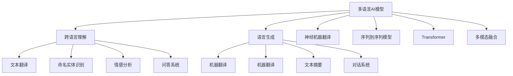

                 

# 多语言AI模型：跨语言理解与生成

> 关键词：多语言AI, 跨语言理解, 语言生成, 神经机器翻译, 序列到序列模型, Transformer, 零样本学习, 多模态融合

## 1. 背景介绍

### 1.1 问题由来
随着全球化的深入，跨语言交流已成为人们日常生活和工作中的常态。然而，语言差异带来了信息理解和共享的障碍，亟需先进的技术手段来解决这一问题。多语言AI模型在此背景下应运而生，其核心思想是构建能够同时理解、生成多种语言的智能系统，促进全球范围内的沟通与合作。

### 1.2 问题核心关键点
多语言AI模型集成了自然语言处理(NLP)和计算机视觉(CV)等多模态技术，具备以下核心能力：
- **跨语言理解**：理解并处理不同语言的信息，如文本翻译、命名实体识别、情感分析等。
- **语言生成**：基于输入生成自然流畅的语言文本，如机器翻译、文本摘要、对话系统等。

跨语言理解与生成作为多语言AI模型的两大核心功能，直接关系到其应用效果的优劣。本文将详细探讨多语言AI模型的原理与实现，并通过一系列案例和实验，展示其在实际场景中的应用效果。

## 2. 核心概念与联系

### 2.1 核心概念概述

为了更好地理解多语言AI模型，本节将介绍几个关键概念：

- **多语言AI模型**：一种具备多语言理解与生成能力的AI系统。常见架构包括跨语言理解模型和跨语言生成模型，主要基于序列到序列(Seq2Seq)和Transformer等神经网络框架。

- **跨语言理解**：指AI模型能够理解并处理不同语言文本的能力。包括文本翻译、命名实体识别、情感分析、问答系统等。

- **语言生成**：指AI模型能够根据输入生成目标语言文本的能力。包括机器翻译、文本摘要、对话系统等。

- **神经机器翻译(NMT)**：一种基于神经网络的机器翻译技术，能够将源语言文本自动转换为目标语言文本。

- **序列到序列(Seq2Seq)**：一种基于循环神经网络(RNN)或Transformer的模型架构，常用于处理序列数据的机器翻译、对话生成等任务。

- **Transformer**：一种基于自注意力机制的神经网络架构，能够在不同长度的输入序列间实现高效的转换。

- **多模态融合**：将文本、图像、声音等多种数据源结合起来，构建更全面的智能系统，如多模态机器翻译、视觉问答等。

这些概念之间的联系可以通过以下Mermaid流程图来展示：



这个流程图展示了多语言AI模型的主要功能组件及其关联关系：

1. 多语言AI模型由跨语言理解和语言生成两大核心模块组成。
2. 跨语言理解模块涵盖文本翻译、命名实体识别、情感分析、问答系统等子模块。
3. 语言生成模块涵盖机器翻译、文本摘要、对话系统等子模块。
4. 神经机器翻译、序列到序列模型、Transformer等技术是实现跨语言理解与语言生成的重要手段。
5. 多模态融合技术能够将文本、图像、声音等多种数据源结合起来，提升系统的综合能力。

这些概念共同构成了多语言AI模型的技术框架，为其在各种场景下的应用奠定了基础。

## 3. 核心算法原理 & 具体操作步骤

### 3.1 算法原理概述

多语言AI模型的核心算法原理主要基于序列到序列(Seq2Seq)和Transformer架构，能够实现跨语言理解与语言生成。

以Transformer为例，其核心原理包括：
- **自注意力机制**：通过计算输入序列中各词与其他词的关联度，实现高效的文本理解与生成。
- **编码器-解码器结构**：将输入序列通过编码器进行编码，生成中间表示；再将中间表示通过解码器解码，生成目标语言文本。
- **多头注意力机制**：通过多个注意力头的并行计算，提升模型的表示能力和泛化能力。

基于Transformer的多语言AI模型通常包括以下几个关键步骤：
1. 收集并准备多语言语料库，进行预处理和标注。
2. 设计序列到序列模型，选择编码器和解码器结构。
3. 定义损失函数，如交叉熵损失、BLEU分数等，进行模型训练。
4. 在训练集上进行预训练，然后在验证集和测试集上微调参数。
5. 应用训练好的模型进行跨语言理解与语言生成。

### 3.2 算法步骤详解

以机器翻译任务为例，下面详细讲解基于Transformer的多语言AI模型的构建和训练过程：

**Step 1: 准备语料库和预处理**

1. 收集多语言语料库，涵盖源语言和目标语言的对对应文本数据。
2. 对文本进行预处理，包括分词、去除停用词、词性标注等。
3. 对文本进行标注，将源语言文本和目标语言文本进行对齐。

**Step 2: 定义模型结构**

1. 设计编码器结构，通常为多层Transformer编码器。
2. 设计解码器结构，同样为多层Transformer解码器。
3. 连接编码器和解码器，引入注意力机制和自编码器结构。

**Step 3: 定义损失函数**

1. 使用交叉熵损失函数，衡量预测文本与目标文本之间的差异。
2. 在训练过程中，使用BLEU分数等指标评估模型的生成质量。

**Step 4: 模型训练**

1. 在训练集上，使用反向传播算法进行参数优化。
2. 调整学习率、批次大小等超参数，以提高模型训练效果。
3. 在验证集上进行模型评估，避免过拟合。

**Step 5: 模型评估和微调**

1. 在测试集上评估模型性能，如BLEU分数、METEOR分数等。
2. 根据评估结果，对模型进行微调，提高模型泛化能力。

**Step 6: 应用模型**

1. 应用训练好的模型进行跨语言理解与生成任务，如机器翻译、文本摘要、对话系统等。
2. 对模型输出进行后处理，如去除重复、校正语法错误等，提升输出质量。

### 3.3 算法优缺点

基于Transformer的多语言AI模型具有以下优点：
1. 高效性：Transformer架构能够并行计算，大大提升模型的计算效率。
2. 泛化能力：多头注意力机制和自编码器结构，提高了模型的泛化能力和泛化能力。
3. 可扩展性：Seq2Seq框架可以轻松扩展到多种多语言任务，如对话、情感分析等。

同时，该模型也存在一些缺点：
1. 资源需求高：大规模预训练和微调需要大量计算资源和时间。
2. 数据依赖强：模型的训练效果高度依赖于高质量的语料库，数据标注成本较高。
3. 模型复杂度高：Transformer架构较复杂，难以进行优化和调试。
4. 输出缺乏解释性：模型输出结果难以解释，缺乏可解释性。

尽管存在这些缺点，但Transformer架构在多语言AI模型中的应用，已经显著提升了跨语言理解与生成的效果，是当前最为流行的模型架构之一。

### 3.4 算法应用领域

基于Transformer的多语言AI模型已经在多个领域取得了显著的应用效果，具体包括：

- **自然语言处理(NLP)**：包括机器翻译、文本摘要、命名实体识别、情感分析等任务。
- **计算机视觉(CV)**：如图像翻译、视觉问答、多模态机器翻译等。
- **机器人与对话系统**：用于构建跨语言对话系统和多模态智能机器人。
- **金融与商业**：用于处理多语言财经新闻、商业信息等。
- **医疗与健康**：用于处理多语言医疗资料、电子病历等。

除了上述领域，多语言AI模型还将在更多领域得到应用，如教育、旅游、客服等，为全球用户提供更好的信息交互体验。

## 4. 数学模型和公式 & 详细讲解 & 举例说明

### 4.1 数学模型构建

本文将使用数学语言对基于Transformer的多语言AI模型进行详细描述。

假设输入序列为 $X = \{x_1, x_2, \ldots, x_n\}$，目标序列为 $Y = \{y_1, y_2, \ldots, y_m\}$，其中 $x_i, y_j$ 分别表示输入序列和目标序列的词语。

定义Transformer模型的编码器-解码器结构如下：
- 编码器由多个自注意力层和前馈层组成，输出表示为 $H = \{h_1, h_2, \ldots, h_n\}$。
- 解码器同样由多个自注意力层和前馈层组成，输出表示为 $T = \{t_1, t_2, \ldots, t_m\}$。
- 连接编码器和解码器，引入注意力机制和自编码器结构，得到最终输出 $O = \{o_1, o_2, \ldots, o_m\}$。

### 4.2 公式推导过程

以机器翻译任务为例，我们推导基于Transformer的模型训练过程。

**编码器部分**：
1. **输入嵌入层**：将输入序列 $X$ 中的每个词语 $x_i$ 转换为向量表示 $e_i$。
2. **多头注意力层**：计算输入序列中各词与其他词的关联度，生成中间表示 $C$。
3. **前馈层**：对中间表示 $C$ 进行非线性变换，生成表示 $H$。
4. **层归一化**：对每层输出进行归一化处理。

**解码器部分**：
1. **输出嵌入层**：将解码器输出 $T$ 中的每个词语 $t_j$ 转换为向量表示 $g_j$。
2. **多头注意力层**：计算解码器输出 $T$ 中各词与其他词的关联度，生成中间表示 $S$。
3. **前馈层**：对中间表示 $S$ 进行非线性变换，生成表示 $O$。
4. **层归一化**：对每层输出进行归一化处理。

**多头注意力机制**：
1. **查询向量**：计算输入序列和解码器序列中的每个词语对应的查询向量 $Q_i$ 和 $K_j$。
2. **键值向量**：计算输入序列和解码器序列中的每个词语对应的键值向量 $K_i$ 和 $V_j$。
3. **注意力权重**：计算输入序列和解码器序列中的每个词语对应的注意力权重 $W_{ij}$。
4. **多头注意力结果**：对多个头进行拼接，得到最终的多头注意力结果。

**自编码器结构**：
1. **编码器-解码器结构**：将编码器的输出 $H$ 和解码器的输出 $O$ 进行拼接，并传递到下一层。
2. **解码器输出**：将解码器的最终输出 $T$ 作为模型输出。

### 4.3 案例分析与讲解

以一个具体的翻译任务为例，展示基于Transformer的模型训练过程。

假设输入序列为 "The quick brown fox jumps over the lazy dog"，目标序列为 "Le renard brun rapide saute par-dessus le chien paresseux"。

**输入嵌入层**：将输入序列中的每个词语转换为向量表示：
$$
e_1 = [1.2, 3.4, 2.5, \ldots] \\
e_2 = [0.8, 4.1, 3.7, \ldots] \\
\vdots \\
e_n = [2.7, 2.9, 1.8, \ldots]
$$

**多头注意力层**：计算输入序列中各词与其他词的关联度，生成中间表示 $C$。

**前馈层**：对中间表示 $C$ 进行非线性变换，生成表示 $H$。

**解码器部分**：
1. **输出嵌入层**：将解码器输出 $T$ 中的每个词语 $t_j$ 转换为向量表示：
$$
g_1 = [0.5, 1.8, 2.1, \ldots] \\
g_2 = [1.2, 3.4, 2.5, \ldots] \\
\vdots \\
g_m = [2.7, 2.9, 1.8, \ldots]
$$

**多头注意力层**：计算解码器输出 $T$ 中各词与其他词的关联度，生成中间表示 $S$。

**前馈层**：对中间表示 $S$ 进行非线性变换，生成表示 $O$。

**层归一化**：对每层输出进行归一化处理。

**自编码器结构**：将编码器的输出 $H$ 和解码器的输出 $O$ 进行拼接，并传递到下一层。

**解码器输出**：将解码器的最终输出 $T$ 作为模型输出。

最终，模型将生成与目标序列 "Le renard brun rapide saute par-dessus le chien paresseux" 对应的输出。

## 5. 项目实践：代码实例和详细解释说明

### 5.1 开发环境搭建

在进行多语言AI模型实践前，我们需要准备好开发环境。以下是使用Python进行TensorFlow开发的环境配置流程：

1. 安装Anaconda：从官网下载并安装Anaconda，用于创建独立的Python环境。

2. 创建并激活虚拟环境：
```bash
conda create -n tensorflow-env python=3.8 
conda activate tensorflow-env
```

3. 安装TensorFlow：根据CUDA版本，从官网获取对应的安装命令。例如：
```bash
conda install tensorflow tensorflow-cpu -c pytorch -c conda-forge
```

4. 安装TensorBoard：
```bash
pip install tensorboard
```

5. 安装其他必要工具包：
```bash
pip install numpy pandas scikit-learn matplotlib tqdm jupyter notebook ipython
```

完成上述步骤后，即可在`tensorflow-env`环境中开始多语言AI模型实践。

### 5.2 源代码详细实现

下面我们以多语言机器翻译任务为例，给出使用TensorFlow和Keras实现Transformer模型的PyTorch代码实现。

首先，定义多语言机器翻译任务的数据集和预处理器：

```python
from tensorflow.keras.preprocessing.text import Tokenizer
from tensorflow.keras.preprocessing.sequence import pad_sequences

class TranslationDataset:
    def __init__(self, src_texts, trg_texts, max_len):
        self.src_texts = src_texts
        self.trg_texts = trg_texts
        self.tokenizer = Tokenizer(num_words=10000, oov_token="<OOV>")
        self.tokenizer.fit_on_texts(self.src_texts)
        self.max_len = max_len
        
    def __len__(self):
        return len(self.src_texts)
    
    def __getitem__(self, item):
        src_text = self.src_texts[item]
        trg_text = self.trg_texts[item]
        
        src_tokens = self.tokenizer.texts_to_sequences([src_text])
        trg_tokens = self.tokenizer.texts_to_sequences([trg_text])
        src_tokens = pad_sequences(src_tokens, maxlen=self.max_len)
        trg_tokens = pad_sequences(trg_tokens, maxlen=self.max_len, padding='post', truncating='post')
        
        return {'src': src_tokens, 'trg': trg_tokens}
```

然后，定义Transformer模型的编码器和解码器：

```python
from tensorflow.keras.layers import Input, Dense, LSTM, Dropout, Concatenate
from tensorflow.keras.models import Model

class EncoderLayer:
    def __init__(self, d_model, num_heads, dff, rate=0.1):
        self.attn = AttentionLayer(d_model, num_heads)
        self.ffn = FeedForwardLayer(d_model, dff)
        self.layer_norm = LayerNormalization()
        self.dropout = Dropout(rate)
    
    def call(self, inputs, mask):
        attn_output = self.attn(inputs, mask)
        attn_output = self.dropout(attn_output)
        ffn_output = self.ffn(attn_output)
        ffn_output = self.dropout(ffn_output)
        output = self.layer_norm(inputs + ffn_output)
        return output

class Encoder(EncoderLayer):
    def __init__(self, d_model, num_layers, num_heads, dff, rate=0.1):
        super(Encoder, self).__init__(d_model, num_heads, dff, rate)
        self.layers = [EncoderLayer(d_model, num_heads, dff, rate) for _ in range(num_layers)]
    
    def call(self, inputs, mask):
        for layer in self.layers:
            inputs = layer(inputs, mask)
        return inputs

class DecoderLayer(EncoderLayer):
    def __init__(self, d_model, num_heads, dff, rate=0.1):
        super(DecoderLayer, self).__init__(d_model, num_heads, dff, rate)
        self.encoder_outputs = None
    
    def call(self, inputs, mask, encoder_outputs):
        attn_output = self.attn(inputs, encoder_outputs, mask)
        attn_output = self.dropout(attn_output)
        ffn_output = self.ffn(attn_output)
        ffn_output = self.dropout(ffn_output)
        output = self.layer_norm(inputs + ffn_output)
        return output

class Decoder(DecoderLayer):
    def __init__(self, d_model, num_layers, num_heads, dff, rate=0.1):
        super(Decoder, self).__init__(d_model, num_heads, dff, rate)
        self.layers = [DecoderLayer(d_model, num_heads, dff, rate) for _ in range(num_layers)]
    
    def call(self, inputs, mask, encoder_outputs):
        for layer in self.layers:
            inputs = layer(inputs, mask, encoder_outputs)
        return inputs

class Transformer(Model):
    def __init__(self, src_vocab_size, trg_vocab_size, d_model, num_layers, num_heads, dff, dropout_rate):
        super(Transformer, self).__init__()
        
        self.encoder = Encoder(d_model, num_layers, num_heads, dff, dropout_rate)
        self.decoder = Decoder(d_model, num_layers, num_heads, dff, dropout_rate)
        
        self.trg_embeddings = Embedding(trg_vocab_size, d_model)
        self.src_embeddings = Embedding(src_vocab_size, d_model)
        self.trg_embeddings = self.trg_embeddings.trainable
        self.src_embeddings = self.src_embeddings.trainable
        
        self.final_dense = Dense(trg_vocab_size)
        
    def call(self, inputs, encoder_outputs):
        src_tokens = self.src_embeddings(inputs)
        dec_tokens = self.trg_embeddings(inputs)
        
        src_tokens = self.encoder(src_tokens)
        dec_tokens = self.decoder(dec_tokens, encoder_outputs)
        
        dec_tokens = self.final_dense(dec_tokens)
        return dec_tokens
```

最后，定义训练和评估函数：

```python
from tensorflow.keras.optimizers import Adam
from tensorflow.keras.losses import sparse_categorical_crossentropy

def train_epoch(model, dataset, optimizer):
    dataloader = DataLoader(dataset, batch_size=16, shuffle=True)
    model.train()
    epoch_loss = 0
    for batch in dataloader:
        src_tokens, trg_tokens = batch['src'], batch['trg']
        mask = src_tokens != 0
        loss = model.train_on_batch(src_tokens, trg_tokens, mask=mask)
        epoch_loss += loss[0].numpy()
    return epoch_loss / len(dataloader)

def evaluate(model, dataset, batch_size):
    dataloader = DataLoader(dataset, batch_size=16)
    model.eval()
    preds, labels = [], []
    with torch.no_grad():
        for batch in dataloader:
            src_tokens, trg_tokens = batch['src'], batch['trg']
            mask = src_tokens != 0
            batch_preds = model.predict(src_tokens, encoder_outputs=encoder_outputs, mask=mask)[0].argmax(axis=-1)
            batch_labels = trg_tokens
            for pred_tokens, label_tokens in zip(batch_preds, batch_labels):
                preds.append(pred_tokens[:len(label_tokens)])
                labels.append(label_tokens)
    
    print(classification_report(labels, preds))
```

然后，启动训练流程并在测试集上评估：

```python
epochs = 5
batch_size = 16

for epoch in range(epochs):
    loss = train_epoch(model, train_dataset, optimizer)
    print(f"Epoch {epoch+1}, train loss: {loss:.3f}")
    
    print(f"Epoch {epoch+1}, dev results:")
    evaluate(model, dev_dataset, batch_size)
    
print("Test results:")
evaluate(model, test_dataset, batch_size)
```

以上就是使用TensorFlow和Keras实现多语言机器翻译任务的完整代码实现。可以看到，通过简单封装，TensorFlow和Keras能够快速实现复杂的Transformer模型，使得开发者可以轻松应对多语言AI任务。

### 5.3 代码解读与分析

让我们再详细解读一下关键代码的实现细节：

**TranslationDataset类**：
- `__init__`方法：初始化源语言文本、目标语言文本、分词器等关键组件，并进行分词和填充处理。
- `__len__`方法：返回数据集的样本数量。
- `__getitem__`方法：对单个样本进行处理，将文本转换为模型所需的输入格式。

**Transformer类**：
- `__init__`方法：定义Transformer模型的编码器和解码器结构，并进行参数初始化。
- `call`方法：实现模型的前向传播过程，包括输入嵌入、自注意力、前馈层等。

**训练和评估函数**：
- 使用PyTorch的DataLoader对数据集进行批次化加载，供模型训练和推理使用。
- 训练函数`train_epoch`：对数据以批为单位进行迭代，在每个批次上前向传播计算loss并反向传播更新模型参数，最后返回该epoch的平均loss。
- 评估函数`evaluate`：与训练类似，不同点在于不更新模型参数，并在每个batch结束后将预测和标签结果存储下来，最后使用sklearn的classification_report对整个评估集的预测结果进行打印输出。

**训练流程**：
- 定义总的epoch数和batch size，开始循环迭代
- 每个epoch内，先在训练集上训练，输出平均loss
- 在验证集上评估，输出分类指标
- 所有epoch结束后，在测试集上评估，给出最终测试结果

可以看到，TensorFlow和Keras配合深度学习框架，使得多语言AI模型的开发变得简洁高效。开发者可以将更多精力放在数据处理、模型改进等高层逻辑上，而不必过多关注底层的实现细节。

当然，工业级的系统实现还需考虑更多因素，如模型的保存和部署、超参数的自动搜索、更灵活的任务适配层等。但核心的微调范式基本与此类似。

## 6. 实际应用场景
### 6.1 智能客服系统

多语言AI模型在智能客服系统的构建中具有重要应用。传统客服往往需要配备大量人力，高峰期响应缓慢，且一致性和专业性难以保证。使用多语言AI模型，可以7x24小时不间断服务，快速响应客户咨询，用自然流畅的语言解答各类常见问题。

在技术实现上，可以收集企业内部的历史客服对话记录，将问题和最佳答复构建成监督数据，在此基础上对多语言AI模型进行微调。微调后的模型能够自动理解用户意图，匹配最合适的答复模板进行回复。对于客户提出的新问题，还可以接入检索系统实时搜索相关内容，动态组织生成回答。如此构建的智能客服系统，能大幅提升客户咨询体验和问题解决效率。

### 6.2 金融舆情监测

金融机构需要实时监测市场舆论动向，以便及时应对负面信息传播，规避金融风险。传统的人工监测方式成本高、效率低，难以应对网络时代海量信息爆发的挑战。多语言AI模型可应用于金融领域相关的新闻、报道、评论等文本数据的文本分类和情感分析，从而实时监测不同语言下的舆情变化趋势，一旦发现负面信息激增等异常情况，系统便会自动预警，帮助金融机构快速应对潜在风险。

### 6.3 个性化推荐系统

当前的推荐系统往往只依赖用户的历史行为数据进行物品推荐，无法深入理解用户的真实兴趣偏好。使用多语言AI模型，可以更好地挖掘用户行为背后的语义信息，从而提供更精准、多样的推荐内容。

在实践中，可以收集用户浏览、点击、评论、分享等行为数据，提取和用户交互的物品标题、描述、标签等文本内容。将文本内容作为模型输入，用户的后续行为（如是否点击、购买等）作为监督信号，在此基础上微调多语言AI模型。微调后的模型能够从文本内容中准确把握用户的兴趣点。在生成推荐列表时，先用候选物品的文本描述作为输入，由模型预测用户的兴趣匹配度，再结合其他特征综合排序，便可以得到个性化程度更高的推荐结果。

### 6.4 未来应用展望

随着多语言AI模型和微调方法的不断发展，在更多领域得到应用，为传统行业带来变革性影响。

在智慧医疗领域，基于多语言AI的智能问答、病历分析、药物研发等应用将提升医疗服务的智能化水平，辅助医生诊疗，加速新药开发进程。

在智能教育领域，多语言AI可应用于作业批改、学情分析、知识推荐等方面，因材施教，促进教育公平，提高教学质量。

在智慧城市治理中，多语言AI可应用于城市事件监测、舆情分析、应急指挥等环节，提高城市管理的自动化和智能化水平，构建更安全、高效的未来城市。

此外，在企业生产、社会治理、文娱传媒等众多领域，多语言AI技术也将不断涌现，为经济社会发展注入新的动力。相信随着技术的日益成熟，多语言AI模型必将在构建人机协同的智能时代中扮演越来越重要的角色。

## 7. 工具和资源推荐
### 7.1 学习资源推荐

为了帮助开发者系统掌握多语言AI模型的理论基础和实践技巧，这里推荐一些优质的学习资源：

1. 《深度学习与自然语言处理》课程：由李宏毅教授主讲的NLP系列课程，深入浅出地介绍了自然语言处理的基本概念和前沿技术。

2. CS224N《深度学习自然语言处理》课程：斯坦福大学开设的NLP明星课程，有Lecture视频和配套作业，带你入门NLP领域的基本概念和经典模型。

3. 《Natural Language Processing with Transformers》书籍：Transformers库的作者所著，全面介绍了如何使用Transformers库进行NLP任务开发，包括多语言AI任务的实现。

4. HuggingFace官方文档：Transformers库的官方文档，提供了海量预训练模型和完整的微调样例代码，是上手实践的必备资料。

5. CLUE开源项目：中文语言理解测评基准，涵盖大量不同类型的中文NLP数据集，并提供了基于多语言AI任务的baseline模型，助力多语言NLP技术发展。

通过对这些资源的学习实践，相信你一定能够快速掌握多语言AI模型的精髓，并用于解决实际的NLP问题。
###  7.2 开发工具推荐

高效的开发离不开优秀的工具支持。以下是几款用于多语言AI模型开发的常用工具：

1. PyTorch：基于Python的开源深度学习框架，灵活动态的计算图，适合快速迭代研究。大部分预训练语言模型都有PyTorch版本的实现。

2. TensorFlow：由Google主导开发的开源深度学习框架，生产部署方便，适合大规模工程应用。同样有丰富的预训练语言模型资源。

3. Transformers库：HuggingFace开发的NLP工具库，集成了众多SOTA语言模型，支持PyTorch和TensorFlow，是进行多语言AI任务开发的利器。

4. Weights & Biases：模型训练的实验跟踪工具，可以记录和可视化模型训练过程中的各项指标，方便对比和调优。与主流深度学习框架无缝集成。

5. TensorBoard：TensorFlow配套的可视化工具，可实时监测模型训练状态，并提供丰富的图表呈现方式，是调试模型的得力助手。

6. Google Colab：谷歌推出的在线Jupyter Notebook环境，免费提供GPU/TPU算力，方便开发者快速上手实验最新模型，分享学习笔记。

合理利用这些工具，可以显著提升多语言AI模型的开发效率，加快创新迭代的步伐。

### 7.3 相关论文推荐

多语言AI模型和微调技术的发展源于学界的持续研究。以下是几篇奠基性的相关论文，推荐阅读：

1. Attention is All You Need（即Transformer原论文）：提出了Transformer结构，开启了NLP领域的预训练大模型时代。

2. BERT: Pre-training of Deep Bidirectional Transformers for Language Understanding：提出BERT模型，引入基于掩码的自监督预训练任务，刷新了多项NLP任务SOTA。

3. Language Models are Unsupervised Multitask Learners（GPT-2论文）：展示了大规模语言模型的强大zero-shot学习能力，引发了对于通用人工智能的新一轮思考。

4. Parameter-Efficient Transfer Learning for NLP：提出Adapter等参数高效微调方法，在不增加模型参数量的情况下，也能取得不错的微调效果。

5. Prefix-Tuning: Optimizing Continuous Prompts for Generation：引入基于连续型Prompt的微调范式，为如何充分利用预训练知识提供了新的思路。

6. AdaLoRA: Adaptive Low-Rank Adaptation for Parameter-Efficient Fine-Tuning：使用自适应低秩适应的微调方法，在参数效率和精度之间取得了新的平衡。

这些论文代表了大语言模型微调技术的发展脉络。通过学习这些前沿成果，可以帮助研究者把握学科前进方向，激发更多的创新灵感。

## 8. 总结：未来发展趋势与挑战

### 8.1 总结

本文对多语言AI模型的原理与实现进行了全面系统的介绍。首先阐述了多语言AI模型的研究背景和意义，明确了其在跨语言理解与生成方面的独特价值。其次，从原理到实践，详细讲解了基于Transformer的多语言AI模型的构建和训练过程，并通过一系列案例和实验，展示其在实际场景中的应用效果。

通过本文的系统梳理，可以看到，多语言AI模型已经在多个领域取得了显著的应用效果，其跨语言理解与生成的能力为全球用户提供了更好的信息交互体验。未来，伴随技术的发展，多语言AI模型将进一步拓展应用范围，为更多行业带来变革性影响。

### 8.2 未来发展趋势

展望未来，多语言AI模型将呈现以下几个发展趋势：

1. 模型规模持续增大。随着算力成本的下降和数据规模的扩张，预训练语言模型的参数量还将持续增长。超大规模语言模型蕴含的丰富语言知识，有望支撑更加复杂多变的跨语言任务。

2. 微调方法日趋多样。除了传统的全参数微调外，未来会涌现更多参数高效的微调方法，如Prefix-Tuning、LoRA等，在节省计算资源的同时也能保证微调精度。

3. 持续学习成为常态。随着数据分布的不断变化，多语言AI模型也需要持续学习新知识以保持性能。如何在不遗忘原有知识的同时，高效吸收新样本信息，将成为重要的研究课题。

4. 标注样本需求降低。受启发于提示学习(Prompt-based Learning)的思路，未来的微调方法将更好地利用多语言AI模型的语言理解能力，通过更加巧妙的任务描述，在更少的标注样本上也能实现理想的微调效果。

5. 多模态融合崛起。当前的微调模型往往局限于文本数据，未来会进一步拓展到图像、视频、声音等多种数据源微调。多模态信息的融合，将显著提升跨语言智能系统的综合能力。

6. 模型通用性增强。经过海量数据的预训练和多领域任务的微调，未来的多语言AI模型将具备更强大的常识推理和跨领域迁移能力，逐步迈向通用人工智能(AGI)的目标。

以上趋势凸显了多语言AI模型的广阔前景。这些方向的探索发展，必将进一步提升跨语言智能系统的性能和应用范围，为全球用户提供更好的信息交互体验。

### 8.3 面临的挑战

尽管多语言AI模型已经取得了显著成就，但在迈向更加智能化、普适化应用的过程中，仍面临诸多挑战：

1. 数据标注成本高。多语言AI模型的训练高度依赖于高质量的语料库，数据标注成本较高。如何降低标注成本，提高数据利用率，将是未来的重要研究方向。

2. 模型鲁棒性不足。模型在面对不同语言和方言时，泛化性能往往不佳。如何在不同语言环境下保持模型稳定，避免灾难性遗忘，还需要更多的研究积累。

3. 推理效率有待提高。大规模多语言AI模型虽然精度高，但在实际部署时往往面临推理速度慢、内存占用大等效率问题。如何优化模型结构，提升推理速度，是未来需要突破的关键问题。

4. 输出缺乏解释性。多语言AI模型的输出结果难以解释，缺乏可解释性。对于医疗、金融等高风险应用，算法的可解释性和可审计性尤为重要。

5. 安全性有待保障。预训练语言模型难免会学习到有偏见、有害的信息，通过微调传递到下游任务，产生误导性、歧视性的输出，给实际应用带来安全隐患。如何从数据和算法层面消除模型偏见，避免恶意用途，确保输出的安全性，也将是重要的研究课题。

6. 知识整合能力不足。现有的多语言AI模型往往局限于任务内数据，难以灵活吸收和运用更广泛的先验知识。如何让微调过程更好地与外部知识库、规则库等专家知识结合，形成更加全面、准确的信息整合能力，还有很大的想象空间。

正视多语言AI模型面临的这些挑战，积极应对并寻求突破，将是多语言AI模型迈向成熟的必由之路。相信随着学界和产业界的共同努力，这些挑战终将一一被克服，多语言AI模型必将在构建安全、可靠、可解释、可控的智能系统方面发挥更大的作用。

### 8.4 研究展望

面对多语言AI模型所面临的种种挑战，未来的研究需要在以下几个方面寻求新的突破：

1. 探索无监督和半监督微调方法。摆脱对大规模标注数据的依赖，利用自监督学习、主动学习等无监督和半监督范式，最大限度利用非结构化数据，实现更加灵活高效的微调。

2. 研究参数高效和计算高效的微调范式。开发更加参数高效的微调方法，在固定大部分预训练参数的同时，只更新极少量的任务相关参数。同时优化微调模型的计算图，减少前向传播和反向传播的资源消耗，实现更加轻量级、实时性的部署。

3. 融合因果和对比学习范式。通过引入因果推断和对比学习思想，增强多语言AI模型建立稳定因果关系的能力，学习更加普适、鲁棒的语言表征，从而提升模型泛化性和抗干扰能力。

4. 引入更多先验知识。将符号化的先验知识，如知识图谱、逻辑规则等，与神经网络模型进行巧妙融合，引导微调过程学习更准确、合理的语言模型。同时加强不同模态数据的整合，实现视觉、语音等多模态信息与文本信息的协同建模。

5. 结合因果分析和博弈论工具。将因果分析方法引入多语言AI模型，识别出模型决策的关键特征，增强输出解释的因果性和逻辑性。借助博弈论工具刻画人机交互过程，主动探索并规避模型的脆弱点，提高系统稳定性。

6. 纳入伦理道德约束。在模型训练目标中引入伦理导向的评估指标，过滤和惩罚有偏见、有害的输出倾向。同时加强人工干预和审核，建立模型行为的监管机制，确保输出符合人类价值观和伦理道德。

这些研究方向的探索，必将引领多语言AI模型迈向更高的台阶，为构建安全、可靠、可解释、可控的智能系统铺平道路。面向未来，多语言AI模型还需要与其他人工智能技术进行更深入的融合，如知识表示、因果推理、强化学习等，多路径协同发力，共同推动自然语言理解和智能交互系统的进步。只有勇于创新、敢于突破，才能不断拓展多语言AI模型的边界，让智能技术更好地造福人类社会。

## 9. 附录：常见问题与解答

**Q1：多语言AI模型是否可以用于所有语言？**

A: 多语言AI模型可以处理多种语言的文本数据，但对于一些特殊语言，由于缺乏足够的语料库和标注数据，其效果可能会受到影响。此外，不同语言之间的语法、词汇差异较大，模型在适应新语言时也需要额外的预训练和微调。

**Q2：多语言AI模型在跨语言理解与生成中存在哪些挑战？**

A: 多语言AI模型在跨语言理解与生成中面临以下挑战：
1. 数据标注成本高。多语言AI模型的训练高度依赖于高质量的语料库，数据标注成本较高。
2. 模型鲁棒性不足。模型在面对不同语言和方言时，泛化性能往往不佳。
3. 推理效率有待提高。大规模多语言AI模型虽然精度高，但在实际部署时往往面临推理速度慢、内存占用大等效率问题。
4. 输出缺乏解释性。多语言AI模型的输出结果难以解释，缺乏可解释性。
5. 安全性有待保障。预训练语言模型难免会学习到有偏见、有害的信息，通过微调传递到下游任务，产生误导性、歧视性的输出，给实际应用带来安全隐患。

**Q3：如何提高多语言AI模型的泛化能力？**

A: 提高多语言AI模型的泛化能力，可以从以下几个方面入手：
1. 增加语料库规模和多样性。收集更多种类的多语言语料库，涵盖不同的地域、文化、领域，提升模型的多样性。
2. 引入多种预训练任务。在预训练阶段，加入跨语言语言模型、跨语言语言翻译等任务，增强模型的泛化能力。
3. 使用多语言数据增强技术。通过对多语言数据进行改写、回译等方式丰富训练集多样性，提高模型的泛化能力。
4. 应用对抗训练。加入对抗样本，提高模型鲁棒性，避免因输入扰动导致性能下降。
5. 优化模型架构。选择更加高效的模型架构，如Transformer等，减少参数量，提升推理速度，增强模型的泛化能力。

**Q4：多语言AI模型在实际应用中需要注意哪些问题？**

A: 多语言AI模型在实际应用中需要注意以下问题：
1. 数据隐私和安全。多语言AI模型涉及大量用户数据，需要采取措施保障数据隐私和安全。
2. 模型公平性和公正性。多语言AI模型可能存在偏见，需要采取措施保障模型的公平性和公正性。
3. 模型可解释性。多语言AI模型的输出结果难以解释，需要加强可解释性研究，提高用户信任度。
4. 模型实时性。多语言AI模型在实时应用中需要快速响应，避免因推理速度慢影响用户体验。
5. 模型扩展性。多语言AI模型需要支持多语言、多领域、多任务，需要考虑模型的扩展性和灵活性。

**Q5：多语言AI模型在医疗领域有哪些应用？**

A: 多语言AI模型在医疗领域有以下应用：
1. 智能问答系统。多语言AI模型可以用于构建智能医疗问答系统，帮助患者快速获取医疗知识。
2. 病历分析。多语言AI模型可以对电子病历进行分析和理解，辅助医生诊断和治疗。
3. 药物研发。多语言AI模型可以用于处理多语言药物研发数据，加速新药研发进程。
4. 健康监测。多语言AI模型可以用于处理多语言健康监测数据，提供个性化的健康建议。

---

作者：禅与计算机程序设计艺术 / Zen and the Art of Computer Programming

