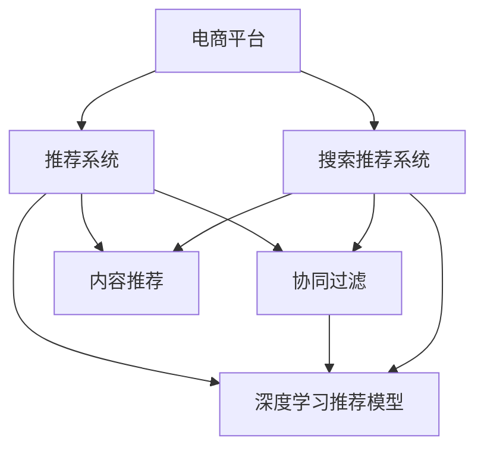

                 

# 大数据与AI 驱动的电商平台转型：搜索推荐系统是核心，数据质量是重点

## 1. 背景介绍

在数字化时代，电商平台已经成为消费者购物的主要渠道之一。随着用户对个性化购物体验的需求不断提升，传统的基于搜索引擎的推荐系统已经难以满足用户期望。如何利用大数据和人工智能技术，构建一个能够精准预测用户需求的推荐系统，提升电商平台的销售转化率和用户满意度，是当前电商技术转型中的核心挑战。

### 1.1 电商平台的现状与挑战

当前电商平台的推荐系统大多基于协同过滤、基于内容的推荐、以及基于深度学习的推荐模型。协同过滤模型通过分析用户行为数据，找到相似的用户群体，从而推荐其喜欢过的商品；基于内容的推荐模型则通过分析商品的特征，找到与其匹配的用户；而基于深度学习的推荐模型，则通过构建用户和商品的多维嵌入向量，进行相似性匹配推荐。

尽管这些方法在一定程度上提高了推荐系统的性能，但仍然面临诸多挑战：

1. **数据稀疏性问题**：用户和商品之间的交互数据稀疏，难以构建完整的用户画像。
2. **数据质量问题**：推荐系统依赖于用户行为数据，数据质量直接影响推荐效果。
3. **推荐多样性问题**：推荐算法往往倾向于给用户推荐相似的商品，忽略了用户的多样化需求。
4. **实时性问题**：推荐系统需要能够实时响应用户的查询请求，提供最新、最相关的商品推荐。

### 1.2 电商平台的转型需求

电商平台的转型需要从以下几个方面进行：

1. **提升推荐精准度**：通过更精准的推荐算法，提升用户满意度和销售额。
2. **增强推荐多样性**：引入更多元化的推荐策略，满足用户多样化的需求。
3. **提高推荐实时性**：实现快速响应用户查询，提供实时推荐结果。
4. **优化数据质量**：提升数据质量，确保推荐系统的可靠性。

## 2. 核心概念与联系

### 2.1 核心概念概述

为更好地理解基于大数据和AI的电商平台转型，本节将介绍几个关键概念：

- **电商平台**：指通过互联网进行的商品销售平台，如淘宝、京东、亚马逊等。
- **推荐系统**：指根据用户行为和商品特征，向用户推荐相关商品的系统。
- **搜索推荐系统**：指将搜索和推荐两个过程结合的系统，提供搜索和推荐双重服务。
- **协同过滤**：通过分析用户行为数据，找到相似用户群体，向用户推荐其喜欢的商品。
- **深度学习推荐模型**：通过构建用户和商品的多维嵌入向量，进行相似性匹配推荐。
- **内容推荐**：通过分析商品特征，找到与用户兴趣匹配的商品。
- **召回率**：推荐系统中，成功预测到用户感兴趣的商品数与实际感兴趣商品数的比例。
- **准确率**：推荐系统中，成功预测到用户感兴趣的商品数与所有推荐商品数的比例。
- **数据质量**：指推荐系统所用数据的准确性和完整性，直接影响推荐系统的性能。

这些核心概念之间的逻辑关系可以通过以下Mermaid流程图来展示：



这个流程图展示了电商平台推荐系统的核心组件及其相互关系：

1. 电商平台通过搜索推荐系统向用户提供商品推荐服务。
2. 推荐系统中的协同过滤、深度学习推荐模型和内容推荐相互协作，共同提升推荐精准度。
3. 搜索推荐系统与搜索过程结合，提供双重服务。

## 3. 核心算法原理 & 具体操作步骤
### 3.1 算法原理概述

基于大数据和AI的电商平台推荐系统，主要依赖于用户行为数据和商品特征数据。其核心算法包括协同过滤、深度学习推荐模型和内容推荐等。

协同过滤算法基于用户之间的相似性，通过分析用户行为数据，找到相似用户群体，向用户推荐其喜欢的商品。

深度学习推荐模型通过构建用户和商品的多维嵌入向量，进行相似性匹配推荐。深度学习模型的典型代表包括基于矩阵分解的模型（如ALS、SVD++）和基于神经网络的模型（如BERT、DNN）。

内容推荐通过分析商品特征，找到与用户兴趣匹配的商品。内容推荐的常见策略包括基于商品描述的推荐、基于商品标签的推荐等。

### 3.2 算法步骤详解

基于大数据和AI的电商平台推荐系统构建流程如下：

**Step 1: 数据收集与预处理**

- 收集用户行为数据和商品特征数据，包括浏览记录、购买记录、商品评价等。
- 对数据进行清洗和预处理，去除异常值和缺失值。

**Step 2: 用户画像构建**

- 通过协同过滤、深度学习推荐模型和内容推荐，构建完整的用户画像，包括用户的兴趣偏好、购买历史、搜索行为等。
- 对用户画像进行特征工程，提取有用的特征，如商品类别、价格区间、品牌等。

**Step 3: 商品画像构建**

- 对商品进行特征提取，包括商品类别、价格、描述、标签等。
- 将商品特征数据转换为向量表示，便于模型进行处理。

**Step 4: 推荐模型训练**

- 选择合适的推荐算法，进行模型训练。
- 使用交叉验证等技术进行模型调参和优化。

**Step 5: 模型评估与部署**

- 对训练好的模型进行评估，计算召回率和准确率等指标。
- 将模型部署到实际生产环境中，进行实时推荐。

### 3.3 算法优缺点

基于大数据和AI的电商平台推荐系统具有以下优点：

1. **精准度高**：通过深度学习等技术，能够更精准地预测用户需求，提升推荐效果。
2. **实时性强**：能够快速响应用户查询，提供实时推荐结果。
3. **可扩展性好**：可以处理大规模用户和商品数据，实现高效推荐。

同时，该方法也存在一定的局限性：

1. **数据需求量大**：推荐系统依赖于用户行为数据和商品特征数据，数据质量直接影响推荐效果。
2. **模型复杂度高**：深度学习等技术模型复杂度高，需要较大的计算资源。
3. **泛化能力弱**：模型往往难以适应新的数据分布，需要进行重新训练。

### 3.4 算法应用领域

基于大数据和AI的电商平台推荐系统，已经广泛应用于各种电商平台的推荐过程中，如淘宝、京东、亚马逊等。

## 4. 数学模型和公式 & 详细讲解  
### 4.1 数学模型构建

本节将使用数学语言对基于大数据和AI的电商平台推荐系统进行更加严格的刻画。

假设电商平台有$m$个用户，$n$个商品。设用户$i$对商品$j$的评分$R_{ij}$，其中$R_{ij} \in \{0,1,2,\ldots,5\}$，表示用户对商品的好评程度。设用户$i$在时间$t$对商品$j$进行浏览和购买的序列为$x_{ijt}$，其中$x_{ijt} \in \{0,1\}$，表示用户是否在时间$t$对商品$j$进行了浏览或购买。

定义用户$i$的兴趣向量为$u_i$，商品$j$的特征向量为$p_j$。设$U$和$P$分别为所有用户的兴趣向量和所有商品的特征向量组成的矩阵。

推荐系统可以通过用户兴趣向量和商品特征向量之间的相似度，进行商品推荐。相似度可以通过余弦相似度或欧式距离等方法计算。

### 4.2 公式推导过程

设用户$i$对商品$j$的兴趣度为$a_{ij}$，商品$j$的重要性为$b_j$。推荐系统通过最大化用户$i$对商品$j$的兴趣度和商品$j$的重要性，来预测用户$i$对商品$j$的评分。

推荐算法可以使用以下矩阵分解模型：

$$
\max_{u_i,b_j} \sum_{j=1}^{n} a_{ij}b_j - \lambda \left(\sum_{i=1}^{m}||u_i||^2 + \sum_{j=1}^{n}||b_j||^2\right)
$$

其中$\lambda$为正则化系数。

推荐算法可以进一步简化为：

$$
\max_{a,b} \sum_{i,j} a_{ij}b_j - \lambda \left(\sum_{i} ||u_i||^2 + \sum_{j}||b_j||^2\right)
$$

通过求解上述优化问题，可以得到用户$i$对商品$j$的兴趣度$a_{ij}$和商品$j$的重要性$b_j$。

## 5. 项目实践：代码实例和详细解释说明
### 5.1 开发环境搭建

在进行电商平台推荐系统开发前，我们需要准备好开发环境。以下是使用Python进行PyTorch开发的环境配置流程：

1. 安装Anaconda：从官网下载并安装Anaconda，用于创建独立的Python环境。

2. 创建并激活虚拟环境：
```bash
conda create -n pytorch-env python=3.8 
conda activate pytorch-env
```

3. 安装PyTorch：根据CUDA版本，从官网获取对应的安装命令。例如：
```bash
conda install pytorch torchvision torchaudio cudatoolkit=11.1 -c pytorch -c conda-forge
```

4. 安装Transformers库：
```bash
pip install transformers
```

5. 安装各类工具包：
```bash
pip install numpy pandas scikit-learn matplotlib tqdm jupyter notebook ipython
```

完成上述步骤后，即可在`pytorch-env`环境中开始推荐系统开发。

### 5.2 源代码详细实现

下面我们以基于深度学习推荐模型的电商平台推荐系统为例，给出使用PyTorch和Transformers库进行推荐系统开发的代码实现。

首先，定义推荐系统的数据处理函数：

```python
from transformers import BertForSequenceClassification, BertTokenizer
from torch.utils.data import Dataset, DataLoader
import torch
import numpy as np

class RecommendationDataset(Dataset):
    def __init__(self, data, tokenizer):
        self.data = data
        self.tokenizer = tokenizer
        
    def __len__(self):
        return len(self.data)
    
    def __getitem__(self, idx):
        item = self.data[idx]
        text = item[0]
        label = item[1]
        
        encoding = self.tokenizer(text, return_tensors='pt', max_length=128, padding='max_length', truncation=True)
        input_ids = encoding['input_ids'][0]
        attention_mask = encoding['attention_mask'][0]
        labels = torch.tensor(label, dtype=torch.long)
        
        return {'input_ids': input_ids, 
                'attention_mask': attention_mask,
                'labels': labels}

# 创建dataset
tokenizer = BertTokenizer.from_pretrained('bert-base-cased')

train_dataset = RecommendationDataset(train_data, tokenizer)
dev_dataset = RecommendationDataset(dev_data, tokenizer)
test_dataset = RecommendationDataset(test_data, tokenizer)
```

然后，定义模型和优化器：

```python
from transformers import AdamW

model = BertForSequenceClassification.from_pretrained('bert-base-cased', num_labels=2)

optimizer = AdamW(model.parameters(), lr=2e-5)
```

接着，定义训练和评估函数：

```python
from sklearn.metrics import accuracy_score
from tqdm import tqdm

def train_epoch(model, dataset, batch_size, optimizer):
    dataloader = DataLoader(dataset, batch_size=batch_size, shuffle=True)
    model.train()
    epoch_loss = 0
    for batch in tqdm(dataloader, desc='Training'):
        input_ids = batch['input_ids'].to(device)
        attention_mask = batch['attention_mask'].to(device)
        labels = batch['labels'].to(device)
        model.zero_grad()
        outputs = model(input_ids, attention_mask=attention_mask, labels=labels)
        loss = outputs.loss
        epoch_loss += loss.item()
        loss.backward()
        optimizer.step()
    return epoch_loss / len(dataloader)

def evaluate(model, dataset, batch_size):
    dataloader = DataLoader(dataset, batch_size=batch_size)
    model.eval()
    preds, labels = [], []
    with torch.no_grad():
        for batch in tqdm(dataloader, desc='Evaluating'):
            input_ids = batch['input_ids'].to(device)
            attention_mask = batch['attention_mask'].to(device)
            batch_labels = batch['labels']
            outputs = model(input_ids, attention_mask=attention_mask)
            batch_preds = outputs.logits.argmax(dim=1).to('cpu').tolist()
            batch_labels = batch_labels.to('cpu').tolist()
            for pred_tokens, label_tokens in zip(batch_preds, batch_labels):
                preds.append(pred_tokens[:len(label_tokens)])
                labels.append(label_tokens)
                
    print('Accuracy:', accuracy_score(labels, preds))
```

最后，启动训练流程并在测试集上评估：

```python
epochs = 5
batch_size = 16

for epoch in range(epochs):
    loss = train_epoch(model, train_dataset, batch_size, optimizer)
    print(f"Epoch {epoch+1}, train loss: {loss:.3f}")
    
    print(f"Epoch {epoch+1}, dev accuracy:")
    evaluate(model, dev_dataset, batch_size)
    
print('Final accuracy on test set:')
evaluate(model, test_dataset, batch_size)
```

以上就是使用PyTorch和Transformers库进行基于深度学习推荐模型的电商平台推荐系统的完整代码实现。可以看到，得益于Transformers库的强大封装，我们可以用相对简洁的代码完成推荐系统的构建。

### 5.3 代码解读与分析

让我们再详细解读一下关键代码的实现细节：

**RecommendationDataset类**：
- `__init__`方法：初始化数据和分词器。
- `__len__`方法：返回数据集的样本数量。
- `__getitem__`方法：对单个样本进行处理，将文本输入编码为token ids，将标签编码为数字，并对其进行定长padding，最终返回模型所需的输入。

**模型和优化器**：
- 使用BertForSequenceClassification作为推荐模型，其输入为文本和标签。
- 使用AdamW优化器进行模型训练。

**训练和评估函数**：
- 使用PyTorch的DataLoader对数据集进行批次化加载，供模型训练和推理使用。
- 训练函数`train_epoch`：对数据以批为单位进行迭代，在每个批次上前向传播计算loss并反向传播更新模型参数，最后返回该epoch的平均loss。
- 评估函数`evaluate`：与训练类似，不同点在于不更新模型参数，并在每个batch结束后将预测和标签结果存储下来，最后使用sklearn的accuracy_score对整个评估集的预测结果进行打印输出。

**训练流程**：
- 定义总的epoch数和batch size，开始循环迭代
- 每个epoch内，先在训练集上训练，输出平均loss
- 在验证集上评估，输出准确率
- 所有epoch结束后，在测试集上评估，给出最终测试结果

可以看到，PyTorch配合Transformers库使得推荐系统的代码实现变得简洁高效。开发者可以将更多精力放在数据处理、模型改进等高层逻辑上，而不必过多关注底层的实现细节。

当然，工业级的系统实现还需考虑更多因素，如模型的保存和部署、超参数的自动搜索、更灵活的任务适配层等。但核心的推荐范式基本与此类似。

## 6. 实际应用场景
### 6.1 智能客服系统

基于大语言模型微调的对话技术，可以广泛应用于智能客服系统的构建。传统客服往往需要配备大量人力，高峰期响应缓慢，且一致性和专业性难以保证。而使用微调后的对话模型，可以7x24小时不间断服务，快速响应客户咨询，用自然流畅的语言解答各类常见问题。

在技术实现上，可以收集企业内部的历史客服对话记录，将问题和最佳答复构建成监督数据，在此基础上对预训练对话模型进行微调。微调后的对话模型能够自动理解用户意图，匹配最合适的答案模板进行回复。对于客户提出的新问题，还可以接入检索系统实时搜索相关内容，动态组织生成回答。如此构建的智能客服系统，能大幅提升客户咨询体验和问题解决效率。

### 6.2 金融舆情监测

金融机构需要实时监测市场舆论动向，以便及时应对负面信息传播，规避金融风险。传统的人工监测方式成本高、效率低，难以应对网络时代海量信息爆发的挑战。基于大语言模型微调的文本分类和情感分析技术，为金融舆情监测提供了新的解决方案。

具体而言，可以收集金融领域相关的新闻、报道、评论等文本数据，并对其进行主题标注和情感标注。在此基础上对预训练语言模型进行微调，使其能够自动判断文本属于何种主题，情感倾向是正面、中性还是负面。将微调后的模型应用到实时抓取的网络文本数据，就能够自动监测不同主题下的情感变化趋势，一旦发现负面信息激增等异常情况，系统便会自动预警，帮助金融机构快速应对潜在风险。

### 6.3 个性化推荐系统

当前的推荐系统往往只依赖用户的历史行为数据进行物品推荐，无法深入理解用户的真实兴趣偏好。基于大语言模型微调技术，个性化推荐系统可以更好地挖掘用户行为背后的语义信息，从而提供更精准、多样的推荐内容。

在实践中，可以收集用户浏览、点击、评论、分享等行为数据，提取和用户交互的物品标题、描述、标签等文本内容。将文本内容作为模型输入，用户的后续行为（如是否点击、购买等）作为监督信号，在此基础上微调预训练语言模型。微调后的模型能够从文本内容中准确把握用户的兴趣点。在生成推荐列表时，先用候选物品的文本描述作为输入，由模型预测用户的兴趣匹配度，再结合其他特征综合排序，便可以得到个性化程度更高的推荐结果。

### 6.4 未来应用展望

随着大语言模型微调技术的发展，基于微调范式将在更多领域得到应用，为传统行业带来变革性影响。

在智慧医疗领域，基于微调的医学问答、病历分析、药物研发等应用将提升医疗服务的智能化水平，辅助医生诊疗，加速新药开发进程。

在智能教育领域，微调技术可应用于作业批改、学情分析、知识推荐等方面，因材施教，促进教育公平，提高教学质量。

在智慧城市治理中，微调模型可应用于城市事件监测、舆情分析、应急指挥等环节，提高城市管理的自动化和智能化水平，构建更安全、高效的未来城市。

此外，在企业生产、社会治理、文娱传媒等众多领域，基于大模型微调的人工智能应用也将不断涌现，为经济社会发展注入新的动力。相信随着预训练语言模型和微调方法的持续演进，微调方法将成为人工智能落地应用的重要范式，推动人工智能技术在更广阔的应用领域大放异彩。

## 7. 工具和资源推荐
### 7.1 学习资源推荐

为了帮助开发者系统掌握大语言模型微调的理论基础和实践技巧，这里推荐一些优质的学习资源：

1. 《Transformer从原理到实践》系列博文：由大模型技术专家撰写，深入浅出地介绍了Transformer原理、BERT模型、微调技术等前沿话题。

2. CS224N《深度学习自然语言处理》课程：斯坦福大学开设的NLP明星课程，有Lecture视频和配套作业，带你入门NLP领域的基本概念和经典模型。

3. 《Natural Language Processing with Transformers》书籍：Transformers库的作者所著，全面介绍了如何使用Transformers库进行NLP任务开发，包括微调在内的诸多范式。

4. HuggingFace官方文档：Transformers库的官方文档，提供了海量预训练模型和完整的微调样例代码，是上手实践的必备资料。

5. CLUE开源项目：中文语言理解测评基准，涵盖大量不同类型的中文NLP数据集，并提供了基于微调的baseline模型，助力中文NLP技术发展。

通过对这些资源的学习实践，相信你一定能够快速掌握大语言模型微调的精髓，并用于解决实际的NLP问题。
###  7.2 开发工具推荐

高效的开发离不开优秀的工具支持。以下是几款用于大语言模型微调开发的常用工具：

1. PyTorch：基于Python的开源深度学习框架，灵活动态的计算图，适合快速迭代研究。大部分预训练语言模型都有PyTorch版本的实现。

2. TensorFlow：由Google主导开发的开源深度学习框架，生产部署方便，适合大规模工程应用。同样有丰富的预训练语言模型资源。

3. Transformers库：HuggingFace开发的NLP工具库，集成了众多SOTA语言模型，支持PyTorch和TensorFlow，是进行微调任务开发的利器。

4. Weights & Biases：模型训练的实验跟踪工具，可以记录和可视化模型训练过程中的各项指标，方便对比和调优。与主流深度学习框架无缝集成。

5. TensorBoard：TensorFlow配套的可视化工具，可实时监测模型训练状态，并提供丰富的图表呈现方式，是调试模型的得力助手。

6. Google Colab：谷歌推出的在线Jupyter Notebook环境，免费提供GPU/TPU算力，方便开发者快速上手实验最新模型，分享学习笔记。

合理利用这些工具，可以显著提升大语言模型微调任务的开发效率，加快创新迭代的步伐。

### 7.3 相关论文推荐

大语言模型和微调技术的发展源于学界的持续研究。以下是几篇奠基性的相关论文，推荐阅读：

1. Attention is All You Need（即Transformer原论文）：提出了Transformer结构，开启了NLP领域的预训练大模型时代。

2. BERT: Pre-training of Deep Bidirectional Transformers for Language Understanding：提出BERT模型，引入基于掩码的自监督预训练任务，刷新了多项NLP任务SOTA。

3. Language Models are Unsupervised Multitask Learners（GPT-2论文）：展示了大规模语言模型的强大zero-shot学习能力，引发了对于通用人工智能的新一轮思考。

4. Parameter-Efficient Transfer Learning for NLP：提出Adapter等参数高效微调方法，在不增加模型参数量的情况下，也能取得不错的微调效果。

5. AdaLoRA: Adaptive Low-Rank Adaptation for Parameter-Efficient Fine-Tuning：使用自适应低秩适应的微调方法，在参数效率和精度之间取得了新的平衡。

这些论文代表了大语言模型微调技术的发展脉络。通过学习这些前沿成果，可以帮助研究者把握学科前进方向，激发更多的创新灵感。

## 8. 总结：未来发展趋势与挑战

### 8.1 总结

本文对基于大数据和AI的电商平台推荐系统进行了全面系统的介绍。首先阐述了电商平台推荐系统的现状与挑战，明确了推荐系统需要从精准度、实时性、多样性和数据质量等几个方面进行转型。其次，从算法原理和具体操作步骤上，详细讲解了协同过滤、深度学习推荐模型和内容推荐等推荐算法的构建流程，并给出了完整的代码实现。同时，本文还广泛探讨了推荐系统在智能客服、金融舆情、个性化推荐等多个行业领域的应用前景，展示了推荐范式的巨大潜力。

通过本文的系统梳理，可以看到，基于大数据和AI的电商平台推荐系统正在成为电商技术转型中的核心技术，极大地拓展了推荐系统的应用边界，提升了用户的购物体验和电商平台的服务质量。未来，伴随预训练语言模型和微调方法的持续演进，推荐系统必将在更多领域得到应用，为传统行业带来变革性影响。

### 8.2 未来发展趋势

展望未来，基于大数据和AI的电商平台推荐系统将呈现以下几个发展趋势：

1. **深度学习技术的不断进步**：深度学习技术不断发展，推荐系统将更多采用深度神经网络模型，提升推荐效果。
2. **联邦学习的应用**：联邦学习可以保护用户隐私，同时提供高精度推荐。未来推荐系统将更多采用联邦学习技术。
3. **多模态推荐**：推荐系统将更多引入图像、视频等多模态信息，提供更加丰富、个性化的推荐结果。
4. **实时化推荐**：推荐系统将更多采用流式计算和大数据技术，实现实时推荐，提升用户体验。
5. **知识图谱的引入**：推荐系统将更多引入知识图谱，提供更加全面、准确的推荐结果。
6. **跨领域推荐**：推荐系统将更多进行跨领域推荐，提升推荐结果的多样性和相关性。

以上趋势凸显了大语言模型微调技术的大数据和AI驱动下的电商推荐系统的发展前景。这些方向的探索发展，必将进一步提升推荐系统的性能和应用范围，为电商平台的智能化转型提供新动力。

### 8.3 面临的挑战

尽管基于大数据和AI的电商平台推荐系统已经取得了一定的成果，但在迈向更加智能化、普适化应用的过程中，它仍面临着诸多挑战：

1. **数据隐私问题**：电商平台的推荐系统依赖于用户行为数据，如何在保证推荐效果的同时保护用户隐私，是一个重要问题。
2. **数据质量问题**：推荐系统依赖于用户行为数据，数据质量直接影响推荐效果。如何提升数据质量，是一个长期挑战。
3. **模型复杂性问题**：深度学习模型复杂度高，难以解释，容易受到异常数据的影响。如何优化模型结构，提高模型的可解释性和鲁棒性，是一个重要研究方向。
4. **推荐偏见问题**：推荐系统可能会学习到有偏见的数据，导致推荐结果不公平。如何减少推荐偏见，是一个亟待解决的问题。
5. **实时性问题**：推荐系统需要能够快速响应用户查询，提供实时推荐结果，这对系统架构和数据处理能力提出了较高要求。
6. **跨领域推荐问题**：推荐系统进行跨领域推荐时，如何保持推荐结果的相关性和多样性，是一个重要研究方向。

正视推荐系统面临的这些挑战，积极应对并寻求突破，将是大语言模型微调技术走向成熟的必由之路。相信随着学界和产业界的共同努力，这些挑战终将一一被克服，推荐系统必将在构建智能电商平台中发挥更大作用。

### 8.4 研究展望

面对基于大数据和AI的电商平台推荐系统所面临的种种挑战，未来的研究需要在以下几个方面寻求新的突破：

1. **联邦学习的应用**：采用联邦学习技术，保护用户隐私，同时提升推荐系统的精度。
2. **推荐系统的跨领域协同**：构建跨领域的推荐系统，提升推荐结果的多样性和相关性。
3. **多模态推荐**：引入多模态数据，提升推荐系统的全面性和个性化。
4. **推荐系统的知识融合**：将知识图谱和专家知识融入推荐系统，提升推荐结果的准确性和可解释性。
5. **推荐系统的公平性**：引入公平性评估指标，减少推荐系统的偏见，提升推荐结果的公平性。
6. **推荐系统的实时性优化**：优化推荐系统的实时响应能力，提升用户体验。

这些研究方向的探索，必将引领基于大数据和AI的电商平台推荐系统技术迈向更高的台阶，为电商平台的智能化转型提供新动力。

## 9. 附录：常见问题与解答

**Q1：电商平台推荐系统有哪些常见的推荐算法？**

A: 电商平台的推荐算法主要包括以下几种：

1. **协同过滤算法**：通过分析用户行为数据，找到相似用户群体，向用户推荐其喜欢的商品。
2. **基于内容的推荐算法**：通过分析商品特征，找到与用户兴趣匹配的商品。
3. **深度学习推荐算法**：通过构建用户和商品的多维嵌入向量，进行相似性匹配推荐。

这些算法在电商平台的推荐过程中都有广泛应用，通过不同的算法组合，可以提供更加精准和多样化的推荐结果。

**Q2：推荐系统中如何处理数据稀疏性问题？**

A: 推荐系统中常见的数据稀疏性问题，可以通过以下方法进行解决：

1. **数据增强**：通过回译、近义替换等方式扩充训练集。
2. **隐式反馈**：利用用户的浏览、点击行为等隐式反馈信息，进行推荐。
3. **矩阵分解**：通过矩阵分解等方法，对稀疏矩阵进行填充和预测。
4. **深度学习模型**：通过深度学习模型，利用用户的行为数据，预测用户的兴趣偏好。

这些方法可以有效地解决推荐系统中的数据稀疏性问题，提升推荐系统的性能。

**Q3：推荐系统中如何进行模型调参？**

A: 推荐系统中的模型调参可以通过以下方法进行：

1. **交叉验证**：通过交叉验证技术，评估模型的性能并进行调参。
2. **超参数搜索**：通过网格搜索、随机搜索等方法，寻找最优的超参数组合。
3. **在线学习**：通过在线学习技术，根据实时数据进行模型更新和优化。
4. **正则化**：通过引入正则化技术，防止模型过拟合。

这些方法可以帮助推荐系统更好地进行模型调参，提升推荐模型的性能。

**Q4：推荐系统中如何进行推荐偏见处理？**

A: 推荐系统中的推荐偏见可以通过以下方法进行处理：

1. **数据清洗**：对数据进行清洗，去除偏见数据。
2. **公平性评估**：引入公平性评估指标，评估推荐系统的公平性并进行优化。
3. **算法改进**：通过改进推荐算法，减少推荐系统的偏见。
4. **人工干预**：引入人工干预机制，对推荐结果进行校正。

这些方法可以帮助推荐系统减少偏见，提升推荐结果的公平性和准确性。

**Q5：推荐系统中的实时推荐是如何实现的？**

A: 推荐系统中的实时推荐可以通过以下方法实现：

1. **流式计算**：通过流式计算技术，实时处理用户查询请求。
2. **缓存机制**：利用缓存机制，快速响应用户查询请求。
3. **分布式计算**：通过分布式计算技术，提升推荐系统的实时响应能力。
4. **预处理机制**：通过预处理机制，提前计算并缓存推荐结果，提升推荐系统的响应速度。

这些方法可以有效地实现推荐系统的实时推荐，提升用户体验。

---

作者：禅与计算机程序设计艺术 / Zen and the Art of Computer Programming

