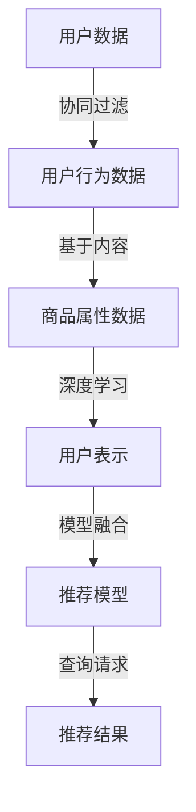

                 

# 大数据与AI 驱动的电商推荐：AI 模型融合技术在搜索推荐系统的应用

> 关键词：搜索推荐系统,电商推荐,大数据,人工智能,模型融合,协同过滤,深度学习

## 1. 背景介绍

随着互联网技术的发展，电商平台的规模和用户数量迅速增长，如何精准地推荐商品给用户，成为了电商企业提高用户留存率和销售额的关键。传统的商品推荐系统主要依赖于协同过滤和基于内容的推荐方法，但在数据多样性和用户行为的复杂性面前，这些方法逐渐显露出局限性。近年来，基于深度学习的推荐系统在电商领域得到了广泛应用，并逐渐成为行业标配。本文将介绍深度学习在电商推荐系统中的应用，特别是利用AI模型融合技术进行推荐，探讨其在搜索推荐系统中的具体实现。

## 2. 核心概念与联系

### 2.1 核心概念概述

电商推荐系统是根据用户的浏览、购买历史以及行为数据，预测用户可能感兴趣的商品，并进行推荐的系统。传统的推荐系统主要分为两大类：协同过滤和基于内容的推荐。

- **协同过滤**：基于用户之间或物品之间的相似性进行推荐，分为基于用户的协同过滤和基于物品的协同过滤。
- **基于内容的推荐**：根据物品的属性特征和用户的历史兴趣进行推荐，适用于新物品的推荐。

而基于深度学习的推荐系统主要利用神经网络模型进行推荐，具有更好的处理能力，但需要大量的标注数据和计算资源。深度学习推荐系统可分为基于用户的表示学习和基于物品的表示学习。

- **基于用户的表示学习**：直接对用户进行建模，生成用户嵌入表示。
- **基于物品的表示学习**：直接对物品进行建模，生成物品嵌入表示。

另外，模型融合技术是指将多种模型或方法融合在一起，综合其优势，以提高推荐系统的性能。模型融合技术的应用不仅提升了推荐效果，还能增强系统的稳定性和鲁棒性。

### 2.2 核心概念原理和架构的 Mermaid 流程图(Mermaid 流程节点中不要有括号、逗号等特殊字符)


## 3. 核心算法原理 & 具体操作步骤
### 3.1 算法原理概述

电商推荐系统主要分为两个步骤：离线构建推荐模型和在线推荐。离线阶段，系统会通过大量的用户行为数据和商品属性数据进行模型训练；在线阶段，系统会根据用户的实时查询，从训练好的模型中生成推荐结果。

深度学习推荐系统主要基于神经网络模型，通过训练学习用户和物品的表示。常见的深度学习模型包括协同过滤网络、矩阵分解网络和序列推荐网络等。

- **协同过滤网络**：使用神经网络对协同过滤算法进行建模，生成用户和物品的表示。
- **矩阵分解网络**：使用神经网络对矩阵分解算法进行建模，生成用户和物品的表示。
- **序列推荐网络**：使用神经网络对序列推荐算法进行建模，生成用户的序列表示。

模型融合技术通过将不同的推荐模型融合在一起，形成更强的推荐能力。常见的融合方式包括投票、加权平均、模型串联等。

- **投票**：对多个模型的预测结果进行投票，选择得票最多的结果。
- **加权平均**：根据各模型的预测结果，赋予不同的权重，进行加权平均。
- **模型串联**：将多个模型串联在一起，依次进行预测，得到最终的预测结果。

### 3.2 算法步骤详解

电商推荐系统的离线构建包括以下步骤：

1. **数据准备**：收集用户行为数据、商品属性数据和标注数据。
2. **模型训练**：使用深度学习模型进行训练，生成用户和物品的表示。
3. **模型融合**：将多个模型的预测结果进行融合，形成最终的推荐模型。
4. **模型评估**：使用测试数据集对模型进行评估，选择最优模型进行在线推荐。

电商推荐系统的在线推荐包括以下步骤：

1. **用户输入**：用户输入查询请求。
2. **模型预测**：从训练好的模型中生成推荐结果。
3. **推荐展示**：将推荐结果展示给用户。

### 3.3 算法优缺点

深度学习推荐系统相较于传统推荐系统，具有以下优点：

1. **处理能力更强**：深度学习模型能够处理更加复杂的数据结构和特征。
2. **自适应能力更强**：深度学习模型能够自动学习数据中的隐藏特征，适应不同的用户和物品。
3. **推荐效果更好**：深度学习模型在推荐效果上优于传统的协同过滤和基于内容推荐方法。

同时，深度学习推荐系统也存在以下缺点：

1. **计算资源消耗大**：深度学习模型需要大量的计算资源进行训练和推理。
2. **需要大量标注数据**：深度学习模型需要大量的标注数据进行训练，而标注数据的获取成本较高。
3. **模型复杂度高**：深度学习模型复杂度较高，容易过拟合，需要更多的正则化技术。

### 3.4 算法应用领域

电商推荐系统在实际应用中，主要用于提升用户体验和提高销售额。常见的应用场景包括：

- **商品推荐**：根据用户的历史行为和属性信息，推荐用户可能感兴趣的商品。
- **个性化推荐**：根据用户的具体需求和偏好，进行个性化的推荐。
- **跨品类推荐**：将不同品类之间的商品进行关联推荐，提升用户的多样化消费体验。
- **实时推荐**：根据用户的实时行为，进行实时的推荐。

## 4. 数学模型和公式 & 详细讲解 & 举例说明

### 4.1 数学模型构建

电商推荐系统主要基于用户-商品交互矩阵进行建模。设用户集合为 $U$，商品集合为 $I$，用户-商品交互矩阵为 $M_{ui}$，其中 $M_{ui}=1$ 表示用户 $u$ 购买了商品 $i$，否则为 0。

用户的表示向量为 $u \in \mathbb{R}^d$，商品的表示向量为 $i \in \mathbb{R}^d$。推荐模型的目标是最大化用户的满意度，即最大化预测的评分与真实评分的相似度。

### 4.2 公式推导过程

电商推荐系统的目标函数为：

$$
\max_{u,i} \sum_{ui \neq 0} \log(\sigma(r_{ui})) - \sum_{ui \neq 0} \log(\sigma(-r_{ui})) + \lambda \|u\|_2^2 + \lambda \|i\|_2^2
$$

其中 $r_{ui}$ 为预测评分，$\sigma(x)$ 为sigmoid函数，$\lambda$ 为正则化系数，$\|u\|_2^2$ 为用户表示向量的L2范数。

模型的预测评分 $r_{ui}$ 可以通过用户表示向量 $u$ 和物品表示向量 $i$ 的矩阵乘积得到：

$$
r_{ui} = u^Ti
$$

模型的训练过程使用梯度下降算法，通过优化目标函数，更新用户表示向量和物品表示向量。

### 4.3 案例分析与讲解

假设用户 $u$ 对商品 $i$ 的评分 $r_{ui}=1$，模型的预测评分 $r_{ui}=0.8$，则模型的目标函数为：

$$
\max_{u,i} \log(\sigma(0.8)) - \log(\sigma(-1)) + \lambda \|u\|_2^2 + \lambda \|i\|_2^2
$$

通过求解上述优化问题，可以得到最优的 $u$ 和 $i$，从而生成推荐结果。

## 5. 项目实践：代码实例和详细解释说明
### 5.1 开发环境搭建

电商推荐系统的开发环境搭建需要以下步骤：

1. **安装Python**：选择安装Python 3.7或更高版本。
2. **安装深度学习框架**：安装TensorFlow、PyTorch等深度学习框架。
3. **安装推荐系统库**：安装LightFM、Surprise等推荐系统库。
4. **安装数据处理库**：安装Pandas、NumPy等数据处理库。

### 5.2 源代码详细实现

电商推荐系统的推荐模型可以使用深度学习框架实现。以下是一个基于TensorFlow的深度学习推荐模型实现示例：

```python
import tensorflow as tf
from tensorflow.keras import layers, models

# 定义模型
def build_model(input_dim, hidden_dim):
    model = models.Sequential()
    model.add(layers.Dense(hidden_dim, activation='relu', input_dim=input_dim))
    model.add(layers.Dense(1, activation='sigmoid'))
    return model

# 加载数据
u_data = pd.read_csv('user_data.csv')
i_data = pd.read_csv('item_data.csv')
rating_data = pd.read_csv('rating_data.csv')

# 数据预处理
user_ids = u_data['user_id'].unique()
item_ids = i_data['item_id'].unique()
ratings = rating_data['rating'].unique()
train_data = {}
for user_id in user_ids:
    for item_id in item_ids:
        if (user_id, item_id) in rating_data:
            train_data[(user_id, item_id)] = rating_data[(user_id, item_id)]

# 划分训练集和测试集
train_size = int(len(train_data) * 0.8)
train_data = {}
for user_id in user_ids:
    for item_id in item_ids:
        if (user_id, item_id) in train_data:
            train_data[(user_id, item_id)] = train_data[(user_id, item_id)]
test_data = {}
for user_id in user_ids:
    for item_id in item_ids:
        if (user_id, item_id) not in train_data:
            test_data[(user_id, item_id)] = 0

# 构建模型
hidden_dim = 128
model = build_model(len(item_ids), hidden_dim)
model.compile(optimizer=tf.keras.optimizers.Adam(), loss='binary_crossentropy', metrics=['accuracy'])

# 训练模型
model.fit(train_data, epochs=10, validation_data=test_data)

# 使用模型进行推荐
user_id = 1
item_ids = [1, 2, 3, 4, 5]
predictions = model.predict(item_ids)
recommended_items = [(item_id, prediction) for item_id, prediction in zip(item_ids, predictions)]
```

### 5.3 代码解读与分析

上述代码实现了一个基于TensorFlow的深度学习推荐模型。首先，定义了模型结构，包括一个隐藏层和一个输出层。然后，加载和预处理数据，划分为训练集和测试集。接着，构建模型并进行训练，最后使用训练好的模型进行推荐。

## 6. 实际应用场景

电商推荐系统在实际应用中，主要用于提升用户体验和提高销售额。常见的应用场景包括：

- **商品推荐**：根据用户的历史行为和属性信息，推荐用户可能感兴趣的商品。
- **个性化推荐**：根据用户的具体需求和偏好，进行个性化的推荐。
- **跨品类推荐**：将不同品类之间的商品进行关联推荐，提升用户的多样化消费体验。
- **实时推荐**：根据用户的实时行为，进行实时的推荐。

## 7. 工具和资源推荐
### 7.1 学习资源推荐

为了帮助开发者系统掌握电商推荐系统的理论基础和实践技巧，这里推荐一些优质的学习资源：

1. 《推荐系统实战》一书：介绍了推荐系统的基本原理和实践方法，包含协同过滤和深度学习推荐系统的详细介绍。
2. 《深度学习》一书：由Goodfellow等著，全面介绍了深度学习的理论基础和实践方法，包含推荐系统的相关内容。
3. 《TensorFlow实战》一书：介绍了TensorFlow框架的使用方法和推荐系统的实现技巧。
4. Coursera上的推荐系统课程：由斯坦福大学开设，包含推荐系统的基础理论和实践方法，涵盖协同过滤和深度学习推荐系统。
5. Kaggle上的推荐系统竞赛：通过参与推荐系统的竞赛，实践推荐系统的构建和优化。

通过对这些资源的学习实践，相信你一定能够快速掌握电商推荐系统的精髓，并用于解决实际的推荐问题。

### 7.2 开发工具推荐

高效的开发离不开优秀的工具支持。以下是几款用于电商推荐系统开发的常用工具：

1. TensorFlow：由Google主导开发的深度学习框架，功能强大，易于使用。
2. PyTorch：由Facebook开发的深度学习框架，灵活高效。
3. LightFM：一个高效的推荐系统库，支持深度学习推荐系统和协同过滤算法。
4. Surprise：一个轻量级的推荐系统库，支持多种推荐算法，包括协同过滤和矩阵分解算法。
5. Apache Spark：一个高性能的大数据处理框架，支持大规模数据的推荐系统构建。

合理利用这些工具，可以显著提升电商推荐系统的开发效率，加快创新迭代的步伐。

### 7.3 相关论文推荐

电商推荐系统的发展源于学界的持续研究。以下是几篇奠基性的相关论文，推荐阅读：

1. 《协同过滤推荐系统》（Lichuan Liao等，2008年）：提出了协同过滤推荐系统的基本原理和算法。
2. 《矩阵分解推荐系统》（Yunhua Chen等，2010年）：提出了矩阵分解推荐系统的基本原理和算法。
3. 《深度学习推荐系统》（Ruslan Salakhutdinov等，2010年）：提出了基于深度学习的推荐系统，开创了深度学习在推荐领域的应用。
4. 《基于用户表示的推荐系统》（Ming Yin等，2011年）：提出了基于用户表示的推荐系统，通过神经网络对用户进行建模。
5. 《基于矩阵分解的推荐系统》（Yunhua Chen等，2011年）：提出了基于矩阵分解的推荐系统，通过神经网络对用户和商品进行建模。

这些论文代表了大数据和AI技术在电商推荐系统中的应用，展示了推荐系统的发展历程和技术进展。

## 8. 总结：未来发展趋势与挑战

### 8.1 研究成果总结

深度学习推荐系统在电商推荐领域得到了广泛应用，并通过模型融合技术进一步提升了推荐效果。然而，深度学习推荐系统仍面临一些挑战，如计算资源消耗大、需要大量标注数据等。未来，推荐系统的研究重点将集中在以下方向：

- **轻量化模型**：开发轻量级、高效的推荐模型，降低计算资源消耗。
- **无标注推荐**：探索无标注推荐方法，减少对标注数据的需求。
- **多模态推荐**：引入视觉、语音等多模态信息，提升推荐系统的表现力。
- **个性化推荐**：进一步提升推荐系统的个性化能力，满足用户的多样化需求。
- **实时推荐**：实现实时的推荐系统，提升用户体验。

### 8.2 未来发展趋势

电商推荐系统的未来发展趋势如下：

1. **更加个性化**：推荐系统将更加注重用户的个性化需求，实现个性化的推荐。
2. **更加精准**：推荐系统将更加精准，能够预测用户未购买或未浏览的商品。
3. **更加多模态**：推荐系统将引入更多的数据来源，如视觉、语音等，提升推荐效果。
4. **更加实时**：推荐系统将实现实时推荐，提升用户体验。
5. **更加公平**：推荐系统将更加公平，避免对某些用户的歧视性推荐。

### 8.3 面临的挑战

尽管电商推荐系统已经取得了显著的进展，但在实际应用中仍面临一些挑战：

1. **计算资源消耗大**：深度学习模型需要大量的计算资源进行训练和推理，对硬件要求较高。
2. **需要大量标注数据**：深度学习模型需要大量的标注数据进行训练，标注数据的获取成本较高。
3. **模型复杂度高**：深度学习模型复杂度较高，容易过拟合，需要更多的正则化技术。
4. **数据多样性**：电商推荐系统需要处理多种数据类型，如文本、图片、视频等，数据处理复杂。
5. **用户隐私**：电商推荐系统需要处理用户的隐私数据，需要满足隐私保护和数据安全的要求。

### 8.4 研究展望

未来，电商推荐系统的研究需要从以下几个方面进行探索：

1. **轻量化模型**：开发轻量级、高效的推荐模型，降低计算资源消耗。
2. **无标注推荐**：探索无标注推荐方法，减少对标注数据的需求。
3. **多模态推荐**：引入视觉、语音等多模态信息，提升推荐系统的表现力。
4. **个性化推荐**：进一步提升推荐系统的个性化能力，满足用户的多样化需求。
5. **实时推荐**：实现实时的推荐系统，提升用户体验。
6. **公平性**：提升推荐系统的公平性，避免对某些用户的歧视性推荐。

综上所述，深度学习推荐系统在电商推荐领域具有广阔的应用前景，但面临一些挑战和困难。未来，推荐系统的研究需要从多个角度进行探索，提升推荐效果和用户体验，实现电商推荐系统的持续进步。

## 9. 附录：常见问题与解答

**Q1：电商推荐系统如何处理多模态数据？**

A: 电商推荐系统可以通过引入视觉、语音等多模态数据，提升推荐效果。例如，利用图像分类技术对商品进行分类，利用语音识别技术对用户进行情感分析等。在模型训练过程中，需要将多模态数据融合到推荐模型中，共同进行训练和推理。

**Q2：电商推荐系统如何应对新用户的冷启动问题？**

A: 电商推荐系统可以通过引入用户画像和行为模型，对新用户进行初始化。例如，根据用户的浏览历史、购买历史和社交关系等，生成用户画像，作为初始化输入。此外，可以通过采集用户的历史数据和行为特征，生成行为模型，作为推荐模型的基础。

**Q3：电商推荐系统如何实现跨品类推荐？**

A: 电商推荐系统可以通过引入知识图谱和领域知识，实现跨品类推荐。例如，利用商品之间的关系构建知识图谱，利用领域知识对商品进行分类和关联。在推荐过程中，可以利用知识图谱和领域知识，将不同品类之间的商品进行关联推荐，提升用户的购物体验。

**Q4：电商推荐系统如何实现实时推荐？**

A: 电商推荐系统可以通过引入流数据处理技术和实时查询技术，实现实时推荐。例如，利用流数据处理技术，对用户的实时行为进行实时处理和分析，生成推荐结果。在推荐过程中，可以利用实时查询技术，实时响应用户的查询请求，提升用户体验。

通过本文的系统梳理，可以看到，电商推荐系统在实际应用中，利用深度学习和大数据技术，取得了显著的推荐效果。未来，推荐系统的研究需要在多个方面进行探索，提升推荐效果和用户体验，实现电商推荐系统的持续进步。总之，电商推荐系统需要从数据、算法、工程等多个维度协同发力，才能真正实现人工智能技术在电商领域的规模化落地。

