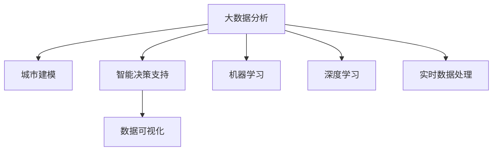

                 

# 大数据分析在城市规划中的应用：智能化决策支持

> 关键词：大数据分析,城市规划,智能决策支持,数据可视化,机器学习,深度学习,实时数据处理,城市建模,交通模拟,智慧城市

## 1. 背景介绍

### 1.1 问题由来
随着城市化进程的加快，全球城市人口持续增长，城市规模日益扩大，城市规划和管理面临越来越复杂的挑战。传统城市规划依靠人工分析海量数据，容易陷入数据量大、分析慢、精度低、决策慢的困境。而大数据分析技术，尤其是数据挖掘、机器学习、深度学习等手段，为城市规划带来了新的机遇。

大数据分析在城市规划中的应用，主要聚焦于以下几个方面：

1. **数据获取与整合**：利用各类传感器、监控设备、遥感影像等，收集城市运行的各种数据，如交通流量、空气质量、能源消耗、人口分布等。
2. **数据处理与分析**：通过数据清洗、数据挖掘、机器学习等手段，提取数据中的有用信息，构建城市运行模型。
3. **智能决策支持**：结合实时数据和历史数据分析结果，为城市规划和管理提供智能决策支持，如交通流量预测、绿地分布优化、能源分配、紧急事件应对等。

### 1.2 问题核心关键点
城市规划中的大数据分析，具有以下核心关键点：

1. **数据质量与数量**：高质量、大样本量的数据是城市规划分析的基础。
2. **数据处理速度**：城市运行数据通常是实时产生的，因此数据处理速度要能满足实时性要求。
3. **模型构建与优化**：通过机器学习、深度学习等方法，构建城市运行模型，并在模型中选择最合适的算法和参数。
4. **可视化与展示**：将数据分析结果可视化，提供直观、易懂的决策支持。
5. **智能决策支持**：结合数据模型和实时数据，提供智能决策支持，提升城市规划和管理的效率和质量。

这些关键点共同构成了大数据分析在城市规划中的核心技术框架，为实现智能化决策支持提供了重要保障。

## 2. 核心概念与联系

### 2.1 核心概念概述

为更好地理解大数据分析在城市规划中的应用，本节将介绍几个关键概念：

- **大数据分析**：通过对海量、多样、实时数据进行采集、清洗、处理、分析和挖掘，提取有用信息，支持决策制定的过程。
- **城市建模**：利用数据建模技术，模拟城市运行的动态过程，预测未来趋势。
- **智能决策支持**：通过数据分析和模型预测，为城市规划和管理提供智能化的决策建议。
- **数据可视化**：将数据分析结果通过图表、地图等形式展示，便于直观理解和决策。
- **机器学习与深度学习**：基于数据训练模型，自动识别数据中的规律和趋势，支持预测和决策。
- **实时数据处理**：对实时产生的城市数据进行快速处理和分析，为城市管理提供即时反馈。

这些核心概念之间的逻辑关系可以通过以下Mermaid流程图来展示：



这个流程图展示了大数据分析在城市规划中的核心技术框架：

1. 大数据分析通过数据收集和处理，为城市建模和智能决策提供支持。
2. 城市建模利用数据构建动态模型，预测未来趋势。
3. 智能决策支持结合数据模型和实时数据，提供智能化决策建议。
4. 数据可视化将分析结果可视化，方便决策。
5. 机器学习和深度学习基于数据训练模型，支持预测和决策。
6. 实时数据处理对实时数据进行快速处理，提供即时反馈。

## 3. 核心算法原理 & 具体操作步骤
### 3.1 算法原理概述

大数据分析在城市规划中的应用，主要基于以下几个核心算法原理：

- **数据采集与整合**：通过各类传感器、监控设备、遥感影像等，采集城市运行的各种数据，利用ETL技术进行清洗和整合。
- **数据挖掘与分析**：通过数据挖掘、聚类、分类等算法，提取数据中的有用信息，构建城市运行模型。
- **机器学习与深度学习**：基于历史数据训练模型，自动识别数据中的规律和趋势，支持预测和决策。
- **实时数据处理**：利用流式计算、增量学习等技术，对实时产生的城市数据进行快速处理和分析，提供即时反馈。
- **数据可视化**：通过图表、地图等形式，将数据分析结果可视化，便于直观理解和决策。

这些算法共同构成了大数据分析在城市规划中的应用框架，为实现智能化决策支持提供了技术基础。

### 3.2 算法步骤详解

基于大数据分析的城市规划，一般包括以下几个关键步骤：

**Step 1: 数据收集与整合**

- 收集各类传感器、监控设备、遥感影像等产生的城市运行数据，包括交通流量、空气质量、能源消耗、人口分布等。
- 利用ETL技术进行数据清洗、去重、格式转换等操作，保证数据的准确性和一致性。
- 整合来自不同来源的数据，构建统一的数据仓库。

**Step 2: 数据处理与分析**

- 对清洗后的数据进行特征工程，提取有用的特征。
- 利用数据挖掘算法进行模式发现、聚类、分类等，提取有用的信息。
- 利用机器学习、深度学习算法，训练模型，支持预测和决策。

**Step 3: 城市建模与仿真**

- 利用历史数据和实时数据，构建城市运行模型，模拟城市运行的动态过程。
- 利用城市模型进行交通流量预测、绿地分布优化、能源分配等预测分析。

**Step 4: 智能决策支持**

- 结合数据模型和实时数据，提供智能化的决策支持，如交通流量控制、绿地分布优化、能源分配等。
- 利用数据可视化工具，将分析结果直观展示，辅助决策。

**Step 5: 持续优化与改进**

- 根据实际运行结果，持续优化模型和算法，提升预测和决策的准确性。
- 定期更新数据集，保证数据的实时性和准确性。

以上是城市规划中大数据分析的一般流程。在实际应用中，还需要针对具体场景，对各个环节进行优化设计，如改进数据采集方法、优化模型训练过程、提高数据可视化效果等。

### 3.3 算法优缺点

大数据分析在城市规划中的应用，具有以下优点：

1. **实时性高**：通过对实时数据进行快速处理和分析，为城市管理提供即时反馈，提升决策效率。
2. **精度高**：利用数据挖掘、机器学习等技术，提取有用信息，支持精准预测和决策。
3. **可扩展性强**：数据收集和处理技术可扩展性强，适用于大规模、复杂的城市数据。
4. **可视化效果好**：通过数据可视化工具，将分析结果直观展示，辅助决策。
5. **智能化决策支持**：结合数据模型和实时数据，提供智能化的决策建议，提升管理效率。

同时，该方法也存在一定的局限性：

1. **数据质量要求高**：数据质量直接影响分析结果的准确性，数据清洗和处理要求较高。
2. **计算资源需求大**：大规模数据处理和模型训练需要高性能计算资源。
3. **模型复杂度高**：构建复杂的城市运行模型，需要选择合适的算法和参数，复杂度较高。
4. **隐私和安全问题**：城市运行数据涉及大量个人隐私信息，需要采取严格的数据安全和隐私保护措施。
5. **数据访问限制**：某些数据可能受限于政策、法规等限制，难以获取。

尽管存在这些局限性，但就目前而言，大数据分析在城市规划中的应用仍是最为先进和高效的方法之一。未来相关研究的重点在于如何进一步提升数据质量和处理效率，降低计算资源需求，增强模型的可解释性和透明度，确保数据安全和隐私保护。

### 3.4 算法应用领域

大数据分析在城市规划中的应用，主要包括以下几个领域：

1. **交通规划与优化**：利用交通流量数据，进行交通流量预测和优化，提升交通效率和安全性。
2. **绿地规划与优化**：利用绿地分布数据，进行绿地规划和优化，提升城市环境质量。
3. **能源分配与管理**：利用能源消耗数据，进行能源分配和管理，提升能源利用效率。
4. **公共安全与应急响应**：利用各类监控数据，进行公共安全分析和应急响应，提升应急管理能力。
5. **城市环境监测与管理**：利用空气质量、水质等数据，进行环境监测和管理，提升城市环境质量。

除了上述这些领域外，大数据分析还广泛应用于城市建设、城市治理、城市管理等众多场景中，为城市规划提供了更全面、高效的数据支持。

## 4. 数学模型和公式 & 详细讲解  
### 4.1 数学模型构建

本节将使用数学语言对大数据分析在城市规划中的应用进行更加严格的刻画。

记城市运行数据为 $D=\{(x_i,y_i)\}_{i=1}^N, x_i \in \mathbb{R}^d, y_i \in \mathbb{R}^m$。其中 $x_i$ 为特征向量，$y_i$ 为标签向量，$d$ 为特征维度，$m$ 为标签维度。

定义数据模型 $M(x)$ 为 $D$ 的拟合函数，其目标是最小化经验风险：

$$
\mathcal{L}(M) = \frac{1}{N}\sum_{i=1}^N (y_i - M(x_i))^2
$$

其中 $M(x)$ 为模型的预测函数，$(y_i - M(x_i))$ 为模型的预测误差。

在模型构建过程中，通常需要选择合适的算法，如线性回归、逻辑回归、决策树、随机森林、支持向量机、神经网络等。不同算法的选择和参数设置，将直接影响模型预测的精度和泛化能力。

### 4.2 公式推导过程

以线性回归模型为例，其目标是最小化经验风险：

$$
\mathcal{L}(\theta) = \frac{1}{N}\sum_{i=1}^N (y_i - \theta^T x_i)^2
$$

其中 $\theta$ 为模型参数。

利用梯度下降等优化算法，求解最小化经验风险：

$$
\theta \leftarrow \theta - \eta \nabla_{\theta}\mathcal{L}(\theta)
$$

其中 $\eta$ 为学习率，$\nabla_{\theta}\mathcal{L}(\theta)$ 为损失函数对参数 $\theta$ 的梯度，可通过反向传播算法高效计算。

通过迭代求解，不断更新模型参数，最小化经验风险，最终得到适应城市数据模型的最优参数 $\theta^*$。

### 4.3 案例分析与讲解

**案例1：交通流量预测**

假设城市交通流量数据为 $D=\{(t_i,f_i)\}_{i=1}^N, t_i$ 为时间戳，$f_i$ 为交通流量。目标是预测未来的交通流量 $f_{i+1}$。

可以利用时间序列数据进行线性回归模型训练：

$$
f_{i+1} = \theta^T x_i
$$

其中 $x_i$ 为时间戳、天气等特征向量。利用历史数据进行模型训练，得到最优参数 $\theta^*$。

在实际应用中，可以通过实时数据更新模型参数，不断优化预测结果。

**案例2：绿地分布优化**

假设城市绿地分布数据为 $D=\{(l_i,a_i,g_i)\}_{i=1}^N, l_i$ 为地理位置，$a_i$ 为绿地类型，$g_i$ 为绿地面积。目标是优化绿地的分布和面积，提升城市环境质量。

可以利用分类和回归模型，分析绿地分布和面积的影响因素，如人口密度、空气质量、地形等。通过历史数据进行模型训练，得到最优模型 $M(x)$。

在实际应用中，可以根据模型预测结果，调整绿地的分布和面积，提升城市环境质量。

## 5. 项目实践：代码实例和详细解释说明
### 5.1 开发环境搭建

在进行大数据分析城市规划的应用开发前，我们需要准备好开发环境。以下是使用Python进行Pandas、NumPy、Scikit-learn、TensorFlow等工具包的环境配置流程：

1. 安装Anaconda：从官网下载并安装Anaconda，用于创建独立的Python环境。

2. 创建并激活虚拟环境：
```bash
conda create -n city_planning python=3.8 
conda activate city_planning
```

3. 安装相关工具包：
```bash
conda install pandas numpy scikit-learn matplotlib seaborn plotly
```

4. 安装TensorFlow：
```bash
conda install tensorflow==2.7
```

5. 安装其他相关工具包：
```bash
pip install requests folium geopandas
```

完成上述步骤后，即可在`city_planning`环境中开始城市规划的应用开发。

### 5.2 源代码详细实现

下面我们以交通流量预测为例，给出使用Pandas、NumPy、Scikit-learn等工具包进行大数据分析的Python代码实现。

首先，定义数据处理函数：

```python
import pandas as pd
import numpy as np
from sklearn.model_selection import train_test_split

def preprocess_data(df):
    # 数据清洗与处理
    df.dropna(inplace=True)
    df = df.drop(columns=['time戳'])
    
    # 特征工程
    features = ['weather', 'day_of_week', 'hour_of_day']
    X = df[features]
    y = df['交通流量']
    
    # 数据划分
    X_train, X_test, y_train, y_test = train_test_split(X, y, test_size=0.2, random_state=42)
    
    return X_train, X_test, y_train, y_test
```

然后，定义模型训练函数：

```python
from sklearn.linear_model import LinearRegression

def train_model(X_train, y_train):
    model = LinearRegression()
    model.fit(X_train, y_train)
    return model
```

接着，定义模型评估函数：

```python
from sklearn.metrics import mean_squared_error

def evaluate_model(model, X_test, y_test):
    y_pred = model.predict(X_test)
    mse = mean_squared_error(y_test, y_pred)
    rmse = np.sqrt(mse)
    return rmse
```

最后，启动训练流程并在测试集上评估：

```python
# 加载数据
df = pd.read_csv('traffic_data.csv')

# 数据预处理
X_train, X_test, y_train, y_test = preprocess_data(df)

# 模型训练
model = train_model(X_train, y_train)

# 模型评估
rmse = evaluate_model(model, X_test, y_test)
print(f'交通流量预测的RMSE为：{rmse:.2f}')
```

以上就是使用Python进行大数据分析的交通流量预测的完整代码实现。可以看到，借助Pandas、NumPy、Scikit-learn等工具包，我们可以用相对简洁的代码完成数据的清洗、特征工程、模型训练和评估等环节。

### 5.3 代码解读与分析

让我们再详细解读一下关键代码的实现细节：

**preprocess_data函数**：
- 数据清洗与处理：删除缺失值，去除时间戳列。
- 特征工程：提取交通流量影响因素，如天气、星期几、小时数。
- 数据划分：将数据集划分为训练集和测试集。

**train_model函数**：
- 利用训练数据，训练线性回归模型，返回模型实例。

**evaluate_model函数**：
- 使用测试集评估模型预测效果，计算均方根误差(RMSE)。

**训练流程**：
- 加载数据集
- 数据预处理
- 模型训练
- 模型评估
- 输出评估结果

可以看到，Pandas、NumPy、Scikit-learn等工具包使得数据处理和模型训练变得简洁高效。开发者可以将更多精力放在特征工程、模型优化等高层逻辑上，而不必过多关注底层的实现细节。

当然，工业级的系统实现还需考虑更多因素，如模型保存和部署、超参数调优、模型监控等。但核心的算法流程基本与此类似。

## 6. 实际应用场景
### 6.1 智能交通规划

基于大数据分析的交通流量预测和优化，可以应用于智能交通规划中，提升交通效率和安全性。

在交通流量预测方面，利用历史交通数据和实时监控数据，构建交通流量模型，预测未来的交通流量变化。通过实时数据更新模型参数，实现动态预测，为交通管理提供即时反馈。

在交通优化方面，利用交通流量预测结果，实时调整交通信号灯、优化公交线路，减少交通拥堵，提高通行效率。结合智能停车、共享单车等新兴技术，提升城市交通管理水平。

### 6.2 绿地规划与优化

基于大数据分析的绿地分布优化，可以应用于城市规划中，提升城市环境质量。

在绿地分布优化方面，利用历史绿地数据和实时监控数据，构建绿地分布模型，预测未来的绿地分布趋势。通过模型预测结果，调整绿地的分布和面积，提升城市环境质量。

在绿地管理方面，利用传感器数据监测绿地使用情况，优化绿地维护和管理，提升城市生态环境。结合遥感技术，实时监测城市绿化覆盖情况，提供决策支持。

### 6.3 能源分配与管理

基于大数据分析的能源分配与管理，可以应用于智能能源管理中，提升能源利用效率。

在能源分配方面，利用历史能源消耗数据和实时能源监测数据，构建能源分配模型，预测未来的能源需求。通过模型预测结果，动态调整能源分配策略，提升能源利用效率。

在能源管理方面，利用传感器数据监测能源使用情况，优化能源分配和管理，提升能源利用效率。结合智能电网、新能源技术，实现能源的智能化管理。

### 6.4 未来应用展望

随着大数据分析技术的不断发展，基于大数据分析的城市规划应用将呈现以下几个发展趋势：

1. **数据质量与规模**：数据质量和规模将不断提升，利用更多传感器、监控设备等采集高质量、大规模的城市运行数据。
2. **模型精度与泛化能力**：利用更先进的机器学习、深度学习算法，提升模型的预测精度和泛化能力。
3. **实时性与高效性**：利用流式计算、增量学习等技术，提升数据的实时处理能力和模型训练效率。
4. **可视化与交互性**：利用数据可视化工具，提供直观、易懂的决策支持，增强用户交互性。
5. **智能化决策支持**：结合数据模型和实时数据，提供智能化的决策建议，提升城市规划和管理的效率和质量。

以上趋势将推动大数据分析在城市规划中的广泛应用，为城市管理提供更全面、高效、智能的决策支持。

## 7. 工具和资源推荐
### 7.1 学习资源推荐

为了帮助开发者系统掌握大数据分析在城市规划中的应用，这里推荐一些优质的学习资源：

1. 《Python数据分析与可视化》系列博文：由数据分析专家撰写，深入浅出地介绍了Python数据分析和可视化技术，涵盖Pandas、NumPy、Matplotlib等工具包的使用。

2. 《城市数据科学与智能规划》课程：由城市规划专家开设的课程，结合实际案例，介绍大数据分析在城市规划中的应用。

3. 《机器学习与深度学习在城市规划中的应用》书籍：介绍机器学习、深度学习在城市规划中的应用，包括交通流量预测、绿地规划、能源管理等任务。

4. 《城市大数据分析与可视化》在线课程：提供系统化的学习路径，涵盖城市大数据的采集、清洗、处理、分析和可视化等环节。

5. 《Python与TensorFlow在城市规划中的应用》在线教程：介绍如何使用Python和TensorFlow进行城市大数据分析和智能决策支持。

通过对这些资源的学习实践，相信你一定能够快速掌握大数据分析在城市规划中的应用方法，并用于解决实际的规划问题。

### 7.2 开发工具推荐

高效的开发离不开优秀的工具支持。以下是几款用于城市规划开发的数据分析工具：

1. Pandas：用于数据清洗、处理和分析的Python库，支持大规模数据操作。

2. NumPy：用于科学计算的Python库，支持高效的数组和矩阵操作。

3. Scikit-learn：用于机器学习和数据挖掘的Python库，支持多种算法和模型训练。

4. TensorFlow：用于深度学习的Python库，支持高效的模型构建和训练。

5. Plotly：用于数据可视化的Python库，支持绘制各种图表和交互式可视化。

6. GeoPandas：用于地理数据分析的Python库，支持地理数据的处理和可视化。

合理利用这些工具，可以显著提升城市规划开发的数据处理、模型训练和可视化效率，加快创新迭代的步伐。

### 7.3 相关论文推荐

大数据分析在城市规划中的应用，源于学界的持续研究。以下是几篇奠基性的相关论文，推荐阅读：

1. "A Survey of Machine Learning Techniques for Urban Data Analytics"（机器学习在城市数据分析中的应用综述）：介绍机器学习在城市数据分析中的应用，涵盖交通流量预测、绿地分布优化、能源管理等任务。

2. "Big Data Analytics for Smart City Planning"（智能城市规划中的大数据分析）：探讨大数据分析在城市规划中的应用，包括交通规划、绿地规划、能源管理等任务。

3. "Urban Data Mining and Statistical Learning"（城市数据挖掘与统计学习）：介绍城市数据挖掘与统计学习技术，支持城市规划中的数据处理和模型训练。

4. "Real-time Urban Data Analytics for Smart City"（智能城市中的实时数据处理）：探讨实时数据处理技术在智能城市中的应用，提升城市管理的实时性。

5. "Deep Learning for Smart City Planning"（深度学习在智能城市规划中的应用）：介绍深度学习在城市规划中的应用，包括交通流量预测、绿地分布优化等任务。

这些论文代表了大数据分析在城市规划中的发展脉络。通过学习这些前沿成果，可以帮助研究者把握学科前进方向，激发更多的创新灵感。

## 8. 总结：未来发展趋势与挑战

### 8.1 总结

本文对基于大数据分析的城市规划方法进行了全面系统的介绍。首先阐述了大数据分析在城市规划中的应用背景和意义，明确了城市规划分析中的核心技术框架。其次，从原理到实践，详细讲解了大数据分析在城市规划中的应用流程，给出了城市规划的应用代码实例。同时，本文还广泛探讨了大数据分析在智能交通、绿地规划、能源分配等实际场景中的应用，展示了大数据分析的广阔前景。此外，本文精选了大数据分析在城市规划中的学习资源、开发工具和相关论文，力求为读者提供全方位的技术指引。

通过本文的系统梳理，可以看到，大数据分析在城市规划中的应用已经取得了显著成效，为城市管理提供了强大的数据支持和技术保障。未来，伴随技术的不断进步，大数据分析在城市规划中的应用将更加广泛、深入，推动城市规划向智能化、科学化、个性化方向发展。

### 8.2 未来发展趋势

展望未来，大数据分析在城市规划中的应用将呈现以下几个发展趋势：

1. **数据采集与处理技术**：利用更多传感器、监控设备等采集高质量、大规模的城市运行数据，提升数据质量和规模。
2. **算法与模型优化**：利用更先进的机器学习、深度学习算法，提升模型的预测精度和泛化能力。
3. **实时性与高效性**：利用流式计算、增量学习等技术，提升数据的实时处理能力和模型训练效率。
4. **可视化与交互性**：利用数据可视化工具，提供直观、易懂的决策支持，增强用户交互性。
5. **智能化决策支持**：结合数据模型和实时数据，提供智能化的决策建议，提升城市规划和管理的效率和质量。

以上趋势将推动大数据分析在城市规划中的广泛应用，为城市管理提供更全面、高效、智能的决策支持。

### 8.3 面临的挑战

尽管大数据分析在城市规划中的应用已经取得了显著成效，但在迈向更加智能化、普适化应用的过程中，它仍面临诸多挑战：

1. **数据质量与规模**：高质量、大规模的城市数据采集和处理是城市规划分析的基础。数据清洗和处理要求较高，且数据更新频率较快。
2. **模型复杂性与泛化能力**：城市运行数据复杂多样，需要选择合适的算法和模型，且模型的泛化能力需要进一步提升。
3. **实时性与高效性**：实时数据的处理和分析要求较高，需要高效的计算资源和算法。
4. **隐私与安全问题**：城市运行数据涉及大量个人隐私信息，需要采取严格的数据安全和隐私保护措施。
5. **模型可解释性与透明性**：复杂的城市运行模型需要更好的可解释性和透明性，方便用户理解和接受。

这些挑战需要进一步的学术研究和工程实践来解决，才能实现大数据分析在城市规划中的广泛应用。

### 8.4 研究展望

面对大数据分析在城市规划中所面临的挑战，未来的研究需要在以下几个方面寻求新的突破：

1. **数据质量与规模提升**：提高数据采集设备的精度和可靠性，提升数据质量和规模。
2. **模型复杂性与泛化能力优化**：开发更高效、更灵活的算法和模型，提升模型的预测精度和泛化能力。
3. **实时性与高效性优化**：优化数据处理和模型训练算法，提升实时性和高效性。
4. **隐私与安全保护**：建立严格的数据隐私和安全保护机制，确保数据安全。
5. **模型可解释性与透明性增强**：开发更好的模型解释工具和可视化技术，增强模型的透明性和可解释性。

这些研究方向的探索，必将引领大数据分析在城市规划中的技术进步，为城市管理提供更全面、高效、智能的决策支持。面向未来，大数据分析在城市规划中的应用将持续深化，推动智慧城市的建设和发展。

## 9. 附录：常见问题与解答

**Q1：城市规划中如何获取高质量的城市运行数据？**

A: 高质量的城市运行数据获取是城市规划分析的基础。城市运行数据通常来自于各类传感器、监控设备、遥感影像等，需要保证设备的精度和可靠性，并定期进行校准和维护。同时，需要建立完善的数据采集和管理体系，确保数据的准确性和完整性。

**Q2：城市规划中常用的数据处理技术有哪些？**

A: 城市规划中常用的数据处理技术包括：
1. ETL技术：数据清洗、去重、格式转换等。
2. 特征工程：提取有用特征，如交通流量、绿地类型、能源消耗等。
3. 数据挖掘：模式发现、聚类、分类等。
4. 机器学习与深度学习：训练模型，支持预测和决策。

**Q3：城市规划中如何利用数据可视化工具提升决策支持？**

A: 数据可视化是城市规划中不可或缺的一环。利用数据可视化工具，可以将数据分析结果直观展示，辅助决策。常用的数据可视化工具包括：
1. Matplotlib：绘制各种图表。
2. Seaborn：基于Matplotlib的高级可视化库，支持统计图表绘制。
3. Plotly：绘制交互式图表，支持动态更新数据。
4. GeoPandas：支持地理数据的可视化，适合城市规划中的空间分析。

**Q4：城市规划中如何优化模型训练过程？**

A: 模型训练是城市规划分析中的关键步骤。优化模型训练过程的方法包括：
1. 选择合适的算法和模型，如线性回归、逻辑回归、决策树、随机森林、神经网络等。
2. 进行特征选择和特征工程，提取有用特征。
3. 使用交叉验证、网格搜索等技术，优化模型参数。
4. 采用增量学习、流式计算等技术，提升模型的实时性和高效性。

**Q5：城市规划中如何保障数据安全和隐私保护？**

A: 城市规划中涉及大量个人隐私信息，需要采取严格的数据安全和隐私保护措施。常用的数据安全和隐私保护技术包括：
1. 数据加密：对敏感数据进行加密，确保数据传输和存储的安全性。
2. 访问控制：建立严格的访问控制机制，限制数据的访问权限。
3. 匿名化处理：对数据进行匿名化处理，保护个人隐私。
4. 审计与监控：建立数据访问和操作的审计与监控机制，确保数据的完整性和安全性。

这些技术手段可以有效保障城市运行数据的隐私和安全，确保数据在城市规划中的应用。

---

作者：禅与计算机程序设计艺术 / Zen and the Art of Computer Programming

