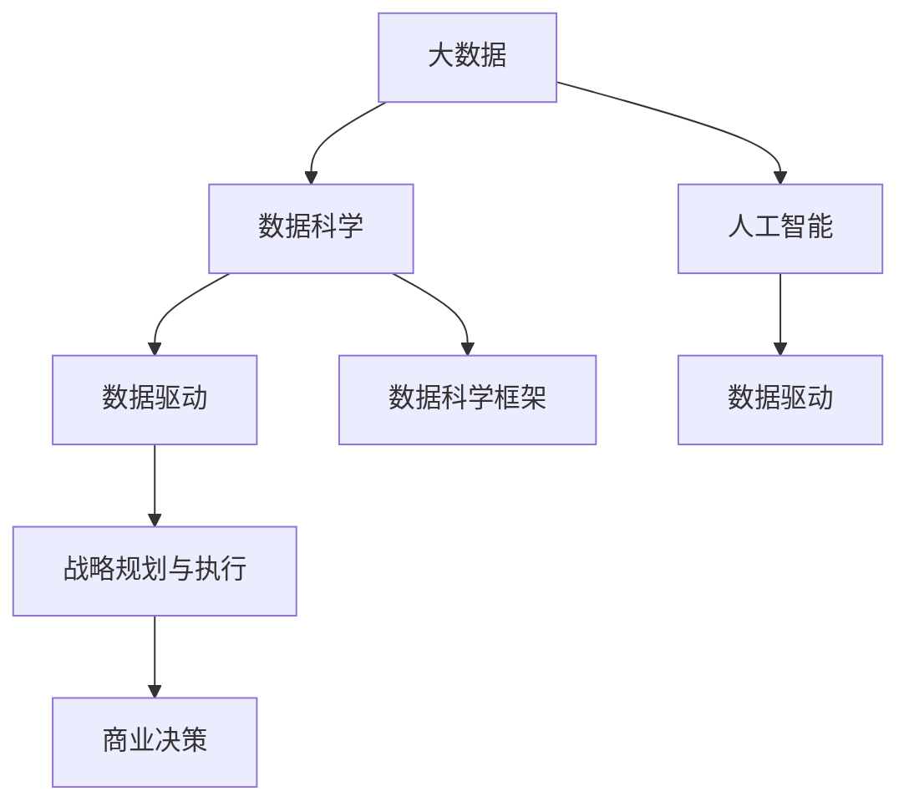

                 

# 大数据创业：洞察未来的商业智慧

> 关键词：大数据, 创业, 商业智慧, 数据科学, 人工智能, 数据驱动, 决策分析, 战略规划

## 1. 背景介绍

### 1.1 问题由来
在21世纪的数字时代，数据已成为一种关键的生产要素和战略资产。在众多领域中，大数据技术正成为变革传统商业模式、创造全新竞争优势的重要驱动力。从零售到金融，从医疗到教育，各行各业正纷纷利用大数据技术，优化决策流程、挖掘商业潜力、创新产品和服务，甚至重新定义其核心业务。

在这样的大背景下，越来越多的创业者选择通过大数据技术来实现创业。他们希望通过数据驱动的方式，发现商业机会、识别用户需求、优化运营效率，实现业务的快速增长和持续创新。但同时，大数据创业也面临着数据获取、数据处理、数据保护等诸多挑战，需要系统地理解和运用大数据技术，以洞察未来的商业智慧。

### 1.2 问题核心关键点
大数据创业的核心在于通过数据驱动的方法，洞察市场趋势、挖掘用户需求、优化运营流程，从而实现业务的创新和发展。关键点包括：

- **数据获取与处理**：如何高效地获取和处理大数据，是大数据创业的基础。
- **数据驱动的决策**：如何利用数据进行有效的商业决策，是大数据创业的核心。
- **数据保护与合规**：如何确保数据的安全与合规，是大数据创业的底线。
- **数据科学与AI的融合**：如何结合数据科学和人工智能技术，提升数据分析和预测的准确性，是大数据创业的技术方向。
- **战略规划与执行**：如何将数据洞察转化为具体的商业战略，并有效地执行，是大数据创业的实践挑战。

这些关键点构成了大数据创业的核心框架，帮助创业者从数据获取、数据处理、数据利用到数据保护的全流程中，形成系统的商业智慧。

## 2. 核心概念与联系

### 2.1 核心概念概述

为了更好地理解大数据创业的框架和思路，本节将介绍几个密切相关的核心概念：

- **大数据(Big Data)**：指在传统数据处理方式下，无法高效处理和分析的数据集合，具有“3V”特点：Volume（大量）、Velocity（高速）、Variety（多样性）。
- **数据科学(Data Science)**：以数据为核心，通过统计分析、机器学习、数据挖掘等方法，发现数据中的模式、趋势和洞见，支持决策和优化。
- **人工智能(AI)**：通过算法和计算，让机器模拟人类智能行为，包括学习、推理、规划等能力。
- **数据驱动(Data-Driven)**：基于数据进行决策和行动，强调数据在业务运营和创新中的核心作用。
- **数据科学框架**：包括数据采集、数据存储、数据处理、数据分析、数据可视化等步骤，形成系统的数据科学流程。
- **战略规划与执行**：结合企业内部资源和外部环境，制定具体的商业战略，并通过执行实现战略目标。

这些核心概念之间的逻辑关系可以通过以下Mermaid流程图来展示：



这个流程图展示了大数据创业的核心概念及其之间的关系：

1. 大数据通过数据科学框架进行收集和处理，提炼出有价值的信息。
2. 数据科学与人工智能结合，提升数据分析和预测的准确性。
3. 数据驱动的方式，支持商业决策和运营优化。
4. 战略规划与执行，将数据洞察转化为具体的商业战略。

这些概念共同构成了大数据创业的逻辑框架，为大数据创业提供了理论基础和实践指南。

## 3. 核心算法原理 & 具体操作步骤
### 3.1 算法原理概述

大数据创业的核心在于通过数据驱动的商业决策，以实现业务的创新和发展。其核心算法原理可以概括为：

1. **数据采集与清洗**：获取原始数据并进行预处理，确保数据的准确性和可用性。
2. **数据分析与建模**：通过统计分析、机器学习等方法，对数据进行分析和建模，发现数据中的模式和趋势。
3. **数据驱动的商业决策**：利用数据洞察，制定和执行商业决策，优化业务运营。
4. **战略规划与执行**：结合数据分析结果，制定具体的商业战略，并通过执行实现战略目标。

### 3.2 算法步骤详解

基于数据驱动的大数据创业，一般包括以下几个关键步骤：

**Step 1: 数据采集与清洗**

1. **确定数据来源**：根据业务需求，确定需要采集的数据源，包括内部系统和外部数据。
2. **数据收集**：通过API、ETL工具等方法，将数据收集到集中存储平台，如Hadoop、Spark等。
3. **数据清洗**：对数据进行去重、纠错、缺失值处理等操作，确保数据的准确性和一致性。

**Step 2: 数据分析与建模**

1. **数据探索**：通过数据可视化工具（如Tableau、PowerBI）对数据进行探索性分析，发现数据中的异常点和模式。
2. **特征工程**：根据业务需求，对数据进行特征提取、选择和转换，形成模型训练所需的数据集。
3. **模型选择与训练**：选择合适的算法（如回归、分类、聚类等），对数据进行建模训练，得到预测模型。
4. **模型评估与优化**：通过交叉验证、ROC曲线、混淆矩阵等方法，评估模型性能，并进行调优。

**Step 3: 数据驱动的商业决策**

1. **数据洞察**：利用数据分析结果，洞察业务中的关键问题和机会。
2. **决策制定**：结合业务目标和数据洞察，制定具体的商业决策。
3. **执行监控**：通过数据监控工具（如KPI指标、仪表盘），跟踪决策执行效果，进行实时调整。

**Step 4: 战略规划与执行**

1. **战略制定**：根据数据洞察和业务需求，制定具体的商业战略。
2. **资源调配**：结合战略需求，调配人力资源、物资资源和技术资源。
3. **战略执行**：通过项目管理工具（如JIRA、Trello），推动战略的执行和落实。

### 3.3 算法优缺点

大数据创业的算法具有以下优点：

- **决策支持**：通过数据驱动的方式，帮助企业制定科学合理的决策，减少主观判断的偏差。
- **效率提升**：通过优化业务流程，实现运营效率的提升，降低成本。
- **市场洞察**：通过数据分析，洞察市场趋势和用户需求，实现精准营销和产品创新。

同时，该算法也存在以下局限性：

- **数据质量依赖**：数据质量和数据处理能力直接影响算法效果，数据获取和处理成本较高。
- **模型复杂度**：选择和训练复杂的模型会增加计算资源的消耗，影响部署速度。
- **隐私和安全问题**：在数据处理和共享过程中，涉及隐私和安全问题，需要严格的合规管理和技术保护。
- **人才需求高**：大数据创业需要具备数据科学、机器学习等专业技能的人才，人才获取和培养成本较高。

尽管存在这些局限性，但大数据创业方法已经成为企业实现数据驱动转型和创新发展的重要手段。

### 3.4 算法应用领域

大数据创业的算法广泛应用于各个行业领域，以下是几个典型应用案例：

- **零售业**：通过分析消费者行为数据，实现精准营销和个性化推荐，提升用户体验和销售转化率。
- **金融业**：利用客户交易数据和信用评分，实现风险评估和信用管理，防范金融风险。
- **医疗健康**：通过分析患者健康数据，实现疾病预测和个性化诊疗，提升医疗服务质量。
- **制造业**：利用设备传感器数据，实现设备预测维护和质量控制，提升生产效率和产品质量。
- **物流行业**：通过分析运输数据和供应链数据，实现路径优化和库存管理，提升物流效率。

除了这些传统行业外，大数据创业在智能制造、智慧城市、精准农业等领域也展现出了广阔的应用前景。

## 4. 数学模型和公式 & 详细讲解 & 举例说明（备注：数学公式请使用latex格式，latex嵌入文中独立段落使用 $$，段落内使用 $)
### 4.1 数学模型构建

为了更好地理解大数据创业的数学模型，本节将介绍几个核心的数学模型和公式：

**线性回归模型**：用于建立自变量和因变量之间的关系，公式如下：

$$ y = \beta_0 + \beta_1 x_1 + \beta_2 x_2 + \ldots + \beta_n x_n + \epsilon $$

其中，$y$ 为因变量，$\beta_i$ 为回归系数，$x_i$ 为自变量，$\epsilon$ 为误差项。

**决策树模型**：用于分类问题，通过树形结构表示决策规则，公式如下：

$$ D_k = \begin{cases}
   \text{左子树} & \text{if } x_k < t_k \\
   \text{右子树} & \text{if } x_k \geq t_k \\
\end{cases} $$

其中，$D_k$ 为决策树，$x_k$ 为特征，$t_k$ 为阈值。

**随机森林模型**：通过多棵决策树的集成，提升分类准确率，公式如下：

$$ F(y|x) = \frac{1}{M} \sum_{i=1}^M f_i(y|x) $$

其中，$F(y|x)$ 为随机森林模型，$M$ 为决策树数量，$f_i(y|x)$ 为第 $i$ 棵决策树的预测结果。

### 4.2 公式推导过程

以下我们以线性回归模型为例，推导其求解公式。

假设数据集为 $D = \{(x_i,y_i)\}_{i=1}^N$，其中 $x_i \in \mathbb{R}^n$ 为自变量，$y_i \in \mathbb{R}$ 为因变量。目标是找到一组系数 $\beta$，使得模型预测值尽可能接近真实值，即最小化损失函数：

$$ \min_{\beta} \sum_{i=1}^N (y_i - f(x_i;\beta))^2 $$

其中 $f(x_i;\beta) = \beta_0 + \beta_1 x_{i1} + \ldots + \beta_n x_{in}$。

通过最小二乘法，可以求解得到系数 $\beta$：

$$ \beta = (X^TX)^{-1}X^Ty $$

其中 $X = [x_{11} \ldots x_{1n}]^T$，$y = [y_1 \ldots y_n]^T$，为特征矩阵和因变量向量。

### 4.3 案例分析与讲解

考虑一个简单的销售数据集，包含每日销售额和促销活动信息，目标是预测未进行促销活动时，每日的销售额。

首先，我们需要收集数据，并进行初步的探索性分析，确定需要哪些特征。例如，可能包括天气、季节、节假日等因素。然后，使用线性回归模型建立预测模型，通过训练集拟合得到回归系数。最后，在测试集上进行验证，评估模型的预测效果。

以下是一个Python代码实现示例：

```python
import pandas as pd
from sklearn.linear_model import LinearRegression
from sklearn.metrics import mean_squared_error

# 数据读取
data = pd.read_csv('sales_data.csv')

# 数据探索
data.info()
data.describe()

# 特征选择
X = data[['weather', 'season', 'holiday']]
y = data['sales']

# 模型训练
model = LinearRegression()
model.fit(X, y)

# 模型评估
y_pred = model.predict(X)
mse = mean_squared_error(y, y_pred)
print('Mean Squared Error:', mse)

# 模型应用
new_data = pd.DataFrame({'weather': ['Sunny'], 'season': ['Spring'], 'holiday': [False]})
pred_sales = model.predict(new_data)
print('Predicted Sales:', pred_sales)
```

通过上述代码，我们可以看到，利用线性回归模型，我们可以基于历史销售数据和促销活动信息，预测未促销时的每日销售额，并评估模型的预测效果。

## 5. 项目实践：代码实例和详细解释说明
### 5.1 开发环境搭建

在进行大数据创业项目实践前，我们需要准备好开发环境。以下是使用Python进行Scikit-learn开发的环境配置流程：

1. 安装Anaconda：从官网下载并安装Anaconda，用于创建独立的Python环境。

2. 创建并激活虚拟环境：
```bash
conda create -n data-env python=3.8 
conda activate data-env
```

3. 安装Scikit-learn：
```bash
conda install scikit-learn
```

4. 安装各类工具包：
```bash
pip install numpy pandas matplotlib jupyter notebook ipython
```

完成上述步骤后，即可在`data-env`环境中开始项目实践。

### 5.2 源代码详细实现

下面我们以销售预测项目为例，给出使用Scikit-learn进行线性回归模型训练的Python代码实现。

首先，定义数据预处理函数：

```python
from sklearn.preprocessing import StandardScaler

def preprocess_data(X, y):
    # 数据标准化
    scaler = StandardScaler()
    X_scaled = scaler.fit_transform(X)
    return X_scaled, y
```

然后，定义训练和评估函数：

```python
from sklearn.model_selection import train_test_split
from sklearn.linear_model import LinearRegression
from sklearn.metrics import mean_squared_error

def train_model(X, y, test_size=0.2, batch_size=64, epochs=100):
    # 数据分割
    X_train, X_test, y_train, y_test = train_test_split(X, y, test_size=test_size, random_state=42)
    # 模型训练
    model = LinearRegression()
    model.fit(X_train, y_train)
    # 模型评估
    y_pred = model.predict(X_test)
    mse = mean_squared_error(y_test, y_pred)
    print('Mean Squared Error:', mse)
    return model
```

接着，启动训练流程并在测试集上评估：

```python
from sklearn.datasets import load_boston

# 数据加载
boston = load_boston()
X, y = boston.data, boston.target

# 数据预处理
X_scaled, y = preprocess_data(X, y)

# 模型训练和评估
model = train_model(X_scaled, y)
```

以上就是使用Scikit-learn进行线性回归模型训练的完整代码实现。可以看到，利用Scikit-learn，我们可以快速实现数据的预处理、模型的训练和评估，高效地完成大数据创业项目。

### 5.3 代码解读与分析

让我们再详细解读一下关键代码的实现细节：

**preprocess_data函数**：
- 利用`StandardScaler`对数据进行标准化处理，确保数据各特征尺度一致。
- 通过`fit_transform`方法拟合和转换数据，将标准化后的数据返回。

**train_model函数**：
- 利用`train_test_split`方法将数据集分割为训练集和测试集，比例为70:30。
- 创建线性回归模型，并使用训练集数据拟合模型。
- 在测试集上预测结果，并计算均方误差，评估模型性能。
- 返回训练好的模型。

**启动训练流程**：
- 加载波士顿房价数据集。
- 对数据进行预处理。
- 调用`train_model`函数，训练线性回归模型。

通过上述代码，我们可以看到，利用Scikit-learn，我们可以快速实现数据的预处理、模型的训练和评估，高效地完成大数据创业项目。

## 6. 实际应用场景
### 6.1 智能制造

大数据创业技术在智能制造领域的应用，可以帮助企业实现设备预测维护和质量控制，提升生产效率和产品质量。

具体而言，通过收集设备传感器数据，实时监控设备运行状态，利用大数据分析技术进行故障预测和维护计划优化，可以实现预测性维护。例如，预测设备故障发生的概率，提前进行维修，减少停机时间和维修成本。同时，利用数据分析技术对产品质量进行在线检测和缺陷分析，及时发现和纠正质量问题，提升产品质量。

### 6.2 智慧城市

大数据创业技术在智慧城市治理中的应用，可以提高城市管理的自动化和智能化水平，构建更安全、高效的未来城市。

具体而言，通过收集城市各类传感器数据（如交通流量、环境监测、能源消耗等），利用大数据分析技术进行城市事件监测和舆情分析，实时感知城市运行状况，实现智能交通、智能环保、智能安防等应用。例如，通过分析交通流量数据，优化交通信号灯配置，减少交通拥堵；通过分析环境监测数据，预警空气质量异常，保护市民健康。

### 6.3 金融风控

大数据创业技术在金融风控领域的应用，可以帮助金融机构识别和防范金融风险，保障资金安全。

具体而言，通过收集客户交易数据、信用评分等，利用大数据分析技术进行风险评估和信用管理，实时监控金融交易风险，识别异常交易行为，防止欺诈和洗钱。例如，通过分析客户交易数据，识别异常交易模式，及时预警潜在的风险事件；通过分析信用评分，评估客户信用风险，制定合理的贷款政策。

## 7. 工具和资源推荐
### 7.1 学习资源推荐

为了帮助开发者系统掌握大数据创业的理论基础和实践技巧，这里推荐一些优质的学习资源：

1. **《Python数据科学手册》**：介绍Python在大数据科学中的应用，包含数据处理、数据可视化、机器学习等技术。
2. **Coursera《机器学习》课程**：斯坦福大学开设的机器学习课程，涵盖数据处理、监督学习、非监督学习等算法。
3. **Kaggle数据科学竞赛平台**：提供大量实际数据集和竞赛项目，帮助开发者练习和验证大数据创业技术。
4. **《深度学习》书籍**：介绍深度学习的基础和应用，包含数据处理、模型训练、模型评估等技术。
5. **KDnuggets网站**：提供大量大数据科学和机器学习的文章、教程和资源，帮助开发者学习先进技术。

通过对这些资源的学习实践，相信你一定能够快速掌握大数据创业的精髓，并用于解决实际的商业问题。

### 7.2 开发工具推荐

高效的开发离不开优秀的工具支持。以下是几款用于大数据创业开发的常用工具：

1. **Jupyter Notebook**：交互式的开发环境，支持Python代码编写和数据可视化，方便开发者进行快速迭代和实验。
2. **PySpark**：基于Python的分布式计算框架，支持大规模数据处理，适合大数据创业项目的分布式计算需求。
3. **Hadoop**：开源的分布式计算平台，支持海量数据处理和存储，适合大数据创业项目的分布式存储需求。
4. **ETL工具**：如Apache NiFi、Talend等，支持数据的采集、清洗和转换，方便大数据创业项目的实施。
5. **数据可视化工具**：如Tableau、PowerBI等，帮助开发者进行数据分析和可视化，发现数据中的洞见。

合理利用这些工具，可以显著提升大数据创业项目的开发效率，加快创新迭代的步伐。

### 7.3 相关论文推荐

大数据创业技术的发展源于学界的持续研究。以下是几篇奠基性的相关论文，推荐阅读：

1. **《Google Scholar: Big Data in Science and Engineering》**：Google发表的关于大数据科学和工程的研究综述。
2. **《Data Mining: Concepts and Techniques》**：介绍数据挖掘技术的经典教材，涵盖大数据分析的基础和应用。
3. **《Big Data: A Revolution That Will Transform How We Live, Work, and Think》**：从技术和社会的角度探讨大数据革命。
4. **《Data-Driven Decision Making: A Simulation-Based Approach》**：介绍数据驱动决策技术的研究进展。
5. **《Big Data and Business Analytics: Managing Big Data for Business Value》**：探讨大数据和业务分析技术的应用和价值。

这些论文代表了大数据创业技术的发展脉络。通过学习这些前沿成果，可以帮助研究者把握学科前进方向，激发更多的创新灵感。

## 8. 总结：未来发展趋势与挑战
### 8.1 总结

本文对大数据创业的理论基础和实践方法进行了全面系统的介绍。首先阐述了大数据创业的背景和意义，明确了数据驱动在业务运营和创新中的核心作用。其次，从原理到实践，详细讲解了大数据创业的算法流程和关键步骤，给出了具体的数据处理、模型训练和决策执行的代码实现。同时，本文还广泛探讨了大数据创业技术在多个行业领域的应用前景，展示了大数据创业的广阔前景。最后，精选了大数据创业的各类学习资源，力求为读者提供全方位的技术指引。

通过本文的系统梳理，可以看到，大数据创业通过数据驱动的方法，帮助企业实现业务创新和发展，成为数字化转型的重要手段。未来，伴随大数据技术的不断进步，大数据创业必将迎来更加广阔的应用场景和发展机会。

### 8.2 未来发展趋势

展望未来，大数据创业技术将呈现以下几个发展趋势：

1. **自动化和大规模化**：大数据创业技术将与人工智能、机器学习等技术进一步融合，实现数据处理和分析的自动化和大规模化，提升数据驱动决策的效率和准确性。
2. **实时化和分布式化**：利用大数据技术，实现数据的实时采集和处理，支持分布式计算平台，提升数据驱动决策的实时性和可靠性。
3. **融合化和协同化**：大数据创业技术将与云计算、物联网、区块链等技术结合，形成综合性的数字生态系统，提升数据的融合能力和协同效果。
4. **数据质量和数据安全**：随着数据驱动决策的广泛应用，数据质量和数据安全问题将越来越受到重视，数据治理和隐私保护技术将进一步发展。
5. **智能化和人性化**：大数据创业技术将与智能技术结合，实现更智能、更人性化的数据驱动决策，提升用户体验和业务满意度。

以上趋势凸显了大数据创业技术的广阔前景。这些方向的探索发展，必将进一步提升大数据创业的效果和价值，为各行各业带来深刻变革。

### 8.3 面临的挑战

尽管大数据创业技术已经取得了显著成果，但在迈向更加智能化、普适化应用的过程中，仍面临诸多挑战：

1. **数据质量和获取**：数据质量和数据获取是大数据创业的基础，但数据质量不高、数据获取困难等问题仍需解决。
2. **数据处理能力**：大数据创业需要强大的数据处理能力，但现有数据处理平台和技术工具仍需优化。
3. **数据安全和隐私**：在数据处理和共享过程中，涉及隐私和安全问题，需要严格的合规管理和技术保护。
4. **人才缺口**：大数据创业需要具备数据科学、机器学习等专业技能的人才，但当前人才供不应求。
5. **成本控制**：大数据创业需要大量的资金投入，如何在控制成本的同时，提升数据驱动决策的效果，仍需努力。

尽管存在这些挑战，但随着技术的不断进步和应用的不断拓展，大数据创业必将在未来取得更大的成功。

### 8.4 研究展望

面对大数据创业所面临的种种挑战，未来的研究需要在以下几个方面寻求新的突破：

1. **数据获取与处理**：探索更高效、更低成本的数据获取和处理技术，如数据湖、数据联邦等。
2. **数据安全与隐私**：研究更加严格、有效的数据安全与隐私保护技术，如差分隐私、联邦学习等。
3. **数据驱动的决策支持**：结合人工智能和机器学习技术，提升数据驱动决策的智能化和自动化程度。
4. **数据可视化与分析**：开发更直观、更交互的数据可视化工具，提升数据驱动决策的可操作性和可解释性。
5. **数据驱动的业务创新**：研究如何将数据洞察转化为具体的业务战略和创新方向，提升数据驱动决策的效果和价值。

这些研究方向的探索，必将引领大数据创业技术迈向更高的台阶，为数字化转型和创新发展提供新的动力。

## 9. 附录：常见问题与解答

**Q1：大数据创业是否适用于所有企业？**

A: 大数据创业技术适用于大多数企业，但具体适用性取决于企业的数据获取能力、数据处理能力以及业务需求。数据驱动决策需要企业在数据采集、数据处理和数据分析等方面具备较强的能力，能够获取并有效利用大数据。

**Q2：如何进行数据驱动的决策？**

A: 数据驱动决策通常包括以下步骤：
1. **数据采集**：通过各种数据源，如传感器、社交媒体、交易记录等，获取所需的数据。
2. **数据清洗和预处理**：对数据进行去重、纠错、缺失值处理等操作，确保数据的准确性和可用性。
3. **数据分析**：利用统计分析、机器学习等方法，对数据进行分析和建模，发现数据中的模式和趋势。
4. **决策制定**：结合数据分析结果，制定具体的商业决策，优化业务运营。
5. **执行监控**：通过数据监控工具，跟踪决策执行效果，进行实时调整。

**Q3：大数据创业需要哪些关键人才？**

A: 大数据创业需要以下关键人才：
1. **数据科学家**：具备数据处理、数据分析、机器学习等技能，能够挖掘数据中的洞见。
2. **数据工程师**：具备数据采集、数据存储、数据处理等技能，能够高效地管理和处理大数据。
3. **业务分析师**：具备业务流程分析和数据驱动决策的能力，能够将数据洞察转化为具体的业务战略。
4. **技术架构师**：具备大数据技术架构设计和系统实施的能力，能够搭建高效的数据处理和分析平台。
5. **项目经理**：具备项目管理、团队协作和风险控制的能力，能够推动大数据创业项目的实施和执行。

**Q4：大数据创业需要哪些关键资源？**

A: 大数据创业需要以下关键资源：
1. **数据源**：获取高质量、高量的数据源，如传感器数据、社交媒体数据、交易记录等。
2. **数据平台**：搭建高效的数据处理和分析平台，如Hadoop、Spark、ETL工具等。
3. **技术工具**：使用Python、R、Scikit-learn、PySpark等技术工具，进行数据处理、分析和建模。
4. **人才资源**：招聘和培养具备数据科学、机器学习等专业技能的人才，形成团队。
5. **资金支持**：获取充足的资金支持，用于数据获取、平台搭建和技术研发。

通过对这些问题的解答，可以帮助企业更好地理解和应用大数据创业技术，实现业务创新和发展。

---

作者：禅与计算机程序设计艺术 / Zen and the Art of Computer Programming

