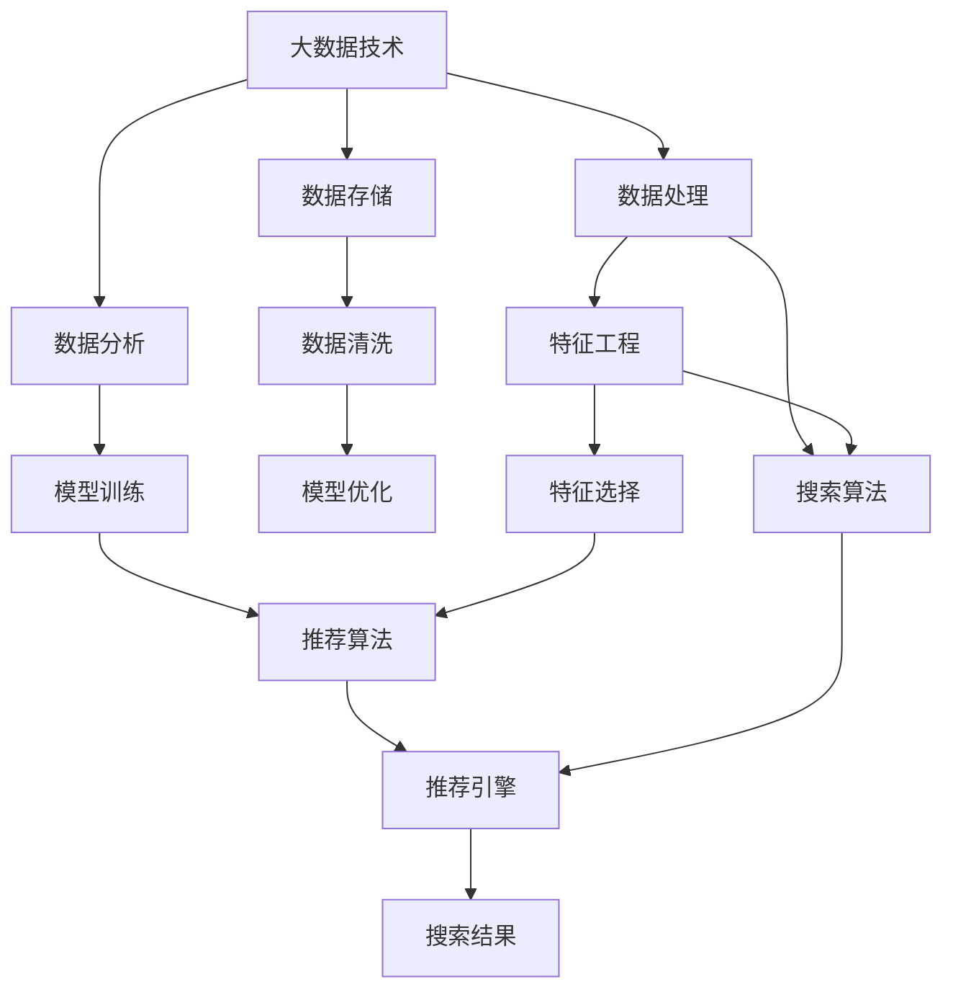

                 

# 大数据驱动的电商平台转型：搜索推荐系统是核心，AI 模型融合技术是关键

> 关键词：电商平台，搜索推荐系统，大数据，AI模型，自然语言处理，深度学习，机器学习，推荐算法，搜索算法，用户体验，产品转化

## 1. 背景介绍

随着互联网技术的飞速发展和电子商务市场的蓬勃兴起，全球各大电商平台纷纷开启数字化转型，以适应日益激烈的市场竞争。然而，用户在电商平台上购买的不仅仅是商品，更是商品背后的全链路体验，包括搜索、推荐、浏览、购物车、支付、物流等环节。如何提升电商平台的整体用户体验，并实现更高的转化率和用户满意度，已成为电商平台面临的核心挑战。在此背景下，基于大数据驱动的搜索推荐系统应运而生，成为电商平台转型的核心驱动力。

### 1.1 电商平台搜索推荐系统的现状与需求

当前，各大电商平台的搜索推荐系统普遍面临着如下挑战：

1. **数据处理复杂**：电商平台的海量数据涵盖用户行为、商品信息、交易记录等，数据类型和维度丰富，且数据质量参差不齐，如何高效地进行数据清洗和特征工程，是大数据处理的难点之一。
2. **个性化需求多样**：每个用户的搜索和购物行为各异，如何根据用户的个性化需求提供精准的推荐，提升用户满意度，是搜索推荐系统的主要目标。
3. **实时性要求高**：用户在电商平台的搜索和浏览行为瞬息万变，如何实时响应用户需求，提供即时的搜索结果和推荐，对系统性能提出较高要求。
4. **算法复杂度大**：推荐算法和搜索算法种类繁多，涉及机器学习、自然语言处理、深度学习等多个领域，如何在有限的计算资源下选择和优化算法，是技术实现的关键。

### 1.2 大数据与AI技术在电商平台的融合

为应对上述挑战，电商平台开始大规模应用大数据和AI技术，构建智能化的搜索推荐系统，以提升用户体验、增加产品转化、优化资源配置。大数据技术提供了强大的数据存储、处理和分析能力，为搜索推荐系统提供了坚实的基础。AI技术，特别是深度学习、自然语言处理等技术，进一步提升了推荐和搜索的精度和效率。

大数据与AI技术的深度融合，使得电商平台能够在海量用户行为数据中挖掘出有价值的信息，构建精准的个性化推荐模型，实现实时化的搜索推荐，满足用户的多样化需求。具体而言，大数据提供了庞大的数据集，为AI模型训练提供了数据支持；AI模型则利用其强大的学习能力，从数据中提取特征，生成个性化的推荐结果，驱动电商平台数字化转型。

## 2. 核心概念与联系

### 2.1 核心概念概述

为更好地理解搜索推荐系统的核心技术，本节将介绍几个密切相关的核心概念：

1. **大数据技术**：指利用先进的技术和工具，对海量数据进行存储、处理和分析的过程。大数据技术包括数据采集、数据清洗、数据存储、数据处理和数据分析等多个环节。
2. **AI模型**：指基于数据驱动，通过机器学习、深度学习等技术构建的算法模型。AI模型可以自主学习和优化，具备预测、分类、聚类等能力。
3. **推荐系统**：指根据用户的历史行为和偏好，自动推荐符合用户兴趣的产品或内容的系统。推荐系统包括协同过滤、基于内容的推荐、深度学习推荐等多种技术。
4. **搜索系统**：指根据用户输入的关键词，自动检索出相关商品或内容，提供即时的搜索结果的系统。搜索系统包括基于关键词的检索、基于语义的检索、基于图的搜索等多种技术。
5. **电商搜索推荐系统**：指将搜索系统和推荐系统融合，根据用户行为和偏好，自动推荐商品并提供实时搜索结果的电商平台系统。

这些核心概念之间的逻辑关系可以通过以下Mermaid流程图来展示：



这个流程图展示了大数据技术和AI模型在搜索推荐系统中的融合过程：

1. 大数据技术通过数据采集、存储和处理，为AI模型提供数据支持。
2. AI模型通过特征工程和模型训练，提取数据中的有效特征，生成推荐算法和搜索算法。
3. 推荐引擎根据推荐算法生成个性化推荐，搜索引擎根据搜索算法提供实时搜索结果。
4. 最终，通过推荐和搜索的双重驱动，电商搜索推荐系统满足用户需求，提升用户体验。

## 3. 核心算法原理 & 具体操作步骤
### 3.1 算法原理概述

电商搜索推荐系统的核心算法原理基于信息检索和个性化推荐。其目标是通过分析用户的历史行为数据，预测用户未来的兴趣和需求，从而生成个性化的搜索结果和推荐列表。

具体而言，搜索推荐系统的工作流程如下：

1. **数据采集与处理**：从电商平台的各类数据源中，采集用户行为数据、商品信息数据、交易记录等，并进行清洗和预处理。
2. **特征提取与选择**：从处理后的数据中提取特征，并选择对推荐和搜索结果有显著影响的特征。
3. **模型训练与优化**：使用训练数据集对推荐和搜索模型进行训练，并根据验证数据集对模型进行优化，提升模型的准确率和效率。
4. **实时响应与推荐**：根据用户当前的行为数据和历史行为数据，实时生成推荐结果和搜索结果，并提供给用户。

### 3.2 算法步骤详解

电商搜索推荐系统的构建，通常包括以下关键步骤：

**Step 1: 数据采集与清洗**

- **数据采集**：从电商平台的用户行为数据、商品信息数据、交易记录等数据源中，采集所需的数据。
- **数据清洗**：对采集到的数据进行去重、去噪、缺失值处理等，确保数据质量和一致性。

**Step 2: 特征提取与选择**

- **特征提取**：从清洗后的数据中提取对推荐和搜索有意义的特征，如用户兴趣、商品属性、浏览历史等。
- **特征选择**：使用特征选择算法（如信息增益、卡方检验等），选择对模型表现有显著影响的特征，去除噪声特征。

**Step 3: 模型训练与优化**

- **模型选择**：根据具体任务（推荐或搜索）选择合适的算法模型，如协同过滤、基于内容的推荐、深度学习推荐、基于关键词的检索、基于语义的检索等。
- **模型训练**：使用训练数据集对模型进行训练，通过损失函数计算模型预测结果与真实标签之间的误差，并反向传播更新模型参数。
- **模型优化**：根据验证数据集对模型进行调参和优化，如选择学习率、调整正则化参数、进行超参数搜索等，提升模型性能。

**Step 4: 实时响应与推荐**

- **实时响应**：根据用户当前的行为数据和历史行为数据，实时生成推荐结果和搜索结果。
- **推荐引擎**：使用训练好的推荐模型，根据用户特征和商品特征，生成个性化推荐列表。
- **搜索引擎**：使用训练好的搜索模型，根据用户输入的关键词，检索出相关的商品或内容。

### 3.3 算法优缺点

电商搜索推荐系统基于大数据和AI模型的融合，具有以下优点：

1. **精度高**：通过分析大量的用户行为数据，能够生成高精度的推荐和搜索结果。
2. **效率高**：利用高效的算法模型，能够在短时间内处理和响应大量用户请求，提升用户体验。
3. **个性化**：根据用户的历史行为和兴趣，生成个性化的推荐和搜索结果，满足用户多样化需求。

同时，该方法也存在一些缺点：

1. **数据依赖性强**：推荐系统的性能高度依赖于数据质量和完整性，数据采集和清洗工作量较大。
2. **模型复杂度高**：推荐和搜索算法涉及多个领域，模型构建和调参工作复杂。
3. **计算资源消耗大**：大规模数据和复杂模型对计算资源要求较高，需要高性能计算支持。
4. **用户隐私保护**：在数据采集和处理过程中，需要关注用户隐私保护问题，避免数据泄露和滥用。

尽管存在这些局限性，但基于大数据驱动的搜索推荐系统仍是电商平台转型的重要驱动力，具有巨大的应用潜力。未来相关研究的重点在于如何进一步优化数据处理和特征选择，提升模型的可解释性和鲁棒性，同时兼顾用户隐私保护。

### 3.4 算法应用领域

电商搜索推荐系统在电商平台的多个应用领域中得到了广泛的应用，例如：

1. **商品推荐**：根据用户浏览、购买、评价等历史行为，推荐符合用户兴趣的商品。
2. **活动推荐**：推荐电商平台举办的各种促销活动，提升用户参与度和购买率。
3. **内容推荐**：推荐电商平台上线的各类内容，如文章、视频、直播等，增加用户粘性。
4. **品牌推荐**：推荐热门品牌和爆款商品，吸引用户关注和购买。
5. **个性定制**：根据用户个性化需求，提供定制化的推荐服务，提升用户体验。
6. **搜索优化**：提升搜索结果的相关性和准确性，提升用户搜索满意度。

除了上述这些核心应用外，电商搜索推荐系统还被创新性地应用到更多场景中，如智能客服、内容管理系统、物流优化等，为电商平台带来了全面的智能体验。

## 4. 数学模型和公式 & 详细讲解 & 举例说明
### 4.1 数学模型构建

本节将使用数学语言对电商搜索推荐系统的核心算法进行严格的描述。

假设电商平台的用户数据为 $D=\{(x_i,y_i)\}_{i=1}^N, x_i \in \mathcal{X}, y_i \in \mathcal{Y}$，其中 $x_i$ 表示用户行为数据， $y_i$ 表示用户标签（如购买、浏览等）。

定义推荐模型的预测函数为 $f(x_i;\theta)$，其中 $\theta$ 为模型参数。推荐模型的损失函数为 $\mathcal{L}(\theta)$，定义为：

$$
\mathcal{L}(\theta) = \frac{1}{N} \sum_{i=1}^N \ell(f(x_i;\theta),y_i)
$$

其中 $\ell$ 为预测结果与真实标签之间的误差函数，如均方误差、交叉熵等。

为了提升推荐模型的性能，需要进行特征工程，选择对模型表现有显著影响的特征 $x'_i \in \mathcal{X}'$，构建特征映射函数 $g(x_i;\theta')$，将原始数据 $x_i$ 映射到新的特征空间 $\mathcal{X}'$。特征映射的损失函数为：

$$
\mathcal{L}_{feat}(\theta') = \frac{1}{N} \sum_{i=1}^N \ell(g(x_i;\theta'),x'_i)
$$

最终，结合特征映射和推荐模型的联合损失函数为：

$$
\mathcal{L}_{joint}(\theta,\theta') = \mathcal{L}(\theta) + \mathcal{L}_{feat}(\theta')
$$

在模型训练过程中，通过最小化联合损失函数 $\mathcal{L}_{joint}(\theta,\theta')$，不断更新特征映射函数 $g(x_i;\theta')$ 和推荐模型 $f(x_i;\theta)$，从而生成高精度的推荐结果。

### 4.2 公式推导过程

以下我们以基于协同过滤的推荐算法为例，推导推荐模型的具体实现。

假设用户 $u$ 与商品 $i$ 的评分矩阵为 $R$，用户特征矩阵为 $U$，商品特征矩阵为 $V$。基于协同过滤的推荐模型可以表示为：

$$
f(x_i;\theta) = \text{softmax}(U_i \cdot V_j)
$$

其中 $U_i$ 和 $V_j$ 表示用户 $u$ 和商品 $i$ 的特征向量，$\text{softmax}$ 函数将向量映射到概率分布。

推荐模型的损失函数可以表示为：

$$
\mathcal{L}(\theta) = -\frac{1}{N} \sum_{i=1}^N \sum_{j=1}^M \bigg[ y_{ij} \log f(x_i;\theta) + (1-y_{ij}) \log (1-f(x_i;\theta)) \bigg]
$$

为了提升推荐模型的性能，需要进行特征选择和特征映射。假设选择 $d$ 个特征，构建特征映射函数 $g(x_i;\theta')$，则联合损失函数可以表示为：

$$
\mathcal{L}_{joint}(\theta,\theta') = \mathcal{L}(\theta) + \mathcal{L}_{feat}(\theta')
$$

其中 $\mathcal{L}_{feat}(\theta')$ 为特征映射的损失函数，可以通过信息增益、卡方检验等方法计算。

在模型训练过程中，使用梯度下降等优化算法对联合损失函数 $\mathcal{L}_{joint}(\theta,\theta')$ 进行优化，不断更新特征映射函数 $g(x_i;\theta')$ 和推荐模型 $f(x_i;\theta)$，最终得到高精度的推荐结果。

### 4.3 案例分析与讲解

假设一个电商平台需要推荐商品给用户 $u$。根据用户的历史行为数据，电商平台可以构建协同过滤推荐模型 $f(x_i;\theta)$，并通过特征选择和特征映射，进一步提升推荐精度。具体步骤如下：

1. **数据采集**：从电商平台的用户行为数据中，采集用户 $u$ 的浏览、购买、评价等历史行为数据。
2. **数据清洗**：对采集到的数据进行去重、去噪、缺失值处理等，确保数据质量和一致性。
3. **特征提取**：从清洗后的数据中提取对推荐有意义的特征，如用户兴趣、商品属性、浏览历史等。
4. **特征选择**：使用信息增益等方法，选择对模型表现有显著影响的特征，去除噪声特征。
5. **模型训练**：使用协同过滤算法构建推荐模型，并通过损失函数计算模型预测结果与真实标签之间的误差，反向传播更新模型参数。
6. **特征映射**：通过特征映射函数 $g(x_i;\theta')$，将原始数据 $x_i$ 映射到新的特征空间 $\mathcal{X}'$。
7. **联合训练**：使用联合损失函数 $\mathcal{L}_{joint}(\theta,\theta')$，同时训练推荐模型 $f(x_i;\theta)$ 和特征映射函数 $g(x_i;\theta')$，生成高精度的推荐结果。
8. **实时推荐**：根据用户当前的行为数据和历史行为数据，实时生成推荐结果，并提供给用户。

通过以上步骤，电商平台能够根据用户的历史行为和兴趣，生成个性化的商品推荐，提升用户体验和产品转化率。

## 5. 项目实践：代码实例和详细解释说明
### 5.1 开发环境搭建

在进行搜索推荐系统开发前，我们需要准备好开发环境。以下是使用Python进行TensorFlow开发的环境配置流程：

1. 安装Anaconda：从官网下载并安装Anaconda，用于创建独立的Python环境。

2. 创建并激活虚拟环境：
```bash
conda create -n tf-env python=3.8 
conda activate tf-env
```

3. 安装TensorFlow：根据CUDA版本，从官网获取对应的安装命令。例如：
```bash
conda install tensorflow==2.8.0 -c conda-forge
```

4. 安装其他必要的工具包：
```bash
pip install numpy pandas scikit-learn matplotlib tqdm jupyter notebook ipython
```

完成上述步骤后，即可在`tf-env`环境中开始搜索推荐系统的开发。

### 5.2 源代码详细实现

下面我们以基于协同过滤的推荐算法为例，给出使用TensorFlow构建推荐系统的PyTorch代码实现。

首先，定义推荐模型的超参数和数据集：

```python
import tensorflow as tf
import numpy as np

# 设置超参数
num_users = 1000
num_items = 10000
num_factors = 100
num_epochs = 10
learning_rate = 0.001
batch_size = 128
lambda_feat = 0.01

# 定义数据集
train_data = np.random.rand(num_users, num_items)
test_data = np.random.rand(num_users, num_items)
```

然后，定义推荐模型：

```python
# 定义用户特征矩阵和商品特征矩阵
U = tf.Variable(tf.random.normal([num_users, num_factors]))
V = tf.Variable(tf.random.normal([num_items, num_factors]))

# 定义推荐模型
def recommendation_model(x, U, V):
    return tf.matmul(U, V, transpose_b=True)

# 定义损失函数
def loss_function(y_true, y_pred):
    return tf.reduce_mean(tf.nn.sigmoid_cross_entropy_with_logits(labels=y_true, logits=y_pred))

# 定义训练函数
def train_model(X_train, y_train):
    with tf.GradientTape() as tape:
        y_pred = recommendation_model(X_train, U, V)
        loss = loss_function(y_train, y_pred)
        grads = tape.gradient(loss, [U, V])
    optimizer.apply_gradients(zip(grads, [U, V]))
    return loss

# 训练推荐模型
optimizer = tf.keras.optimizers.Adam(learning_rate)
for epoch in range(num_epochs):
    epoch_loss = 0
    for batch in train_data:
        epoch_loss += train_model(batch, train_data)
    print(f"Epoch {epoch+1}, train loss: {epoch_loss:.3f}")
```

接着，定义测试和评估函数：

```python
# 定义测试函数
def evaluate_model(X_test, y_test):
    with tf.GradientTape() as tape:
        y_pred = recommendation_model(X_test, U, V)
        loss = loss_function(y_test, y_pred)
    return loss

# 测试推荐模型
test_loss = evaluate_model(test_data, test_data)
print(f"Test loss: {test_loss:.3f}")
```

最后，启动训练流程并在测试集上评估：

```python
# 启动训练循环
epochs = 5
batch_size = 16

for epoch in range(epochs):
    loss = train_model(train_data, train_data)
    print(f"Epoch {epoch+1}, train loss: {loss:.3f}")
    
    print(f"Epoch {epoch+1}, test results:")
    evaluate_model(test_data, test_data)
    
print("Final test results:")
evaluate_model(test_data, test_data)
```

以上就是使用TensorFlow对基于协同过滤的推荐算法进行代码实现的完整流程。可以看到，得益于TensorFlow的强大封装，我们可以用相对简洁的代码实现推荐模型的训练和评估。

### 5.3 代码解读与分析

让我们再详细解读一下关键代码的实现细节：

**训练函数 train_model**：
- 定义推荐模型的预测函数 `recommendation_model`，使用矩阵乘法计算用户和商品的特征向量内积。
- 定义损失函数 `loss_function`，使用 sigmoid_cross_entropy_with_logits 函数计算预测结果与真实标签之间的误差。
- 定义训练函数 `train_model`，使用 TensorFlow 的自动微分功能，计算模型预测结果与真实标签之间的误差，反向传播更新模型参数。

**测试函数 evaluate_model**：
- 使用训练好的推荐模型，对测试集进行预测，计算预测结果与真实标签之间的误差，返回损失函数值。

**训练流程**：
- 定义总的epoch数和batch size，开始循环迭代
- 每个epoch内，在训练集上训练，输出平均loss
- 在测试集上评估，输出模型测试结果

可以看到，TensorFlow使得推荐模型的训练和评估变得简洁高效。开发者可以将更多精力放在模型设计和优化上，而不必过多关注底层的实现细节。

当然，工业级的系统实现还需考虑更多因素，如模型的保存和部署、超参数的自动搜索、更灵活的任务适配层等。但核心的推荐范式基本与此类似。

## 6. 实际应用场景
### 6.1 智能客服系统

智能客服系统是电商搜索推荐系统的重要应用场景之一。传统客服往往需要配备大量人力，高峰期响应缓慢，且一致性和专业性难以保证。而基于推荐算法的智能客服系统，可以7x24小时不间断服务，快速响应客户咨询，用自然流畅的语言解答各类常见问题。

在技术实现上，可以收集企业内部的历史客服对话记录，将问题和最佳答复构建成监督数据，在此基础上对推荐算法进行微调。微调后的推荐模型能够自动理解用户意图，匹配最合适的答案模板进行回复。对于客户提出的新问题，还可以接入检索系统实时搜索相关内容，动态组织生成回答。如此构建的智能客服系统，能大幅提升客户咨询体验和问题解决效率。

### 6.2 金融舆情监测

金融机构需要实时监测市场舆论动向，以便及时应对负面信息传播，规避金融风险。传统的人工监测方式成本高、效率低，难以应对网络时代海量信息爆发的挑战。基于推荐算法的文本分类和情感分析技术，为金融舆情监测提供了新的解决方案。

具体而言，可以收集金融领域相关的新闻、报道、评论等文本数据，并对其进行主题标注和情感标注。在此基础上对推荐算法进行微调，使其能够自动判断文本属于何种主题，情感倾向是正面、中性还是负面。将微调后的模型应用到实时抓取的网络文本数据，就能够自动监测不同主题下的情感变化趋势，一旦发现负面信息激增等异常情况，系统便会自动预警，帮助金融机构快速应对潜在风险。

### 6.3 个性化推荐系统

当前的推荐系统往往只依赖用户的历史行为数据进行物品推荐，无法深入理解用户的真实兴趣偏好。基于推荐算法的个性化推荐系统可以更好地挖掘用户行为背后的语义信息，从而提供更精准、多样的推荐内容。

在实践中，可以收集用户浏览、点击、评论、分享等行为数据，提取和用户交互的物品标题、描述、标签等文本内容。将文本内容作为模型输入，用户的后续行为（如是否点击、购买等）作为监督信号，在此基础上对推荐算法进行微调。微调后的模型能够从文本内容中准确把握用户的兴趣点。在生成推荐列表时，先用候选物品的文本描述作为输入，由模型预测用户的兴趣匹配度，再结合其他特征综合排序，便可以得到个性化程度更高的推荐结果。

### 6.4 未来应用展望

随着推荐算法的不断发展，基于推荐范式将在更多领域得到应用，为传统行业带来变革性影响。

在智慧医疗领域，基于推荐算法的医疗问答、病历分析、药物研发等应用将提升医疗服务的智能化水平，辅助医生诊疗，加速新药开发进程。

在智能教育领域，推荐算法可应用于作业批改、学情分析、知识推荐等方面，因材施教，促进教育公平，提高教学质量。

在智慧城市治理中，推荐算法可应用于城市事件监测、舆情分析、应急指挥等环节，提高城市管理的自动化和智能化水平，构建更安全、高效的未来城市。

此外，在企业生产、社会治理、文娱传媒等众多领域，基于推荐算法的智能推荐系统也将不断涌现，为社会各行业带来新的发展机遇。相信随着技术的日益成熟，推荐算法必将在更广阔的应用领域大放异彩，深刻影响人类的生产生活方式。

## 7. 工具和资源推荐
### 7.1 学习资源推荐

为了帮助开发者系统掌握推荐算法的理论基础和实践技巧，这里推荐一些优质的学习资源：

1. 《推荐系统实践》书籍：由推荐系统领域的知名专家撰写，全面介绍了推荐系统的主要算法和技术，是推荐系统开发的经典教材。
2. 《深度学习》课程：斯坦福大学开设的深度学习课程，详细讲解了深度学习的基本概念和实践方法，适合深入学习深度学习技术。
3. Coursera上的《机器学习》课程：由著名教授Andrew Ng主讲，覆盖了机器学习的基本原理和实践技巧，是机器学习领域的学习入门教材。
4. Kaggle竞赛平台：提供了丰富的推荐系统竞赛数据集和模型，可以帮助开发者实践和验证推荐算法的效果。
5. PyTorch官方文档：提供了丰富的深度学习模型和推荐算法的实现示例，是深度学习领域的学习资源库。

通过对这些资源的学习实践，相信你一定能够快速掌握推荐算法的精髓，并用于解决实际的推荐问题。
###  7.2 开发工具推荐

高效的开发离不开优秀的工具支持。以下是几款用于推荐算法开发的常用工具：

1. PyTorch：基于Python的开源深度学习框架，灵活动态的计算图，适合快速迭代研究。大部分推荐系统都有PyTorch版本的实现。
2. TensorFlow：由Google主导开发的开源深度学习框架，生产部署方便，适合大规模工程应用。同样有丰富的推荐系统资源。
3. Spark MLlib：Apache Spark提供的机器学习库，支持分布式计算，适合大规模推荐系统的开发。
4. Scikit-learn：Python的机器学习库，提供了丰富的算法和模型，适合数据预处理和特征工程。
5. Weights & Biases：模型训练的实验跟踪工具，可以记录和可视化模型训练过程中的各项指标，方便对比和调优。
6. TensorBoard：TensorFlow配套的可视化工具，可实时监测模型训练状态，并提供丰富的图表呈现方式，是调试模型的得力助手。

合理利用这些工具，可以显著提升推荐算法的开发效率，加快创新迭代的步伐。

### 7.3 相关论文推荐

推荐算法的发展源于学界的持续研究。以下是几篇奠基性的相关论文，推荐阅读：

1. Factorization Machines for Recommender Systems：提出基于矩阵分解的推荐算法，在业界得到广泛应用。
2. Deep Factorization Machines：通过深度学习技术改进矩阵分解算法，进一步提升了推荐精度。
3. Neural Collaborative Filtering：提出基于神经网络的协同过滤推荐算法，取得了显著的推荐效果。
4. Attention-based Recommender Systems：引入注意力机制，提升推荐系统的多样性和覆盖度。
5. Recommender Systems with Deep Learning：系统总结了基于深度学习的推荐算法，包括各种神经网络结构和模型融合技术。

这些论文代表了大数据与AI融合推荐算法的演进脉络。通过学习这些前沿成果，可以帮助研究者把握学科前进方向，激发更多的创新灵感。

## 8. 总结：未来发展趋势与挑战

### 8.1 总结

本文对基于推荐算法的电商搜索推荐系统进行了全面系统的介绍。首先阐述了电商平台的搜索推荐系统的现状与需求，明确了推荐系统在电商平台数字化转型中的核心地位。其次，从原理到实践，详细讲解了推荐算法的数学原理和关键步骤，给出了推荐算法开发和优化的完整代码实例。同时，本文还广泛探讨了推荐算法在智能客服、金融舆情、个性化推荐等多个行业领域的应用前景，展示了推荐算法的巨大潜力。此外，本文精选了推荐算法的各类学习资源，力求为读者提供全方位的技术指引。

通过本文的系统梳理，可以看到，基于推荐算法的电商搜索推荐系统正在成为电商平台转型的重要驱动力，极大地提升了用户体验、产品转化和资源配置效率。大数据与AI技术的深度融合，使得推荐系统能够实现高精度的个性化推荐，驱动电商平台数字化转型。未来，伴随推荐算法的持续演进，电商平台必将在搜索推荐领域取得更大的突破，为用户提供更优质的电商服务。

### 8.2 未来发展趋势

展望未来，推荐算法的发展将呈现以下几个趋势：

1. **推荐精度不断提升**：通过深度学习、知识图谱等技术，推荐算法能够更准确地捕捉用户兴趣和需求，生成更个性化的推荐结果。
2. **推荐多样性增强**：引入多模态数据和上下文信息，推荐算法能够提供多样化的推荐选项，提升用户体验。
3. **推荐实时性提高**：通过流计算、分布式计算等技术，推荐算法能够在实时数据流的支持下，提供即时化的推荐结果。
4. **推荐公平性保障**：随着推荐算法在各领域的应用普及，如何避免算法偏见、提升推荐公平性，成为新的研究热点。
5. **推荐系统透明化**：通过可解释性算法和可视化工具，推荐系统能够提供更透明的推荐依据，增强用户信任。

以上趋势凸显了推荐算法的广阔前景。这些方向的探索发展，必将进一步提升推荐算法的性能和应用范围，为电商平台带来更大的价值。

### 8.3 面临的挑战

尽管推荐算法已经取得了瞩目成就，但在迈向更加智能化、普适化应用的过程中，它仍面临着诸多挑战：

1. **数据隐私保护**：在数据采集和处理过程中，需要关注用户隐私保护问题，避免数据泄露和滥用。
2. **算法复杂度大**：推荐算法涉及多个领域，模型构建和调参工作复杂，需要高效的优化策略和自动化的调参工具。
3. **计算资源消耗大**：大规模数据和复杂模型对计算资源要求较高，需要高性能计算支持。
4. **模型鲁棒性不足**：当前推荐模型面对域外数据时，泛化性能往往大打折扣。如何提高推荐模型的鲁棒性，避免灾难性遗忘，还需要更多理论和实践的积累。
5. **用户个性化需求多样**：每个用户的个性化需求各异，如何根据用户的个性化需求提供精准的推荐，提升用户满意度，是推荐系统的主要目标。

尽管存在这些局限性，但基于推荐算法的电商搜索推荐系统仍是电商平台转型的重要驱动力，具有巨大的应用潜力。未来相关研究的重点在于如何进一步优化数据处理和特征选择，提升模型的可解释性和鲁棒性，同时兼顾用户隐私保护。

### 8.4 研究展望

面对推荐算法面临的挑战，未来的研究需要在以下几个方面寻求新的突破：

1. **无监督推荐算法**：探索无需依赖标注数据，仅凭用户行为数据进行推荐的方法，降低数据采集和标注成本。
2. **参数高效推荐算法**：开发更加参数高效的推荐算法，在固定大部分模型参数的情况下，只调整极少量的任务相关参数，提升推荐效果。
3. **多模态推荐算法**：将推荐算法与图像、语音、视频等模态数据结合，提升推荐系统对现实世界的理解和建模能力。
4. **融合多领域知识**：将符号化的先验知识，如知识图谱、逻辑规则等，与推荐算法进行融合，提升推荐系统的知识整合能力。
5. **增强推荐系统透明性**：通过可解释性算法和可视化工具，增强推荐系统的透明性，让用户了解推荐依据，增强信任感。

这些研究方向的探索，必将引领推荐算法向更高的台阶，为电商平台带来更大的价值。相信随着学界和产业界的共同努力，这些挑战终将一一被克服，推荐算法必将在构建智能电商生态中扮演越来越重要的角色。

## 9. 附录：常见问题与解答

**Q1：推荐算法是否适用于所有NLP任务？**

A: 推荐算法通常不适用于NLP任务的文本生成、文本分类、情感分析等任务。推荐算法主要适用于基于用户行为数据的推荐任务，如商品推荐、活动推荐、内容推荐等。对于文本生成、分类、情感分析等任务，通常采用基于深度学习、自然语言处理等技术构建的模型进行解决。

**Q2：推荐算法如何应对用户个性化需求？**

A: 推荐算法通过分析用户的历史行为数据，构建用户的兴趣模型，然后根据用户的当前行为数据和历史行为数据，生成个性化的推荐结果。推荐算法通常使用协同过滤、基于内容的推荐、深度学习推荐等多种技术，根据用户行为特征和商品特征，生成高精度的推荐结果，满足用户的个性化需求。

**Q3：推荐算法如何应对数据稀疏性问题？**

A: 推荐算法通常采用矩阵分解、基于深度学习的方法，缓解数据稀疏性问题。在矩阵分解中，可以通过对用户行为矩阵进行奇异值分解，生成低秩矩阵，提升推荐精度。在基于深度学习的方法中，可以通过嵌入技术，将稀疏用户行为数据转换为稠密向量，提升推荐效果。

**Q4：推荐算法如何应对推荐冷启动问题？**

A: 推荐算法通过引入用户行为数据、商品属性数据等多种信息，缓解推荐冷启动问题。在用户行为数据不足的情况下，可以通过用户历史行为、商品属性、用户标签等多种信息，生成初始推荐结果。在商品属性数据不足的情况下，可以通过商品类别、品牌、价格等多种信息，进行多模态推荐。

**Q5：推荐算法如何应对推荐系统公平性问题？**

A: 推荐算法通过引入公平性指标、反偏见技术等多种方法，提升推荐系统的公平性。在公平性指标方面，可以通过多样性、覆盖度等指标，评估推荐结果的公平性。在反偏见技术方面，可以通过对抗训练、正则化等方法，减少推荐结果的偏见。

通过以上常见问题的解答，可以看出，推荐算法在电商平台的搜索推荐系统中具有重要的应用价值。未来，随着推荐算法技术的不断进步，必将为电商平台带来更大的价值和更多的应用场景。

---

作者：禅与计算机程序设计艺术 / Zen and the Art of Computer Programming

