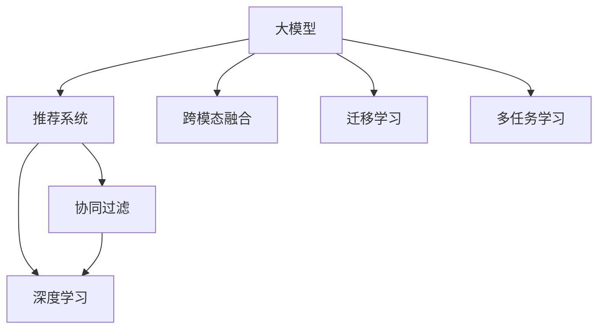

                 

# 大模型与推荐系统的融合: 微软的实践

## 1. 背景介绍

### 1.1 问题由来
近年来，大模型在人工智能领域取得了举世瞩目的进展。诸如GPT-3、BERT等模型，凭借其强大的语言理解能力，在自然语言处理(NLP)、计算机视觉(CV)、语音识别(SR)等诸多领域展现出了惊人的表现。

与此同时，推荐系统作为互联网应用的标配，也在不断地进化。无论是电商平台的商品推荐，还是内容平台的个性化内容推荐，推荐系统通过精准的用户画像和上下文理解，使得用户体验大幅提升。

然而，传统的推荐系统往往基于协同过滤、深度学习等方法，对用户历史行为数据和用户画像的依赖较强。在面对大规模、高维度的用户画像数据时，推荐系统可能面临计算资源不足、数据隐私保护等挑战。大模型技术的出现，为推荐系统提供了新的解决方案。

### 1.2 问题核心关键点
大模型与推荐系统的融合，使得推荐系统能够利用大模型的通用语言表示能力，进行更高效、更智能的推荐。具体来说，该融合方式的核心关键点包括：

- 利用大模型的泛化能力，引入更丰富的外部信息，增强推荐系统对用户画像和上下文的理解。
- 通过大模型的可解释性，提升推荐系统的透明度和可信度。
- 使用大模型的迁移学习能力，实现多领域和多场景下的推荐应用。
- 借助大模型的多模态融合能力，提升推荐系统的跨模态处理能力。

这些关键点使得大模型与推荐系统的融合具备了显著的优势，能够为推荐系统带来革命性的改进。

## 2. 核心概念与联系

### 2.1 核心概念概述

为更好地理解大模型与推荐系统融合的原理，本节将介绍几个密切相关的核心概念：

- 大模型(Large Model)：以Transformer、BERT等架构为基础的大规模预训练模型。这类模型通过在大规模无标签数据上进行预训练，学习到了丰富的语言和视觉表示。

- 推荐系统(Recommendation System)：通过分析用户历史行为、用户画像、物品属性等数据，为用户推荐最相关的商品或内容，提升用户体验的系统。

- 跨模态融合(Cross-modal Fusion)：将文本、图像、音频等多种模态的数据进行融合，利用多模态信息提升推荐的精准度和丰富度。

- 迁移学习(Transfer Learning)：通过在预训练模型上添加新的任务特定的层，或者通过微调预训练模型参数，实现知识迁移，从而在新的任务上取得良好效果。

- 多任务学习(Multi-task Learning)：在多任务上进行联合训练，共享中间层的表示，提高模型的泛化能力。

这些概念之间的逻辑关系可以通过以下Mermaid流程图来展示：



这个流程图展示了核心概念之间的联系和互动：

1. 大模型通过预训练学习到丰富的语言和视觉表示，可以作为推荐系统的一个重要基础。
2. 推荐系统包括协同过滤和深度学习两种基本方式，前者依赖用户行为数据，后者利用机器学习进行推荐。
3. 跨模态融合增强了推荐系统对不同模态信息的理解，如将文本和图像信息结合进行推荐。
4. 迁移学习和多任务学习进一步拓展了推荐系统的应用范围，使其具备更强的泛化能力和适应性。

## 3. 核心算法原理 & 具体操作步骤
### 3.1 算法原理概述

大模型与推荐系统的融合，本质上是利用大模型的泛化能力和迁移学习特性，对推荐系统进行增强。具体来说，融合过程大致可以分为以下几个步骤：

1. 在大规模无标签数据上进行预训练，学习通用的语言和视觉表示。
2. 根据具体的推荐任务，添加任务特定的层，或者对预训练模型进行微调。
3. 利用多任务学习，将多个推荐任务进行联合训练，提高模型的泛化能力。
4. 通过跨模态融合，将不同模态的信息进行整合，提升推荐系统的全面性。
5. 在推荐系统实际运行中，不断对模型进行更新和优化，保持推荐效果的时效性和准确性。

### 3.2 算法步骤详解

基于大模型与推荐系统的融合，推荐系统的工作流程大致如下：

1. **数据准备**：收集用户行为数据、物品属性数据、文本描述数据等，准备推荐系统所需的数据。

2. **数据预处理**：对数据进行清洗、归一化、编码等预处理工作，保证数据的质量和一致性。

3. **大模型预训练**：在大规模无标签数据上，使用Transformer等架构进行预训练，学习到通用的语言和视觉表示。

4. **任务适配层设计**：根据推荐任务的特点，设计任务适配层。例如，对于文本推荐任务，可以使用BERT等模型作为基础，在顶部添加分类器或匹配器。

5. **任务微调**：在预训练大模型的基础上，使用推荐数据集进行微调，优化模型在特定推荐任务上的表现。

6. **多任务联合训练**：将多个推荐任务联合训练，共享中间层的表示，提高模型的泛化能力。

7. **跨模态融合**：将文本、图像、音频等不同模态的信息进行融合，提升推荐系统的全面性和精准度。

8. **实时更新**：在推荐系统实际运行中，不断对模型进行更新和优化，保持推荐效果的时效性和准确性。

### 3.3 算法优缺点

大模型与推荐系统的融合具有以下优点：

- **泛化能力强**：大模型预训练得到的语言和视觉表示，可以用于多个推荐任务，提高模型的泛化能力。
- **多模态融合**：通过跨模态融合，利用多种信息源提升推荐的全面性和准确性。
- **可解释性强**：大模型的输出往往具有可解释性，有助于理解推荐系统的决策过程。
- **计算效率高**：大模型可以利用其参数共享和优化策略，提升推荐系统的计算效率。

同时，该融合方式也存在一些局限性：

- **模型复杂度高**：大模型的参数量通常较大，训练和推理成本较高。
- **数据隐私问题**：融合大模型可能需要对用户数据进行重新编码和处理，可能带来隐私风险。
- **模型鲁棒性**：大模型的泛化能力虽然强，但在特定领域或场景下，可能仍存在鲁棒性不足的问题。

尽管存在这些局限性，大模型与推荐系统的融合仍具有广阔的前景，特别是在面对大规模、高维度数据和复杂推荐任务时，其优势更加凸显。

### 3.4 算法应用领域

大模型与推荐系统的融合在多个领域都得到了广泛应用，例如：

- 电商推荐：通过融合大模型和推荐系统，电商平台能够实现个性化推荐，提升用户体验和转化率。
- 内容推荐：视频、音乐、文章等内容的推荐，可以利用大模型的泛化能力，增强推荐的精准度。
- 广告投放：通过大模型进行用户画像和行为预测，优化广告投放策略，提升广告效果。
- 智能客服：利用大模型进行自然语言理解和生成，提供智能客服服务，提升客户满意度。
- 产品推荐：利用大模型进行多模态融合，提升产品推荐的全面性和丰富度。

这些应用场景展示了大模型与推荐系统融合的强大潜力，为推荐系统提供了新的解决方案和优化方向。

## 4. 数学模型和公式 & 详细讲解 & 举例说明

### 4.1 数学模型构建

基于大模型与推荐系统的融合，推荐系统可以形式化地表示为：

$$
R = M \times T \times W \times F \times M_{soft}
$$

其中，$R$ 表示推荐结果，$M$ 表示大模型预训练得到的表示，$T$ 表示任务适配层，$W$ 表示权重矩阵，$F$ 表示跨模态融合，$M_{soft}$ 表示多任务联合训练。

假设 $M_{\theta}$ 为预训练大模型，$T$ 为任务适配层，$W$ 为权重矩阵，$F$ 为跨模态融合函数，$M_{soft}$ 为多任务联合训练模块。则推荐系统的数学模型可以进一步表示为：

$$
R = M_{\theta}(x) \times T(x) \times W \times F(x) \times M_{soft}(x)
$$

其中，$x$ 表示用户行为数据、物品属性数据、文本描述数据等输入。

### 4.2 公式推导过程

以文本推荐为例，利用BERT模型作为基础，推导推荐系统的数学模型。假设用户行为数据为 $x$，物品属性数据为 $y$，文本描述数据为 $z$。

1. **大模型预训练**：使用BERT模型在大规模无标签文本数据上预训练，得到表示 $M_{\theta}(x)$。

2. **任务适配层设计**：根据推荐任务，设计任务适配层 $T$。例如，对于基于文本的推荐，$T$ 可以表示为：

$$
T(x) = [x] \times W \times [y] \times [z]
$$

其中，$W$ 为权重矩阵，$[y]$ 和 $[z]$ 分别为物品属性和文本描述的嵌入表示。

3. **任务微调**：在预训练模型基础上，使用推荐数据集进行微调，得到优化后的表示 $M_{\theta}^{*}(x)$。

4. **多任务联合训练**：将多个推荐任务联合训练，共享中间层的表示，得到联合训练后的表示 $M_{soft}(x)$。

5. **跨模态融合**：将文本、物品属性、用户行为等多种信息进行融合，得到最终的推荐结果 $R$。

### 4.3 案例分析与讲解

以微软的TextRank推荐系统为例，详细讲解大模型与推荐系统的融合过程。

1. **数据准备**：收集用户浏览记录、物品描述、用户画像等数据，准备推荐系统所需的数据。

2. **大模型预训练**：在大规模无标签文本数据上，使用BERT模型进行预训练，学习到通用的语言表示。

3. **任务适配层设计**：在BERT模型的基础上，添加任务适配层。例如，对于文本推荐任务，可以添加分类器或匹配器。

4. **任务微调**：在预训练模型基础上，使用推荐数据集进行微调，优化模型在特定推荐任务上的表现。

5. **多任务联合训练**：将多个推荐任务联合训练，共享中间层的表示，提高模型的泛化能力。

6. **跨模态融合**：将文本、物品属性、用户行为等多种信息进行融合，提升推荐的全面性和精准度。

7. **实时更新**：在推荐系统实际运行中，不断对模型进行更新和优化，保持推荐效果的时效性和准确性。

## 5. 项目实践：代码实例和详细解释说明

### 5.1 开发环境搭建

在进行大模型与推荐系统融合的实践前，我们需要准备好开发环境。以下是使用Python进行TensorFlow开发的环境配置流程：

1. 安装Anaconda：从官网下载并安装Anaconda，用于创建独立的Python环境。

2. 创建并激活虚拟环境：
```bash
conda create -n tf-env python=3.8 
conda activate tf-env
```

3. 安装TensorFlow：根据CUDA版本，从官网获取对应的安装命令。例如：
```bash
pip install tensorflow-gpu==2.5
```

4. 安装必要的工具包：
```bash
pip install numpy pandas scikit-learn tensorflow-datasets tqdm jupyter notebook ipython
```

完成上述步骤后，即可在`tf-env`环境中开始项目实践。

### 5.2 源代码详细实现

下面以文本推荐为例，给出使用TensorFlow进行BERT微调的完整代码实现。

首先，定义推荐系统所需的数据处理函数：

```python
import tensorflow as tf
from tensorflow.keras import layers

def load_data():
    # 加载数据集
    train_data = load_train_data()
    test_data = load_test_data()
    return train_data, test_data
```

然后，定义模型和优化器：

```python
from transformers import BertTokenizer
from transformers import TFAutoModelForSequenceClassification

tokenizer = BertTokenizer.from_pretrained('bert-base-cased')
model = TFAutoModelForSequenceClassification.from_pretrained('bert-base-cased', num_labels=5)
optimizer = tf.keras.optimizers.Adam(learning_rate=1e-5)
```

接着，定义训练和评估函数：

```python
@tf.function
def train_step(inputs, labels):
    with tf.GradientTape() as tape:
        predictions = model(inputs, training=True)
        loss = tf.keras.losses.sparse_categorical_crossentropy(labels, predictions)
    gradients = tape.gradient(loss, model.trainable_variables)
    optimizer.apply_gradients(zip(gradients, model.trainable_variables))
    return loss

@tf.function
def evaluate_step(inputs, labels):
    predictions = model(inputs, training=False)
    return tf.keras.metrics.sparse_categorical_accuracy(labels, predictions)
```

最后，启动训练流程并在测试集上评估：

```python
train_data, test_data = load_data()
train_dataset = tf.data.Dataset.from_tensor_slices((train_data['input_ids'], train_data['labels']))
train_dataset = train_dataset.shuffle(1024).batch(32).prefetch(tf.data.AUTOTUNE)

test_dataset = tf.data.Dataset.from_tensor_slices((test_data['input_ids'], test_data['labels']))
test_dataset = test_dataset.batch(32).prefetch(tf.data.AUTOTUNE)

for epoch in range(5):
    train_loss = 0.0
    train_accuracy = 0.0
    for batch in train_dataset:
        inputs, labels = batch
        train_loss += train_step(inputs, labels)
        train_accuracy += evaluate_step(inputs, labels)
    
    train_loss /= len(train_dataset)
    train_accuracy /= len(train_dataset)

print(f"Train loss: {train_loss:.4f}, train accuracy: {train_accuracy:.4f}")
```

以上就是使用TensorFlow对BERT进行文本推荐任务微调的完整代码实现。可以看到，得益于TensorFlow的灵活性和易用性，我们能够快速构建并训练推荐模型。

### 5.3 代码解读与分析

让我们再详细解读一下关键代码的实现细节：

**load_data函数**：
- 定义数据加载函数，加载训练集和测试集数据。

**BertTokenizer和TFAutoModelForSequenceClassification**：
- 利用HuggingFace的Transformers库，进行BERT模型的加载和初始化。

**train_step和evaluate_step函数**：
- 定义训练和评估函数，使用TensorFlow的`tf.function`装饰器进行性能优化，避免重复计算。
- 训练函数计算损失并更新模型参数，评估函数计算预测准确率。

**训练流程**：
- 定义训练轮数和批次大小，进行多次迭代训练。
- 在每个epoch内，计算训练集的平均损失和准确率。
- 在测试集上评估模型性能，输出训练结果。

可以看到，TensorFlow和大模型的结合使得推荐系统的构建变得更加高效和灵活。开发者可以充分利用TensorFlow的强大计算图和自动微分功能，快速实现推荐模型的微调。

## 6. 实际应用场景

### 6.1 智能客服

基于大模型与推荐系统的融合，智能客服系统可以通过自然语言理解和生成，提供更智能、更流畅的客户服务。例如，微软的Bing AI搜索引擎，利用大模型进行文本推荐，能够提供更精准的搜索结果和推荐内容。

在技术实现上，可以收集用户的历史搜索记录和点击行为，构建推荐系统所需的数据集。在此基础上对BERT模型进行微调，训练模型预测用户对搜索结果的点击概率，进而优化搜索结果的排序和推荐。微调后的模型能够理解用户的搜索意图，推荐更相关的内容，提升用户搜索体验。

### 6.2 内容推荐

在视频、音乐、文章等内容的推荐中，大模型与推荐系统的融合可以提升推荐的精准度和丰富度。例如，YouTube平台通过融合大模型和推荐系统，能够提供更加个性化、多样化的视频推荐。

在实践中，可以收集用户的观看历史、点赞、评论等行为数据，构建推荐系统所需的数据集。利用BERT模型进行预训练和微调，训练模型预测用户对视频内容的评分，进而优化视频推荐的排序和推荐。微调后的模型能够理解用户的观看习惯和兴趣，推荐更相关的视频内容，提高用户的观看满意度和留存率。

### 6.3 广告投放

通过融合大模型与推荐系统，广告平台能够优化广告投放策略，提升广告效果。例如，Google Ads利用BERT模型进行广告推荐，能够更精准地匹配用户需求，提高广告点击率和转化率。

在实践中，可以收集用户的历史行为数据、兴趣爱好数据等，构建推荐系统所需的数据集。利用BERT模型进行预训练和微调，训练模型预测用户对广告的点击概率，进而优化广告投放的排序和推荐。微调后的模型能够理解用户的兴趣和需求，推荐更相关的广告内容，提高广告效果。

### 6.4 未来应用展望

随着大模型和推荐系统的不断发展，基于大模型与推荐系统的融合，推荐系统将具备更强大的泛化能力和迁移学习能力，能够在更多领域和场景中发挥作用。

在智慧医疗领域，通过融合大模型和推荐系统，医生和患者能够获得更精准的诊疗建议和健康管理方案。例如，IBM Watson Health利用大模型进行健康管理推荐，能够根据患者的健康数据和生活习惯，推荐合适的健康方案。

在智能教育领域，通过融合大模型和推荐系统，教育机构能够提供更个性化的学习内容推荐。例如，Khan Academy利用大模型进行学习资源推荐，能够根据学生的学习行为和历史数据，推荐合适的学习内容，提高学习效果。

在智慧城市治理中，通过融合大模型和推荐系统，城市管理者能够更高效地进行城市事件监测和应急处理。例如，上海市智慧城市通过融合大模型和推荐系统，能够实时监测城市事件，快速响应突发事件，提升城市治理水平。

## 7. 工具和资源推荐

### 7.1 学习资源推荐

为了帮助开发者系统掌握大模型与推荐系统的融合原理和实践技巧，这里推荐一些优质的学习资源：

1. 《深度学习与推荐系统》课程：由斯坦福大学开设的深度学习课程，涵盖推荐系统的基本概念和经典算法。

2. 《Recommender Systems in Python》书籍：介绍了使用Python进行推荐系统开发的详细步骤和方法。

3. TensorFlow官方文档：TensorFlow的官方文档，提供了丰富的推荐系统示例和API文档，是推荐系统开发的基础资源。

4. Kaggle竞赛平台：Kaggle提供了多个推荐系统相关的竞赛和数据集，能够帮助开发者实践和提高推荐系统开发能力。

5. HuggingFace官方文档：HuggingFace的官方文档，提供了丰富的大模型和推荐系统资源，是推荐系统开发的重要参考。

通过对这些资源的学习实践，相信你一定能够快速掌握大模型与推荐系统的融合精髓，并用于解决实际的推荐问题。

### 7.2 开发工具推荐

高效的开发离不开优秀的工具支持。以下是几款用于大模型与推荐系统融合开发的常用工具：

1. TensorFlow：由Google主导开发的深度学习框架，支持分布式计算，适合大规模工程应用。

2. PyTorch：基于Python的深度学习框架，灵活性高，适合研究性开发。

3. HuggingFace Transformers库：提供了丰富的预训练语言模型和大模型API，简化了推荐系统的开发过程。

4. TensorBoard：TensorFlow配套的可视化工具，能够实时监测模型训练状态，并提供丰富的图表呈现方式。

5. Jupyter Notebook：交互式开发环境，方便开发者进行快速迭代和验证。

合理利用这些工具，可以显著提升大模型与推荐系统的开发效率，加快创新迭代的步伐。

### 7.3 相关论文推荐

大模型与推荐系统的融合源于学界的持续研究。以下是几篇奠基性的相关论文，推荐阅读：

1. Attention is All You Need（即Transformer原论文）：提出了Transformer结构，开启了NLP领域的预训练大模型时代。

2. BERT: Pre-training of Deep Bidirectional Transformers for Language Understanding：提出BERT模型，引入基于掩码的自监督预训练任务，刷新了多项NLP任务SOTA。

3. TextRank: Bringing Order into Texts：提出TextRank算法，用于文本相似度计算和文本排序，为推荐系统提供了新的思路。

4. Contextualized Word Representations: Learning Word and Sentence Representations from Google News Dataset：利用大规模新闻语料进行预训练，提出了上下文化的词向量表示方法，为推荐系统提供了新的特征表示方法。

5. Deep Reinforcement Learning for Personalized News Article Recommendation：利用深度强化学习进行个性化新闻文章推荐，展示了推荐系统在实际应用中的新方法。

这些论文代表了大模型与推荐系统融合技术的发展脉络。通过学习这些前沿成果，可以帮助研究者把握学科前进方向，激发更多的创新灵感。

## 8. 总结：未来发展趋势与挑战

### 8.1 总结

本文对大模型与推荐系统融合的原理和实践进行了全面系统的介绍。首先阐述了大模型和推荐系统各自的优缺点和融合的必要性，明确了融合方法在提升推荐系统性能方面的独特价值。其次，从原理到实践，详细讲解了大模型与推荐系统融合的数学原理和关键步骤，给出了微调任务开发的完整代码实例。同时，本文还广泛探讨了融合方法在智能客服、内容推荐、广告投放等多个行业领域的应用前景，展示了融合方法的强大潜力。此外，本文精选了融合技术的各类学习资源，力求为读者提供全方位的技术指引。

通过本文的系统梳理，可以看到，大模型与推荐系统的融合为推荐系统带来了新的解决方案和优化方向，使得推荐系统具备更强的泛化能力和迁移学习能力，能够在更广泛的领域中发挥作用。未来，伴随大模型和推荐系统的持续演进，基于大模型与推荐系统的融合必将在构建智能推荐系统方面发挥更大的作用。

### 8.2 未来发展趋势

展望未来，大模型与推荐系统的融合将呈现以下几个发展趋势：

1. **多任务联合训练**：未来推荐系统将越来越多地联合训练多个任务，共享中间层的表示，提升模型的泛化能力。

2. **跨模态融合**：推荐系统将越来越多地融合多模态数据，提升推荐的全面性和精准度。

3. **可解释性增强**：未来推荐系统将更加注重可解释性，通过引入可解释模型，增强推荐系统的透明度和可信度。

4. **个性化推荐**：基于大模型的推荐系统将能够更好地理解用户的多样化需求，提供更加个性化和多样化的推荐内容。

5. **实时推荐**：推荐系统将越来越多地进行实时推荐，结合用户实时行为数据，提升推荐的时效性和准确性。

6. **联邦学习**：通过联邦学习技术，推荐系统能够在保护用户隐私的同时，利用分布式数据进行联合训练，提升推荐系统的性能。

以上趋势凸显了大模型与推荐系统融合技术的前景，为推荐系统带来了新的优化方向和应用场景。

### 8.3 面临的挑战

尽管大模型与推荐系统的融合已经取得了显著成果，但在迈向更加智能化、普适化应用的过程中，它仍面临诸多挑战：

1. **数据隐私问题**：融合大模型可能需要对用户数据进行重新编码和处理，可能带来隐私风险。如何在保护用户隐私的前提下，利用大模型进行推荐，仍需进一步探索。

2. **模型复杂度**：大模型与推荐系统的融合使得推荐系统的模型复杂度增加，计算和存储成本也随之增加。如何优化模型结构，提高推理效率，降低计算成本，是未来的一大挑战。

3. **模型鲁棒性**：大模型在特定领域或场景下，可能存在鲁棒性不足的问题。如何在保证泛化能力的同时，提升模型的鲁棒性，仍需进一步研究。

4. **可解释性**：当前推荐系统的决策过程往往是"黑盒"模型，难以解释其内部工作机制和决策逻辑。如何在保证模型性能的同时，提升模型的可解释性，仍需进一步探索。

5. **公平性**：融合大模型可能存在偏见和歧视，导致推荐系统不公平。如何构建公平、无偏的推荐系统，仍需进一步研究。

6. **数据质量**：推荐系统的性能很大程度上依赖于数据质量。如何在保证数据质量的同时，提升推荐系统的性能，仍需进一步研究。

这些挑战凸显了大模型与推荐系统融合技术的不成熟之处，亟需进一步研究和优化。只有不断解决这些挑战，才能真正实现大模型与推荐系统的深度融合，推动推荐系统技术的进步。

### 8.4 研究展望

面对大模型与推荐系统融合所面临的挑战，未来的研究需要在以下几个方面寻求新的突破：

1. **联邦学习**：通过联邦学习技术，推荐系统能够在保护用户隐私的同时，利用分布式数据进行联合训练，提升推荐系统的性能。

2. **可解释性增强**：通过引入可解释模型，增强推荐系统的透明度和可信度，提升推荐系统的可解释性。

3. **多任务联合训练**：将多个推荐任务联合训练，共享中间层的表示，提升模型的泛化能力和迁移学习能力。

4. **跨模态融合**：将不同模态的信息进行融合，提升推荐系统的全面性和精准度，特别是在多模态数据融合方面，还需要进一步研究。

5. **优化模型结构**：优化模型结构，提高推理效率，降低计算成本，提升推荐系统的实用性。

6. **数据质量提升**：提升数据质量，保证推荐系统的性能和可靠性。

7. **模型鲁棒性**：提升模型的鲁棒性，确保推荐系统在不同场景下的稳定性。

这些研究方向将为大模型与推荐系统的融合技术带来新的突破，推动推荐系统技术的进步，使得推荐系统在更多领域和场景中发挥作用。面向未来，大模型与推荐系统的融合技术需要与其他人工智能技术进行更深入的融合，如知识表示、因果推理、强化学习等，多路径协同发力，共同推动自然语言理解和智能交互系统的进步。只有勇于创新、敢于突破，才能不断拓展语言模型的边界，让智能技术更好地造福人类社会。

## 9. 附录：常见问题与解答

**Q1：大模型与推荐系统的融合是否适用于所有推荐任务？**

A: 大模型与推荐系统的融合在大多数推荐任务上都能取得不错的效果，特别是对于数据量较小的任务。但对于一些特定领域的任务，如医学、法律等，仅仅依靠通用语料预训练的模型可能难以很好地适应。此时需要在特定领域语料上进一步预训练，再进行微调，才能获得理想效果。此外，对于一些需要时效性、个性化很强的任务，如对话、推荐等，融合方法也需要针对性的改进优化。

**Q2：微调过程中如何选择合适的学习率？**

A: 微调的学习率一般要比预训练时小1-2个数量级，如果使用过大的学习率，容易破坏预训练权重，导致过拟合。一般建议从1e-5开始调参，逐步减小学习率，直至收敛。也可以使用warmup策略，在开始阶段使用较小的学习率，再逐渐过渡到预设值。需要注意的是，不同的优化器(如AdamW、Adafactor等)以及不同的学习率调度策略，可能需要设置不同的学习率阈值。

**Q3：采用大模型微调时会面临哪些资源瓶颈？**

A: 目前主流的预训练大模型动辄以亿计的参数规模，对算力、内存、存储都提出了很高的要求。GPU/TPU等高性能设备是必不可少的，但即便如此，超大批次的训练和推理也可能遇到显存不足的问题。因此需要采用一些资源优化技术，如梯度积累、混合精度训练、模型并行等，来突破硬件瓶颈。同时，模型的存储和读取也可能占用大量时间和空间，需要采用模型压缩、稀疏化存储等方法进行优化。

**Q4：如何缓解微调过程中的过拟合问题？**

A: 过拟合是微调面临的主要挑战，尤其是在标注数据不足的情况下。常见的缓解策略包括：

1. 数据增强：通过回译、近义替换等方式扩充训练集

2. 正则化：使用L2正则、Dropout、Early Stopping等避免过拟合

3. 对抗训练：引入对抗样本，提高模型鲁棒性

4. 参数高效微调：只调整少量参数(如Adapter、Prefix等)，减小过拟合风险

5. 多模型集成：训练多个微调模型，取平均输出，抑制过拟合

这些策略往往需要根据具体任务和数据特点进行灵活组合。只有在数据、模型、训练、推理等各环节进行全面优化，才能最大限度地发挥大模型微调的威力。

**Q5：微调模型在落地部署时需要注意哪些问题？**

A: 将微调模型转化为实际应用，还需要考虑以下因素：

1. 模型裁剪：去除不必要的层和参数，减小模型尺寸，加快推理速度

2. 量化加速：将浮点模型转为定点模型，压缩存储空间，提高计算效率

3. 服务化封装：将模型封装为标准化服务接口，便于集成调用

4. 弹性伸缩：根据请求流量动态调整资源配置，平衡服务质量和成本

5. 监控告警：实时采集系统指标，设置异常告警阈值，确保服务稳定性

6. 安全防护：采用访问鉴权、数据脱敏等措施，保障数据和模型安全

大模型微调为推荐系统带来了新的解决方案和优化方向，但如何将强大的性能转化为稳定、高效、安全的业务价值，还需要工程实践的不断打磨。只有从数据、算法、工程、业务等多个维度协同发力，才能真正实现人工智能技术在垂直行业的规模化落地。总之，微调需要开发者根据具体任务，不断迭代和优化模型、数据和算法，方能得到理想的效果。

---

作者：禅与计算机程序设计艺术 / Zen and the Art of Computer Programming

