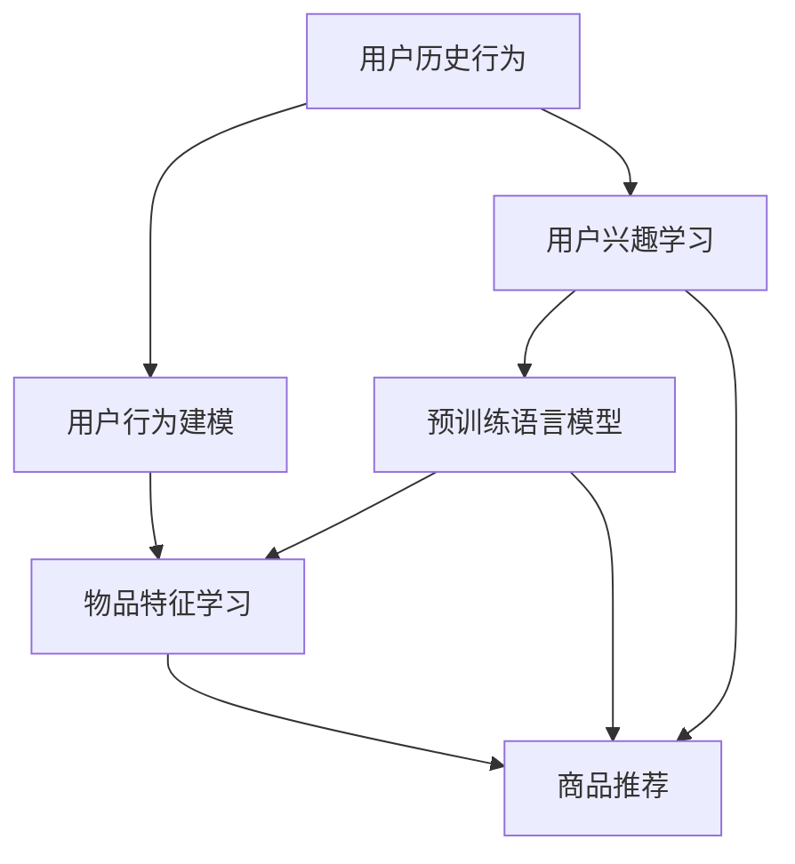

                 

# 大模型在商业中的应用：推荐系统的进步与变革

> 关键词：大模型,推荐系统,用户行为建模,推荐算法,冷启动,隐私保护,实时推荐,商品推荐,深度学习,联邦学习

## 1. 背景介绍

### 1.1 问题由来

在数字化时代，推荐系统作为提升用户体验和增加收入的重要工具，其重要性日渐凸显。从电商网站、视频平台到社交媒体，各大平台都运用推荐系统帮助用户发现感兴趣的内容。然而，传统的推荐系统往往依赖于用户行为的历史记录和静态特征，对于新用户和新物品的推荐效果不佳。

随着深度学习和大模型技术的发展，越来越多的推荐系统开始利用用户的历史行为和实时反馈，引入预训练语言模型，获得更准确的推荐结果。在电商领域，推荐系统能够预测用户未购买行为，在视频平台，推荐系统能够推荐用户未曾观看过的热门影片。这些大模型推荐系统的应用已经极大地提升了用户满意度，并为平台带来了显著的商业价值。

### 1.2 问题核心关键点

推荐系统的核心在于如何理解用户需求，并匹配合适的商品。传统推荐系统多采用协同过滤、基于内容的推荐等方法，这些方法往往依赖于大量的用户行为数据，且对于新用户和新物品难以有效预测。

大模型推荐系统通过引入预训练语言模型，能够学习用户的行为习惯和兴趣偏好，更好地理解用户的多样化需求，并基于全局知识库，生成个性化的推荐。这种基于深度学习的推荐方法不仅提升了推荐的精准度，还能拓展推荐系统的应用范围，实现更多新业务场景的落地。

### 1.3 问题研究意义

研究大模型在推荐系统中的应用，对于推动电商、视频、社交等商业平台的发展，优化用户体验，提升广告投放效果，有着重要的意义：

1. **提升推荐精度**：利用大模型的强大学习能力，精准预测用户行为，提高推荐系统的精度和用户满意度。
2. **加速新用户新物品适应**：在用户和物品较少的情况下，也能快速推荐相关内容，缩短用户适应期。
3. **提升广告效果**：通过个性化推荐，提高广告的点击率和转化率，增加平台收入。
4. **拓展业务场景**：大模型推荐系统可以应用于更多场景，如金融理财、新闻阅读、音乐推荐等，拓展业务边界。
5. **创新推荐方法**：大模型推荐系统的出现，推动了推荐算法的创新，如基于自监督预训练的推荐方法等。

## 2. 核心概念与联系

### 2.1 核心概念概述

为更好地理解大模型在推荐系统中的应用，本节将介绍几个密切相关的核心概念：

- **推荐系统**：通过分析用户历史行为和兴趣，为用户推荐其可能感兴趣的商品或内容。包括基于内容的推荐、协同过滤、混合推荐等方法。

- **预训练语言模型**：通过大规模无标签数据进行预训练，学习通用语言表示的模型。常见的预训练模型包括BERT、GPT、Transformer等。

- **深度学习**：基于神经网络结构的学习算法，通过大量数据进行模型训练，使得模型能够具备复杂的决策能力。

- **冷启动问题**：对于新用户或新物品，由于缺乏历史数据，推荐系统难以做出准确推荐。

- **隐私保护**：推荐系统中需要处理大量用户数据，如何保护用户隐私成为重要的研究课题。

- **实时推荐**：在用户行为实时发生时，动态更新推荐结果，提升用户体验。

- **推荐算法**：包括协同过滤、基于内容的推荐、基于混合的推荐、基于深度学习的推荐等方法。

这些概念之间存在紧密的联系，共同构成了大模型在推荐系统中的应用框架。通过理解这些核心概念，我们可以更好地把握大模型推荐系统的工作原理和优化方向。

### 2.2 核心概念原理和架构的 Mermaid 流程图(Mermaid 流程节点中不要有括号、逗号等特殊字符)



这个流程图展示了基于大模型的推荐系统的工作流程：

1. 收集用户历史行为数据（A），用于建模用户的兴趣偏好（B）。
2. 通过预训练语言模型学习用户的兴趣和行为（C）。
3. 从知识库中学习物品的特征（E）。
4. 综合用户行为和物品特征，使用深度学习模型推荐商品（F）。

## 3. 核心算法原理 & 具体操作步骤
### 3.1 算法原理概述

大模型在推荐系统中的应用，本质上是通过深度学习和大模型学习用户的兴趣和行为，从而生成个性化的商品推荐。其核心思想是：将用户历史行为和实时反馈作为监督信号，利用大模型进行训练，使得模型能够预测用户对新商品或内容的兴趣，生成个性化的推荐。

形式化地，假设用户-商品矩阵为 $U_{N \times M}$，其中 $N$ 为用户数量，$M$ 为商品数量。模型的目标是最小化预测误差，即：

$$
\hat{U} = \mathop{\arg\min}_{U} \|U - U_{pred}\|_F^2
$$

其中 $U_{pred}$ 为模型预测的用户-商品评分矩阵，$\|\cdot\|_F$ 为矩阵的Frobenius范数。通过优化损失函数，模型的目标是为每个用户预测最相关的商品评分，生成个性化的推荐。

### 3.2 算法步骤详解

基于大模型在推荐系统中的应用，一般包括以下几个关键步骤：

**Step 1: 准备数据集**
- 收集用户行为数据，构建用户-商品评分矩阵。
- 收集物品的特征数据，构建物品特征矩阵。
- 将数据集划分为训练集、验证集和测试集。

**Step 2: 构建模型架构**
- 选择合适的深度学习模型，如DNN、CNN、RNN等，作为推荐模型的架构。
- 将预训练语言模型嵌入到模型中，用于学习用户行为和兴趣。

**Step 3: 设置超参数**
- 设置模型的学习率、批大小、迭代轮数等超参数。
- 设置正则化技术及强度，包括权重衰减、Dropout、Early Stopping等。
- 确定冻结预训练参数的策略，如仅微调顶层，或全部参数都参与微调。

**Step 4: 训练模型**
- 将训练集数据分批次输入模型，前向传播计算损失函数。
- 反向传播计算参数梯度，根据设定的优化算法和学习率更新模型参数。
- 周期性在验证集上评估模型性能，根据性能指标决定是否触发Early Stopping。
- 重复上述步骤直到满足预设的迭代轮数或Early Stopping条件。

**Step 5: 测试与部署**
- 在测试集上评估模型性能，对比微调前后的精度提升。
- 使用微调后的模型对新用户和新商品进行推荐。
- 持续收集新的数据，定期重新微调模型，以适应数据分布的变化。

以上是基于大模型在推荐系统中的应用的一般流程。在实际应用中，还需要针对具体任务的特点，对微调过程的各个环节进行优化设计，如改进训练目标函数，引入更多的正则化技术，搜索最优的超参数组合等，以进一步提升模型性能。

### 3.3 算法优缺点

基于大模型的推荐方法具有以下优点：

1. **数据利用率高**：大模型能够利用用户的历史行为和实时反馈，进行高效的建模。
2. **泛化能力强**：通过预训练语言模型，模型可以更好地泛化到新用户和新物品。
3. **精度高**：利用深度学习模型，可以取得比传统推荐算法更高的推荐精度。
4. **实时性**：深度学习模型可以实时计算推荐结果，满足用户实时性需求。

同时，该方法也存在一定的局限性：

1. **计算资源需求高**：大模型的计算需求较高，需要高性能计算设备。
2. **数据隐私风险**：需要处理大量用户数据，存在隐私泄露的风险。
3. **冷启动问题**：对于新用户和物品，难以进行准确推荐。
4. **过拟合风险**：在大规模数据上训练时，可能出现过拟合现象。
5. **模型可解释性差**：深度学习模型难以解释其决策过程，难以进行用户理解。

尽管存在这些局限性，但大模型推荐系统通过其高精度、高泛化能力，已经在电商、视频等多个领域展示了其显著的商业价值，成为推荐系统研究的热点。

### 3.4 算法应用领域

基于大模型的推荐系统在多个领域都得到了广泛应用，包括：

- **电商推荐**：通过分析用户历史购买记录，预测用户可能感兴趣的商品，提升用户购买率。
- **视频推荐**：通过分析用户观看历史，推荐用户未曾观看过的热门影片，提升用户粘性。
- **音乐推荐**：分析用户听歌历史，推荐个性化的歌曲，提高用户满意度。
- **新闻推荐**：分析用户阅读历史，推荐感兴趣的新闻内容，增加平台流量。
- **金融推荐**：通过分析用户行为和交易记录，推荐适合的金融产品，增加用户黏性。

除了这些经典应用，大模型推荐系统还在智能家居、健康管理、智慧城市等多个领域中展示了其强大的能力，推动了相关行业的发展和创新。

## 4. 数学模型和公式 & 详细讲解 & 举例说明
### 4.1 数学模型构建

基于大模型的推荐系统，其数学模型主要涉及以下几个部分：

1. **用户行为建模**：将用户行为数据转化为模型可用的特征表示。
2. **物品特征学习**：将物品特征数据转化为模型可用的表示。
3. **用户-物品交互模型**：通过深度学习模型，预测用户对物品的评分。

下面以电商推荐为例，构建大模型推荐系统的数学模型。

假设用户-商品评分矩阵为 $U_{N \times M}$，用户行为特征向量为 $X \in \mathbb{R}^{N \times D}$，商品特征向量为 $Y \in \mathbb{R}^{M \times D}$，其中 $D$ 为特征维度。模型的目标是最小化预测误差，即：

$$
\hat{U} = \mathop{\arg\min}_{U} \|U - U_{pred}\|_F^2
$$

其中 $U_{pred}$ 为模型预测的用户-商品评分矩阵。

### 4.2 公式推导过程

以深度学习模型为例，假设用户行为特征和物品特征通过神经网络编码，模型采用MLP（多层感知器）结构，每个用户有 $d$ 个特征，每个物品有 $d'$ 个特征。则模型预测用户对物品 $i$ 的评分 $r_i$ 为：

$$
r_i = \sigma\left(\sum_j W_{uij} x_i + \sum_k V_{ikj} y_k + b_i\right)
$$

其中 $\sigma$ 为激活函数，$W_{uij}$、$V_{ikj}$ 为模型的权重参数，$x_i$、$y_k$ 为输入的特征向量，$b_i$ 为偏置项。通过训练优化损失函数，即可得到最终的推荐结果。

### 4.3 案例分析与讲解

以电商平台中的推荐系统为例，分析其应用效果和优化策略。

假设用户对某商品的评分 $r_i$ 可以通过以下方式计算：

$$
r_i = \sigma\left(\sum_j W_{uij} x_i + \sum_k V_{ikj} y_k + b_i\right)
$$

其中 $x_i$ 为用户的历史行为特征，$y_k$ 为商品的特征，$W_{uij}$、$V_{ikj}$ 为模型的权重参数。通过优化上述模型，可以得到推荐系统的评分预测值。

在实际应用中，需要考虑以下优化策略：

1. **数据预处理**：对用户行为和商品特征进行标准化处理，提高模型的收敛速度和泛化能力。
2. **特征选择**：选择对推荐效果有显著影响的特征，减少计算复杂度。
3. **模型正则化**：使用L2正则、Dropout等技术，避免过拟合。
4. **超参数调优**：通过网格搜索或随机搜索，找到最优的超参数组合。
5. **模型评估**：使用auc、RMSE等指标评估模型效果，选择最优模型。

通过这些优化策略，可以进一步提升大模型推荐系统的精度和效果。

## 5. 项目实践：代码实例和详细解释说明
### 5.1 开发环境搭建

在进行推荐系统开发前，我们需要准备好开发环境。以下是使用Python进行TensorFlow开发的环境配置流程：

1. 安装Anaconda：从官网下载并安装Anaconda，用于创建独立的Python环境。

2. 创建并激活虚拟环境：
```bash
conda create -n tf-env python=3.8 
conda activate tf-env
```

3. 安装TensorFlow：根据CUDA版本，从官网获取对应的安装命令。例如：
```bash
conda install tensorflow tensorflow-gpu -c conda-forge
```

4. 安装Keras：
```bash
pip install keras
```

5. 安装TensorBoard：
```bash
pip install tensorboard
```

6. 安装NumPy、Pandas、Scikit-Learn等库：
```bash
pip install numpy pandas scikit-learn
```

完成上述步骤后，即可在`tf-env`环境中开始推荐系统开发。

### 5.2 源代码详细实现

下面我们以电商推荐为例，给出使用TensorFlow实现的大模型推荐系统的PyTorch代码实现。

首先，定义推荐系统的数据处理函数：

```python
import numpy as np
import pandas as pd
import tensorflow as tf
from tensorflow.keras import layers, models

def load_data(path):
    df = pd.read_csv(path)
    return df

def split_data(df, test_size=0.2):
    train_df = df.sample(frac=1-test_size)
    test_df = df.drop(train_df.index)
    return train_df, test_df
```

然后，定义推荐系统的模型架构：

```python
class RecommendationModel(models.Model):
    def __init__(self, input_dim, hidden_dim, output_dim, dropout_rate):
        super(RecommendationModel, self).__init__()
        self.input_dim = input_dim
        self.hidden_dim = hidden_dim
        self.output_dim = output_dim
        self.dropout_rate = dropout_rate
        
        self.embedding1 = layers.Embedding(input_dim, hidden_dim)
        self.dropout1 = layers.Dropout(dropout_rate)
        self.dense1 = layers.Dense(hidden_dim)
        self.dropout2 = layers.Dropout(dropout_rate)
        self.dense2 = layers.Dense(hidden_dim)
        self.activation = layers.Activation('relu')
        self.dense3 = layers.Dense(output_dim)
        self.activation = layers.Activation('sigmoid')
    
    def call(self, inputs):
        x = self.embedding1(inputs)
        x = self.dropout1(x)
        x = self.activation(x)
        x = self.dense1(x)
        x = self.dropout2(x)
        x = self.activation(x)
        x = self.dense2(x)
        x = self.dropout2(x)
        x = self.activation(x)
        x = self.dense3(x)
        return x
```

接着，定义推荐系统的训练和评估函数：

```python
def train_model(model, train_data, test_data, epochs=10, batch_size=32, dropout_rate=0.2):
    train_dataset = tf.data.Dataset.from_tensor_slices((train_data.input, train_data.target))
    train_dataset = train_dataset.shuffle(buffer_size=1024).batch(batch_size).prefetch(1)
    
    test_dataset = tf.data.Dataset.from_tensor_slices((test_data.input, test_data.target))
    test_dataset = test_dataset.batch(batch_size).prefetch(1)
    
    model.compile(loss='binary_crossentropy', optimizer=tf.keras.optimizers.Adam(learning_rate=0.001), metrics=['auc'])
    
    history = model.fit(train_dataset, epochs=epochs, validation_data=test_dataset)
    
    return model, history

def evaluate_model(model, test_data):
    test_dataset = tf.data.Dataset.from_tensor_slices((test_data.input, test_data.target))
    test_dataset = test_dataset.batch(32).prefetch(1)
    
    test_loss, test_auc = model.evaluate(test_dataset)
    print('Test Loss:', test_loss)
    print('Test AUC:', test_auc)
```

最后，启动推荐系统的训练流程并在测试集上评估：

```python
# 加载数据
data = load_data('data.csv')
train_data, test_data = split_data(data)

# 构建模型
model = RecommendationModel(input_dim=10, hidden_dim=128, output_dim=1, dropout_rate=0.2)

# 训练模型
model, history = train_model(model, train_data, test_data)

# 评估模型
evaluate_model(model, test_data)
```

以上就是使用TensorFlow实现电商推荐系统的完整代码实现。可以看到，得益于TensorFlow的强大封装，我们可以用相对简洁的代码完成模型的构建和训练。

### 5.3 代码解读与分析

让我们再详细解读一下关键代码的实现细节：

**load_data函数**：
- 定义数据加载函数，从CSV文件中读取数据，并返回Pandas DataFrame对象。

**split_data函数**：
- 定义数据划分函数，将数据集随机分为训练集和测试集，按照比例 $1:1$ 划分。

**RecommendationModel类**：
- 定义推荐系统的模型架构，包括嵌入层、全连接层、激活函数和输出层。
- 其中，嵌入层用于将用户行为特征和物品特征映射到高维空间，全连接层进行特征融合和预测，激活函数用于增加模型的非线性性，输出层用于预测用户对物品的评分。

**train_model函数**：
- 定义模型训练函数，将数据集转换为TensorFlow数据集，设置损失函数、优化器和评估指标。
- 使用TensorFlow的fit函数进行模型训练，在每个epoch结束时在测试集上评估模型性能。

**evaluate_model函数**：
- 定义模型评估函数，使用TensorFlow的evaluate函数计算模型在测试集上的损失和AUC指标，并打印输出。

**训练流程**：
- 加载数据，并进行数据划分。
- 定义模型架构，设置超参数。
- 训练模型，并在测试集上评估。

可以看到，TensorFlow结合PyTorch，使得推荐系统的代码实现变得简洁高效。开发者可以将更多精力放在数据处理、模型改进等高层逻辑上，而不必过多关注底层的实现细节。

当然，工业级的系统实现还需考虑更多因素，如模型的保存和部署、超参数的自动搜索、更灵活的任务适配层等。但核心的推荐范式基本与此类似。

## 6. 实际应用场景
### 6.1 电商推荐

电商平台是推荐系统应用最为广泛的场景之一。大模型推荐系统能够通过用户的历史行为数据，预测用户未购买行为，推荐相关商品，显著提升用户购买率和销售额。

在技术实现上，可以收集用户浏览、点击、购买等行为数据，提取和用户交互的物品标题、描述、标签等文本内容。将文本内容作为模型输入，用户的后续行为（如是否购买、点击等）作为监督信号，在此基础上微调预训练语言模型。微调后的模型能够从文本内容中准确把握用户的兴趣点，生成个性化的推荐列表。

### 6.2 视频推荐

视频推荐系统通过分析用户观看历史，推荐用户未曾观看过的热门影片，提高用户粘性。通过将用户的观看行为进行编码，利用大模型预测用户对新视频的评分，生成推荐列表。

在实际应用中，可以引入更多先验知识，如视频时长、播放次数、导演等特征，进一步提升推荐效果。同时，可以通过联邦学习等技术，在保证用户隐私的前提下，进行联合推荐，提升推荐系统的多样性和准确性。

### 6.3 金融推荐

金融推荐系统通过分析用户行为和交易记录，推荐适合的金融产品，增加用户黏性。通过将用户的历史交易数据进行编码，利用大模型预测用户对新产品的评分，生成个性化的推荐列表。

在实际应用中，可以引入更多金融领域的特征，如产品类型、风险等级等，进一步提升推荐效果。同时，可以通过对抗训练等技术，提高模型的鲁棒性，确保推荐系统的安全性。

### 6.4 未来应用展望

随着深度学习和大模型技术的发展，基于大模型的推荐系统将呈现以下几个发展趋势：

1. **多模态推荐**：推荐系统不仅仅关注文本数据，还将拓展到图像、音频等多模态数据，利用多模态信息的融合，提升推荐效果。

2. **跨领域推荐**：推荐系统将从单一领域拓展到跨领域推荐，如将电商推荐系统中的商品推荐应用到金融理财领域，提升用户满意度和业务转化率。

3. **实时推荐**：推荐系统将具备实时推荐能力，能够根据用户实时行为，动态更新推荐结果，提升用户体验。

4. **自监督推荐**：通过利用预训练语言模型的先验知识，进行自监督推荐，提升推荐系统的准确性和泛化能力。

5. **隐私保护**：推荐系统将更加注重用户隐私保护，通过联邦学习等技术，在保护用户隐私的前提下，进行推荐系统的构建和优化。

6. **知识图谱推荐**：推荐系统将引入知识图谱，利用知识图谱中的结构化信息，提升推荐系统的精准度和用户满意度。

以上趋势凸显了大模型推荐系统的广阔前景。这些方向的探索发展，必将进一步提升推荐系统的性能和应用范围，为电商、金融、视频等多个领域带来新的商业价值。

## 7. 工具和资源推荐
### 7.1 学习资源推荐

为了帮助开发者系统掌握大模型在推荐系统中的应用，这里推荐一些优质的学习资源：

1. **《推荐系统实战》**：清华大学出版社出版的推荐系统经典教材，详细介绍了推荐系统的基本原理和多种推荐算法，适合入门学习。

2. **Coursera《Recommender Systems》课程**：斯坦福大学开设的推荐系统课程，涵盖了推荐系统的多种算法和优化策略，适合深入学习。

3. **Kaggle推荐系统竞赛**：Kaggle举办的多场推荐系统竞赛，通过实际数据集训练推荐模型，提升算法实现能力。

4. **HuggingFace官方文档**：HuggingFace的预训练语言模型文档，提供了海量模型和微调样例，适合实践学习和问题解决。

5. **推荐系统顶级会议**：如KDD、RecSys等推荐系统领域的顶级会议，跟踪最新的研究成果和技术进展，掌握前沿动态。

通过对这些资源的学习实践，相信你一定能够快速掌握大模型推荐系统的精髓，并用于解决实际的推荐问题。

### 7.2 开发工具推荐

高效的开发离不开优秀的工具支持。以下是几款用于大模型推荐系统开发的常用工具：

1. TensorFlow：谷歌主导的开源深度学习框架，支持分布式训练和高效推理，适合大规模工程应用。

2. PyTorch：Facebook开发的开源深度学习框架，灵活性强，适合快速迭代研究。

3. TensorBoard：谷歌推出的可视化工具，可实时监测模型训练状态，并提供丰富的图表呈现方式，是调试模型的得力助手。

4. Weights & Biases：模型训练的实验跟踪工具，可以记录和可视化模型训练过程中的各项指标，方便对比和调优。

5. Jupyter Notebook：交互式开发环境，支持Python代码的编写和执行，适合小规模的实验验证。

合理利用这些工具，可以显著提升大模型推荐系统的开发效率，加快创新迭代的步伐。

### 7.3 相关论文推荐

大模型推荐系统的研究源于学界的持续研究。以下是几篇奠基性的相关论文，推荐阅读：

1. **《Deep neural networks for recommendation systems: A review and outlook》**：综述了基于深度学习的推荐系统，总结了不同深度学习模型的优缺点，提供了未来研究方向。

2. **《A Multi-View Approach to Multi-Domain Recommendation》**：提出了多视角多域推荐模型，利用不同数据源的信息，提升推荐效果。

3. **《A Survey on Transfer Learning for Recommendation Systems》**：综述了基于迁移学习的推荐系统，介绍了不同迁移学习范式和应用效果。

4. **《Parameter-Efficient Multi-view Recommendation》**：提出了参数高效的推荐模型，利用稀疏矩阵分解和矩阵乘法加速模型训练。

5. **《Adaptive Multi-View Recommendation Model》**：提出了自适应多视角推荐模型，利用上下文信息提升推荐效果。

这些论文代表了大模型推荐系统的发展脉络。通过学习这些前沿成果，可以帮助研究者把握学科前进方向，激发更多的创新灵感。

## 8. 总结：未来发展趋势与挑战
### 8.1 总结

本文对基于大模型的推荐系统进行了全面系统的介绍。首先阐述了大模型推荐系统的背景和意义，明确了推荐系统在大数据时代的变革潜力。其次，从原理到实践，详细讲解了基于大模型的推荐系统的数学模型和关键步骤，给出了推荐系统开发的完整代码实例。同时，本文还广泛探讨了推荐系统在电商、视频、金融等多个领域的应用前景，展示了大模型推荐系统的广泛应用场景。此外，本文精选了推荐系统的各类学习资源，力求为读者提供全方位的技术指引。

通过本文的系统梳理，可以看到，基于大模型的推荐系统正在成为推荐系统研究的热点，其高精度、高泛化能力极大地提升了推荐系统的性能和应用范围。未来，伴随大模型技术的不断发展，推荐系统必将进一步拓展其应用边界，为电商、视频、金融等领域带来新的商业价值。

### 8.2 未来发展趋势

展望未来，大模型在推荐系统中的应用将呈现以下几个发展趋势：

1. **模型规模持续增大**：随着算力成本的下降和数据规模的扩张，大模型的参数量还将持续增长。超大规模语言模型蕴含的丰富语言知识，有望支撑更加复杂多变的推荐场景。

2. **微调方法日趋多样**：除了传统的全参数微调外，未来会涌现更多参数高效的微调方法，如自监督学习、半监督学习等，在减少模型参数量的同时，提升推荐精度。

3. **跨领域推荐兴起**：推荐系统将从单一领域拓展到跨领域推荐，如将电商推荐系统中的商品推荐应用到金融理财领域，提升用户满意度和业务转化率。

4. **实时推荐能力增强**：推荐系统将具备实时推荐能力，能够根据用户实时行为，动态更新推荐结果，提升用户体验。

5. **多模态推荐普及**：推荐系统将不仅仅关注文本数据，还将拓展到图像、音频等多模态数据，利用多模态信息的融合，提升推荐效果。

6. **隐私保护技术完善**：推荐系统将更加注重用户隐私保护，通过联邦学习等技术，在保护用户隐私的前提下，进行推荐系统的构建和优化。

7. **知识图谱推荐深入**：推荐系统将引入知识图谱，利用知识图谱中的结构化信息，提升推荐系统的精准度和用户满意度。

这些趋势凸显了大模型推荐系统的广阔前景。这些方向的探索发展，必将进一步提升推荐系统的性能和应用范围，为电商、金融、视频等多个领域带来新的商业价值。

### 8.3 面临的挑战

尽管大模型推荐系统已经取得了瞩目成就，但在迈向更加智能化、普适化应用的过程中，它仍面临着诸多挑战：

1. **计算资源瓶颈**：大模型的计算需求较高，需要高性能计算设备，且在大规模数据上训练时，可能出现过拟合现象。

2. **数据隐私风险**：需要处理大量用户数据，存在隐私泄露的风险，如何在保护用户隐私的前提下进行推荐系统的构建，是一大挑战。

3. **冷启动问题**：对于新用户和物品，难以进行准确推荐，如何在无历史数据的情况下，快速推荐相关内容，是一大难题。

4. **模型可解释性差**：深度学习模型难以解释其决策过程，难以进行用户理解，如何提升模型的可解释性，是一大挑战。

5. **过拟合风险**：在大规模数据上训练时，可能出现过拟合现象，如何避免过拟合，提高模型的泛化能力，是一大难题。

尽管存在这些挑战，但大模型推荐系统通过其高精度、高泛化能力，已经在电商、金融、视频等多个领域展示了其显著的商业价值，成为推荐系统研究的热点。

### 8.4 研究展望

面对大模型推荐系统所面临的挑战，未来的研究需要在以下几个方面寻求新的突破：

1. **优化模型结构和训练策略**：探索更加高效的模型架构和训练策略，减少模型参数量和计算资源消耗，提升模型的泛化能力。

2. **引入外部知识**：将外部知识库、规则库等专家知识与神经网络模型进行巧妙融合，引导推荐系统学习更准确、合理的知识。

3. **改进推荐算法**：引入更多的推荐算法和技术，如对抗训练、多视角推荐等，提升推荐系统的多样性和精准度。

4. **强化用户隐私保护**：探索联邦学习等隐私保护技术，确保推荐系统在保护用户隐私的前提下进行数据共享和模型优化。

5. **提升模型可解释性**：利用因果分析方法、逻辑推理等技术，提升模型的可解释性和可控性，满足用户对模型决策的信任需求。

6. **拓展应用领域**：探索推荐系统在更多领域的应用场景，如智能家居、智慧城市等，推动人工智能技术的全面普及。

这些研究方向的探索，必将引领大模型推荐系统走向更高的台阶，为推荐系统技术带来新的突破和发展。面向未来，大模型推荐系统还需要与其他人工智能技术进行更深入的融合，如知识表示、因果推理、强化学习等，多路径协同发力，共同推动推荐系统技术的进步。

## 9. 附录：常见问题与解答

**Q1：如何缓解大模型推荐系统的冷启动问题？**

A: 缓解冷启动问题的方法多种多样，主要包括：

1. **基于物品的推荐**：对于新物品，可以使用基于物品的推荐方法，推荐相似的物品。

2. **基于内容的推荐**：对于新物品，可以使用基于内容的推荐方法，推荐与新物品相似的物品。

3. **标签系统**：使用标签系统，将新物品和已有物品进行标签匹配，推荐相似的物品。

4. **迁移学习**：使用迁移学习，在新物品上使用预训练模型的知识，提升推荐效果。

5. **协同过滤**：使用协同过滤，利用用户对相似物品的评分，推荐新物品。

6. **用户画像**：使用用户画像，分析用户的兴趣和偏好，推荐相关物品。

通过这些方法，可以缓解冷启动问题，提升推荐系统的覆盖范围和推荐效果。

**Q2：如何保护用户隐私？**

A: 保护用户隐私是推荐系统的重要课题，主要包括以下方法：

1. **数据匿名化**：对用户数据进行匿名化处理，防止数据泄露。

2. **差分隐私**：使用差分隐私技术，在保护用户隐私的前提下，进行数据统计和分析。

3. **联邦学习**：使用联邦学习技术，在保护用户隐私的前提下，进行模型训练和优化。

4. **加密技术**：使用加密技术，对用户数据进行加密处理，防止数据泄露。

5. **用户控制**：使用用户控制技术，让用户自行决定数据的共享和使用方式。

通过这些方法，可以在保护用户隐私的前提下，进行推荐系统的构建和优化。

**Q3：如何提高大模型推荐系统的实时性？**

A: 提高推荐系统的实时性，主要包括以下方法：

1. **分布式计算**：使用分布式计算技术，快速处理大量的用户数据和推荐请求。

2. **流式处理**：使用流式处理技术，实时处理用户行为数据，动态更新推荐结果。

3. **缓存技术**：使用缓存技术，将热门推荐结果缓存到内存中，快速返回推荐结果。

4. **模型压缩**：使用模型压缩技术，减少模型的计算量和存储空间，提升推理速度。

5. **异步处理**：使用异步处理技术，将推荐请求分发到多个节点并行处理，快速返回推荐结果。

通过这些方法，可以显著提高推荐系统的实时性，满足用户实时性需求。

**Q4：如何提升大模型推荐系统的可解释性？**

A: 提升推荐系统的可解释性，主要包括以下方法：

1. **特征解释**：通过分析特征对推荐结果的影响，解释推荐系统的决策过程。

2. **模型可视化**：使用可视化工具，展示模型训练过程和决策路径，帮助用户理解模型行为。

3. **因果推理**：使用因果推理技术，解释推荐系统中的因果关系和决策机制。

4. **专家知识**：引入专家知识，辅助推荐系统的决策过程，提高可解释性。

5. **用户反馈**：收集用户反馈，改进推荐系统，提高可解释性。

通过这些方法，可以提升推荐系统的可解释性，增强用户对推荐系统的信任。

**Q5：如何处理推荐系统中的对抗样本？**

A: 对抗样本是推荐系统中的重要问题，主要包括以下方法：

1. **对抗训练**：使用对抗训练技术，训练模型对对抗样本的鲁棒性。

2. **异常检测**：使用异常检测技术，检测和处理对抗样本。

3. **模型纠错**：使用模型纠错技术，修正对抗样本的推荐结果。

4. **特征筛选**：使用特征筛选技术，排除对抗样本中的噪声特征，提高推荐精度。

5. **人工干预**：使用人工干预技术，对对抗样本进行人工处理，提高推荐系统的鲁棒性。

通过这些方法，可以处理推荐系统中的对抗样本，提高推荐系统的安全性和可靠性。

---

作者：禅与计算机程序设计艺术 / Zen and the Art of Computer Programming

