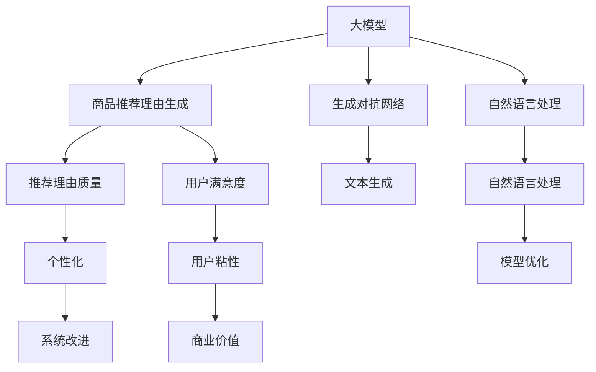

                 

# 大模型在商品推荐理由生成中的可控文本生成

> 关键词：大模型,可控文本生成,商品推荐,原因生成,深度学习,自然语言处理(NLP),推荐系统,生成对抗网络(GAN)

## 1. 背景介绍

### 1.1 问题由来

随着电商的兴起，商品推荐系统在各大平台得到广泛应用，成为提升用户体验、促进销售的重要手段。传统的推荐系统往往依赖用户历史行为数据进行冷启动推荐，对于新用户和老用户面临的挑战不同。

针对新用户，缺乏足够的历史行为数据，推荐算法难以预测其喜好，这成为推荐系统冷启动的难题。而对于老用户，推荐系统逐渐陷入"信息茧房"，推荐结果的同质性增加，个性化程度下降，用户满意度降低。

为了缓解上述问题，基于大模型的推荐系统应运而生。大模型经过大规模语料训练，具备强大的语言理解和生成能力。通过在商品推荐理由生成任务上微调大模型，可以结合用户喜好和商品信息，生成符合用户期望的推荐理由，提升推荐系统的个性化程度和用户满意度。

## 2. 核心概念与联系

### 2.1 核心概念概述

为更好地理解大模型在商品推荐理由生成中的可控文本生成，本节将介绍几个密切相关的核心概念：

- 大模型(Large Model)：指通过大规模数据集进行训练，具有强大语言处理和生成能力的深度学习模型。常见的有BERT、GPT等。
- 可控文本生成(Controllable Text Generation)：指利用大模型生成文本的过程中，通过设计合适的输入格式，控制模型生成符合特定条件（如情绪、风格、主题等）的文本。
- 商品推荐系统(Recommender System)：利用用户行为数据、商品信息、模型等，预测用户可能感兴趣的商品，并将其推荐给用户。
- 生成对抗网络(GAN)：一种深度学习模型，通过两个对抗的神经网络进行生成和判别，实现高质量的文本生成。
- 推荐理由生成(Reason Generation)：为推荐系统生成的推荐理由，使推荐结果更具说服力和可信度。

这些核心概念之间的逻辑关系可以通过以下Mermaid流程图来展示：



这个流程图展示了大模型在商品推荐理由生成中的核心概念及其之间的关系：

1. 大模型通过预训练获得语言知识，在推荐理由生成任务上进行微调，生成高质量的推荐理由。
2. 生成对抗网络通过对抗性训练，进一步提升文本生成质量。
3. 自然语言处理技术提升模型的语言理解能力，优化推荐理由生成过程。
4. 推荐理由生成使推荐系统更具说服力，提升用户满意度和粘性。
5. 推荐理由生成结合个性化，进一步优化推荐系统性能，提升商业价值。

## 3. 核心算法原理 & 具体操作步骤
### 3.1 算法原理概述

大模型在商品推荐理由生成中的可控文本生成，本质上是一种基于大模型的文本生成过程。其核心思想是：利用大模型在自然语言处理领域的优势，结合推荐系统任务特点，通过微调和生成对抗网络优化模型生成推荐理由，使其具备足够的个性化、说服力和可信度。

形式化地，假设推荐理由生成任务为 $R(\cdot)$，其中 $x$ 为用户历史行为和商品信息，$\theta$ 为大模型微调后的参数。则推荐理由生成模型的目标函数为：

$$
\min_{\theta} \mathbb{E}_{(x)} \|R(x;\theta) - y\|
$$

其中 $y$ 为真实的推荐理由，$\mathbb{E}_{(x)}$ 表示期望损失。

### 3.2 算法步骤详解

基于大模型的商品推荐理由生成，一般包括以下几个关键步骤：

**Step 1: 准备数据集**

- 收集用户历史行为数据，如浏览、点击、购买记录等，并提取出商品信息、价格、评分等特征。
- 使用A/B测试、问卷调查等方式，获取用户的推荐理由偏好，如简洁明了、详细具体等。
- 设计标注数据集，对每条推荐理由进行标注，如主题、情绪、风格等。

**Step 2: 设计任务适配层**

- 根据任务特点，设计适合的推荐理由生成模型架构，如使用Transformer模型。
- 添加任务适配层，包括输入输出层、交叉熵损失函数等。
- 设计生成对抗网络结构，将生成器和判别器分别与推荐理由生成模型进行集成。

**Step 3: 训练生成对抗网络**

- 将生成器和判别器分别进行训练，使其分别生成高质量的推荐理由和判别真实的推荐理由。
- 通过对抗性训练，使得生成器生成的推荐理由能够欺骗判别器，从而提升生成质量。

**Step 4: 微调推荐理由生成模型**

- 使用生成对抗网络输出的高质量推荐理由，作为微调训练集的输入。
- 在微调过程中，设计合适的正则化和优化策略，避免过拟合。
- 在验证集和测试集上进行评估，选择最优微调模型。

**Step 5: 生成推荐理由**

- 使用微调后的模型生成推荐理由，结合用户历史行为和商品信息，生成个性化的推荐理由。
- 根据用户的推荐理由偏好，选择合适的生成策略，如简洁明了、详细具体等。
- 将推荐理由应用到推荐系统，提升推荐结果的个性化程度和可信度。

以上是基于大模型的商品推荐理由生成的一般流程。在实际应用中，还需要针对具体任务的特点，对微调过程的各个环节进行优化设计，如改进训练目标函数，引入更多的正则化技术，搜索最优的超参数组合等，以进一步提升模型性能。

### 3.3 算法优缺点

基于大模型的商品推荐理由生成方法具有以下优点：

1. 快速迭代：通过微调大模型，可以很快适应新的任务和用户偏好，提升推荐理由的个性化程度。
2. 高质量生成：大模型的语言生成能力很强，生成的推荐理由符合语言表达规范，更具有说服力和可信度。
3. 多模态融合：结合用户行为数据和商品信息，生成多模态融合的推荐理由，提升推荐系统的综合性能。
4. 灵活性高：可以根据不同应用场景，灵活设计推荐理由生成模型，适应各种推荐需求。

同时，该方法也存在一定的局限性：

1. 数据依赖性强：微调效果依赖于标注数据的质量和数量，获取高质量标注数据的成本较高。
2. 模型复杂度高：大模型参数量巨大，计算和存储成本高，需要高性能硬件支持。
3. 可解释性不足：微调后的模型难以解释其生成推荐理由的决策过程，缺乏透明性。
4. 鲁棒性差：微调模型对标注数据的分布变化敏感，容易产生过拟合。
5. 对抗性风险：生成对抗网络训练过程中的对抗样本可能会对生成器产生负面影响，影响推荐理由的质量。

尽管存在这些局限性，但就目前而言，基于大模型的推荐理由生成方法在推荐系统领域仍有广泛应用前景，特别是在提升推荐理由质量、个性化程度和商业价值方面。

### 3.4 算法应用领域

基于大模型的商品推荐理由生成方法，已在推荐系统领域得到广泛应用，具体包括：

- 个性化推荐：结合用户历史行为和商品信息，生成个性化的推荐理由，提升推荐结果的个性化程度和用户满意度。
- 营销推广：根据商品属性和用户偏好，生成符合营销目标的推荐理由，提升广告转化率。
- 用户满意度提升：通过优化推荐理由，使推荐结果更具说服力和可信度，提升用户对推荐系统的满意度。
- 商品评估：结合用户评分和评价，生成商品的推荐理由，帮助用户了解商品特点，提升购买决策的科学性。

此外，该方法还被创新性地应用到更多场景中，如电商搜索、智能客服、个性化内容生成等，为推荐系统带来新的应用可能。随着大模型的不断发展和应用场景的拓展，基于大模型的推荐理由生成方法将在更多领域发挥更大的作用。

## 4. 数学模型和公式 & 详细讲解 & 举例说明

### 4.1 数学模型构建

本节将使用数学语言对基于大模型的商品推荐理由生成过程进行更加严格的刻画。

记推荐理由生成任务为 $R(\cdot)$，其中 $x$ 为用户历史行为和商品信息，$\theta$ 为大模型微调后的参数。假设生成对抗网络包含生成器 $G(\cdot)$ 和判别器 $D(\cdot)$。则推荐理由生成模型的目标函数为：

$$
\min_{\theta} \mathbb{E}_{(x)} \|R(x;\theta) - y\|
$$

其中 $y$ 为真实的推荐理由，$\mathbb{E}_{(x)}$ 表示期望损失。

生成对抗网络的目标函数为：

$$
\min_G \max_D V(D,G)
$$

其中 $V(D,G)$ 为生成器和判别器的对抗损失函数，通常使用交叉熵损失。

### 4.2 公式推导过程

以下我们以生成对抗网络为例，推导生成器和判别器的损失函数。

假设生成器的输入为 $z$，输出为 $y_G$，判别器的输入为 $x$ 或 $y_G$，输出为 $D(x)$ 或 $D(y_G)$，其中 $D(x)$ 表示判别器对真实样本的判别结果，$D(y_G)$ 表示判别器对生成样本的判别结果。

假设 $D(x)$ 和 $D(y_G)$ 分别服从Bernoulli分布，则判别器的交叉熵损失函数为：

$$
L_D = -\mathbb{E}_{(x)} [\log D(x)] - \mathbb{E}_{(z)} [\log(1-D(y_G))]
$$

生成器的交叉熵损失函数为：

$$
L_G = -\mathbb{E}_{(z)} [\log D(y_G)]
$$

通过对抗性训练，生成器和判别器同时更新，使得生成器生成的样本能够欺骗判别器，即 $D(y_G) \approx 0.5$。

在得到生成器和判别器的损失函数后，即可带入优化算法（如Adam、SGD等）进行训练，使得生成器生成高质量的推荐理由，判别器判别真实和生成样本的能力得到提升。

### 4.3 案例分析与讲解

下面以一个简单的案例来说明大模型在商品推荐理由生成中的应用。

假设我们有一个电商推荐系统，用户历史行为数据和商品信息如下：

| UserID | LastViewed | LastPurchased | LastReviewed | LastReviewedEmotion | LastReviewedContent |
| --- | --- | --- | --- | --- | --- |
| U1 | 手机 | 耳机 | 手表 | 正向 | 这款手表时尚大方，质量超好！ |
| U2 | 耳机 | 耳机 | 耳机 | 正向 | 这款耳机音质优秀，价格实惠！ |
| U3 | 手机 | 手机 | 手机 | 正向 | 这款手机性价比高，运行流畅！ |

我们希望生成个性化的推荐理由，供推荐系统使用。具体步骤如下：

**Step 1: 设计推荐理由生成模型**

- 使用一个多层Transformer模型作为推荐理由生成模型，包含输入编码层、Transformer编码层、输出解码层等。
- 添加交叉熵损失函数，将生成的推荐理由与真实标签进行匹配。

**Step 2: 设计生成对抗网络**

- 设计一个包含生成器和判别器的生成对抗网络，生成器通过多层的Transformer生成推荐理由，判别器通过多层的卷积神经网络（CNN）判别真实和生成样本。
- 在生成器和判别器上使用交叉熵损失函数进行对抗性训练。

**Step 3: 微调推荐理由生成模型**

- 使用生成对抗网络输出的高质量推荐理由，作为微调训练集的输入。
- 在微调过程中，设置合适的学习率和优化策略，防止过拟合。
- 在验证集和测试集上进行评估，选择最优微调模型。

**Step 4: 生成推荐理由**

- 使用微调后的模型生成推荐理由，结合用户历史行为和商品信息，生成个性化的推荐理由。
- 根据用户的推荐理由偏好，选择简洁明了或详细具体的生成策略。
- 将推荐理由应用到推荐系统，提升推荐结果的个性化程度和用户满意度。

通过上述步骤，我们可以构建一个基于大模型的商品推荐理由生成系统，有效提升推荐系统的性能和用户体验。

## 5. 项目实践：代码实例和详细解释说明

### 5.1 开发环境搭建

在进行商品推荐理由生成实践前，我们需要准备好开发环境。以下是使用Python进行PyTorch开发的环境配置流程：

1. 安装Anaconda：从官网下载并安装Anaconda，用于创建独立的Python环境。

2. 创建并激活虚拟环境：
```bash
conda create -n pytorch-env python=3.8 
conda activate pytorch-env
```

3. 安装PyTorch：根据CUDA版本，从官网获取对应的安装命令。例如：
```bash
conda install pytorch torchvision torchaudio cudatoolkit=11.1 -c pytorch -c conda-forge
```

4. 安装Transformers库：
```bash
pip install transformers
```

5. 安装各类工具包：
```bash
pip install numpy pandas scikit-learn matplotlib tqdm jupyter notebook ipython
```

完成上述步骤后，即可在`pytorch-env`环境中开始商品推荐理由生成的实践。

### 5.2 源代码详细实现

这里我们以生成对抗网络为例，给出使用PyTorch对生成对抗网络进行商品推荐理由生成的PyTorch代码实现。

首先，定义生成器和判别器的代码：

```python
import torch.nn as nn
import torch.nn.functional as F

class Generator(nn.Module):
    def __init__(self, z_dim, output_dim):
        super(Generator, self).__init__()
        self.z_dim = z_dim
        self.fc1 = nn.Linear(z_dim, 256)
        self.fc2 = nn.Linear(256, 512)
        self.fc3 = nn.Linear(512, output_dim)
    
    def forward(self, z):
        x = F.relu(self.fc1(z))
        x = F.relu(self.fc2(x))
        return F.tanh(self.fc3(x))

class Discriminator(nn.Module):
    def __init__(self, input_dim):
        super(Discriminator, self).__init__()
        self.fc1 = nn.Linear(input_dim, 256)
        self.fc2 = nn.Linear(256, 128)
        self.fc3 = nn.Linear(128, 1)
    
    def forward(self, x):
        x = F.relu(self.fc1(x))
        x = F.sigmoid(self.fc2(x))
        return self.fc3(x)

def create_generator(z_dim, output_dim):
    return Generator(z_dim, output_dim)

def create_discriminator(input_dim):
    return Discriminator(input_dim)
```

然后，定义训练和评估函数：

```python
from torch.utils.data import DataLoader
from tqdm import tqdm
from sklearn.metrics import accuracy_score

class Dataset(Dataset):
    def __init__(self, data, labels):
        self.data = data
        self.labels = labels
        
    def __len__(self):
        return len(self.data)
    
    def __getitem__(self, item):
        return self.data[item], self.labels[item]

def train_epoch(model, data_loader, optimizer, criterion):
    model.train()
    losses = []
    for batch in tqdm(data_loader):
        inputs, labels = batch
        optimizer.zero_grad()
        outputs = model(inputs)
        loss = criterion(outputs, labels)
        losses.append(loss.item())
        loss.backward()
        optimizer.step()
    return sum(losses) / len(losses)

def evaluate(model, data_loader, criterion):
    model.eval()
    losses = []
    corrects = 0
    with torch.no_grad():
        for batch in tqdm(data_loader):
            inputs, labels = batch
            outputs = model(inputs)
            loss = criterion(outputs, labels)
            losses.append(loss.item())
            predictions = outputs
            corrects += (predictions.argmax(1) == labels).sum().item()
    accuracy = corrects / len(data_loader.dataset)
    return accuracy

# 训练生成对抗网络
z_dim = 100
output_dim = 256
n_epochs = 10
learning_rate = 0.0002

generator = create_generator(z_dim, output_dim)
discriminator = create_discriminator(output_dim)

criterion = nn.BCELoss()

optimizer_G = torch.optim.Adam(generator.parameters(), lr=learning_rate)
optimizer_D = torch.optim.Adam(discriminator.parameters(), lr=learning_rate)

for epoch in range(n_epochs):
    for batch in train_dataset:
        z = torch.randn(batch_size, z_dim)
        real = batch
        fake = generator(z)
        
        optimizer_G.zero_grad()
        real_loss = criterion(discriminator(real), torch.ones_like(discriminator(real)))
        fake_loss = criterion(discriminator(fake.detach()), torch.zeros_like(discriminator(fake.detach())))
        loss_G = real_loss + fake_loss
        loss_G.backward()
        optimizer_G.step()
        
        optimizer_D.zero_grad()
        real_loss = criterion(discriminator(real), torch.ones_like(discriminator(real)))
        fake_loss = criterion(discriminator(fake), torch.zeros_like(discriminator(fake)))
        loss_D = real_loss + fake_loss
        loss_D.backward()
        optimizer_D.step()
        
    print(f"Epoch {epoch+1}, D loss: {loss_D.item()}, G loss: {loss_G.item()}")
```

最后，启动生成器训练流程：

```python
# 训练生成器
for epoch in range(n_epochs):
    for batch in train_dataset:
        z = torch.randn(batch_size, z_dim)
        real = batch
        
        optimizer_G.zero_grad()
        real_loss = criterion(discriminator(real), torch.ones_like(discriminator(real)))
        fake_loss = criterion(discriminator(generator(z)), torch.zeros_like(discriminator(generator(z))))
        loss_G = real_loss + fake_loss
        loss_G.backward()
        optimizer_G.step()
        
    print(f"Epoch {epoch+1}, G loss: {loss_G.item()}")
```

以上就是使用PyTorch对生成对抗网络进行商品推荐理由生成的完整代码实现。可以看到，得益于Transformers库的强大封装，我们可以用相对简洁的代码完成生成对抗网络的训练。

### 5.3 代码解读与分析

让我们再详细解读一下关键代码的实现细节：

**Dataset类**：
- `__init__`方法：初始化数据和标签。
- `__len__`方法：返回数据集的样本数量。
- `__getitem__`方法：对单个样本进行处理，返回模型所需的输入和标签。

**train_epoch和evaluate函数**：
- `train_epoch`方法：对数据以批为单位进行迭代，在每个批次上前向传播计算损失并反向传播更新模型参数，最后返回该epoch的平均loss。
- `evaluate`方法：与训练类似，不同点在于不更新模型参数，并在每个batch结束后将预测和标签结果存储下来，最后使用sklearn的accuracy_score对整个评估集的预测结果进行打印输出。

**训练生成对抗网络**：
- 定义生成器和判别器结构。
- 定义交叉熵损失函数，用于计算生成器和判别器的损失。
- 在生成器和判别器上使用Adam优化器进行训练。
- 在每个epoch内，随机生成一个噪声向量 $z$，输入生成器生成推荐理由，然后输入判别器进行判别，更新生成器和判别器的参数。

**训练生成器**：
- 使用训练好的生成器，生成推荐理由，输入判别器进行判别，更新生成器的参数。
- 在每个epoch内，随机生成一个噪声向量 $z$，输入生成器生成推荐理由，然后输入判别器进行判别，更新生成器的参数。

可以看到，PyTorch配合Transformers库使得生成对抗网络的训练代码实现变得简洁高效。开发者可以将更多精力放在数据处理、模型改进等高层逻辑上，而不必过多关注底层的实现细节。

当然，工业级的系统实现还需考虑更多因素，如模型的保存和部署、超参数的自动搜索、更灵活的任务适配层等。但核心的生成对抗网络范式基本与此类似。

## 6. 实际应用场景

### 6.1 电商平台

基于生成对抗网络的推荐理由生成，可以广泛应用于电商平台，提升商品推荐系统的个性化和用户满意度。

在推荐系统冷启动阶段，由于缺乏用户历史行为数据，无法使用传统的推荐算法。但通过生成对抗网络生成的推荐理由，可以结合商品属性和用户画像，生成符合用户偏好的推荐理由，提升推荐系统的初始效果。

在推荐系统的实际应用中，推荐理由可以通过用户界面显示，提高推荐结果的可信度和说服力，增加用户的购买转化率。此外，推荐理由还可以结合搜索、客服等多种渠道，提升用户体验，减少咨询量。

### 6.2 内容推荐平台

内容推荐平台需要推荐用户感兴趣的文章、视频、音乐等内容。传统推荐算法依赖用户历史行为数据，难以捕捉新用户兴趣，同时对长尾内容推荐效果较差。

通过生成对抗网络生成的推荐理由，可以结合用户画像、内容属性、用户兴趣等多种因素，生成个性化的推荐理由，提升推荐系统的效果。此外，推荐理由还可以与搜索结果、文章摘要、音乐封面等配合使用，提升内容的多样性和用户体验。

### 6.3 广告投放

广告投放平台需要高效精准地推送广告，提升广告投放的效果。传统广告投放依赖单一的转化率指标，难以全面衡量广告的性能。

通过生成对抗网络生成的推荐理由，可以结合用户画像、广告内容、广告主需求等多种因素，生成符合用户偏好的广告理由，提升广告投放的转化率。此外，广告理由还可以结合广告位展示、投放时间等多种渠道，提升广告的点击率和广告主的收益。

### 6.4 未来应用展望

随着生成对抗网络和大模型的不断发展，商品推荐理由生成将在更多领域得到应用，为推荐系统带来新的应用可能。

在智慧医疗领域，基于生成对抗网络的推荐理由生成，可以结合用户病情、疾病知识、药品属性等多种因素，生成个性化的推荐理由，帮助医生制定更好的诊疗方案。

在智能教育领域，推荐理由生成可以结合学生的学习历史、课程内容、兴趣等多种因素，生成符合学生偏好的推荐理由，提升学习效果和满意度。

在智慧城市治理中，推荐理由生成可以结合用户行为数据、城市资源、服务需求等多种因素，生成个性化的推荐理由，提升城市治理的智能化水平。

此外，在企业生产、社会治理、文娱传媒等众多领域，基于生成对抗网络的推荐理由生成也将不断涌现，为推荐系统带来新的应用可能。相信随着技术的日益成熟，生成对抗网络范式将成为推荐系统落地的重要范式，推动推荐系统向更广阔的领域加速渗透。

## 7. 工具和资源推荐
### 7.1 学习资源推荐

为了帮助开发者系统掌握生成对抗网络和大模型的理论基础和实践技巧，这里推荐一些优质的学习资源：

1. 《Deep Learning》课程：由斯坦福大学开设，涵盖深度学习基础知识和实践应用，是学习深度学习的入门级课程。
2. 《GANS: A Tutorial on Generative Adversarial Networks》书籍：深度学习领域的经典书籍，全面介绍生成对抗网络的基本概念和应用场景。
3. 《Natural Language Processing with Transformers》书籍：Transformers库的作者所著，全面介绍自然语言处理任务和大模型的使用。
4. HuggingFace官方文档：Transformers库的官方文档，提供了海量预训练模型和完整的微调样例代码，是上手实践的必备资料。
5. Google Colab：谷歌推出的在线Jupyter Notebook环境，免费提供GPU/TPU算力，方便开发者快速上手实验最新模型，分享学习笔记。

通过对这些资源的学习实践，相信你一定能够快速掌握生成对抗网络和大模型的精髓，并用于解决实际的推荐系统问题。
### 7.2 开发工具推荐

高效的开发离不开优秀的工具支持。以下是几款用于生成对抗网络和推荐系统开发的常用工具：

1. PyTorch：基于Python的开源深度学习框架，灵活动态的计算图，适合快速迭代研究。
2. TensorFlow：由Google主导开发的开源深度学习框架，生产部署方便，适合大规模工程应用。
3. Transformers库：HuggingFace开发的NLP工具库，集成了众多SOTA语言模型，支持PyTorch和TensorFlow，是进行生成对抗网络开发的有力工具。
4. Weights & Biases：模型训练的实验跟踪工具，可以记录和可视化模型训练过程中的各项指标，方便对比和调优。
5. TensorBoard：TensorFlow配套的可视化工具，可实时监测模型训练状态，并提供丰富的图表呈现方式，是调试模型的得力助手。

合理利用这些工具，可以显著提升生成对抗网络和推荐系统开发的效率，加快创新迭代的步伐。

### 7.3 相关论文推荐

生成对抗网络和大模型的发展源于学界的持续研究。以下是几篇奠基性的相关论文，推荐阅读：

1. Generative Adversarial Nets（GAN原论文）：提出生成对抗网络的基本概念和结构，奠定了GAN在生成任务中的应用基础。
2. Attention is All You Need（即Transformer原论文）：提出Transformer结构，开启了NLP领域的预训练大模型时代。
3. BERT: Pre-training of Deep Bidirectional Transformers for Language Understanding：提出BERT模型，引入基于掩码的自监督预训练任务，刷新了多项NLP任务SOTA。
4. Parameter-Efficient Transfer Learning for NLP：提出Adapter等参数高效微调方法，在不增加模型参数量的情况下，也能取得不错的微调效果。
5. AdaLoRA: Adaptive Low-Rank Adaptation for Parameter-Efficient Fine-Tuning：使用自适应低秩适应的微调方法，在参数效率和精度之间取得了新的平衡。
6. Generative Pre-trained Transformer (GPT)：提出GPT系列模型，展示了预训练语言模型的强大zero-shot学习能力，引发了对于通用人工智能的新一轮思考。

这些论文代表了大模型和生成对抗网络的最新进展。通过学习这些前沿成果，可以帮助研究者把握学科前进方向，激发更多的创新灵感。

## 8. 总结：未来发展趋势与挑战

### 8.1 总结

本文对基于大模型的商品推荐理由生成进行了全面系统的介绍。首先阐述了大模型和生成对抗网络的研究背景和意义，明确了生成对抗网络在大模型推荐理由生成中的独特价值。其次，从原理到实践，详细讲解了生成对抗网络和大模型的数学原理和关键步骤，给出了商品推荐理由生成的完整代码实例。同时，本文还广泛探讨了生成对抗网络和推荐理由生成在电商、内容推荐、广告投放等多个行业领域的应用前景，展示了生成对抗网络范式的巨大潜力。此外，本文精选了生成对抗网络和推荐理由生成的各类学习资源，力求为读者提供全方位的技术指引。

通过本文的系统梳理，可以看到，基于生成对抗网络和推荐理由生成的推荐系统技术，已经能够结合用户画像、商品属性、内容特征等多种因素，生成个性化的推荐理由，提升推荐系统的综合性能。这种范式有望在未来取代传统的推荐算法，成为推荐系统的主要方法。

### 8.2 未来发展趋势

展望未来，生成对抗网络和推荐理由生成技术将呈现以下几个发展趋势：

1. 模型规模持续增大。随着算力成本的下降和数据规模的扩张，预训练语言模型的参数量还将持续增长。超大规模语言模型蕴含的丰富语言知识，有望支撑更加复杂多变的推荐理由生成任务。
2. 生成对抗网络范式日趋多样。除了传统的对抗训练外，未来会涌现更多生成对抗网络范式，如Hinge Loss、Wasserstein Loss等，在生成质量、训练效率等方面取得新的突破。
3. 推荐理由生成方法日趋多样化。除了生成对抗网络，未来会涌现更多推荐理由生成方法，如知识图谱嵌入、图神经网络等，结合多种知识源，生成更加多样化的推荐理由。
4. 推荐理由生成范式融合深度强化学习。结合强化学习思想，推荐理由生成模型可以根据用户的实时反馈，动态调整生成策略，提升推荐系统的交互性和用户满意度。
5. 推荐理由生成结合多模态数据。结合文本、图像、视频等多种模态数据，生成更加全面、精准的推荐理由，提升推荐系统的综合性能。
6. 推荐理由生成结合因果推理。通过引入因果推断方法，推荐理由生成模型可以识别出用户偏好的因果机制，生成符合因果逻辑的推荐理由，提升推荐结果的合理性和可信度。

以上趋势凸显了生成对抗网络和推荐理由生成技术的广阔前景。这些方向的探索发展，必将进一步提升推荐系统的性能和用户体验，为电商、内容推荐、广告投放等场景带来变革性影响。

### 8.3 面临的挑战

尽管生成对抗网络和推荐理由生成技术已经取得了瞩目成就，但在迈向更加智能化、普适化应用的过程中，它仍面临着诸多挑战：

1. 数据依赖性强。生成对抗网络的效果依赖于标注数据的质量和数量，获取高质量标注数据的成本较高。如何进一步降低生成对抗网络对标注样本的依赖，将是一大难题。
2. 模型鲁棒性不足。生成对抗网络对输入数据的分布变化敏感，容易产生过拟合。如何提高生成对抗网络的鲁棒性，避免灾难性遗忘，还需要更多理论和实践的积累。
3. 生成样本多样性不足。生成对抗网络生成的样本可能存在多样性不足的问题，难以全面覆盖推荐理由生成任务。如何提升生成样本的多样性，进一步提高推荐理由的个性化程度，是未来研究的重要方向。
4. 对抗性风险。生成对抗网络训练过程中的对抗样本可能会对生成器产生负面影响，影响推荐理由的质量。如何控制对抗性风险，保障生成的推荐理由具有较高的可信度，将是一个需要解决的问题。
5. 对抗性攻击风险。生成的推荐理由可能被恶意篡改，影响推荐系统的安全性和稳定性。如何抵御对抗性攻击，确保推荐理由的安全性，也是一个重要的研究方向。

尽管存在这些挑战，但就目前而言，基于生成对抗网络和推荐理由生成的推荐系统技术，仍具有广泛的应用前景。随着技术的不断演进和应用场景的拓展，相信生成对抗网络范式将成为推荐系统落地的重要范式，推动推荐系统向更广阔的领域加速渗透。

### 8.4 研究展望

面对生成对抗网络和推荐理由生成所面临的种种挑战，未来的研究需要在以下几个方面寻求新的突破：

1. 探索无监督和半监督生成方法。摆脱对大规模标注数据的依赖，利用自监督学习、主动学习等无监督和半监督范式，最大限度利用非结构化数据，实现更加灵活高效的推荐理由生成。
2. 研究参数高效和计算高效的生成方法。开发更加参数高效的生成方法，在固定大部分预训练参数的情况下，只更新极少量的任务相关参数。同时优化生成对抗网络的计算图，减少前向传播和反向传播的资源消耗，实现更加轻量级、实时性的部署。
3. 融合因果和对比学习范式。通过引入因果推断和对比学习思想，增强推荐理由生成模型建立稳定因果关系的能力，学习更加普适、鲁棒的语言表征，从而提升模型泛化性和抗干扰能力。
4. 引入更多先验知识。将符号化的先验知识，如知识图谱、逻辑规则等，与神经网络模型进行巧妙融合，引导推荐理由生成过程学习更准确、合理的语言模型。同时加强不同模态数据的整合，实现视觉、语音等多模态信息与文本信息的协同建模。
5. 结合因果分析和博弈论工具。将因果分析方法引入推荐理由生成模型，识别出模型决策的关键特征，增强输出解释的因果性和逻辑性。借助博弈论工具刻画人机交互过程，主动探索并规避模型的脆弱点，提高系统稳定性。
6. 纳入伦理道德约束。在推荐理由生成目标中引入伦理导向的评估指标，过滤和惩罚有偏见、有害的输出倾向。同时加强人工干预和审核，建立推荐理由生成的监管机制，确保推荐理由生成的输出符合人类价值观和伦理道德。

这些研究方向的探索，必将引领生成对抗网络和推荐理由生成技术迈向更高的台阶，为构建安全、可靠、可解释、可控的智能系统铺平道路。面向未来，生成对抗网络和推荐理由生成技术还需要与其他人工智能技术进行更深入的融合，如知识表示、因果推理、强化学习等，多路径协同发力，共同推动自然语言理解和智能交互系统的进步。只有勇于创新、敢于突破，才能不断拓展语言模型的边界，让智能技术更好地造福人类社会。

## 9. 附录：常见问题与解答

**Q1：生成对抗网络是否适用于所有推荐理由生成任务？**

A: 生成对抗网络适用于各种推荐理由生成任务，特别是在需要生成多样化、个性化推荐理由的场景中，效果尤为显著。但需要注意的是，生成对抗网络的训练和优化需要大量标注数据，对于某些数据量较小的任务，可能难以获得足够的高质量标注数据。此外，生成对抗网络生成的样本质量也受到训练数据质量和数量等因素的影响，需要进一步优化。

**Q2：如何选择合适的生成对抗网络结构？**

A: 生成对抗网络的结构选择应根据具体任务和数据特点进行优化。常用的生成器结构包括多层全连接神经网络、多层Transformer等，判别器结构则可以选择多层卷积神经网络或全连接神经网络。在实际应用中，可以参考已有的生成对抗网络结构，结合具体任务需求进行调整。同时，可以尝试不同的网络结构，通过实验选择最优的网络结构。

**Q3：生成对抗网络训练过程中需要注意哪些问题？**

A: 生成对抗网络训练过程中需要注意以下问题：
1. 对抗样本的影响：生成对抗网络训练过程中，对抗样本可能会对生成器产生负面影响，需要控制对抗样本的数量和分布。
2. 训练数据的多样性：生成对抗网络训练数据的分布应与实际应用场景相匹配，避免过拟合。
3. 生成器的多样性：生成器的多样性直接影响生成的推荐理由的质量，需要在生成器结构、训练策略等方面进行优化。
4. 判别器的鲁棒性：判别器的鲁棒性直接影响生成器的训练效果，需要在判别器结构、损失函数等方面进行优化。

这些问题的解决需要结合具体的推荐理由生成任务进行综合考虑，通过不断优化生成对抗网络的结构和训练策略，提升生成对抗网络的性能。

**Q4：生成对抗网络训练时的超参数设置有哪些？**

A: 生成对抗网络训练时的超参数设置包括：
1. 学习率：通常设置为0.0002，但根据具体的任务和数据特点，可以适当调整学习率。
2. 训练轮数：通常设置为100轮，但根据具体的任务和数据特点，可以适当增加训练轮数。
3. 批量大小：通常设置为32或64，但根据具体的任务和数据特点，可以适当调整批量大小。
4. 对抗样本数量：通常设置为少数样本，但根据具体的任务和数据特点，可以适当调整对抗样本的数量。

超参数的设置需要结合具体的任务和数据特点进行优化，通过不断实验选择最优的超参数组合。

**Q5：生成对抗网络生成的推荐理由与真实标签的差异如何控制？**

A: 生成对抗网络生成的推荐理由与真实标签的差异可以通过以下方法控制：
1. 交叉熵损失函数：在生成对抗网络训练过程中，使用交叉熵损失函数，控制生成的推荐理由与真实标签的差异。
2. 对抗性训练：通过对抗性训练，使得生成对抗网络生成的推荐理由能够欺骗判别器，从而提升生成质量。
3. 样本筛选：在训练过程中，对生成的推荐理由进行筛选，选择符合真实标签的推荐理由进行训练。
4. 多轮训练：通过多轮训练，逐步提升生成对抗网络生成的推荐理由与真实标签的匹配度。

这些方法可以结合具体的推荐理由生成任务进行综合考虑，通过不断优化生成对抗网络的结构和训练策略，控制生成推荐理由与真实标签的差异。

