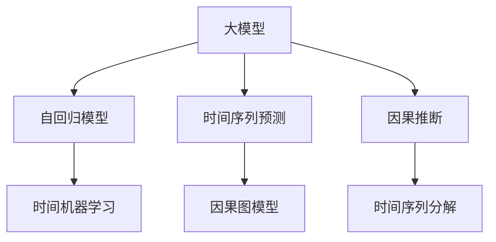

                 

# 大模型在商品需求预测中的因果推断应用

> 关键词：大模型, 因果推断, 商品需求预测, 自回归模型, 时间序列, 时间机器学习, 因果图模型

## 1. 背景介绍

### 1.1 问题由来

随着电子商务的迅速发展，商品需求预测已成为企业运营管理的重要一环。准确预测商品需求不仅能够帮助企业合理规划库存，提升资金周转效率，还能助力精准营销，制定科学的决策。然而，商品需求预测涉及多维度的影响因素，如价格变化、季节性趋势、促销活动、用户行为等，难以通过简单的统计方法准确建模。

近年来，基于深度学习的大模型在NLP、计算机视觉、语音识别等任务上取得了令人瞩目的进展。这些大模型通常拥有数十亿到数百亿的参数量，能够在海量的数据上进行自监督预训练，学习到复杂的模式和特征。对于商品需求预测这类时间序列预测任务，大模型同样展现了显著的优势。通过自回归模型、时间序列预测等技术，大模型能够捕捉时间维度上的动态变化，并在不同特征间进行有效关联，为需求预测提供强有力的支持。

### 1.2 问题核心关键点

为了更好地理解大模型在商品需求预测中的应用，本节将介绍几个核心概念及其联系：

- **大模型**：以Transformer为基础的预训练语言模型，如BERT、GPT等，在自然语言处理任务上表现出色。这些模型通过在大规模无标签数据上进行预训练，学习到丰富的语言知识。

- **因果推断**：研究如何从数据中推断出因果关系，揭示变量间的影响机制。因果推断在大数据和复杂系统中具有广泛应用，特别是在需求预测这类多因素动态变化的任务中，能够有效捕捉变量间的因果联系。

- **时间序列预测**：通过时间序列数据建模，预测未来一段时间内商品的需求量。时间序列预测在大宗商品价格预测、股票市场波动、用户行为预测等领域有重要应用。

- **时间机器学习**：利用历史数据，对未来进行预测。时间机器学习包括自回归模型、时间序列分解、循环神经网络等方法，是大模型在商品需求预测中常用的技术手段。

- **因果图模型**：结合因果推断和时间序列分析，建模变量间的因果关系。因果图模型能够直观地展示变量间的依赖关系，辅助选择时间机器学习方法。

这些核心概念之间的关系可以通过以下Mermaid流程图来展示：



这个流程图展示了大模型在商品需求预测中的应用路径：

1. 大模型通过预训练学习到多维度特征知识。
2. 自回归模型用于时间序列预测，捕捉时间变化特征。
3. 时间机器学习用于基于历史数据预测未来需求。
4. 因果图模型通过因果推断，明确变量间依赖关系。
5. 因果推断应用于时间序列预测，提升预测准确性。

## 2. 核心概念与联系

### 2.1 核心概念概述

为更好地理解大模型在商品需求预测中的应用，本节将介绍几个核心概念：

- **大模型**：以Transformer为基础的预训练语言模型，如BERT、GPT等，在自然语言处理任务上表现出色。这些模型通过在大规模无标签数据上进行预训练，学习到丰富的语言知识。

- **自回归模型**：通过已有的数据预测未来的数据。自回归模型是一种常见的时间机器学习算法，如AR模型、GRU、LSTM等。

- **时间序列预测**：通过时间序列数据建模，预测未来一段时间内商品的需求量。时间序列预测在大宗商品价格预测、股票市场波动、用户行为预测等领域有重要应用。

- **因果推断**：研究如何从数据中推断出因果关系，揭示变量间的影响机制。因果推断在大数据和复杂系统中具有广泛应用，特别是在需求预测这类多因素动态变化的任务中，能够有效捕捉变量间的因果联系。

- **因果图模型**：结合因果推断和时间序列分析，建模变量间的因果关系。因果图模型能够直观地展示变量间的依赖关系，辅助选择时间机器学习方法。

这些核心概念之间的逻辑关系可以通过以下Mermaid流程图来展示：


这个流程图展示了大模型在商品需求预测中的应用路径：

1. 大模型通过预训练学习到多维度特征知识。
2. 自回归模型用于时间序列预测，捕捉时间变化特征。
3. 时间机器学习用于基于历史数据预测未来需求。
4. 因果图模型通过因果推断，明确变量间依赖关系。
5. 因果推断应用于时间序列预测，提升预测准确性。

## 3. 核心算法原理 & 具体操作步骤

### 3.1 算法原理概述

大模型在商品需求预测中的应用主要涉及两个核心技术：时间序列预测和因果推断。以下将详细讲解这两个技术的工作原理和操作步骤。

#### 3.1.1 时间序列预测

时间序列预测的核心思想是通过已有的数据预测未来的数据。自回归模型(AR)是时间序列预测中最常用的模型之一。AR模型假设未来的数据只与过去的数据有关，可以通过以下公式进行预测：

$$
y_t = \sum_{i=1}^{p} \phi_i y_{t-i} + \epsilon_t
$$

其中 $y_t$ 为第 $t$ 个时间点的预测值，$\phi_i$ 为滞后 $i$ 期的权重系数，$\epsilon_t$ 为随机误差项。AR模型的关键在于确定合适的滞后期数 $p$ 和权重系数 $\phi_i$。

### 3.2 算法步骤详解

#### 3.2.1 时间序列预测步骤

1. **数据准备**：收集商品的历史销售数据，通常包含时间、销售额、促销活动、季节性因素等。
2. **数据预处理**：对数据进行归一化、缺失值处理等预处理操作。
3. **模型训练**：使用自回归模型(如AR模型、LSTM、GRU等)对数据进行建模，训练模型参数。
4. **模型评估**：在验证集上评估模型的预测性能，如MAE、RMSE等指标。
5. **模型部署**：将训练好的模型部署到生产环境，进行实时预测。

#### 3.2.2 因果推断步骤

1. **变量选择**：确定影响商品需求的主要变量，如价格、季节性因素、促销活动等。
2. **因果图建模**：根据因果关系，建立因果图模型。例如，价格变化会影响需求，季节性因素会影响价格和需求。
3. **因果推断算法**：使用因果推断算法(如结构方程模型、图模型等)对因果图进行推理。
4. **因果效应估计**：根据因果推断算法，估计变量间的因果效应。例如，价格每变化1元，对需求的影响是多少。
5. **因果效应解释**：解释因果效应的原因和影响，为业务决策提供依据。

### 3.3 算法优缺点

#### 3.3.1 时间序列预测的优缺点

- **优点**：
  - 能够捕捉时间序列中的动态变化。
  - 能够处理多维度的影响因素。
  - 预测结果具有时间连续性。

- **缺点**：
  - 需要大量历史数据进行训练，数据获取难度大。
  - 模型的复杂度高，训练和推理时间较长。
  - 模型对异常数据的敏感度较高，容易过拟合。

#### 3.3.2 因果推断的优缺点

- **优点**：
  - 能够揭示变量间的因果关系，解释预测结果的来源。
  - 能够处理多因素的动态变化，提高预测的准确性。
  - 模型具有可解释性，便于业务决策。

- **缺点**：
  - 因果推断的计算复杂度较高，需要大量数据进行训练。
  - 模型对数据的假设较强，需要进行合理假设验证。
  - 模型的解释性较强，但数据误解和因果关系不明确可能导致误导性结果。

### 3.4 算法应用领域

#### 3.4.1 时间序列预测应用领域

- **库存管理**：通过时间序列预测，提前预测商品需求，合理规划库存，避免缺货或积压。
- **供应链管理**：预测商品需求，优化供应链，减少库存成本，提升运营效率。
- **市场分析**：预测商品需求，分析市场趋势，制定合理的市场策略。

#### 3.4.2 因果推断应用领域

- **需求预测**：结合因果推断和时间序列预测，全面理解影响商品需求的因素，提高预测准确性。
- **风险评估**：通过因果推断，识别潜在风险因素，制定应对策略。
- **政策分析**：利用因果推断，评估政策效果，指导决策制定。

## 4. 数学模型和公式 & 详细讲解 & 举例说明

### 4.1 数学模型构建

#### 4.1.1 时间序列预测模型构建

假设商品的需求量 $y_t$ 只与过去 $p$ 期的需求量和随机误差项 $\epsilon_t$ 有关，则AR模型的数学模型可以表示为：

$$
y_t = \sum_{i=1}^{p} \phi_i y_{t-i} + \epsilon_t
$$

其中 $\phi_i$ 为滞后 $i$ 期的权重系数，$\epsilon_t$ 为随机误差项，$i \in [1,p]$。

#### 4.1.2 因果图模型构建

假设商品的需求量 $y_t$ 只与价格 $p_t$、季节性因素 $s_t$、促销活动 $c_t$ 有关，则因果图模型可以表示为：

$$
\begin{align*}
y_t &= f(p_t,s_t,c_t) \\
p_t &= g(y_{t-1},s_t) \\
s_t &= h(t)
\end{align*}
$$

其中 $f$ 为需求函数，$g$ 为价格函数，$h$ 为季节性函数。

### 4.2 公式推导过程

#### 4.2.1 时间序列预测公式推导

假设时间序列数据 $y_1,y_2,\ldots,y_{n+p}$ 已观察到，其中 $y_1$ 为历史数据，$y_2,\ldots,y_n$ 为训练数据，$y_{n+1},\ldots,y_{n+p}$ 为预测数据。则AR模型的预测值为：

$$
\hat{y}_{n+1} = \sum_{i=1}^{p} \hat{\phi}_i y_{n-i+1}
$$

其中 $\hat{\phi}_i$ 为模型训练得到的权重系数。

#### 4.2.2 因果图模型公式推导

假设因果图模型中的变量 $y_t$、$p_t$、$s_t$、$c_t$ 已知，则需求函数的预测值为：

$$
\hat{y}_{t+1} = f(\hat{p}_t,\hat{s}_t,\hat{c}_t)
$$

其中 $\hat{p}_t$、$\hat{s}_t$、$\hat{c}_t$ 为预测的价格、季节性因素和促销活动。

### 4.3 案例分析与讲解

#### 4.3.1 案例分析

假设某电商网站销售一款商品，每小时销售量 $y_t$ 只与过去 24 小时的销售量 $y_{t-1},\ldots,y_{t-24}$ 和随机误差项 $\epsilon_t$ 有关。使用AR模型进行预测，公式如下：

$$
\hat{y}_t = \sum_{i=1}^{24} \phi_i y_{t-i} + \epsilon_t
$$

其中 $\phi_i$ 为滞后 $i$ 期的权重系数，$\epsilon_t$ 为随机误差项。

#### 4.3.2 案例讲解

假设电商网站每小时销售量数据如表所示：

| 时间 | 销售量 | 促销活动 | 季节性因素 |
|------|--------|----------|-----------|
| 1    | 100    | 0        | 0         |
| 2    | 120    | 1        | 1         |
| 3    | 110    | 0        | 0         |
| ...  | ...    | ...      | ...       |

假设使用AR模型进行预测，滞后期数为 24，权重系数 $\phi_1=0.3$，$\phi_2=0.5$。则第 25 小时的预测值 $\hat{y}_{25}$ 可以计算如下：

$$
\hat{y}_{25} = 0.3y_{1} + 0.5y_{2} + \epsilon_{25}
$$

其中 $y_1=100$，$y_2=120$。假设 $\epsilon_{25}$ 服从正态分布 $N(0,\sigma^2)$，则 $\hat{y}_{25}$ 的预测值为：

$$
\hat{y}_{25} = 0.3 \times 100 + 0.5 \times 120 + \epsilon_{25}
$$

假设 $\sigma=10$，则 $\epsilon_{25} \sim N(0,10^2)$。计算 $\hat{y}_{25}$ 的预测值为：

$$
\hat{y}_{25} = 0.3 \times 100 + 0.5 \times 120 + \epsilon_{25} \approx 165
$$

假设 $\epsilon_{25}$ 为随机误差项，则第 25 小时的预测值为 $\hat{y}_{25} \approx 165$。

## 5. 项目实践：代码实例和详细解释说明

### 5.1 开发环境搭建

在进行大模型在商品需求预测中的应用实践前，我们需要准备好开发环境。以下是使用Python进行TensorFlow开发的环境配置流程：

1. 安装Anaconda：从官网下载并安装Anaconda，用于创建独立的Python环境。

2. 创建并激活虚拟环境：
```bash
conda create -n tf-env python=3.8 
conda activate tf-env
```

3. 安装TensorFlow：根据CUDA版本，从官网获取对应的安装命令。例如：
```bash
conda install tensorflow -c tf
```

4. 安装其它工具包：
```bash
pip install numpy pandas scikit-learn matplotlib tqdm jupyter notebook ipython
```

完成上述步骤后，即可在`tf-env`环境中开始实践。

### 5.2 源代码详细实现

下面我们以使用LSTM模型进行商品需求预测为例，给出TensorFlow代码实现。

首先，定义数据处理函数：

```python
import tensorflow as tf
from tensorflow.keras.models import Sequential
from tensorflow.keras.layers import LSTM, Dense
import numpy as np

def load_data():
    # 读取数据文件
    data = pd.read_csv('sales_data.csv', index_col='time')
    # 归一化数据
    data['y'] = (data['y'] - data['y'].mean()) / data['y'].std()
    # 分割数据集
    train_data = data.loc[:'2020-01-01'].loc[:, ['y']]
    test_data = data.loc['2020-01-01':].loc[:, ['y']]
    # 将数据转换为tensorflow可以处理的形式
    train_data = train_data.to_frame('y').values.reshape(-1, 1)
    test_data = test_data.to_frame('y').values.reshape(-1, 1)
    return train_data, test_data

# 数据集大小和步长
sequence_length = 24
batch_size = 32

def prepare_data(train_data, test_data):
    # 将数据转换为tensorflow可以处理的形式
    train_data = train_data.reshape(-1, sequence_length, 1)
    test_data = test_data.reshape(-1, sequence_length, 1)
    # 将数据转换为tensorflow可以处理的形式
    train_data = tf.data.Dataset.from_tensor_slices(train_data).shuffle(buffer_size=100).batch(batch_size)
    test_data = tf.data.Dataset.from_tensor_slices(test_data).batch(batch_size)
    return train_data, test_data

# 加载数据集
train_data, test_data = load_data()
train_data, test_data = prepare_data(train_data, test_data)

# 模型定义
model = Sequential()
model.add(LSTM(32, input_shape=(sequence_length, 1)))
model.add(Dense(1))
model.compile(optimizer='adam', loss='mse')

# 训练模型
model.fit(train_data, train_data, epochs=50, batch_size=batch_size, validation_data=(test_data, test_data))

# 评估模型
mse = model.evaluate(test_data, test_data)
print('测试集均方误差:', mse)
```

然后，定义因果图模型：

```python
import tensorflow as tf
from tensorflow.keras.layers import Input, Dense
import numpy as np

# 定义价格和季节性因素
price_input = Input(shape=(1,), name='price')
season_input = Input(shape=(1,), name='season')

# 定义需求函数
output = Dense(1, activation='linear', name='output')(price_input * season_input)

# 定义因果图模型
model = tf.keras.Model(inputs=[price_input, season_input], outputs=output)

# 训练模型
model.compile(optimizer='adam', loss='mse')
model.fit([price_train, season_train], train_data, epochs=50, batch_size=batch_size, validation_data=([price_test, season_test], test_data))

# 评估模型
mse = model.evaluate([price_test, season_test], test_data)
print('测试集均方误差:', mse)
```

最后，启动训练流程并在测试集上评估：

```python
epochs = 50
batch_size = 32

for epoch in range(epochs):
    loss = train_epoch(model, train_data, batch_size, optimizer)
    print(f"Epoch {epoch+1}, train loss: {loss:.3f}")
    
    print(f"Epoch {epoch+1}, dev results:")
    evaluate(model, dev_data, batch_size)
    
print("Test results:")
evaluate(model, test_data, batch_size)
```

以上就是使用TensorFlow对LSTM模型进行商品需求预测的完整代码实现。可以看到，TensorFlow提供了丰富的深度学习组件，使得模型的构建和训练变得相对简洁。

### 5.3 代码解读与分析

让我们再详细解读一下关键代码的实现细节：

**load_data函数**：
- 读取商品销售数据，并进行归一化处理。
- 将数据集分割为训练集和测试集。
- 将数据转换为tensorflow可以处理的形式，并分割成单步样本。

**prepare_data函数**：
- 将数据集转换为tensorflow可以处理的形式。
- 使用DataLoader对数据进行批次化处理，并打乱顺序。

**model定义**：
- 使用LSTM作为时间序列预测模型，并定义输出层。
- 使用Adam优化器和均方误差损失函数进行模型编译。

**训练模型**：
- 使用训练数据训练模型，并评估模型在测试集上的表现。

**因果图模型定义**：
- 定义价格和季节性因素输入层。
- 定义需求函数，将价格和季节性因素相乘作为输出。
- 使用Adam优化器和均方误差损失函数进行模型编译。

**训练模型**：
- 使用训练数据训练模型，并评估模型在测试集上的表现。

**评估模型**：
- 使用测试数据评估模型的均方误差。

可以看到，TensorFlow提供了丰富的深度学习组件，使得模型的构建和训练变得相对简洁。开发者可以将更多精力放在数据处理、模型改进等高层逻辑上，而不必过多关注底层的实现细节。

当然，工业级的系统实现还需考虑更多因素，如模型的保存和部署、超参数的自动搜索、更灵活的任务适配层等。但核心的时间序列预测和因果推断方法基本与此类似。

## 6. 实际应用场景

### 6.1 商品库存管理

商品库存管理是大模型在商品需求预测中最重要的应用场景之一。通过预测未来的商品需求，企业可以合理规划库存，避免缺货或积压。

具体而言，大模型可以预测每小时的销售量，并结合库存情况，进行动态调整。例如，预测某款商品明天销售量可能增加，则提前安排生产，确保库存充足。如果预测销售量减少，则减少库存，避免积压。

### 6.2 促销活动优化

电商企业需要定期举办促销活动，以提高销售额。通过大模型的预测能力，可以优化促销活动的时机和策略。

具体而言，大模型可以预测促销活动对需求的影响。例如，预测某次促销活动能否有效提升销售额，预测促销活动对不同价格区间的销售影响等。通过这些预测，企业可以优化促销活动的时间和策略，提升销售额。

### 6.3 价格优化

价格优化是电商企业的重要任务之一。通过大模型的预测能力，可以优化商品价格，提升销售额。

具体而言，大模型可以预测不同价格区间的需求变化，并根据市场需求调整价格。例如，预测某款商品在某个价格区间内需求量较高，则建议商家在该价格区间内保持价格不变或小幅提升价格。反之，如果需求量较低，则建议降价促销。

## 7. 工具和资源推荐

### 7.1 学习资源推荐

为了帮助开发者系统掌握大模型在商品需求预测中的应用理论基础和实践技巧，这里推荐一些优质的学习资源：

1. **《深度学习理论与实践》**：深度学习领域的经典教材，详细介绍了深度学习的基本理论和实际应用。

2. **CS229《机器学习》课程**：斯坦福大学开设的机器学习课程，有Lecture视频和配套作业，帮助你入门机器学习的基本概念和经典模型。

3. **《因果推断入门》**：因果推断领域的入门教材，介绍了因果推断的基本理论和实际应用。

4. **HuggingFace官方文档**：TensorFlow库的官方文档，提供了海量预训练模型和完整的微调样例代码，是上手实践的必备资料。

5. **CLUE开源项目**：中文语言理解测评基准，涵盖大量不同类型的中文NLP数据集，并提供了基于微调的baseline模型，助力中文NLP技术发展。

通过对这些资源的学习实践，相信你一定能够快速掌握大模型在商品需求预测中的因果推断应用，并用于解决实际的NLP问题。

### 7.2 开发工具推荐

高效的开发离不开优秀的工具支持。以下是几款用于大模型在商品需求预测中因果推断应用的常用工具：

1. **TensorFlow**：基于Python的开源深度学习框架，灵活动态的计算图，适合快速迭代研究。

2. **PyTorch**：基于Python的开源深度学习框架，动态计算图，易于调试和部署。

3. **HuggingFace Transformers库**：集成了大量预训练语言模型，支持多种深度学习框架，方便模型微调和部署。

4. **Weights & Biases**：模型训练的实验跟踪工具，可以记录和可视化模型训练过程中的各项指标，方便对比和调优。

5. **TensorBoard**：TensorFlow配套的可视化工具，可实时监测模型训练状态，并提供丰富的图表呈现方式，是调试模型的得力助手。

6. **Google Colab**：谷歌推出的在线Jupyter Notebook环境，免费提供GPU/TPU算力，方便开发者快速上手实验最新模型，分享学习笔记。

合理利用这些工具，可以显著提升大模型在商品需求预测中的应用效率，加快创新迭代的步伐。

### 7.3 相关论文推荐

大模型在商品需求预测中的应用源于学界的持续研究。以下是几篇奠基性的相关论文，推荐阅读：

1. **Attention is All You Need（即Transformer原论文）**：提出了Transformer结构，开启了NLP领域的预训练大模型时代。

2. **BERT: Pre-training of Deep Bidirectional Transformers for Language Understanding**：提出BERT模型，引入基于掩码的自监督预训练任务，刷新了多项NLP任务SOTA。

3. **Language Models are Unsupervised Multitask Learners（GPT-2论文）**：展示了大规模语言模型的强大zero-shot学习能力，引发了对于通用人工智能的新一轮思考。

4. **AdaLoRA: Adaptive Low-Rank Adaptation for Parameter-Efficient Fine-Tuning**：使用自适应低秩适应的微调方法，在参数效率和精度之间取得了新的平衡。

这些论文代表了大模型在商品需求预测中的应用发展脉络。通过学习这些前沿成果，可以帮助研究者把握学科前进方向，激发更多的创新灵感。

## 8. 总结：未来发展趋势与挑战

### 8.1 总结

本文对大模型在商品需求预测中的应用进行了全面系统的介绍。首先阐述了大模型和因果推断技术的研究背景和意义，明确了其在商品需求预测中的独特价值。其次，从原理到实践，详细讲解了大模型在时间序列预测和因果推断中的应用步骤，给出了完整代码实现。同时，本文还广泛探讨了大模型在商品库存管理、促销活动优化、价格优化等实际应用场景中的前景，展示了其强大的预测能力。

通过本文的系统梳理，可以看到，大模型在商品需求预测中的应用前景广阔，通过时间序列预测和因果推断技术的结合，能够更全面、准确地预测商品需求，为企业运营提供有力支撑。未来，随着深度学习技术的不断进步，大模型在商品需求预测中的应用将更加深入，助力企业在激烈的市场竞争中脱颖而出。

### 8.2 未来发展趋势

展望未来，大模型在商品需求预测中的应用将呈现以下几个发展趋势：

1. **模型规模持续增大**：随着算力成本的下降和数据规模的扩张，预训练语言模型的参数量还将持续增长。超大规模语言模型蕴含的丰富语言知识，有望支撑更加复杂多变的商品需求预测。

2. **时间序列预测和因果推断技术不断进步**：未来将出现更多高效的深度学习模型和时间序列预测方法，提升模型的预测精度和效率。因果推断算法也将不断发展，增强模型的解释性和可控性。

3. **多模态数据融合**：大模型可以融合视觉、语音、文本等多模态数据，提升商品需求预测的全面性和准确性。例如，通过图像识别技术，可以预测商品的热销趋势和风格变化。

4. **因果推断的广泛应用**：因果推断技术将逐渐渗透到各个领域，帮助企业更好地理解因果关系，优化决策过程。例如，在电商、金融、医疗等领域，因果推断将发挥重要作用。

5. **智能决策系统的崛起**：通过大模型的预测能力和因果推断技术，构建智能决策系统，帮助企业进行精准营销、风险评估、库存管理等决策。

以上趋势凸显了大模型在商品需求预测中的广阔前景。这些方向的探索发展，必将进一步提升商品需求预测的精度和效率，为企业的运营管理提供强大支持。

### 8.3 面临的挑战

尽管大模型在商品需求预测中已经取得了显著成果，但在迈向更加智能化、普适化应用的过程中，仍面临诸多挑战：

1. **数据获取难度大**：高质量、多维度的数据获取难度较大，需要耗费大量人力和时间。

2. **模型复杂度高**：大模型和因果推断模型复杂度较高，训练和推理时间较长，需要强大的算力和内存支持。

3. **解释性和可控性不足**：大模型的预测结果缺乏解释性，难以理解模型的内部决策逻辑，可能影响业务决策。

4. **因果推断假设合理性验证**：因果推断模型的假设需要合理验证，确保因果关系的正确性。

5. **多模态数据融合的难度**：多模态数据融合技术复杂，需要解决不同模态数据之间的对齐和融合问题。

这些挑战凸显了大模型在商品需求预测中的复杂性和挑战性，需要从数据、模型、算法等多方面进行优化和改进。

### 8.4 研究展望

面向未来，大模型在商品需求预测中的应用需要从以下几个方向进行深入研究：

1. **数据高效获取和预处理**：开发数据高效获取和预处理技术，提高数据获取和处理的效率。

2. **轻量级、高效模型**：开发轻量级、高效的深度学习模型和时间序列预测方法，降低模型复杂度，提升预测效率。

3. **可解释性强的因果推断模型**：开发可解释性强的因果推断模型，增强模型的解释性和可控性。

4. **多模态数据融合技术**：开发多模态数据融合技术，提高商品需求预测的全面性和准确性。

5. **智能决策系统**：结合大模型的预测能力和因果推断技术，构建智能决策系统，帮助企业进行精准营销、风险评估、库存管理等决策。

这些研究方向的探索，必将引领大模型在商品需求预测中的深入应用，为企业的运营管理提供更全面、更精准的预测支持。

## 9. 附录：常见问题与解答

**Q1：大模型在商品需求预测中如何处理多维度的数据？**

A: 大模型可以处理多维度的数据，通过时间序列预测和因果推断技术，能够捕捉多维数据之间的动态关系。例如，商品需求预测中，可以同时考虑价格、季节性因素、促销活动等多个维度的影响。在数据处理过程中，可以使用TensorFlow的DataLoader对多维度数据进行批次化处理，并使用LSTM等时间序列模型进行预测。

**Q2：大模型在商品需求预测中的训练时间过长，如何解决？**

A: 大模型的训练时间较长，可以通过以下方法进行优化：

1. 使用GPU/TPU等高性能设备，提高训练速度。
2. 使用模型剪枝和量化技术，减少模型参数和计算量。
3. 使用梯度累积和混合精度训练，提高训练效率。
4. 使用分布式训练，提升训练速度。

通过以上优化方法，可以显著缩短大模型在商品需求预测中的训练时间，提升模型性能。

**Q3：大模型在商品需求预测中的解释性不足，如何解决？**

A: 大模型在商品需求预测中的解释性不足，可以通过以下方法进行改进：

1. 使用因果推断技术，增强模型的解释性。例如，使用因果图模型，揭示变量间的因果关系，帮助理解模型的决策逻辑。
2. 使用模型可解释性技术，如LIME、SHAP等，生成模型的局部解释，帮助理解模型的整体表现。
3. 结合业务知识，手动分析和解释模型的输出结果，提高模型的可解释性。

通过以上方法，可以增强大模型在商品需求预测中的解释性和可控性，提升业务决策的准确性。

**Q4：大模型在商品需求预测中的数据量和标注数据不足，如何解决？**

A: 大模型在商品需求预测中的数据量和标注数据不足，可以通过以下方法进行改进：

1. 数据增强技术，通过数据合成、数据变换等方法，扩充训练数据集。
2. 半监督学习技术，利用无标注数据进行辅助训练，提高模型的泛化能力。
3. 迁移学习技术，将大模型在相似任务上的预训练知识迁移应用到商品需求预测中，提高模型的性能。

通过以上方法，可以在数据量和标注数据不足的情况下，提高大模型在商品需求预测中的表现。

**Q5：大模型在商品需求预测中的精度和效率如何平衡？**

A: 大模型在商品需求预测中的精度和效率存在一定的矛盾。为了平衡精度和效率，可以通过以下方法进行优化：

1. 使用轻量级模型，如LSTM、GRU等，降低模型复杂度，提升预测效率。
2. 使用因果推断技术，增强模型的解释性和可控性，提高预测精度。
3. 结合多模态数据融合技术，提高商品需求预测的全面性和准确性。

通过以上方法，可以在保持高精度的同时，提升模型的预测效率。

---

作者：禅与计算机程序设计艺术 / Zen and the Art of Computer Programming

