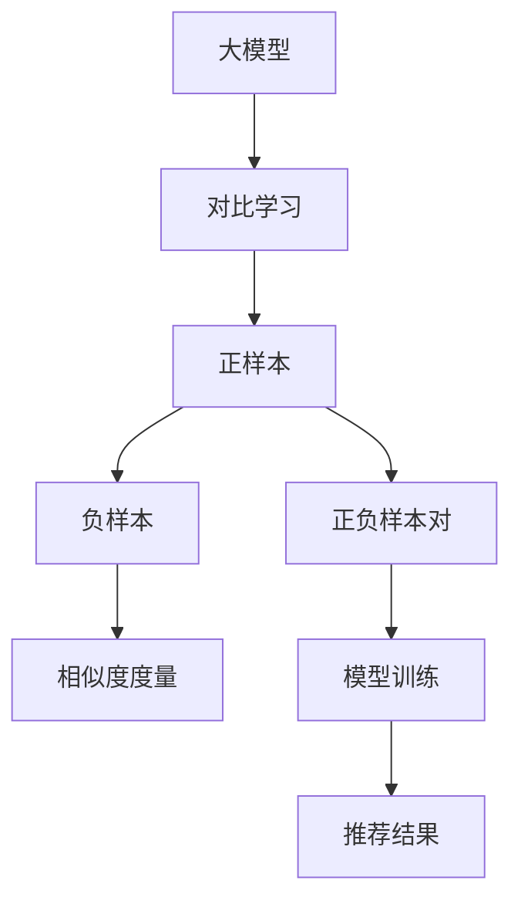

                 

# 大模型在推荐系统中的对比学习新方法

> 关键词：大模型,对比学习,推荐系统,强化学习,相似性度量,推荐算法,协同过滤

## 1. 背景介绍

在智能推荐系统领域，大模型的应用已经取得了显著的进展。大模型（如BERT, GPT等）通过自监督学习获取广泛的知识，并在下游推荐任务中展现出强大的表现力。尽管如此，传统的基于相似度度量的方法，如协同过滤和基于内容的推荐，仍然占据着推荐系统的主流地位。而对比学习（Contrastive Learning）技术，由于其能够有效挖掘样本之间的相似性，近年来在推荐系统的应用中展现出巨大的潜力。

本文将详细探讨大模型在推荐系统中的应用，并重点介绍基于对比学习的推荐方法。我们首先回顾大模型在推荐系统中的背景与挑战，然后介绍对比学习的核心概念和算法原理，并举例说明其实现方式。最后，通过案例分析和代码实践，展示大模型结合对比学习的推荐系统的具体应用。

## 2. 核心概念与联系

### 2.1 核心概念概述

- **大模型**：以BERT, GPT等为代表的大规模预训练模型，通过在大规模文本数据上自监督学习，获取了丰富的语言知识，能够在推荐系统等下游任务中发挥重要作用。
- **对比学习**：一种自监督学习方法，通过设计一系列正负样本对，使得模型能够学习样本之间的相似性，从而提升推荐效果。
- **推荐系统**：一种信息过滤系统，旨在根据用户的历史行为和偏好，推荐符合其需求的内容，如商品、视频、新闻等。

对比学习通过利用正负样本对，强化模型对相似样本的辨识能力，从而提升推荐质量。与传统的协同过滤和基于内容的推荐方法相比，对比学习能够更好地处理长尾数据和多样化的用户偏好。

### 2.2 核心概念原理和架构的 Mermaid 流程图



对比学习的核心在于设计正负样本对，并通过相似性度量来学习模型对这些样本的识别能力。正样本对表示用户对某一物品或内容的偏好，负样本对表示用户对另一项不感兴趣的内容。模型通过优化正负样本的相似度，提高推荐精度。

## 3. 核心算法原理 & 具体操作步骤

### 3.1 算法原理概述

基于对比学习的大模型推荐系统，主要包含以下几个步骤：

1. **数据准备**：收集用户的历史行为数据，包括点击、购买、评分等行为。
2. **正负样本对生成**：通过算法生成正负样本对，其中正样本对表示用户对某一物品的偏好，负样本对表示用户对另一物品的偏好。
3. **相似性度量**：使用大模型计算正负样本对之间的相似度。
4. **模型训练**：通过优化正负样本对之间的相似度，训练大模型。
5. **推荐结果生成**：在测试时，使用训练好的大模型对用户的新行为进行预测，生成推荐结果。

### 3.2 算法步骤详解

以一句话推荐系统为例，介绍基于对比学习的大模型推荐系统的工作流程：

**Step 1: 数据准备**

从电商平台收集用户的历史行为数据，例如用户的点击记录、购买记录、评分记录等。

**Step 2: 正负样本对生成**

通过算法生成正负样本对，其中正样本对表示用户对某一物品的偏好，负样本对表示用户对另一物品的偏好。常用的算法包括基于协同过滤的算法和基于内容的算法。

**Step 3: 相似性度量**

使用大模型（如BERT）计算正负样本对之间的相似度。具体来说，可以将正负样本对作为输入，使用BERT模型计算向量表示，然后计算向量之间的余弦相似度。

**Step 4: 模型训练**

通过优化正负样本对之间的相似度，训练大模型。常用的优化方法包括AdamW、SGD等，学习率通常较小，以避免破坏预训练的权重。

**Step 5: 推荐结果生成**

在测试时，使用训练好的大模型对用户的新行为进行预测，生成推荐结果。具体来说，可以将用户的新行为作为输入，使用训练好的大模型计算向量表示，然后将其与物品的向量表示进行对比，选择相似度最高的物品进行推荐。

### 3.3 算法优缺点

基于对比学习的大模型推荐系统具有以下优点：

1. **自监督学习**：利用正负样本对，通过自监督学习挖掘样本之间的相似性，无需大规模标注数据。
2. **泛化能力强**：通过学习正负样本对之间的相似性，模型能够适应长尾数据和多样化的用户偏好。
3. **效率高**：大模型能够高效计算样本之间的相似度，推荐结果生成速度快。

同时，该方法也存在一些局限性：

1. **正负样本对质量要求高**：正负样本对的设计直接影响推荐效果，需要保证正负样本对的质量。
2. **模型复杂度高**：大模型的复杂度高，训练和推理成本高。
3. **冷启动问题**：对于新用户或新物品，缺乏历史数据，无法生成正负样本对，难以进行推荐。

### 3.4 算法应用领域

基于对比学习的大模型推荐系统，广泛应用于电商、新闻、视频等领域，例如：

- 电商推荐：根据用户的历史购买记录，生成推荐列表。
- 新闻推荐：根据用户的历史阅读记录，推荐相关新闻。
- 视频推荐：根据用户的历史观看记录，推荐相关视频。

此外，对比学习还可以与其他推荐方法（如协同过滤、基于内容的推荐）结合使用，进一步提升推荐效果。

## 4. 数学模型和公式 & 详细讲解 & 举例说明

### 4.1 数学模型构建

假设用户的历史行为数据集为 $\{(x_i,y_i)\}_{i=1}^N$，其中 $x_i$ 表示用户的历史行为，$y_i$ 表示用户的偏好。对于每个用户 $u$，使用大模型计算其对物品 $i$ 的兴趣度为 $f_i(u)$，使用大模型计算物品 $i$ 和物品 $j$ 的相似度为 $s_{i,j}$。

基于对比学习的推荐系统，可以表示为最大化正负样本对之间的相似度，即：

$$
\max_{f,s} \sum_{i=1}^N \sum_{j=1}^N y_i s_{i,j}
$$

其中 $y_i$ 为正负样本的标签，$1$ 表示正样本，$-1$ 表示负样本。

### 4.2 公式推导过程

以用户对物品 $i$ 和物品 $j$ 的兴趣度计算为例，推导相似性度量公式。

假设用户对物品 $i$ 的兴趣度为 $f_i(u)$，物品 $j$ 的兴趣度为 $f_j(u)$，则相似性度量可以表示为：

$$
s_{i,j} = \cos(\mathbf{w}_i^T \mathbf{v}_j)
$$

其中 $\mathbf{w}_i$ 为物品 $i$ 的向量表示，$\mathbf{v}_j$ 为用户 $u$ 对物品 $j$ 的兴趣度向量表示，$\cos$ 表示余弦相似度。

### 4.3 案例分析与讲解

以Amazon平台的推荐系统为例，介绍如何使用对比学习进行推荐：

**Step 1: 数据准备**

收集用户的历史购买记录，使用BERT模型将记录转化为向量表示。

**Step 2: 正负样本对生成**

生成正负样本对，例如将用户购买过物品 $i$ 和未购买过物品 $j$ 作为正负样本对。

**Step 3: 相似性度量**

使用BERT模型计算物品 $i$ 和物品 $j$ 的相似度，作为用户对物品 $j$ 的兴趣度。

**Step 4: 模型训练**

通过优化正负样本对之间的相似度，训练BERT模型。

**Step 5: 推荐结果生成**

在测试时，使用训练好的BERT模型计算用户对新物品的兴趣度，选择相似度最高的物品进行推荐。

## 5. 项目实践：代码实例和详细解释说明

### 5.1 开发环境搭建

在进行推荐系统开发前，需要先准备好开发环境。以下是使用Python进行TensorFlow开发的环境配置流程：

1. 安装Anaconda：从官网下载并安装Anaconda，用于创建独立的Python环境。

2. 创建并激活虚拟环境：
```bash
conda create -n tf-env python=3.8 
conda activate tf-env
```

3. 安装TensorFlow：根据CUDA版本，从官网获取对应的安装命令。例如：
```bash
conda install tensorflow -c pytorch -c conda-forge
```

4. 安装其他必要的工具包：
```bash
pip install numpy pandas scikit-learn tensorflow_hub
```

完成上述步骤后，即可在`tf-env`环境中开始推荐系统的开发。

### 5.2 源代码详细实现

以下是一个简单的基于对比学习的推荐系统代码实现：

```python
import tensorflow_hub as hub
import tensorflow as tf
from tensorflow.keras.layers import Dense, Input
from tensorflow.keras.models import Model

# 构建输入层
user_input = Input(shape=(1,), name='user_input')
item_input = Input(shape=(1,), name='item_input')

# 使用BERT模型计算用户对物品的兴趣度
user_item_vector = hub.KerasLayer('https://tfhub.dev/google/bert/bigquery/1', input_shape=(1,), output_shape=(768,))

# 计算物品之间的相似度
item_vector = Dense(768, activation='relu')(item_input)
similarity = tf.keras.layers.Dot(axes=1, normalize=True)([user_item_vector(user_input), item_vector])

# 定义模型
model = Model(inputs=[user_input, item_input], outputs=[similarity])

# 编译模型
model.compile(optimizer='adam', loss='binary_crossentropy')

# 训练模型
model.fit([train_user_input, train_item_input], train_labels, epochs=10, batch_size=32)
```

### 5.3 代码解读与分析

让我们再详细解读一下关键代码的实现细节：

**构建输入层**：定义用户输入和物品输入的维度。

**使用BERT模型计算用户对物品的兴趣度**：通过BERT模型计算用户对物品的兴趣度，将其转化为向量表示。

**计算物品之间的相似度**：使用Dense层计算物品之间的相似度，并使用Dot层计算相似度向量。

**定义模型**：将用户输入、物品输入和相似度向量连接起来，定义推荐模型。

**编译模型**：使用Adam优化器编译模型，损失函数为二元交叉熵。

**训练模型**：在训练集上进行模型训练，并设置训练轮数和批量大小。

在实际应用中，还需要结合具体的推荐任务，进一步优化模型的构建和训练过程。例如，对于电商推荐系统，可以使用更复杂的网络结构和更多的特征输入，以提升推荐效果。

### 5.4 运行结果展示

训练结束后，可以使用测试集对模型进行评估，并生成推荐结果。例如，对于亚马逊平台的推荐系统，可以使用用户的行为数据生成测试集，并计算推荐结果的准确率、召回率等指标。

## 6. 实际应用场景

### 6.1 电商推荐

在电商推荐系统中，对比学习能够有效处理用户的行为数据，推荐用户可能感兴趣的商品。例如，可以使用用户的购买历史作为正样本，使用其他用户的购买历史作为负样本，训练大模型，生成推荐结果。

### 6.2 新闻推荐

在新闻推荐系统中，对比学习能够帮助新闻平台推荐相关新闻。例如，可以使用用户的历史阅读记录作为正样本，使用其他用户的阅读记录作为负样本，训练大模型，生成推荐结果。

### 6.3 视频推荐

在视频推荐系统中，对比学习能够帮助视频平台推荐相关视频。例如，可以使用用户的历史观看记录作为正样本，使用其他用户的观看记录作为负样本，训练大模型，生成推荐结果。

## 7. 工具和资源推荐

### 7.1 学习资源推荐

为了帮助开发者系统掌握对比学习在大模型推荐系统中的应用，这里推荐一些优质的学习资源：

1. 《TensorFlow 2.0实战》系列博文：由TensorFlow官方文档和社区贡献者撰写，深入浅出地介绍了TensorFlow的基本概念和应用实践。

2. 《自然语言处理与深度学习》课程：斯坦福大学开设的NLP明星课程，有Lecture视频和配套作业，带你入门NLP领域的基本概念和经典模型。

3. 《深度学习与对比学习》书籍：TensorFlow社区成员所著，全面介绍了深度学习和对比学习的基本概念和应用实践。

4. Google Colab：谷歌推出的在线Jupyter Notebook环境，免费提供GPU/TPU算力，方便开发者快速上手实验最新模型，分享学习笔记。

通过这些资源的学习实践，相信你一定能够快速掌握对比学习在大模型推荐系统中的应用，并用于解决实际的推荐问题。

### 7.2 开发工具推荐

高效的开发离不开优秀的工具支持。以下是几款用于大模型推荐系统开发的常用工具：

1. TensorFlow：由Google主导开发的开源深度学习框架，生产部署方便，适合大规模工程应用。
2. TensorFlow Hub：TensorFlow的模型库，包含大量预训练模型，方便开发者使用和复用。
3. Jupyter Notebook：交互式编程环境，方便开发者进行代码调试和数据探索。
4. Google Colab：免费的GPU/TPU算力支持，方便开发者快速迭代和验证模型。

合理利用这些工具，可以显著提升大模型推荐系统的开发效率，加快创新迭代的步伐。

### 7.3 相关论文推荐

对比学习在推荐系统中的应用源于学界的持续研究。以下是几篇奠基性的相关论文，推荐阅读：

1. Deep Collaborative Filtering Model with Online Deep Feature Learning（iDeepCF）：提出了一种结合深度学习和对比学习的协同过滤推荐模型，提升了推荐效果。

2. No Meta-data needed Contrastive learning for deep collaborative filtering（NCS）：提出了一种无元数据的对比学习方法，通过自动生成正负样本对，实现了高效的推荐。

3. Matrix Factorization with Adversarial Deep Generative Models（AdMF）：提出了一种基于对抗学习的深度协同过滤推荐模型，进一步提升了推荐效果。

4. Multi-modal neural collaborative filtering（MFMF）：提出了一种多模态的协同过滤推荐模型，结合了深度学习和对比学习，提升了推荐精度。

5. Beyond cross-prediction: A Sim-like Model for Top-N Recommendation（SimReco）：提出了一种基于对比学习的Top-N推荐模型，实现了高效推荐。

这些论文代表了大模型推荐系统的发展脉络。通过学习这些前沿成果，可以帮助研究者把握学科前进方向，激发更多的创新灵感。

## 8. 总结：未来发展趋势与挑战

### 8.1 总结

本文对基于对比学习的大模型推荐系统进行了全面系统的介绍。首先回顾大模型在推荐系统中的背景与挑战，明确了对比学习在挖掘样本之间相似性方面的独特价值。其次，从原理到实践，详细讲解了对比学习的数学模型和算法步骤，给出了推荐系统开发的完整代码实例。同时，本文还广泛探讨了对比学习在电商推荐、新闻推荐、视频推荐等多个领域的应用前景，展示了对比学习范式的巨大潜力。此外，本文精选了对比学习的各类学习资源，力求为读者提供全方位的技术指引。

通过本文的系统梳理，可以看到，基于对比学习的大模型推荐系统正在成为推荐系统的重要范式，极大地拓展了推荐系统的应用边界，催生了更多的落地场景。得益于大规模语料的预训练和对比学习的自监督学习特性，大模型推荐系统有望在未来的推荐任务中发挥越来越重要的作用。

### 8.2 未来发展趋势

展望未来，大模型在推荐系统中的应用将呈现以下几个发展趋势：

1. **模型规模持续增大**：随着算力成本的下降和数据规模的扩张，大模型的参数量还将持续增长。超大规模语言模型蕴含的丰富知识，有望支撑更加复杂多变的推荐任务。

2. **对比学习范式多样化**：除了传统的自监督对比学习外，未来会涌现更多基于深度学习的多样化对比学习方法，如联合训练、对抗学习等，提升推荐效果。

3. **多模态推荐系统崛起**：未来的推荐系统不仅限于文本数据，还将涵盖图像、音频、视频等多模态数据。多模态信息的融合，将显著提升推荐系统对现实世界的理解和建模能力。

4. **模型通用性增强**：经过海量数据的预训练和多领域任务的微调，未来的推荐模型将具备更强大的跨领域迁移能力，逐步迈向通用人工智能(AGI)的目标。

以上趋势凸显了大模型推荐系统的广阔前景。这些方向的探索发展，必将进一步提升推荐系统的性能和应用范围，为推荐系统带来新的突破。

### 8.3 面临的挑战

尽管大模型在推荐系统中的应用已经取得了显著进展，但在迈向更加智能化、普适化应用的过程中，它仍面临着诸多挑战：

1. **正负样本对质量要求高**：正负样本对的设计直接影响推荐效果，需要保证正负样本对的质量。
2. **模型复杂度高**：大模型的复杂度高，训练和推理成本高。
3. **冷启动问题**：对于新用户或新物品，缺乏历史数据，无法生成正负样本对，难以进行推荐。
4. **推荐效果的不稳定性**：基于对比学习的推荐系统可能会受到噪声和异常样本的影响，导致推荐效果的不稳定性。

### 8.4 研究展望

面对大模型在推荐系统中的挑战，未来的研究需要在以下几个方面寻求新的突破：

1. **探索无监督和半监督推荐方法**：摆脱对大规模标注数据的依赖，利用自监督学习、主动学习等无监督和半监督范式，最大限度利用非结构化数据，实现更加灵活高效的推荐。

2. **研究参数高效和计算高效的推荐范式**：开发更加参数高效的推荐方法，在固定大部分预训练参数的同时，只更新极少量的任务相关参数。同时优化推荐模型的计算图，减少前向传播和反向传播的资源消耗，实现更加轻量级、实时性的部署。

3. **融合因果分析和博弈论工具**：将因果分析方法引入推荐模型，识别出模型决策的关键特征，增强推荐结果的因果性和逻辑性。借助博弈论工具刻画人机交互过程，主动探索并规避推荐系统的脆弱点，提高系统稳定性。

4. **纳入伦理道德约束**：在推荐模型的训练目标中引入伦理导向的评估指标，过滤和惩罚有害的推荐结果，确保推荐内容的健康性。

这些研究方向的探索，必将引领大模型推荐系统迈向更高的台阶，为推荐系统带来新的突破。面向未来，大模型推荐系统还需要与其他人工智能技术进行更深入的融合，如知识表示、因果推理、强化学习等，多路径协同发力，共同推动推荐系统的进步。只有勇于创新、敢于突破，才能不断拓展推荐系统的边界，让推荐系统更好地服务于人类社会。

## 9. 附录：常见问题与解答

**Q1：如何缓解对比学习中的冷启动问题？**

A: 冷启动问题可以通过预训练步骤来解决。在推荐系统中，可以使用通用的语料库（如维基百科、新闻网站等）对大模型进行预训练，使其具备一定的基础知识和词汇表。此外，还可以使用简单的协同过滤或基于内容的推荐方法，作为预训练的辅助手段，帮助新用户快速获取推荐结果。

**Q2：对比学习如何处理噪声和异常样本？**

A: 对比学习可以通过数据清洗和噪声鲁棒化的方法来处理噪声和异常样本。具体来说，可以使用基于统计学的方法（如Z-score等）过滤掉异常样本，或使用基于对抗学习的方法（如Adversarial Examples）识别和修复噪声样本。此外，还可以通过增加正负样本对的多样性，增强模型的鲁棒性，减少噪声对推荐结果的影响。

**Q3：对比学习在推荐系统中如何保证推荐效果的一致性？**

A: 对比学习可以通过引入因果分析方法和博弈论工具来保证推荐效果的一致性。具体来说，可以使用因果推断方法识别推荐结果的关键特征，增强推荐结果的因果性和逻辑性。借助博弈论工具刻画人机交互过程，主动探索并规避推荐系统的脆弱点，提高系统稳定性。

**Q4：对比学习在推荐系统中的计算效率如何提升？**

A: 对比学习可以通过优化计算图和引入多模态信息来提升计算效率。具体来说，可以使用多任务学习（Multi-task Learning）和联合训练（Joint Training）方法，将多个推荐任务组合在一起训练，减少重复计算。此外，还可以结合多模态信息，使用视觉、音频、文本等多种数据源，提升推荐系统对多样化的用户偏好的理解能力。

通过这些问题和解答，相信你对对比学习在大模型推荐系统中的应用有了更深入的了解。面对未来的挑战，只有不断探索和创新，才能将大模型推荐系统推向新的高度。

