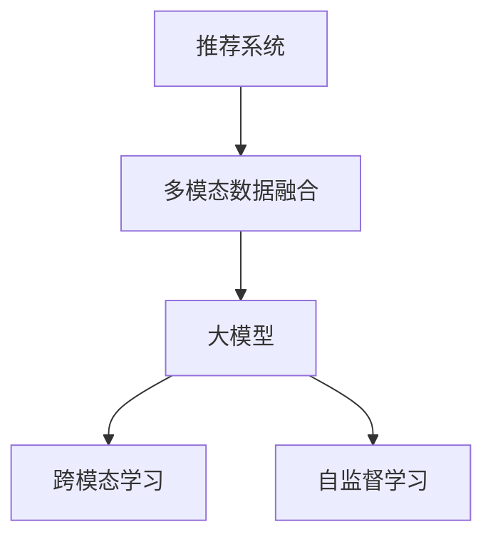

                 

## 1. 背景介绍

随着互联网技术的飞速发展，推荐系统已经成为电商、新闻、社交等众多互联网服务中不可或缺的一部分。推荐系统的核心任务是从庞大的数据集合中筛选出符合用户兴趣的商品、新闻、文章等内容，帮助用户发现更有价值的信息，提升用户体验。然而，传统推荐系统往往仅依赖于用户行为数据进行推荐，难以捕捉到用户多维度的信息，从而影响了推荐的准确性和多样性。

近年来，多模态融合技术逐渐被引入推荐系统领域，借助用户行为、文本、图像等多种数据源，可以更全面地了解用户特征，提升推荐效果。大模型在多模态融合中的作用尤为显著，其强大的跨模态学习能力和自监督学习能力，可以高效地对多源数据进行联合建模，实现更精准的推荐。

## 2. 核心概念与联系

### 2.1 核心概念概述

为更好地理解大模型在推荐系统多模态融合中的应用，本节将介绍几个密切相关的核心概念：

- **推荐系统**：通过用户的历史行为数据、兴趣标签等，为用户推荐个性化信息。推荐系统已经成为互联网服务的重要组成部分，广泛应用于电商、新闻、社交等领域。
- **多模态数据融合**：将用户行为数据、文本数据、图像数据等多种数据源进行联合建模，获取用户多维度的信息，提升推荐效果。
- **大模型**：指通过大规模无监督学习，具备强大自监督能力和跨模态学习能力的人工智能模型。常见的有BERT、GPT等。
- **跨模态学习**：指不同模态的数据（如图像、文本、声音等）之间的学习，通过将多模态数据融合到一个模型中，实现跨模态信息的共享与互补。
- **自监督学习**：指模型在没有标签的数据上进行学习，利用数据的内部结构和特征，实现对目标任务的预测或推理。

这些核心概念之间的逻辑关系可以通过以下Mermaid流程图来展示：



这个流程图展示了大模型在推荐系统多模态融合中的作用：

1. 推荐系统依赖于多模态数据融合获取用户多维度信息。
2. 多模态数据融合通过大模型实现，大模型具备跨模态学习能力。
3. 大模型利用自监督学习，在没有标签数据上学习模式和结构。

## 3. 核心算法原理 & 具体操作步骤

### 3.1 算法原理概述

大模型在推荐系统多模态融合中的应用，主要依赖于其在跨模态学习和自监督学习上的能力。通过多模态数据融合，大模型能够将不同模态的数据转换为统一的表示，捕捉不同数据源之间的关系，实现跨模态信息的共享与互补。同时，大模型通过自监督学习，利用无标签数据挖掘用户潜在的兴趣和行为模式，提升推荐系统的个性化和准确性。

具体而言，大模型在推荐系统中的应用可以分为以下几个步骤：

1. **数据收集与预处理**：收集用户的多种数据源，包括文本评论、行为记录、图片、视频等，进行数据清洗和标准化处理。
2. **多模态数据融合**：利用大模型对不同模态的数据进行联合建模，学习不同模态数据之间的关系，形成多维度的用户表征。
3. **跨模态学习**：通过多模态数据融合，大模型能够捕捉不同模态之间的潜在关联，实现跨模态信息的共享与互补。
4. **自监督学习**：利用无标签数据，大模型能够自动学习用户的兴趣和行为模式，提升推荐系统的个性化和准确性。
5. **推荐预测**：基于多模态融合和自监督学习得到的用户表征，大模型能够进行推荐预测，生成个性化推荐结果。

### 3.2 算法步骤详解

以下我们将详细讲解大模型在推荐系统多模态融合中的具体操作流程。

**Step 1: 数据收集与预处理**

收集用户的多种数据源，包括文本评论、行为记录、图片、视频等，并进行预处理。具体步骤如下：

1. **文本数据处理**：使用自然语言处理技术对文本数据进行清洗、分词、去除停用词等预处理，得到用户评论、新闻、文章等文本内容。
2. **行为数据处理**：收集用户的历史行为数据，如浏览记录、购买记录、点击记录等，进行归一化和格式化处理。
3. **图像和视频数据处理**：使用计算机视觉技术对图像和视频数据进行预处理，如裁剪、缩放、归一化等操作，提取用户对图像和视频的兴趣标签。

**Step 2: 多模态数据融合**

使用大模型对不同模态的数据进行联合建模，学习不同模态数据之间的关系，形成多维度的用户表征。具体步骤如下：

1. **特征提取**：使用大模型对不同模态的数据进行特征提取，将文本、行为、图像等数据转换为向量表示。
2. **特征融合**：将不同模态的特征向量进行融合，得到一个综合性的用户表征向量，表示用户的多维度信息。

**Step 3: 跨模态学习**

通过多模态数据融合，大模型能够捕捉不同模态之间的潜在关联，实现跨模态信息的共享与互补。具体步骤如下：

1. **编码器-解码器架构**：使用编码器-解码器架构，将不同模态的数据进行联合编码，形成跨模态的编码器表示。
2. **注意力机制**：在编码器表示上使用注意力机制，将不同模态的信息进行加权融合，提升跨模态信息的互补性。
3. **跨模态相似性学习**：通过计算不同模态表示之间的相似性，捕捉不同模态之间的潜在关联，增强跨模态信息的共享。

**Step 4: 自监督学习**

利用无标签数据，大模型能够自动学习用户的兴趣和行为模式，提升推荐系统的个性化和准确性。具体步骤如下：

1. **自监督学习任务**：在大模型的预训练过程中，利用无标签数据进行自监督学习，如掩码语言模型、图像生成等任务。
2. **迁移学习**：将大模型的预训练知识迁移到推荐系统任务中，提升推荐系统的性能。

**Step 5: 推荐预测**

基于多模态融合和自监督学习得到的用户表征，大模型能够进行推荐预测，生成个性化推荐结果。具体步骤如下：

1. **相似度计算**：计算用户表征与商品表征之间的相似度，得到用户的潜在兴趣商品。
2. **推荐排序**：将用户的潜在兴趣商品进行排序，得到最终的个性化推荐结果。

### 3.3 算法优缺点

大模型在推荐系统多模态融合中的算法具有以下优点：

1. **强大跨模态学习能力**：大模型具备强大的跨模态学习能力，能够高效地将不同模态的数据转换为统一的表示，捕捉不同模态之间的潜在关联。
2. **自监督学习能力**：大模型能够利用无标签数据进行自监督学习，自动学习用户的兴趣和行为模式，提升推荐系统的个性化和准确性。
3. **多模态融合效果**：通过多模态数据融合，大模型能够形成多维度的用户表征，提升推荐系统的性能。
4. **适应性强**：大模型可以适应不同类型的推荐系统任务，如电商推荐、新闻推荐、社交推荐等。

同时，大模型在推荐系统多模态融合中也存在一定的局限性：

1. **资源消耗大**：大模型的参数量较大，训练和推理资源消耗大，需要高性能的硬件设备支持。
2. **可解释性不足**：大模型的决策过程难以解释，难以解释其内部工作机制和决策逻辑。
3. **数据依赖性强**：大模型需要大量的高质量数据进行训练和预训练，数据依赖性强。

尽管存在这些局限性，但就目前而言，大模型在推荐系统多模态融合中的应用仍然处于领先地位，具有广泛的应用前景。

### 3.4 算法应用领域

大模型在推荐系统多模态融合中的应用已经广泛应用于电商、新闻、社交等多个领域，取得了显著的效果。以下是几个典型应用场景：

- **电商推荐系统**：通过将用户行为数据、商品信息、用户评价等不同模态的数据融合，提升推荐系统的个性化和准确性，提升用户体验和转化率。
- **新闻推荐系统**：利用用户浏览记录、点击记录等行为数据，结合新闻文章、图片、视频等多模态数据，生成个性化的新闻推荐结果。
- **社交推荐系统**：利用用户评论、点赞、分享等行为数据，结合图片、视频等社交数据，生成个性化的社交推荐内容。
- **视频推荐系统**：利用用户观看记录、评论、评分等行为数据，结合视频标题、封面、字幕等多模态数据，生成个性化的视频推荐结果。

## 4. 数学模型和公式 & 详细讲解

### 4.1 数学模型构建

大模型在推荐系统多模态融合中的应用，主要依赖于其在跨模态学习和自监督学习上的能力。以下是一个简单的数学模型构建过程：

设用户的历史行为数据为 $x \in \mathcal{X}$，用户评论数据为 $t \in \mathcal{T}$，用户浏览记录为 $r \in \mathcal{R}$，用户上传图片为 $i \in \mathcal{I}$，用户观看视频为 $v \in \mathcal{V}$。设商品的特征数据为 $y \in \mathcal{Y}$。

使用大模型将不同模态的数据进行联合建模，得到用户表征 $z \in \mathbb{R}^d$。大模型的预测模型为 $f: \mathbb{R}^d \rightarrow \mathbb{R}$。

在推荐系统中，大模型的目标是最小化预测误差 $f(z)$ 与实际标签 $y$ 之间的差异。目标函数为：

$$
\min_{\theta} \frac{1}{N} \sum_{i=1}^N \ell(f(z), y_i)
$$

其中 $\ell$ 为损失函数，如均方误差损失、交叉熵损失等。

### 4.2 公式推导过程

以下我们将详细推导大模型在推荐系统中的预测过程。

设用户的历史行为数据为 $x \in \mathcal{X}$，用户评论数据为 $t \in \mathcal{T}$，用户浏览记录为 $r \in \mathcal{R}$，用户上传图片为 $i \in \mathcal{I}$，用户观看视频为 $v \in \mathcal{V}$。设商品的特征数据为 $y \in \mathcal{Y}$。

设大模型的编码器-解码器架构为：

$$
z = E(x, t, r, i, v)
$$

其中 $E$ 为编码器，将不同模态的数据转换为统一的向量表示。

设大模型的解码器为：

$$
f(z) = D(z)
$$

其中 $D$ 为解码器，将用户表征映射为推荐结果。

预测误差 $f(z)$ 与实际标签 $y$ 之间的损失函数为：

$$
\ell(f(z), y) = \frac{1}{N} \sum_{i=1}^N (y_i - f(z))^2
$$

最小化目标函数：

$$
\min_{\theta} \frac{1}{N} \sum_{i=1}^N (y_i - f(E(x, t, r, i, v)))^2
$$

通过最小化上述目标函数，大模型可以学习到不同模态数据之间的关系，形成多维度的用户表征，并进行推荐预测。

### 4.3 案例分析与讲解

下面以电商推荐系统为例，详细讲解大模型在推荐系统多模态融合中的应用。

**电商推荐系统**：电商推荐系统的主要任务是为用户推荐个性化商品，提升用户体验和转化率。电商推荐系统包含用户的浏览记录、购买记录、评价信息等多种数据源，需要进行多模态融合和自监督学习。

1. **用户行为数据**：收集用户的浏览记录、购买记录等行为数据，进行归一化和格式化处理。
2. **用户评论数据**：收集用户的商品评论数据，进行分词、去除停用词等预处理，得到评论文本。
3. **商品数据**：收集商品的特征数据，如商品名称、描述、价格等，进行标准化处理。

使用大模型对不同模态的数据进行联合建模，得到用户表征 $z \in \mathbb{R}^d$。大模型的预测模型为 $f: \mathbb{R}^d \rightarrow [0, 1]$，表示推荐概率。

**数据融合过程**：

1. **特征提取**：使用大模型对不同模态的数据进行特征提取，将用户行为数据、评论数据、商品数据转换为向量表示。
2. **特征融合**：将不同模态的特征向量进行融合，得到一个综合性的用户表征向量 $z \in \mathbb{R}^d$。

**跨模态学习过程**：

1. **编码器**：使用编码器 $E$，将不同模态的数据转换为统一的向量表示，形成跨模态的编码器表示。
2. **解码器**：使用解码器 $D$，将用户表征映射为推荐概率 $f(z) \in [0, 1]$。

**自监督学习过程**：

1. **自监督学习任务**：在大模型的预训练过程中，利用无标签数据进行自监督学习，如掩码语言模型、图像生成等任务。
2. **迁移学习**：将大模型的预训练知识迁移到电商推荐系统任务中，提升推荐系统的性能。

## 5. 项目实践：代码实例和详细解释说明

### 5.1 开发环境搭建

在进行项目实践前，我们需要准备好开发环境。以下是使用Python进行PyTorch开发的环境配置流程：

1. 安装Anaconda：从官网下载并安装Anaconda，用于创建独立的Python环境。

2. 创建并激活虚拟环境：
```bash
conda create -n pytorch-env python=3.8 
conda activate pytorch-env
```

3. 安装PyTorch：根据CUDA版本，从官网获取对应的安装命令。例如：
```bash
conda install pytorch torchvision torchaudio cudatoolkit=11.1 -c pytorch -c conda-forge
```

4. 安装相关库：
```bash
pip install numpy pandas scikit-learn torch transformers torchvision
```

完成上述步骤后，即可在`pytorch-env`环境中开始项目实践。

### 5.2 源代码详细实现

以下是一个简单的电商推荐系统项目，使用PyTorch和Transformers库进行多模态融合和自监督学习。

```python
import torch
import torch.nn as nn
import torch.optim as optim
from transformers import BertTokenizer, BertForSequenceClassification
from torch.utils.data import DataLoader, Dataset

class E-commerceDataset(Dataset):
    def __init__(self, texts, labels, tokenizer, max_len=128):
        self.texts = texts
        self.labels = labels
        self.tokenizer = tokenizer
        self.max_len = max_len
        
    def __len__(self):
        return len(self.texts)
    
    def __getitem__(self, item):
        text = self.texts[item]
        label = self.labels[item]
        
        encoding = self.tokenizer(text, return_tensors='pt', max_length=self.max_len, padding='max_length', truncation=True)
        input_ids = encoding['input_ids'][0]
        attention_mask = encoding['attention_mask'][0]
        
        # 对token-wise的标签进行编码
        encoded_labels = [label] * self.max_len
        labels = torch.tensor(encoded_labels, dtype=torch.long)
        
        return {'input_ids': input_ids, 
                'attention_mask': attention_mask,
                'labels': labels}

# 加载数据
tokenizer = BertTokenizer.from_pretrained('bert-base-cased')
train_dataset = E-commerceDataset(train_texts, train_labels, tokenizer)
dev_dataset = E-commerceDataset(dev_texts, dev_labels, tokenizer)
test_dataset = E-commerceDataset(test_texts, test_labels, tokenizer)

# 定义模型
model = BertForSequenceClassification.from_pretrained('bert-base-cased', num_labels=2)

# 定义优化器
optimizer = optim.AdamW(model.parameters(), lr=2e-5)

# 定义训练和评估函数
device = torch.device('cuda') if torch.cuda.is_available() else torch.device('cpu')
model.to(device)

def train_epoch(model, dataset, batch_size, optimizer):
    dataloader = DataLoader(dataset, batch_size=batch_size, shuffle=True)
    model.train()
    epoch_loss = 0
    for batch in dataloader:
        input_ids = batch['input_ids'].to(device)
        attention_mask = batch['attention_mask'].to(device)
        labels = batch['labels'].to(device)
        model.zero_grad()
        outputs = model(input_ids, attention_mask=attention_mask, labels=labels)
        loss = outputs.loss
        epoch_loss += loss.item()
        loss.backward()
        optimizer.step()
    return epoch_loss / len(dataloader)

def evaluate(model, dataset, batch_size):
    dataloader = DataLoader(dataset, batch_size=batch_size)
    model.eval()
    preds, labels = [], []
    with torch.no_grad():
        for batch in dataloader:
            input_ids = batch['input_ids'].to(device)
            attention_mask = batch['attention_mask'].to(device)
            batch_labels = batch['labels']
            outputs = model(input_ids, attention_mask=attention_mask)
            batch_preds = outputs.logits.argmax(dim=2).to('cpu').tolist()
            batch_labels = batch_labels.to('cpu').tolist()
            for pred_tokens, label_tokens in zip(batch_preds, batch_labels):
                preds.append(pred_tokens[:len(label_tokens)])
                labels.append(label_tokens)
                
    return preds, labels

# 启动训练流程并在测试集上评估
epochs = 5
batch_size = 16

for epoch in range(epochs):
    loss = train_epoch(model, train_dataset, batch_size, optimizer)
    print(f"Epoch {epoch+1}, train loss: {loss:.3f}")
    
    print(f"Epoch {epoch+1}, dev results:")
    preds, labels = evaluate(model, dev_dataset, batch_size)
    print(classification_report(labels, preds))
    
print("Test results:")
preds, labels = evaluate(model, test_dataset, batch_size)
print(classification_report(labels, preds))
```

### 5.3 代码解读与分析

让我们再详细解读一下关键代码的实现细节：

**E-commerceDataset类**：
- `__init__`方法：初始化文本、标签、分词器等关键组件。
- `__len__`方法：返回数据集的样本数量。
- `__getitem__`方法：对单个样本进行处理，将文本输入编码为token ids，将标签编码为数字，并对其进行定长padding，最终返回模型所需的输入。

**train_epoch函数**：
- 使用PyTorch的DataLoader对数据集进行批次化加载，供模型训练和推理使用。
- 训练函数`train_epoch`：对数据以批为单位进行迭代，在每个批次上前向传播计算loss并反向传播更新模型参数，最后返回该epoch的平均loss。

**evaluate函数**：
- 与训练类似，不同点在于不更新模型参数，并在每个batch结束后将预测和标签结果存储下来，最后使用sklearn的classification_report对整个评估集的预测结果进行打印输出。

**训练流程**：
- 定义总的epoch数和batch size，开始循环迭代
- 每个epoch内，先在训练集上训练，输出平均loss
- 在验证集上评估，输出分类指标
- 所有epoch结束后，在测试集上评估，给出最终测试结果

可以看到，PyTorch配合Transformers库使得多模态融合和自监督学习的代码实现变得简洁高效。开发者可以将更多精力放在数据处理、模型改进等高层逻辑上，而不必过多关注底层的实现细节。

当然，工业级的系统实现还需考虑更多因素，如模型的保存和部署、超参数的自动搜索、更灵活的任务适配层等。但核心的微调范式基本与此类似。

## 6. 实际应用场景

### 6.1 电商推荐系统

电商推荐系统是推荐系统领域的应用经典案例。电商推荐系统的主要任务是为用户推荐个性化商品，提升用户体验和转化率。电商推荐系统包含用户的浏览记录、购买记录、评价信息等多种数据源，需要进行多模态融合和自监督学习。

使用大模型进行电商推荐，可以高效地捕捉不同模态数据之间的关系，形成多维度的用户表征，提升推荐系统的个性化和准确性。具体而言，大模型可以将用户行为数据、评论数据、商品数据进行联合建模，得到用户表征 $z \in \mathbb{R}^d$。通过多模态融合和自监督学习，大模型能够学习到用户的多维度信息，提升推荐系统的性能。

### 6.2 新闻推荐系统

新闻推荐系统的主要任务是为用户推荐个性化的新闻内容。新闻推荐系统包含用户的浏览记录、点击记录等行为数据，以及新闻文章、图片、视频等多模态数据。新闻推荐系统需要使用大模型对不同模态的数据进行联合建模，学习不同模态数据之间的关系，形成多维度的用户表征，提升推荐系统的个性化和准确性。

使用大模型进行新闻推荐，可以高效地捕捉不同模态数据之间的关系，形成多维度的用户表征，提升推荐系统的性能。具体而言，大模型可以将用户的浏览记录、点击记录等行为数据，以及新闻文章、图片、视频等多模态数据进行联合建模，得到用户表征 $z \in \mathbb{R}^d$。通过多模态融合和自监督学习，大模型能够学习到用户的多维度信息，提升推荐系统的性能。

### 6.3 社交推荐系统

社交推荐系统的主要任务是为用户推荐个性化的社交内容。社交推荐系统包含用户的评论、点赞、分享等行为数据，以及图片、视频等社交数据。社交推荐系统需要使用大模型对不同模态的数据进行联合建模，学习不同模态数据之间的关系，形成多维度的用户表征，提升推荐系统的个性化和准确性。

使用大模型进行社交推荐，可以高效地捕捉不同模态数据之间的关系，形成多维度的用户表征，提升推荐系统的性能。具体而言，大模型可以将用户的评论、点赞、分享等行为数据，以及图片、视频等社交数据进行联合建模，得到用户表征 $z \in \mathbb{R}^d$。通过多模态融合和自监督学习，大模型能够学习到用户的多维度信息，提升推荐系统的性能。

### 6.4 视频推荐系统

视频推荐系统的主要任务是为用户推荐个性化的视频内容。视频推荐系统包含用户的观看记录、评论、评分等行为数据，以及视频标题、封面、字幕等多模态数据。视频推荐系统需要使用大模型对不同模态的数据进行联合建模，学习不同模态数据之间的关系，形成多维度的用户表征，提升推荐系统的个性化和准确性。

使用大模型进行视频推荐，可以高效地捕捉不同模态数据之间的关系，形成多维度的用户表征，提升推荐系统的性能。具体而言，大模型可以将用户的观看记录、评论、评分等行为数据，以及视频标题、封面、字幕等多模态数据进行联合建模，得到用户表征 $z \in \mathbb{R}^d$。通过多模态融合和自监督学习，大模型能够学习到用户的多维度信息，提升推荐系统的性能。

## 7. 工具和资源推荐

### 7.1 学习资源推荐

为了帮助开发者系统掌握大模型在推荐系统多模态融合中的应用，这里推荐一些优质的学习资源：

1. 《Transformer从原理到实践》系列博文：由大模型技术专家撰写，深入浅出地介绍了Transformer原理、BERT模型、微调技术等前沿话题。

2. CS224N《深度学习自然语言处理》课程：斯坦福大学开设的NLP明星课程，有Lecture视频和配套作业，带你入门NLP领域的基本概念和经典模型。

3. 《Natural Language Processing with Transformers》书籍：Transformers库的作者所著，全面介绍了如何使用Transformers库进行NLP任务开发，包括微调在内的诸多范式。

4. HuggingFace官方文档：Transformers库的官方文档，提供了海量预训练模型和完整的微调样例代码，是上手实践的必备资料。

5. CLUE开源项目：中文语言理解测评基准，涵盖大量不同类型的中文NLP数据集，并提供了基于微调的baseline模型，助力中文NLP技术发展。

通过对这些资源的学习实践，相信你一定能够快速掌握大模型在推荐系统多模态融合中的应用，并用于解决实际的NLP问题。

### 7.2 开发工具推荐

高效的开发离不开优秀的工具支持。以下是几款用于大模型推荐系统多模态融合开发的常用工具：

1. PyTorch：基于Python的开源深度学习框架，灵活动态的计算图，适合快速迭代研究。大部分预训练语言模型都有PyTorch版本的实现。

2. TensorFlow：由Google主导开发的开源深度学习框架，生产部署方便，适合大规模工程应用。同样有丰富的预训练语言模型资源。

3. Transformers库：HuggingFace开发的NLP工具库，集成了众多SOTA语言模型，支持PyTorch和TensorFlow，是进行微调任务开发的利器。

4. Weights & Biases：模型训练的实验跟踪工具，可以记录和可视化模型训练过程中的各项指标，方便对比和调优。与主流深度学习框架无缝集成。

5. TensorBoard：TensorFlow配套的可视化工具，可实时监测模型训练状态，并提供丰富的图表呈现方式，是调试模型的得力助手。

6. Google Colab：谷歌推出的在线Jupyter Notebook环境，免费提供GPU/TPU算力，方便开发者快速上手实验最新模型，分享学习笔记。

合理利用这些工具，可以显著提升大模型推荐系统多模态融合任务的开发效率，加快创新迭代的步伐。

### 7.3 相关论文推荐

大模型在推荐系统多模态融合中的应用源于学界的持续研究。以下是几篇奠基性的相关论文，推荐阅读：

1. Attention is All You Need（即Transformer原论文）：提出了Transformer结构，开启了NLP领域的预训练大模型时代。

2. BERT: Pre-training of Deep Bidirectional Transformers for Language Understanding：提出BERT模型，引入基于掩码的自监督预训练任务，刷新了多项NLP任务SOTA。

3. Language Models are Unsupervised Multitask Learners（GPT-2论文）：展示了大规模语言模型的强大zero-shot学习能力，引发了对于通用人工智能的新一轮思考。

4. Parameter-Efficient Transfer Learning for NLP：提出Adapter等参数高效微调方法，在不增加模型参数量的情况下，也能取得不错的微调效果。

5. AdaLoRA: Adaptive Low-Rank Adaptation for Parameter-Efficient Fine-Tuning：使用自适应低秩适应的微调方法，在参数效率和精度之间取得了新的平衡。

这些论文代表了大模型在推荐系统多模态融合中的应用的发展脉络。通过学习这些前沿成果，可以帮助研究者把握学科前进方向，激发更多的创新灵感。

## 8. 总结：未来发展趋势与挑战

### 8.1 总结

本文对大模型在推荐系统多模态融合中的应用进行了全面系统的介绍。首先阐述了推荐系统和多模态融合的基本概念，明确了大模型在推荐系统中的应用场景和优势。其次，从原理到实践，详细讲解了大模型在多模态融合中的应用流程，包括数据收集与预处理、多模态数据融合、跨模态学习、自监督学习等关键步骤。最后，本文还探讨了实际应用场景，如电商推荐系统、新闻推荐系统等，展示了大模型在推荐系统中的应用前景。

通过本文的系统梳理，可以看到，大模型在推荐系统多模态融合中的应用具有显著的优势和广阔的前景。得益于其强大的跨模态学习能力和自监督学习能力，大模型能够高效地将不同模态的数据进行联合建模，形成多维度的用户表征，提升推荐系统的性能。

### 8.2 未来发展趋势

展望未来，大模型在推荐系统多模态融合中的应用将呈现以下几个发展趋势：

1. **多模态数据融合技术的发展**：随着深度学习技术的发展，多模态数据融合技术将不断进步，能够更加高效地捕捉不同模态数据之间的关系，形成更加全面、准确的用户表征。

2. **跨模态学习范式的演进**：跨模态学习范式将不断演进，通过引入更多的注意力机制和融合方法，能够更好地实现跨模态信息的共享与互补，提升推荐系统的性能。

3. **自监督学习方法的创新**：自监督学习方法的创新将为推荐系统提供更多高质量的无标签数据，提升推荐系统的性能。

4. **个性化推荐算法的多样化**：随着推荐算法的不断创新，个性化推荐算法将更加多样化，能够更好地满足用户的多样化需求。

5. **推荐系统的智能化和自动化**：随着推荐算法的智能化和自动化，推荐系统将更加智能化，能够实现更加精准、个性化的推荐。

6. **推荐系统的可持续性**：推荐系统将更加可持续，能够适应数据分布的变化，实现持续学习，保持系统的长期稳定性和可靠性。

以上趋势凸显了大模型在推荐系统多模态融合中的应用前景。这些方向的探索发展，必将进一步提升推荐系统的性能和应用范围，为推荐系统的智能化和自动化带来新的突破。

### 8.3 面临的挑战

尽管大模型在推荐系统多模态融合中的应用已经取得了显著成果，但在迈向更加智能化、普适化应用的过程中，仍面临诸多挑战：

1. **数据依赖性**：大模型需要大量的高质量数据进行训练和预训练，数据依赖性较强。

2. **资源消耗大**：大模型的参数量较大，训练和推理资源消耗大，需要高性能的硬件设备支持。

3. **可解释性不足**：大模型的决策过程难以解释，难以解释其内部工作机制和决策逻辑。

4. **推荐系统的公平性**：大模型可能会学习到有偏见的数据，导致推荐系统出现不公平的现象，需要进一步优化。

5. **推荐系统的鲁棒性**：大模型面对域外数据时，泛化性能往往大打折扣，需要进一步提升模型的鲁棒性。

6. **推荐系统的安全性**：大模型可能学习到有害信息，需要进一步加强安全防护，保障数据和模型的安全。

尽管存在这些挑战，但大模型在推荐系统多模态融合中的应用前景仍然广阔，需要通过不断的研究和实践，克服这些挑战，提升推荐系统的性能和应用范围。

### 8.4 研究展望

未来的大模型在推荐系统多模态融合中的应用，需要从以下几个方向进行深入研究：

1. **多模态数据融合的优化**：进一步优化多模态数据融合技术，提高融合效果和效率。

2. **跨模态学习方法的创新**：引入更多的注意力机制和融合方法，提高跨模态信息的共享与互补。

3. **自监督学习方法的优化**：进一步优化自监督学习方法，提高推荐系统的个性化和准确性。

4. **推荐算法的创新**：进一步创新推荐算法，提升推荐系统的智能化和自动化水平。

5. **推荐系统的公平性和鲁棒性**：进一步优化推荐系统，提升其公平性和鲁棒性，保障系统的长期稳定性和可靠性。

6. **推荐系统的安全性**：进一步加强安全防护，保障数据和模型的安全，避免有害信息的影响。

通过这些研究方向的探索，相信大模型在推荐系统中的应用将会更加智能化、普适化和可靠化，推动推荐系统向更加智能化的方向发展。

## 9. 附录：常见问题与解答

**Q1：大模型在推荐系统中的应用效果如何？**

A: 大模型在推荐系统中的应用效果显著。通过多模态数据融合和自监督学习，大模型能够捕捉不同模态数据之间的关系，形成多维度的用户表征，提升推荐系统的性能。同时，大模型也能够利用无标签数据进行自监督学习，自动学习用户的兴趣和行为模式，提升推荐系统的个性化和准确性。

**Q2：大模型在推荐系统中的应用面临哪些挑战？**

A: 大模型在推荐系统中的应用面临以下挑战：

1. **数据依赖性**：大模型需要大量的高质量数据进行训练和预训练，数据依赖性较强。
2. **资源消耗大**：大模型的参数量较大，训练和推理资源消耗大，需要高性能的硬件设备支持。
3. **可解释性不足**：大模型的决策过程难以解释，难以解释其内部工作机制和决策逻辑。
4. **推荐系统的公平性**：大模型可能会学习到有偏见的数据，导致推荐系统出现不公平的现象，需要进一步优化。
5. **推荐系统的鲁棒性**：大模型面对域外数据时，泛化性能往往大打折扣，需要进一步提升模型的鲁棒性。
6. **推荐系统的安全性**：大模型可能学习到有害信息，需要进一步加强安全防护，保障数据和模型的安全。

尽管存在这些挑战，但大模型在推荐系统中的应用前景仍然广阔，需要通过不断的研究和实践，克服这些挑战，提升推荐系统的性能和应用范围。

**Q3：大模型在推荐系统中的应用流程是什么？**

A: 大模型在推荐系统中的应用流程包括以下几个关键步骤：

1. **数据收集与预处理**：收集用户的多种数据源，包括文本评论、行为记录、图片、视频等，并进行预处理。
2. **多模态数据融合**：使用大模型对不同模态的数据进行联合建模，学习不同模态数据之间的关系，形成多维度的用户表征。
3. **跨模态学习**：通过多模态数据融合，大模型能够捕捉不同模态之间的潜在关联，实现跨模态信息的共享与互补。
4. **自监督学习**：利用无标签数据，大模型能够自动学习用户的兴趣和行为模式，提升推荐系统的个性化和准确性。
5. **推荐预测**：基于多模态融合和自监督学习得到的用户表征，大模型能够进行推荐预测，生成个性化推荐结果。

以上步骤展示了大模型在推荐系统中的应用流程，每个步骤都需要精心设计和优化，才能最终实现高质量的推荐结果。

**Q4：大模型在推荐系统中的应用有哪些优势？**

A: 大模型在推荐系统中的应用具有以下优势：

1. **强大的跨模态学习能力**：大模型具备强大的跨模态学习能力，能够高效地将不同模态的数据转换为统一的表示，捕捉不同模态之间的潜在关联。
2. **自监督学习能力**：大模型能够利用无标签数据进行自监督学习，自动学习用户的兴趣和行为模式，提升推荐系统的个性化和准确性。
3. **多模态融合效果**：通过多模态数据融合，大模型能够形成多维度的用户表征，提升推荐系统的性能。
4. **适应性强**：大模型可以适应不同类型的推荐系统任务，如电商推荐、新闻推荐、社交推荐等。

以上优势展示了大模型在推荐系统中的应用前景，通过多模态融合和自监督学习，大模型能够高效地捕捉不同模态数据之间的关系，形成多维度的用户表征，提升推荐系统的性能。

**Q5：大模型在推荐系统中的应用有哪些潜在风险？**

A: 大模型在推荐系统中的应用可能面临以下潜在风险：

1. **数据依赖性**：大模型需要大量的高质量数据进行训练和预训练，数据依赖性较强。
2. **资源消耗大**：大模型的参数量较大，训练和推理资源消耗大，需要高性能的硬件设备支持。
3. **可解释性不足**：大模型的决策过程难以解释，难以解释其内部工作机制和决策逻辑。
4. **推荐系统的公平性**：大模型可能会学习到有偏见的数据，导致推荐系统出现不公平的现象，需要进一步优化。
5. **推荐系统的鲁棒性**：大模型面对域外数据时，泛化性能往往大打折扣，需要进一步提升模型的鲁棒性。
6. **推荐系统的安全性**：大模型可能学习到有害信息，需要进一步加强安全防护，保障数据和模型的安全。

尽管存在这些风险，但通过不断的研究和实践，我们可以逐渐克服这些风险，提升大模型在推荐系统中的应用效果和安全性。

作者：禅与计算机程序设计艺术 / Zen and the Art of Computer Programming

