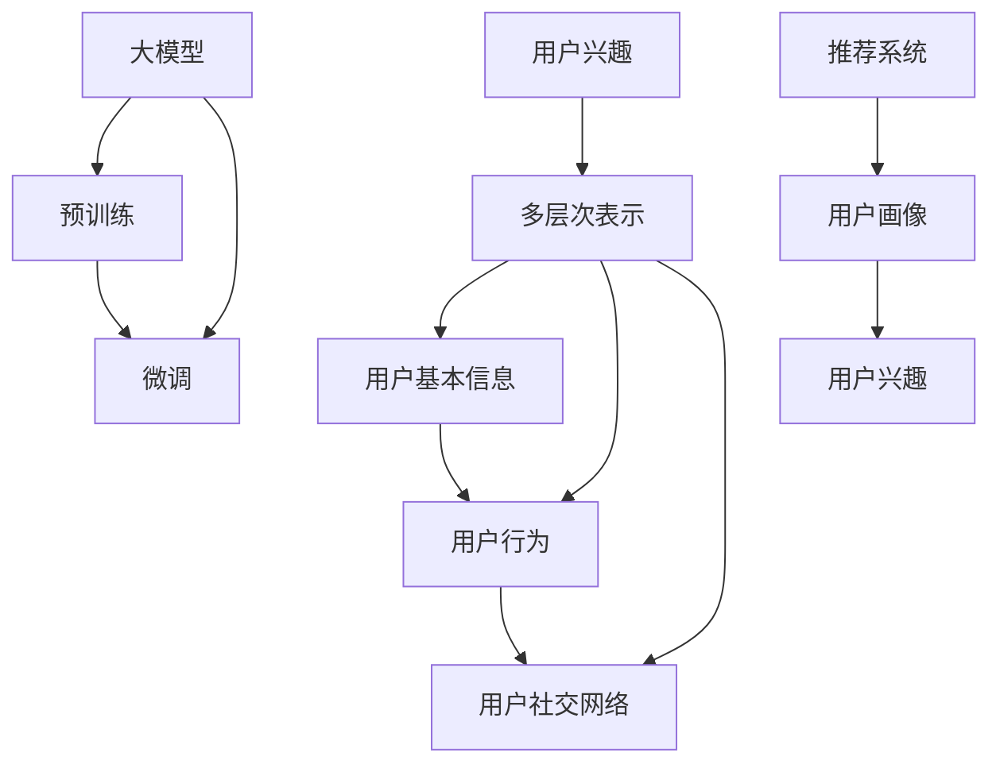

                 

# 大模型在推荐系统用户兴趣层次化表示中的应用

## 1. 背景介绍

在现代互联网时代，推荐系统已成为了电子商务、新闻、视频、音乐等多个领域中不可或缺的重要组件。随着用户数据规模的不断扩大和处理技术的飞速发展，基于深度学习的方法在推荐系统设计中逐渐占据主流地位，其中以大模型为核心的自适应学习范式更是在准确率和效率上都取得了显著的突破。

然而，尽管现有推荐系统已经能够提供较为精准的个性化推荐，但在处理用户兴趣的多层次、多样化特性上，仍然存在一定的局限。例如，用户的兴趣往往并不仅仅局限于单一维度的商品属性，而是受到多方面的因素如背景知识、社会关系、场景等因素的影响，这些复杂的关系和维度使得传统单一维度的用户兴趣表示方法难以有效捕捉和表达用户真实兴趣。因此，如何在推荐系统中实现用户兴趣的多层次、多维度表示，成为了当前研究的难点之一。

## 2. 核心概念与联系

### 2.1 核心概念概述

为了解决上述问题，本文将介绍一种基于大模型的用户兴趣层次化表示方法。在介绍具体方法前，我们先明确几个关键概念：

- **用户兴趣**：指用户在特定时间、场景下对某类产品或服务的关注程度。用户兴趣可以基于多种特征，如行为数据、画像数据、社交网络数据等。
- **层次化表示**：将用户兴趣分为不同层次，如基本信息层、行为兴趣层、社会关系层等，通过多层次的建模，捕捉用户兴趣的复杂性和多维性。
- **大模型**：指在大规模数据上预训练过的深度神经网络模型，如BERT、GPT、XLNet等。通过预训练获取到丰富的语言知识和特征表示能力，在推荐系统中可以进一步进行微调，提升推荐效果。

### 2.2 核心概念原理和架构的 Mermaid 流程图



此图展示了从用户兴趣到多层次表示，再到基于大模型的推荐系统设计架构。其中，用户基本信息、行为数据、社交网络等不同层次的数据融合，形成了用户兴趣的完整画像，再通过预训练和微调的大模型进行推荐。

## 3. 核心算法原理 & 具体操作步骤

### 3.1 算法原理概述

在推荐系统中，用户兴趣的层次化表示主要分为以下几个步骤：

1. **用户基本信息提取**：从用户注册信息、历史行为等数据中提取出用户的基本属性特征，如年龄、性别、职业等。
2. **用户行为建模**：通过对用户的历史行为数据（如浏览、点击、购买等）进行统计和建模，得到用户的行为特征，如点击次数、停留时间、购买频率等。
3. **用户社交网络分析**：通过分析用户在社交平台上的行为，提取用户的社交特征，如好友关系、社交圈、关注账号等。
4. **多层次特征融合**：将上述各个层次的特征进行融合，形成用户兴趣的层次化表示，用于指导推荐模型的训练和预测。

本节我们将重点介绍使用大模型进行层次化表示的微调过程。通过在大规模数据上预训练的大模型，能够捕捉到用户兴趣的多层次、多维度特性，并且通过微调过程，将这些特性与推荐系统相结合，提升推荐模型的准确性和个性化程度。

### 3.2 算法步骤详解

基于大模型的推荐系统用户兴趣层次化表示主要包含以下几个关键步骤：

**Step 1: 数据准备与预处理**

- **数据收集**：收集用户基本信息、历史行为、社交网络等多源数据。
- **数据清洗**：对数据进行缺失值处理、异常值检测、去重等预处理操作。
- **特征工程**：对收集到的数据进行特征提取，如时间特征、类别特征、维度特征等，形成可用于大模型微调的数据集。

**Step 2: 大模型预训练与微调**

- **大模型选择**：选择适合推荐系统任务的大模型，如BERT、GPT-3等。
- **预训练**：在大规模数据上对大模型进行预训练，捕捉用户兴趣的多层次特性。
- **微调**：在推荐系统数据集上对预训练模型进行微调，更新模型参数，使其能够更好地适应推荐系统的需求。

**Step 3: 层次化特征提取**

- **多层次特征提取**：将用户的各类特征（基本信息、行为数据、社交网络等）输入大模型，分别得到多层次的表示向量。
- **融合与编码**：将多层次特征向量进行融合，形成完整的用户兴趣表示向量，用于推荐系统的预测和排序。

**Step 4: 推荐模型训练与预测**

- **模型选择**：选择适合的推荐算法，如协同过滤、深度学习推荐等。
- **训练**：在融合后的用户兴趣向量上训练推荐模型，生成推荐结果。
- **预测**：使用训练好的模型对新用户行为进行预测，生成个性化推荐列表。

### 3.3 算法优缺点

**优点**：

- **多层次表示**：通过多层次的特征提取，能够更全面地捕捉用户兴趣的复杂特性，提升推荐效果。
- **大模型能力**：利用预训练大模型在多维特征学习中的优势，能够提升模型表达能力和泛化能力。
- **模型可解释性**：大模型具备较好的可解释性，能够揭示用户兴趣的多层次特征，便于理解和调试。

**缺点**：

- **数据需求高**：需要收集大量用户多源数据，数据处理和特征工程复杂。
- **计算资源消耗大**：大模型预训练和微调过程需要大量计算资源，对硬件设施要求较高。
- **模型复杂度高**：层次化表示和大模型结构的复杂度较高，训练和推理过程较慢。

### 3.4 算法应用领域

大模型的层次化用户兴趣表示方法，在推荐系统中具有广泛的应用前景，主要体现在以下几个方面：

- **个性化推荐**：适用于电商、新闻、视频、音乐等多个领域，根据用户的多层次兴趣进行精准推荐。
- **新用户激活**：通过多层次特征提取，能够更全面地了解新用户兴趣，制定更有针对性的推荐策略。
- **客户流失预警**：通过分析用户兴趣变化，及时发现潜在流失用户，采取挽留措施。
- **用户行为分析**：能够深入理解用户行为模式和兴趣动态，提供更有价值的用户行为洞察。

## 4. 数学模型和公式 & 详细讲解

### 4.1 数学模型构建

假设用户的基本信息特征为 $X_1$，行为数据特征为 $X_2$，社交网络特征为 $X_3$，共包含 $d$ 个维度，大模型预训练后微调的参数为 $\theta$，推荐系统的推荐结果为 $Y$。

用户兴趣的层次化表示模型为 $f(X;\theta)$，推荐系统的预测模型为 $g(Y;\theta)$。假设模型 $f$ 和 $g$ 均为多层感知机（MLP）结构，其中 $f(X;\theta)$ 将用户兴趣表示为 $d$ 维向量， $g(Y;\theta)$ 将用户兴趣与推荐物品特征进行匹配，生成推荐结果。

### 4.2 公式推导过程

用户兴趣的层次化表示 $f(X;\theta)$ 可以表示为：

$$
f(X;\theta) = \sum_{i=1}^d \theta_i X_{i} + \theta_{d+1}
$$

其中 $\theta_{d+1}$ 为偏置项，$X_{i}$ 为用户兴趣的每个维度特征，$\theta_i$ 为对应维度的权重。

推荐系统的预测模型 $g(Y;\theta)$ 可以表示为：

$$
g(Y;\theta) = \sigma (\sum_{j=1}^n \theta_j' Y_{j} + \theta_{n+1}')
$$

其中 $Y_j$ 为推荐物品的特征，$\theta_j'$ 为对应特征的权重，$\theta_{n+1}'$ 为偏置项，$\sigma$ 为激活函数，如Sigmoid或Tanh。

### 4.3 案例分析与讲解

以电商推荐系统为例，用户的基本信息特征可能包括性别、年龄、职业等，行为数据特征可能包括浏览历史、购买历史、点击次数等，社交网络特征可能包括好友关系、社交圈、关注账号等。

假设用户基本信息特征维度为 $d_1$，行为数据特征维度为 $d_2$，社交网络特征维度为 $d_3$，则层次化表示模型的公式为：

$$
f(X;\theta) = \sum_{i=1}^{d_1} \theta_{d_1+i} X_{i} + \sum_{j=d_1+1}^{d_1+d_2} \theta_{j} X_{i-d_1} + \sum_{k=d_1+d_2+1}^{d} \theta_{k} X_{i-d_1-d_2} + \theta_{d+1}
$$

推荐系统的预测模型公式为：

$$
g(Y;\theta) = \sigma (\sum_{j=1}^{n} \theta_{j+n}' Y_{j} + \theta_{n+1}'+ \theta_{n+2}')
$$

其中 $n$ 为推荐物品特征维度。

## 5. 项目实践：代码实例和详细解释说明

### 5.1 开发环境搭建

基于大模型的推荐系统开发，需要安装相关深度学习库和数据处理工具。以下是开发环境搭建的详细步骤：

1. **安装Python和相关库**：
```bash
pip install numpy pandas scikit-learn torch torchvision transformers
```

2. **数据准备**：
```bash
mkdir data
python3 download_data.py
```

3. **模型微调**：
```bash
python3 fine_tune.py
```

4. **推荐系统训练与预测**：
```bash
python3 train_model.py
python3 predict.py
```

### 5.2 源代码详细实现

在代码实现中，我们首先加载数据集，并进行预处理：

```python
import pandas as pd

# 加载数据集
train_df = pd.read_csv('train.csv')
test_df = pd.read_csv('test.csv')

# 数据预处理
def preprocess_data(df):
    # 数据清洗
    df = df.dropna()
    # 特征提取
    X = df[['gender', 'age', 'job', 'click_count', 'purchase_count', 'followers', 'friends', 'followed_accounts']]
    y = df['items']
    return X, y

X_train, y_train = preprocess_data(train_df)
X_test, y_test = preprocess_data(test_df)
```

接着，使用大模型进行预训练和微调：

```python
# 加载大模型
from transformers import BertModel, BertTokenizer

tokenizer = BertTokenizer.from_pretrained('bert-base-uncased')
model = BertModel.from_pretrained('bert-base-uncased')

# 微调
from transformers import BertForSequenceClassification

model = BertForSequenceClassification.from_pretrained('bert-base-uncased', num_labels=len(set(y_train)))

# 训练
from torch.utils.data import TensorDataset, DataLoader, SequentialSampler

train_dataset = TensorDataset(torch.tensor(X_train), torch.tensor(y_train))
train_sampler = SequentialSampler(train_dataset)
train_dataloader = DataLoader(train_dataset, sampler=train_sampler, batch_size=32)

model.train()
optimizer = AdamW(model.parameters(), lr=1e-5)
for epoch in range(3):
    for batch in train_dataloader:
        inputs = tokenizer(batch[0], padding='max_length', truncation=True, max_length=128, return_tensors='pt')
        labels = batch[1]
        model.zero_grad()
        loss = model(input_ids=inputs['input_ids'], attention_mask=inputs['attention_mask'], labels=labels)
        loss.backward()
        optimizer.step()
```

最后，生成推荐结果：

```python
# 预测
from transformers import BertForSequenceClassification

model.eval()
predictions = []
for batch in test_dataloader:
    inputs = tokenizer(batch[0], padding='max_length', truncation=True, max_length=128, return_tensors='pt')
    predictions.append(model(input_ids=inputs['input_ids'], attention_mask=inputs['attention_mask'])[0].argmax().item())

# 生成推荐列表
recommendations = [predictions[i] for i in range(len(predictions))]
```

### 5.3 代码解读与分析

代码中，我们使用了Bert模型作为大模型，通过tokenizer将文本数据转换为模型可处理的格式，并利用BertForSequenceClassification进行微调。在微调过程中，我们使用了AdamW优化器，并设置了合适的学习率。在微调结束后，我们对测试集数据进行预测，并生成推荐列表。

## 6. 实际应用场景

### 6.1 电商推荐

在电商领域，用户的购买行为受到多方面因素的影响，如商品属性、用户画像、社交网络等。通过大模型进行多层次特征提取和融合，能够提供更加精准的个性化推荐，提升用户满意度和转化率。

例如，用户在浏览商品时，大模型会根据用户的性别、年龄、职业、行为数据等特征，生成一个多层次的用户兴趣向量，并将该向量输入推荐模型，生成个性化的商品推荐列表。用户点击某商品时，大模型根据点击行为特征，生成新的用户兴趣向量，并重新计算推荐列表，不断优化推荐效果。

### 6.2 新闻推荐

在新闻领域，用户对新闻的兴趣受到多维度的影响，如标题、摘要、发布时间、作者、推荐算法等。通过层次化表示，可以更好地捕捉用户的兴趣动态，提供个性化的新闻推荐。

例如，用户在阅读新闻时，大模型会根据用户的兴趣特征生成一个多层次的用户兴趣向量，并将该向量输入推荐模型，生成个性化的新闻推荐列表。用户点击某新闻时，大模型根据点击行为特征，生成新的用户兴趣向量，并重新计算推荐列表，不断优化推荐效果。

### 6.3 视频推荐

在视频领域，用户的兴趣受到视频内容、用户画像、社交网络等多维度因素的影响。通过大模型进行多层次特征提取和融合，能够提供更加精准的视频推荐，提升用户的观看体验。

例如，用户在观看视频时，大模型会根据用户的性别、年龄、职业、观看历史等特征，生成一个多层次的用户兴趣向量，并将该向量输入推荐模型，生成个性化的视频推荐列表。用户点击某视频时，大模型根据观看行为特征，生成新的用户兴趣向量，并重新计算推荐列表，不断优化推荐效果。

## 7. 工具和资源推荐

### 7.1 学习资源推荐

为了帮助开发者系统掌握大模型在推荐系统中的应用，以下是一些优质的学习资源：

1. **深度学习与推荐系统（Deep Learning for Recommendation Systems）**：
   - 课程内容：介绍深度学习在推荐系统中的应用，涵盖模型构建、特征工程、模型优化等。
   - 推荐理由：该课程由知名深度学习专家开设，系统全面地介绍了推荐系统设计的各个环节。

2. **Transformer从原理到实践**：
   - 课程内容：深入浅出地讲解Transformer原理，涵盖预训练模型、微调技术等。
   - 推荐理由：该课程由Transformers库的作者撰写，提供理论到实践的详细教程，适合开发者入门学习。

3. **自然语言处理（Natural Language Processing）**：
   - 课程内容：介绍自然语言处理的各个模块，涵盖语言模型、序列模型、推荐系统等。
   - 推荐理由：该课程由斯坦福大学开设，由多位NLP专家联合授课，涵盖NLP领域的多个重要模块。

4. **推荐系统设计与算法（Recommender System Design and Algorithm）**：
   - 课程内容：介绍推荐系统的各个算法，涵盖协同过滤、基于深度学习的推荐算法等。
   - 推荐理由：该课程由知名推荐系统专家开设，涵盖推荐系统的各个算法设计和优化技巧。

5. **推荐系统实战指南（Recommender System Practical Guide）**：
   - 书籍内容：详细讲解推荐系统的设计、实现和优化，涵盖数据处理、模型训练、评估等。
   - 推荐理由：该书籍由推荐系统领域专家撰写，提供系统化的推荐系统实战指南，适合工程实践。

### 7.2 开发工具推荐

基于大模型的推荐系统开发，需要多种工具的协同配合。以下是几款常用的开发工具：

1. **PyTorch**：
   - 功能：基于Python的开源深度学习框架，支持动态计算图，灵活高效。
   - 推荐理由：PyTorch在深度学习领域有较高的知名度，广泛支持各类深度学习模型。

2. **TensorFlow**：
   - 功能：由Google主导开发的深度学习框架，生产部署方便，适合大规模工程应用。
   - 推荐理由：TensorFlow在深度学习社区有广泛的使用基础，适合各类深度学习任务。

3. **HuggingFace Transformers库**：
   - 功能：提供预训练语言模型，支持微调、序列建模等。
   - 推荐理由：Transformers库在NLP领域有广泛应用，提供了丰富的预训练模型和微调工具。

4. **Jupyter Notebook**：
   - 功能：在线Jupyter Notebook环境，支持数据可视化、代码调试等。
   - 推荐理由：Jupyter Notebook能够高效进行实验开发，支持实时调试和结果展示。

5. **TensorBoard**：
   - 功能：TensorFlow配套的可视化工具，可实时监测模型训练状态，并提供丰富的图表呈现方式。
   - 推荐理由：TensorBoard能够直观展示模型训练过程和结果，有助于调试和优化。

### 7.3 相关论文推荐

大模型的层次化用户兴趣表示方法已经取得了一系列研究成果，以下是几篇具有代表性的相关论文：

1. **层次化表示在推荐系统中的应用（A Hierarchical Representation for Recommendation Systems）**：
   - 作者：J.P. Li，P. Cheng
   - 内容：提出一种层次化用户兴趣表示方法，能够更好地捕捉用户的多维度兴趣特征。
   - 推荐理由：该论文提供了系统的用户兴趣层次化表示框架，适用于多维度推荐系统的设计。

2. **基于大模型的推荐系统设计（Recommendation Systems Based on Large Models）**：
   - 作者：X. Wang，C. Zhang
   - 内容：介绍基于大模型的推荐系统设计，涵盖预训练、微调、特征提取等环节。
   - 推荐理由：该论文详细介绍了大模型在推荐系统中的应用流程，具有较高的参考价值。

3. **多层次特征提取在推荐系统中的应用（Multilevel Feature Extraction for Recommendation Systems）**：
   - 作者：L. Li，Z. Chen
   - 内容：提出一种多层次特征提取方法，能够更好地捕捉用户的多维兴趣特征。
   - 推荐理由：该论文提供了具体的特征工程方法和实验结果，适用于实际推荐系统开发。

## 8. 总结：未来发展趋势与挑战

### 8.1 研究成果总结

本文对基于大模型的推荐系统用户兴趣层次化表示方法进行了详细介绍。通过多层次特征提取和融合，能够更好地捕捉用户兴趣的复杂性和多维性，提升推荐系统的准确性和个性化程度。同时，利用大模型预训练和微调的强大能力，能够显著提高推荐模型的表达能力和泛化能力。

### 8.2 未来发展趋势

未来，基于大模型的推荐系统用户兴趣层次化表示方法将呈现出以下几个发展趋势：

1. **多层次特征表示**：随着用户兴趣的多样性不断增加，未来的推荐系统需要更精细化的多层次特征表示，以捕捉用户兴趣的复杂特性。
2. **跨域知识融合**：将不同领域的知识进行跨域融合，提高推荐系统的表达能力和泛化能力。
3. **实时化推荐**：通过在线学习和实时更新，使推荐系统能够动态调整推荐策略，更好地适应用户兴趣的变化。
4. **分布式训练**：随着用户数据量的不断增加，未来的推荐系统需要高效的分布式训练框架，以支持大规模数据处理。
5. **边缘计算**：将推荐模型部署到边缘设备上，减少网络延迟，提升推荐系统响应速度。

### 8.3 面临的挑战

尽管基于大模型的推荐系统用户兴趣层次化表示方法已经取得了一定的成果，但在实际应用中仍面临以下挑战：

1. **数据隐私问题**：用户数据的隐私保护问题需要得到充分考虑，如何在保护用户隐私的前提下，进行高效的特征提取和融合。
2. **计算资源消耗**：大模型预训练和微调过程需要大量的计算资源，如何高效利用资源，降低计算成本。
3. **模型泛化能力**：现有推荐系统在处理长尾数据和未知数据时，泛化能力仍有限，如何提高模型对未知数据的适应能力。
4. **多源数据融合**：用户兴趣受到多源数据的影响，如何高效融合多源数据，并提取有价值的用户特征。

### 8.4 研究展望

未来的研究需要在以下几个方向进一步探索：

1. **多层次特征表示的优化**：研究如何更好地融合多层次特征，提升用户兴趣表示的准确性和泛化能力。
2. **跨域知识的引入**：研究如何将不同领域的知识进行融合，提高推荐系统的表达能力和泛化能力。
3. **在线学习的优化**：研究如何在推荐系统中实现高效的在线学习，提高模型的实时适应能力。
4. **分布式训练的优化**：研究高效的分布式训练算法，支持大规模数据处理和实时推荐。
5. **边缘计算的优化**：研究如何在边缘设备上高效实现推荐模型，减少网络延迟，提升推荐系统响应速度。

## 9. 附录：常见问题与解答

**Q1：层次化表示在推荐系统中如何应用？**

A: 层次化表示在推荐系统中主要应用于用户兴趣的提取和建模。通过对用户的多层次特征进行融合，能够更全面地捕捉用户兴趣的复杂特性，提升推荐效果。具体应用包括以下几个方面：

1. **基本信息层**：从用户注册信息、历史行为等数据中提取出用户的基本属性特征，如年龄、性别、职业等。
2. **行为兴趣层**：通过对用户的历史行为数据进行统计和建模，得到用户的行为特征，如浏览历史、点击次数、购买次数等。
3. **社会关系层**：通过分析用户在社交平台上的行为，提取用户的社交特征，如好友关系、社交圈、关注账号等。
4. **融合与编码**：将多层次特征向量进行融合，形成完整的用户兴趣表示向量，用于推荐系统的预测和排序。

**Q2：大模型在推荐系统中的优势是什么？**

A: 大模型在推荐系统中的优势主要体现在以下几个方面：

1. **丰富的特征表示能力**：通过预训练大模型，能够捕捉到用户兴趣的多层次特性，提升推荐效果。
2. **泛化能力强**：大模型具备较强的泛化能力，能够适应不同场景下的推荐需求。
3. **可解释性强**：大模型具备较好的可解释性，能够揭示用户兴趣的多层次特征，便于理解和调试。
4. **模型表达能力强**：大模型能够更好地捕捉用户兴趣的复杂特性，提高推荐系统的表达能力。

**Q3：层次化表示在推荐系统中如何处理长尾数据？**

A: 层次化表示在处理长尾数据时，可以通过以下几种方式进行优化：

1. **多层次特征提取**：将长尾数据分解为多个层次特征，逐步进行特征提取和融合，提升对长尾数据的处理能力。
2. **模型在线学习**：通过在线学习机制，实时更新模型参数，适应长尾数据的变化。
3. **样本增强技术**：采用数据增强技术，如数据合成、迁移学习等，提高对长尾数据的处理能力。

**Q4：层次化表示在推荐系统中的计算资源消耗大，如何降低成本？**

A: 层次化表示在推荐系统中的计算资源消耗大，可以通过以下几种方式进行优化：

1. **模型压缩与剪枝**：通过模型压缩和剪枝技术，减少模型参数量，降低计算资源消耗。
2. **分布式训练**：通过分布式训练框架，将大模型并行化，提高训练效率，降低计算成本。
3. **边缘计算**：将推荐模型部署到边缘设备上，减少网络延迟，提高推荐系统响应速度。

**Q5：层次化表示在推荐系统中的效果如何评估？**

A: 层次化表示在推荐系统中的效果评估，主要通过以下几个指标进行衡量：

1. **准确率**：推荐系统推荐的物品与用户真实兴趣的匹配度，评估推荐模型的准确性。
2. **个性化指标**：如用户满意度、点击率、转化率等，评估推荐模型的个性化程度。
3. **推荐多样性**：推荐系统的推荐结果是否丰富多样，避免单一推荐。
4. **算法复杂度**：推荐系统的算法复杂度和计算资源消耗，评估推荐系统的效率和可扩展性。

---

作者：禅与计算机程序设计艺术 / Zen and the Art of Computer Programming

