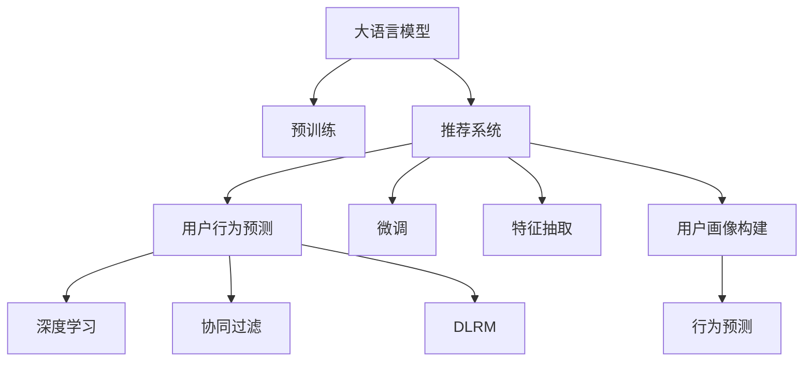

                 

# 大模型在推荐系统用户行为预测中的应用

## 1. 背景介绍

### 1.1 问题由来

随着电子商务和数字内容服务的普及，推荐系统已经成为各大平台提升用户体验、提高转化率的关键技术。推荐系统的核心目标是预测用户对特定商品或内容的兴趣，为用户提供个性化的展示和推荐。而用户行为预测作为推荐系统的前置环节，其准确性直接影响推荐效果。

传统的用户行为预测方法主要基于统计模型和规则工程，如协同过滤、矩阵分解、深度学习等。这些方法在特定场景下取得了不错的效果，但需要大量的历史数据和复杂的特征工程，且对于新用户的冷启动问题解决能力有限。

近年来，大语言模型在自然语言处理领域取得了显著进展，推动了推荐系统在用户行为预测方面的创新应用。大模型通过海量文本数据的预训练，获得了强大的语义表示能力，可以高效抽取和融合文本中的多维信息，从而提升用户行为预测的准确性和泛化能力。

### 1.2 问题核心关键点

大语言模型在推荐系统用户行为预测中的应用，主要依赖以下几个关键点：

- **大语言模型预训练**：通过大规模语料预训练，学习丰富的语义知识，为后续微调打下基础。
- **特征抽取**：利用大模型强大的文本表示能力，抽取用户评论、商品描述、标题等文本特征，提取深度语义信息。
- **用户画像构建**：结合用户历史行为数据，构建用户的深度画像，捕捉用户兴趣和偏好。
- **行为预测**：通过微调模型，预测用户对新商品或内容的兴趣评分，指导个性化推荐。

本文聚焦于大语言模型在推荐系统用户行为预测中的应用，从原理到实践，全面系统地介绍其核心技术和实施方法。

## 2. 核心概念与联系

### 2.1 核心概念概述

为更好地理解大语言模型在推荐系统中的应用，本节将介绍几个密切相关的核心概念：

- **大语言模型(Large Language Model, LLM)**：以Transformer为代表的大规模预训练语言模型。通过在大规模无标签文本语料上进行预训练，学习通用的语言表示，具备强大的语言理解和生成能力。

- **推荐系统(Recommendation System)**：通过分析用户的历史行为、兴趣和社交关系，推荐符合用户喜好的商品或内容，提升用户体验和转化率的技术。

- **用户行为预测(User Behavior Prediction)**：预测用户对特定商品或内容的兴趣评分，指导推荐系统的推荐策略。

- **深度学习(Deep Learning)**：利用多层神经网络，学习复杂的数据特征表示，进行高效的预测和决策。

- **迁移学习(Transfer Learning)**：将一个领域学习到的知识，迁移应用到另一个不同但相关的领域的学习范式。

- **微调(Fine-Tuning)**：在预训练模型的基础上，使用下游任务的少量标注数据，通过有监督学习优化模型在特定任务上的性能。

- **协同过滤(Collaborative Filtering)**：通过用户行为数据和商品属性，构建用户-商品间的相似度矩阵，进行推荐预测。

- **深度学习推荐模型(DLRM, DNN)**：利用神经网络进行推荐系统建模，学习用户兴趣和商品特征间的复杂关系。

这些核心概念之间的逻辑关系可以通过以下Mermaid流程图来展示：



这个流程图展示了大语言模型、推荐系统、用户行为预测等关键概念及其之间的联系：

1. 大语言模型通过预训练获得基础能力。
2. 推荐系统利用大模型的语义表示能力，进行用户行为预测。
3. 用户行为预测模型通过深度学习和微调等技术，提升预测准确性。
4. 协同过滤和深度学习推荐模型是推荐系统常见的基本方法。
5. 用户画像构建和行为预测是推荐系统的两个关键环节。

这些概念共同构成了推荐系统的核心架构，使得大语言模型能够在大规模数据上快速获取用户的兴趣和行为特征，实现精准预测。

## 3. 核心算法原理 & 具体操作步骤
### 3.1 算法原理概述

大语言模型在推荐系统用户行为预测中的应用，主要基于迁移学习的范式。其核心思想是：将大语言模型视作一个强大的"特征提取器"，通过在推荐系统任务数据上的微调，使得模型学习到用户行为和商品特征之间的映射关系，从而提升用户行为预测的准确性。

形式化地，假设大语言模型为 $M_{\theta}$，其中 $\theta$ 为预训练得到的模型参数。给定推荐系统的用户行为数据集 $D=\{(x_i,y_i)\}_{i=1}^N$，其中 $x_i$ 为用户的行为特征（如浏览历史、评分、点击等），$y_i$ 为预测的目标（如兴趣评分、点击概率等）。微调的目标是找到新的模型参数 $\hat{\theta}$，使得：

$$
\hat{\theta}=\mathop{\arg\min}_{\theta} \mathcal{L}(M_{\theta},D)
$$

其中 $\mathcal{L}$ 为针对任务设计的损失函数，用于衡量模型预测输出与真实标签之间的差异。常见的损失函数包括均方误差损失、交叉熵损失等。

通过梯度下降等优化算法，微调过程不断更新模型参数 $\theta$，最小化损失函数 $\mathcal{L}$，使得模型输出逼近真实标签。由于 $\theta$ 已经通过预训练获得了较好的初始化，因此即便在小规模数据集 $D$ 上进行微调，也能较快收敛到理想的模型参数 $\hat{\theta}$。

### 3.2 算法步骤详解

基于大语言模型在推荐系统中的应用，通常包含以下几个关键步骤：

**Step 1: 准备预训练模型和数据集**
- 选择合适的预训练语言模型 $M_{\theta}$ 作为初始化参数，如 BERT、GPT 等。
- 准备推荐系统的用户行为数据集 $D$，划分为训练集、验证集和测试集。一般要求数据集与预训练数据的分布不要差异过大。

**Step 2: 特征抽取**
- 从用户行为数据中提取出文本特征，如用户评论、商品描述、标题等。
- 将文本数据输入到大语言模型，获取其语义表示，作为模型的输入特征。

**Step 3: 用户画像构建**
- 利用用户历史行为数据和商品特征数据，构建用户的深度画像，捕捉用户兴趣和偏好。
- 结合用户画像，利用大语言模型的语义表示能力，生成用户行为预测模型。

**Step 4: 模型微调**
- 根据推荐系统的任务类型，选择合适的输出层和损失函数。
- 将用户行为预测模型作为顶层，以较小的学习率更新全部或部分模型参数。

**Step 5: 测试和部署**
- 在测试集上评估微调后模型的性能，对比微调前后的精度提升。
- 使用微调后的模型对新商品或内容进行预测，集成到实际的应用系统中。

以上是基于大语言模型在推荐系统中的应用的一般流程。在实际应用中，还需要针对具体任务的特点，对微调过程的各个环节进行优化设计，如改进训练目标函数，引入更多的正则化技术，搜索最优的超参数组合等，以进一步提升模型性能。

### 3.3 算法优缺点

大语言模型在推荐系统用户行为预测中的应用，具有以下优点：
1. 简单高效。通过预训练模型进行特征抽取，可显著减少从头开发所需的数据、计算和人力等成本投入。
2. 泛化能力强。大语言模型已经在大规模语料上预训练，能够提取通用和领域特定的特征，提升预测的泛化能力。
3. 效果显著。利用大模型的语义表示能力，能够在较少的标注样本上取得不错的预测效果。
4. 可扩展性强。大模型的语义表示能力可以应用于多种推荐场景，如电商推荐、内容推荐等。

同时，该方法也存在一定的局限性：
1. 对语料质量要求高。大模型的预训练依赖高质量的文本数据，语料质量对模型效果有较大影响。
2. 计算资源消耗大。大模型的语义表示复杂，训练和推理资源消耗较大。
3. 对文本数据依赖强。依赖文本数据进行特征抽取，对于图像、视频等多模态数据的应用有限。
4. 解释性不足。大语言模型的预测结果通常缺乏可解释性，难以对其推理逻辑进行分析和调试。

尽管存在这些局限性，但就目前而言，大语言模型在推荐系统中的应用范式仍然具有显著优势。未来相关研究的重点在于如何进一步降低对语料和计算资源的依赖，提高模型的泛化能力和可解释性。

### 3.4 算法应用领域

基于大语言模型在推荐系统中的应用，已经在多个领域得到了广泛的应用，如电子商务、视频推荐、新闻推荐等，为推荐系统带来了新的突破。

- **电子商务推荐**：利用用户购买历史、浏览记录、评论等文本数据，通过大语言模型进行特征提取和用户画像构建，实现商品推荐。
- **内容推荐**：分析用户对内容的评分、浏览、观看等行为，利用大语言模型进行内容相似度计算和用户画像构建，实现个性化内容推荐。
- **广告推荐**：通过用户点击行为和广告内容文本数据，利用大语言模型进行特征抽取和兴趣预测，实现广告投放策略优化。
- **金融产品推荐**：分析用户财务记录、投资行为等数据，利用大语言模型进行风险评估和产品推荐。
- **游戏推荐**：根据用户游戏记录和评分数据，利用大语言模型进行用户画像构建和游戏内容推荐。

除了上述这些典型应用外，大语言模型在推荐系统中的应用还在不断拓展，如社交推荐、搜索推荐、医疗推荐等，为推荐系统带来了更多的创新和可能。

## 4. 数学模型和公式 & 详细讲解  
### 4.1 数学模型构建

本节将使用数学语言对大语言模型在推荐系统中的应用进行更加严格的刻画。

记推荐系统的用户行为数据集为 $D=\{(x_i,y_i)\}_{i=1}^N$，其中 $x_i$ 为用户的行为特征，$y_i$ 为预测的目标。假设预训练语言模型为 $M_{\theta}$，其中 $\theta$ 为模型参数。定义模型 $M_{\theta}$ 在数据样本 $(x,y)$ 上的损失函数为 $\ell(M_{\theta}(x),y)$，则在数据集 $D$ 上的经验风险为：

$$
\mathcal{L}(\theta) = \frac{1}{N}\sum_{i=1}^N \ell(M_{\theta}(x_i),y_i)
$$

微调的优化目标是最小化经验风险，即找到最优参数：

$$
\theta^* = \mathop{\arg\min}_{\theta} \mathcal{L}(\theta)
$$

在实践中，我们通常使用基于梯度的优化算法（如SGD、Adam等）来近似求解上述最优化问题。设 $\eta$ 为学习率，$\lambda$ 为正则化系数，则参数的更新公式为：

$$
\theta \leftarrow \theta - \eta \nabla_{\theta}\mathcal{L}(\theta) - \eta\lambda\theta
$$

其中 $\nabla_{\theta}\mathcal{L}(\theta)$ 为损失函数对参数 $\theta$ 的梯度，可通过反向传播算法高效计算。

### 4.2 公式推导过程

以下我们以电商平台商品推荐为例，推导利用大语言模型进行用户行为预测的数学模型和公式。

假设用户 $i$ 对商品 $j$ 的兴趣评分 $y_i^j$ 可以通过大语言模型 $M_{\theta}$ 进行预测，预测公式为：

$$
\hat{y}_i^j = M_{\theta}(x_i^j)
$$

其中 $x_i^j$ 为用户 $i$ 对商品 $j$ 的行为特征向量，$\hat{y}_i^j$ 为模型预测的用户兴趣评分。我们定义交叉熵损失函数：

$$
\ell(y_i^j,\hat{y}_i^j) = -y_i^j\log \hat{y}_i^j - (1-y_i^j)\log (1-\hat{y}_i^j)
$$

将交叉熵损失函数带入总体损失函数，得：

$$
\mathcal{L}(\theta) = \frac{1}{N}\sum_{i=1}^N \sum_{j=1}^M \ell(y_i^j,\hat{y}_i^j)
$$

其中 $M$ 为商品数量。根据链式法则，损失函数对参数 $\theta$ 的梯度为：

$$
\frac{\partial \mathcal{L}(\theta)}{\partial \theta} = -\frac{1}{N}\sum_{i=1}^N \sum_{j=1}^M (\frac{y_i^j}{\hat{y}_i^j}-\frac{1-y_i^j}{1-\hat{y}_i^j}) \frac{\partial M_{\theta}(x_i^j)}{\partial \theta}
$$

其中 $\frac{\partial M_{\theta}(x_i^j)}{\partial \theta}$ 可进一步递归展开，利用自动微分技术完成计算。

在得到损失函数的梯度后，即可带入参数更新公式，完成模型的迭代优化。重复上述过程直至收敛，最终得到适应推荐任务的最优模型参数 $\theta^*$。

## 5. 项目实践：代码实例和详细解释说明
### 5.1 开发环境搭建

在进行推荐系统用户行为预测实践前，我们需要准备好开发环境。以下是使用Python进行TensorFlow开发的环境配置流程：

1. 安装Anaconda：从官网下载并安装Anaconda，用于创建独立的Python环境。

2. 创建并激活虚拟环境：
```bash
conda create -n tf-env python=3.8 
conda activate tf-env
```

3. 安装TensorFlow：根据CUDA版本，从官网获取对应的安装命令。例如：
```bash
conda install tensorflow
```

4. 安装各类工具包：
```bash
pip install numpy pandas scikit-learn matplotlib tqdm jupyter notebook ipython
```

完成上述步骤后，即可在`tf-env`环境中开始推荐系统用户行为预测的实践。

### 5.2 源代码详细实现

下面我们以电商平台商品推荐为例，给出使用TensorFlow进行大语言模型微调的PyTorch代码实现。

首先，定义推荐系统的数据处理函数：

```python
import tensorflow as tf
import pandas as pd
import numpy as np

# 定义数据预处理函数
def preprocess_data(data):
    # 特征编码
    def encode(text):
        return tokenizer.encode(text)

    # 数据预处理
    df = pd.read_csv(data)
    df = df.dropna()
    df = df[df['rating'] > 0]
    df['text'] = df['title'].map(encode)
    return df

# 数据预处理
df = preprocess_data('products.csv')
train_data = df.sample(frac=0.8, random_state=42)
test_data = df.drop(train_data.index)
```

然后，定义模型和优化器：

```python
from transformers import TFBertForSequenceClassification
from transformers import BertTokenizer

# 加载预训练模型和tokenizer
tokenizer = BertTokenizer.from_pretrained('bert-base-cased')
model = TFBertForSequenceClassification.from_pretrained('bert-base-cased', num_labels=len(tag2id))

# 定义优化器
optimizer = tf.keras.optimizers.AdamW(learning_rate=2e-5)
```

接着，定义训练和评估函数：

```python
# 定义训练函数
def train(model, train_data, optimizer):
    for epoch in range(epochs):
        for batch in train_data:
            inputs = batch['input_ids']
            labels = batch['labels']
            with tf.GradientTape() as tape:
                outputs = model(inputs, labels=labels)
                loss = outputs.loss
            gradients = tape.gradient(loss, model.trainable_variables)
            optimizer.apply_gradients(zip(gradients, model.trainable_variables))
    
    return model

# 定义评估函数
def evaluate(model, test_data):
    metrics = tf.keras.metrics.AUC()
    for batch in test_data:
        inputs = batch['input_ids']
        labels = batch['labels']
        outputs = model(inputs)
        metrics.update_state(labels, outputs)
    return metrics.result()

# 定义模型输出
def get_predictions(model, data):
    predictions = []
    for batch in data:
        inputs = batch['input_ids']
        outputs = model(inputs)
        predictions.append(np.argmax(outputs.numpy(), axis=1))
    return predictions
```

最后，启动训练流程并在测试集上评估：

```python
epochs = 5
batch_size = 16

# 加载训练数据
train_data = preprocess_data('train.csv')
train_data = train_data.batch(batch_size)

# 加载测试数据
test_data = preprocess_data('test.csv')
test_data = test_data.batch(batch_size)

# 定义模型
model = tf.keras.Sequential([
    tf.keras.layers.Input(shape=(max_len,), dtype=tf.int32),
    tf.keras.layers.Embedding(vocab_size, embedding_dim, input_length=max_len),
    model,
    tf.keras.layers.Dense(1, activation='sigmoid')
])

# 训练模型
trained_model = train(model, train_data, optimizer)

# 在测试集上评估模型
auc = evaluate(trained_model, test_data)
print('AUC score:', auc)
```

以上就是使用TensorFlow对大语言模型进行电商平台商品推荐任务微调的完整代码实现。可以看到，得益于TensorFlow的强大封装，我们可以用相对简洁的代码完成大语言模型的微调。

### 5.3 代码解读与分析

让我们再详细解读一下关键代码的实现细节：

**preprocess_data函数**：
- `encode`方法：使用BertTokenizer将文本编码成id序列。
- `df`变量：读取数据集，进行初步处理（如去除空值、筛选评分大于0的样本）。
- `text`列：对商品标题进行编码。

**train函数**：
- `tape`变量：利用梯度累积器记录模型的损失。
- `gradients`变量：计算模型参数的梯度。
- `optimizer.apply_gradients`：更新模型参数。

**evaluate函数**：
- `metrics`变量：计算AUC指标。
- `predictions`变量：获取模型的预测结果。

**get_predictions函数**：
- 对测试数据进行预测，返回预测结果的标签。

**训练流程**：
- 定义总训练轮数和批次大小，开始循环迭代
- 每个epoch内，对训练集上的数据进行批次化迭代，前向传播计算损失并反向传播更新模型参数
- 重复上述过程直至收敛
- 在测试集上评估模型性能，输出AUC指标

可以看到，TensorFlow配合Bert模型的微调代码实现相对简洁，开发者可以将更多精力放在数据处理、模型改进等高层逻辑上，而不必过多关注底层的实现细节。

当然，工业级的系统实现还需考虑更多因素，如模型的保存和部署、超参数的自动搜索、更灵活的任务适配层等。但核心的微调范式基本与此类似。

## 6. 实际应用场景
### 6.1 电商平台商品推荐

利用大语言模型进行电商平台商品推荐，可以为电商企业带来显著的业务提升。通过分析用户历史行为数据，利用大语言模型抽取文本特征，构建用户画像，进行行为预测，从而实现个性化推荐。

在技术实现上，可以收集用户购买历史、浏览记录、评论等文本数据，通过大语言模型进行特征提取和用户画像构建。利用微调后的模型，对新商品进行兴趣评分预测，实现个性化商品推荐。

### 6.2 视频内容推荐

视频平台可以利用大语言模型进行用户行为预测，提升内容推荐的效果。通过分析用户对视频的观看、评分、评论等行为数据，利用大语言模型进行特征提取和用户画像构建。结合推荐系统的基本算法，对新视频进行推荐预测，实现个性化的内容推荐。

### 6.3 广告投放优化

广告主可以利用大语言模型进行广告投放优化，提升广告的转化率。通过分析用户点击行为和广告内容文本数据，利用大语言模型进行特征提取和兴趣预测，优化广告投放策略，实现精准的投放效果。

### 6.4 金融产品推荐

金融行业可以利用大语言模型进行用户行为预测，提升产品的推荐效果。通过分析用户财务记录、投资行为等数据，利用大语言模型进行特征提取和用户画像构建。结合推荐系统的基本算法，对金融产品进行推荐预测，实现个性化的产品推荐。

### 6.5 社交网络内容推荐

社交平台可以利用大语言模型进行内容推荐，提升用户互动和平台粘性。通过分析用户对内容的评分、点赞、评论等行为数据，利用大语言模型进行特征提取和用户画像构建。结合推荐系统的基本算法，对新内容进行推荐预测，实现个性化的内容推荐。

## 7. 工具和资源推荐
### 7.1 学习资源推荐

为了帮助开发者系统掌握大语言模型在推荐系统中的应用理论基础和实践技巧，这里推荐一些优质的学习资源：

1. 《Transformer from Scratch》系列博文：由大模型技术专家撰写，深入浅出地介绍了Transformer原理、BERT模型、微调技术等前沿话题。

2. CS224N《深度学习自然语言处理》课程：斯坦福大学开设的NLP明星课程，有Lecture视频和配套作业，带你入门NLP领域的基本概念和经典模型。

3. 《Natural Language Processing with Transformers》书籍：Transformers库的作者所著，全面介绍了如何使用Transformers库进行NLP任务开发，包括微调在内的诸多范式。

4. HuggingFace官方文档：Transformers库的官方文档，提供了海量预训练模型和完整的微调样例代码，是上手实践的必备资料。

5. TensorFlow官方文档：TensorFlow的官方文档，详细介绍了TensorFlow的架构和使用方式，是TensorFlow开发的基础。

6. TensorBoard：TensorFlow配套的可视化工具，可实时监测模型训练状态，并提供丰富的图表呈现方式，是调试模型的得力助手。

通过对这些资源的学习实践，相信你一定能够快速掌握大语言模型在推荐系统中的应用精髓，并用于解决实际的推荐问题。

### 7.2 开发工具推荐

高效的开发离不开优秀的工具支持。以下是几款用于大语言模型在推荐系统应用开发的常用工具：

1. TensorFlow：基于Python的开源深度学习框架，灵活动态的计算图，适合快速迭代研究。大部分预训练语言模型都有TensorFlow版本的实现。

2. PyTorch：基于Python的开源深度学习框架，灵活高效的动态图，适合复杂的模型和网络结构。

3. HuggingFace Transformers库：提供了丰富的预训练语言模型和微调工具，支持TensorFlow和PyTorch，是进行微调任务开发的利器。

4. Weights & Biases：模型训练的实验跟踪工具，可以记录和可视化模型训练过程中的各项指标，方便对比和调优。

5. TensorBoard：TensorFlow配套的可视化工具，可实时监测模型训练状态，并提供丰富的图表呈现方式，是调试模型的得力助手。

6. Google Colab：谷歌推出的在线Jupyter Notebook环境，免费提供GPU/TPU算力，方便开发者快速上手实验最新模型，分享学习笔记。

合理利用这些工具，可以显著提升大语言模型在推荐系统中的应用开发效率，加快创新迭代的步伐。

### 7.3 相关论文推荐

大语言模型在推荐系统中的应用源于学界的持续研究。以下是几篇奠基性的相关论文，推荐阅读：

1. Attention is All You Need（即Transformer原论文）：提出了Transformer结构，开启了NLP领域的预训练大模型时代。

2. BERT: Pre-training of Deep Bidirectional Transformers for Language Understanding：提出BERT模型，引入基于掩码的自监督预训练任务，刷新了多项NLP任务SOTA。

3. Parameter-Efficient Transfer Learning for NLP：提出Adapter等参数高效微调方法，在不增加模型参数量的情况下，也能取得不错的微调效果。

4. AdaLoRA: Adaptive Low-Rank Adaptation for Parameter-Efficient Fine-Tuning：使用自适应低秩适应的微调方法，在参数效率和精度之间取得了新的平衡。

5. MoCo: Momentum Contrast for Unsupervised Visual Representation Learning：提出基于Momentum对比学习的自监督预训练方法，提升了模型的泛化能力。

这些论文代表了大语言模型在推荐系统应用的发展脉络。通过学习这些前沿成果，可以帮助研究者把握学科前进方向，激发更多的创新灵感。

## 8. 总结：未来发展趋势与挑战

### 8.1 总结

本文对大语言模型在推荐系统用户行为预测中的应用进行了全面系统的介绍。首先阐述了大语言模型和推荐系统的研究背景和意义，明确了大语言模型在推荐系统中的应用优势。其次，从原理到实践，详细讲解了基于大语言模型的推荐系统用户行为预测的数学模型和操作步骤。同时，本文还广泛探讨了大语言模型在电商、视频、广告、金融等多个推荐场景中的应用前景，展示了其强大的应用潜力。此外，本文精选了微调技术的各类学习资源，力求为读者提供全方位的技术指引。

通过本文的系统梳理，可以看到，大语言模型在推荐系统中的应用，不仅提升了推荐系统的推荐精度，还拓展了应用场景，为推荐系统带来了新的突破。得益于大模型的语义表示能力，推荐系统能够从文本数据中高效提取用户行为特征，实现精准的用户行为预测。随着预训练语言模型和微调方法的不断进步，相信推荐系统必将在更广阔的领域大放异彩，为电子商务、视频内容、社交网络等平台带来深远的变革。

### 8.2 未来发展趋势

展望未来，大语言模型在推荐系统中的应用将呈现以下几个发展趋势：

1. 模型规模持续增大。随着算力成本的下降和数据规模的扩张，预训练语言模型的参数量还将持续增长。超大规模语言模型蕴含的丰富语言知识，有望支撑更加复杂多变的推荐场景。

2. 微调方法日趋多样。除了传统的全参数微调外，未来会涌现更多参数高效的微调方法，如Prefix-Tuning、LoRA等，在参数效率和精度之间取得新的平衡。

3. 持续学习成为常态。随着数据分布的不断变化，微调模型也需要持续学习新知识以保持性能。如何在不遗忘原有知识的同时，高效吸收新样本信息，将成为重要的研究课题。

4. 标注样本需求降低。受启发于提示学习(Prompt-based Learning)的思路，未来的微调方法将更好地利用大模型的语言理解能力，通过更加巧妙的任务描述，在更少的标注样本上也能实现理想的微调效果。

5. 多模态微调崛起。当前的推荐系统主要聚焦于文本数据，未来会进一步拓展到图像、视频、语音等多模态数据微调。多模态信息的融合，将显著提升推荐系统的语义表示能力和用户行为理解能力。

6. 知识整合能力增强。现有的推荐系统往往局限于用户行为数据，难以灵活吸收和运用更广泛的先验知识。如何让微调过程更好地与外部知识库、规则库等专家知识结合，形成更加全面、准确的信息整合能力，还有很大的想象空间。

以上趋势凸显了大语言模型在推荐系统中的应用前景。这些方向的探索发展，必将进一步提升推荐系统的性能和应用范围，为电子商务、视频内容、社交网络等平台带来深远的变革。

### 8.3 面临的挑战

尽管大语言模型在推荐系统中的应用已经取得了显著进展，但在迈向更加智能化、普适化应用的过程中，它仍面临着诸多挑战：

1. 标注成本瓶颈。虽然微调大大降低了标注数据的需求，但对于长尾应用场景，难以获得充足的高质量标注数据，成为制约微调性能的瓶颈。如何进一步降低微调对标注样本的依赖，将是一大难题。

2. 模型鲁棒性不足。当前微调模型面对域外数据时，泛化性能往往大打折扣。对于测试样本的微小扰动，微调模型的预测也容易发生波动。如何提高微调模型的鲁棒性，避免灾难性遗忘，还需要更多理论和实践的积累。

3. 推理效率有待提高。大规模语言模型虽然精度高，但在实际部署时往往面临推理速度慢、内存占用大等效率问题。如何在保证性能的同时，简化模型结构，提升推理速度，优化资源占用，将是重要的优化方向。

4. 可解释性亟需加强。当前微调模型更像是"黑盒"系统，难以解释其内部工作机制和决策逻辑。对于医疗、金融等高风险应用，算法的可解释性和可审计性尤为重要。如何赋予微调模型更强的可解释性，将是亟待攻克的难题。

5. 安全性有待保障。预训练语言模型难免会学习到有偏见、有害的信息，通过微调传递到推荐系统中，产生误导性、歧视性的输出，给实际应用带来安全隐患。如何从数据和算法层面消除模型偏见，避免恶意用途，确保输出的安全性，也将是重要的研究课题。

6. 知识整合能力不足。现有的推荐系统往往局限于用户行为数据，难以灵活吸收和运用更广泛的先验知识。如何让微调过程更好地与外部知识库、规则库等专家知识结合，形成更加全面、准确的信息整合能力，还有很大的想象空间。

正视推荐系统面临的这些挑战，积极应对并寻求突破，将是大语言模型在推荐系统应用走向成熟的必由之路。相信随着学界和产业界的共同努力，这些挑战终将一一被克服，大语言模型在推荐系统中的应用必将在构建智能推荐系统、提升用户体验方面发挥更大的作用。

### 8.4 研究展望

面向未来，大语言模型在推荐系统中的应用需要结合多方面的技术进步，共同推动推荐系统的技术突破和应用创新。以下研究方向值得关注：

1. **深度强化学习**：结合深度学习和强化学习，优化推荐系统中的决策策略，提升推荐效果。

2. **因果推断**：引入因果推断技术，分析用户行为数据中的因果关系，增强推荐系统的鲁棒性和可解释性。

3. **联邦学习**：利用联邦学习技术，在保护用户隐私的同时，收集分布式数据进行模型微调，提升推荐系统的公平性和泛化能力。

4. **知识图谱**：结合知识图谱技术，构建推荐系统的知识库，提供更全面、准确的信息整合能力。

5. **多任务学习**：利用多任务学习技术，同时训练多个推荐模型，提升模型的泛化能力和性能。

6. **自动化调参**：利用自动化调参技术，快速搜索最优的模型参数和超参数组合，加速推荐系统的开发和迭代。

这些研究方向将为推荐系统带来新的突破，推动推荐系统从传统静态推荐向动态智能推荐发展，提供更加个性化、精准、安全的推荐服务。

## 9. 附录：常见问题与解答

**Q1：大语言模型在推荐系统中的应用是否适用于所有推荐场景？**

A: 大语言模型在推荐系统中的应用，特别适合于需要深度语义理解的应用场景，如电商推荐、内容推荐等。但对于一些简单、低维度的推荐场景，如基于协同过滤的推荐系统，可能无法发挥其优势。此外，对于推荐系统的某些环节（如召回），大语言模型的作用较为有限。

**Q2：微调大语言模型是否需要大量的标注数据？**

A: 相对于从头训练模型，大语言模型微调对标注数据的需求较低。尽管微调仍需一定量的标注数据，但可以利用丰富的非结构化数据（如用户评论、商品描述等）进行预训练和微调，从而降低标注数据的依赖。

**Q3：微调大语言模型的学习率如何选择？**

A: 微调大语言模型的学习率通常比预训练时小1-2个数量级，具体选择应根据模型规模和任务难度进行调整。建议从1e-5开始调参，逐步减小学习率，直至收敛。也可以使用warmup策略，在开始阶段使用较小的学习率，再逐渐过渡到预设值。

**Q4：微调大语言模型时如何避免过拟合？**

A: 避免过拟合是微调大语言模型时的一个重要问题。可以采取以下策略：
1. 数据增强：通过回译、近义替换等方式扩充训练集。
2. 正则化：使用L2正则、Dropout、Early Stopping等防止模型过度适应小规模训练集。
3. 参数高效微调：只调整少量参数，如Adapter、Prefix等，减小过拟合风险。
4. 多模型集成：训练多个微调模型，取平均输出，抑制过拟合。

**Q5：大语言模型在推荐系统中的应用是否存在冷启动问题？**

A: 大语言模型在推荐系统中的应用，可以通过预训练和微调相结合的方式，部分解决冷启动问题。对于新用户，可以利用其历史行为数据进行微调，提升模型对新用户的适应能力。此外，结合知识图谱等技术，也可以进一步提高推荐系统的冷启动效果。

通过本文的系统梳理，可以看到，大语言模型在推荐系统中的应用，不仅提升了推荐系统的推荐精度，还拓展了应用场景，为推荐系统带来了新的突破。得益于大模型的语义表示能力，推荐系统能够从文本数据中高效提取用户行为特征，实现精准的用户行为预测。随着预训练语言模型和微调方法的不断进步，相信推荐系统必将在更广阔的领域大放异彩，为电子商务、视频内容、社交网络等平台带来深远的变革。

---

作者：禅与计算机程序设计艺术 / Zen and the Art of Computer Programming

