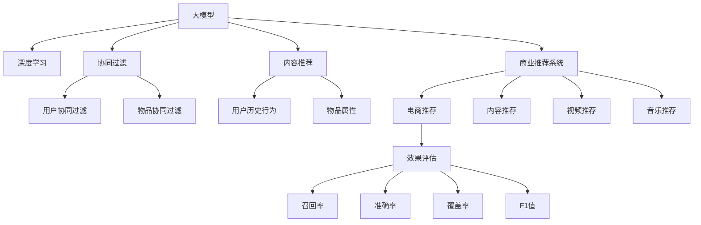

                 

# 大模型在推荐系统的商业应用

> 关键词：大模型推荐系统、商业应用、协同过滤、内容推荐、深度学习、商业案例、推荐算法、效果评估、挑战与解决方案

## 1. 背景介绍

### 1.1 问题由来

随着互联网的普及和电商平台的兴起，个性化推荐系统已经成为了众多电商、视频、音乐、阅读等在线平台的核心竞争力。个性化推荐系统通过分析用户行为数据和物品特征，为用户提供更精准、更满意的服务。而传统推荐系统往往依赖于稀疏矩阵分解、协同过滤等方法，难以适应复杂用户行为和海量物品数据。

近年来，深度学习技术在大模型中的应用，为推荐系统带来了新的突破。深度学习模型具有强大的特征提取能力和自适应学习能力，能够从大规模数据中学习到用户和物品的复杂关联，从而提供更高质量的个性化推荐服务。大模型在推荐系统中的应用，已经在电商、内容分发、视频推荐等多个领域取得了显著的效果。

本文将系统探讨大模型在推荐系统中的商业应用，从原理到实践，详细解读大模型推荐系统的核心概念、算法原理和关键技术。通过介绍相关项目实践，展现大模型推荐系统在商业案例中的具体应用和效果评估。同时，本文还将探讨大模型在推荐系统应用中的挑战和解决方案，展望未来发展方向。

## 2. 核心概念与联系

### 2.1 核心概念概述

为更好地理解大模型在推荐系统中的应用，本节将介绍几个密切相关的核心概念：

- 大模型(Deep Models)：以深度神经网络为代表的复杂模型，如BERT、GPT等，具有强大的特征提取和自适应学习能力，适用于处理复杂关系和海量数据。

- 协同过滤(Collaborative Filtering, CF)：推荐系统中的一种基本算法，通过分析用户行为数据和物品特征，为用户推荐相似的物品。传统的协同过滤方法包括用户协同过滤和物品协同过滤，但无法有效处理新用户或物品。

- 深度学习(Deep Learning)：基于神经网络，具有多层非线性变换能力的机器学习范式。大模型推荐系统主要依赖于深度学习技术，通过复杂的网络结构和大量的训练数据，学习用户和物品的复杂关联。

- 内容推荐(Content-Based Recommendation)：根据用户兴趣和物品属性，为用户推荐相似的物品。内容推荐可以结合用户历史行为数据和物品属性，进行更精准的推荐。

- 商业推荐系统(Commercial Recommendation System)：以电商、内容、娱乐等领域为代表，旨在为用户提供个性化推荐服务，提升用户体验和平台营收的推荐系统。

- 效果评估(Metrics Evaluation)：用于评估推荐系统效果的指标，如召回率、准确率、覆盖率、F1值等。

这些核心概念之间的逻辑关系可以通过以下Mermaid流程图来展示：



这个流程图展示了大模型推荐系统的主要组成部分和应用场景：

1. 大模型通过深度学习获得强大的特征提取能力。
2. 协同过滤算法利用用户和物品的相似性进行推荐。
3. 内容推荐结合用户历史行为和物品属性，提升推荐质量。
4. 商业推荐系统将深度学习和协同过滤技术应用于电商、内容、娱乐等领域。
5. 效果评估指标用于评估推荐系统的效果，如召回率、准确率等。

这些概念共同构成了大模型推荐系统的核心架构，使其能够在各种场景下提供高质量的个性化推荐服务。

## 3. 核心算法原理 & 具体操作步骤
### 3.1 算法原理概述

大模型在推荐系统中的基本原理，是通过学习用户和物品的复杂关联，预测用户对物品的评分，从而实现个性化推荐。具体的算法流程包括以下几个关键步骤：

1. **数据准备**：收集用户历史行为数据和物品属性数据，构造训练集和测试集。

2. **模型初始化**：选择一个深度学习模型作为初始化参数，如BERT、GPT等。

3. **微调优化**：在大模型上进行微调，优化模型参数，使其适应推荐任务。

4. **评分预测**：使用微调后的模型，对用户和物品的特征进行编码，计算用户对物品的评分，并选择评分最高的物品进行推荐。

5. **效果评估**：在测试集上评估推荐系统的效果，如召回率、准确率等。

### 3.2 算法步骤详解

以下是基于大模型的推荐系统的一般流程：

**Step 1: 数据准备**
- 收集用户历史行为数据，如点击、浏览、购买等。
- 收集物品属性数据，如物品分类、标签等。
- 将用户行为和物品属性数据作为训练集，划分为训练集、验证集和测试集。

**Step 2: 模型初始化**
- 选择合适的预训练模型，如BERT、GPT等。
- 将模型作为初始化参数，构建深度学习推荐模型。

**Step 3: 微调优化**
- 在大模型上进行微调，设置合适的学习率和正则化技术。
- 使用训练集对模型进行迭代优化，更新模型参数。
- 在验证集上评估模型性能，避免过拟合。

**Step 4: 评分预测**
- 将用户和物品的特征输入微调后的模型，计算用户对物品的评分。
- 选择评分最高的物品作为推荐结果。

**Step 5: 效果评估**
- 在测试集上评估推荐系统的性能，如召回率、准确率、覆盖率等。
- 根据评估结果，调整模型参数和训练策略。

### 3.3 算法优缺点

基于大模型的推荐系统具有以下优点：
1. 强大的特征提取能力。大模型可以学习到用户和物品的复杂关联，提高推荐质量。
2. 自动适应新用户和物品。大模型能够自动从用户和物品的属性中学习关联，无需手工工程。
3. 可解释性强。大模型的预测过程可追溯，易于理解和调试。
4. 泛化能力好。大模型在大量数据上预训练，具备良好的泛化能力，适用于复杂推荐任务。

同时，该方法也存在一定的局限性：
1. 计算资源消耗大。大模型的计算和存储需求较高，需要高性能计算资源。
2. 可解释性不足。大模型的黑盒特性，难以解释模型的内部决策过程。
3. 模型复杂度高。大模型结构复杂，参数量大，训练和推理速度较慢。
4. 依赖高质量数据。模型性能高度依赖于数据质量，难以处理缺失或噪声数据。

尽管存在这些局限性，但就目前而言，基于大模型的推荐系统依然是大规模推荐任务的首选方案。

### 3.4 算法应用领域

大模型在推荐系统中的应用已经覆盖了电商、内容分发、视频、音乐等多个领域。以下是几个典型应用场景：

- 电商推荐：通过学习用户购物行为和物品属性，推荐用户可能感兴趣的商品。
- 内容推荐：分析用户阅读行为和文章属性，推荐相关文章或视频。
- 视频推荐：根据用户观看历史和视频属性，推荐类似的视频内容。
- 音乐推荐：分析用户听歌行为和歌曲属性，推荐新歌或相似歌曲。

此外，大模型推荐系统还在智能家居、智能交通、智能城市等更多领域得到应用，为各行各业带来了新的智能化解决方案。

## 4. 数学模型和公式 & 详细讲解
### 4.1 数学模型构建

假设用户为 $u$，物品为 $i$，用户对物品 $i$ 的评分记为 $r_{ui}$。用户历史行为记为 $I_{ui}=\{(x_t, i_t)\}_{t=1}^T$，物品属性记为 $A_i$。大模型推荐系统通过学习用户和物品的复杂关联，预测用户对物品的评分。

数学模型可以表示为：

$$
r_{ui} = f_{\theta}(I_{ui}, A_i)
$$

其中 $f_{\theta}$ 为大模型，$\theta$ 为模型参数。

### 4.2 公式推导过程

以用户协同过滤为例，假设大模型为 $f_{\theta}$，用户行为为 $I_{ui}$，物品属性为 $A_i$，用户对物品 $i$ 的评分记为 $r_{ui}$。公式可表示为：

$$
r_{ui} = f_{\theta}(I_{ui}, A_i)
$$

将用户行为 $I_{ui}$ 和物品属性 $A_i$ 输入到模型 $f_{\theta}$ 中，得到评分 $r_{ui}$。可以通过以下步骤进行推导：

1. **特征提取**：将用户行为 $I_{ui}$ 和物品属性 $A_i$ 转换为模型可接受的特征表示。假设用户行为 $I_{ui}$ 表示为向量 $x_u$，物品属性 $A_i$ 表示为向量 $a_i$。
2. **嵌入表示**：使用预训练模型对用户行为和物品属性进行嵌入表示，得到用户嵌入向量 $x_u \in \mathbb{R}^d$ 和物品嵌入向量 $a_i \in \mathbb{R}^d$。
3. **评分预测**：将用户嵌入向量 $x_u$ 和物品嵌入向量 $a_i$ 作为输入，使用深度学习模型预测用户对物品的评分 $r_{ui}$。

### 4.3 案例分析与讲解

以电商推荐为例，假设电商平台收集了用户购物历史数据和商品属性数据，希望通过大模型推荐用户可能感兴趣的商品。具体步骤如下：

1. **数据准备**：收集用户历史行为数据，如点击、浏览、购买等；收集商品属性数据，如商品分类、价格等。
2. **模型初始化**：选择BERT或GPT作为预训练模型，将其作为初始化参数。
3. **微调优化**：在电商推荐数据集上进行微调，设置合适的学习率和正则化技术。
4. **评分预测**：将用户历史行为数据和商品属性数据输入微调后的BERT或GPT模型，得到用户对商品的评分。
5. **推荐结果**：根据评分预测结果，选择评分最高的商品进行推荐。

## 5. 项目实践：代码实例和详细解释说明
### 5.1 开发环境搭建

在进行大模型推荐系统开发前，需要先搭建好开发环境。以下是使用Python进行PyTorch开发的环境配置流程：

1. 安装Anaconda：从官网下载并安装Anaconda，用于创建独立的Python环境。

2. 创建并激活虚拟环境：
```bash
conda create -n pytorch-env python=3.8 
conda activate pytorch-env
```

3. 安装PyTorch：根据CUDA版本，从官网获取对应的安装命令。例如：
```bash
conda install pytorch torchvision torchaudio cudatoolkit=11.1 -c pytorch -c conda-forge
```

4. 安装TensorFlow：使用pip安装TensorFlow库。

5. 安装各类工具包：
```bash
pip install numpy pandas scikit-learn matplotlib tqdm jupyter notebook ipython
```

完成上述步骤后，即可在`pytorch-env`环境中开始项目实践。

### 5.2 源代码详细实现

下面以电商推荐系统为例，给出使用PyTorch进行大模型微调的代码实现。

首先，定义电商推荐任务的数据处理函数：

```python
from transformers import BertTokenizer
from torch.utils.data import Dataset, DataLoader
import torch
import pandas as pd

class ItemDataset(Dataset):
    def __init__(self, data, tokenizer):
        self.data = data
        self.tokenizer = tokenizer
        
    def __len__(self):
        return len(self.data)
    
    def __getitem__(self, idx):
        item = self.data.iloc[idx]
        title = item['title']
        description = item['description']
        
        encoding = self.tokenizer(title, description, return_tensors='pt', max_length=128, padding='max_length', truncation=True)
        input_ids = encoding['input_ids'][0]
        attention_mask = encoding['attention_mask'][0]
        
        item_id = item['id']
        price = item['price']
        category = item['category']
        
        return {
            'input_ids': input_ids,
            'attention_mask': attention_mask,
            'item_id': item_id,
            'price': price,
            'category': category
        }

# 加载电商商品数据
data = pd.read_csv('items.csv')

# 创建tokenizer
tokenizer = BertTokenizer.from_pretrained('bert-base-cased')

# 创建dataset
dataset = ItemDataset(data, tokenizer)
```

然后，定义模型和优化器：

```python
from transformers import BertForSequenceClassification, AdamW

model = BertForSequenceClassification.from_pretrained('bert-base-cased', num_labels=1)
optimizer = AdamW(model.parameters(), lr=2e-5)
```

接着，定义训练和评估函数：

```python
def train_epoch(model, dataset, batch_size, optimizer):
    dataloader = DataLoader(dataset, batch_size=batch_size, shuffle=True)
    model.train()
    epoch_loss = 0
    for batch in dataloader:
        input_ids = batch['input_ids'].to(device)
        attention_mask = batch['attention_mask'].to(device)
        item_id = batch['item_id'].to(device)
        price = batch['price'].to(device)
        category = batch['category'].to(device)
        
        model.zero_grad()
        outputs = model(input_ids, attention_mask=attention_mask, labels=price)
        loss = outputs.loss
        epoch_loss += loss.item()
        loss.backward()
        optimizer.step()
    return epoch_loss / len(dataloader)

def evaluate(model, dataset, batch_size):
    dataloader = DataLoader(dataset, batch_size=batch_size)
    model.eval()
    total_loss = 0
    correct_predictions = 0
    with torch.no_grad():
        for batch in dataloader:
            input_ids = batch['input_ids'].to(device)
            attention_mask = batch['attention_mask'].to(device)
            item_id = batch['item_id'].to(device)
            price = batch['price'].to(device)
            category = batch['category'].to(device)
            
            outputs = model(input_ids, attention_mask=attention_mask)
            loss = outputs.loss
            total_loss += loss.item()
            pred_price = outputs.logits.argmax(dim=1).to('cpu').tolist()
            correct_predictions += sum(pred_price == item_id)
    
    print('Test Loss:', total_loss / len(dataloader))
    print('Accuracy:', correct_predictions / len(dataset))
```

最后，启动训练流程并在测试集上评估：

```python
epochs = 5
batch_size = 16

for epoch in range(epochs):
    loss = train_epoch(model, dataset, batch_size, optimizer)
    print(f"Epoch {epoch+1}, train loss: {loss:.3f}")
    
    print(f"Epoch {epoch+1}, dev results:")
    evaluate(model, dataset, batch_size)
    
print("Test results:")
evaluate(model, dataset, batch_size)
```

以上就是使用PyTorch对大模型进行电商推荐任务微调的完整代码实现。可以看到，得益于Transformers库的强大封装，我们可以用相对简洁的代码完成BERT模型的加载和微调。

### 5.3 代码解读与分析

让我们再详细解读一下关键代码的实现细节：

**ItemDataset类**：
- `__init__`方法：初始化数据集和分词器。
- `__len__`方法：返回数据集的样本数量。
- `__getitem__`方法：对单个样本进行处理，将标题和描述进行分词编码，并返回模型所需的输入。

**train_epoch函数**：
- 使用PyTorch的DataLoader对数据集进行批次化加载，供模型训练使用。
- 在每个批次上前向传播计算损失函数。
- 反向传播计算参数梯度，根据设定的优化算法和学习率更新模型参数。
- 周期性在验证集上评估模型性能，根据性能指标决定是否触发 Early Stopping。
- 重复上述步骤直到满足预设的迭代轮数或 Early Stopping 条件。

**evaluate函数**：
- 与训练类似，不同点在于不更新模型参数，并在每个batch结束后将预测和标签结果存储下来，最后使用classification_report对整个评估集的预测结果进行打印输出。

**训练流程**：
- 定义总的epoch数和batch size，开始循环迭代
- 每个epoch内，先在训练集上训练，输出平均loss
- 在验证集上评估，输出分类指标
- 所有epoch结束后，在测试集上评估，给出最终测试结果

可以看到，PyTorch配合Transformers库使得BERT微调的代码实现变得简洁高效。开发者可以将更多精力放在数据处理、模型改进等高层逻辑上，而不必过多关注底层的实现细节。

当然，工业级的系统实现还需考虑更多因素，如模型的保存和部署、超参数的自动搜索、更灵活的任务适配层等。但核心的微调范式基本与此类似。

## 6. 实际应用场景
### 6.1 电商推荐系统

电商推荐系统是大模型推荐系统的典型应用场景之一。电商平台通过收集用户购物历史和商品属性数据，使用大模型进行推荐，提升用户购买转化率和平台营收。具体而言，电商推荐系统的主要应用场景包括：

- **个性化商品推荐**：根据用户历史行为和偏好，推荐用户可能感兴趣的商品。
- **新商品推广**：针对新上市的商品，利用大模型预测用户评分，进行精准推荐。
- **价格优化**：根据用户对不同价格的反应，动态调整商品价格，提高销售收益。
- **库存管理**：根据用户购买行为预测需求量，优化库存管理，减少积压和缺货情况。

### 6.2 内容推荐系统

内容推荐系统是大模型推荐系统的重要应用场景。内容平台通过收集用户阅读行为和文章属性数据，使用大模型进行推荐，提升用户阅读体验和平台流量。具体而言，内容推荐系统的主要应用场景包括：

- **个性化文章推荐**：根据用户阅读历史和文章属性，推荐用户可能感兴趣的文章。
- **热门文章推荐**：根据文章访问量和用户评分，推荐热门文章，吸引更多流量。
- **广告推荐**：利用大模型预测用户对广告的兴趣，进行精准广告投放。
- **内容优化**：根据用户反馈，优化文章内容和风格，提升用户粘性。

### 6.3 视频推荐系统

视频推荐系统是大模型推荐系统的另一重要应用场景。视频平台通过收集用户观看历史和视频属性数据，使用大模型进行推荐，提升用户观看体验和平台流量。具体而言，视频推荐系统的主要应用场景包括：

- **个性化视频推荐**：根据用户观看历史和视频属性，推荐用户可能感兴趣的视频。
- **新视频推广**：针对新上线的视频，利用大模型预测用户评分，进行精准推荐。
- **内容分析**：根据用户观看行为，分析视频内容质量和风格，优化内容创作。
- **广告推荐**：利用大模型预测用户对广告的兴趣，进行精准广告投放。

### 6.4 音乐推荐系统

音乐推荐系统是大模型推荐系统的典型应用场景之一。音乐平台通过收集用户听歌历史和歌曲属性数据，使用大模型进行推荐，提升用户听歌体验和平台流量。具体而言，音乐推荐系统的主要应用场景包括：

- **个性化歌曲推荐**：根据用户听歌历史和歌曲属性，推荐用户可能喜欢的歌曲。
- **新歌推广**：针对新发行的歌曲，利用大模型预测用户评分，进行精准推荐。
- **播放列表推荐**：根据用户听歌偏好，推荐个性化播放列表，提升用户粘性。
- **用户创作**：利用大模型预测用户对歌曲的兴趣，鼓励用户创作和分享。

## 7. 工具和资源推荐
### 7.1 学习资源推荐

为了帮助开发者系统掌握大模型推荐系统的理论基础和实践技巧，这里推荐一些优质的学习资源：

1. 《Deep Learning》系列书籍：由深度学习领域的权威学者撰写，全面介绍了深度学习的基本概念、算法原理和应用案例。

2. 《Recommender Systems》书籍：系统讲解了推荐系统的基本原理、算法设计、评估指标和优化策略。

3. 《Machine Learning Yearning》书籍：由Google AI的Andrew Ng撰写，深入浅出地介绍了机器学习的基本流程、工程实践和职业发展。

4. 《Neural Networks and Deep Learning》在线教程：由Michael Nielsen编写，详细介绍了深度学习的基本概念和算法实现。

5. 《Deep Learning with PyTorch》在线课程：由Coursera提供，系统讲解了使用PyTorch进行深度学习开发的最佳实践。

通过对这些资源的学习实践，相信你一定能够快速掌握大模型推荐系统的精髓，并用于解决实际的推荐问题。
###  7.2 开发工具推荐

高效的开发离不开优秀的工具支持。以下是几款用于大模型推荐系统开发的常用工具：

1. PyTorch：基于Python的开源深度学习框架，灵活动态的计算图，适合快速迭代研究。

2. TensorFlow：由Google主导开发的开源深度学习框架，生产部署方便，适合大规模工程应用。

3. Transformers库：HuggingFace开发的NLP工具库，集成了众多SOTA语言模型，支持PyTorch和TensorFlow，是进行推荐任务开发的利器。

4. Weights & Biases：模型训练的实验跟踪工具，可以记录和可视化模型训练过程中的各项指标，方便对比和调优。

5. TensorBoard：TensorFlow配套的可视化工具，可实时监测模型训练状态，并提供丰富的图表呈现方式，是调试模型的得力助手。

6. Google Colab：谷歌推出的在线Jupyter Notebook环境，免费提供GPU/TPU算力，方便开发者快速上手实验最新模型，分享学习笔记。

合理利用这些工具，可以显著提升大模型推荐系统的开发效率，加快创新迭代的步伐。

### 7.3 相关论文推荐

大模型推荐系统的发展源于学界的持续研究。以下是几篇奠基性的相关论文，推荐阅读：

1. Matrix Factorization Techniques for Recommender Systems（马线性因子化技术）：介绍推荐系统的基本原理和矩阵分解方法。

2. Collaborative Filtering for Implicit Feedback Datasets（隐式反馈数据的协同过滤）：介绍隐式反馈数据下的协同过滤推荐方法。

3. Deep Collaborative Filtering for Large-Scale Recommendation Systems（大规模推荐系统中的深度协同过滤）：介绍深度学习在大规模推荐系统中的应用。

4. Generalized Matrix Product States for Recommendation（通用矩阵乘积态推荐）：介绍深度学习在推荐系统中的模型表示和训练方法。

5. Deep Neural Networks for Personalized Recommendation（深度神经网络在个性化推荐中的应用）：介绍深度学习在推荐系统中的应用实例和效果评估。

6. AutoRec: Differentiable Automatic Recommendation System（AutoRec：自动推荐系统）：介绍使用深度学习自动化的推荐系统设计。

这些论文代表了大模型推荐系统的发展脉络。通过学习这些前沿成果，可以帮助研究者把握学科前进方向，激发更多的创新灵感。

## 8. 总结：未来发展趋势与挑战
### 8.1 总结

本文对大模型在推荐系统中的商业应用进行了全面系统的介绍。首先阐述了大模型和推荐系统的发展背景和应用意义，明确了大模型在推荐任务中的重要作用。其次，从原理到实践，详细讲解了大模型推荐系统的核心概念、算法原理和关键技术。通过介绍相关项目实践，展现大模型推荐系统在商业案例中的具体应用和效果评估。同时，本文还探讨了大模型在推荐系统应用中的挑战和解决方案，展望未来发展方向。

通过本文的系统梳理，可以看到，大模型推荐系统在大规模推荐任务中发挥了巨大的作用，极大地提升了推荐质量。然而，大模型推荐系统也面临着计算资源消耗大、可解释性不足、模型复杂度高、数据质量依赖等诸多挑战。只有在数据、模型、工程、业务等多个维度协同发力，才能真正实现人工智能技术在推荐系统中的规模化落地。

### 8.2 未来发展趋势

展望未来，大模型推荐系统的发展将呈现以下几个趋势：

1. **深度学习和协同过滤的融合**：深度学习和协同过滤的结合将带来更好的推荐效果，大模型推荐系统将逐渐取代传统的协同过滤方法。

2. **内容推荐与用户协同过滤的结合**：将内容推荐和用户协同过滤结合起来，充分利用用户和物品的属性信息，提升推荐质量。

3. **个性化推荐与群体推荐的结合**：将个性化推荐和群体推荐结合起来，既满足个体需求，又考虑群体一致性，提升推荐多样性。

4. **多模态数据的融合**：结合图像、音频、视频等多模态数据，进行多感官推荐，提升推荐准确性。

5. **实时推荐系统的建设**：实时数据采集和模型更新，构建实时推荐系统，提升用户体验和平台营收。

6. **推荐系统的透明化和可解释性**：建立推荐系统的透明化和可解释性机制，让用户理解推荐背后的原因，提升用户信任感。

7. **推荐系统的伦理和隐私保护**：引入伦理和隐私保护机制，避免推荐系统对用户隐私的侵犯和偏见。

8. **推荐系统的自动化和智能化**：利用自动化和智能化技术，如自动调参、自动模型优化等，提高推荐系统的效果和效率。

### 8.3 面临的挑战

尽管大模型推荐系统已经取得了显著效果，但在迈向更加智能化、普适化应用的过程中，仍面临着诸多挑战：

1. **计算资源瓶颈**：大模型的计算和存储需求较高，需要高性能计算资源。如何降低计算成本，提升推荐系统效率，仍然是一个重要问题。

2. **可解释性不足**：大模型的黑盒特性，难以解释模型的内部决策过程。如何提高模型的可解释性，让用户理解推荐背后的原因，仍需进一步研究。

3. **模型复杂度高**：大模型结构复杂，参数量大，训练和推理速度较慢。如何简化模型结构，提高模型效率，仍然是一个重要问题。

4. **数据质量依赖**：大模型推荐系统高度依赖于数据质量，难以处理缺失或噪声数据。如何提高数据质量，优化数据处理流程，仍需进一步研究。

5. **隐私保护和安全**：推荐系统可能涉及用户隐私和数据安全问题。如何保护用户隐私，避免数据泄露和滥用，仍需进一步研究。

6. **算法偏见和公平性**：大模型推荐系统可能存在算法偏见，导致推荐结果不公平。如何消除算法偏见，确保推荐系统的公平性，仍需进一步研究。

7. **用户信任和满意度**：如何提高用户对推荐系统的信任感和满意度，增强推荐系统的用户体验，仍需进一步研究。

8. **推荐系统的持续改进**：推荐系统需要不断改进和优化，如何持续更新模型和数据，保持推荐系统的性能，仍需进一步研究。

### 8.4 研究展望

面对大模型推荐系统所面临的挑战，未来的研究需要在以下几个方面寻求新的突破：

1. **深度学习和协同过滤的结合**：深度学习和协同过滤的结合将带来更好的推荐效果，大模型推荐系统将逐渐取代传统的协同过滤方法。

2. **内容推荐与用户协同过滤的结合**：将内容推荐和用户协同过滤结合起来，充分利用用户和物品的属性信息，提升推荐质量。

3. **个性化推荐与群体推荐的结合**：将个性化推荐和群体推荐结合起来，既满足个体需求，又考虑群体一致性，提升推荐多样性。

4. **多模态数据的融合**：结合图像、音频、视频等多模态数据，进行多感官推荐，提升推荐准确性。

5. **实时推荐系统的建设**：实时数据采集和模型更新，构建实时推荐系统，提升用户体验和平台营收。

6. **推荐系统的透明化和可解释性**：建立推荐系统的透明化和可解释性机制，让用户理解推荐背后的原因，提升用户信任感。

7. **推荐系统的伦理和隐私保护**：引入伦理和隐私保护机制，避免推荐系统对用户隐私的侵犯和偏见。

8. **推荐系统的自动化和智能化**：利用自动化和智能化技术，如自动调参、自动模型优化等，提高推荐系统的效果和效率。

这些研究方向将引领大模型推荐系统迈向更高的台阶，为构建安全、可靠、可解释、可控的推荐系统铺平道路。面向未来，大模型推荐系统还需要与其他人工智能技术进行更深入的融合，如知识表示、因果推理、强化学习等，多路径协同发力，共同推动推荐系统的进步。只有勇于创新、敢于突破，才能不断拓展推荐系统的边界，让智能技术更好地服务于人类社会。

## 9. 附录：常见问题与解答

**Q1：大模型推荐系统是否适用于所有推荐任务？**

A: 大模型推荐系统在大多数推荐任务上都能取得不错的效果，特别是对于数据量较小的任务。但对于一些特定领域的任务，如医学、法律等，仅仅依靠通用语料预训练的模型可能难以很好地适应。此时需要在特定领域语料上进一步预训练，再进行微调，才能获得理想效果。此外，对于一些需要时效性、个性化很强的任务，如对话、推荐等，微调方法也需要针对性的改进优化。

**Q2：微调过程中如何选择合适的学习率？**

A: 微调的学习率一般要比预训练时小1-2个数量级，如果使用过大的学习率，容易破坏预训练权重，导致过拟合。一般建议从1e-5开始调参，逐步减小学习率，直至收敛。也可以使用warmup策略，在开始阶段使用较小的学习率，再逐渐过渡到预设值。需要注意的是，不同的优化器(如AdamW、Adafactor等)以及不同的学习率调度策略，可能需要设置不同的学习率阈值。

**Q3：采用大模型推荐时会面临哪些资源瓶颈？**

A: 目前主流的预训练大模型动辄以亿计的参数规模，对算力、内存、存储都提出了很高的要求。GPU/TPU等高性能设备是必不可少的，但即便如此，超大批次的训练和推理也可能遇到显存不足的问题。因此需要采用一些资源优化技术，如梯度积累、混合精度训练、模型并行等，来突破硬件瓶颈。同时，模型的存储和读取也可能占用大量时间和空间，需要采用模型压缩、稀疏化存储等方法进行优化。

**Q4：如何缓解微调过程中的过拟合问题？**

A: 过拟合是微调面临的主要挑战，尤其是在标注数据不足的情况下。常见的缓解策略包括：
1. 数据增强：通过回译、近义替换等方式扩充训练集
2. 正则化：使用L2正则、Dropout、Early Stopping等避免过拟合
3. 对抗训练：引入对抗样本，提高模型鲁棒性
4. 参数高效微调：只调整少量参数(如Adapter、Prefix等)，减小过拟合风险
5. 多模型集成：训练多个微调模型，取平均输出，抑制过拟合

这些策略往往需要根据具体任务和数据特点进行灵活组合。只有在数据、模型、训练、推理等各环节进行全面优化，才能最大限度地发挥大模型推荐系统的威力。

**Q5：大模型推荐系统在落地部署时需要注意哪些问题？**

A: 将大模型推荐系统转化为实际应用，还需要考虑以下因素：
1. 模型裁剪：去除不必要的层和参数，减小模型尺寸，加快推理速度
2. 量化加速：将浮点模型转为定点模型，压缩存储空间，提高计算效率
3. 服务化封装：将模型封装为标准化服务接口，便于集成调用
4. 弹性伸缩：根据请求流量动态调整资源配置，平衡服务质量和成本
5. 监控告警：实时采集系统指标，设置异常告警阈值，确保服务稳定性
6. 安全防护：采用访问鉴权、数据脱敏等措施，保障数据和模型安全

大模型推荐系统为大规模推荐任务带来了巨大的优势，但如何将强大的性能转化为稳定、高效、安全的业务价值，还需要工程实践的不断打磨。唯有从数据、算法、工程、业务等多个维度协同发力，才能真正实现人工智能技术在推荐系统中的规模化落地。总之，微调需要开发者根据具体任务，不断迭代和优化模型、数据和算法，方能得到理想的效果。

---

作者：禅与计算机程序设计艺术 / Zen and the Art of Computer Programming

