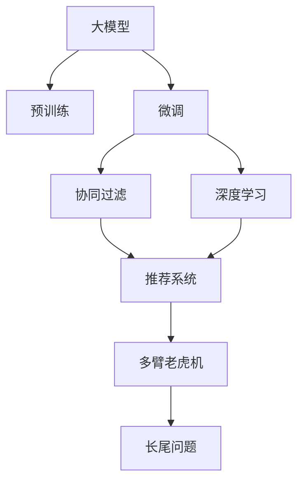

                 

# 大模型在推荐系统的未来

> 关键词：大模型,推荐系统,深度学习,个性化推荐,协同过滤,深度学习,多臂老虎机

## 1. 背景介绍

### 1.1 问题由来
随着互联网技术的发展，推荐系统已成为各大电商、社交、视频等平台的核心竞争力之一。传统的协同过滤、基于内容的推荐方法在满足个性化需求方面存在局限性，无法充分考虑用户的多样性和动态性。而大模型的出现，为推荐系统带来了全新的突破，通过学习海量的用户行为数据，构建强大的用户画像和商品特征表示，能够实现更加精准、多样化的推荐结果。

### 1.2 问题核心关键点
大模型在推荐系统中的应用，核心在于如何利用预训练语言模型的广泛知识，通过微调等方式，构建与推荐场景高度相关的用户模型和商品模型，实现个性化推荐。关键点包括：

- 如何选择合适的预训练语言模型，如BERT、GPT、RoBERTa等。
- 如何从推荐场景中提取任务，构建合适的推荐目标函数。
- 如何通过微调、蒸馏等方法，优化用户模型和商品模型，提升推荐效果。
- 如何利用多臂老虎机等强化学习算法，动态调整推荐策略，实现更高效的个性化推荐。
- 如何应对长尾问题，确保每个商品都能得到公平的展示机会。

### 1.3 问题研究意义
研究大模型在推荐系统中的应用，对于提升推荐系统的个性化水平、丰富用户推荐体验、增加平台粘性、提高转化率等具有重要意义：

1. 提升推荐精度。通过学习用户和商品的深度语义特征，大模型能够挖掘用户和商品之间的潜在关联，从而提升推荐的精准度。
2. 扩展推荐维度。预训练语言模型的广泛知识能够帮助推荐系统扩展推荐场景，如关联推荐、商品评价、标签推荐等，丰富推荐内容。
3. 优化推荐策略。大模型可学习复杂的用户行为模式，为推荐策略的设计提供指导，优化推荐效果。
4. 增强系统弹性。大模型的多任务学习特性能够适应多变的业务需求，提升推荐系统的灵活性和弹性。
5. 促进数据闭环。大模型的多模态融合能力能够将用户行为、商品信息、外部知识等多维度信息融合，形成更全面的用户画像，促进数据反馈和闭环优化。

## 2. 核心概念与联系

### 2.1 核心概念概述

为更好地理解大模型在推荐系统中的应用，本节将介绍几个密切相关的核心概念：

- 大模型(Large Model)：以自回归(如GPT)或自编码(如BERT)模型为代表的大规模预训练模型。通过在大规模无标签文本语料上进行预训练，学习通用的语言表示，具备强大的语言理解和生成能力。
- 预训练(Pre-training)：指在大规模无标签文本语料上，通过自监督学习任务训练通用语言模型的过程。常见的预训练任务包括言语建模、遮挡语言模型等。
- 微调(Fine-tuning)：指在预训练模型的基础上，使用推荐系统任务的大量标注数据，通过有监督学习优化模型在该任务上的性能。通常只需要调整顶层分类器或解码器，并以较小的学习率更新全部或部分模型参数。
- 协同过滤(Collaborative Filtering)：通过用户和商品之间的关系构建推荐模型，如用户-商品评分矩阵等。
- 深度学习(Deep Learning)：以神经网络为基础的机器学习技术，能够处理复杂非线性关系，适用于推荐系统的多模态融合和用户行为建模。
- 多臂老虎机(Multi-Armed Bandit)：一种强化学习模型，用于动态调整推荐策略，优化用户体验。
- 长尾问题(Long Tail Problem)：指推荐系统中的少数商品在总销量中占比很小，但带来较高利润的现象，如何处理长尾商品是一个重要挑战。

这些核心概念之间的逻辑关系可以通过以下Mermaid流程图来展示：



这个流程图展示了大模型、微调、协同过滤、深度学习、多臂老虎机、长尾问题等核心概念及其之间的关系：

1. 大模型通过预训练获得基础能力。
2. 微调是对预训练模型进行任务特定的优化，可以通过调整顶层分类器或解码器，以较小的学习率更新全部或部分模型参数。
3. 协同过滤通过用户和商品之间的关系构建推荐模型。
4. 深度学习用于构建用户和商品的深度语义特征表示。
5. 多臂老虎机用于动态调整推荐策略，优化用户体验。
6. 长尾问题指少数商品在总销量中的占比很小，但带来较高利润的现象。

这些概念共同构成了推荐系统和大模型的学习和应用框架，使其能够在各种场景下发挥强大的推荐能力。通过理解这些核心概念，我们可以更好地把握大模型在推荐系统中的应用方向。

## 3. 核心算法原理 & 具体操作步骤
### 3.1 算法原理概述

大模型在推荐系统中的应用，本质上是一个基于有监督学习的优化过程。其核心思想是：将预训练的大模型视作一个强大的特征提取器，通过在推荐系统任务的大量标注数据上进行有监督的微调，使得模型输出能够匹配任务标签，从而获得针对特定推荐任务的优化。

形式化地，假设预训练模型为 $M_{\theta}$，其中 $\theta$ 为预训练得到的模型参数。给定推荐系统任务 $T$ 的标注数据集 $D=\{(x_i,y_i)\}_{i=1}^N, x_i \in \mathcal{X}, y_i \in \mathcal{Y}$，微调的目标是找到新的模型参数 $\hat{\theta}$，使得：

$$
\hat{\theta}=\mathop{\arg\min}_{\theta} \mathcal{L}(M_{\theta},D)
$$

其中 $\mathcal{L}$ 为针对任务 $T$ 设计的损失函数，用于衡量模型预测输出与真实标签之间的差异。常见的损失函数包括交叉熵损失、均方误差损失等。

通过梯度下降等优化算法，微调过程不断更新模型参数 $\theta$，最小化损失函数 $\mathcal{L}$，使得模型输出逼近真实标签。由于 $\theta$ 已经通过预训练获得了较好的初始化，因此即便在推荐系统任务的大量标注数据集 $D$ 上进行微调，也能较快收敛到理想的模型参数 $\hat{\theta}$。

### 3.2 算法步骤详解

基于有监督学习的大模型在推荐系统中的应用一般包括以下几个关键步骤：

**Step 1: 准备预训练模型和数据集**
- 选择合适的预训练语言模型 $M_{\theta}$ 作为初始化参数，如 BERT、GPT 等。
- 准备推荐系统任务 $T$ 的标注数据集 $D$，划分为训练集、验证集和测试集。一般要求标注数据与预训练数据的分布不要差异过大。

**Step 2: 设计任务适配层**
- 根据推荐系统任务类型，在预训练模型顶层设计合适的输出层和损失函数。
- 对于推荐任务，通常使用交叉熵损失函数。
- 对于排序任务，通常使用多项式损失函数。

**Step 3: 设置微调超参数**
- 选择合适的优化算法及其参数，如 AdamW、SGD 等，设置学习率、批大小、迭代轮数等。
- 设置正则化技术及强度，包括权重衰减、Dropout、Early Stopping 等。
- 确定冻结预训练参数的策略，如仅微调顶层，或全部参数都参与微调。

**Step 4: 执行梯度训练**
- 将训练集数据分批次输入模型，前向传播计算损失函数。
- 反向传播计算参数梯度，根据设定的优化算法和学习率更新模型参数。
- 周期性在验证集上评估模型性能，根据性能指标决定是否触发 Early Stopping。
- 重复上述步骤直到满足预设的迭代轮数或 Early Stopping 条件。

**Step 5: 测试和部署**
- 在测试集上评估微调后模型 $M_{\hat{\theta}}$ 的性能，对比微调前后的推荐精度提升。
- 使用微调后的模型对新商品进行推荐，集成到实际的应用系统中。
- 持续收集新的用户行为数据，定期重新微调模型，以适应数据分布的变化。

以上是基于有监督学习微调大模型在推荐系统中的应用的一般流程。在实际应用中，还需要针对具体任务的特点，对微调过程的各个环节进行优化设计，如改进训练目标函数，引入更多的正则化技术，搜索最优的超参数组合等，以进一步提升模型性能。

### 3.3 算法优缺点

基于有监督学习的大模型在推荐系统中的应用具有以下优点：
1. 简单高效。只需准备大量标注数据，即可对预训练模型进行快速适配，获得较大的性能提升。
2. 通用适用。适用于各种推荐系统任务，包括推荐、排序、关联推荐等，设计简单的任务适配层即可实现微调。
3. 效果显著。在学术界和工业界的诸多推荐任务上，基于微调的方法已经刷新了多项SOTA。
4. 参数高效。利用参数高效微调技术，在固定大部分预训练参数的情况下，仍可取得不错的提升。
5. 可解释性不足。微调模型的决策过程通常缺乏可解释性，难以对其推理逻辑进行分析和调试。

同时，该方法也存在一定的局限性：
1. 依赖标注数据。微调的效果很大程度上取决于标注数据的质量和数量，获取高质量标注数据的成本较高。
2. 迁移能力有限。当目标任务与预训练数据的分布差异较大时，微调的性能提升有限。
3. 负面效果传递。预训练模型的固有偏见、有害信息等，可能通过微调传递到推荐系统任务，造成负面影响。
4. 可解释性不足。微调模型的决策过程通常缺乏可解释性，难以对其推理逻辑进行分析和调试。

尽管存在这些局限性，但就目前而言，基于有监督学习的微调方法仍是大模型在推荐系统应用的主流范式。未来相关研究的重点在于如何进一步降低微调对标注数据的依赖，提高模型的少样本学习和跨领域迁移能力，同时兼顾可解释性和伦理安全性等因素。

### 3.4 算法应用领域

基于大模型的微调方法在推荐系统领域已经得到了广泛的应用，涵盖了多种推荐任务，例如：

- 商品推荐：如电商平台的商品推荐、视频网站的影片推荐等。通过微调使模型学习用户行为和商品特征的关联。
- 用户画像：如社交网络的用户兴趣建模、新闻订阅的个性化推荐等。通过微调使模型理解用户的多样化需求。
- 个性化搜索：如搜索引擎的搜索结果排序、个性化问答系统等。通过微调使模型理解用户的查询意图和搜索行为。
- 广告推荐：如互联网广告的定向投放、移动应用的个性化广告推荐等。通过微调使模型学习用户对广告的偏好和点击行为。
- 多任务推荐：如电商平台同时实现商品推荐、广告推荐、搜索排序等任务，通过微调使不同任务之间共享特征表示，提升整体系统性能。

除了上述这些经典任务外，大模型微调方法还被创新性地应用于更多场景中，如广告点击率预测、推荐内容多样化、交叉销售推荐等，为推荐系统带来了全新的突破。随着预训练模型和微调方法的不断进步，相信推荐系统将在更广阔的应用领域大放异彩。

## 4. 数学模型和公式 & 详细讲解  
### 4.1 数学模型构建

本节将使用数学语言对基于有监督学习的大模型在推荐系统中的应用过程进行更加严格的刻画。

记预训练语言模型为 $M_{\theta}$，其中 $\theta$ 为预训练得到的模型参数。假设推荐系统任务 $T$ 的训练集为 $D=\{(x_i,y_i)\}_{i=1}^N, x_i \in \mathcal{X}, y_i \in \mathcal{Y}$。

定义模型 $M_{\theta}$ 在输入 $x$ 上的输出为 $\hat{y}=M_{\theta}(x) \in [0,1]$，表示商品与用户匹配的概率。真实标签 $y \in \{0,1\}$。则推荐任务的交叉熵损失函数定义为：

$$
\ell(M_{\theta}(x),y) = -y\log \hat{y} - (1-y)\log(1-\hat{y})
$$

将其代入经验风险公式，得：

$$
\mathcal{L}(\theta) = -\frac{1}{N}\sum_{i=1}^N [y_i\log M_{\theta}(x_i)+(1-y_i)\log(1-M_{\theta}(x_i))]
$$

根据链式法则，损失函数对参数 $\theta_k$ 的梯度为：

$$
\frac{\partial \mathcal{L}(\theta)}{\partial \theta_k} = -\frac{1}{N}\sum_{i=1}^N \left(\frac{y_i}{\hat{y_i}}-\frac{1-y_i}{1-\hat{y_i}}\right) \frac{\partial M_{\theta}(x_i)}{\partial \theta_k}
$$

其中 $\frac{\partial M_{\theta}(x_i)}{\partial \theta_k}$ 可进一步递归展开，利用自动微分技术完成计算。

在得到损失函数的梯度后，即可带入参数更新公式，完成模型的迭代优化。重复上述过程直至收敛，最终得到适应推荐系统任务的最优模型参数 $\theta^*$。

### 4.2 公式推导过程

以下我们以推荐任务为例，推导交叉熵损失函数及其梯度的计算公式。

假设模型 $M_{\theta}$ 在输入 $x$ 上的输出为 $\hat{y}=M_{\theta}(x) \in [0,1]$，表示商品与用户匹配的概率。真实标签 $y \in \{0,1\}$。则二分类交叉熵损失函数定义为：

$$
\ell(M_{\theta}(x),y) = -y\log \hat{y} - (1-y)\log(1-\hat{y})
$$

将其代入经验风险公式，得：

$$
\mathcal{L}(\theta) = -\frac{1}{N}\sum_{i=1}^N [y_i\log M_{\theta}(x_i)+(1-y_i)\log(1-M_{\theta}(x_i))]
$$

根据链式法则，损失函数对参数 $\theta_k$ 的梯度为：

$$
\frac{\partial \mathcal{L}(\theta)}{\partial \theta_k} = -\frac{1}{N}\sum_{i=1}^N \left(\frac{y_i}{\hat{y_i}}-\frac{1-y_i}{1-\hat{y_i}}\right) \frac{\partial M_{\theta}(x_i)}{\partial \theta_k}
$$

其中 $\frac{\partial M_{\theta}(x_i)}{\partial \theta_k}$ 可进一步递归展开，利用自动微分技术完成计算。

在得到损失函数的梯度后，即可带入参数更新公式，完成模型的迭代优化。重复上述过程直至收敛，最终得到适应推荐系统任务的最优模型参数 $\theta^*$。

## 5. 项目实践：代码实例和详细解释说明
### 5.1 开发环境搭建

在进行推荐系统微调实践前，我们需要准备好开发环境。以下是使用Python进行PyTorch开发的环境配置流程：

1. 安装Anaconda：从官网下载并安装Anaconda，用于创建独立的Python环境。

2. 创建并激活虚拟环境：
```bash
conda create -n recommendation-env python=3.8 
conda activate recommendation-env
```

3. 安装PyTorch：根据CUDA版本，从官网获取对应的安装命令。例如：
```bash
conda install pytorch torchvision torchaudio cudatoolkit=11.1 -c pytorch -c conda-forge
```

4. 安装TensorFlow：
```bash
conda install tensorflow
```

5. 安装TensorBoard：
```bash
pip install tensorboard
```

6. 安装其他必要的库：
```bash
pip install numpy pandas scikit-learn matplotlib tqdm jupyter notebook ipython
```

完成上述步骤后，即可在`recommendation-env`环境中开始推荐系统微调实践。

### 5.2 源代码详细实现

这里我们以电商平台商品推荐为例，给出使用Transformers库对BERT模型进行微调的PyTorch代码实现。

首先，定义推荐任务的数据处理函数：

```python
from transformers import BertTokenizer
from torch.utils.data import Dataset
import torch

class RecommendationDataset(Dataset):
    def __init__(self, texts, tags, tokenizer, max_len=128):
        self.texts = texts
        self.tags = tags
        self.tokenizer = tokenizer
        self.max_len = max_len
        
    def __len__(self):
        return len(self.texts)
    
    def __getitem__(self, item):
        text = self.texts[item]
        tags = self.tags[item]
        
        encoding = self.tokenizer(text, return_tensors='pt', max_length=self.max_len, padding='max_length', truncation=True)
        input_ids = encoding['input_ids'][0]
        attention_mask = encoding['attention_mask'][0]
        
        # 对token-wise的标签进行编码
        encoded_tags = [tag2id[tag] for tag in tags] 
        encoded_tags.extend([tag2id['O']] * (self.max_len - len(encoded_tags)))
        labels = torch.tensor(encoded_tags, dtype=torch.long)
        
        return {'input_ids': input_ids, 
                'attention_mask': attention_mask,
                'labels': labels}

# 标签与id的映射
tag2id = {'O': 0, 'B-Item': 1, 'I-Item': 2, 'B-User': 3, 'I-User': 4}
id2tag = {v: k for k, v in tag2id.items()}

# 创建dataset
tokenizer = BertTokenizer.from_pretrained('bert-base-cased')

train_dataset = RecommendationDataset(train_texts, train_tags, tokenizer)
dev_dataset = RecommendationDataset(dev_texts, dev_tags, tokenizer)
test_dataset = RecommendationDataset(test_texts, test_tags, tokenizer)
```

然后，定义模型和优化器：

```python
from transformers import BertForTokenClassification, AdamW

model = BertForTokenClassification.from_pretrained('bert-base-cased', num_labels=len(tag2id))

optimizer = AdamW(model.parameters(), lr=2e-5)
```

接着，定义训练和评估函数：

```python
from torch.utils.data import DataLoader
from tqdm import tqdm
from sklearn.metrics import classification_report

device = torch.device('cuda') if torch.cuda.is_available() else torch.device('cpu')
model.to(device)

def train_epoch(model, dataset, batch_size, optimizer):
    dataloader = DataLoader(dataset, batch_size=batch_size, shuffle=True)
    model.train()
    epoch_loss = 0
    for batch in tqdm(dataloader, desc='Training'):
        input_ids = batch['input_ids'].to(device)
        attention_mask = batch['attention_mask'].to(device)
        labels = batch['labels'].to(device)
        model.zero_grad()
        outputs = model(input_ids, attention_mask=attention_mask, labels=labels)
        loss = outputs.loss
        epoch_loss += loss.item()
        loss.backward()
        optimizer.step()
    return epoch_loss / len(dataloader)

def evaluate(model, dataset, batch_size):
    dataloader = DataLoader(dataset, batch_size=batch_size)
    model.eval()
    preds, labels = [], []
    with torch.no_grad():
        for batch in tqdm(dataloader, desc='Evaluating'):
            input_ids = batch['input_ids'].to(device)
            attention_mask = batch['attention_mask'].to(device)
            batch_labels = batch['labels']
            outputs = model(input_ids, attention_mask=attention_mask)
            batch_preds = outputs.logits.argmax(dim=2).to('cpu').tolist()
            batch_labels = batch_labels.to('cpu').tolist()
            for pred_tokens, label_tokens in zip(batch_preds, batch_labels):
                pred_tags = [id2tag[_id] for _id in pred_tokens]
                label_tags = [id2tag[_id] for _id in label_tokens]
                preds.append(pred_tags[:len(label_tags)])
                labels.append(label_tags)
                
    print(classification_report(labels, preds))
```

最后，启动训练流程并在测试集上评估：

```python
epochs = 5
batch_size = 16

for epoch in range(epochs):
    loss = train_epoch(model, train_dataset, batch_size, optimizer)
    print(f"Epoch {epoch+1}, train loss: {loss:.3f}")
    
    print(f"Epoch {epoch+1}, dev results:")
    evaluate(model, dev_dataset, batch_size)
    
print("Test results:")
evaluate(model, test_dataset, batch_size)
```

以上就是使用PyTorch对BERT进行电商平台商品推荐任务微调的完整代码实现。可以看到，得益于Transformers库的强大封装，我们可以用相对简洁的代码完成BERT模型的加载和微调。

### 5.3 代码解读与分析

让我们再详细解读一下关键代码的实现细节：

**RecommendationDataset类**：
- `__init__`方法：初始化文本、标签、分词器等关键组件。
- `__len__`方法：返回数据集的样本数量。
- `__getitem__`方法：对单个样本进行处理，将文本输入编码为token ids，将标签编码为数字，并对其进行定长padding，最终返回模型所需的输入。

**tag2id和id2tag字典**：
- 定义了标签与数字id之间的映射关系，用于将token-wise的预测结果解码回真实的标签。

**训练和评估函数**：
- 使用PyTorch的DataLoader对数据集进行批次化加载，供模型训练和推理使用。
- 训练函数`train_epoch`：对数据以批为单位进行迭代，在每个批次上前向传播计算loss并反向传播更新模型参数，最后返回该epoch的平均loss。
- 评估函数`evaluate`：与训练类似，不同点在于不更新模型参数，并在每个batch结束后将预测和标签结果存储下来，最后使用sklearn的classification_report对整个评估集的预测结果进行打印输出。

**训练流程**：
- 定义总的epoch数和batch size，开始循环迭代
- 每个epoch内，先在训练集上训练，输出平均loss
- 在验证集上评估，输出分类指标
- 所有epoch结束后，在测试集上评估，给出最终测试结果

可以看到，PyTorch配合Transformers库使得BERT微调的代码实现变得简洁高效。开发者可以将更多精力放在数据处理、模型改进等高层逻辑上，而不必过多关注底层的实现细节。

当然，工业级的系统实现还需考虑更多因素，如模型的保存和部署、超参数的自动搜索、更灵活的任务适配层等。但核心的微调范式基本与此类似。

## 6. 实际应用场景
### 6.1 电商平台

基于大模型微调的推荐系统在电商平台上得到了广泛应用，成为提高用户体验、提升转化率的关键技术。通过微调，推荐系统可以实时学习用户行为和商品特征，实现个性化推荐，减少用户购物选择的时间和成本，提高购物体验和满意度。

在技术实现上，可以收集用户在电商平台上的浏览、点击、购买等行为数据，将其与商品信息结合，作为监督数据，对预训练语言模型进行微调。微调后的模型能够理解用户的个性化需求，推荐最符合用户兴趣的商品。对于热门商品，还可以结合广告定向技术，提升广告点击率和销售额。

### 6.2 视频平台

视频平台上的推荐系统同样受益于大模型微调技术。通过微调，推荐系统可以准确预测用户对视频内容的兴趣，实现个性化视频推荐，提高用户观看时长和满意度。

具体而言，可以收集用户观看历史、评分、评论等数据，作为监督信号，对预训练语言模型进行微调。微调后的模型能够学习到视频内容的深度语义特征，准确预测用户对不同视频内容的喜好程度。结合多臂老虎机等强化学习算法，动态调整推荐策略，提升推荐效果。

### 6.3 新闻推荐

新闻推荐是推荐系统的重要应用场景之一。通过微调，推荐系统能够实时学习用户的新闻阅读偏好，推荐符合用户兴趣的新闻内容，提升新闻平台的阅读量和用户粘性。

具体实现上，可以收集用户对新闻的阅读行为数据，如阅读时间、浏览深度、点赞评论等，作为监督信号，对预训练语言模型进行微调。微调后的模型能够学习到新闻内容的语义特征，准确预测用户对不同新闻内容的兴趣程度。结合多臂老虎机等强化学习算法，动态调整新闻推荐策略，优化推荐效果。

### 6.4 未来应用展望

随着大模型微调技术的不断进步，推荐系统将在更多领域得到应用，为各行各业带来变革性影响。

在智慧医疗领域，基于微调的医疗推荐系统能够实时推荐最新的医疗知识和技术，帮助医生制定个性化诊疗方案，提升诊疗效果和患者满意度。

在智能教育领域，微调技术可应用于学习资源的推荐、个性化学习路径的构建等，因材施教，提高教育质量和效率。

在智慧城市治理中，微调模型可应用于公共服务的推荐、城市事件监测等环节，提高城市管理的自动化和智能化水平，构建更安全、高效的未来城市。

此外，在企业生产、社会治理、文娱传媒等众多领域，基于大模型微调的人工智能应用也将不断涌现，为经济社会发展注入新的动力。相信随着技术的日益成熟，微调方法将成为推荐系统落地应用的重要范式，推动人工智能技术在各行各业加速渗透。

## 7. 工具和资源推荐
### 7.1 学习资源推荐

为了帮助开发者系统掌握大模型微调的理论基础和实践技巧，这里推荐一些优质的学习资源：

1. 《深度学习理论与实践》系列博文：由深度学习专家撰写，深入浅出地介绍了深度学习的基本原理和常用技术，包括微调方法。

2. CS231n《深度学习视觉表示与卷积神经网络》课程：斯坦福大学开设的计算机视觉课程，涵盖多种深度学习应用场景，如推荐系统、多臂老虎机等。

3. 《推荐系统实战》书籍：全面介绍推荐系统的理论基础和工程实践，包括多臂老虎机、深度学习等前沿技术。

4. Kaggle推荐系统竞赛：参加Kaggle的推荐系统竞赛，可以深入理解推荐系统的工程实现和优化技巧。

5. RecSys开源项目：推荐系统社区开源项目，提供多种推荐算法和数据集，方便研究者快速上手实验。

通过对这些资源的学习实践，相信你一定能够快速掌握大模型微调的精髓，并用于解决实际的推荐系统问题。
###  7.2 开发工具推荐

高效的开发离不开优秀的工具支持。以下是几款用于推荐系统微调开发的常用工具：

1. PyTorch：基于Python的开源深度学习框架，灵活动态的计算图，适合快速迭代研究。大部分预训练语言模型都有PyTorch版本的实现。

2. TensorFlow：由Google主导开发的开源深度学习框架，生产部署方便，适合大规模工程应用。同样有丰富的预训练语言模型资源。

3. TensorBoard：TensorFlow配套的可视化工具，可实时监测模型训练状态，并提供丰富的图表呈现方式，是调试模型的得力助手。

4. Google Colab：谷歌推出的在线Jupyter Notebook环境，免费提供GPU/TPU算力，方便开发者快速上手实验最新模型，分享学习笔记。

合理利用这些工具，可以显著提升推荐系统微调任务的开发效率，加快创新迭代的步伐。

### 7.3 相关论文推荐

大模型微调技术的发展源于学界的持续研究。以下是几篇奠基性的相关论文，推荐阅读：

1. Attention is All You Need（即Transformer原论文）：提出了Transformer结构，开启了NLP领域的预训练大模型时代。

2. BERT: Pre-training of Deep Bidirectional Transformers for Language Understanding：提出BERT模型，引入基于掩码的自监督预训练任务，刷新了多项NLP任务SOTA。

3. Multi-Armed Bandits（即多臂老虎机）：提出多臂老虎机模型，用于优化推荐系统中的奖励获取，优化用户体验。

4. Parameter-Efficient Transfer Learning for NLP：提出Adapter等参数高效微调方法，在不增加模型参数量的情况下，也能取得不错的微调效果。

5. Fully Adaptive Subnetworks for Neural Network Acceleration：提出多子网络架构，利用子网络间的多样性，优化模型推理速度和资源利用率。

这些论文代表了大模型微调技术的发展脉络。通过学习这些前沿成果，可以帮助研究者把握学科前进方向，激发更多的创新灵感。

## 8. 总结：未来发展趋势与挑战

### 8.1 总结

本文对基于有监督学习的大模型在推荐系统中的应用进行了全面系统的介绍。首先阐述了大模型和微调技术的研究背景和意义，明确了微调在提升推荐系统个性化水平、丰富用户推荐体验、增加平台粘性、提高转化率等方面的重要价值。其次，从原理到实践，详细讲解了推荐系统的数学模型和关键步骤，给出了推荐任务开发的完整代码实例。同时，本文还广泛探讨了推荐系统在大模型中的应用场景，展示了微调范式的广泛应用前景。此外，本文精选了推荐系统相关的学习资源，力求为读者提供全方位的技术指引。

通过本文的系统梳理，可以看到，基于大模型的微调方法正在成为推荐系统的重要范式，极大地拓展了预训练语言模型的应用边界，催生了更多的落地场景。受益于大规模语料的预训练，微调模型在推荐系统中取得了显著的推荐精度提升，为推荐系统的发展注入了新的活力。未来，伴随预训练语言模型和微调方法的持续演进，相信推荐系统将在更广阔的应用领域大放异彩，深刻影响人类的生产生活方式。

### 8.2 未来发展趋势

展望未来，大模型在推荐系统中的应用将呈现以下几个发展趋势：

1. 模型规模持续增大。随着算力成本的下降和数据规模的扩张，预训练语言模型的参数量还将持续增长。超大规模语言模型蕴含的丰富语言知识，有望支撑更加复杂多变的推荐场景，提升推荐系统的表现。

2. 微调方法日趋多样。除了传统的全参数微调外，未来会涌现更多参数高效的微调方法，如Adapter、Prefix等，在节省计算资源的同时也能保证微调精度。

3. 持续学习成为常态。随着数据分布的不断变化，微调模型也需要持续学习新知识以保持性能。如何在不遗忘原有知识的同时，高效吸收新样本信息，将成为重要的研究课题。

4. 标注样本需求降低。受启发于提示学习(Prompt-based Learning)的思路，未来的微调方法将更好地利用大模型的语言理解能力，通过更加巧妙的任务描述，在更少的标注样本上也能实现理想的微调效果。

5. 长尾问题处理。长尾问题指推荐系统中的少数商品在总销量中占比很小，但带来较高利润的现象。如何处理长尾商品是一个重要挑战，未来可能需要引入更多的平衡策略，如奖励机制、多级推荐等。

6. 多任务协同。推荐系统中的多任务协同也是一个重要的研究方向，未来可能需要探索更加高效的共享表示方法，提高多任务推荐系统的性能。

以上趋势凸显了大模型在推荐系统中的应用前景。这些方向的探索发展，必将进一步提升推荐系统的个性化水平和应用范围，为推荐系统带来新的突破。

### 8.3 面临的挑战

尽管大模型在推荐系统中的应用已经取得了显著进展，但在迈向更加智能化、普适化应用的过程中，它仍面临着诸多挑战：

1. 标注成本瓶颈。虽然微调能够显著降低标注数据的需求，但对于长尾应用场景，难以获得充足的高质量标注数据，成为制约微调性能的瓶颈。如何进一步降低微调对标注样本的依赖，将是一大难题。

2. 模型鲁棒性不足。当前微调模型面对域外数据时，泛化性能往往大打折扣。对于测试样本的微小扰动，微调模型的预测也容易发生波动。如何提高微调模型的鲁棒性，避免灾难性遗忘，还需要更多理论和实践的积累。

3. 推理效率有待提高。大规模语言模型虽然精度高，但在实际部署时往往面临推理速度慢、内存占用大等效率问题。如何在保证性能的同时，简化模型结构，提升推理速度，优化资源占用，将是重要的优化方向。

4. 可解释性亟需加强。当前微调模型通常缺乏可解释性，难以对其内部工作机制和决策逻辑进行分析和调试。对于医疗、金融等高风险应用，算法的可解释性和可审计性尤为重要。如何赋予微调模型更强的可解释性，将是亟待攻克的难题。

5. 安全性有待保障。预训练语言模型难免会学习到有偏见、有害的信息，通过微调传递到推荐系统任务，产生误导性、歧视性的输出，给实际应用带来安全隐患。如何从数据和算法层面消除模型偏见，避免恶意用途，确保输出的安全性，也将是重要的研究课题。

6. 知识整合能力不足。现有的微调模型往往局限于任务内数据，难以灵活吸收和运用更广泛的先验知识。如何让微调过程更好地与外部知识库、规则库等专家知识结合，形成更加全面、准确的信息整合能力，还有很大的想象空间。

正视微调面临的这些挑战，积极应对并寻求突破，将是大模型在推荐系统中的应用走向成熟的必由之路。相信随着学界和产业界的共同努力，这些挑战终将一一被克服，大模型微调必将在构建安全、可靠、可解释、可控的智能推荐系统中发挥重要作用。

### 8.4 研究展望

面向未来，大模型在推荐系统中的应用还需要从以下几个方向进行深入研究：

1. 探索无监督和半监督微调方法。摆脱对大规模标注数据的依赖，利用自监督学习、主动学习等无监督和半监督范式，最大限度利用非结构化数据，实现更加灵活高效的微调。

2. 研究参数高效和计算高效的微调范式。开发更加参数高效的微调方法，在固定大部分预训练参数的情况下，只更新极少量的任务相关参数。同时优化微调模型的计算图，减少前向传播和反向传播的资源消耗，实现更加轻量级、实时性的部署。

3. 融合因果和对比学习范式。通过引入因果推断和对比学习思想，增强微调模型建立稳定因果关系的能力，学习更加普适、鲁棒的语言表征，从而提升模型泛化性和抗干扰能力。

4. 引入更多先验知识。将符号化的先验知识，如知识图谱、逻辑规则等，与神经网络模型进行巧妙融合，引导微调过程学习更准确、合理的语言模型。同时加强不同模态数据的整合，实现视觉、语音等多模态信息与文本信息的协同建模。

5. 结合因果分析和博弈论工具。将因果分析方法引入微调模型，识别出模型决策的关键特征，增强输出解释的因果性和逻辑性。借助博弈论工具刻画人机交互过程，主动探索并规避模型的脆弱点，提高系统稳定性。

6. 纳入伦理道德约束。在模型训练目标中引入伦理导向的评估指标，过滤和惩罚有偏见、有害的输出倾向。同时加强人工干预和审核，建立模型行为的监管机制，确保输出符合人类价值观和伦理道德。

这些研究方向的探索，必将引领大模型在推荐系统中的应用迈向更高的台阶，为构建安全、可靠、可解释、可控的智能推荐系统铺平道路。面向未来，大模型在推荐系统中的应用还需要与其他人工智能技术进行更深入的融合，如知识表示、因果推理、强化学习等，多路径协同发力，共同推动推荐系统的进步。只有勇于创新、敢于突破，才能不断拓展推荐系统的边界，让智能技术更好地造福人类社会。

## 9. 附录：常见问题与解答

**Q1：大模型在推荐系统中的应用是否适用于所有场景？**

A: 大模型在推荐系统中的应用并非适用于所有场景，主要适用于那些拥有大量标注数据、且推荐任务复杂多样化的场景。对于数据量较小、推荐任务单一的场景，可能还需要结合传统的协同过滤或基于内容的推荐方法。

**Q2：如何选择适合的预训练模型？**

A: 选择适合的预训练模型需要考虑多个因素，包括任务类型、数据量、计算资源等。一般来说，如果数据量较大，可以选择BERT等大规模语言模型，如果数据量较小，可以选择GPT等中等规模模型。此外，还可以通过微调后的精度和效率综合评估不同预训练模型的效果。

**Q3：微调过程中如何避免过拟合？**

A: 避免过拟合可以采取以下策略：
1. 数据增强：通过回译、近义替换等方式扩充训练集
2. 正则化：使用L2正则、Dropout、Early Stopping等
3. 对抗训练：引入对抗样本，提高模型鲁棒性
4. 参数高效微调：只调整少量参数(如Adapter、Prefix等)，减小过拟合风险
5. 多模型集成：训练多个微调模型，取平均输出，抑制过拟合

这些策略往往需要根据具体任务和数据特点进行灵活组合。只有在数据、模型、训练、推理等各环节进行全面优化，才能最大限度地发挥大模型微调的威力。

**Q4：推荐系统中的长尾问题如何解决？**

A: 推荐系统中的长尾问题可以通过以下几种方式解决：
1. 冷启动策略：对于新商品，可以采用基于内容推荐或基于标签推荐，结合多臂老虎机等强化学习算法，动态调整推荐策略，提升长尾商品的曝光率。
2. 奖励机制：在推荐策略中引入奖励机制，对于被推荐后点击率高的商品，给予更高的权重，促进长尾商品的曝光。
3. 多级推荐：结合多种推荐策略，如热门推荐、相关推荐、长尾推荐等，综合提升推荐效果。

**Q5：推荐系统中的多任务协同如何实现？**

A: 推荐系统中的多任务协同可以通过以下几种方式实现：
1. 共享表示：在多任务微调中，通过共享部分预训练层，实现不同任务之间的特征传递。
2. 联合训练：在不同任务之间进行联合训练，共同学习用户和商品的表示。
3. 多任务目标函数：在微调过程中，结合多个任务的目标函数，共同优化模型参数。
4. 知识图谱融合：将商品之间的关联关系表示为知识图谱，通过多模态融合，提升推荐效果。

通过这些方法，可以实现多任务协同优化，提升推荐系统的整体性能。

---

作者：禅与计算机程序设计艺术 / Zen and the Art of Computer Programming

