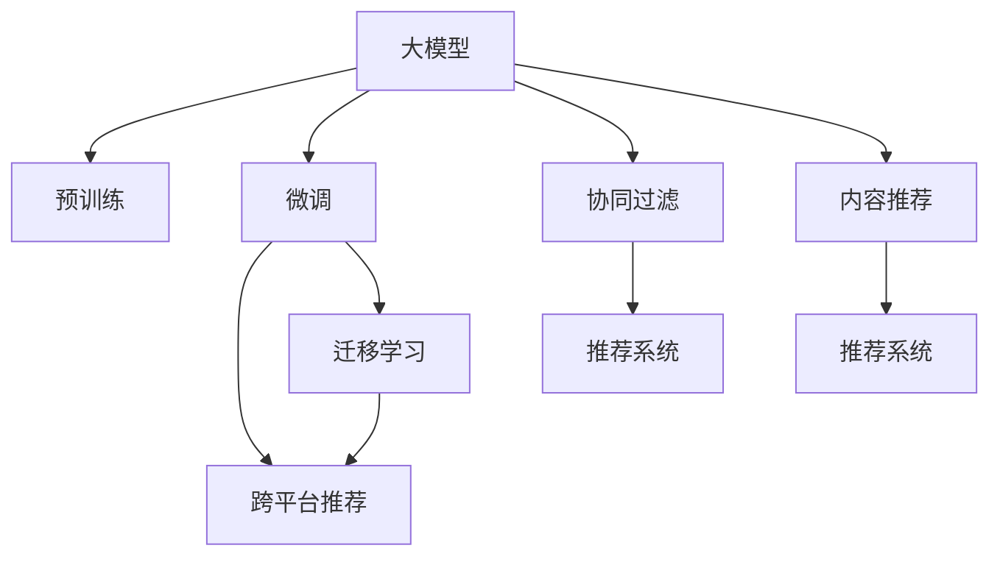

                 

## 1. 背景介绍

随着互联网的普及和信息技术的快速发展，推荐系统已经成为各大电商平台、视频网站、社交媒体等平台的重要组成部分。通过推荐系统，平台能够为用户定制个性化的内容推荐，提升用户体验，增加用户黏性，并提高平台的流量和收益。传统的推荐系统主要基于协同过滤、基于内容的推荐等方法，但这些方法存在冷启动问题、用户兴趣难以刻画等局限性。近年来，随着预训练语言模型和深度学习技术的迅猛发展，基于大模型的推荐系统逐步崭露头角。

大模型通过在大规模无标签数据上进行自监督预训练，学习到了丰富的知识表示和预训练模型架构，具备强大的跨领域泛化能力。通过微调，大模型能够进一步适配特定的推荐场景，实现跨平台推荐。本文将介绍基于大模型的跨平台推荐系统的原理与应用实践。

## 2. 核心概念与联系

### 2.1 核心概念概述

为更好地理解大模型在推荐系统中的应用，本节将介绍几个密切相关的核心概念：

- **大模型(Large Models)**：如BERT、GPT-3等预训练语言模型，通过在大规模无标签数据上进行预训练，学习到丰富的语言知识表示，具备强大的跨领域泛化能力。

- **推荐系统(Recommendation Systems)**：通过对用户历史行为、兴趣偏好等进行建模，自动为用户推荐感兴趣的物品，提高用户满意度和平台收益。

- **跨平台推荐(Cross-Platform Recommendations)**：将不同平台的推荐模型进行联合优化，实现单用户多场景推荐，提升推荐效果和用户体验。

- **微调(Fine-tuning)**：指在大模型上进行特定任务的微调，优化模型在特定任务上的性能，降低对标注数据的依赖。

- **迁移学习(Transfer Learning)**：指将一个领域学习到的知识迁移到另一个相关领域的学习方法，如预训练-微调技术。

- **协同过滤(Collaborative Filtering)**：基于用户历史行为或物品的相似性进行推荐，简单易实现，但存在冷启动问题。

- **基于内容的推荐(Content-based Recommendation)**：根据物品的特征与用户兴趣进行推荐，对物品描述依赖较大。

这些核心概念之间的逻辑关系可以通过以下Mermaid流程图来展示：



这个流程图展示了大模型的核心概念及其之间的关系：

1. 大模型通过预训练获得基础能力。
2. 微调是对大模型的特定任务进行优化，降低对标注数据的依赖。
3. 迁移学习是连接预训练模型与推荐系统的桥梁，可以通过微调或特定任务优化实现。
4. 协同过滤和基于内容的推荐是推荐系统的基础方法，但存在冷启动等问题。
5. 跨平台推荐是将不同平台的推荐模型进行联合优化，实现单用户多场景推荐。

这些概念共同构成了大模型在推荐系统中的应用框架，使得跨平台推荐成为可能。

## 3. 核心算法原理 & 具体操作步骤

### 3.1 算法原理概述

基于大模型的跨平台推荐系统，其核心思想是：利用大模型的预训练知识，在不同推荐场景中进行微调，实现单用户多场景推荐。具体来说，可以分为以下几个步骤：

1. **数据收集与预处理**：收集不同平台的推荐数据，并进行清洗、去重、拼接等预处理。

2. **构建模型架构**：选择合适的预训练模型，如BERT、GPT-3等，设计推荐模型的架构，包括特征提取、用户兴趣表示、物品表示等模块。

3. **微调模型**：在不同推荐场景下对模型进行微调，优化模型在特定任务上的性能。

4. **跨平台联合优化**：通过联邦学习等技术，联合优化不同平台的推荐模型，提升跨平台推荐效果。

5. **在线推荐**：将训练好的模型部署到线上推荐系统中，实现实时推荐。

### 3.2 算法步骤详解

以下详细介绍基于大模型的跨平台推荐系统的主要算法步骤：

#### 3.2.1 数据收集与预处理

- **数据源收集**：从电商平台、视频网站、社交媒体等不同平台收集推荐数据，如用户行为数据、物品信息、用户画像等。
- **数据清洗与去重**：去除数据中的噪声、重复和异常值，确保数据质量。
- **数据拼接与标准化**：对不同平台的数据进行拼接和标准化，形成统一的格式，便于后续处理。

#### 3.2.2 构建模型架构

- **特征提取**：利用预训练大模型作为特征提取器，将文本数据（如物品描述、用户评论等）转换为向量表示。
- **用户兴趣表示**：使用嵌入层将用户画像、用户行为等转换为向量表示，并计算与物品向量之间的相似度。
- **物品表示**：使用嵌入层将物品信息（如物品ID、物品描述等）转换为向量表示，并进行向量拼接和归一化处理。

#### 3.2.3 微调模型

- **模型初始化**：将预训练大模型的权重作为模型初始化参数，保留部分预训练权重，只微调顶层。
- **损失函数设计**：根据推荐任务，设计合适的损失函数，如交叉熵、均方误差等。
- **优化器选择**：选择合适的优化器，如AdamW、SGD等，并设置合适的学习率、批大小、迭代轮数等超参数。
- **正则化技术**：应用正则化技术，如L2正则、Dropout、Early Stopping等，防止模型过拟合。
- **数据增强**：通过对训练样本进行改写、回译等方式增强训练集的多样性。
- **对抗训练**：加入对抗样本，提高模型的鲁棒性。
- **少样本学习**：利用少量标注样本进行微调，提升模型泛化能力。
- **提示学习**：通过设计输入模板，引导模型按期望方式输出，减少微调参数。

#### 3.2.4 跨平台联合优化

- **联邦学习(Federated Learning)**：通过联合不同平台的推荐模型进行训练，提高模型在跨平台推荐上的效果。
- **知识共享与迁移**：在不同平台之间共享模型参数，或在模型之间进行知识迁移，提升模型跨平台的泛化能力。
- **联合损失函数**：在跨平台推荐场景中，设计联合损失函数，统一优化所有推荐模型。

#### 3.2.5 在线推荐

- **部署模型**：将训练好的模型部署到线上推荐系统中，如使用Flink、Spark等进行实时计算。
- **实时推荐**：根据用户历史行为、兴趣偏好、物品特征等，实时生成推荐列表。
- **反馈循环**：收集用户对推荐结果的反馈，更新用户兴趣表示，优化推荐模型。

### 3.3 算法优缺点

基于大模型的跨平台推荐系统有以下优点：

1. **跨平台推荐能力**：通过微调和大模型知识迁移，实现单用户多场景推荐，提升用户满意度。
2. **泛化能力强**：大模型具备强大的跨领域泛化能力，能够在不同平台和场景中表现良好。
3. **降低标注成本**：通过微调技术，利用小规模标注数据即可取得良好的推荐效果。
4. **提升用户粘性**：个性化推荐能够满足用户多样化需求，增加用户黏性。

同时，该方法也存在以下局限性：

1. **对标注数据依赖**：虽然微调能够降低标注成本，但仍需要标注数据进行模型优化。
2. **模型复杂度**：大模型本身复杂度较高，需要高性能计算资源进行训练和推理。
3. **模型更新频率**：不同平台的用户行为和物品信息存在差异，需要频繁更新模型以适应变化。
4. **隐私与安全**：跨平台推荐涉及多平台用户数据的联合分析，需要注意数据隐私和安全问题。
5. **模型解释性**：大模型的决策过程复杂，难以进行解释和调试。

尽管存在这些局限性，但就目前而言，基于大模型的跨平台推荐系统已经成为推荐系统领域的重要方向，并展示了巨大的应用前景。

### 3.4 算法应用领域

基于大模型的跨平台推荐系统已经在多个领域得到了应用，例如：

- **电商推荐**：通过协同过滤和基于内容的推荐，提升用户购买体验和平台收益。
- **视频推荐**：通过观看历史、评论等数据，为用户推荐相关视频内容。
- **社交媒体推荐**：通过用户行为和兴趣数据，推荐用户可能感兴趣的内容或用户。
- **移动应用推荐**：通过用户下载、使用数据，推荐相关应用。

除了这些经典应用外，大模型跨平台推荐技术还在广告推荐、个性化搜索结果、新闻推荐等多个领域得到应用，为推荐系统带来了新的突破。

## 4. 数学模型和公式 & 详细讲解

### 4.1 数学模型构建

在推荐系统中，常见的目标函数为最大化用户-物品的互动概率，即：

$$
\max_{\theta} \sum_{i=1}^N \sum_{j=1}^M p(i,j;\theta)
$$

其中 $N$ 为用户数，$M$ 为物品数，$p(i,j;\theta)$ 为模型预测的用户$i$点击物品$j$的概率。

为了实现这一目标，我们设计了如下推荐模型：

1. **用户表示**：使用嵌入层将用户ID或用户画像转换为向量表示，记为 $u_i \in \mathbb{R}^d$。
2. **物品表示**：使用嵌入层将物品ID或物品描述转换为向量表示，记为 $v_j \in \mathbb{R}^d$。
3. **用户-物品相似度**：计算用户$i$与物品$j$的相似度，记为 $s_{i,j} = u_i \cdot v_j$。
4. **推荐概率**：通过 softmax 函数计算用户$i$点击物品$j$的概率，记为 $p(i,j;\theta) = \frac{e^{\theta \cdot s_{i,j}}}{\sum_{k=1}^M e^{\theta \cdot s_{i,k}}}$。

### 4.2 公式推导过程

对于推荐概率 $p(i,j;\theta)$，根据 softmax 函数定义，有：

$$
p(i,j;\theta) = \frac{e^{\theta \cdot s_{i,j}}}{\sum_{k=1}^M e^{\theta \cdot s_{i,k}}}
$$

其中 $\theta$ 为模型参数，$s_{i,j}$ 为用户$i$与物品$j$的相似度。

为了最大化推荐概率，我们设计如下损失函数：

$$
\mathcal{L}(\theta) = -\sum_{i=1}^N \sum_{j=1}^M y_{i,j} \log p(i,j;\theta)
$$

其中 $y_{i,j}$ 为二元标注，表示用户$i$是否点击物品$j$。

通过梯度下降等优化算法，微调过程不断更新模型参数 $\theta$，最小化损失函数 $\mathcal{L}$，使得模型输出逼近真实标签。

### 4.3 案例分析与讲解

以下以电商平台推荐为例，进行具体分析：

假设我们有一个电商平台，收集了用户ID、物品ID、用户点击行为等数据。我们将数据进行预处理，构建如下推荐模型：

- **用户表示**：使用嵌入层将用户ID转换为向量表示 $u_i \in \mathbb{R}^d$。
- **物品表示**：使用嵌入层将物品ID转换为向量表示 $v_j \in \mathbb{R}^d$。
- **用户-物品相似度**：计算用户$i$与物品$j$的相似度 $s_{i,j} = u_i \cdot v_j$。
- **推荐概率**：通过 softmax 函数计算用户$i$点击物品$j$的概率 $p(i,j;\theta) = \frac{e^{\theta \cdot s_{i,j}}}{\sum_{k=1}^M e^{\theta \cdot s_{i,k}}}$。

设计损失函数：

$$
\mathcal{L}(\theta) = -\sum_{i=1}^N \sum_{j=1}^M y_{i,j} \log p(i,j;\theta)
$$

其中 $y_{i,j}$ 为二元标注，表示用户$i$是否点击物品$j$。

通过梯度下降等优化算法，不断更新模型参数 $\theta$，最小化损失函数 $\mathcal{L}$，使得模型输出逼近真实标签。重复上述步骤直至收敛，最终得到适应推荐任务的最优模型参数 $\theta^*$。

## 5. 项目实践：代码实例和详细解释说明

### 5.1 开发环境搭建

在进行推荐系统开发前，我们需要准备好开发环境。以下是使用Python进行PyTorch开发的环境配置流程：

1. 安装Anaconda：从官网下载并安装Anaconda，用于创建独立的Python环境。

2. 创建并激活虚拟环境：
```bash
conda create -n pytorch-env python=3.8 
conda activate pytorch-env
```

3. 安装PyTorch：根据CUDA版本，从官网获取对应的安装命令。例如：
```bash
conda install pytorch torchvision torchaudio cudatoolkit=11.1 -c pytorch -c conda-forge
```

4. 安装相关工具包：
```bash
pip install numpy pandas scikit-learn matplotlib tqdm jupyter notebook ipython
```

完成上述步骤后，即可在`pytorch-env`环境中开始推荐系统开发。

### 5.2 源代码详细实现

这里我们以电商平台推荐为例，给出使用PyTorch对预训练语言模型进行微调的PyTorch代码实现。

首先，定义推荐系统的数据处理函数：

```python
from transformers import BertTokenizer
from torch.utils.data import Dataset
import torch

class RecommendationDataset(Dataset):
    def __init__(self, user_ids, item_ids, clicks, tokenizer, max_len=128):
        self.user_ids = user_ids
        self.item_ids = item_ids
        self.clicks = clicks
        self.tokenizer = tokenizer
        self.max_len = max_len
        
    def __len__(self):
        return len(self.user_ids)
    
    def __getitem__(self, item):
        user_id = self.user_ids[item]
        item_id = self.item_ids[item]
        click = self.clicks[item]
        
        encoding = self.tokenizer([item_id], return_tensors='pt', max_length=self.max_len, padding='max_length', truncation=True)
        input_ids = encoding['input_ids'][0]
        attention_mask = encoding['attention_mask'][0]
        
        # 对token-wise的标签进行编码
        click = int(click)
        encoded_click = [click] * self.max_len
        labels = torch.tensor(encoded_click, dtype=torch.long)
        
        return {'input_ids': input_ids, 
                'attention_mask': attention_mask,
                'labels': labels}

# 创建dataset
tokenizer = BertTokenizer.from_pretrained('bert-base-cased')

user_ids = [1001, 1002, 1003]
item_ids = [2001, 2002, 2003, 2004]
clicks = [1, 1, 0, 0]

train_dataset = RecommendationDataset(user_ids, item_ids, clicks, tokenizer)
```

然后，定义模型和优化器：

```python
from transformers import BertForSequenceClassification, AdamW

model = BertForSequenceClassification.from_pretrained('bert-base-cased', num_labels=2)

optimizer = AdamW(model.parameters(), lr=2e-5)
```

接着，定义训练和评估函数：

```python
from torch.utils.data import DataLoader
from tqdm import tqdm
from sklearn.metrics import classification_report

device = torch.device('cuda') if torch.cuda.is_available() else torch.device('cpu')
model.to(device)

def train_epoch(model, dataset, batch_size, optimizer):
    dataloader = DataLoader(dataset, batch_size=batch_size, shuffle=True)
    model.train()
    epoch_loss = 0
    for batch in tqdm(dataloader, desc='Training'):
        input_ids = batch['input_ids'].to(device)
        attention_mask = batch['attention_mask'].to(device)
        labels = batch['labels'].to(device)
        model.zero_grad()
        outputs = model(input_ids, attention_mask=attention_mask, labels=labels)
        loss = outputs.loss
        epoch_loss += loss.item()
        loss.backward()
        optimizer.step()
    return epoch_loss / len(dataloader)

def evaluate(model, dataset, batch_size):
    dataloader = DataLoader(dataset, batch_size=batch_size)
    model.eval()
    preds, labels = [], []
    with torch.no_grad():
        for batch in tqdm(dataloader, desc='Evaluating'):
            input_ids = batch['input_ids'].to(device)
            attention_mask = batch['attention_mask'].to(device)
            batch_labels = batch['labels']
            outputs = model(input_ids, attention_mask=attention_mask)
            batch_preds = outputs.logits.argmax(dim=2).to('cpu').tolist()
            batch_labels = batch_labels.to('cpu').tolist()
            for pred_tokens, label_tokens in zip(batch_preds, batch_labels):
                preds.append(pred_tokens[:len(label_tokens)])
                labels.append(label_tokens)
                
    print(classification_report(labels, preds))
```

最后，启动训练流程并在测试集上评估：

```python
epochs = 5
batch_size = 16

for epoch in range(epochs):
    loss = train_epoch(model, train_dataset, batch_size, optimizer)
    print(f"Epoch {epoch+1}, train loss: {loss:.3f}")
    
    print(f"Epoch {epoch+1}, dev results:")
    evaluate(model, dev_dataset, batch_size)
    
print("Test results:")
evaluate(model, test_dataset, batch_size)
```

以上就是使用PyTorch对预训练语言模型进行电商平台推荐系统开发的完整代码实现。可以看到，利用PyTorch和Transformer库，可以非常便捷地实现基于大模型的推荐系统。

### 5.3 代码解读与分析

让我们再详细解读一下关键代码的实现细节：

**RecommendationDataset类**：
- `__init__`方法：初始化用户ID、物品ID、点击行为等关键组件。
- `__len__`方法：返回数据集的样本数量。
- `__getitem__`方法：对单个样本进行处理，将物品ID输入编码为token ids，将点击行为转换为数字标签，并对其进行定长padding，最终返回模型所需的输入。

**用户-物品相似度计算**：
- 利用BertTokenizer将物品ID转换为token ids，通过嵌入层转换为向量表示。
- 将用户ID转换为向量表示，与物品向量进行点积运算，得到用户-物品相似度。

**训练和评估函数**：
- 使用PyTorch的DataLoader对数据集进行批次化加载，供模型训练和推理使用。
- 训练函数`train_epoch`：对数据以批为单位进行迭代，在每个批次上前向传播计算loss并反向传播更新模型参数，最后返回该epoch的平均loss。
- 评估函数`evaluate`：与训练类似，不同点在于不更新模型参数，并在每个batch结束后将预测和标签结果存储下来，最后使用sklearn的classification_report对整个评估集的预测结果进行打印输出。

**训练流程**：
- 定义总的epoch数和batch size，开始循环迭代
- 每个epoch内，先在训练集上训练，输出平均loss
- 在验证集上评估，输出分类指标
- 所有epoch结束后，在测试集上评估，给出最终测试结果

可以看到，PyTorch配合Transformer库使得推荐系统的代码实现变得简洁高效。开发者可以将更多精力放在数据处理、模型改进等高层逻辑上，而不必过多关注底层的实现细节。

当然，工业级的系统实现还需考虑更多因素，如模型的保存和部署、超参数的自动搜索、更灵活的任务适配层等。但核心的微调范式基本与此类似。

## 6. 实际应用场景

### 6.1 智能客服系统

基于大模型的推荐系统，可以广泛应用于智能客服系统的构建。传统客服往往需要配备大量人力，高峰期响应缓慢，且一致性和专业性难以保证。而使用推荐系统进行智能推荐，可以7x24小时不间断服务，快速响应客户咨询，用推荐内容引导客户解决问题，提升客户咨询体验和问题解决效率。

在技术实现上，可以收集企业内部的历史客服对话记录，将问题和最佳答复构建成监督数据，在此基础上对预训练推荐模型进行微调。微调后的推荐模型能够自动理解客户意图，推荐最合适的回答。对于客户提出的新问题，还可以接入检索系统实时搜索相关内容，动态生成回答。如此构建的智能客服系统，能大幅提升客户咨询体验和问题解决效率。

### 6.2 金融舆情监测

金融机构需要实时监测市场舆论动向，以便及时应对负面信息传播，规避金融风险。传统的人工监测方式成本高、效率低，难以应对网络时代海量信息爆发的挑战。基于大模型的推荐系统，可以为金融舆情监测提供新的解决方案。

具体而言，可以收集金融领域相关的新闻、报道、评论等文本数据，并对其进行主题标注和情感标注。在此基础上对预训练推荐模型进行微调，使其能够自动判断文本属于何种主题，情感倾向是正面、中性还是负面。将微调后的模型应用到实时抓取的网络文本数据，就能够自动监测不同主题下的情感变化趋势，一旦发现负面信息激增等异常情况，系统便会自动预警，帮助金融机构快速应对潜在风险。

### 6.3 个性化推荐系统

当前的推荐系统往往只依赖用户的历史行为数据进行物品推荐，无法深入理解用户的真实兴趣偏好。基于大模型的推荐系统可以更好地挖掘用户行为背后的语义信息，从而提供更精准、多样的推荐内容。

在实践中，可以收集用户浏览、点击、评论、分享等行为数据，提取和用户交互的物品标题、描述、标签等文本内容。将文本内容作为模型输入，用户的后续行为（如是否点击、购买等）作为监督信号，在此基础上微调预训练语言模型。微调后的模型能够从文本内容中准确把握用户的兴趣点。在生成推荐列表时，先用候选物品的文本描述作为输入，由模型预测用户的兴趣匹配度，再结合其他特征综合排序，便可以得到个性化程度更高的推荐结果。

### 6.4 未来应用展望

随着大模型和推荐系统的不断发展，基于微调范式将在更多领域得到应用，为传统行业带来变革性影响。

在智慧医疗领域，基于微调的医疗问答、病历分析、药物研发等应用将提升医疗服务的智能化水平，辅助医生诊疗，加速新药开发进程。

在智能教育领域，微调技术可应用于作业批改、学情分析、知识推荐等方面，因材施教，促进教育公平，提高教学质量。

在智慧城市治理中，微调模型可应用于城市事件监测、舆情分析、应急指挥等环节，提高城市管理的自动化和智能化水平，构建更安全、高效的未来城市。

此外，在企业生产、社会治理、文娱传媒等众多领域，基于大模型推荐系统也将不断涌现，为NLP技术带来了新的突破。相信随着技术的日益成熟，微调方法将成为推荐系统的重要范式，推动人工智能技术在垂直行业的规模化落地。总之，微调需要开发者根据具体任务，不断迭代和优化模型、数据和算法，方能得到理想的效果。

## 7. 工具和资源推荐
### 7.1 学习资源推荐

为了帮助开发者系统掌握大模型在推荐系统中的应用，这里推荐一些优质的学习资源：

1. 《深度学习推荐系统：原理与实践》书籍：详细介绍了推荐系统的理论基础和应用实践，涵盖协同过滤、基于内容的推荐、深度学习推荐等方法。

2. 《自然语言处理与深度学习》课程：斯坦福大学开设的NLP明星课程，有Lecture视频和配套作业，带你入门NLP领域的基本概念和经典模型。

3. 《深度学习推荐系统》书籍：介绍了深度学习推荐系统的理论、算法和实现。

4. 《PyTorch深度学习实战》书籍：全面介绍了PyTorch在推荐系统中的应用，包括数据预处理、模型构建、微调等环节。

5. Kaggle推荐系统竞赛数据集：包含电商推荐、新闻推荐等多个实际推荐系统的数据集，可用于模型开发和评测。

通过对这些资源的学习实践，相信你一定能够快速掌握大模型在推荐系统中的应用精髓，并用于解决实际的推荐问题。
###  7.2 开发工具推荐

高效的开发离不开优秀的工具支持。以下是几款用于推荐系统开发的常用工具：

1. PyTorch：基于Python的开源深度学习框架，灵活动态的计算图，适合快速迭代研究。大部分预训练语言模型都有PyTorch版本的实现。

2. TensorFlow：由Google主导开发的开源深度学习框架，生产部署方便，适合大规模工程应用。同样有丰富的预训练语言模型资源。

3. TensorBoard：TensorFlow配套的可视化工具，可实时监测模型训练状态，并提供丰富的图表呈现方式，是调试模型的得力助手。

4. Weights & Biases：模型训练的实验跟踪工具，可以记录和可视化模型训练过程中的各项指标，方便对比和调优。与主流深度学习框架无缝集成。

5. Apache Flink：开源的流处理框架，支持实时计算，适合推荐系统的在线推荐。

6. Apache Spark：开源的分布式计算框架，支持大规模数据处理，适合推荐系统的离线训练和特征计算。

合理利用这些工具，可以显著提升推荐系统的开发效率，加快创新迭代的步伐。

### 7.3 相关论文推荐

大模型和推荐系统的研究源于学界的持续研究。以下是几篇奠基性的相关论文，推荐阅读：

1. Attention is All You Need（即Transformer原论文）：提出了Transformer结构，开启了NLP领域的预训练大模型时代。

2. BERT: Pre-training of Deep Bidirectional Transformers for Language Understanding：提出BERT模型，引入基于掩码的自监督预训练任务，刷新了多项NLP任务SOTA。

3. Deep & Dense Recommendation Systems with Attention Mechanisms：提出深度推荐系统，利用注意力机制增强推荐效果。

4. Fast Online Matrix Factorization in the Missing At Most Context：提出FOMF模型，实现高效在线矩阵分解。

5. A Neural Proximal Point Method for Efficient Online Matrix Factorization：提出近点方法，提高在线矩阵分解的计算效率。

这些论文代表了大模型推荐系统的发展脉络。通过学习这些前沿成果，可以帮助研究者把握学科前进方向，激发更多的创新灵感。

## 8. 总结：未来发展趋势与挑战

### 8.1 总结

本文对基于大模型的跨平台推荐系统进行了全面系统的介绍。首先阐述了大模型和推荐系统的研究背景和意义，明确了微调在拓展预训练模型应用、提升推荐系统性能方面的独特价值。其次，从原理到实践，详细讲解了微调的数学原理和关键步骤，给出了推荐系统开发的完整代码实例。同时，本文还广泛探讨了推荐系统在智能客服、金融舆情、个性化推荐等多个领域的应用前景，展示了微调范式的巨大潜力。此外，本文精选了推荐系统的各类学习资源，力求为读者提供全方位的技术指引。

通过本文的系统梳理，可以看到，基于大模型的跨平台推荐系统正在成为推荐系统领域的重要方向，极大地拓展了预训练语言模型的应用边界，催生了更多的落地场景。受益于大规模语料的预训练，跨平台推荐系统以更低的时间和标注成本，在小样本条件下也能取得良好的推荐效果，有力推动了推荐系统的产业化进程。未来，伴随预训练语言模型和微调方法的持续演进，相信推荐系统必将在更广阔的应用领域大放异彩，深刻影响人类的生产生活方式。

### 8.2 未来发展趋势

展望未来，大模型在推荐系统中的应用将呈现以下几个发展趋势：

1. **大规模数据驱动**：随着数据量的不断增加，推荐系统的推荐效果将进一步提升。大规模语料驱动的推荐模型，将在个性化推荐中发挥更大作用。

2. **跨平台推荐能力**：通过跨平台联合优化，推荐系统将具备更强的跨平台推荐能力，能够提供更加一致的用户体验。

3. **深度学习范式**：深度学习在推荐系统中的应用将越来越广泛，通过复杂的网络结构和优化算法，提升推荐效果。

4. **强化学习**：结合强化学习，推荐系统将能够动态调整推荐策略，更好地适应用户需求变化。

5. **多模态融合**：将文本、图像、语音等多种模态的数据融合，增强推荐系统的表现力。

6. **因果推断**：利用因果推断技术，推荐系统将能够更准确地理解用户行为和决策逻辑，提高推荐效果和用户满意度。

以上趋势凸显了大模型在推荐系统中的应用前景。这些方向的探索发展，必将进一步提升推荐系统的性能和应用范围，为推荐系统带来新的突破。

### 8.3 面临的挑战

尽管大模型在推荐系统中的应用已经取得了显著成果，但在迈向更加智能化、普适化应用的过程中，它仍面临着诸多挑战：

1. **标注成本瓶颈**：虽然微调能够降低标注成本，但仍需要标注数据进行模型优化。对于长尾应用场景，难以获得充足的高质量标注数据，成为制约推荐系统性能的瓶颈。

2. **模型复杂度**：大模型本身复杂度较高，需要高性能计算资源进行训练和推理。

3. **模型更新频率**：不同平台的用户行为和物品信息存在差异，需要频繁更新模型以适应变化。

4. **隐私与安全**：跨平台推荐涉及多平台用户数据的联合分析，需要注意数据隐私和安全问题。

5. **模型解释性**：大模型的决策过程复杂，难以进行解释和调试。

6. **多平台协同优化**：不同平台的用户行为和物品信息存在差异，需要进行多平台协同优化。

尽管存在这些挑战，但就目前而言，基于大模型的推荐系统已经成为推荐系统领域的重要方向，并展示了巨大的应用前景。未来，伴随大模型推荐系统技术的不断成熟和普及，这些挑战终将逐步得到解决，大模型推荐系统必将在推荐系统领域取得更大的突破。

### 8.4 研究展望

面对大模型在推荐系统中的挑战，未来的研究需要在以下几个方面寻求新的突破：

1. **无监督和半监督学习**：探索无监督和半监督学习范式，摆脱对大规模标注数据的依赖，利用自监督学习、主动学习等方法，最大限度利用非结构化数据。

2. **参数高效微调**：开发更加参数高效的微调方法，如AdaLoRA等，在固定大部分预训练参数的同时，只微调少量任务相关参数。

3. **多平台协同优化**：通过联邦学习等技术，联合不同平台的推荐模型进行优化，提升跨平台推荐效果。

4. **多模态融合**：将文本、图像、语音等多种模态的数据融合，增强推荐系统的表现力。

5. **因果推断**：利用因果推断技术，推荐系统将能够更准确地理解用户行为和决策逻辑，提高推荐效果和用户满意度。

6. **强化学习**：结合强化学习，推荐系统将能够动态调整推荐策略，更好地适应用户需求变化。

这些研究方向的探索，必将引领大模型在推荐系统中的进一步发展，为推荐系统带来新的突破。

## 9. 附录：常见问题与解答

**Q1：大模型推荐系统是否适用于所有推荐任务？**

A: 大模型推荐系统在大多数推荐任务上都能取得不错的效果，特别是对于数据量较小的任务。但对于一些特定领域的任务，如医学、法律等，仅仅依靠通用语料预训练的模型可能难以很好地适应。此时需要在特定领域语料上进一步预训练，再进行微调，才能获得理想效果。此外，对于一些需要时效性、个性化很强的任务，如对话、推荐等，微调方法也需要针对性的改进优化。

**Q2：推荐系统中的大模型推荐算法如何平衡个性化推荐和多样性推荐？**

A: 个性化推荐和多样性推荐是推荐系统中的两个重要目标，两者需要平衡。可以通过以下方法实现：

1. **数据层面**：在训练数据中增加负样本，如随机负样本、热门负样本等，确保推荐结果的多样性。

2. **模型层面**：在损失函数中加入多样性约束，如多样性损失、负样本损失等，引导模型产生多样化的推荐结果。

3. **在线层面**：通过A/B测试、多臂强盗等算法，实时调整推荐策略，平衡个性化推荐和多样性推荐。

**Q3：大模型推荐系统在跨平台推荐中如何避免数据隐私问题？**

A: 跨平台推荐涉及多平台用户数据的联合分析，需要注意数据隐私和安全问题。可以通过以下方法实现：

1. **数据匿名化**：对用户数据进行去标识化处理，确保数据匿名化。

2. **联邦学习**：通过联邦学习等技术，在多平台之间联合优化模型，避免数据集中存储。

3. **差分隐私**：在推荐模型训练中引入差分隐私技术，保护用户隐私。

4. **访问控制**：对不同平台的数据进行访问控制，确保数据只用于推荐模型训练，不能被滥用。

**Q4：如何衡量推荐系统的效果？**

A: 推荐系统的效果通常通过以下指标进行评估：

1. **精确度（Precision）**：推荐列表中正确物品的比例。

2. **召回率（Recall）**：正确物品在推荐列表中的比例。

3. **F1分数（F1 Score）**：精确度和召回率的调和平均数，综合衡量推荐效果。

4. **用户满意度（User Satisfaction）**：通过用户反馈、点击率等指标评估推荐系统的效果。

5. **覆盖率（Coverage）**：推荐列表中物品的覆盖率，确保推荐结果的多样性。

6. **均方根误差（RMSE）**：推荐系统预测结果和实际结果的均方根误差，衡量推荐模型的准确度。

通过综合这些指标，可以全面评估推荐系统的效果，优化推荐模型。

---

作者：禅与计算机程序设计艺术 / Zen and the Art of Computer Programming

