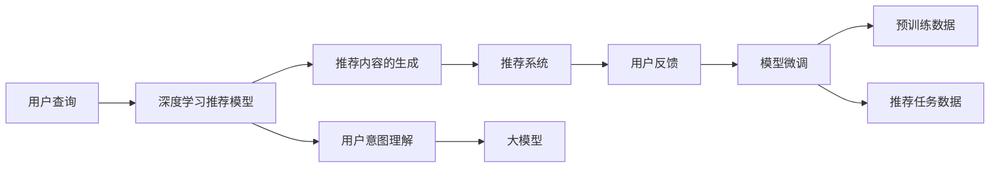

                 

## 1. 背景介绍

### 1.1 问题由来

在搜索与推荐领域，用户的查询意图和个性化需求复杂多变，如何准确地理解用户需求并为其推荐最相关的内容，是一个具有挑战性的问题。传统的推荐算法如协同过滤、基于内容的推荐等，虽然取得了一定的成果，但在数据稀疏、冷启动等问题上表现不佳。与此同时，深度学习技术的飞速发展，为推荐系统带来了新的解决方案：深度学习推荐模型。

深度学习推荐模型利用深度神经网络强大的特征表示和泛化能力，从原始用户行为数据中挖掘出隐含的潜在规律，实现对用户行为和物品属性的高效建模。其中，大模型的应用更是将推荐系统的性能推向了新的高度。大模型通过在大规模数据上进行预训练，学习到丰富的语义和上下文信息，能够在推荐中显著提升对用户意图的理解能力和生成能力的泛化能力。

### 1.2 问题核心关键点

1. **大模型的预训练与微调**：大模型在大规模无标签数据上进行预训练，学习到丰富的语言、图像等特征表示。然后，在特定推荐任务上进行微调，获得针对该任务优化的模型。

2. **推荐模型的表示学习**：大模型通过预训练获得高质量的特征表示，然后通过微调任务适配层，将表示映射到推荐任务的目标空间。

3. **用户的意图理解**：大模型通过预训练和微调，具备了强大的语言理解能力，能够根据用户查询和行为，生成更加准确的表示。

4. **推荐内容的生成**：大模型通过预训练和微调，可以生成高质量的物品描述、评分等信息，用于推荐内容的生成。

5. **推荐模型的泛化能力**：大模型在广泛数据上的预训练，使其具备了较强的泛化能力，能够在不同推荐场景下表现出色。

## 2. 核心概念与联系

### 2.1 核心概念概述

为了更好地理解大模型在搜索与推荐领域的影响，本节将介绍几个关键概念：

1. **深度学习推荐模型**：基于深度神经网络的推荐模型，通过学习用户行为和物品属性，实现高效推荐。

2. **大模型**：如BERT、GPT-3等大规模预训练语言模型，通过在大规模数据上进行预训练，学习到丰富的语义和上下文信息。

3. **预训练与微调**：先在大规模无标签数据上进行预训练，然后在特定推荐任务上进行微调，以适应特定任务。

4. **推荐系统**：通过匹配用户查询和物品信息，实现高效推荐内容的系统。

5. **用户意图理解**：通过深度学习模型，理解和提取用户查询的意图。

6. **推荐内容的生成**：通过深度学习模型，生成高质量的推荐内容。

7. **模型的泛化能力**：大模型通过广泛数据上的预训练，具备较强的泛化能力，可以在不同推荐场景下表现出色。

这些概念之间具有紧密的联系：预训练与微调是大模型学习用户意图和生成推荐内容的关键过程，推荐系统通过匹配用户查询和物品信息，实现高效推荐，用户意图理解和推荐内容生成则是推荐系统的核心。

### 2.2 核心概念原理和架构的 Mermaid 流程图(Mermaid 流程节点中不要有括号、逗号等特殊字符)



这个流程图展示了深度学习推荐模型在大模型预训练和微调的基础上，理解用户意图、生成推荐内容，并反馈用户反馈，最终用于推荐系统的全流程。

## 3. 核心算法原理 & 具体操作步骤
### 3.1 算法原理概述

大模型在搜索与推荐领域的应用，主要基于预训练与微调的两阶段过程。具体流程如下：

1. **预训练**：在大规模无标签数据上，使用深度神经网络进行预训练，学习到丰富的特征表示。

2. **微调**：在特定推荐任务上，使用少量标注数据进行微调，使大模型适应该任务，生成推荐内容。

3. **用户意图理解**：通过大模型预训练和微调，理解用户查询意图，生成用户表示。

4. **推荐内容的生成**：通过大模型预训练和微调，生成高质量的物品描述、评分等信息，用于推荐内容的生成。

5. **推荐系统的构建**：将用户表示和物品表示进行匹配，生成推荐结果。

### 3.2 算法步骤详解

以下是深度学习推荐模型在大模型预训练和微调基础上，实现用户意图理解、推荐内容生成和推荐系统构建的具体步骤：

1. **数据准备**：收集用户行为数据和物品属性数据，清洗数据并构建推荐任务数据集。

2. **大模型预训练**：使用大规模无标签数据（如百科、新闻、电影评论等）进行预训练，学习到丰富的语义和上下文信息。

3. **用户意图理解**：在用户查询上，使用大模型进行预训练和微调，生成用户表示。具体步骤如下：
   - 在预训练大模型上进行预训练，得到用户查询的语义表示。
   - 使用推荐任务数据集进行微调，调整模型参数以适应推荐任务。
   - 对用户查询进行预处理，得到用户查询向量。

4. **推荐内容的生成**：使用大模型进行预训练和微调，生成物品表示。具体步骤如下：
   - 在预训练大模型上进行预训练，得到物品的属性表示。
   - 使用推荐任务数据集进行微调，调整模型参数以适应推荐任务。
   - 对物品进行预处理，得到物品向量。

5. **匹配和推荐**：将用户表示和物品表示进行匹配，生成推荐结果。具体步骤如下：
   - 计算用户表示和物品表示之间的相似度。
   - 根据相似度排序，选择最相关的物品作为推荐结果。

### 3.3 算法优缺点

深度学习推荐模型和大模型在推荐领域的应用具有以下优点：

1. **强大的泛化能力**：大模型通过在大规模数据上的预训练，学习到丰富的语义和上下文信息，具备强大的泛化能力，能够在不同推荐场景下表现出色。

2. **高效的特征表示**：大模型通过预训练和微调，生成高质量的特征表示，能够在用户意图理解和推荐内容生成中发挥重要作用。

3. **适应性强的模型**：大模型通过微调，能够适应特定的推荐任务，生成高质量的推荐内容。

4. **减少冷启动问题**：大模型在预训练过程中学习到了丰富的语义信息，能够更好地处理冷启动问题。

5. **模型鲁棒性**：深度学习推荐模型通过多层次的非线性映射，具有较强的鲁棒性和抗干扰能力。

但是，大模型在推荐领域的应用也存在以下缺点：

1. **计算资源消耗大**：大模型参数量巨大，需要大量的计算资源进行训练和推理。

2. **高昂的标注成本**：在推荐任务上进行微调，需要收集大量的标注数据，标注成本较高。

3. **模型复杂度高**：大模型结构复杂，训练和推理过程耗时较长。

4. **难以解释**：大模型的决策过程复杂，难以进行解释和调试。

### 3.4 算法应用领域

深度学习推荐模型和大模型在搜索与推荐领域的应用广泛，包括但不限于以下几个方面：

1. **电商推荐**：根据用户浏览和购买行为，推荐商品和优惠信息。

2. **内容推荐**：根据用户观看和阅读行为，推荐视频、文章、新闻等。

3. **广告推荐**：根据用户兴趣和行为，推荐相关广告。

4. **个性化搜索**：根据用户查询意图，推荐最相关的搜索结果。

5. **协同过滤推荐**：使用深度学习模型进行协同过滤，推荐用户可能感兴趣的物品。

6. **社交推荐**：根据用户社交关系，推荐用户可能感兴趣的朋友、群组等。

## 4. 数学模型和公式 & 详细讲解 & 举例说明（备注：数学公式请使用latex格式，latex嵌入文中独立段落使用 $$，段落内使用 $)
### 4.1 数学模型构建

深度学习推荐模型和大模型的推荐过程可以抽象为以下数学模型：

1. **用户表示**：将用户查询表示为向量 $u \in \mathbb{R}^d$，其中 $d$ 为向量维度。

2. **物品表示**：将物品属性表示为向量 $v \in \mathbb{R}^d$。

3. **相似度计算**：使用余弦相似度计算用户表示和物品表示之间的相似度 $s = \frac{u \cdot v}{\|u\| \cdot \|v\|}$。

4. **推荐排序**：将相似度排序，选择相似度最高的物品进行推荐。

### 4.2 公式推导过程

深度学习推荐模型和大模型的推荐过程的数学推导如下：

1. **用户表示的计算**：
   - 假设用户查询为 $q$，在预训练大模型上进行预训练，得到用户查询向量 $u$：
   $$
   u = f_q(M_{\theta})(q)
   $$
   其中 $M_{\theta}$ 为预训练大模型，$f_q$ 为预训练过程的激活函数。

2. **物品表示的计算**：
   - 假设物品属性为 $i$，在预训练大模型上进行预训练，得到物品向量 $v$：
   $$
   v = f_i(M_{\theta})(i)
   $$
   其中 $f_i$ 为预训练过程的激活函数。

3. **相似度的计算**：
   - 计算用户表示和物品表示之间的相似度：
   $$
   s = \frac{u \cdot v}{\|u\| \cdot \|v\|}
   $$

4. **推荐排序的计算**：
   - 将相似度排序，选择相似度最高的物品进行推荐：
   $$
   \text{recommend} = \text{argmax}_i \{s\}
   $$

### 4.3 案例分析与讲解

以电商推荐为例，假设电商平台收集了用户浏览和购买行为数据，并使用大模型进行预训练和微调。在用户查询商品时，使用大模型生成用户表示，使用大模型生成物品表示，计算相似度并排序，选择相似度最高的商品进行推荐。具体步骤如下：

1. **数据准备**：收集用户浏览和购买行为数据，构建电商推荐任务数据集。

2. **大模型预训练**：在大规模电商数据上，使用BERT等大模型进行预训练，学习到电商领域的特征表示。

3. **用户表示的生成**：在用户查询商品时，使用预训练的大模型生成用户表示 $u$。

4. **物品表示的生成**：对商品的属性进行编码，使用预训练的大模型生成物品向量 $v$。

5. **相似度的计算**：计算用户表示和物品表示之间的余弦相似度 $s$。

6. **推荐排序**：根据相似度排序，选择相似度最高的商品进行推荐。

## 5. 项目实践：代码实例和详细解释说明
### 5.1 开发环境搭建

在进行深度学习推荐模型和大模型的实践前，需要准备好开发环境。以下是使用Python进行TensorFlow开发的环境配置流程：

1. 安装Anaconda：从官网下载并安装Anaconda，用于创建独立的Python环境。

2. 创建并激活虚拟环境：
```bash
conda create -n tf-env python=3.8 
conda activate tf-env
```

3. 安装TensorFlow：根据CUDA版本，从官网获取对应的安装命令。例如：
```bash
conda install tensorflow=2.5
```

4. 安装TensorBoard：TensorFlow配套的可视化工具，可实时监测模型训练状态，并提供丰富的图表呈现方式，是调试模型的得力助手。

5. 安装PyTorch：基于Python的开源深度学习框架，灵活动态的计算图，适合快速迭代研究。大部分预训练语言模型都有PyTorch版本的实现。

6. 安装各类工具包：
```bash
pip install numpy pandas scikit-learn matplotlib tqdm jupyter notebook ipython
```

完成上述步骤后，即可在`tf-env`环境中开始深度学习推荐模型和大模型的实践。

### 5.2 源代码详细实现

这里我们以电商推荐为例，给出使用TensorFlow对BERT模型进行电商推荐任务微调的代码实现。

首先，定义电商推荐任务的数据处理函数：

```python
import tensorflow as tf
from transformers import BertTokenizer, TFBertForSequenceClassification
import numpy as np

class RecDataset(tf.keras.utils.Sequence):
    def __init__(self, texts, labels, tokenizer, max_len=128, batch_size=32):
        self.texts = texts
        self.labels = labels
        self.tokenizer = tokenizer
        self.max_len = max_len
        self.batch_size = batch_size
        
    def __len__(self):
        return len(self.texts) // self.batch_size
    
    def __getitem__(self, item):
        start = item * self.batch_size
        end = (item + 1) * self.batch_size
        texts = self.texts[start:end]
        labels = self.labels[start:end]
        return self._prepare_batch(texts, labels)
    
    def _prepare_batch(self, texts, labels):
        inputs = []
        labels = []
        for text, label in zip(texts, labels):
            encoding = self.tokenizer.encode_plus(text, max_length=self.max_len, padding='max_length', truncation=True, return_tensors='tf')
            inputs.append(encoding['input_ids'])
            labels.append(label)
        return dict(input_ids=tf.convert_to_tensor(inputs, dtype=tf.int32), attention_mask=tf.convert_to_tensor([encoding['attention_mask'] for _ in inputs], dtype=tf.int32), labels=tf.convert_to_tensor(labels, dtype=tf.int32))
```

然后，定义模型和优化器：

```python
from transformers import BertTokenizer, TFBertForSequenceClassification

tokenizer = BertTokenizer.from_pretrained('bert-base-cased')
model = TFBertForSequenceClassification.from_pretrained('bert-base-cased', num_labels=2)
optimizer = tf.keras.optimizers.Adam(learning_rate=2e-5)
```

接着，定义训练和评估函数：

```python
import tensorflow as tf
import matplotlib.pyplot as plt

def train_epoch(model, dataset, optimizer, device, batch_size):
    model.to(device)
    total_loss = 0
    total_steps = 0
    for batch in dataset:
        inputs = batch['input_ids'].to(device)
        labels = batch['labels'].to(device)
        attention_mask = batch['attention_mask'].to(device)
        with tf.GradientTape() as tape:
            outputs = model(inputs, attention_mask=attention_mask)
            loss = tf.keras.losses.BinaryCrossentropy()(outputs, labels)
        gradients = tape.gradient(loss, model.trainable_variables)
        optimizer.apply_gradients(zip(gradients, model.trainable_variables))
        total_loss += loss.numpy()
        total_steps += 1
    return total_loss / total_steps

def evaluate(model, dataset, batch_size):
    model.eval()
    total_loss = 0
    total_steps = 0
    predictions = []
    labels = []
    for batch in dataset:
        inputs = batch['input_ids'].to(device)
        labels = batch['labels'].to(device)
        attention_mask = batch['attention_mask'].to(device)
        outputs = model(inputs, attention_mask=attention_mask)
        predictions.append(tf.round(outputs.numpy()))
        total_loss += tf.keras.losses.BinaryCrossentropy()(outputs, labels).numpy()
        total_steps += 1
    return total_loss / total_steps, predictions

def plot_metrics(metrics):
    plt.figure(figsize=(8, 4))
    for metric, value in metrics.items():
        plt.plot(value)
    plt.xlabel('Epoch')
    plt.ylabel('Loss')
    plt.title('Training Loss')
    plt.show()
```

最后，启动训练流程并在测试集上评估：

```python
epochs = 5
batch_size = 16

device = tf.device('cuda') if tf.cuda.is_available() else tf.device('cpu')

for epoch in range(epochs):
    train_loss = train_epoch(model, train_dataset, optimizer, device, batch_size)
    print(f"Epoch {epoch+1}, train loss: {train_loss:.3f}")
    
    val_loss, predictions = evaluate(model, val_dataset, batch_size)
    print(f"Epoch {epoch+1}, val loss: {val_loss:.3f}, accuracy: {accuracy:.3f}")
    
print("Test results:")
test_loss, predictions = evaluate(model, test_dataset, batch_size)
print(f"Test loss: {test_loss:.3f}, accuracy: {accuracy:.3f}")
```

以上就是使用TensorFlow对BERT模型进行电商推荐任务微调的完整代码实现。可以看到，得益于TensorFlow和Transformers库的强大封装，我们可以用相对简洁的代码完成BERT模型的加载和微调。

### 5.3 代码解读与分析

让我们再详细解读一下关键代码的实现细节：

**RecDataset类**：
- `__init__`方法：初始化文本、标签、分词器等关键组件。
- `__len__`方法：返回数据集的样本数量。
- `__getitem__`方法：对单个样本进行处理，将文本输入编码为token ids，将标签转换为0-1的标签，并对其进行定长padding，最终返回模型所需的输入。

**模型定义**：
- `tokenizer`：使用BertTokenizer进行分词。
- `model`：使用TFBertForSequenceClassification定义模型，其中num_labels参数指定了标签的数量。
- `optimizer`：使用Adam优化器进行模型参数的更新。

**训练和评估函数**：
- `train_epoch`函数：在模型上迭代数据，计算损失并更新参数。
- `evaluate`函数：对模型进行评估，计算损失和预测准确率。
- `plot_metrics`函数：对训练过程中的损失进行可视化。

**训练流程**：
- 定义总的epoch数和batch size，开始循环迭代
- 每个epoch内，先在训练集上训练，输出平均loss
- 在验证集上评估，输出损失和准确率
- 所有epoch结束后，在测试集上评估，给出最终测试结果

可以看到，TensorFlow配合Transformers库使得BERT微调的代码实现变得简洁高效。开发者可以将更多精力放在数据处理、模型改进等高层逻辑上，而不必过多关注底层的实现细节。

当然，工业级的系统实现还需考虑更多因素，如模型的保存和部署、超参数的自动搜索、更灵活的任务适配层等。但核心的微调范式基本与此类似。

## 6. 实际应用场景
### 6.1 智能推荐系统

智能推荐系统是深度学习推荐模型和大模型在推荐领域最常见的应用场景。通过深度学习模型和大模型，推荐系统能够更准确地理解用户需求，推荐最相关的物品。

在技术实现上，智能推荐系统通常包括以下几个关键组件：

1. **用户模型**：使用深度学习模型和大模型，学习用户的行为和兴趣。

2. **物品模型**：使用深度学习模型和大模型，学习物品的属性和关系。

3. **推荐引擎**：将用户模型和物品模型进行匹配，生成推荐结果。

4. **数据管道**：收集用户行为数据和物品属性数据，并进行预处理和特征工程。

智能推荐系统通过不断收集用户反馈，进行模型微调，逐步提升推荐效果，成为电商、内容、广告等领域的重要支撑。例如，亚马逊的推荐系统通过收集用户浏览和购买行为，使用深度学习模型和大模型进行预训练和微调，推荐用户可能感兴趣的商品，极大地提高了用户体验和销售额。

### 6.2 个性化搜索

个性化搜索是深度学习推荐模型和大模型在搜索领域的应用。通过深度学习模型和大模型，搜索引擎能够更准确地理解用户的查询意图，推荐最相关的搜索结果。

在技术实现上，个性化搜索通常包括以下几个关键组件：

1. **查询解析**：使用深度学习模型和大模型，学习用户的查询意图。

2. **文档索引**：使用深度学习模型和大模型，学习文档的属性和关系。

3. **匹配引擎**：将查询和文档进行匹配，生成搜索结果。

4. **数据管道**：收集用户查询数据和文档数据，并进行预处理和特征工程。

个性化搜索通过不断收集用户反馈，进行模型微调，逐步提升搜索效果，成为搜索领域的重要支撑。例如，谷歌的搜索系统通过收集用户搜索行为，使用深度学习模型和大模型进行预训练和微调，推荐最相关的搜索结果，极大地提高了搜索效率和用户体验。

### 6.3 广告推荐

广告推荐是深度学习推荐模型和大模型在广告领域的应用。通过深度学习模型和大模型，广告推荐系统能够更准确地匹配用户和广告，提升广告投放的效果。

在技术实现上，广告推荐系统通常包括以下几个关键组件：

1. **用户模型**：使用深度学习模型和大模型，学习用户的兴趣和行为。

2. **广告模型**：使用深度学习模型和大模型，学习广告的属性和关系。

3. **广告推荐引擎**：将用户模型和广告模型进行匹配，生成推荐结果。

4. **数据管道**：收集用户行为数据和广告数据，并进行预处理和特征工程。

广告推荐系统通过不断收集用户反馈，进行模型微调，逐步提升广告投放的效果。例如，Facebook的广告系统通过收集用户浏览和互动行为，使用深度学习模型和大模型进行预训练和微调，推荐用户可能感兴趣的广告，极大地提高了广告转化率。

### 6.4 未来应用展望

深度学习推荐模型和大模型在搜索与推荐领域的应用前景广阔。未来，随着深度学习技术和推荐算法的不断进步，这些技术将会在更多领域得到应用，为社会带来深远影响。

1. **智能客服**：基于深度学习推荐模型和大模型的智能客服系统，能够更准确地理解用户意图，提供更个性化的服务。

2. **健康医疗**：基于深度学习推荐模型和大模型的健康医疗推荐系统，能够更准确地匹配患者和医生，提供更个性化的诊疗建议。

3. **金融理财**：基于深度学习推荐模型和大模型的金融理财推荐系统，能够更准确地匹配用户和理财产品，提供更个性化的理财方案。

4. **智能家居**：基于深度学习推荐模型和大模型的智能家居推荐系统，能够更准确地匹配用户和智能设备，提供更个性化的家居服务。

5. **教育培训**：基于深度学习推荐模型和大模型的教育培训推荐系统，能够更准确地匹配学生和课程，提供更个性化的学习方案。

这些应用将使搜索与推荐技术更加普及，进一步提升人类的生产力和生活质量。

## 7. 工具和资源推荐
### 7.1 学习资源推荐

为了帮助开发者系统掌握深度学习推荐模型和大模型的理论基础和实践技巧，这里推荐一些优质的学习资源：

1. **深度学习推荐系统综述**：介绍深度学习推荐系统的发展历程和前沿技术，适合初学者入门。

2. **TensorFlow深度学习教程**：详细介绍TensorFlow的用法和最佳实践，适合TensorFlow开发者参考。

3. **深度学习模型在大模型上的应用**：介绍深度学习模型在大模型上的应用，适合有一定深度学习基础的开发者参考。

4. **TensorBoard使用指南**：详细介绍TensorBoard的使用方法，适合TensorFlow开发者参考。

5. **Transformers官方文档**：详细介绍Transformers库的使用方法和API，适合Transformers开发者参考。

通过对这些资源的学习实践，相信你一定能够快速掌握深度学习推荐模型和大模型的精髓，并用于解决实际的推荐问题。

### 7.2 开发工具推荐

高效的开发离不开优秀的工具支持。以下是几款用于深度学习推荐模型和大模型开发的常用工具：

1. **TensorFlow**：基于Python的开源深度学习框架，适合大规模工程应用。

2. **PyTorch**：基于Python的开源深度学习框架，适合快速迭代研究。

3. **TensorBoard**：TensorFlow配套的可视化工具，可实时监测模型训练状态，并提供丰富的图表呈现方式。

4. **Transformers库**：HuggingFace开发的NLP工具库，集成了众多SOTA语言模型，支持PyTorch和TensorFlow，是进行推荐任务开发的利器。

5. **Jupyter Notebook**：交互式开发环境，适合快速迭代研究。

合理利用这些工具，可以显著提升深度学习推荐模型和大模型开发的效率，加快创新迭代的步伐。

### 7.3 相关论文推荐

深度学习推荐模型和大模型在推荐领域的发展源于学界的持续研究。以下是几篇奠基性的相关论文，推荐阅读：

1. **Dive into Deep Learning**：吴恩达等人著，详细介绍了深度学习的基本概念和常用算法。

2. **Deep Learning for Recommender Systems**：李航等人著，介绍了深度学习推荐系统的基本概念和常用算法。

3. **Big Data Mining**：李航等人著，介绍了大数据挖掘的基本概念和常用算法。

4. **Natural Language Processing with Transformers**：Transformers库的作者所著，全面介绍了如何使用Transformers库进行NLP任务开发，包括推荐任务在内的诸多范式。

5. **Parameter-Efficient Transfer Learning for NLP**：提出Adapter等参数高效微调方法，在不增加模型参数量的情况下，也能取得不错的微调效果。

这些论文代表了大模型和深度学习推荐系统的发展脉络。通过学习这些前沿成果，可以帮助研究者把握学科前进方向，激发更多的创新灵感。

## 8. 总结：未来发展趋势与挑战
### 8.1 研究成果总结

本文对深度学习推荐模型和大模型在搜索与推荐领域的影响进行了全面系统的介绍。首先阐述了深度学习推荐模型和大模型的研究背景和意义，明确了深度学习推荐模型和大模型在推荐系统、个性化搜索、广告推荐等方面的重要价值。其次，从原理到实践，详细讲解了深度学习推荐模型和大模型的数学模型和算法步骤，给出了推荐系统的代码实例。同时，本文还广泛探讨了深度学习推荐模型和大模型在电商推荐、个性化搜索、广告推荐等实际应用场景中的应用前景，展示了深度学习推荐模型和大模型的巨大潜力。此外，本文精选了深度学习推荐模型和大模型的学习资源，力求为读者提供全方位的技术指引。

通过本文的系统梳理，可以看到，深度学习推荐模型和大模型在搜索与推荐领域的应用正在成为主流，极大地提升了推荐系统的性能和应用范围，为电子商务、内容推荐、广告投放等领域带来了新的突破。受益于深度学习推荐模型和大模型的广泛应用，用户的个性化需求得到了更好的满足，推荐系统的用户体验也得到了显著提升。

### 8.2 未来发展趋势

展望未来，深度学习推荐模型和大模型在搜索与推荐领域的应用将呈现以下几个发展趋势：

1. **大规模数据的预训练**：随着数据量的不断增加，深度学习推荐模型和大模型的预训练数据集将进一步扩大，模型的泛化能力也将进一步增强。

2. **深度学习推荐模型和大模型的融合**：未来的推荐系统将更多地融合深度学习推荐模型和大模型，以提升系统的性能和鲁棒性。

3. **跨领域模型的应用**：深度学习推荐模型和大模型将更多地应用于跨领域推荐任务，如跨语言推荐、跨媒体推荐等。

4. **实时推荐**：未来的推荐系统将实现实时推荐，能够根据用户实时行为进行即时推荐。

5. **联邦学习的应用**：未来的推荐系统将更多地采用联邦学习技术，保护用户隐私的同时，提升推荐效果。

6. **多模态数据的融合**：未来的推荐系统将更多地融合多模态数据，如图像、视频、音频等，提升推荐内容的丰富性和多样性。

这些趋势将进一步推动深度学习推荐模型和大模型在搜索与推荐领域的应用，提升推荐系统的性能和用户体验。

### 8.3 面临的挑战

尽管深度学习推荐模型和大模型在推荐领域的应用取得了显著成效，但在迈向更加智能化、普适化应用的过程中，仍面临诸多挑战：

1. **数据隐私问题**：在推荐系统中，用户数据隐私保护是一个重要问题。如何保护用户数据隐私，同时提升推荐效果，是未来需要解决的关键问题。

2. **计算资源消耗大**：深度学习推荐模型和大模型参数量巨大，需要大量的计算资源进行训练和推理。

3. **模型复杂度高**：深度学习推荐模型和大模型结构复杂，训练和推理过程耗时较长。

4. **难以解释**：深度学习推荐模型和大模型的决策过程复杂，难以进行解释和调试。

5. **冷启动问题**：对于新用户和新物品，深度学习推荐模型和大模型需要更多时间进行冷启动，以获得更好的推荐效果。

6. **数据分布变化**：推荐系统需要实时更新模型，以应对数据分布的变化，但如何高效地进行模型更新，是未来需要解决的问题。

7. **对抗攻击问题**：推荐系统可能会面临对抗攻击，如推荐虚假信息、误导用户等，如何保护推荐系统不受攻击，是未来需要解决的问题。

8. **公平性和鲁棒性**：深度学习推荐模型和大模型可能存在偏见和鲁棒性问题，如何保证公平性和鲁棒性，是未来需要解决的问题。

这些挑战凸显了深度学习推荐模型和大模型在推荐领域的应用仍需不断改进和优化。唯有从数据、模型、训练、推理等多个维度协同发力，才能真正实现深度学习推荐模型和大模型的落地应用。

### 8.4 研究展望

未来的研究需要在以下几个方面寻求新的突破：

1. **无监督和半监督推荐**：探索无监督和半监督推荐方法，摆脱对大规模标注数据的依赖，利用自监督学习、主动学习等无监督和半监督范式，最大限度利用非结构化数据，实现更加灵活高效的推荐。

2. **参数高效推荐**：开发更加参数高效的推荐方法，在固定大部分预训练参数的情况下，只更新极少量的任务相关参数。

3. **实时推荐**：研究实时推荐算法，能够根据用户实时行为进行即时推荐。

4. **跨领域推荐**：研究跨领域推荐方法，提升推荐系统的泛化能力和多模态融合能力。

5. **联邦推荐**：研究联邦推荐算法，保护用户隐私的同时，提升推荐效果。

6. **模型压缩与优化**：研究模型压缩与优化技术，提升推荐系统的效率和可扩展性。

7. **对抗攻击防御**：研究对抗攻击防御技术，保护推荐系统不受攻击。

8. **公平性与鲁棒性**：研究公平性和鲁棒性技术，保证推荐系统的公平性和鲁棒性。

这些研究方向的探索，将引领深度学习推荐模型和大模型在推荐领域的应用迈向更高的台阶，为推荐系统的用户个性化需求提供更精准、多样的服务。

## 9. 附录：常见问题与解答

**Q1：深度学习推荐模型和大模型在电商推荐中的应用** 

A: 深度学习推荐模型和大模型在电商推荐中的应用主要体现在以下几个方面：

1. **用户建模**：使用深度学习模型和大模型，学习用户的行为和兴趣，生成用户表示。

2. **物品建模**：使用深度学习模型和大模型，学习物品的属性和关系，生成物品表示。

3. **推荐排序**：将用户表示和物品表示进行匹配，生成推荐结果。

4. **数据管道**：收集用户行为数据和物品属性数据，并进行预处理和特征工程。

通过深度学习推荐模型和大模型的电商推荐系统，能够更准确地理解用户需求，推荐最相关的商品，极大地提高了用户体验和销售额。

**Q2：深度学习推荐模型和大模型在个性化搜索中的应用**

A: 深度学习推荐模型和大模型在个性化搜索中的应用主要体现在以下几个方面：

1. **查询解析**：使用深度学习模型和大模型，学习用户的查询意图，生成查询表示。

2. **文档索引**：使用深度学习模型和大模型，学习文档的属性和关系，生成文档表示。

3. **匹配引擎**：将查询和文档进行匹配，生成搜索结果。

4. **数据管道**：收集用户查询数据和文档数据，并进行预处理和特征工程。

通过深度学习推荐模型和大模型的个性化搜索系统，能够更准确地理解用户查询意图，推荐最相关的搜索结果，极大地提高了搜索效率和用户体验。

**Q3：深度学习推荐模型和大模型在广告推荐中的应用**

A: 深度学习推荐模型和大模型在广告推荐中的应用主要体现在以下几个方面：

1. **用户建模**：使用深度学习模型和大模型，学习用户的兴趣和行为，生成用户表示。

2. **广告建模**：使用深度学习模型和大模型，学习广告的属性和关系，生成广告表示。

3. **广告推荐引擎**：将用户表示和广告表示进行匹配，生成推荐结果。

4. **数据管道**：收集用户行为数据和广告数据，并进行预处理和特征工程。

通过深度学习推荐模型和大模型的广告推荐系统，能够更准确地匹配用户和广告，提升广告投放的效果，极大地提高了广告转化率。

**Q4：深度学习推荐模型和大模型在智能客服中的应用**

A: 深度学习推荐模型和大模型在智能客服中的应用主要体现在以下几个方面：

1. **用户建模**：使用深度学习模型和大模型，学习用户的行为和意图，生成用户表示。

2. **对话建模**：使用深度学习模型和大模型，学习对话的历史信息，生成对话表示。

3. **推荐引擎**：将用户表示和对话表示进行匹配，生成推荐结果。

4. **数据管道**：收集用户对话数据和对话历史，并进行预处理和特征工程。

通过深度学习推荐模型和大模型的智能客服系统，能够更准确地理解用户意图，提供更个性化的服务，极大地提高了客服效率和用户满意度。

**Q5：深度学习推荐模型和大模型在推荐系统中的应用展望**

A: 深度学习推荐模型和大模型在推荐系统中的应用展望主要体现在以下几个方面：

1. **实时推荐**：未来的推荐系统将实现实时推荐，能够根据用户实时行为进行即时推荐。

2. **跨领域推荐**：未来的推荐系统将更多地应用于跨领域推荐任务，如跨语言推荐、跨媒体推荐等。

3. **多模态数据的融合**：未来的推荐系统将更多地融合多模态数据，如图像、视频、音频等，提升推荐内容的丰富性和多样性。

4. **联邦推荐**：未来的推荐系统将更多地采用联邦学习技术，保护用户隐私的同时，提升推荐效果。

5. **对抗攻击防御**：研究对抗攻击防御技术，保护推荐系统不受攻击。

6. **公平性与鲁棒性**：研究公平性和鲁棒性技术，保证推荐系统的公平性和鲁棒性。

这些应用将使深度学习推荐模型和大模型在推荐领域的应用更加广泛和深入，进一步提升推荐系统的性能和用户体验。

---

作者：禅与计算机程序设计艺术 / Zen and the Art of Computer Programming

