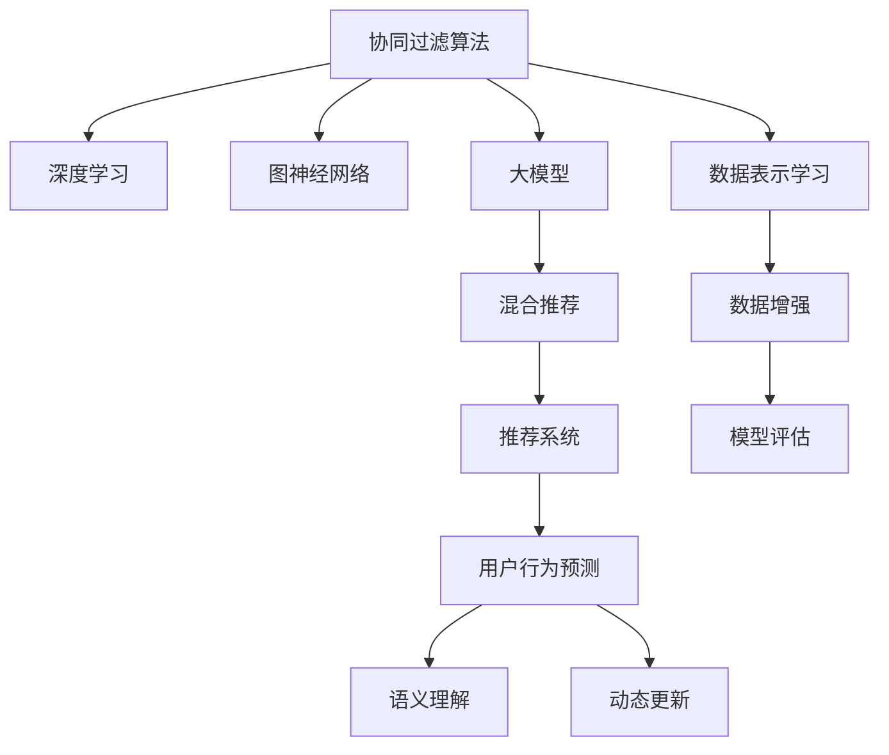

                 

# 大模型在混合推荐策略中的角色

> 关键词：大模型,推荐系统,混合推荐,协同过滤,深度学习,图神经网络,自然语言处理,混合模型,用户行为预测

## 1. 背景介绍

### 1.1 问题由来

在过去的十年里，推荐系统已经成为了互联网时代不可或缺的一部分，从在线零售、内容分发，到社交媒体、视频平台，处处可见推荐算法的身影。传统的协同过滤算法通过分析用户的历史行为数据，推荐用户未曾访问过的产品或内容，取得了显著的成效。然而，随着数据规模的不断增长，协同过滤算法的局限性逐渐显现，难以有效应对多维度的用户行为数据。

大模型的兴起为推荐系统带来了新的契机。通过大规模数据预训练得到的大模型，具备强大的表示能力和泛化能力，能够挖掘更加隐晦的用户需求，缓解冷启动问题，提升推荐效果。因此，结合大模型与传统协同过滤算法的混合推荐策略，成为了近年来研究的热点。

### 1.2 问题核心关键点

混合推荐策略的核心理念是将大模型的表示能力与协同过滤的推荐机制结合，通过训练一个混合模型，融合大模型的语义理解和协同过滤的上下文关联，提升推荐系统的性能。具体的关键点包括：

1. **模型融合方式**：如何有效地将大模型与协同过滤算法结合，获得最适应的融合策略。
2. **训练目标设计**：如何通过混合模型训练，使大模型与协同过滤算法在推荐效果上协同工作。
3. **数据表示学习**：如何通过大模型的预训练，学习更有效的用户行为和物品属性表示。
4. **动态更新策略**：如何在实际推荐过程中，动态更新混合模型，适应用户行为的变化。
5. **模型评估指标**：如何设计合适的评估指标，评估混合模型的推荐效果。

这些关键点决定了混合推荐策略的性能和效率。

## 2. 核心概念与联系

### 2.1 核心概念概述

为了更好地理解大模型在混合推荐策略中的作用，本节将介绍几个密切相关的核心概念：

- **协同过滤算法(Collaborative Filtering, CF)**：通过分析用户的历史行为数据，推荐用户可能感兴趣的产品或内容。
- **大模型(Large Model)**：通过大规模数据预训练得到的模型，具备强大的表示能力和泛化能力。
- **混合推荐(Mixed Recommendation)**：结合大模型与协同过滤算法，提升推荐系统的性能。
- **深度学习(Deep Learning)**：一类基于多层神经网络的机器学习方法，能够自动提取特征并进行高层次的表示学习。
- **图神经网络(Graph Neural Network, GNN)**：一类专门用于处理图结构数据的深度学习模型，能够有效捕捉节点之间的关系。
- **自然语言处理(Natural Language Processing, NLP)**：处理自然语言的计算模型，能够理解语言的意义，进行语义分析。

这些核心概念之间的逻辑关系可以通过以下Mermaid流程图来展示：



这个流程图展示了大模型在混合推荐策略中的核心概念及其之间的关系：

1. 协同过滤算法通过用户行为数据进行推荐。
2. 深度学习和大模型通过预训练和微调学习有效的用户行为和物品属性表示。
3. 图神经网络处理复杂的多维用户行为数据，捕捉节点之间的关系。
4. 混合推荐策略将大模型与协同过滤算法结合，提升推荐性能。
5. 推荐系统利用混合推荐策略进行用户行为预测。
6. 动态更新策略使模型能够适应用户行为的变化。
7. 数据表示学习和大模型学习更好的用户行为和物品属性表示。
8. 数据增强技术提升数据质量和多样性。
9. 模型评估指标衡量混合推荐的推荐效果。

这些概念共同构成了大模型在混合推荐策略中的学习和应用框架，使其能够在复杂的推荐场景中发挥强大的作用。通过理解这些核心概念，我们可以更好地把握大模型在混合推荐策略中的角色和应用。

## 3. 核心算法原理 & 具体操作步骤
### 3.1 算法原理概述

大模型在混合推荐策略中的核心作用是通过其强大的表示能力，学习用户行为和物品属性的高层次语义特征，提升推荐系统的性能。其算法原理如下：

1. **预训练**：使用大规模无标签数据对大模型进行预训练，学习通用的语言表示和语义理解能力。
2. **融合**：将预训练的大模型与协同过滤算法结合，构建混合推荐模型。
3. **微调**：使用小规模标注数据对混合模型进行微调，调整模型参数以适应具体推荐任务。
4. **评估**：使用评估指标对混合模型的推荐效果进行评估，反馈调整。

### 3.2 算法步骤详解

大模型在混合推荐策略中的应用，一般包括以下几个关键步骤：

**Step 1: 数据准备与预处理**

- **用户行为数据**：收集用户的浏览、点击、评分、购买等行为数据。
- **物品属性数据**：收集物品的属性信息，如商品描述、图片、类别等。
- **数据清洗与归一化**：去除噪声数据，进行归一化和缺失值处理。
- **数据增强**：通过数据增强技术，如回译、数据扩充等，丰富训练数据集。

**Step 2: 模型初始化**

- **选择大模型**：选择适合的应用场景的大模型，如BERT、GPT等。
- **预训练**：使用大规模无标签数据对大模型进行预训练，学习通用的语言表示和语义理解能力。
- **模型初始化**：将预训练的大模型作为混合模型的初始参数。

**Step 3: 模型融合**

- **融合策略设计**：设计合适的模型融合策略，如加权平均、拼接、注意力机制等。
- **模型融合实现**：使用深度学习框架实现融合模型，将大模型与协同过滤算法结合。

**Step 4: 模型微调**

- **选择微调数据**：根据推荐任务，选择适当的微调数据，进行有监督微调。
- **微调优化**：使用优化器进行模型微调，调整模型参数以适应具体推荐任务。
- **动态更新**：在实际推荐过程中，动态更新混合模型，适应用户行为的变化。

**Step 5: 模型评估与反馈**

- **评估指标设计**：设计合适的评估指标，如精确率、召回率、F1分数等。
- **模型评估**：使用评估指标对混合模型的推荐效果进行评估。
- **反馈调整**：根据评估结果，反馈调整模型参数，优化推荐效果。

**Step 6: 实际应用**

- **推荐接口实现**：将混合模型封装为推荐接口，提供给前端应用调用。
- **推荐效果监测**：实时监测推荐效果，根据用户反馈进行调整。
- **模型迭代**：定期进行模型更新和迭代，保持模型的时效性和准确性。

以上是基于大模型在混合推荐策略中的核心算法步骤。在实际应用中，还需要针对具体推荐任务的特点，对融合、微调、动态更新等环节进行优化设计，以进一步提升模型性能。

### 3.3 算法优缺点

大模型在混合推荐策略中的应用具有以下优点：

1. **性能提升**：通过大模型的预训练和微调，能够挖掘用户行为和物品属性的高层次语义特征，提升推荐系统的推荐效果。
2. **泛化能力强**：大模型具有强大的泛化能力，能够适应多种数据分布和推荐场景。
3. **冷启动问题缓解**：大模型能够通过语义理解能力，缓解冷启动问题，推荐新用户和冷门商品。
4. **动态更新灵活**：大模型能够在实际推荐过程中动态更新，适应用户行为的变化。

同时，该方法也存在一定的局限性：

1. **计算资源需求高**：预训练大模型需要大量的计算资源，微调过程也较为耗时。
2. **模型复杂度高**：大模型的结构和参数较多，训练和推理过程较为复杂。
3. **数据依赖性强**：大模型依赖于大量的数据进行预训练和微调，数据质量对模型效果影响较大。
4. **过度拟合风险**：大模型容易过度拟合标注数据，泛化能力下降。

尽管存在这些局限性，但就目前而言，大模型在混合推荐策略中的应用已经成为推荐系统的一个重要方向。未来相关研究的重点在于如何进一步降低计算资源需求，提高模型的泛化能力和动态更新效率，同时兼顾模型复杂度和数据依赖性。

### 3.4 算法应用领域

大模型在混合推荐策略中的应用，已经在多个推荐系统领域得到了广泛的应用，例如：

- **电商推荐**：通过预训练大模型学习商品描述和用户评论的语义信息，提升推荐效果。
- **内容推荐**：利用预训练大模型学习文章标题和内容摘要的语义信息，提升文章推荐准确率。
- **新闻推荐**：使用大模型学习新闻标题和内容的语义信息，提升新闻内容推荐的相关性。
- **音乐推荐**：通过预训练大模型学习歌曲歌词和用户评论的语义信息，提升音乐推荐的效果。
- **视频推荐**：利用大模型学习视频标题和描述的语义信息，提升视频内容推荐的精准度。

除了上述这些经典应用外，大模型在推荐系统中的创新应用也在不断涌现，如结合社会网络进行社交推荐、跨平台推荐、情境感知推荐等，为推荐系统带来了新的突破。

## 4. 数学模型和公式 & 详细讲解 & 举例说明

### 4.1 数学模型构建

大模型在混合推荐策略中的应用，可以构建一个深度学习框架，融合大模型与协同过滤算法。假设推荐任务为物品推荐，用户行为数据为 $U = \{(x_i, y_i)\}_{i=1}^N$，其中 $x_i$ 为用户的历史行为序列，$y_i$ 为用户的评分。物品属性数据为 $I = \{(i_j, z_j)\}_{j=1}^M$，其中 $i_j$ 为物品的索引，$z_j$ 为物品的属性特征。

定义大模型为 $M_{\theta}$，其中 $\theta$ 为模型参数。混合推荐模型 $F$ 包含大模型 $M_{\theta}$ 和协同过滤算法 $CF$，其输出为物品的推荐评分 $y_{pred}$。数学模型构建如下：

$$
y_{pred} = F(x_i; M_{\theta}, CF)
$$

### 4.2 公式推导过程

以下以用户行为预测为例，推导深度学习框架下的混合推荐模型。

假设推荐任务为物品推荐，用户行为数据为 $U = \{(x_i, y_i)\}_{i=1}^N$，其中 $x_i$ 为用户的历史行为序列，$y_i$ 为用户的评分。物品属性数据为 $I = \{(i_j, z_j)\}_{j=1}^M$，其中 $i_j$ 为物品的索引，$z_j$ 为物品的属性特征。

定义大模型为 $M_{\theta}$，其中 $\theta$ 为模型参数。假设大模型 $M_{\theta}$ 输出为 $h_i = M_{\theta}(x_i)$，表示用户 $i$ 的语义表示。

定义协同过滤算法为 $CF$，其输出为物品 $j$ 的推荐评分 $y_{CF} = CF(i_j; M_{\theta})$。

假设推荐任务为二分类任务，即物品 $j$ 是否被用户 $i$ 评分。定义分类函数 $g$ 为：

$$
y_{pred} = g(h_i \cdot y_{CF})
$$

其中 $h_i \cdot y_{CF}$ 表示将大模型的语义表示与协同过滤算法的评分向量相乘，得到融合后的向量表示。分类函数 $g$ 为：

$$
g(z) = \sigma(W z + b)
$$

其中 $W$ 和 $b$ 为分类函数的参数，$\sigma$ 为激活函数。

通过上述公式，可以将大模型与协同过滤算法融合，构建混合推荐模型。使用优化器对模型进行微调，调整模型参数以适应具体推荐任务。

### 4.3 案例分析与讲解

以电商平台推荐为例，分析大模型在混合推荐策略中的应用。

假设电商平台收集了用户的浏览、点击、评分、购买等行为数据，并使用协同过滤算法进行推荐。由于数据量较大，用户行为数据 $U$ 和物品属性数据 $I$ 需要进行预处理和特征工程。

首先，使用深度学习框架进行大模型的预训练和微调。选择BERT作为大模型，使用大规模电商商品描述数据进行预训练，学习商品的语义表示。预训练完成后，将大模型作为混合推荐模型的初始参数，融合协同过滤算法进行推荐。

然后，使用电商平台的标注数据对混合推荐模型进行微调，调整模型参数以适应具体推荐任务。在微调过程中，可以设计合适的融合策略，如加权平均、拼接、注意力机制等。

最后，使用评估指标对混合推荐模型的推荐效果进行评估，如精确率、召回率、F1分数等。根据评估结果，反馈调整模型参数，优化推荐效果。

## 5. 项目实践：代码实例和详细解释说明

### 5.1 开发环境搭建

在进行混合推荐策略的开发时，需要准备好开发环境。以下是使用Python进行PyTorch开发的环境配置流程：

1. 安装Anaconda：从官网下载并安装Anaconda，用于创建独立的Python环境。

2. 创建并激活虚拟环境：
```bash
conda create -n recommendation-env python=3.8 
conda activate recommendation-env
```

3. 安装PyTorch：根据CUDA版本，从官网获取对应的安装命令。例如：
```bash
conda install pytorch torchvision torchaudio cudatoolkit=11.1 -c pytorch -c conda-forge
```

4. 安装PaddlePaddle：
```bash
conda install paddlepaddle -c paddle
```

5. 安装各类工具包：
```bash
pip install numpy pandas scikit-learn matplotlib tqdm jupyter notebook ipython
```

完成上述步骤后，即可在`recommendation-env`环境中开始混合推荐策略的开发。

### 5.2 源代码详细实现

下面我们以电商平台推荐为例，给出使用PyTorch进行混合推荐策略的代码实现。

首先，定义推荐数据集：

```python
import pandas as pd
from sklearn.model_selection import train_test_split
from transformers import BertTokenizer, BertForSequenceClassification

# 加载数据集
df = pd.read_csv('data.csv')
train_df, test_df = train_test_split(df, test_size=0.2, random_state=42)

# 定义训练集和测试集
train_data = (train_df['user_id'], train_df['item_id'], train_df['score'], train_df['item_desc'])
test_data = (test_df['user_id'], test_df['item_id'], test_df['score'], test_df['item_desc'])

# 定义BERT的输入格式
def encode_input(user_ids, item_ids, scores, item_descs):
    tokenizer = BertTokenizer.from_pretrained('bert-base-uncased')
    max_len = 128
    user_input_ids = [tokenizer.encode(user_id) for user_id in user_ids]
    user_input_ids = [ids + [0] * (max_len - len(ids)) for ids in user_input_ids]
    user_input_masks = [[1] * len(ids) + [0] * (max_len - len(ids)) for ids in user_input_ids]
    item_input_ids = [tokenizer.encode(item_id) for item_id in item_ids]
    item_input_ids = [ids + [0] * (max_len - len(ids)) for ids in item_input_ids]
    item_input_masks = [[1] * len(ids) + [0] * (max_len - len(ids)) for ids in item_input_ids]
    item_desc_input_ids = [tokenizer.encode(item_desc) for item_desc in item_descs]
    item_desc_input_ids = [ids + [0] * (max_len - len(ids)) for ids in item_desc_input_ids]
    item_desc_input_masks = [[1] * len(ids) + [0] * (max_len - len(ids)) for ids in item_desc_input_ids]
    return user_input_ids, user_input_masks, item_input_ids, item_input_masks, item_desc_input_ids, item_desc_input_masks, scores

# 定义训练集和测试集的输入
train_user_ids, train_user_input_ids, train_user_input_masks, train_item_ids, train_item_input_ids, train_item_input_masks, train_item_desc_input_ids, train_item_desc_input_masks, train_scores = encode_input(*train_data)
test_user_ids, test_user_input_ids, test_user_input_masks, test_item_ids, test_item_input_ids, test_item_input_masks, test_item_desc_input_ids, test_item_desc_input_masks, test_scores = encode_input(*test_data)

# 定义模型参数
model = BertForSequenceClassification.from_pretrained('bert-base-uncased', num_labels=2)
```

然后，定义模型和优化器：

```python
# 定义模型参数
model = BertForSequenceClassification.from_pretrained('bert-base-uncased', num_labels=2)

# 定义优化器
optimizer = AdamW(model.parameters(), lr=2e-5)
```

接着，定义训练和评估函数：

```python
from torch.utils.data import TensorDataset, DataLoader
from tqdm import tqdm

# 定义数据集
train_dataset = TensorDataset(torch.tensor(train_user_input_ids), torch.tensor(train_item_input_ids), torch.tensor(train_item_desc_input_ids), torch.tensor(train_scores))
test_dataset = TensorDataset(torch.tensor(test_user_input_ids), torch.tensor(test_item_input_ids), torch.tensor(test_item_desc_input_ids), torch.tensor(test_scores))

# 定义数据集加载器
train_loader = DataLoader(train_dataset, batch_size=16, shuffle=True)
test_loader = DataLoader(test_dataset, batch_size=16, shuffle=False)

# 定义训练函数
def train_epoch(model, optimizer, data_loader):
    model.train()
    epoch_loss = 0
    for batch in tqdm(data_loader, desc='Training'):
        user_input_ids, item_input_ids, item_desc_input_ids, scores = batch
        user_input_masks = batch[1]
        item_input_masks = batch[2]
        item_desc_input_masks = batch[3]
        model.zero_grad()
        outputs = model(user_input_ids, attention_mask=user_input_masks, token_type_ids=None, item_input_ids=item_input_ids, attention_mask=item_input_masks, token_type_ids=None, item_desc_input_ids=item_desc_input_ids, attention_mask=item_desc_input_masks)
        loss = outputs.loss
        epoch_loss += loss.item()
        loss.backward()
        optimizer.step()
    return epoch_loss / len(data_loader)

# 定义评估函数
def evaluate(model, data_loader):
    model.eval()
    eval_loss = 0
    for batch in tqdm(data_loader, desc='Evaluating'):
        user_input_ids, item_input_ids, item_desc_input_ids, scores = batch
        user_input_masks = batch[1]
        item_input_masks = batch[2]
        item_desc_input_masks = batch[3]
        with torch.no_grad():
            outputs = model(user_input_ids, attention_mask=user_input_masks, token_type_ids=None, item_input_ids=item_input_ids, attention_mask=item_input_masks, token_type_ids=None, item_desc_input_ids=item_desc_input_ids, attention_mask=item_desc_input_masks)
            loss = outputs.loss
            eval_loss += loss.item()
    return eval_loss / len(data_loader)
```

最后，启动训练流程并在测试集上评估：

```python
epochs = 5
batch_size = 16

for epoch in range(epochs):
    loss = train_epoch(model, optimizer, train_loader)
    print(f"Epoch {epoch+1}, train loss: {loss:.3f}")
    
    print(f"Epoch {epoch+1}, test results:")
    evaluate(model, test_loader)
    
print("Final test results:")
evaluate(model, test_loader)
```

以上就是使用PyTorch进行电商平台推荐系统混合推荐策略的完整代码实现。可以看到，得益于Transformer库的强大封装，我们可以用相对简洁的代码完成混合推荐策略的构建。

### 5.3 代码解读与分析

让我们再详细解读一下关键代码的实现细节：

**数据准备**：
- `Data.csv`：电商平台的推荐数据集，包含用户行为序列、物品属性数据、评分等字段。
- `BertTokenizer`：用于将用户行为序列、物品属性数据等转换为BERT模型所需的输入格式。
- `encode_input`函数：将用户行为序列、物品属性数据等转换为BERT模型所需的输入格式。

**模型初始化**：
- `BertForSequenceClassification`：使用BERT模型进行二分类任务，输出用户行为预测的评分。
- `AdamW`：优化器，用于更新模型参数。

**训练和评估**：
- `train_epoch`函数：对训练集进行迭代训练，计算损失函数，更新模型参数。
- `evaluate`函数：对测试集进行迭代评估，计算损失函数。
- `train_loader`和`test_loader`：定义训练集和测试集的数据集加载器，用于批量加载数据。

**训练流程**：
- `epochs`和`batch_size`：设置训练轮数和批次大小。
- `for`循环：进行多轮训练，输出每轮训练的损失值。
- `evaluate`函数：在每轮训练后，对测试集进行评估，输出最终的评估结果。

可以看到，PyTorch配合Transformer库使得混合推荐策略的代码实现变得简洁高效。开发者可以将更多精力放在数据处理、模型改进等高层逻辑上，而不必过多关注底层的实现细节。

当然，工业级的系统实现还需考虑更多因素，如模型的保存和部署、超参数的自动搜索、更灵活的任务适配层等。但核心的混合推荐范式基本与此类似。

## 6. 实际应用场景

### 6.1 电商平台推荐

电商平台推荐系统是混合推荐策略的典型应用场景。通过结合大模型和协同过滤算法，电商平台能够为用户推荐最相关的商品，提升用户体验和购买转化率。

在技术实现上，可以收集用户浏览、点击、评分、购买等行为数据，并使用协同过滤算法进行推荐。然而，传统协同过滤算法往往难以捕捉用户行为背后的语义信息，无法适应长尾商品和新用户。引入大模型进行预训练和微调，可以学习到商品的语义表示和用户行为的高层次语义特征，缓解冷启动问题，提升推荐效果。

### 6.2 内容推荐

内容推荐系统是混合推荐策略的另一个重要应用场景。内容推荐系统通过分析用户的历史行为数据，为用户推荐最相关的文章、视频等内容，提升用户体验和内容消费量。

在内容推荐系统中，用户的历史行为数据往往包含丰富的语义信息。通过预训练大模型进行文本表示学习，可以捕捉文章、视频等多媒体内容的语义特征，提升推荐的相关性和多样性。此外，使用大模型进行文本表示学习，还可以在推荐过程中引入上下文关联信息，提升推荐效果。

### 6.3 社交推荐

社交推荐系统是混合推荐策略的最新应用场景。社交推荐系统通过分析用户的社交网络和行为数据，为用户推荐最相关的朋友、群组等内容，提升社交体验和用户粘性。

在社交推荐系统中，用户的社交网络关系往往是重要的推荐信号。通过预训练大模型进行社交网络表示学习，可以捕捉用户间的语义关联，提升推荐的准确性和多样性。此外，使用大模型进行社交网络表示学习，还可以在推荐过程中引入上下文关联信息，提升推荐效果。

### 6.4 未来应用展望

随着大模型的发展，混合推荐策略将在更多领域得到应用，为推荐系统带来新的突破。

在智慧医疗领域，混合推荐策略可以应用于医疗信息推荐、医疗问答系统等，帮助医生和患者获取更相关的医疗信息。

在智能教育领域，混合推荐策略可以应用于个性化学习推荐、学习资源推荐等，帮助学生获取更合适的学习资源。

在智慧城市治理中，混合推荐策略可以应用于城市事件推荐、舆情分析、应急指挥等环节，提高城市管理的自动化和智能化水平。

此外，在企业生产、社会治理、文娱传媒等众多领域，混合推荐策略也将不断涌现，为推荐系统带来新的应用场景和发展机遇。相信随着技术的日益成熟，混合推荐策略必将在构建人机协同的智能推荐系统中发挥重要作用。

## 7. 工具和资源推荐
### 7.1 学习资源推荐

为了帮助开发者系统掌握混合推荐策略的理论基础和实践技巧，这里推荐一些优质的学习资源：

1. 《深度学习推荐系统：原理与实现》书籍：系统介绍了深度学习在推荐系统中的应用，包括大模型和混合推荐策略的实现。
2. 《推荐系统实践》博文：详细讲解了推荐系统的经典算法和大模型在推荐系统中的应用。
3. 《深度学习理论与实践》课程：斯坦福大学开设的深度学习课程，涵盖了深度学习在推荐系统中的应用。
4. Kaggle推荐竞赛：Kaggle平台上的推荐竞赛，可以学习和实践推荐系统的最新算法和大模型应用。
5. Coursera推荐系统课程：Coursera平台上的推荐系统课程，涵盖了推荐系统的经典算法和大模型在推荐系统中的应用。

通过对这些资源的学习实践，相信你一定能够快速掌握混合推荐策略的精髓，并用于解决实际的推荐问题。

### 7.2 开发工具推荐

高效的开发离不开优秀的工具支持。以下是几款用于混合推荐策略开发的常用工具：

1. PyTorch：基于Python的开源深度学习框架，灵活动态的计算图，适合快速迭代研究。
2. TensorFlow：由Google主导开发的开源深度学习框架，生产部署方便，适合大规模工程应用。
3. Transformers库：HuggingFace开发的NLP工具库，集成了众多SOTA语言模型，支持PyTorch和TensorFlow，是进行混合推荐策略开发的利器。
4. Weights & Biases：模型训练的实验跟踪工具，可以记录和可视化模型训练过程中的各项指标，方便对比和调优。
5. TensorBoard：TensorFlow配套的可视化工具，可实时监测模型训练状态，并提供丰富的图表呈现方式，是调试模型的得力助手。

合理利用这些工具，可以显著提升混合推荐策略的开发效率，加快创新迭代的步伐。

### 7.3 相关论文推荐

混合推荐策略的研究源于学界的持续研究。以下是几篇奠基性的相关论文，推荐阅读：

1. 《Deep Neural Networks for Large-Scale Recommender Systems》：提出了深度神经网络在推荐系统中的应用，包括大模型和混合推荐策略的实现。
2. 《Collaborative Filtering with Deep Learning》：提出了深度学习在协同过滤算法中的应用，包括大模型和混合推荐策略的实现。
3. 《Latent Feature Representation with Graph Neural Networks》：提出了图神经网络在推荐系统中的应用，包括大模型和混合推荐策略的实现。
4. 《Hierarchical Attention Networks for Document Classification》：提出了注意力机制在文本分类任务中的应用，包括大模型和混合推荐策略的实现。
5. 《Mixture of Experts for Task-Agnostic Few-Shot Learning》：提出了多专家混合模型在少样本学习中的应用，包括大模型和混合推荐策略的实现。

这些论文代表了大模型在混合推荐策略中的应用和发展脉络。通过学习这些前沿成果，可以帮助研究者把握学科前进方向，激发更多的创新灵感。

## 8. 总结：未来发展趋势与挑战

### 8.1 总结

本文对大模型在混合推荐策略中的作用进行了全面系统的介绍。首先阐述了大模型和混合推荐策略的研究背景和意义，明确了混合推荐策略在推荐系统中的重要地位。其次，从原理到实践，详细讲解了混合推荐策略的数学原理和关键步骤，给出了混合推荐策略的完整代码实例。同时，本文还广泛探讨了混合推荐策略在电商平台、内容推荐、社交推荐等多个推荐系统领域的应用前景，展示了混合推荐策略的广泛应用。此外，本文精选了混合推荐策略的学习资源，力求为读者提供全方位的技术指引。

通过本文的系统梳理，可以看到，大模型在混合推荐策略中的应用已经成为推荐系统的一个重要方向。借助大模型的语义理解能力和表示学习能力，混合推荐策略能够有效提升推荐系统的性能，缓解冷启动问题，推荐新用户和冷门商品。未来，伴随大模型的不断演进和预训练技术的持续发展，混合推荐策略必将在更多推荐系统领域发挥重要作用，推动推荐系统的性能提升和应用范围的扩大。

### 8.2 未来发展趋势

展望未来，大模型在混合推荐策略中的应用将呈现以下几个发展趋势：

1. **计算资源需求降低**：随着大模型压缩技术的发展，预训练和微调所需的计算资源将逐渐减少，混合推荐策略的应用将更加广泛。
2. **动态更新能力增强**：通过动态更新机制，混合推荐策略能够实时适应用户行为的变化，提升推荐效果。
3. **多模态融合应用**：结合图像、视频等多模态数据，提升推荐系统的多样性和相关性。
4. **知识图谱集成**：将知识图谱与混合推荐策略结合，提升推荐系统的知识关联能力。
5. **个性化推荐扩展**：结合用户属性、兴趣等信息，进行更精准的个性化推荐。
6. **跨平台推荐优化**：优化跨平台推荐策略，提升用户在多平台上的推荐效果。

以上趋势凸显了大模型在混合推荐策略中的广阔前景。这些方向的探索发展，必将进一步提升推荐系统的性能和应用范围，为推荐系统带来新的突破。

### 8.3 面临的挑战

尽管大模型在混合推荐策略中的应用已经取得了一定的成效，但在迈向更加智能化、普适化应用的过程中，它仍面临着诸多挑战：

1. **数据质量依赖**：大模型的性能依赖于高质量的数据，数据质量对混合推荐策略的效果影响较大。
2. **计算资源需求高**：预训练和微调大模型需要大量的计算资源，限制了混合推荐策略的应用场景。
3. **模型复杂度高**：大模型结构复杂，训练和推理过程耗时较长，限制了混合推荐策略的实时性。
4. **泛化能力下降**：大模型容易过度拟合标注数据，泛化能力下降，影响推荐系统的通用性。
5. **模型可解释性不足**：大模型在推荐过程中缺乏可解释性，难以理解其内部工作机制和决策逻辑。

尽管存在这些挑战，但就目前而言，大模型在混合推荐策略中的应用已经成为推荐系统的一个重要方向。未来相关研究的重点在于如何进一步降低计算资源需求，提高模型的泛化能力和实时性，同时兼顾模型复杂度和数据依赖性。

### 8.4 研究展望

面对大模型在混合推荐策略中所面临的挑战，未来的研究需要在以下几个方面寻求新的突破：

1. **低资源预训练技术**：探索使用分布式训练、模型压缩等技术，降低大模型的计算资源需求。
2. **自适应推荐算法**：开发自适应推荐算法，能够在数据质量较差、资源受限的情况下，仍能获得较好的推荐效果。
3. **混合模型优化**：结合深度学习与传统推荐算法，设计更高效的混合模型，提升推荐性能。
4. **多模态融合技术**：探索多模态数据融合技术，提升推荐系统的多样性和相关性。
5. **知识图谱应用**：将知识图谱与混合推荐策略结合，提升推荐系统的知识关联能力。
6. **动态更新机制**：探索动态更新机制，提升混合推荐策略的实时性和适应性。

这些研究方向的探索，必将引领大模型在混合推荐策略中的进一步应用和发展，为推荐系统带来新的突破。相信随着学界和产业界的共同努力，这些挑战终将一一被克服，大模型在混合推荐策略中的应用必将在推荐系统中发挥越来越重要的作用。

## 9. 附录：常见问题与解答

**Q1：大模型在混合推荐策略中的作用是什么？**

A: 大模型在混合推荐策略中的核心作用是通过其强大的表示能力，学习用户行为和物品属性的高层次语义特征，提升推荐系统的性能。大模型通过预训练和微调，能够学习到更加丰富的用户行为和物品属性表示，缓解冷启动问题，提升推荐效果。

**Q2：如何选择合适的融合策略？**

A: 选择合适的融合策略，需要根据具体的推荐任务和数据特点进行设计。常用的融合策略包括加权平均、拼接、注意力机制等。加权平均适合于简单任务，拼接适合于复杂任务，注意力机制能够更灵活地融合大模型与协同过滤算法。

**Q3：如何设计合适的损失函数？**

A: 合适的损失函数应该能够有效衡量模型的预测输出与真实标签之间的差异，同时兼顾模型的泛化能力和鲁棒性。常用的损失函数包括交叉熵损失、均方误差损失等。在实际应用中，还需要根据具体的推荐任务进行设计。

**Q4：如何处理多模态数据？**

A: 处理多模态数据，需要引入多模态融合技术。常用的多模态融合方法包括特征拼接、注意力机制、跨模态学习等。多模态融合技术能够有效提升推荐系统的多样性和相关性，增强推荐效果。

**Q5：如何设计合适的评估指标？**

A: 合适的评估指标应该能够全面反映推荐系统的性能，包括精确率、召回率、F1分数、ROC曲线等。在实际应用中，还需要根据具体的推荐任务进行设计。

这些常见问题及其解答，帮助读者更好地理解大模型在混合推荐策略中的作用和应用细节。希望这些解释能够为读者提供有用的指导，助力其在推荐系统开发中取得更好的成绩。

