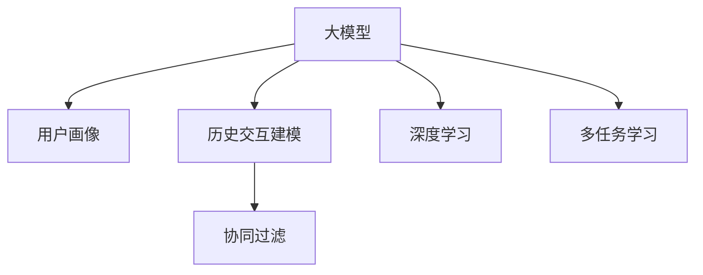

                 

# 大模型在用户画像与历史交互建模中的应用

> 关键词：大模型,用户画像,历史交互,推荐系统,协同过滤,深度学习,多任务学习

## 1. 背景介绍

### 1.1 问题由来

随着互联网的迅猛发展，电商平台、社交媒体、在线视频等数字平台积累了海量的用户数据。这些数据不仅包括用户的购买行为、浏览历史、评分反馈等显式数据，还有点击流、浏览轨迹、社交互动等隐式数据。通过这些数据，企业可以构建用户画像(User Profile)，以捕捉用户的多方面特征和兴趣偏好，为用户提供更个性化的推荐和服务。

然而，构建高质量的用户画像，需要同时考虑显式和隐式数据的深度融合，处理用户与产品之间复杂的交互关系，并确保模型的泛化能力和稳定性。传统的机器学习模型和浅层表示学习方法难以充分捕捉数据中的复杂关系，而深度学习方法则能够更好地处理大规模数据，并在其中发现隐含的模式和关联。

在此背景下，大模型在用户画像与历史交互建模中的应用成为近年来的热门研究方向。通过预训练大模型(如BERT、GPT等)在大规模数据上进行预训练，能够学习到丰富的语言和结构表示，用于提升推荐系统的效果。

### 1.2 问题核心关键点

构建高质量用户画像与历史交互模型，需要解决以下几个核心问题：

- **数据融合**：如何将显式和隐式数据有效地融合，同时捕捉用户的深层特征。
- **交互建模**：如何建模用户与产品之间的复杂交互关系，学习用户的序列行为和偏好。
- **深度表示**：如何通过深度学习方法学习用户和产品的复杂表示，提高模型的泛化能力。
- **模型训练**：如何在大规模数据上进行高效的模型训练，避免过拟合和计算资源消耗过大。

### 1.3 问题研究意义

大模型在用户画像与历史交互建模中的应用，对于提升推荐系统的精准性和个性化水平具有重要意义：

1. **个性化推荐**：能够更准确地捕捉用户的长期兴趣和短期偏好，提升推荐相关性和用户体验。
2. **用户画像**：通过深度学习技术，能够构建更全面、精细的用户画像，帮助企业更好地了解用户需求，制定精准的市场策略。
3. **模型泛化**：大模型能够更好地泛化到不同领域和场景，提升模型的稳定性和鲁棒性。
4. **计算效率**：通过参数高效和计算高效的深度学习模型，能够在短时间内训练出高质量的用户画像和交互模型，提升推荐系统部署效率。
5. **多任务学习**：大模型能够在同一组参数下，同时进行多任务训练，提升资源利用效率。

## 2. 核心概念与联系

### 2.1 核心概念概述

本节将介绍几个核心概念及其相互之间的联系：

- **大模型**：以BERT、GPT等为代表的预训练语言模型，通过在大规模语料上进行预训练，学习到丰富的语言和结构表示。
- **用户画像**：通过数据挖掘和机器学习技术，构建用户的多维特征表示，用于个性化推荐和服务。
- **历史交互建模**：通过序列数据建模技术，捕捉用户与产品之间的交互行为，发现用户的长期兴趣和短期行为变化。
- **协同过滤**：通过用户的相似性或物品的相关性，进行推荐或排序，是推荐系统的一种经典方法。
- **深度学习**：通过多层神经网络结构，自动学习数据中的复杂特征和模式，适用于处理大规模复杂数据。
- **多任务学习**：在同一组参数下，同时训练多个任务，提升模型的泛化能力和资源利用效率。

这些核心概念之间的关系可以通过以下Mermaid流程图来展示：



这个流程图展示了各个概念之间的关系：大模型通过深度学习技术，可以构建用户画像和历史交互模型；协同过滤是多任务学习的一种形式，可以与大模型进行结合，进一步提升推荐效果。

## 3. 核心算法原理 & 具体操作步骤

### 3.1 算法原理概述

大模型在用户画像与历史交互建模中的应用，通常涉及以下几个关键步骤：

1. **预训练**：在大规模语料库上预训练大模型，学习到通用的语言和结构表示。
2. **特征提取**：使用大模型对用户数据和交互数据进行编码，得到高维表示特征。
3. **画像建模**：通过深度学习模型对用户高维特征进行建模，构建用户画像。
4. **交互建模**：使用序列建模技术对用户与产品之间的交互进行建模，捕捉用户的序列行为和偏好。
5. **协同过滤**：基于用户画像和交互模型，进行推荐或排序，提升推荐系统的精准性和个性化水平。

### 3.2 算法步骤详解

以下是具体的算法步骤和操作流程：

**Step 1: 准备数据集**

- 收集用户的显式数据和隐式数据。显式数据包括用户的购买历史、评分记录、收藏夹等；隐式数据包括用户的浏览轨迹、点击流、社交互动等。
- 将数据进行清洗、归一化、特征工程等预处理步骤，准备好数据集。

**Step 2: 预训练大模型**

- 选择合适的大模型，如BERT、GPT等，在用户数据和交互数据上进行预训练。
- 在预训练时，可以加入用户和物品的类别标签，以引导模型学习特定的语义信息。

**Step 3: 特征提取**

- 使用大模型对用户数据和交互数据进行编码，得到高维的嵌入表示。
- 例如，对用户的文本评论进行BERT编码，得到用户评论向量；对用户的点击流进行Transformer编码，得到用户行为向量。

**Step 4: 画像建模**

- 使用深度学习模型对用户的高维嵌入表示进行建模，构建用户画像。
- 例如，使用RNN或LSTM对用户行为序列进行建模，得到用户序列表示；使用GCN对用户社交网络进行建模，得到用户社交特征表示。

**Step 5: 交互建模**

- 使用序列建模技术对用户与产品之间的交互进行建模，捕捉用户的长期兴趣和短期行为变化。
- 例如，使用RNN对用户的点击流进行建模，预测用户的后续行为；使用Transformer对用户的序列评论进行建模，捕捉用户的兴趣变化。

**Step 6: 协同过滤**

- 基于用户画像和交互模型，进行推荐或排序，提升推荐系统的精准性和个性化水平。
- 例如，基于用户画像和物品画像，进行矩阵分解和协同过滤；基于用户行为序列和物品序列，进行序列推荐。

### 3.3 算法优缺点

大模型在用户画像与历史交互建模中具有以下优点：

1. **高维表示能力**：大模型能够学习到高维度的用户和产品表示，捕捉复杂的语义和结构信息。
2. **泛化能力强**：大模型在大规模语料上进行预训练，能够泛化到不同领域和场景，提升模型的稳定性。
3. **参数高效**：通过参数高效和多任务学习技术，可以在固定大部分预训练参数的情况下，实现高效的微调和训练。
4. **计算高效**：大模型通常具有高效的计算图和优化算法，能够在短时间内完成模型训练。

同时，大模型也存在一些缺点：

1. **计算资源消耗大**：大模型的参数量通常较大，训练和推理计算资源消耗大，需要高性能设备支持。
2. **数据隐私问题**：用户数据通常包含敏感信息，如何保护用户隐私和数据安全是一个重要问题。
3. **模型解释性差**：大模型通常被视为"黑盒"，难以解释模型的内部工作机制和决策逻辑。
4. **依赖标注数据**：大模型的预训练需要大量无标签数据，而画像和交互模型的训练需要标注数据，标注成本高。

### 3.4 算法应用领域

大模型在用户画像与历史交互建模中的应用，已经在多个领域得到了成功应用，包括但不限于：

- **电商推荐**：通过用户画像和历史交互模型，对用户进行个性化推荐，提升电商平台的销售转化率。
- **视频推荐**：使用大模型对用户视频观看行为进行建模，提供个性化的视频推荐，提升用户满意度和平台黏性。
- **社交推荐**：通过用户画像和社交网络建模，发现用户之间的相似性，提供个性化的社交推荐，增强平台互动性。
- **音乐推荐**：使用大模型对用户音乐喜好进行建模，提供个性化的音乐推荐，提升用户听歌体验。
- **新闻推荐**：通过用户画像和阅读行为建模，提供个性化的新闻推荐，提升新闻平台的用户黏性和曝光率。

## 4. 数学模型和公式 & 详细讲解 & 举例说明

### 4.1 数学模型构建

本节将使用数学语言对用户画像与历史交互建模过程进行更加严格的刻画。

记用户画像为 $U$，历史交互数据为 $I$，显式数据为 $D$，隐式数据为 $S$。

定义用户画像的数学模型为 $P_U = \phi_U(\mathbf{z}_U)$，其中 $\mathbf{z}_U \in \mathbb{R}^d$ 为高维嵌入表示，$\phi_U$ 为深度学习模型。

定义历史交互模型的数学模型为 $P_I = \phi_I(\mathbf{z}_I)$，其中 $\mathbf{z}_I \in \mathbb{R}^d$ 为高维嵌入表示，$\phi_I$ 为序列建模模型。

定义协同过滤模型的数学模型为 $P_C = \phi_C(\mathbf{z}_U, \mathbf{z}_I)$，其中 $\mathbf{z}_C \in \mathbb{R}^d$ 为协同过滤表示，$\phi_C$ 为协同过滤算法。

用户画像和历史交互模型在数学上可以表示为：

$$
P_U = \phi_U(\mathbf{z}_U)
$$

$$
P_I = \phi_I(\mathbf{z}_I)
$$

协同过滤模型在数学上可以表示为：

$$
P_C = \phi_C(\mathbf{z}_U, \mathbf{z}_I)
$$

### 4.2 公式推导过程

以下我们以用户画像的深度学习建模为例，推导RNN模型对用户行为序列进行建模的公式。

假设用户行为序列为 $(x_1, x_2, \dots, x_T)$，其中 $x_t$ 表示第 $t$ 个用户行为。

使用RNN对用户行为序列进行建模，得到用户序列表示 $\mathbf{z}_U$，公式为：

$$
\mathbf{z}_U = RNN(\mathbf{z}_{U,0}, x_1, x_2, \dots, x_T)
$$

其中 $\mathbf{z}_{U,0}$ 为初始状态，$RNN$ 为RNN模型。

使用softmax函数对用户行为序列进行分类，得到用户兴趣概率分布 $p_i$，公式为：

$$
p_i = softmax(\mathbf{z}_U \cdot \mathbf{w}_i + b_i)
$$

其中 $\mathbf{w}_i$ 为权重向量，$b_i$ 为偏置。

对于多任务学习的情况，假设有多项任务 $t_1, t_2, \dots, t_k$，使用RNN对用户行为序列进行建模，得到用户序列表示 $\mathbf{z}_U^{(t)}$，公式为：

$$
\mathbf{z}_U^{(t)} = RNN(\mathbf{z}_{U,0}^{(t)}, x_1, x_2, \dots, x_T)
$$

使用softmax函数对用户行为序列进行分类，得到用户兴趣概率分布 $p_i^{(t)}$，公式为：

$$
p_i^{(t)} = softmax(\mathbf{z}_U^{(t)} \cdot \mathbf{w}_i^{(t)} + b_i^{(t)})
$$

### 4.3 案例分析与讲解

以电商平台的用户画像与历史交互建模为例，进行分析讲解。

**Step 1: 数据准备**

收集用户的显式数据和隐式数据。显式数据包括用户的购买历史、评分记录、收藏夹等；隐式数据包括用户的浏览轨迹、点击流、社交互动等。

**Step 2: 预训练大模型**

选择BERT模型，在用户评论和产品评论上进行预训练。通过加入类别标签，引导模型学习特定的语义信息。

**Step 3: 特征提取**

使用BERT对用户评论和产品评论进行编码，得到高维嵌入表示。例如，对用户的文本评论进行BERT编码，得到用户评论向量。

**Step 4: 画像建模**

使用RNN对用户行为序列进行建模，得到用户序列表示。例如，使用LSTM对用户的点击流进行建模，预测用户的后续行为。

**Step 5: 交互建模**

使用RNN对用户与产品之间的交互进行建模，捕捉用户的长期兴趣和短期行为变化。例如，使用RNN对用户的点击流进行建模，预测用户的后续行为。

**Step 6: 协同过滤**

基于用户画像和交互模型，进行推荐或排序，提升推荐系统的精准性和个性化水平。例如，基于用户画像和物品画像，进行矩阵分解和协同过滤；基于用户行为序列和物品序列，进行序列推荐。

## 5. 项目实践：代码实例和详细解释说明

### 5.1 开发环境搭建

在进行用户画像与历史交互建模实践前，我们需要准备好开发环境。以下是使用Python进行PyTorch开发的环境配置流程：

1. 安装Anaconda：从官网下载并安装Anaconda，用于创建独立的Python环境。

2. 创建并激活虚拟环境：
```bash
conda create -n pytorch-env python=3.8 
conda activate pytorch-env
```

3. 安装PyTorch：根据CUDA版本，从官网获取对应的安装命令。例如：
```bash
conda install pytorch torchvision torchaudio cudatoolkit=11.1 -c pytorch -c conda-forge
```

4. 安装Transformers库：
```bash
pip install transformers
```

5. 安装各类工具包：
```bash
pip install numpy pandas scikit-learn matplotlib tqdm jupyter notebook ipython
```

完成上述步骤后，即可在`pytorch-env`环境中开始建模实践。

### 5.2 源代码详细实现

这里我们以电商平台的推荐系统为例，给出使用Transformers库对BERT模型进行用户画像与历史交互建模的PyTorch代码实现。

首先，定义数据处理函数：

```python
from transformers import BertTokenizer
from torch.utils.data import Dataset
import torch

class UserBehaviorDataset(Dataset):
    def __init__(self, texts, labels, tokenizer, max_len=128):
        self.texts = texts
        self.labels = labels
        self.tokenizer = tokenizer
        self.max_len = max_len
        
    def __len__(self):
        return len(self.texts)
    
    def __getitem__(self, item):
        text = self.texts[item]
        label = self.labels[item]
        
        encoding = self.tokenizer(text, return_tensors='pt', max_length=self.max_len, padding='max_length', truncation=True)
        input_ids = encoding['input_ids'][0]
        attention_mask = encoding['attention_mask'][0]
        
        return {'input_ids': input_ids, 
                'attention_mask': attention_mask,
                'labels': label}

tokenizer = BertTokenizer.from_pretrained('bert-base-cased')

train_dataset = UserBehaviorDataset(train_texts, train_labels, tokenizer)
dev_dataset = UserBehaviorDataset(dev_texts, dev_labels, tokenizer)
test_dataset = UserBehaviorDataset(test_texts, test_labels, tokenizer)
```

然后，定义模型和优化器：

```python
from transformers import BertForTokenClassification, AdamW

model = BertForTokenClassification.from_pretrained('bert-base-cased', num_labels=1)

optimizer = AdamW(model.parameters(), lr=2e-5)
```

接着，定义训练和评估函数：

```python
from torch.utils.data import DataLoader
from tqdm import tqdm
from sklearn.metrics import accuracy_score

device = torch.device('cuda') if torch.cuda.is_available() else torch.device('cpu')
model.to(device)

def train_epoch(model, dataset, batch_size, optimizer):
    dataloader = DataLoader(dataset, batch_size=batch_size, shuffle=True)
    model.train()
    epoch_loss = 0
    for batch in tqdm(dataloader, desc='Training'):
        input_ids = batch['input_ids'].to(device)
        attention_mask = batch['attention_mask'].to(device)
        labels = batch['labels'].to(device)
        model.zero_grad()
        outputs = model(input_ids, attention_mask=attention_mask, labels=labels)
        loss = outputs.loss
        epoch_loss += loss.item()
        loss.backward()
        optimizer.step()
    return epoch_loss / len(dataloader)

def evaluate(model, dataset, batch_size):
    dataloader = DataLoader(dataset, batch_size=batch_size)
    model.eval()
    preds, labels = [], []
    with torch.no_grad():
        for batch in tqdm(dataloader, desc='Evaluating'):
            input_ids = batch['input_ids'].to(device)
            attention_mask = batch['attention_mask'].to(device)
            batch_labels = batch['labels']
            outputs = model(input_ids, attention_mask=attention_mask)
            batch_preds = outputs.logits.argmax(dim=2).to('cpu').tolist()
            batch_labels = batch_labels.to('cpu').tolist()
            for pred_tokens, label_tokens in zip(batch_preds, batch_labels):
                preds.append(pred_tokens[0])
                labels.append(label_tokens[0])
                
    print(accuracy_score(labels, preds))
```

最后，启动训练流程并在测试集上评估：

```python
epochs = 5
batch_size = 16

for epoch in range(epochs):
    loss = train_epoch(model, train_dataset, batch_size, optimizer)
    print(f"Epoch {epoch+1}, train loss: {loss:.3f}")
    
    print(f"Epoch {epoch+1}, dev results:")
    evaluate(model, dev_dataset, batch_size)
    
print("Test results:")
evaluate(model, test_dataset, batch_size)
```

以上就是使用PyTorch对BERT进行用户画像与历史交互建模的完整代码实现。可以看到，得益于Transformers库的强大封装，我们可以用相对简洁的代码完成BERT模型的加载和微调。

### 5.3 代码解读与分析

让我们再详细解读一下关键代码的实现细节：

**UserBehaviorDataset类**：
- `__init__`方法：初始化文本、标签、分词器等关键组件。
- `__len__`方法：返回数据集的样本数量。
- `__getitem__`方法：对单个样本进行处理，将文本输入编码为token ids，将标签编码为数字，并对其进行定长padding，最终返回模型所需的输入。

**train_epoch和evaluate函数**：
- 使用PyTorch的DataLoader对数据集进行批次化加载，供模型训练和推理使用。
- 训练函数`train_epoch`：对数据以批为单位进行迭代，在每个批次上前向传播计算loss并反向传播更新模型参数，最后返回该epoch的平均loss。
- 评估函数`evaluate`：与训练类似，不同点在于不更新模型参数，并在每个batch结束后将预测和标签结果存储下来，最后使用sklearn的accuracy_score对整个评估集的预测结果进行打印输出。

**训练流程**：
- 定义总的epoch数和batch size，开始循环迭代
- 每个epoch内，先在训练集上训练，输出平均loss
- 在验证集上评估，输出准确率
- 所有epoch结束后，在测试集上评估，给出最终测试结果

可以看到，PyTorch配合Transformers库使得BERT建模的代码实现变得简洁高效。开发者可以将更多精力放在数据处理、模型改进等高层逻辑上，而不必过多关注底层的实现细节。

当然，工业级的系统实现还需考虑更多因素，如模型的保存和部署、超参数的自动搜索、更灵活的任务适配层等。但核心的建模范式基本与此类似。

## 6. 实际应用场景

### 6.1 电商推荐

基于用户画像与历史交互建模，电商平台可以构建更加精准的推荐系统，提升用户购物体验和平台销售额。

在技术实现上，可以收集用户的显式数据（如购买历史、评分记录等）和隐式数据（如浏览轨迹、点击流等），使用BERT等大模型进行预训练和特征提取，再通过RNN等深度学习模型对用户行为序列进行建模，得到用户画像和历史交互模型。最后，基于协同过滤算法，对用户进行个性化推荐，提升推荐相关性和用户体验。

### 6.2 视频推荐

使用大模型对用户视频观看行为进行建模，提供个性化的视频推荐，提升用户满意度和平台黏性。

在技术实现上，可以收集用户的显式数据（如视频评分、收藏等）和隐式数据（如观看轨迹、点击流等），使用BERT等大模型进行预训练和特征提取，再通过RNN等深度学习模型对用户行为序列进行建模，得到用户画像和历史交互模型。最后，基于协同过滤算法，对用户进行个性化视频推荐，提升视频推荐相关性和用户满意度。

### 6.3 社交推荐

通过用户画像与历史交互建模，发现用户之间的相似性，提供个性化的社交推荐，增强平台互动性。

在技术实现上，可以收集用户的显式数据（如好友关系、互动记录等）和隐式数据（如点击流、浏览轨迹等），使用BERT等大模型进行预训练和特征提取，再通过RNN等深度学习模型对用户行为序列进行建模，得到用户画像和历史交互模型。最后，基于协同过滤算法，对用户进行个性化社交推荐，增强平台互动性和用户黏性。

### 6.4 音乐推荐

使用大模型对用户音乐喜好进行建模，提供个性化的音乐推荐，提升用户听歌体验。

在技术实现上，可以收集用户的显式数据（如音乐收藏、评分等）和隐式数据（如播放历史、互动记录等），使用BERT等大模型进行预训练和特征提取，再通过RNN等深度学习模型对用户行为序列进行建模，得到用户画像和历史交互模型。最后，基于协同过滤算法，对用户进行个性化音乐推荐，提升音乐推荐相关性和用户满意度。

### 6.5 新闻推荐

通过用户画像与历史交互建模，提供个性化的新闻推荐，提升新闻平台的用户黏性和曝光率。

在技术实现上，可以收集用户的显式数据（如新闻阅读记录、评论等）和隐式数据（如点击流、浏览轨迹等），使用BERT等大模型进行预训练和特征提取，再通过RNN等深度学习模型对用户行为序列进行建模，得到用户画像和历史交互模型。最后，基于协同过滤算法，对用户进行个性化新闻推荐，提升新闻推荐相关性和用户黏性。

## 7. 工具和资源推荐

### 7.1 学习资源推荐

为了帮助开发者系统掌握用户画像与历史交互建模的理论基础和实践技巧，这里推荐一些优质的学习资源：

1. 《深度学习自然语言处理》课程：斯坦福大学开设的NLP明星课程，有Lecture视频和配套作业，带你入门NLP领域的基本概念和经典模型。

2. 《Natural Language Processing with Transformers》书籍：Transformers库的作者所著，全面介绍了如何使用Transformers库进行NLP任务开发，包括深度学习在内的诸多范式。

3. CS224N《深度学习自然语言处理》书籍：斯坦福大学自然语言处理课程教材，详细介绍了深度学习在自然语言处理中的应用。

4. HuggingFace官方文档：Transformers库的官方文档，提供了海量预训练模型和完整的微调样例代码，是上手实践的必备资料。

5. Weights & Biases：模型训练的实验跟踪工具，可以记录和可视化模型训练过程中的各项指标，方便对比和调优。与主流深度学习框架无缝集成。

### 7.2 开发工具推荐

高效的开发离不开优秀的工具支持。以下是几款用于用户画像与历史交互建模开发的常用工具：

1. PyTorch：基于Python的开源深度学习框架，灵活动态的计算图，适合快速迭代研究。大部分预训练语言模型都有PyTorch版本的实现。

2. TensorFlow：由Google主导开发的开源深度学习框架，生产部署方便，适合大规模工程应用。同样有丰富的预训练语言模型资源。

3. Transformers库：HuggingFace开发的NLP工具库，集成了众多SOTA语言模型，支持PyTorch和TensorFlow，是进行建模任务开发的利器。

4. Weights & Biases：模型训练的实验跟踪工具，可以记录和可视化模型训练过程中的各项指标，方便对比和调优。与主流深度学习框架无缝集成。

5. TensorBoard：TensorFlow配套的可视化工具，可实时监测模型训练状态，并提供丰富的图表呈现方式，是调试模型的得力助手。

6. Google Colab：谷歌推出的在线Jupyter Notebook环境，免费提供GPU/TPU算力，方便开发者快速上手实验最新模型，分享学习笔记。

合理利用这些工具，可以显著提升用户画像与历史交互建模任务的开发效率，加快创新迭代的步伐。

### 7.3 相关论文推荐

用户画像与历史交互建模的研究源于学界的持续研究。以下是几篇奠基性的相关论文，推荐阅读：

1. Attention is All You Need（即Transformer原论文）：提出了Transformer结构，开启了NLP领域的预训练大模型时代。

2. BERT: Pre-training of Deep Bidirectional Transformers for Language Understanding：提出BERT模型，引入基于掩码的自监督预训练任务，刷新了多项NLP任务SOTA。

3. Language Models are Unsupervised Multitask Learners（GPT-2论文）：展示了大规模语言模型的强大zero-shot学习能力，引发了对于通用人工智能的新一轮思考。

4. Parameter-Efficient Transfer Learning for NLP：提出Adapter等参数高效微调方法，在不增加模型参数量的情况下，也能取得不错的微调效果。

5. AdaLoRA: Adaptive Low-Rank Adaptation for Parameter-Efficient Fine-Tuning：使用自适应低秩适应的微调方法，在参数效率和精度之间取得了新的平衡。

6. PLE-Former: A Parameter-Efficient Multimodal Translation Model：提出PLFormer模型，在大规模数据上进行参数高效的Transformer模型训练。

这些论文代表了大模型在用户画像与历史交互建模中的研究脉络。通过学习这些前沿成果，可以帮助研究者把握学科前进方向，激发更多的创新灵感。

## 8. 总结：未来发展趋势与挑战

### 8.1 总结

本文对大模型在用户画像与历史交互建模中的应用进行了全面系统的介绍。首先阐述了构建高质量用户画像与历史交互模型的重要性，明确了微调在提高推荐系统精准性和个性化水平方面的独特价值。其次，从原理到实践，详细讲解了用户画像与历史交互建模的数学原理和关键步骤，给出了建模任务开发的完整代码实例。同时，本文还广泛探讨了大模型在电商推荐、视频推荐、社交推荐、音乐推荐、新闻推荐等多个行业领域的应用前景，展示了大模型微调的巨大潜力。此外，本文精选了微调技术的各类学习资源，力求为读者提供全方位的技术指引。

通过本文的系统梳理，可以看到，大模型在用户画像与历史交互建模中的应用已经取得了显著的效果，正在成为推荐系统的重要组成部分。未来，伴随大模型和微调方法的不断进步，相信NLP技术将在更广阔的应用领域大放异彩，深刻影响人类的生产生活方式。

### 8.2 未来发展趋势

展望未来，大模型在用户画像与历史交互建模中将呈现以下几个发展趋势：

1. **数据融合与增强**：未来将探索更多高效的数据融合与增强技术，利用非结构化数据，提升用户画像的全面性和准确性。
2. **序列建模与预测**：未来将更加注重序列建模与预测技术，提升用户长期兴趣和短期行为的预测能力。
3. **多任务学习与协同过滤**：未来将进一步探索多任务学习和协同过滤技术，提升模型泛化能力和资源利用效率。
4. **模型压缩与优化**：未来将探索更多高效的模型压缩与优化技术，减小模型规模，提升计算效率。
5. **多模态融合**：未来将探索更多多模态数据融合技术，提升模型对不同类型数据的处理能力。
6. **公平性与可信性**：未来将探索更多公平性与可信性技术，确保模型的伦理安全与决策透明。

以上趋势凸显了大模型在用户画像与历史交互建模中的广阔前景。这些方向的探索发展，必将进一步提升推荐系统的性能和应用范围，为人类生产生活方式带来更多积极影响。

### 8.3 面临的挑战

尽管大模型在用户画像与历史交互建模中已经取得了显著的效果，但在迈向更加智能化、普适化应用的过程中，它仍面临着诸多挑战：

1. **数据隐私与安全**：用户数据通常包含敏感信息，如何保护用户隐私和数据安全是一个重要问题。
2. **计算资源消耗**：大模型的参数量通常较大，训练和推理计算资源消耗大，需要高性能设备支持。
3. **模型解释性差**：大模型通常被视为"黑盒"，难以解释模型的内部工作机制和决策逻辑。
4. **标注成本高**：大模型的预训练需要大量无标签数据，而画像和交互模型的训练需要标注数据，标注成本高。
5. **模型鲁棒性不足**：大模型在处理域外数据时，泛化性能往往大打折扣。
6. **模型过拟合**：大模型在处理小样本数据时，容易出现过拟合问题。

### 8.4 研究展望

面对大模型在用户画像与历史交互建模中所面临的挑战，未来的研究需要在以下几个方面寻求新的突破：

1. **隐私保护与数据安全**：探索更多数据隐私保护与安全技术，确保用户数据的安全性。
2. **计算资源优化**：探索更多高效的计算资源优化技术，提升模型的训练和推理效率。
3. **模型解释性提升**：探索更多模型解释性提升技术，增强模型的透明性和可解释性。
4. **标注数据生成**：探索更多标注数据生成技术，降低标注成本，提高模型泛化能力。
5. **模型鲁棒性提升**：探索更多鲁棒性提升技术，提高模型对域外数据的泛化能力。
6. **模型泛化能力提升**：探索更多泛化能力提升技术，提高模型在小样本数据上的表现。

这些研究方向的探索，必将引领大模型在用户画像与历史交互建模中迈向更高的台阶，为构建安全、可靠、可解释、可控的智能系统铺平道路。面向未来，大模型将在多个领域发挥更大作用，深刻影响人类的生产生活方式。

## 9. 附录：常见问题与解答

**Q1：大模型在用户画像与历史交互建模中需要哪些数据？**

A: 大模型在用户画像与历史交互建模中需要收集用户的显式数据和隐式数据。显式数据包括用户的购买历史、评分记录、收藏夹等；隐式数据包括用户的浏览轨迹、点击流、社交互动等。

**Q2：大模型在用户画像与历史交互建模中的预训练过程是怎样的？**

A: 大模型在用户画像与历史交互建模中的预训练过程通常包括两个阶段：预训练大模型，特征提取。具体来说，选择合适的大模型，如BERT、GPT等，在用户评论和产品评论上进行预训练。通过加入类别标签，引导模型学习特定的语义信息。

**Q3：大模型在用户画像与历史交互建模中如何进行特征提取？**

A: 使用大模型对用户数据和交互数据进行编码，得到高维嵌入表示。例如，对用户的文本评论进行BERT编码，得到用户评论向量。

**Q4：大模型在用户画像与历史交互建模中如何进行画像建模？**

A: 使用深度学习模型对用户高维嵌入表示进行建模，构建用户画像。例如，使用RNN对用户行为序列进行建模，得到用户序列表示。

**Q5：大模型在用户画像与历史交互建模中如何进行交互建模？**

A: 使用序列建模技术对用户与产品之间的交互进行建模，捕捉用户的长期兴趣和短期行为变化。例如，使用RNN对用户的点击流进行建模，预测用户的后续行为。

**Q6：大模型在用户画像与历史交互建模中如何进行协同过滤？**

A: 基于用户画像和交互模型，进行推荐或排序，提升推荐系统的精准性和个性化水平。例如，基于用户画像和物品画像，进行矩阵分解和协同过滤；基于用户行为序列和物品序列，进行序列推荐。

**Q7：大模型在用户画像与历史交互建模中需要注意哪些问题？**

A: 大模型在用户画像与历史交互建模中需要注意数据隐私、计算资源消耗、模型解释性、标注成本、模型鲁棒性和过拟合等问题。如何保护用户隐私、优化计算资源、提升模型解释性、降低标注成本、提高模型鲁棒性和泛化能力，是未来研究的重要方向。

---

作者：禅与计算机程序设计艺术 / Zen and the Art of Computer Programming

