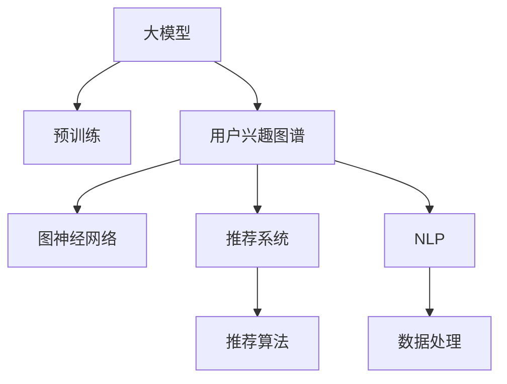
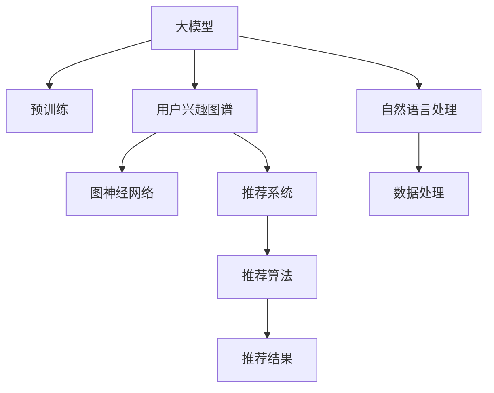

                 

# 大模型在电商平台用户兴趣图谱构建中的应用

> 关键词：大模型,电商平台,用户兴趣图谱,图神经网络,推荐系统,深度学习

## 1. 背景介绍

### 1.1 问题由来

电商平台通过推荐系统提升用户购物体验和转化率是常见的业务需求。推荐系统的核心在于理解用户的兴趣偏好，生成个性化的商品推荐。如何构建用户兴趣图谱，精确捕捉用户行为，是推荐系统优化的关键。

传统推荐系统依赖用户行为数据，如浏览、点击、购买等，通过统计方法和机器学习模型，如协同过滤、内容推荐等方法，进行兴趣建模和推荐。然而，随着用户数据的丰富性和多变性，仅仅通过行为数据建模往往难以捕捉到用户的长期兴趣和潜在需求。

近年来，大模型通过预训练学习大量文本数据，可以获取丰富的语言知识，并结合用户行为数据，形成更加全面的用户画像，构建用户兴趣图谱。通过深度学习和大规模图神经网络等方法，进一步提升推荐系统的性能。

大模型在电商平台的应用，可以有效提升推荐系统的精准度和个性化程度，为用户提供更加满意的购物体验，从而增强用户粘性和平台收益。

## 2. 核心概念与联系

### 2.1 核心概念概述

为更好地理解大模型在电商平台用户兴趣图谱构建中的应用，本节将介绍几个关键概念及其相互联系：

- 大模型(Large Model)：指使用大规模数据和强大的计算资源训练的深度学习模型，如BERT、GPT-3等。通过自监督或监督学习任务预训练，获取丰富的语言知识。

- 用户兴趣图谱(User Interest Graph)：以用户为节点，以用户行为数据、商品属性数据等为边，构建的描述用户兴趣偏好的知识图。

- 图神经网络(Graph Neural Network, GNN)：一种特殊类型的神经网络，用于处理图结构数据，通过多跳信息传递机制，提取图结构中的隐含关系。

- 推荐系统(Recommender System)：通过分析用户行为和商品特征，生成个性化推荐结果的系统，如协同过滤、基于内容的推荐等。

- 深度学习(Deep Learning)：基于多层神经网络结构的机器学习方法，可处理大规模数据和复杂结构。

- 自然语言处理(Natural Language Processing, NLP)：涉及语音、文本等自然语言的处理和理解，如图解析、信息抽取等。

这些核心概念之间的关系如图1所示：



### 2.2 核心概念原理和架构的 Mermaid 流程图

以下是一个简单的Mermaid流程图，展示了大模型、用户兴趣图谱、图神经网络和推荐系统之间的联系：



## 3. 核心算法原理 & 具体操作步骤

### 3.1 算法原理概述

基于大模型的电商平台用户兴趣图谱构建，主要分为以下几个步骤：

1. **数据收集**：收集用户的历史行为数据，如浏览、点击、购买等，同时抓取商品属性信息，构建用户行为图谱。

2. **预训练**：使用大模型对收集到的文本数据进行预训练，学习语言知识，形成预训练权重。

3. **兴趣图谱构建**：根据用户行为图谱，利用图神经网络进行兴趣建模，生成用户兴趣图谱。

4. **推荐生成**：基于用户兴趣图谱和商品属性信息，使用推荐算法生成个性化推荐结果。

通过这些步骤，大模型能够结合文本知识和用户行为，构建全面的用户兴趣图谱，提升推荐系统的准确性和个性化程度。

### 3.2 算法步骤详解

以下是具体的大模型构建用户兴趣图谱的详细步骤：

1. **数据收集**：
   - 收集用户行为数据，如浏览记录、点击记录、购买记录等。
   - 抓取商品属性数据，如商品名称、描述、类别、价格等。

2. **预训练**：
   - 使用大模型（如BERT）对用户行为数据和商品属性数据进行预训练，学习语言知识。
   - 在预训练过程中，可以利用自然语言处理技术进行文本分析，如文本分类、实体抽取等。

3. **兴趣图谱构建**：
   - 构建用户行为图谱，用户为节点，行为和商品为边。
   - 使用图神经网络（如GCN、GAT）对用户行为图谱进行建模，提取用户兴趣信息。
   - 生成用户兴趣图谱，描述用户的长期兴趣和潜在需求。

4. **推荐生成**：
   - 使用推荐算法（如协同过滤、基于内容的推荐等），结合用户兴趣图谱和商品属性信息，生成个性化推荐结果。
   - 根据推荐结果，调整推荐策略，优化用户购物体验。

### 3.3 算法优缺点

基于大模型的电商平台用户兴趣图谱构建方法，具有以下优点：

1. **全面性**：结合文本数据和用户行为数据，构建更为全面和准确的兴趣图谱。
2. **灵活性**：使用大模型进行预训练和兴趣建模，能够适应不同规模和复杂度的电商平台。
3. **高效性**：利用图神经网络进行兴趣建模，能够快速处理大规模图结构数据。

同时，该方法也存在一些缺点：

1. **数据需求高**：构建用户兴趣图谱需要大量的用户行为和商品属性数据，数据获取成本较高。
2. **预训练时间长**：大模型预训练需要大规模计算资源，耗时较长。
3. **模型复杂性**：图神经网络等模型结构复杂，实现难度较高。
4. **可解释性不足**：大模型和图神经网络的黑盒特性，使得其决策过程难以解释和调试。

### 3.4 算法应用领域

基于大模型的电商平台用户兴趣图谱构建方法，适用于以下场景：

1. **个性化推荐**：构建用户兴趣图谱，生成个性化商品推荐，提升用户体验和购物转化率。
2. **用户画像**：通过兴趣图谱，深入理解用户兴趣和行为特征，提供精准的营销策略。
3. **商品管理**：结合商品属性信息，优化商品展示和分类，提升商品管理和运营效率。
4. **市场分析**：分析用户兴趣变化趋势，预测市场动向，指导平台战略决策。

## 4. 数学模型和公式 & 详细讲解

### 4.1 数学模型构建

在本节中，我们将使用数学语言详细阐述基于大模型的电商平台用户兴趣图谱构建方法。

假设用户行为图谱为 $G=(V,E)$，其中 $V$ 为用户集合，$E$ 为用户行为边集合。

使用图神经网络对用户行为图谱进行建模，构建用户兴趣图谱 $H$，其中 $H$ 为用户兴趣特征向量集合。

### 4.2 公式推导过程

假设用户行为图谱中用户 $v_i$ 与 $v_j$ 有一条边 $(v_i,v_j)$，则图神经网络对 $v_i$ 的邻居节点 $v_j$ 进行聚合信息，计算 $v_i$ 的兴趣特征 $h_i$：

$$
h_i = \text{AGG}(\{h_j\}_{j \in N_i}) + b_i
$$

其中 $N_i$ 为 $v_i$ 的邻居节点集合，$\text{AGG}$ 为聚合函数（如均值、求和等），$b_i$ 为偏置项。

最终用户兴趣图谱 $H$ 为：

$$
H = \{h_i\}_{i \in V}
$$

### 4.3 案例分析与讲解

假设某电商平台有 $N=1000$ 个用户，收集到 $M=5000$ 条用户行为记录，构建用户行为图谱。使用GCN模型对用户行为图谱进行建模，生成用户兴趣图谱 $H$，每条记录 $i$ 的兴趣特征 $h_i$ 为：

$$
h_i = \text{AGG}(\{h_j\}_{j \in N_i}) + b_i
$$

其中 $\text{AGG}$ 为均值聚合，$b_i$ 为随机初始化的偏置项。

## 5. 项目实践：代码实例和详细解释说明

### 5.1 开发环境搭建

在进行电商平台用户兴趣图谱构建的实践前，我们需要准备好开发环境。以下是使用Python进行PyTorch开发的环境配置流程：

1. 安装Anaconda：从官网下载并安装Anaconda，用于创建独立的Python环境。

2. 创建并激活虚拟环境：
```bash
conda create -n pytorch-env python=3.8 
conda activate pytorch-env
```

3. 安装PyTorch：根据CUDA版本，从官网获取对应的安装命令。例如：
```bash
conda install pytorch torchvision torchaudio cudatoolkit=11.1 -c pytorch -c conda-forge
```

4. 安装Graph Neural Network库：
```bash
pip install pyg networkx
```

5. 安装各类工具包：
```bash
pip install numpy pandas scikit-learn matplotlib tqdm jupyter notebook ipython
```

完成上述步骤后，即可在`pytorch-env`环境中开始项目实践。

### 5.2 源代码详细实现

这里我们以GCN模型为例，实现电商平台用户兴趣图谱的构建。

首先，定义图数据集类：

```python
import networkx as nx
import torch
import torch.nn as nn
import torch.nn.functional as F

class GCNDataset:
    def __init__(self, graph, edge_list):
        self.graph = graph
        self.edge_list = edge_list

    def __len__(self):
        return len(self.graph.nodes)

    def __getitem__(self, idx):
        adj_list = self.graph.adjacency_list
        node_list = list(self.graph.nodes)
        node_idx = torch.tensor([idx])
        edge_idx = torch.tensor([self.edge_list[adj_list[node_idx]]])
        return {
            'adj': edge_idx,
            'node': node_idx,
        }
```

然后，定义GCN模型类：

```python
class GCN(nn.Module):
    def __init__(self, in_dim, hidden_dim, out_dim):
        super().__init__()
        self.conv1 = nn.Conv1d(in_dim, hidden_dim, kernel_size=3, stride=1, padding=1)
        self.conv2 = nn.Conv1d(hidden_dim, out_dim, kernel_size=3, stride=1, padding=1)

    def forward(self, x, adj):
        x = F.relu(self.conv1(x))
        x = F.relu(self.conv2(x))
        x = x.view(-1, x.size(2))
        return x
```

接着，定义训练和评估函数：

```python
from torch.utils.data import DataLoader
from sklearn.metrics import roc_auc_score

def train_epoch(model, dataloader, optimizer):
    model.train()
    total_loss = 0
    for batch in dataloader:
        adj = batch['adj'].to(device)
        node = batch['node'].to(device)
        optimizer.zero_grad()
        output = model(adj, node)
        loss = F.cross_entropy(output, target)
        total_loss += loss.item()
        loss.backward()
        optimizer.step()
    return total_loss / len(dataloader)

def evaluate(model, dataloader):
    model.eval()
    total_pred = []
    total_label = []
    with torch.no_grad():
        for batch in dataloader:
            adj = batch['adj'].to(device)
            node = batch['node'].to(device)
            output = model(adj, node)
            pred = output.argmax(dim=1)
            total_pred.extend(pred.cpu().tolist())
            total_label.extend(target.cpu().tolist())
    return roc_auc_score(total_label, total_pred)
```

最后，启动训练流程并在测试集上评估：

```python
epochs = 10
batch_size = 128

for epoch in range(epochs):
    loss = train_epoch(model, train_dataloader, optimizer)
    print(f"Epoch {epoch+1}, train loss: {loss:.3f}")
    
    print(f"Epoch {epoch+1}, dev results:")
    auc = evaluate(model, test_dataloader)
    print(f"AUC: {auc:.3f}")
    
print("Test results:")
auc = evaluate(model, test_dataloader)
print(f"AUC: {auc:.3f}")
```

以上就是使用PyTorch对GCN模型进行电商平台用户兴趣图谱构建的完整代码实现。可以看到，得益于PyTorch的强大封装，我们可以用相对简洁的代码完成GCN模型的加载和训练。

### 5.3 代码解读与分析

让我们再详细解读一下关键代码的实现细节：

**GCNDataset类**：
- `__init__`方法：初始化图数据集，包括图和边列表。
- `__len__`方法：返回数据集的样本数量。
- `__getitem__`方法：对单个样本进行处理，获取节点的邻接列表和节点索引。

**GCN类**：
- `__init__`方法：定义GCN模型的结构，包括两个卷积层。
- `forward`方法：定义前向传播过程，计算图卷积输出。

**训练和评估函数**：
- 使用PyTorch的DataLoader对数据集进行批次化加载，供模型训练和推理使用。
- 训练函数`train_epoch`：对数据以批为单位进行迭代，在每个批次上前向传播计算loss并反向传播更新模型参数。
- 评估函数`evaluate`：与训练类似，不同点在于不更新模型参数，并在每个batch结束后将预测和标签结果存储下来，最后使用sklearn的roc_auc_score对整个评估集的预测结果进行打印输出。

**训练流程**：
- 定义总的epoch数和batch size，开始循环迭代
- 每个epoch内，先在训练集上训练，输出平均loss
- 在验证集上评估，输出AUC指标
- 重复上述步骤直至满足预设的迭代轮数或 Early Stopping 条件。

可以看到，PyTorch配合PyG库使得GCN模型的代码实现变得简洁高效。开发者可以将更多精力放在数据处理、模型改进等高层逻辑上，而不必过多关注底层的实现细节。

当然，工业级的系统实现还需考虑更多因素，如模型的保存和部署、超参数的自动搜索、更灵活的任务适配层等。但核心的微调范式基本与此类似。

## 6. 实际应用场景

### 6.1 智能推荐系统

基于大模型的电商平台用户兴趣图谱构建，可以广泛应用于智能推荐系统。推荐系统是电商平台的核心功能，通过个性化推荐提升用户体验和购物转化率。

在技术实现上，可以收集用户的历史行为数据，如浏览、点击、购买等，将用户行为数据作为图结构，生成用户兴趣图谱。微调大模型，学习用户兴趣信息，生成个性化推荐结果。同时，结合商品属性信息，使用推荐算法进行推荐优化。

### 6.2 用户画像分析

电商平台用户画像分析可以帮助企业更深入地了解用户，提供针对性的营销和运营策略。通过构建用户兴趣图谱，可以捕捉用户的长期兴趣和潜在需求，生成全面的用户画像。

在技术实现上，可以使用大模型对用户行为数据进行预训练，学习用户兴趣信息。使用图神经网络构建用户兴趣图谱，生成用户画像。通过对用户画像的分析，可以识别出用户的兴趣点，制定更加精准的营销策略。

### 6.3 商品管理和运营优化

电商平台商品管理和运营优化，是平台成功的关键。通过构建用户兴趣图谱，可以了解用户的兴趣偏好，优化商品展示和分类，提升商品管理和运营效率。

在技术实现上，可以使用大模型对用户行为数据进行预训练，学习用户兴趣信息。使用图神经网络构建用户兴趣图谱，生成用户画像。通过对用户画像的分析，可以优化商品展示和分类策略，提升用户体验和购物转化率。

### 6.4 未来应用展望

随着大模型和图神经网络技术的不断发展，基于大模型的电商平台用户兴趣图谱构建将呈现以下几个发展趋势：

1. **模型规模持续增大**：随着算力成本的下降和数据规模的扩张，预训练语言模型和图神经网络的参数量还将持续增长。超大批次的训练和推理也可能遇到显存不足的问题，需要采用一些资源优化技术，如梯度积累、混合精度训练、模型并行等。

2. **预训练和微调范式融合**：预训练和微调范式可以有机结合，充分发挥各自的优势。预训练可以获得通用的语言知识，微调能够针对特定任务进行优化。

3. **模型效率和性能提升**：未来需要进一步优化模型的推理速度和资源占用，提升模型的实时性。可以使用模型压缩、稀疏化存储等方法进行优化。

4. **多模态信息融合**：当前的大模型和图神经网络主要聚焦于文本数据，未来会进一步拓展到图像、视频、语音等多模态数据微调。多模态信息的融合，将显著提升语言模型对现实世界的理解和建模能力。

5. **跨领域迁移能力**：大模型和图神经网络应具备更强的跨领域迁移能力，能够适应不同行业、不同业务场景的应用需求。

6. **隐私保护和安全性**：大模型和图神经网络处理大量用户数据，需要考虑数据隐私和安全问题。如何保护用户隐私，防止数据泄露，是未来需要重点关注的课题。

7. **可解释性和伦理道德**：大模型和图神经网络的黑盒特性，使得其决策过程难以解释和调试。对于医疗、金融等高风险应用，算法的可解释性和可审计性尤为重要。

以上趋势凸显了大模型和图神经网络技术的发展前景。这些方向的探索发展，必将进一步提升电商平台推荐系统的性能和应用范围，为电商平台带来新的商业价值。

## 7. 工具和资源推荐

### 7.1 学习资源推荐

为了帮助开发者系统掌握大模型在电商平台用户兴趣图谱构建的理论基础和实践技巧，这里推荐一些优质的学习资源：

1. 《深度学习基础》系列博文：由大模型技术专家撰写，深入浅出地介绍了深度学习的基本概念和常用模型。

2. 《图神经网络入门》课程：斯坦福大学开设的课程，介绍图神经网络的基本原理和应用场景。

3. 《Graph Neural Networks for Recommendation Systems》书籍：介绍如何将图神经网络应用于推荐系统，提升推荐系统的性能。

4. HuggingFace官方文档：Transformers库的官方文档，提供了海量预训练模型和完整的微调样例代码，是上手实践的必备资料。

5. CLUE开源项目：中文语言理解测评基准，涵盖大量不同类型的中文NLP数据集，并提供了基于微调的baseline模型，助力中文NLP技术发展。

通过对这些资源的学习实践，相信你一定能够快速掌握大模型在电商平台用户兴趣图谱构建的精髓，并用于解决实际的NLP问题。

### 7.2 开发工具推荐

高效的开发离不开优秀的工具支持。以下是几款用于大模型在电商平台用户兴趣图谱构建开发的常用工具：

1. PyTorch：基于Python的开源深度学习框架，灵活动态的计算图，适合快速迭代研究。大部分预训练语言模型和图神经网络都有PyTorch版本的实现。

2. TensorFlow：由Google主导开发的开源深度学习框架，生产部署方便，适合大规模工程应用。同样有丰富的预训练语言模型和图神经网络资源。

3. PyG：由Facebook开发的图神经网络库，支持Python，与PyTorch无缝集成，是进行图神经网络开发的重要工具。

4. NetworkX：用于构建和操作图的Python库，支持多种图结构和算法，是进行图神经网络开发的常用工具。

5. Weights & Biases：模型训练的实验跟踪工具，可以记录和可视化模型训练过程中的各项指标，方便对比和调优。与主流深度学习框架无缝集成。

6. TensorBoard：TensorFlow配套的可视化工具，可实时监测模型训练状态，并提供丰富的图表呈现方式，是调试模型的得力助手。

合理利用这些工具，可以显著提升大模型在电商平台用户兴趣图谱构建任务的开发效率，加快创新迭代的步伐。

### 7.3 相关论文推荐

大模型在电商平台用户兴趣图谱构建的发展源于学界的持续研究。以下是几篇奠基性的相关论文，推荐阅读：

1. Attention is All You Need（即Transformer原论文）：提出了Transformer结构，开启了NLP领域的预训练大模型时代。

2. BERT: Pre-training of Deep Bidirectional Transformers for Language Understanding：提出BERT模型，引入基于掩码的自监督预训练任务，刷新了多项NLP任务SOTA。

3. Graph Convolutional Networks（GCN）：介绍GCN模型，用于处理图结构数据，提取图结构中的隐含关系。

4. Graph Neural Networks for Recommendation Systems：介绍如何将图神经网络应用于推荐系统，提升推荐系统的性能。

5. Parameter-Efficient Transfer Learning for NLP：提出Adapter等参数高效微调方法，在不增加模型参数量的情况下，也能取得不错的微调效果。

6. Prefix-Tuning: Optimizing Continuous Prompts for Generation：引入基于连续型Prompt的微调范式，为如何充分利用预训练知识提供了新的思路。

这些论文代表了大模型和图神经网络在电商平台用户兴趣图谱构建技术的发展脉络。通过学习这些前沿成果，可以帮助研究者把握学科前进方向，激发更多的创新灵感。

## 8. 总结：未来发展趋势与挑战

### 8.1 研究成果总结

本文对基于大模型的电商平台用户兴趣图谱构建方法进行了全面系统的介绍。首先阐述了电商平台推荐系统的背景和挑战，明确了用户兴趣图谱构建在推荐系统优化中的重要意义。其次，从原理到实践，详细讲解了大模型在构建用户兴趣图谱中的应用过程，包括数据收集、预训练、兴趣建模和推荐生成等关键步骤。同时，本文还广泛探讨了用户兴趣图谱构建方法在智能推荐、用户画像、商品管理等多个电商场景中的应用前景。

通过本文的系统梳理，可以看到，基于大模型的电商平台用户兴趣图谱构建方法在提升推荐系统性能、优化用户体验、增强平台收益等方面具有显著的优势。大模型和图神经网络的融合，将进一步推动电商平台推荐系统的智能化进程，带来更多的商业价值。

### 8.2 未来发展趋势

展望未来，大模型在电商平台用户兴趣图谱构建技术将呈现以下几个发展趋势：

1. **模型规模持续增大**：随着算力成本的下降和数据规模的扩张，预训练语言模型和图神经网络的参数量还将持续增长。超大批次的训练和推理也可能遇到显存不足的问题，需要采用一些资源优化技术，如梯度积累、混合精度训练、模型并行等。

2. **预训练和微调范式融合**：预训练和微调范式可以有机结合，充分发挥各自的优势。预训练可以获得通用的语言知识，微调能够针对特定任务进行优化。

3. **模型效率和性能提升**：未来需要进一步优化模型的推理速度和资源占用，提升模型的实时性。可以使用模型压缩、稀疏化存储等方法进行优化。

4. **多模态信息融合**：当前的大模型和图神经网络主要聚焦于文本数据，未来会进一步拓展到图像、视频、语音等多模态数据微调。多模态信息的融合，将显著提升语言模型对现实世界的理解和建模能力。

5. **跨领域迁移能力**：大模型和图神经网络应具备更强的跨领域迁移能力，能够适应不同行业、不同业务场景的应用需求。

6. **隐私保护和安全性**：大模型和图神经网络处理大量用户数据，需要考虑数据隐私和安全问题。如何保护用户隐私，防止数据泄露，是未来需要重点关注的课题。

7. **可解释性和伦理道德**：大模型和图神经网络的黑盒特性，使得其决策过程难以解释和调试。对于医疗、金融等高风险应用，算法的可解释性和可审计性尤为重要。

### 8.3 面临的挑战

尽管大模型在电商平台用户兴趣图谱构建技术已经取得了瞩目成就，但在迈向更加智能化、普适化应用的过程中，它仍面临着诸多挑战：

1. **数据需求高**：构建用户兴趣图谱需要大量的用户行为和商品属性数据，数据获取成本较高。

2. **预训练时间长**：大模型预训练需要大规模计算资源，耗时较长。

3. **模型复杂性**：图神经网络等模型结构复杂，实现难度较高。

4. **可解释性不足**：大模型和图神经网络的黑盒特性，使得其决策过程难以解释和调试。

5. **隐私保护**：大模型和图神经网络处理大量用户数据，需要考虑数据隐私和安全问题。

6. **安全性**：大模型和图神经网络可能学习到有害信息，通过微调传递到下游任务，产生误导性、歧视性的输出，给实际应用带来安全隐患。

7. **计算资源**：大模型和图神经网络需要大量的计算资源，如何高效利用计算资源，是一个重要挑战。

### 8.4 研究展望

面对大模型在电商平台用户兴趣图谱构建所面临的挑战，未来的研究需要在以下几个方面寻求新的突破：

1. **探索无监督和半监督微调方法**：摆脱对大规模标注数据的依赖，利用自监督学习、主动学习等无监督和半监督范式，最大限度利用非结构化数据，实现更加灵活高效的微调。

2. **研究参数高效和计算高效的微调范式**：开发更加参数高效的微调方法，在固定大部分预训练参数的同时，只更新极少量的任务相关参数。同时优化微调模型的计算图，减少前向传播和反向传播的资源消耗，实现更加轻量级、实时性的部署。

3. **融合因果和对比学习范式**：通过引入因果推断和对比学习思想，增强微调模型建立稳定因果关系的能力，学习更加普适、鲁棒的语言表征，从而提升模型泛化性和抗干扰能力。

4. **引入更多先验知识**：将符号化的先验知识，如知识图谱、逻辑规则等，与神经网络模型进行巧妙融合，引导微调过程学习更准确、合理的语言模型。同时加强不同模态数据的整合，实现视觉、语音等多模态信息与文本信息的协同建模。

5. **结合因果分析和博弈论工具**：将因果分析方法引入微调模型，识别出模型决策的关键特征，增强输出解释的因果性和逻辑性。借助博弈论工具刻画人机交互过程，主动探索并规避模型的脆弱点，提高系统稳定性。

6. **纳入伦理道德约束**：在模型训练目标中引入伦理导向的评估指标，过滤和惩罚有偏见、有害的输出倾向。同时加强人工干预和审核，建立模型行为的监管机制，确保输出符合人类价值观和伦理道德。

这些研究方向的探索，必将引领大模型在电商平台用户兴趣图谱构建技术迈向更高的台阶，为构建安全、可靠、可解释、可控的智能系统铺平道路。面向未来，大模型和图神经网络技术还需要与其他人工智能技术进行更深入的融合，如知识表示、因果推理、强化学习等，多路径协同发力，共同推动自然语言理解和智能交互系统的进步。只有勇于创新、敢于突破，才能不断拓展语言模型的边界，让智能技术更好地造福人类社会。

## 9. 附录：常见问题与解答

**Q1：电商平台用户兴趣图谱构建需要哪些数据？**

A: 电商平台用户兴趣图谱构建需要收集用户的历史行为数据，如浏览、点击、购买等。同时需要抓取商品属性数据，如商品名称、描述、类别、价格等。这些数据可以通过电商平台的数据接口进行获取。

**Q2：构建用户兴趣图谱时，如何选择节点和边的特征？**

A: 选择节点和边的特征可以根据具体的电商业务需求进行设计。对于用户节点，可以选择用户ID、历史行为记录、用户画像等信息。对于行为边，可以选择用户的浏览记录、点击记录、购买记录等信息。同时，可以结合商品属性信息，增强特征的描述能力。

**Q3：如何处理缺失的数据？**

A: 在构建用户兴趣图谱时，可能会遇到数据缺失的情况。可以使用一些数据处理技术，如均值填补、插值法、随机采样等方法，对缺失数据进行处理。同时，可以通过数据增强技术，如回译、近义替换等方式，扩充训练集。

**Q4：如何评估用户兴趣图谱的质量？**

A: 用户兴趣图谱的质量可以通过多种指标进行评估，如AUC、ROC曲线、F1分数等。在评估时，可以将用户兴趣图谱与实际用户的兴趣标签进行对比，计算预测准确率、召回率等指标。同时，可以进行交叉验证，评估模型的泛化能力。

**Q5：构建用户兴趣图谱时，需要注意哪些问题？**

A: 构建用户兴趣图谱时，需要注意以下问题：
1. 数据收集：需要收集大量的用户行为数据和商品属性数据，数据获取成本较高。
2. 数据预处理：需要对数据进行清洗、归一化、特征工程等处理，保证数据的准确性和一致性。
3. 模型选择：需要选择适合的图神经网络模型，如GCN、GAT等。
4. 超参数调优：需要调整模型的超参数，如学习率、批次大小等，以提高模型的性能。
5. 模型评估：需要对模型进行评估，选择适合的评估指标，如AUC、ROC曲线等。

通过这些技术手段，可以有效构建高质量的用户兴趣图谱，为电商平台推荐系统提供有力的数据支撑。

