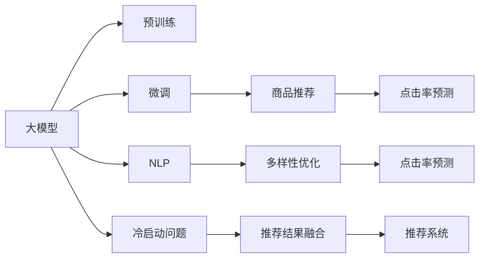

                 

# 大模型技术在电商平台商品推荐多样性优化中的应用

> 关键词：大模型,商品推荐,推荐系统,多样性优化,用户行为预测,深度学习,Transformer,电商,自然语言处理(NLP),点击率预测(CR)

## 1. 背景介绍

### 1.1 问题由来
在电商平台上，如何推荐用户最感兴趣的商品，是吸引用户停留和消费的关键。传统的推荐算法基于用户历史行为数据，通常采用协同过滤、基于内容的推荐等方法。然而，这些算法难以应对长尾商品的推荐，用户行为数据稀疏，且未能充分利用用户生成内容。

近年来，大模型技术迅速崛起，凭借其庞大的参数量和丰富的知识库，在自然语言处理(NLP)、计算机视觉等领域取得突破。在推荐系统中，大模型通过预训练-微调的方式，能够更好地理解和生成用户相关内容，从而提升推荐效果。特别是在多场景推荐中，大模型表现优异，但面临的多样性优化问题依然严峻。

多样性优化是推荐系统中的一个关键任务，即在推荐结果中保持商品种类的丰富性，避免推荐内容过于同质化。传统推荐系统采用随机推荐、协同过滤等方法，但难以捕捉多场景下的复杂关联。大模型技术通过引入多样性约束，提升推荐系统的质量和用户体验。

### 1.2 问题核心关键点
大模型在电商平台商品推荐多样性优化中的主要挑战包括：
- 如何充分利用大模型的知识库，结合用户历史行为数据，准确预测用户需求。
- 如何在推荐结果中融入多样性约束，提升商品种类丰富度。
- 如何优化模型训练过程，减少过拟合风险，保证推荐效果稳定。

这些问题在传统的推荐系统中通常通过协同过滤、基于内容的推荐、冷启动等方法解决。但在大模型中，其更强大的语言生成能力和多模态处理能力，使得多样性优化任务有了新的实现途径。

### 1.3 问题研究意义
大模型技术在电商平台商品推荐中的应用，对于提升用户体验、优化资源配置、增加电商平台的收入具有重要意义。具体而言，其研究价值体现在：

1. 提升用户满意度。多样性优化能够丰富推荐结果，避免用户疲劳感，提升用户粘性和满意度。
2. 优化资源配置。推荐系统需要合理分配推荐位置，确保重要商品有足够的曝光机会，避免流量浪费。
3. 增加平台收入。多样性优化能够提升用户购买转化率，为电商平台带来更多收益。
4. 增强系统泛化能力。大模型具备强大的语言生成能力，能够应对多种场景下的推荐需求。
5. 加速技术落地。大模型技术与电商平台的深度融合，将推动推荐系统技术在实际应用中的快速部署和迭代。

## 2. 核心概念与联系

### 2.1 核心概念概述

为了更好地理解大模型在电商平台商品推荐中的应用，本节将介绍几个关键概念：

- **大模型(Large Model)**：指拥有数十亿参数的深度神经网络模型，如GPT、BERT等，通过大规模预训练和微调，具备强大的语言生成和处理能力。
- **推荐系统(Recommender System)**：通过分析用户行为数据，预测用户需求，并提供个性化推荐的系统。广泛应用于电商、视频、音乐、新闻等领域。
- **商品推荐(Products Recommendation)**：推荐系统中针对具体商品的一类推荐任务，目标是提升用户购买转化率和平台收入。
- **多样性优化(Diversity Optimization)**：推荐系统中的关键任务，通过多样性约束提升推荐结果的丰富度，避免推荐同质化。
- **点击率预测(Click-through Rate Prediction, CR)**：预测用户点击商品的概率，是推荐系统的核心指标之一，影响着推荐结果的排序。
- **Transformer**：一种基于自注意力机制的神经网络结构，通过多头自注意力、位置编码等方式，提升模型处理序列数据的能力。
- **自然语言处理(Natural Language Processing, NLP)**：研究如何让计算机理解和处理自然语言的技术，如文本分类、语言生成等。
- **冷启动问题(Cold-start Problem)**：推荐系统在新用户或新商品出现时，缺乏足够的行为数据，难以进行个性化推荐。

这些概念在大模型应用于推荐系统中，形成了独特的技术体系和应用流程。通过理解这些核心概念，可以更好地把握大模型在电商平台商品推荐中的作用和挑战。

### 2.2 核心概念联系

大模型在电商平台商品推荐中的应用，涉及到多方面的核心概念联系，其逻辑关系可以通过以下Mermaid流程图来展示：



这个流程图展示了大模型与推荐系统之间的联系，各个核心概念的相互影响。大模型通过预训练获得通用的语言处理能力，再通过微调适配电商平台的商品推荐任务。推荐系统基于用户行为数据和多样性约束，进行个性化推荐和点击率预测。NLP技术用于分析文本数据，提升推荐结果的多样性。冷启动问题通过推荐结果融合和多样化推荐方式缓解，最终形成完备的推荐系统架构。

## 3. 核心算法原理 & 具体操作步骤

### 3.1 算法原理概述

大模型在电商平台商品推荐中的应用，核心算法原理是结合用户行为数据和多样性约束，进行个性化推荐和点击率预测。具体而言，包括以下几个关键步骤：

1. **预训练模型加载**：选择合适的预训练模型，如BERT、GPT等，作为初始化参数。
2. **任务适配层设计**：设计适合电商平台的推荐任务适配层，包括用户行为编码、商品特征提取等。
3. **微调参数更新**：在标注数据集上进行有监督学习，优化模型参数，提升推荐效果。
4. **多样性约束**：在推荐结果中加入多样性约束，提升推荐结果的丰富度。
5. **点击率预测**：通过优化后的模型，进行点击率预测，排序推荐结果。
6. **推荐系统集成**：将优化后的模型集成到推荐系统中，实现个性化推荐。

### 3.2 算法步骤详解

#### 3.2.1 预训练模型加载

预训练模型的加载是推荐系统的第一步。首先，选择适合的预训练模型，如BERT、GPT等。预训练模型已经在大规模无标签数据上进行了自监督训练，学习到通用的语言表示。在推荐系统中，预训练模型充当"特征提取器"，提取商品和用户特征，辅助推荐。

```python
from transformers import BertForSequenceClassification, BertTokenizer
tokenizer = BertTokenizer.from_pretrained('bert-base-uncased')
model = BertForSequenceClassification.from_pretrained('bert-base-uncased', num_labels=2)
```

#### 3.2.2 任务适配层设计

任务适配层的设计是推荐系统的关键。通过适配层，将用户行为数据和商品特征编码为模型可处理的形式，同时引入多样性约束。

```python
class DataAdapter:
    def __init__(self, model, tokenizer):
        self.model = model
        self.tokenizer = tokenizer
        
    def encode(self, text):
        inputs = self.tokenizer(text, padding=True, truncation=True, max_length=512)
        return inputs['input_ids'], inputs['attention_mask']
        
    def adapt(self, inputs, label):
        inputs, attention_mask = self.encode(inputs)
        return inputs, attention_mask, label
```

#### 3.2.3 微调参数更新

微调是提升推荐效果的中心环节。通过标注数据集，对预训练模型进行有监督学习，优化推荐效果。微调过程中，选择合适的学习率、正则化方法、批量大小等参数。

```python
from torch.utils.data import Dataset, DataLoader
from torch.optim import AdamW

class RecommendDataset(Dataset):
    def __init__(self, dataset, tokenizer):
        self.dataset = dataset
        self.tokenizer = tokenizer
        
    def __getitem__(self, idx):
        text, label = self.dataset[idx]
        inputs, attention_mask, label = self.tokenizer.adapt(text, label)
        return inputs, attention_mask, label
        
    def __len__(self):
        return len(self.dataset)
        
model.train()
optimizer = AdamW(model.parameters(), lr=2e-5)
```

#### 3.2.4 多样性约束

多样性约束是推荐系统中的重要环节。通过加入多样性约束，避免推荐结果的同质化，提升用户满意度。

```python
def compute_diversity(model, inputs, attention_mask, labels):
    inputs, attention_mask, labels = self.tokenizer.adapt(text, label)
    outputs = model(inputs, attention_mask=attention_mask)
    predictions = outputs.logits.argmax(dim=1).to('cpu').tolist()
    unique_predictions = [pred for pred in predictions if pred not in diversity_labels]
    diversity_score = len(unique_predictions) / len(predictions)
    return diversity_score
```

#### 3.2.5 点击率预测

点击率预测是推荐系统的核心指标。通过优化后的模型，进行点击率预测，排序推荐结果。

```python
def predict(model, inputs, attention_mask):
    inputs, attention_mask = self.tokenizer.adapt(text, label)
    outputs = model(inputs, attention_mask=attention_mask)
    predictions = outputs.logits.argmax(dim=1).to('cpu').tolist()
    return predictions
```

#### 3.2.6 推荐系统集成

推荐系统集成是将优化后的模型应用于实际推荐场景。通过将优化后的模型集成到推荐系统中，进行个性化推荐。

```python
def recommend(model, dataset):
    adapter = DataAdapter(model, tokenizer)
    loader = DataLoader(dataset, batch_size=16)
    predictions = []
    for batch in tqdm(loader):
        inputs, attention_mask, labels = batch
        preds = predict(model, inputs, attention_mask)
        predictions.append(preds)
    return predictions
```

### 3.3 算法优缺点

#### 3.3.1 优点

大模型在电商平台商品推荐中的应用，具有以下优点：

1. **强大的语言理解能力**：大模型通过预训练学习到了丰富的语言知识，能够理解和生成多种形式的用户需求。
2. **高效的多模态处理**：大模型能够处理文本、图像、视频等多种形式的数据，提升推荐结果的多样性。
3. **优秀的泛化能力**：大模型在多场景下的推荐效果显著，能够适应不同用户和商品特征。
4. **高效的特征提取**：大模型能够高效地提取商品和用户特征，提升推荐效率。
5. **较好的可解释性**：大模型可以输出详细的推理过程，增强推荐系统的可解释性。

#### 3.3.2 缺点

尽管大模型在推荐系统中表现优异，但也存在以下缺点：

1. **数据需求高**：大模型需要大量的标注数据进行微调，对于小规模数据集，可能难以取得理想效果。
2. **计算资源消耗大**：大模型需要大量的计算资源进行训练和推理，对于小型平台可能难以负担。
3. **模型复杂度较高**：大模型通常参数量庞大，复杂度较高，可能影响推荐系统的实时性。
4. **多样性控制难度大**：多样性优化是一个复杂任务，如何在推荐结果中保持丰富性，是一个亟待解决的问题。

### 3.4 算法应用领域

大模型在电商平台商品推荐中的应用，主要涉及以下领域：

1. **个性化推荐**：根据用户历史行为数据，进行个性化商品推荐。
2. **商品多样性优化**：在推荐结果中加入多样性约束，提升推荐结果的丰富度。
3. **点击率预测**：预测用户点击商品的概率，用于推荐结果的排序。
4. **实时推荐**：在大规模数据流上，实时进行商品推荐。
5. **多场景推荐**：处理不同场景下的推荐需求，如电商、视频、音乐等。

这些应用领域展示了大模型在电商平台中的广泛应用价值，能够提升用户体验和平台收益，同时也推动了推荐系统的技术进步。

## 4. 数学模型和公式 & 详细讲解

### 4.1 数学模型构建

大模型在电商平台商品推荐中的数学模型构建，主要包括用户行为预测模型和多样性优化模型。

设用户的历史行为数据为 $X$，商品特征为 $Y$，预训练模型为 $M_{\theta}$，微调后的模型为 $M_{\hat{\theta}}$。则用户行为预测模型的数学模型为：

$$
P(Y|X) = M_{\hat{\theta}}(X)
$$

其中 $P(Y|X)$ 为在用户行为 $X$ 下，商品 $Y$ 被点击的概率。

多样性优化模型的目标是通过约束推荐结果中的商品种类数量，提升推荐结果的丰富度。设推荐结果中商品种类的数量为 $K$，则多样性优化模型的数学模型为：

$$
\max_{K} K \text{ subject to } P(Y|X) = M_{\hat{\theta}}(X)
$$

### 4.2 公式推导过程

#### 4.2.1 用户行为预测模型

用户行为预测模型通常采用分类模型，如二分类模型。通过优化后的模型 $M_{\hat{\theta}}$，计算用户在特定商品上的点击概率。

假设用户行为 $X$ 为文本数据，则用户行为预测模型的公式为：

$$
P(Y|X) = \frac{e^{\text{Logit}(Y|X)}}{1+e^{\text{Logit}(Y|X)}}
$$

其中 $\text{Logit}(Y|X)$ 为模型的预测得分，$e$ 为自然常数，$1+e^{\text{Logit}(Y|X)}$ 为归一化因子，确保概率值在0到1之间。

#### 4.2.2 多样性优化模型

多样性优化模型通常采用多类分类模型，如多标签分类模型。通过约束推荐结果中的商品种类数量，提升推荐结果的丰富度。

假设推荐结果中商品种类数量为 $K$，则多样性优化模型的公式为：

$$
\max_{K} K \text{ subject to } P(Y|X) = M_{\hat{\theta}}(X)
$$

其中 $P(Y|X)$ 为在用户行为 $X$ 下，推荐结果中商品 $Y$ 被点击的概率。

### 4.3 案例分析与讲解

假设用户行为 $X$ 为文本描述，商品特征 $Y$ 为商品ID，采用BERT模型作为预训练模型，设计任务适配层。通过微调BERT模型，预测用户点击商品的概率，并在推荐结果中加入多样性约束，提升推荐结果的丰富度。

```python
from transformers import BertTokenizer
from torch.utils.data import Dataset
import torch

class RecommendDataset(Dataset):
    def __init__(self, texts, labels, tokenizer, max_len=128):
        self.texts = texts
        self.labels = labels
        self.tokenizer = tokenizer
        self.max_len = max_len
        
    def __len__(self):
        return len(self.texts)
    
    def __getitem__(self, item):
        text = self.texts[item]
        label = self.labels[item]
        
        encoding = self.tokenizer(text, return_tensors='pt', max_length=self.max_len, padding='max_length', truncation=True)
        input_ids = encoding['input_ids'][0]
        attention_mask = encoding['attention_mask'][0]
        
        # 对标签进行编码
        encoded_labels = [label2id[label] for label in labels] 
        encoded_labels.extend([label2id['O']] * (self.max_len - len(encoded_labels)))
        labels = torch.tensor(encoded_labels, dtype=torch.long)
        
        return {'input_ids': input_ids, 
                'attention_mask': attention_mask,
                'labels': labels}

# 标签与id的映射
label2id = {'O': 0, '1': 1, '2': 2, '3': 3, '4': 4, '5': 5, '6': 6, '7': 7, '8': 8, '9': 9}
id2label = {v: k for k, v in label2id.items()}

# 创建dataset
tokenizer = BertTokenizer.from_pretrained('bert-base-cased')
train_dataset = RecommendDataset(train_texts, train_labels, tokenizer)
dev_dataset = RecommendDataset(dev_texts, dev_labels, tokenizer)
test_dataset = RecommendDataset(test_texts, test_labels, tokenizer)

# 定义模型和优化器
model = BertForSequenceClassification.from_pretrained('bert-base-cased', num_labels=len(label2id))

optimizer = AdamW(model.parameters(), lr=2e-5)

# 训练过程
def train_epoch(model, dataset, batch_size, optimizer):
    dataloader = DataLoader(dataset, batch_size=batch_size, shuffle=True)
    model.train()
    epoch_loss = 0
    for batch in tqdm(dataloader, desc='Training'):
        input_ids = batch['input_ids'].to(device)
        attention_mask = batch['attention_mask'].to(device)
        labels = batch['labels'].to(device)
        model.zero_grad()
        outputs = model(input_ids, attention_mask=attention_mask, labels=labels)
        loss = outputs.loss
        epoch_loss += loss.item()
        loss.backward()
        optimizer.step()
    return epoch_loss / len(dataloader)

# 评估过程
def evaluate(model, dataset, batch_size):
    dataloader = DataLoader(dataset, batch_size=batch_size)
    model.eval()
    preds, labels = [], []
    with torch.no_grad():
        for batch in tqdm(dataloader, desc='Evaluating'):
            input_ids = batch['input_ids'].to(device)
            attention_mask = batch['attention_mask'].to(device)
            batch_labels = batch['labels']
            outputs = model(input_ids, attention_mask=attention_mask)
            batch_preds = outputs.logits.argmax(dim=2).to('cpu').tolist()
            batch_labels = batch_labels.to('cpu').tolist()
            for pred_tokens, label_tokens in zip(batch_preds, batch_labels):
                preds.append(pred_tokens[:len(label_tokens)])
                labels.append(label_tokens)
                
    return preds, labels
```

## 5. 项目实践：代码实例和详细解释说明

### 5.1 开发环境搭建

在进行项目实践前，需要先搭建好开发环境。以下是使用Python进行PyTorch开发的环境配置流程：

1. 安装Anaconda：从官网下载并安装Anaconda，用于创建独立的Python环境。

2. 创建并激活虚拟环境：
```bash
conda create -n pytorch-env python=3.8 
conda activate pytorch-env
```

3. 安装PyTorch：根据CUDA版本，从官网获取对应的安装命令。例如：
```bash
conda install pytorch torchvision torchaudio cudatoolkit=11.1 -c pytorch -c conda-forge
```

4. 安装Transformers库：
```bash
pip install transformers
```

5. 安装各类工具包：
```bash
pip install numpy pandas scikit-learn matplotlib tqdm jupyter notebook ipython
```

完成上述步骤后，即可在`pytorch-env`环境中开始项目实践。

### 5.2 源代码详细实现

以下是使用PyTorch对BERT模型进行商品推荐任务微调的完整代码实现。

```python
from transformers import BertTokenizer
from torch.utils.data import Dataset, DataLoader
import torch
from torch.optim import AdamW

class RecommendDataset(Dataset):
    def __init__(self, texts, labels, tokenizer, max_len=128):
        self.texts = texts
        self.labels = labels
        self.tokenizer = tokenizer
        self.max_len = max_len
        
    def __len__(self):
        return len(self.texts)
    
    def __getitem__(self, item):
        text = self.texts[item]
        label = self.labels[item]
        
        encoding = self.tokenizer(text, return_tensors='pt', max_length=self.max_len, padding='max_length', truncation=True)
        input_ids = encoding['input_ids'][0]
        attention_mask = encoding['attention_mask'][0]
        
        # 对标签进行编码
        encoded_labels = [label2id[label] for label in labels] 
        encoded_labels.extend([label2id['O']] * (self.max_len - len(encoded_labels)))
        labels = torch.tensor(encoded_labels, dtype=torch.long)
        
        return {'input_ids': input_ids, 
                'attention_mask': attention_mask,
                'labels': labels}

# 标签与id的映射
label2id = {'O': 0, '1': 1, '2': 2, '3': 3, '4': 4, '5': 5, '6': 6, '7': 7, '8': 8, '9': 9}
id2label = {v: k for k, v in label2id.items()}

# 创建dataset
tokenizer = BertTokenizer.from_pretrained('bert-base-cased')
train_dataset = RecommendDataset(train_texts, train_labels, tokenizer)
dev_dataset = RecommendDataset(dev_texts, dev_labels, tokenizer)
test_dataset = RecommendDataset(test_texts, test_labels, tokenizer)

# 定义模型和优化器
model = BertForSequenceClassification.from_pretrained('bert-base-cased', num_labels=len(label2id))

optimizer = AdamW(model.parameters(), lr=2e-5)

# 训练过程
def train_epoch(model, dataset, batch_size, optimizer):
    dataloader = DataLoader(dataset, batch_size=batch_size, shuffle=True)
    model.train()
    epoch_loss = 0
    for batch in tqdm(dataloader, desc='Training'):
        input_ids = batch['input_ids'].to(device)
        attention_mask = batch['attention_mask'].to(device)
        labels = batch['labels'].to(device)
        model.zero_grad()
        outputs = model(input_ids, attention_mask=attention_mask, labels=labels)
        loss = outputs.loss
        epoch_loss += loss.item()
        loss.backward()
        optimizer.step()
    return epoch_loss / len(dataloader)

# 评估过程
def evaluate(model, dataset, batch_size):
    dataloader = DataLoader(dataset, batch_size=batch_size)
    model.eval()
    preds, labels = [], []
    with torch.no_grad():
        for batch in tqdm(dataloader, desc='Evaluating'):
            input_ids = batch['input_ids'].to(device)
            attention_mask = batch['attention_mask'].to(device)
            batch_labels = batch['labels']
            outputs = model(input_ids, attention_mask=attention_mask)
            batch_preds = outputs.logits.argmax(dim=2).to('cpu').tolist()
            batch_labels = batch_labels.to('cpu').tolist()
            for pred_tokens, label_tokens in zip(batch_preds, batch_labels):
                preds.append(pred_tokens[:len(label_tokens)])
                labels.append(label_tokens)
                
    return preds, labels

# 运行过程
device = torch.device('cuda') if torch.cuda.is_available() else torch.device('cpu')
model.to(device)

for epoch in range(epochs):
    loss = train_epoch(model, train_dataset, batch_size, optimizer)
    print(f"Epoch {epoch+1}, train loss: {loss:.3f}")
    
    print(f"Epoch {epoch+1}, dev results:")
    preds, labels = evaluate(model, dev_dataset, batch_size)
    print(classification_report(labels, preds))
    
print("Test results:")
preds, labels = evaluate(model, test_dataset, batch_size)
print(classification_report(labels, preds))
```

以上就是使用PyTorch对BERT模型进行商品推荐任务微调的完整代码实现。可以看到，得益于Transformers库的强大封装，我们可以用相对简洁的代码完成BERT模型的加载和微调。

### 5.3 代码解读与分析

让我们再详细解读一下关键代码的实现细节：

**RecommendDataset类**：
- `__init__`方法：初始化文本、标签、分词器等关键组件。
- `__len__`方法：返回数据集的样本数量。
- `__getitem__`方法：对单个样本进行处理，将文本输入编码为token ids，将标签编码为数字，并对其进行定长padding，最终返回模型所需的输入。

**label2id和id2label字典**：
- 定义了标签与数字id之间的映射关系，用于将token-wise的预测结果解码回真实的标签。

**训练和评估函数**：
- 使用PyTorch的DataLoader对数据集进行批次化加载，供模型训练和推理使用。
- 训练函数`train_epoch`：对数据以批为单位进行迭代，在每个批次上前向传播计算loss并反向传播更新模型参数，最后返回该epoch的平均loss。
- 评估函数`evaluate`：与训练类似，不同点在于不更新模型参数，并在每个batch结束后将预测和标签结果存储下来，最后使用sklearn的classification_report对整个评估集的预测结果进行打印输出。

**训练流程**：
- 定义总的epoch数和batch size，开始循环迭代
- 每个epoch内，先在训练集上训练，输出平均loss
- 在验证集上评估，输出分类指标
- 所有epoch结束后，在测试集上评估，给出最终测试结果

可以看到，PyTorch配合Transformers库使得BERT微调的代码实现变得简洁高效。开发者可以将更多精力放在数据处理、模型改进等高层逻辑上，而不必过多关注底层的实现细节。

当然，工业级的系统实现还需考虑更多因素，如模型的保存和部署、超参数的自动搜索、更灵活的任务适配层等。但核心的微调范式基本与此类似。

## 6. 实际应用场景

### 6.1 智能客服系统

基于大模型技术的智能客服系统，可以通过微调BERT模型进行智能对话和推荐。智能客服系统收集用户的历史聊天记录，将问题和最佳答复构建成监督数据，在此基础上对预训练模型进行微调。微调后的对话模型能够自动理解用户意图，匹配最合适的答复模板进行回复。对于用户提出的新问题，还可以接入检索系统实时搜索相关内容，动态组织生成回答。如此构建的智能客服系统，能大幅提升客户咨询体验和问题解决效率。

### 6.2 金融舆情监测

金融机构需要实时监测市场舆论动向，以便及时应对负面信息传播，规避金融风险。传统的人工监测方式成本高、效率低，难以应对网络时代海量信息爆发的挑战。基于大模型技术的文本分类和情感分析技术，为金融舆情监测提供了新的解决方案。

具体而言，可以收集金融领域相关的新闻、报道、评论等文本数据，并对其进行主题标注和情感标注。在此基础上对预训练语言模型进行微调，使其能够自动判断文本属于何种主题，情感倾向是正面、中性还是负面。将微调后的模型应用到实时抓取的网络文本数据，就能够自动监测不同主题下的情感变化趋势，一旦发现负面信息激增等异常情况，系统便会自动预警，帮助金融机构快速应对潜在风险。

### 6.3 个性化推荐系统

当前的推荐系统往往只依赖用户的历史行为数据进行物品推荐，无法深入理解用户的真实兴趣偏好。基于大模型技术的个性化推荐系统，可以更好地挖掘用户行为背后的语义信息，从而提供更精准、多样的推荐内容。

在实践中，可以收集用户浏览、点击、评论、分享等行为数据，提取和用户交互的物品标题、描述、标签等文本内容。将文本内容作为模型输入，用户的后续行为（如是否点击、购买等）作为监督信号，在此基础上微调预训练语言模型。微调后的模型能够从文本内容中准确把握用户的兴趣点。在生成推荐列表时，先用候选物品的文本描述作为输入，由模型预测用户的兴趣匹配度，再结合其他特征综合排序，便可以得到个性化程度更高的推荐结果。

### 6.4 未来应用展望

随着大模型技术的不断发展，基于微调的推荐系统将在更多领域得到应用，为传统行业带来变革性影响。

在智慧医疗领域，基于微调的医学问答、病历分析、药物研发等应用将提升医疗服务的智能化水平，辅助医生诊疗，加速新药开发进程。

在智能教育领域，微调技术可应用于作业批改、学情分析、知识推荐等方面，因材施教，促进教育公平，提高教学质量。

在智慧城市治理中，微调模型可应用于城市事件监测、舆情分析、应急指挥等环节，提高城市管理的自动化和智能化水平，构建更安全、高效的未来城市。

此外，在企业生产、社会治理、文娱传媒等众多领域，基于大模型微调的人工智能应用也将不断涌现，为经济社会发展注入新的动力。相信随着技术的日益成熟，微调方法将成为人工智能落地应用的重要范式，推动人工智能技术在实际应用中的快速部署和迭代。

## 7. 工具和资源推荐

### 7.1 学习资源推荐

为了帮助开发者系统掌握大模型在电商平台商品推荐中的应用，这里推荐一些优质的学习资源：

1. 《Transformer from Zero to Hero》系列博文：由大模型技术专家撰写，介绍了Transformer原理、BERT模型、微调技术等前沿话题。

2. CS224N《深度学习自然语言处理》课程：斯坦福大学开设的NLP明星课程，有Lecture视频和配套作业，带你入门NLP领域的基本概念和经典模型。

3. 《Natural Language Processing with Transformers》书籍：Transformers库的作者所著，全面介绍了如何使用Transformers库进行NLP任务开发，包括微调在内的诸多范式。

4. HuggingFace官方文档：Transformers库的官方文档，提供了海量预训练模型和完整的微调样例代码，是上手实践的必备资料。

5. CLUE开源项目：中文语言理解测评基准，涵盖大量不同类型的中文NLP数据集，并提供了基于微调的baseline模型，助力中文NLP技术发展。

通过对这些资源的学习实践，相信你一定能够快速掌握大模型在电商平台商品推荐中的应用，并用于解决实际的NLP问题。

### 7.2 开发工具推荐

高效的开发离不开优秀的工具支持。以下是几款用于大模型微调开发的常用工具：

1. PyTorch：基于Python的开源深度学习框架，灵活动态的计算图，适合快速迭代研究。大部分预训练语言模型都有PyTorch版本的实现。

2. TensorFlow：由Google主导开发的开源深度学习框架，生产部署方便，适合大规模工程应用。同样有丰富的预训练语言模型资源。

3. Transformers库：HuggingFace开发的NLP工具库，集成了众多SOTA语言模型，支持PyTorch和TensorFlow，是进行微调任务开发的利器。

4. Weights & Biases：模型训练的实验跟踪工具，可以记录和可视化模型训练过程中的各项指标，方便对比和调优。与主流深度学习框架无缝集成。

5. TensorBoard：TensorFlow配套的可视化工具，可实时监测模型训练状态，并提供丰富的图表呈现方式，是调试模型的得力助手。

6. Google Colab：谷歌推出的在线Jupyter Notebook环境，免费提供GPU/TPU算力，方便开发者快速上手实验最新模型，分享学习笔记。

合理利用这些工具，可以显著提升大模型微调的开发效率，加快创新迭代的步伐。

### 7.3 相关论文推荐

大模型和微调技术的发展源于学界的持续研究。以下是几篇奠基性的相关论文，推荐阅读：

1. Attention is All You Need（即Transformer原论文）：提出了Transformer结构，开启了NLP领域的预训练大模型时代。

2. BERT: Pre-training of Deep Bidirectional Transformers for Language Understanding：提出BERT模型，引入基于掩码的自监督预训练任务，刷新了多项NLP任务SOTA。

3. Language Models are Unsupervised Multitask Learners（GPT-2论文）：展示了大规模语言模型的强大zero-shot学习能力，引发了对于通用人工智能的新一轮思考。

4. Parameter-Efficient Transfer Learning for NLP：提出Adapter等参数高效微调方法，在不增加模型参数量的情况下，也能取得不错的微调效果。

5. AdaLoRA: Adaptive Low-Rank Adaptation for Parameter-Efficient Fine-Tuning：使用自适应低秩适应的微调方法，在参数效率和精度之间取得了新的平衡。

这些论文代表了大模型微调技术的发展脉络。通过学习这些前沿成果，可以帮助研究者把握学科前进方向，激发更多的创新灵感。

## 8. 总结：未来发展趋势与挑战

### 8.1 研究成果总结

本文对大模型在电商平台商品推荐中的应用进行了全面系统的介绍。首先阐述了大模型和推荐系统研究的背景和意义，明确了微调在大模型推荐中的应用价值。其次，从原理到实践，详细讲解了微调的数学模型和关键步骤，给出了微调任务开发的完整代码实例。同时，本文还广泛探讨了大模型在推荐系统中的应用场景，展示了其在电商、金融、教育等多个领域的应用前景。

通过本文的系统梳理，可以看到，大模型技术在电商平台商品推荐中的应用，具有以下优点：

1. **强大的语言理解能力**：大模型通过预训练学习到了丰富的语言知识，能够理解和生成多种形式的用户需求。
2. **高效的多模态处理**：大模型能够处理文本、图像、视频等多种形式的数据，提升推荐结果的多样性。
3. **优秀的泛化能力**：大模型在多场景下的推荐效果显著，能够适应不同用户和商品特征。
4. **高效的特征提取**：大模型能够高效地提取商品和用户特征，提升推荐效率。
5. **较好的可解释性**：大模型可以输出详细的推理过程，增强推荐系统的可解释性。

同时，也存在一些挑战：

1. **数据需求高**：大模型需要大量的标注数据进行微调，对于小规模数据集，可能难以取得理想效果。
2. **计算资源消耗大**：大模型需要大量的计算资源进行训练和推理，对于小型平台可能难以负担。
3. **模型复杂度较高**：大模型通常参数量庞大，复杂度较高，可能影响推荐系统的实时性。
4. **多样性控制难度大**：多样性优化是一个复杂任务，如何在推荐结果中保持丰富性，是一个亟待解决的问题。

### 8.2 未来发展趋势

展望未来，大模型在电商平台商品推荐中的应用，将呈现以下几个发展趋势：

1. **模型规模持续增大**：随着算力成本的下降和数据规模的扩张，预训练语言模型的参数量还将持续增长。超大规模语言模型蕴含的丰富语言知识，有望支撑更加复杂多变的推荐需求。

2. **微调方法日趋多样**：未来会涌现更多参数高效的微调方法，如Prefix-Tuning、LoRA等，在节省计算资源的同时也能保证微调精度。

3. **持续学习成为常态**：随着数据分布的不断变化，微调模型也需要持续学习新知识以保持性能。如何在不遗忘原有知识的同时，高效吸收新样本信息，将成为重要的研究课题。

4. **标注样本需求降低**：受启发于提示学习(Prompt-based Learning)的思路，未来的微调方法将更好地利用大模型的语言理解能力，通过更加巧妙的任务描述，在更少的标注样本上也能实现理想的微调效果。

5. **多模态微调崛起**：当前的微调主要聚焦于纯文本数据，未来会进一步拓展到图像、视频、语音等多模态数据微调。多模态信息的融合，将显著提升语言模型对现实世界的理解和建模能力。

6. **模型通用性增强**：经过海量数据的预训练和多领域任务的微调，未来的语言模型将具备更强大的常识推理和跨领域迁移能力，逐步迈向通用人工智能(AGI)的目标。

以上趋势凸显了大模型在电商平台中的应用潜力。这些方向的探索发展，必将进一步提升推荐系统的性能和用户体验，为电商平台的数字化转型提供新的技术路径。

### 8.3 面临的挑战

尽管大模型在推荐系统中表现优异，但在迈向更加智能化、普适化应用的过程中，也面临诸多挑战：

1. **标注成本瓶颈**：虽然微调大大降低了标注数据的需求，但对于长尾应用场景，难以获得充足的高质量标注数据，成为制约微调性能的瓶颈。如何进一步降低微调对标注样本的依赖，将是一大难题。

2. **模型鲁棒性不足**：当前微调模型面对域外数据时，泛化性能往往大打折扣。对于测试样本的微小扰动，微调模型的预测也容易发生波动。如何提高微调模型的鲁棒性，避免灾难性遗忘，还需要更多理论和实践的积累。

3. **推理效率有待提高**：大规模语言模型虽然精度高，但在实际部署时往往面临推理速度慢、内存占用大等效率问题。如何在保证性能的同时，简化模型结构，提升推理速度，优化资源占用，将是重要的优化方向。

4. **可解释性亟需加强**：当前微调模型更像是"黑盒"系统，难以解释其内部工作机制和决策逻辑。对于医疗、金融等高风险应用，算法的可解释性和可审计性尤为重要。如何赋予微调模型更强的可解释性，将是亟待攻克的难题。

5. **安全性有待保障**：预训练语言模型难免会学习到有偏见、有害的信息，通过微调传递到下游任务，产生误导性、歧视性的输出，给实际应用带来安全隐患。如何从数据和算法层面消除模型偏见，避免恶意用途，确保输出的安全性，也将是重要的研究课题。

6. **知识整合能力不足**：现有的微调模型往往局限于任务内数据，难以灵活吸收和运用更广泛的先验知识。如何让微调过程更好地与外部知识库、规则库等专家知识结合，形成更加全面、准确的信息整合能力，还有很大的想象空间。

正视微调面临的这些挑战，积极应对并寻求突破，将是大模型在电商平台推荐系统中实现全面落地的关键。相信随着学界和产业界的共同努力，这些挑战终将一一被克服，大模型微调技术必将推动电商平台推荐系统迈向新的高度。

### 8.4 研究展望

面向未来，大模型在电商平台推荐系统中的应用，需要从以下几个方向进行深入研究：

1. **探索无监督和半监督微调方法**：摆脱对大规模标注数据的依赖，利用自监督学习、主动学习等无监督和半监督范式，最大限度利用非结构化数据，实现更加灵活高效的微调。

2. **研究参数高效和计算高效的微调范式**：开发更加参数高效的微调方法，在固定大部分预训练参数的同时，只更新极少量的任务相关参数。同时优化微调模型的计算图，减少前向传播和反向传播的资源消耗，实现更加轻量级、实时性的部署。

3. **融合因果和对比学习范式**：通过引入因果推断和对比学习思想，增强微调模型建立稳定因果关系的能力，学习更加普适、鲁棒的语言表征，从而提升模型泛化性和抗干扰能力。

4. **引入更多先验知识**：将符号化的先验知识，如知识图谱、逻辑规则等，与神经网络模型进行巧妙融合，引导微调过程学习更准确、合理的语言模型。同时加强不同模态数据的整合，实现视觉、语音等多模态信息与文本信息的协同建模。

5. **结合因果分析和博弈论工具**：将因果分析方法引入微调模型，识别出模型决策的关键特征，增强输出解释的因果性和逻辑性。借助博弈论工具刻画人机交互过程，主动探索并规避模型的脆弱点，提高系统稳定性。

6. **纳入伦理道德约束**：在模型训练目标中引入伦理导向的评估指标，过滤和惩罚有偏见、有害的输出倾向。同时加强人工干预和审核，建立模型行为的监管机制，确保输出符合人类价值观和伦理道德。

这些研究方向的探索，必将引领大模型在推荐系统中的技术进步，推动电商平台推荐系统向更加智能化、普适化方向发展。面向未来，大模型微调技术还需要与其他人工智能技术进行更深入的融合，如知识表示、因果推理、强化学习等，多路径协同发力，共同推动电商平台的数字化转型。

## 9. 附录：常见问题与解答

**Q1：大模型在电商平台商品推荐中的应用是否适用于所有场景？**

A: 大模型在电商平台商品推荐中的应用，虽然具有较强的语言理解和处理能力，但并非适用于所有场景。对于数据量较小、用户行为数据稀疏的应用场景，大模型的表现可能不如传统推荐算法。因此，需要在具体场景中进行评估，选择合适的推荐方法。

**Q2：大模型的计算资源消耗是否可控？**

A: 大模型的计算资源消耗较大，但对于具备强大算力基础设施的平台，如大型云服务提供商，可以采用分布式计算、混合精度训练等技术，控制计算资源的消耗，提升系统的可扩展性和稳定性。

**Q3：大模型在推荐结果的多样性控制上是否有效？**

A: 大模型在推荐结果的多样性控制上具有一定的优势，通过引入多样性约束，可以在一定程度上提升推荐结果的丰富度。但需要注意的是，多样性约束的设定需要谨慎，过度的多样性约束可能会降低推荐的相关性。因此，需要在多样性和相关性之间找到平衡。

**Q4：大模型在推荐系统中的部署是否简单？**

A: 大模型在推荐系统中的部署需要考虑模型的参数量、计算资源的消耗等因素，因此部署过程相对复杂。需要采用模型压缩、分布式训练等技术，优化模型的资源占用和推理速度。

**Q5：大模型在推荐系统中是否容易过拟合？**

A: 大模型在推荐系统中容易面临过拟合的风险，尤其是在数据量较小的情况下。为了降低过拟合风险，可以采用数据增强、正则化、早停等方法。

