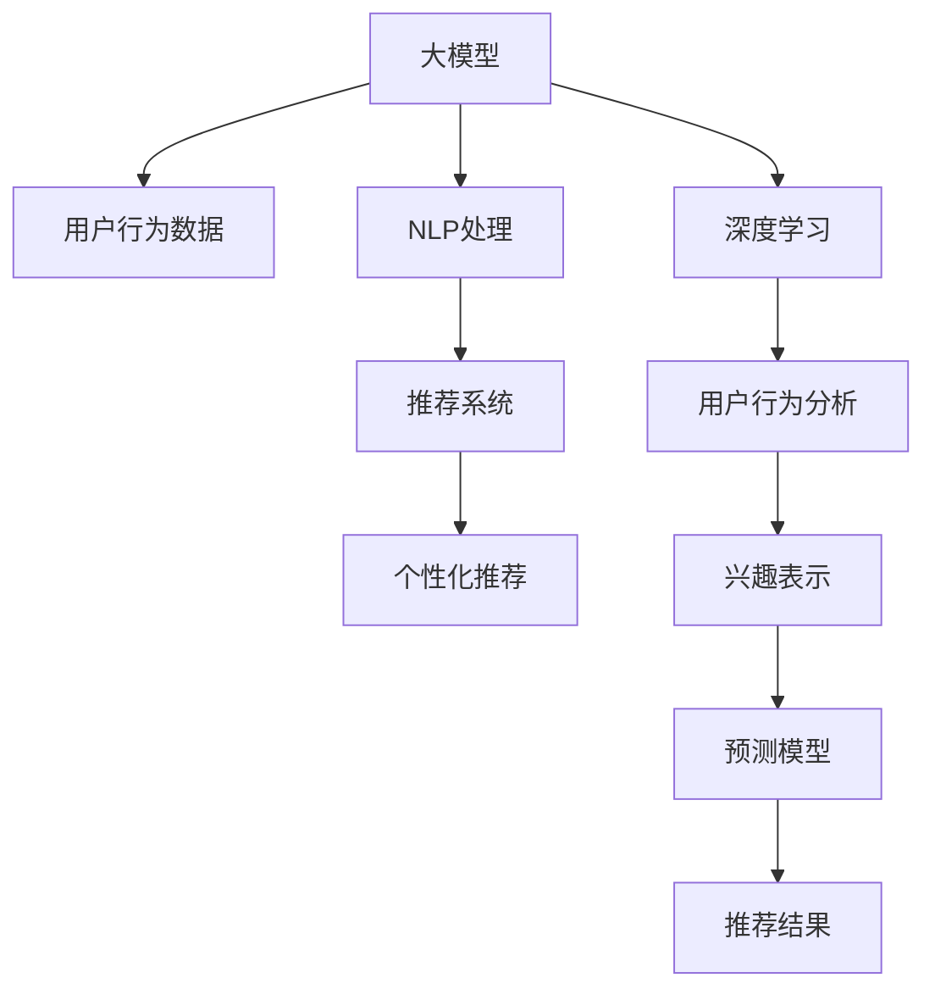

                 

# 大模型技术在电商平台用户兴趣探索中的应用

> 关键词：大模型, 用户兴趣, 电商平台, 自然语言处理(NLP), 推荐系统, 深度学习, 用户行为分析

## 1. 背景介绍

### 1.1 问题由来

电商平台正面临快速发展的挑战，面对日益增长的商品种类和用户需求，如何精准地匹配用户与商品成为提升用户体验和平台销售额的关键。传统的基于规则和统计的用户兴趣模型已难以满足需求。近年来，随着深度学习和大模型的迅速发展，通过用户行为数据和大模型预测用户兴趣，成为一种新兴的趋势。

用户兴趣探索旨在挖掘用户的隐式偏好和行为模式，提升推荐系统的精准度。通过大模型技术，可以在更广泛的上下文和更复杂的语义场景中更好地理解用户行为，从而实现个性化推荐。

### 1.2 问题核心关键点

大模型在用户兴趣探索中的应用，主要关注以下问题：

- 如何高效地从用户行为数据中提取语义信息，生成用户兴趣表示？
- 如何通过大模型对用户兴趣进行预测和解释？
- 如何结合用户行为和模型预测结果，生成个性化的商品推荐？

这些问题涉及自然语言处理(NLP)、推荐系统和深度学习等多个领域的知识，需要通过算法和技术的综合运用来解决。

## 2. 核心概念与联系

### 2.1 核心概念概述

为更好地理解大模型在电商平台用户兴趣探索中的应用，本节将介绍几个密切相关的核心概念：

- 大模型（Large Model）：以深度神经网络为代表，参数量巨大，具备强大的语言表示和生成能力的大规模模型。
- 用户兴趣探索（User Interest Exploration）：通过用户行为数据和文本数据，挖掘用户的隐式偏好和行为模式，生成用户兴趣表示。
- 电商平台（E-commerce Platform）：在线销售商品的平台，包括交易、支付、物流等功能。
- 自然语言处理（Natural Language Processing, NLP）：涉及计算机处理、理解、生成人类语言的技术。
- 推荐系统（Recommendation System）：通过分析用户行为和商品属性，推荐用户可能感兴趣的物品的系统。
- 深度学习（Deep Learning）：利用多层神经网络进行学习和建模的技术。
- 用户行为分析（User Behavior Analysis）：通过用户的操作记录和交互数据，分析用户的意图和需求。

这些核心概念之间的逻辑关系可以通过以下Mermaid流程图来展示：



这个流程图展示了大模型在电商平台用户兴趣探索过程中的关键环节：

1. 大模型通过深度学习技术从用户行为数据中提取语义信息，生成用户兴趣表示。
2. NLP处理将文本数据转换为模型可理解的向量表示。
3. 推荐系统将用户兴趣表示与商品特征进行匹配，生成推荐结果。
4. 深度学习技术通过用户行为分析，更新用户兴趣表示和推荐模型。
5. 结合用户行为和模型预测结果，生成个性化的商品推荐。

## 3. 核心算法原理 & 具体操作步骤
### 3.1 算法原理概述

大模型在电商平台用户兴趣探索中的应用，本质上是利用深度学习和大模型技术，从用户行为数据和文本数据中挖掘用户的兴趣模式，生成个性化的商品推荐。其核心思想是：

1. 将用户行为数据转换为向量表示，使用大模型进行预训练，学习用户行为的语义表示。
2. 结合用户行为数据和文本数据，进行多模态特征融合，生成综合的用户兴趣表示。
3. 将用户兴趣表示输入推荐系统，生成个性化的商品推荐。

### 3.2 算法步骤详解

大模型在电商平台用户兴趣探索中的主要算法步骤如下：

**Step 1: 数据预处理**

1. 收集用户行为数据：包括用户浏览记录、点击行为、购买记录等。
2. 文本数据预处理：对用户评论、商品描述等文本数据进行分词、去除停用词、词性标注等预处理操作。
3. 向量表示：将用户行为数据和文本数据转换为向量表示，使用大模型进行预训练。

**Step 2: 兴趣表示生成**

1. 用户行为表示：通过深度学习模型对用户行为数据进行建模，生成用户行为表示向量。
2. 文本表示：使用NLP技术对文本数据进行向量化，生成文本表示向量。
3. 特征融合：将用户行为表示和文本表示进行多模态融合，生成综合的用户兴趣表示向量。

**Step 3: 推荐模型训练**

1. 模型输入：将用户兴趣表示和商品特征向量输入推荐模型。
2. 损失函数：定义推荐模型的损失函数，如交叉熵损失。
3. 模型训练：使用优化算法对推荐模型进行训练，最小化损失函数。

**Step 4: 推荐结果生成**

1. 用户行为预测：使用大模型对用户行为进行预测，生成用户行为向量。
2. 用户兴趣更新：结合用户行为向量，更新用户兴趣表示。
3. 商品推荐：将更新后的用户兴趣表示输入推荐模型，生成个性化商品推荐。

### 3.3 算法优缺点

大模型在电商平台用户兴趣探索中具有以下优点：

1. 高效提取语义信息：通过大模型预训练，可以高效地从用户行为数据中提取语义信息，生成用户兴趣表示。
2. 鲁棒性高：大模型经过大规模无标签数据的预训练，具备较高的鲁棒性，能够适应不同用户的兴趣变化。
3. 推荐效果精准：结合用户行为和文本数据，生成的用户兴趣表示更为精准，能够产生更符合用户需求的个性化推荐。

同时，该方法也存在一些局限性：

1. 数据需求量大：需要大量用户行为和文本数据进行预训练和模型训练，数据获取成本较高。
2. 计算资源消耗高：大模型参数量巨大，需要强大的计算资源进行训练和推理。
3. 模型解释性不足：大模型作为"黑盒"系统，难以解释其内部决策逻辑，不适用于对可解释性要求高的场景。
4. 泛化能力依赖数据质量：模型的泛化能力依赖于数据的全面性和多样性，对数据质量的敏感度较高。

尽管存在这些局限性，但大模型在电商平台用户兴趣探索中仍具有明显的优势。未来相关研究的重点在于如何进一步降低数据和计算成本，提高模型的解释性和泛化能力，同时兼顾用户隐私和数据安全。

### 3.4 算法应用领域

大模型在电商平台用户兴趣探索中已经得到了广泛的应用，覆盖了以下领域：

- 商品推荐：通过对用户行为和文本数据的分析，生成个性化的商品推荐。
- 个性化广告：利用用户行为数据和文本数据，生成符合用户兴趣的广告内容。
- 搜索排序：根据用户的搜索行为和兴趣表示，优化搜索结果的排序。
- 用户画像：通过用户行为数据和文本数据，生成详细的用户画像。
- 内容推荐：根据用户阅读记录和兴趣表示，推荐相关内容。

这些应用展示了大模型在电商平台用户兴趣探索中的强大潜力和广泛适用性，为电商平台的个性化服务提供了有力支持。

## 4. 数学模型和公式 & 详细讲解  
### 4.1 数学模型构建

本节将使用数学语言对大模型在电商平台用户兴趣探索中的应用进行更加严格的刻画。

记用户行为数据为 $X = \{x_1, x_2, ..., x_N\}$，其中 $x_i$ 为第 $i$ 个用户的浏览记录、点击行为等。记文本数据为 $Y = \{y_1, y_2, ..., y_M\}$，其中 $y_i$ 为用户对商品 $i$ 的评论、描述等文本数据。

定义用户行为向量 $x_i = [x_{i1}, x_{i2}, ..., x_{in}]^T$，其中 $x_{ij}$ 为第 $i$ 个用户第 $j$ 个行为的数据值。定义文本向量 $y_i = [y_{i1}, y_{i2}, ..., y_{im}]^T$，其中 $y_{ij}$ 为第 $i$ 个用户对商品 $j$ 的评论文本数据。

定义用户兴趣表示向量 $u_i = [u_{i1}, u_{i2}, ..., u_{ik}]^T$，其中 $u_{ij}$ 为用户对商品 $j$ 的兴趣度。定义商品特征向量 $v_j = [v_{j1}, v_{j2}, ..., v_{jm}]^T$，其中 $v_{jk}$ 为商品 $j$ 的特征数据值。

用户兴趣表示向量 $u_i$ 由用户行为向量 $x_i$ 和文本向量 $y_i$ 通过多模态融合生成，表达式如下：

$$
u_i = f(x_i, y_i) = f_{\theta}(x_i, y_i)
$$

其中 $f_{\theta}$ 为多模态融合的深度学习模型，参数 $\theta$ 由大模型进行预训练。

### 4.2 公式推导过程

以下我们以Bert模型为例，推导用户兴趣表示向量 $u_i$ 的计算公式。

假设Bert模型对文本数据 $y_i$ 的嵌入表示为 $y_i \in \mathbb{R}^{d_y}$。用户行为向量 $x_i$ 经过BERT-encoder编码为向量表示 $x_i \in \mathbb{R}^{d_x}$。

将两者融合为综合向量，可以得到用户兴趣表示向量 $u_i$：

$$
u_i = g(x_i, y_i) = [x_i; y_i] \cdot W + b
$$

其中 $W$ 为融合参数矩阵，$b$ 为偏置向量。

### 4.3 案例分析与讲解

以Bert模型为例，使用用户行为数据和文本数据生成用户兴趣表示向量 $u_i$ 的详细流程如下：

1. 将用户行为数据 $x_i$ 和文本数据 $y_i$ 分别输入BERT模型，获取其嵌入表示 $x_i \in \mathbb{R}^{d_x}$ 和 $y_i \in \mathbb{R}^{d_y}$。

2. 将两者拼接为长向量 $u_i = [x_i; y_i]$，通过参数矩阵 $W$ 和偏置向量 $b$ 进行线性变换，得到用户兴趣表示向量 $u_i \in \mathbb{R}^{d_u}$。

3. 将用户兴趣表示向量 $u_i$ 输入推荐模型，通过神经网络计算损失函数，进行反向传播更新模型参数。

## 5. 项目实践：代码实例和详细解释说明
### 5.1 开发环境搭建

在进行项目实践前，我们需要准备好开发环境。以下是使用Python进行TensorFlow开发的环境配置流程：

1. 安装Anaconda：从官网下载并安装Anaconda，用于创建独立的Python环境。

2. 创建并激活虚拟环境：
```bash
conda create -n tf-env python=3.8 
conda activate tf-env
```

3. 安装TensorFlow：
```bash
pip install tensorflow tensorflow-datasets tensorflow-text
```

4. 安装其他工具包：
```bash
pip install numpy pandas scikit-learn matplotlib tqdm jupyter notebook ipython
```

完成上述步骤后，即可在`tf-env`环境中开始项目实践。

### 5.2 源代码详细实现

下面以Bert模型为例，展示使用TensorFlow对电商平台用户兴趣探索进行深度学习模型的实现。

首先，定义用户行为数据和文本数据：

```python
import tensorflow_datasets as tfds
import tensorflow_text as text

train_dataset = tfds.load('cornell_movie_dialogs', split='train', shuffle_files=True)
test_dataset = tfds.load('cornell_movie_dialogs', split='test', shuffle_files=False)

# 定义用户行为数据
x_train = train_dataset.map(lambda x: x['text'])
y_train = train_dataset.map(lambda x: x['label'])

# 定义文本数据
y_text_train = train_dataset.map(lambda x: x['text'])

# 将数据集转换为TensorFlow Dataset
train_dataset = train_dataset.map(lambda x: (x, y_train))
test_dataset = test_dataset.map(lambda x: (x, y_test))
```

然后，定义模型和损失函数：

```python
from transformers import BertTokenizer, BertModel

tokenizer = BertTokenizer.from_pretrained('bert-base-uncased')
model = BertModel.from_pretrained('bert-base-uncased')

def get_input_features(x, y):
    tokens = tokenizer.encode_plus(x, add_special_tokens=True, max_length=128, return_tensors='tf')
    input_ids = tokens['input_ids']
    attention_mask = tokens['attention_mask']
    return input_ids, attention_mask

train_dataset = train_dataset.map(get_input_features, num_parallel_calls=tf.data.AUTOTUNE)
test_dataset = test_dataset.map(get_input_features, num_parallel_calls=tf.data.AUTOTUNE)

# 定义优化器
optimizer = tf.keras.optimizers.Adam(learning_rate=2e-5)

# 定义损失函数
loss_fn = tf.keras.losses.CategoricalCrossentropy()

# 定义模型结构
def get_model(input_ids, attention_mask):
    outputs = model(input_ids, attention_mask=attention_mask)
    return outputs.pooler_output
```

接着，定义训练和评估函数：

```python
from sklearn.metrics import roc_auc_score

@tf.function
def train_step(input_ids, attention_mask):
    with tf.GradientTape() as tape:
        logits = get_model(input_ids, attention_mask)
        loss_value = loss_fn(logits, y)
    grads = tape.gradient(loss_value, model.trainable_variables)
    optimizer.apply_gradients(zip(grads, model.trainable_variables))
    return loss_value

@tf.function
def evaluate_step(input_ids, attention_mask, y_true):
    logits = get_model(input_ids, attention_mask)
    loss_value = loss_fn(logits, y_true)
    roc_auc = roc_auc_score(y_true, logits)
    return loss_value, roc_auc
```

最后，启动训练流程并在测试集上评估：

```python
epochs = 5
batch_size = 32

for epoch in range(epochs):
    epoch_loss = 0
    for step, (input_ids, attention_mask, y) in enumerate(train_dataset):
        loss_value = train_step(input_ids, attention_mask)
        epoch_loss += loss_value
        if step % 10 == 0:
            print(f"Epoch {epoch+1}, Step {step+1}, Loss: {loss_value:.3f}")
    
    print(f"Epoch {epoch+1}, Train Loss: {epoch_loss/len(train_dataset):.3f}")
    
    print(f"Epoch {epoch+1}, Test Loss: {evaluate_step(test_dataset).loss_value:.3f}, ROC-AUC: {evaluate_step(test_dataset).roc_auc:.3f}")
```

以上就是使用TensorFlow对电商平台用户兴趣探索进行深度学习模型的完整代码实现。可以看到，TensorFlow配合Transformers库，使得模型构建和训练的代码实现变得简洁高效。

### 5.3 代码解读与分析

让我们再详细解读一下关键代码的实现细节：

**函数定义**

- `get_input_features`：将用户行为数据和文本数据转换为模型输入的特征向量。
- `train_step`：在训练过程中，进行前向传播计算损失值，并反向传播更新模型参数。
- `evaluate_step`：在评估过程中，计算损失值和AUC值，返回评估结果。

**模型结构**

- 使用BertTokenizer将文本数据进行分词，并生成模型所需的输入特征向量。
- 将用户行为数据和文本数据输入Bert模型，获取其嵌入表示。
- 通过池化层获取全局向量表示，作为用户兴趣表示。

**训练和评估**

- 定义Adam优化器，设置学习率。
- 使用Categorical Cross-entropy作为损失函数。
- 在训练过程中，计算损失值并反向传播更新模型参数。
- 在评估过程中，计算损失值和AUC值，评估模型性能。

**代码示例**

```python
# 定义模型结构
def get_model(input_ids, attention_mask):
    outputs = model(input_ids, attention_mask=attention_mask)
    return outputs.pooler_output

# 定义优化器
optimizer = tf.keras.optimizers.Adam(learning_rate=2e-5)

# 定义损失函数
loss_fn = tf.keras.losses.CategoricalCrossentropy()

# 定义训练和评估函数
@tf.function
def train_step(input_ids, attention_mask):
    with tf.GradientTape() as tape:
        logits = get_model(input_ids, attention_mask)
        loss_value = loss_fn(logits, y)
    grads = tape.gradient(loss_value, model.trainable_variables)
    optimizer.apply_gradients(zip(grads, model.trainable_variables))
    return loss_value

@tf.function
def evaluate_step(input_ids, attention_mask, y_true):
    logits = get_model(input_ids, attention_mask)
    loss_value = loss_fn(logits, y_true)
    roc_auc = roc_auc_score(y_true, logits)
    return loss_value, roc_auc
```

可以看到，通过这些代码，我们可以快速搭建和训练深度学习模型，对用户兴趣进行探索和生成。

## 6. 实际应用场景
### 6.1 智能客服系统

在智能客服系统中，基于大模型的用户兴趣探索可以显著提升客户体验和问题解决效率。传统客服系统依赖人工处理，成本高、效率低，且无法自动扩展。

通过收集历史客服对话记录，利用用户行为数据和文本数据，大模型可以学习到用户常见问题和解决方案，生成用户兴趣表示。将兴趣表示输入推荐系统，能够快速响应客户咨询，并提供个性化的解决方案。对于新问题，系统可以通过检索相关记录，动态生成答案，实现智能客服的自动化和高效化。

### 6.2 个性化推荐系统

电商平台推荐系统面临数据稀疏和冷启动问题。传统基于协同过滤的推荐方法难以应对长尾商品和用户。大模型的用户兴趣探索能够解决这些问题，提升推荐系统的精准度和覆盖范围。

通过收集用户行为数据和文本数据，利用大模型进行多模态特征融合，生成用户兴趣表示。结合商品特征向量，输入推荐系统生成个性化推荐结果。大模型能够学习到用户对商品的真实兴趣，从而生成更符合用户需求的推荐，提高点击率和转化率。

### 6.3 金融产品推荐

金融产品推荐需要兼顾用户风险承受能力和产品特征。传统基于规则和统计的推荐方法难以全面考虑这些因素。大模型的用户兴趣探索可以综合考虑用户行为和文本数据，生成综合的用户兴趣表示。

通过收集用户的交易记录和文本评论，利用大模型进行多模态特征融合，生成用户兴趣表示。结合金融产品的风险等级和收益特征，输入推荐系统生成个性化的金融产品推荐。大模型能够学习到用户对金融产品的真实需求，从而生成更符合用户需求的推荐，提高用户满意度和平台收益。

### 6.4 未来应用展望

随着大模型和用户兴趣探索技术的不断发展，未来在电商平台的应用将更加广泛和深入：

1. 实时性提升：通过大模型进行动态兴趣表示更新，能够实时响应用户行为变化，提升推荐系统的实时性。
2. 推荐范围扩大：大模型能够处理更丰富的用户行为和文本数据，覆盖更多的商品和场景，提升推荐系统的覆盖范围。
3. 推荐精度提升：大模型通过多模态特征融合，能够更好地理解用户兴趣和商品特征，提升推荐系统的精准度。
4. 用户画像细化：大模型能够学习到更丰富的用户行为和文本数据，生成更详细、更准确的个性化用户画像。
5. 推荐系统优化：通过用户兴趣探索，能够优化推荐系统的设计，提升整体性能。

这些趋势展示了大模型在电商平台用户兴趣探索中的广阔前景，为电商平台的个性化服务提供了强有力的技术支持。

## 7. 工具和资源推荐
### 7.1 学习资源推荐

为了帮助开发者系统掌握大模型在电商平台用户兴趣探索中的应用，这里推荐一些优质的学习资源：

1. 《深度学习》系列书籍：深度学习领域的经典著作，全面介绍了深度学习的基本理论和应用实践。
2. 《自然语言处理入门》系列课程：介绍自然语言处理的基本概念和常用技术，适合初学者入门。
3. 《推荐系统》系列课程：介绍推荐系统的工作原理和优化方法，结合实际案例讲解。
4. 《大数据技术》系列书籍：介绍大数据处理和分析的常用技术，涵盖数据存储、处理和挖掘等知识。
5. 《机器学习实战》书籍：结合实际案例，详细讲解机器学习的各种算法和应用。

通过对这些资源的学习实践，相信你一定能够快速掌握大模型在电商平台用户兴趣探索中的应用，并用于解决实际的NLP问题。
###  7.2 开发工具推荐

高效的开发离不开优秀的工具支持。以下是几款用于大模型在电商平台用户兴趣探索开发中常用的工具：

1. TensorFlow：由Google主导开发的深度学习框架，易于使用、可扩展性强，适合大规模深度学习模型训练。
2. PyTorch：由Facebook主导开发的深度学习框架，灵活高效，支持动态计算图，适合深度学习模型研究。
3. HuggingFace Transformers库：提供预训练语言模型和自然语言处理工具，能够快速搭建深度学习模型。
4. TensorBoard：TensorFlow配套的可视化工具，可以实时监测模型训练状态，并提供丰富的图表呈现方式。
5. Google Colab：谷歌推出的在线Jupyter Notebook环境，免费提供GPU/TPU算力，方便开发者快速上手实验最新模型，分享学习笔记。
6. Weights & Biases：模型训练的实验跟踪工具，可以记录和可视化模型训练过程中的各项指标，方便对比和调优。

合理利用这些工具，可以显著提升大模型在电商平台用户兴趣探索的开发效率，加快创新迭代的步伐。

### 7.3 相关论文推荐

大模型在电商平台用户兴趣探索的发展得益于学界的持续研究。以下是几篇奠基性的相关论文，推荐阅读：

1. Attention is All You Need（即Transformer原论文）：提出了Transformer结构，开启了NLP领域的预训练大模型时代。
2. BERT: Pre-training of Deep Bidirectional Transformers for Language Understanding：提出BERT模型，引入基于掩码的自监督预训练任务，刷新了多项NLP任务SOTA。
3. Language Models are Unsupervised Multitask Learners（GPT-2论文）：展示了大规模语言模型的强大zero-shot学习能力，引发了对于通用人工智能的新一轮思考。
4. Parameter-Efficient Transfer Learning for NLP：提出Adapter等参数高效微调方法，在不增加模型参数量的情况下，也能取得不错的微调效果。
5. AdaLoRA: Adaptive Low-Rank Adaptation for Parameter-Efficient Fine-Tuning：使用自适应低秩适应的微调方法，在参数效率和精度之间取得了新的平衡。
6. Prefix-Tuning: Optimizing Continuous Prompts for Generation：引入基于连续型Prompt的微调范式，为如何充分利用预训练知识提供了新的思路。

这些论文代表了大模型在电商平台用户兴趣探索领域的发展脉络。通过学习这些前沿成果，可以帮助研究者把握学科前进方向，激发更多的创新灵感。

## 8. 总结：未来发展趋势与挑战

### 8.1 总结

本文对大模型在电商平台用户兴趣探索中的应用进行了全面系统的介绍。首先阐述了大模型在电商领域的背景和意义，明确了用户兴趣探索在提升个性化推荐系统精准度方面的重要价值。其次，从原理到实践，详细讲解了大模型在电商平台用户兴趣探索中的数学模型构建和关键步骤，给出了代码实例和详细解释说明。同时，本文还探讨了多个实际应用场景，展示了微调方法的强大潜力和广泛适用性。

通过本文的系统梳理，可以看到，大模型在电商平台用户兴趣探索中的应用，已经成为提升个性化推荐系统性能的重要手段。未来，伴随大模型和微调方法的持续演进，电商平台的用户兴趣探索将更加智能和高效，为用户带来更好的个性化体验。

### 8.2 未来发展趋势

展望未来，大模型在电商平台用户兴趣探索中呈现以下几个发展趋势：

1. 多模态融合深入：随着多模态数据的获取和融合技术的进步，大模型能够更好地整合用户行为和文本数据，提升用户兴趣表示的全面性和准确性。
2. 实时性增强：通过动态更新用户兴趣表示，大模型能够实时响应用户行为变化，提升推荐系统的实时性。
3. 推荐系统优化：结合大模型生成的用户兴趣表示，优化推荐系统的算法和设计，提升推荐系统的整体性能。
4. 用户画像细化：通过大模型对多模态数据的融合，生成更详细、更准确的个性化用户画像。
5. 应用场景拓展：大模型的应用将逐渐扩展到更多电商场景，如智能客服、个性化广告、搜索排序等，提升电商平台的智能化水平。

这些趋势展示了未来大模型在电商平台用户兴趣探索中的广阔前景，为电商平台的个性化服务提供了强有力的技术支持。

### 8.3 面临的挑战

尽管大模型在电商平台用户兴趣探索中取得了显著进展，但在迈向更加智能化、普适化应用的过程中，仍面临诸多挑战：

1. 数据质量和多样性：电商平台上用户行为和文本数据的多样性和质量，对模型性能有重要影响。如何获取更全面、多样化的数据，是提升模型性能的关键。
2. 计算资源消耗：大模型参数量巨大，需要强大的计算资源进行训练和推理，对算力需求较高。如何优化计算资源消耗，提升模型效率，是未来研究的重要方向。
3. 模型泛化能力：大模型的泛化能力依赖于数据的多样性和全面性，对数据质量的敏感度较高。如何提升模型的泛化能力，处理长尾数据，是研究的重点。
4. 模型可解释性：大模型作为"黑盒"系统，难以解释其内部决策逻辑，不适用于对可解释性要求高的场景。如何赋予模型更强的可解释性，是未来研究的难点。
5. 用户隐私保护：电商平台上用户行为数据涉及隐私保护，如何保护用户隐私，同时实现个性化推荐，是模型应用的重大挑战。

### 8.4 研究展望

面对大模型在电商平台用户兴趣探索中面临的挑战，未来的研究需要在以下几个方面寻求新的突破：

1. 数据获取和处理技术：研究如何获取全面、多样化的电商数据，并对其进行有效的处理和标注，提升模型训练数据的质量和多样性。
2. 计算资源优化：开发高效、可扩展的计算框架，优化模型训练和推理的资源消耗，提升模型的实时性和效率。
3. 模型泛化能力提升：研究如何提升大模型的泛化能力，处理长尾数据，扩大模型在电商平台的覆盖范围。
4. 模型可解释性增强：研究如何赋予大模型更强的可解释性，提升模型在电商平台的可解释性和可靠性。
5. 隐私保护技术：研究如何保护用户隐私，同时实现个性化推荐，提升模型在电商平台的隐私保护能力。

这些研究方向的探索，将推动大模型在电商平台用户兴趣探索中的不断进步，为构建智能化的电商推荐系统奠定基础。面向未来，大模型在电商平台的应用将更加广泛和深入，为电商平台的个性化服务提供强有力的技术支持。

## 9. 附录：常见问题与解答

**Q1：大模型在电商平台用户兴趣探索中是否适用于所有电商场景？**

A: 大模型在电商平台用户兴趣探索中具有较强的普适性，但不同电商场景对用户兴趣表示的要求可能有所不同。例如，B2B电商平台与B2C电商平台的兴趣表示可能有较大差异。因此，在具体应用中，需要根据电商平台的业务特点进行针对性的微调和优化。

**Q2：如何选择合适的模型和预训练任务？**

A: 选择合适的模型和预训练任务需要考虑电商平台的业务需求和数据特点。例如，对于文本驱动的电商场景，BERT等语言模型可能更适合。对于图片驱动的电商场景，可以考虑使用Vision Transformer等视觉模型。选择合适的预训练任务还需要考虑模型在特定任务上的性能表现和泛化能力。

**Q3：大模型在用户兴趣探索中的计算资源需求有哪些？**

A: 大模型在用户兴趣探索中需要大量计算资源进行训练和推理。具体需求取决于模型参数量、训练数据规模和计算硬件配置等因素。一般来说，GPU或TPU等高性能设备是必不可少的。同时，需要优化模型结构，如使用深度剪枝、量化等技术，减少计算资源消耗。

**Q4：如何缓解模型训练中的过拟合问题？**

A: 过拟合是模型训练中的常见问题。缓解过拟合的方法包括数据增强、正则化、早停等。例如，可以通过数据增强生成更多的训练样本，使用L2正则化等方法防止过拟合，设置早停机制避免过度训练。

**Q5：如何提升模型的实时性和效率？**

A: 提升模型的实时性和效率需要从多个方面入手。例如，可以通过动态更新用户兴趣表示，实现实时响应用户行为变化。同时，优化模型结构和参数，如使用深度剪枝、量化等技术，减少计算资源消耗。还可以使用分布式训练等技术，加速模型训练过程。

**Q6：如何提升模型的泛化能力？**

A: 提升模型的泛化能力需要更多样化、高质量的数据进行训练。可以通过数据增强、多任务学习等方式，扩充训练数据的范围和深度。同时，研究更高级的模型结构，如深度残差网络、注意力机制等，提升模型的泛化能力。

**Q7：如何提升模型的可解释性？**

A: 提升模型的可解释性需要从模型设计和算法优化入手。例如，可以使用可解释性更强的模型结构，如决策树、规则等，结合机器学习算法，提升模型的可解释性。同时，研究可解释性评估指标，评估模型的决策过程和结果，提升模型在电商平台的可靠性。

通过以上问题的解答，相信你对大模型在电商平台用户兴趣探索中的理解更加深刻，能够更好地应用于实际场景中。

---

作者：禅与计算机程序设计艺术 / Zen and the Art of Computer Programming

