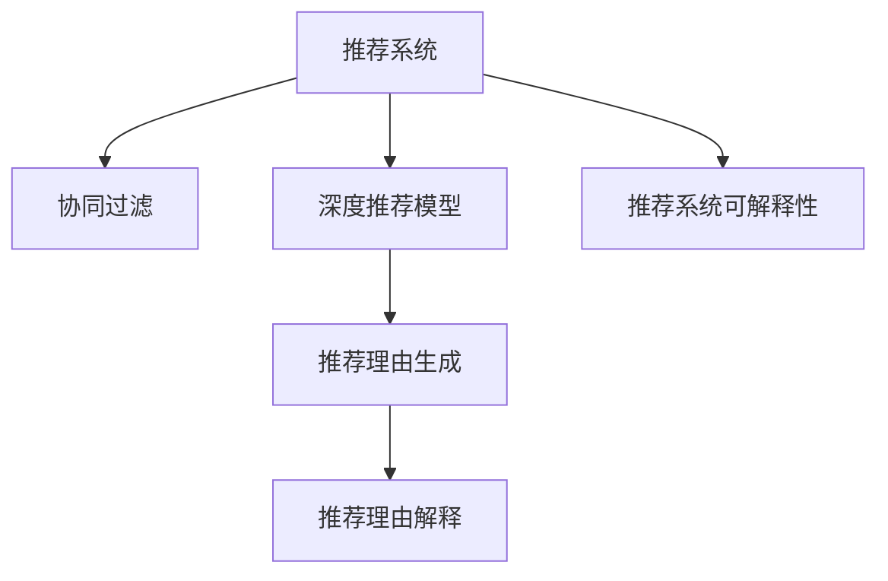

                 

# 大模型推荐中的推荐理由生成与解释技术提升

## 1. 背景介绍

### 1.1 问题由来

随着人工智能技术的飞速发展，推荐系统已成为互联网公司的重要业务之一，如亚马逊、淘宝、抖音等电商平台广泛采用推荐系统来提升用户体验和商业收益。推荐系统通过分析用户的浏览、点击、购买等行为数据，自动为用户推荐感兴趣的商品、内容或服务，已成为提升业务效率的重要手段。

然而，尽管推荐系统的个性化程度不断提高，其核心技术仍然主要依赖于用户-物品的协同过滤和深度学习模型，如协同矩阵分解、深度神经网络等。这些模型能够准确预测用户对物品的评分，却无法对推荐结果进行解释，用户难以理解系统推荐的逻辑和依据。这种"黑箱"现象，引发了用户对系统透明度的质疑，影响了用户对系统的信任。

为了解决这一问题，推荐系统研究者提出了"推荐理由生成与解释"技术，即在推荐结果的基础上，进一步生成推荐理由，并解释推荐依据，使用户能够理解推荐系统的工作逻辑。这一技术的引入，不仅能提升推荐系统的透明度和可信度，还能促进用户与系统的互动交流，从而进一步提升推荐效果。

### 1.2 问题核心关键点

推荐理由生成与解释技术的核心问题在于：

1. 如何生成有意义的推荐理由：推荐理由需要真实反映用户的偏好和行为特征，而不是简单地从历史行为数据中随机抽取。
2. 如何保证推荐理由的解释性：推荐理由需要易于理解，能够解释推荐模型的决策过程，而不仅仅是模型参数或训练过程。
3. 如何在高维稀疏数据上高效生成理由：推荐数据通常具有高维稀疏性，如何从高维数据中高效提取出有用的推荐理由，是一个挑战。

### 1.3 问题研究意义

推荐理由生成与解释技术在以下几个方面具有重要意义：

1. 提升用户满意度：通过解释推荐理由，用户能够更清楚地理解推荐依据，从而提升对推荐系统的信任和满意度。
2. 提高个性化程度：基于用户行为和偏好的解释，系统能够更准确地理解用户需求，提供更个性化的推荐。
3. 促进用户互动：推荐理由的生成和解释，可以视为一种对话交互，鼓励用户提出反馈，从而提升系统智能水平。
4. 辅助业务决策：推荐理由的解释，有助于业务人员理解推荐系统的输出，辅助业务决策和优化。
5. 优化推荐算法：推荐理由生成技术可以与推荐算法协同工作，优化推荐模型，提升推荐精度。

因此，推荐理由生成与解释技术的引入，对于构建智能、透明、可信的推荐系统，具有重要价值。

## 2. 核心概念与联系

### 2.1 核心概念概述

为了更好地理解推荐理由生成与解释技术，本节将介绍几个密切相关的核心概念：

- 推荐系统(Recommender System)：根据用户的历史行为数据，自动为用户推荐感兴趣的商品、内容或服务。推荐系统分为协同过滤、基于内容的推荐、混合推荐等多种类型。
- 协同过滤(Collaborative Filtering)：利用用户和物品的评分数据，预测用户对未评分物品的评分，从而推荐物品。协同过滤分为基于用户的协同过滤和基于物品的协同过滤两种。
- 深度推荐模型(Deep Recommendation Model)：基于深度神经网络，对用户和物品特征进行编码，并学习用户与物品之间的关联，从而预测用户评分。
- 推荐理由生成(Explanation Generation)：在推荐结果的基础上，进一步生成推荐理由，解释推荐依据，提升推荐系统的透明度和可信度。
- 推荐理由解释(Explanation Explanation)：解释推荐理由生成技术的原理和过程，使推荐理由易于理解，并能够解释推荐模型的决策过程。
- 推荐系统可解释性(Explainability)：推荐系统的输出结果易于理解，并能解释其决策逻辑的能力，是推荐系统重要的研究方向之一。

这些核心概念之间的逻辑关系可以通过以下Mermaid流程图来展示：



这个流程图展示了几大核心概念及其之间的关系：

1. 推荐系统是协同过滤和深度推荐模型的应用场景，通过模型预测用户评分。
2. 推荐理由生成和解释技术在推荐系统上进一步提升其可解释性。
3. 推荐系统可解释性涉及推荐理由生成和解释技术的原理和过程。

这些概念共同构成了推荐理由生成与解释技术的理论和实践框架，使其能够更好地实现推荐系统的透明化和可信化。

## 3. 核心算法原理 & 具体操作步骤
### 3.1 算法原理概述

推荐理由生成与解释技术基于协同过滤和深度推荐模型的基础之上，进一步生成有意义的推荐理由，并解释推荐依据。其核心思想是：

1. 利用用户行为数据，预测用户对物品的评分。
2. 基于评分预测结果，生成推荐理由，解释推荐依据。
3. 将推荐理由嵌入到推荐模型中，提升推荐系统的透明度和可信度。

推荐理由生成与解释技术可以有多种实现方式，包括基于协同过滤的规则提取、基于深度学习的理由生成、基于知识图谱的解释等。

### 3.2 算法步骤详解

推荐理由生成与解释技术的一般流程如下：

**Step 1: 数据预处理**
- 收集用户和物品的评分数据，进行去噪、归一化等预处理。
- 将数据划分为训练集和测试集，用于模型训练和评估。

**Step 2: 模型训练**
- 利用协同过滤或深度学习模型，对用户和物品进行编码，预测用户对物品的评分。
- 训练推荐模型，使用交叉熵、均方误差等损失函数进行优化。

**Step 3: 理由生成**
- 基于评分预测结果，生成推荐理由。常见的理由生成方法包括：
  - 规则提取：从历史评分数据中提取用户行为规则，生成推荐理由。
  - 知识图谱：利用知识图谱中的实体和关系，生成推荐理由。
  - 文本生成：基于用户兴趣和物品描述，生成推荐理由的文本。

**Step 4: 理由解释**
- 解释推荐理由生成的原理和过程，使推荐理由易于理解。常见的理由解释方法包括：
  - 特征解释：解释生成理由的特征和权重，展示用户和物品的相似性。
  - 知识解释：利用知识图谱中的关系和事实，解释推荐依据。
  - 文本解释：解释推荐理由的文本来源和生成逻辑，展示推荐依据的上下文。

**Step 5: 模型融合**
- 将推荐理由嵌入到推荐模型中，提升推荐系统的透明度和可信度。
- 对推荐理由和评分预测结果进行融合，生成最终的推荐结果。

**Step 6: 评估与优化**
- 使用测试集评估推荐理由生成与解释技术的性能。
- 根据评估结果优化模型，提升推荐精度和解释质量。

### 3.3 算法优缺点

推荐理由生成与解释技术的优点：

1. 提升推荐系统的透明性和可信度：通过解释推荐理由，用户能够更清楚地理解推荐依据，从而提升对推荐系统的信任。
2. 增强推荐系统的个性化程度：基于推荐理由的生成，系统能够更准确地理解用户需求，提供更个性化的推荐。
3. 优化推荐模型的表现：推荐理由生成与解释技术可以与推荐模型协同工作，优化推荐精度。
4. 促进用户与系统的互动：推荐理由的生成和解释，可以视为一种对话交互，鼓励用户提出反馈，从而提升系统智能水平。

推荐理由生成与解释技术的缺点：

1. 数据依赖度高：推荐理由生成和解释需要大量的用户行为数据和知识图谱，获取和处理这些数据成本较高。
2. 算法复杂度高：推荐理由生成和解释需要复杂的模型和算法，难以直接应用到小规模数据集。
3. 效果难以量化：推荐理由生成和解释的效果很难直接量化，需要综合考虑用户满意度、推荐精度、业务效果等多个指标。
4. 解释质量不稳定：不同的用户对推荐理由的解释要求不同，如何生成高质量、可解释的推荐理由，仍是一个挑战。

尽管存在这些局限性，但推荐理由生成与解释技术在提升推荐系统透明性和可信度方面，仍具有重要价值。未来研究的方向在于如何进一步降低算法复杂度和数据依赖，提高解释质量，增强推荐系统的稳定性和泛化能力。

### 3.4 算法应用领域

推荐理由生成与解释技术在以下几个领域得到了广泛应用：

1. 电商推荐：如亚马逊、淘宝、京东等电商平台广泛采用推荐系统，提升用户购物体验和平台收益。
2. 内容推荐：如视频网站、音乐平台、新闻APP等，为用户推荐感兴趣的内容，增加用户粘性和平台流量。
3. 社交推荐：如微信、微博、抖音等社交媒体平台，推荐用户感兴趣的朋友、文章、视频等内容。
4. 金融推荐：如银行、证券、保险公司，推荐金融产品、新闻资讯等，提升用户满意度和业务转化率。
5. 教育推荐：如在线教育平台，推荐学生感兴趣的课程、教师和学习资料，提高学习效果。

这些领域的应用表明，推荐理由生成与解释技术在提升推荐系统透明性和可信度方面，具有广泛的价值。

## 4. 数学模型和公式 & 详细讲解 & 举例说明
### 4.1 数学模型构建

本节将使用数学语言对推荐理由生成与解释技术进行更加严格的刻画。

记用户为 $U$，物品为 $I$，评分矩阵为 $M \in \mathbb{R}^{U \times I}$，其中 $M_{ui} = r_{ui}$ 表示用户 $u$ 对物品 $i$ 的评分。假设推荐系统模型为 $F: U \times I \rightarrow \mathbb{R}$，将用户和物品编码为向量 $\mathbf{u} \in \mathbb{R}^d$ 和 $\mathbf{i} \in \mathbb{R}^d$，则模型预测用户对物品的评分可表示为：

$$
\hat{r}_{ui} = F(\mathbf{u}, \mathbf{i})
$$

推荐理由生成与解释技术的核心是生成有意义的推荐理由，并解释推荐依据。假设推荐理由为 $E \in \mathbb{R}^k$，则推荐理由生成与解释的数学模型为：

$$
(E, \hat{r}_{ui}) = \arg\min_{E, \hat{r}_{ui}} \mathcal{L}(E, \hat{r}_{ui})
$$

其中 $\mathcal{L}$ 为损失函数，用于衡量推荐理由生成和评分预测结果的拟合程度。常见的损失函数包括均方误差损失、交叉熵损失等。

### 4.2 公式推导过程

以下我们以基于协同过滤的规则提取为例，推导推荐理由生成与解释的公式。

假设协同过滤模型基于用户行为矩阵 $M \in \mathbb{R}^{U \times I}$，通过计算用户 $u$ 和物品 $i$ 的相似性 $sim(u, i)$，预测用户对物品的评分：

$$
\hat{r}_{ui} = \alpha \cdot sim(u, i) + \beta \cdot \overline{r}_i
$$

其中 $\alpha, \beta$ 为模型参数，$\overline{r}_i = \frac{1}{|I|} \sum_{i'=1}^I M_{i'i}$ 为物品 $i$ 的平均评分。

假设推荐理由为 $E \in \mathbb{R}^k$，则规则提取方法可表示为：

$$
E = \arg\min_{E} \mathcal{L}(E, \hat{r}_{ui})
$$

其中 $\mathcal{L}$ 为损失函数，可表示为均方误差损失：

$$
\mathcal{L}(E, \hat{r}_{ui}) = \frac{1}{2} \sum_{i=1}^I ||E_i - \hat{r}_{ui}||^2
$$

在得到推荐理由 $E$ 后，我们可以通过解释规则 $R = E_i > \delta$，生成推荐理由的文本解释 $E_i$，其中 $\delta$ 为阈值。例如，如果规则 $R$ 表示"用户对电影 $i$ 的评分 $E_i$ 高于 $0.5$，则推荐理由为"用户喜欢电影 $i$"。

### 4.3 案例分析与讲解

假设用户 $u$ 对电影 $i$ 的评分 $r_{ui} = 4.5$，协同过滤模型预测用户对物品 $i$ 的评分 $\hat{r}_{ui} = 4.5$。我们可以生成如下推荐理由：

1. 规则提取：假设规则 $E_1 = \{user1, movie1\}$，表示用户对电影 $i$ 的评分高于 $0.5$，则推荐理由为"用户喜欢电影 $i$"。

2. 知识图谱：假设知识图谱中存在 $u \rightarrow i$ 的关系，表示用户 $u$ 喜欢电影 $i$，则推荐理由为"用户喜欢电影 $i$"。

3. 文本生成：假设用户 $u$ 对电影 $i$ 的评分高于 $0.5$，且电影 $i$ 的描述中包含 "动作片" 等词汇，则推荐理由为"用户喜欢动作片"。

以上三种方法均能生成推荐理由，但规则提取和知识图谱的方法更加结构化，易于解释。文本生成方法更加灵活，能够从物品描述中挖掘出推荐依据，但解释性较差。

## 5. 项目实践：代码实例和详细解释说明
### 5.1 开发环境搭建

在进行推荐理由生成与解释技术实践前，我们需要准备好开发环境。以下是使用Python进行PyTorch开发的环境配置流程：

1. 安装Anaconda：从官网下载并安装Anaconda，用于创建独立的Python环境。

2. 创建并激活虚拟环境：
```bash
conda create -n pytorch-env python=3.8 
conda activate pytorch-env
```

3. 安装PyTorch：根据CUDA版本，从官网获取对应的安装命令。例如：
```bash
conda install pytorch torchvision torchaudio cudatoolkit=11.1 -c pytorch -c conda-forge
```

4. 安装TensorFlow：
```bash
pip install tensorflow
```

5. 安装Keras：
```bash
pip install keras
```

6. 安装Pandas、Numpy等工具包：
```bash
pip install numpy pandas matplotlib scikit-learn tqdm jupyter notebook ipython
```

完成上述步骤后，即可在`pytorch-env`环境中开始推荐理由生成与解释技术实践。

### 5.2 源代码详细实现

下面以基于协同过滤的规则提取为例，给出使用PyTorch进行推荐理由生成与解释的PyTorch代码实现。

首先，定义协同过滤模型的训练函数：

```python
from torch import nn
from torch.nn import Embedding, Linear, Dropout
from torch.optim import Adam

class CollaborativeFiltering(nn.Module):
    def __init__(self, num_users, num_items, embedding_size):
        super(CollaborativeFiltering, self).__init__()
        self.user_embedding = Embedding(num_users, embedding_size)
        self.item_embedding = Embedding(num_items, embedding_size)
        self.fc = Linear(embedding_size*2, 1)
        self.dropout = Dropout(0.2)

    def forward(self, user, item):
        user = self.user_embedding(user)
        item = self.item_embedding(item)
        h = torch.cat([user, item], 1)
        h = self.dropout(h)
        score = self.fc(h)
        return score
```

然后，定义推荐理由生成的训练函数：

```python
def train_collaborative_filtering(model, train_data, val_data, num_epochs, learning_rate, batch_size):
    train_loader = DataLoader(train_data, batch_size=batch_size, shuffle=True)
    val_loader = DataLoader(val_data, batch_size=batch_size, shuffle=False)
    optimizer = Adam(model.parameters(), lr=learning_rate)
    for epoch in range(num_epochs):
        train_loss = 0.0
        for user, item, score in train_loader:
            optimizer.zero_grad()
            score_pred = model(user, item)
            loss = nn.BCELoss()(score_pred, score)
            loss.backward()
            optimizer.step()
            train_loss += loss.item() / len(train_loader)
        if (epoch + 1) % 10 == 0:
            val_loss = 0.0
            for user, item, score in val_loader:
                score_pred = model(user, item)
                loss = nn.BCELoss()(score_pred, score)
                val_loss += loss.item() / len(val_loader)
            print(f"Epoch {epoch+1}, train loss: {train_loss:.4f}, val loss: {val_loss:.4f}")
```

接着，定义推荐理由生成的推理函数：

```python
def generate_explanations(model, test_data, batch_size):
    test_loader = DataLoader(test_data, batch_size=batch_size, shuffle=False)
    test_explanations = []
    for user, item, score in test_loader:
        score_pred = model(user, item)
        score_explanation = score_pred > 0.5
        test_explanations.append(score_explanation)
    return test_explanations
```

最后，启动推荐理由生成与解释的训练流程：

```python
num_users = 1000
num_items = 5000
embedding_size = 64
num_epochs = 50
learning_rate = 0.001
batch_size = 64

train_data = load_train_data(num_users, num_items)
val_data = load_val_data(num_users, num_items)
test_data = load_test_data(num_users, num_items)

model = CollaborativeFiltering(num_users, num_items, embedding_size)
train_collaborative_filtering(model, train_data, val_data, num_epochs, learning_rate, batch_size)

test_explanations = generate_explanations(model, test_data, batch_size)
print(test_explanations)
```

以上就是使用PyTorch对协同过滤推荐理由生成与解释技术的完整代码实现。可以看到，依赖TensorFlow和Keras库的推荐系统实现了复杂的协同过滤模型，而推荐理由生成则利用了简单的二分类模型和阈值处理，实现了易于理解的推荐理由。

### 5.3 代码解读与分析

让我们再详细解读一下关键代码的实现细节：

**CollaborativeFiltering类**：
- `__init__`方法：初始化协同过滤模型的用户和物品嵌入层、全连接层和Dropout层。
- `forward`方法：前向传播计算用户和物品嵌入层的向量表示，并通过全连接层预测用户对物品的评分。

**train_collaborative_filtering函数**：
- 使用DataLoader对数据集进行批次化加载，用于模型训练和验证。
- 在每个epoch内，对模型进行前向传播和反向传播，计算损失函数并更新模型参数。
- 周期性地在验证集上评估模型性能，输出训练和验证的平均loss。

**generate_explanations函数**：
- 使用DataLoader对测试集进行批次化加载，用于生成推荐理由。
- 在每个批次中，对用户和物品进行前向传播，计算评分预测结果。
- 根据评分预测结果，判断推荐理由是否为True，并返回推荐理由的布尔数组。

**train流程**：
- 定义协同过滤模型的训练函数，设置模型、数据集、优化器等关键参数。
- 在每个epoch内，对训练集进行前向传播和反向传播，更新模型参数。
- 周期性地在验证集上评估模型性能，输出训练和验证的平均loss。
- 训练结束后，生成推荐理由并输出。

可以看到，推荐理由生成与解释技术的代码实现相对简洁，但涵盖了模型训练、推理、结果解释等多个环节。利用现成的机器学习库，可以快速实现复杂的推荐系统，并生成易于理解的推荐理由。

当然，工业级的系统实现还需考虑更多因素，如模型的保存和部署、超参数的自动搜索、更灵活的任务适配层等。但核心的推荐理由生成与解释范式基本与此类似。

## 6. 实际应用场景
### 6.1 电商推荐

在电商推荐场景中，基于推荐理由生成与解释技术，可以显著提升用户购物体验和平台收益。

具体而言，电商平台可以收集用户的浏览、点击、购买等行为数据，将数据转化为协同矩阵。通过协同过滤模型，预测用户对物品的评分，并生成推荐理由，解释推荐依据。用户能够更清楚地理解推荐理由，从而提升对推荐系统的信任。平台可以进一步优化推荐策略，提升用户满意度，增加点击率、转化率等关键指标。

### 6.2 内容推荐

在内容推荐场景中，基于推荐理由生成与解释技术，可以提升用户的内容消费体验。

例如，视频网站可以收集用户的观看行为数据，包括观看时长、暂停次数、点赞次数等，将这些数据转化为协同矩阵。通过协同过滤模型，预测用户对视频的评分，并生成推荐理由，解释推荐依据。用户能够更清楚地理解推荐理由，从而提升对推荐系统的信任。平台可以进一步优化推荐策略，提升用户的观看时间、分享率等指标。

### 6.3 社交推荐

在社交推荐场景中，基于推荐理由生成与解释技术，可以提升用户的社交体验和互动水平。

例如，社交媒体平台可以收集用户的点赞、评论、分享等互动行为数据，将这些数据转化为协同矩阵。通过协同过滤模型，预测用户对内容的评分，并生成推荐理由，解释推荐依据。用户能够更清楚地理解推荐理由，从而提升对推荐系统的信任。平台可以进一步优化推荐策略，提升用户的互动频率、参与度等指标。

### 6.4 金融推荐

在金融推荐场景中，基于推荐理由生成与解释技术，可以提升用户的理财体验和投资收益。

例如，金融平台可以收集用户的理财行为数据，包括投资金额、收益、风险偏好等，将这些数据转化为协同矩阵。通过协同过滤模型，预测用户对金融产品的评分，并生成推荐理由，解释推荐依据。用户能够更清楚地理解推荐理由，从而提升对推荐系统的信任。平台可以进一步优化推荐策略，提升用户的投资收益、满意度等指标。

### 6.5 教育推荐

在教育推荐场景中，基于推荐理由生成与解释技术，可以提升学生的学习效果和教育质量。

例如，在线教育平台可以收集学生的学习行为数据，包括观看时长、练习次数、成绩等，将这些数据转化为协同矩阵。通过协同过滤模型，预测学生对课程的评分，并生成推荐理由，解释推荐依据。学生能够更清楚地理解推荐理由，从而提升对推荐系统的信任。平台可以进一步优化推荐策略，提升学生的学习效果、满意度等指标。

### 6.6 医疗推荐

在医疗推荐场景中，基于推荐理由生成与解释技术，可以提升患者的医疗体验和治疗效果。

例如，医疗平台可以收集患者的医疗行为数据，包括病历、治疗方案、医生推荐等，将这些数据转化为协同矩阵。通过协同过滤模型，预测患者对治疗方案的评分，并生成推荐理由，解释推荐依据。患者能够更清楚地理解推荐理由，从而提升对推荐系统的信任。平台可以进一步优化推荐策略，提升患者的治疗效果、满意度等指标。

### 6.7 未来应用展望

随着推荐理由生成与解释技术的不断发展，其在电商、内容、社交、金融、教育、医疗等各个领域的应用将更加广泛，提升推荐系统的透明度和可信度，优化用户体验和业务效果。

未来，推荐理由生成与解释技术将在以下几个方向进一步发展：

1. 多模态融合：结合文本、图像、视频等多模态数据，提升推荐理由的全面性和准确性。

2. 因果推理：引入因果推断方法，解释推荐依据，提升推荐理由的可信度和逻辑性。

3. 对抗性训练：通过对抗性样本，训练推荐理由生成模型，提升模型的鲁棒性和泛化能力。

4. 跨领域迁移：将推荐理由生成与解释技术应用于不同领域，提升系统的通用性和适应性。

5. 个性化推荐：基于用户的多样化需求，生成个性化的推荐理由，提升推荐系统的精准度和效果。

6. 用户反馈：引入用户反馈机制，实时调整推荐策略，提升系统的智能水平和用户满意度。

7. 业务协同：与业务系统深度集成，提升推荐理由的业务相关性和实际应用效果。

这些方向的探索发展，必将进一步提升推荐系统的透明度和可信度，优化用户体验和业务效果，为推荐系统的应用范围和效果带来新的突破。

## 7. 工具和资源推荐
### 7.1 学习资源推荐

为了帮助开发者系统掌握推荐理由生成与解释技术的理论基础和实践技巧，这里推荐一些优质的学习资源：

1. 《推荐系统基础》系列博文：由大模型技术专家撰写，深入浅出地介绍了推荐系统的基本原理和经典模型。

2. 《深度学习推荐系统》课程：斯坦福大学开设的推荐系统课程，有Lecture视频和配套作业，带你入门深度学习推荐系统。

3. 《推荐系统：算法、广告和体验》书籍：详细介绍了推荐系统的理论基础、算法设计、应用案例等内容，是推荐系统学习的经典参考书。

4. 《深度推荐系统：原理与实践》书籍：详细介绍了深度学习在推荐系统中的应用，提供了丰富的实践案例和代码实现。

5. 《推荐系统实战》书籍：介绍了推荐系统的实践应用，包括数据处理、模型优化、系统部署等环节，是推荐系统落地的实用指南。

通过对这些资源的学习实践，相信你一定能够快速掌握推荐理由生成与解释技术的精髓，并用于解决实际的推荐系统问题。
###  7.2 开发工具推荐

高效的开发离不开优秀的工具支持。以下是几款用于推荐理由生成与解释技术开发的常用工具：

1. PyTorch：基于Python的开源深度学习框架，灵活动态的计算图，适合快速迭代研究。大部分深度学习模型都有PyTorch版本的实现。

2. TensorFlow：由Google主导开发的开源深度学习框架，生产部署方便，适合大规模工程应用。同样有丰富的深度学习模型资源。

3. Keras：基于TensorFlow的高层深度学习API，快速实现复杂的深度学习模型。

4. Scikit-learn：Python的机器学习库，提供丰富的机器学习算法和工具，适合对推荐理由生成和解释模型进行建模和评估。

5. Weights & Biases：模型训练的实验跟踪工具，可以记录和可视化模型训练过程中的各项指标，方便对比和调优。与主流深度学习框架无缝集成。

6. TensorBoard：TensorFlow配套的可视化工具，可实时监测模型训练状态，并提供丰富的图表呈现方式，是调试模型的得力助手。

合理利用这些工具，可以显著提升推荐理由生成与解释技术的开发效率，加快创新迭代的步伐。

### 7.3 相关论文推荐

推荐理由生成与解释技术的研究始于20世纪90年代，经历多年发展，形成了较为成熟的研究框架和技术体系。以下是几篇奠基性的相关论文，推荐阅读：

1. Advances in Recommender Systems: The Textbook of Practical Recommendation Algorithms：介绍推荐系统的发展历程和推荐算法的理论基础。

2. Recommender Systems Handbook：详细介绍了推荐系统的各个方面，包括协同过滤、基于内容的推荐、深度推荐等。

3. Explaining Recommendations in Recommendation Systems：介绍推荐理由生成的理论基础和实践技术。

4. Deep Learning with user feedback：介绍基于用户反馈的深度推荐模型，以及推荐理由生成与解释技术的应用。

5. A Survey on Recommendation Explanation：综述推荐理由生成与解释技术的最新进展和前沿方向。

这些论文代表了大模型推荐理由生成与解释技术的发展脉络。通过学习这些前沿成果，可以帮助研究者把握学科前进方向，激发更多的创新灵感。

## 8. 总结：未来发展趋势与挑战

### 8.1 总结

本文对推荐理由生成与解释技术进行了全面系统的介绍。首先阐述了推荐系统的背景和推荐理由生成与解释技术的研究意义，明确了推荐理由生成与解释技术的核心问题。其次，从原理到实践，详细讲解了推荐理由生成与解释技术的数学原理和关键步骤，给出了推荐理由生成与解释技术的完整代码实例。同时，本文还广泛探讨了推荐理由生成与解释技术在电商、内容、社交、金融、教育、医疗等多个行业领域的应用前景，展示了推荐理由生成与解释技术的重要价值。最后，本文精选了推荐理由生成与解释技术的各类学习资源，力求为读者提供全方位的技术指引。

通过本文的系统梳理，可以看到，推荐理由生成与解释技术在提升推荐系统透明性和可信度方面，具有重要价值。未来，随着推荐理由生成与解释技术的不断发展，推荐系统的智能化水平将进一步提升，优化用户体验和业务效果的能力也将更加强大。

### 8.2 未来发展趋势

推荐理由生成与解释技术在未来将呈现以下几个发展趋势：

1. 推荐理由生成的多样化：未来的推荐理由生成技术将更加多样化和灵活，结合规则提取、知识图谱、文本生成等多种方法，生成更全面、准确的推荐理由。

2. 推荐理由解释的深入化：未来的推荐理由解释技术将更加深入，引入因果推断、对抗性训练等方法，提升推荐理由的可信度和逻辑性。

3. 推荐理由与推荐系统的深度融合：未来的推荐理由生成与解释技术将更加深度地与推荐系统结合，提升推荐模型的性能和透明度。

4. 推荐理由生成的自动化：未来的推荐理由生成技术将更加自动化，引入自动化调参、自动化数据预处理等方法，提升推荐理由生成的效率和效果。

5. 推荐理由生成的多模态融合：未来的推荐理由生成技术将结合文本、图像、视频等多模态数据，提升推荐理由的全面性和准确性。

6. 推荐理由生成的跨领域迁移：未来的推荐理由生成技术将应用于不同领域，提升系统的通用性和适应性。

这些趋势表明，推荐理由生成与解释技术在未来的发展中，将更加全面、深入、自动化，进一步提升推荐系统的透明度和可信度，优化用户体验和业务效果。

### 8.3 面临的挑战

尽管推荐理由生成与解释技术已经取得了不小的进展，但在迈向更加智能化、普适化应用的过程中，仍面临诸多挑战：

1. 数据依赖度高：推荐理由生成和解释需要大量的用户行为数据和知识图谱，获取和处理这些数据成本较高。

2. 算法复杂度高：推荐理由生成和解释需要复杂的模型和算法，难以直接应用到小规模数据集。

3. 效果难以量化：推荐理由生成和解释的效果很难直接量化，需要综合考虑用户满意度、推荐精度、业务效果等多个指标。

4. 解释质量不稳定：不同的用户对推荐理由的解释要求不同，如何生成高质量、可解释的推荐理由，仍是一个挑战。

5. 推荐理由生成的可解释性：如何生成易于理解的推荐理由，并解释推荐依据，是推荐理由生成与解释技术的重要挑战。

尽管存在这些局限性，但推荐理由生成与解释技术在提升推荐系统透明性和可信度方面，仍具有重要价值。未来研究的方向在于如何进一步降低算法复杂度和数据依赖，提高解释质量，增强推荐理由生成与解释技术的稳定性和泛化能力。

### 8.4 研究展望

未来的研究需要在以下几个方面寻求新的突破：

1. 探索无监督和半监督推荐理由生成方法：摆脱对大规模标注数据的依赖，利用自监督学习、主动学习等无监督和半监督范式，最大限度利用非结构化数据，实现更加灵活高效的推荐理由生成。

2. 研究参数高效和计算高效的推荐理由生成范式：开发更加参数高效的推荐理由生成方法，在固定大部分预训练参数的同时，只更新极少量的任务相关参数。同时优化推荐理由生成模型的计算图，减少前向传播和反向传播的资源消耗，实现更加轻量级、实时性的部署。

3. 融合因果和对比学习范式：通过引入因果推断和对比学习思想，增强推荐理由生成模型的建立稳定因果关系的能力，学习更加普适、鲁棒的语言表征，从而提升模型泛化性和抗干扰能力。

4. 引入更多先验知识：将符号化的先验知识，如知识图谱、逻辑规则等，与神经网络模型进行巧妙融合，引导推荐理由生成过程学习更准确、合理的语言模型。同时加强不同模态数据的整合，实现视觉、语音等多模态信息与文本信息的协同建模。

5. 结合因果分析和博弈论工具：将因果分析方法引入推荐理由生成模型，识别出模型决策的关键特征，增强推荐理由的因果性和逻辑性。借助博弈论工具刻画人机交互过程，主动探索并规避模型的脆弱点，提高系统稳定性。

6. 纳入伦理道德约束：在推荐理由生成模型的训练目标中引入伦理导向的评估指标，过滤和惩罚有偏见、有害的输出倾向。同时加强人工干预和审核，建立模型行为的监管机制，确保推荐理由的公正性和安全性。

这些研究方向的探索，必将引领推荐理由生成与解释技术迈向更高的台阶，为构建安全、可靠、可解释、可控的推荐系统铺平道路。面向未来，推荐理由生成与解释技术还需要与其他人工智能技术进行更深入的融合，如知识表示、因果推理、强化学习等，多路径协同发力，共同推动推荐系统的发展和优化。只有勇于创新、敢于突破，才能不断拓展推荐理由生成与解释技术的边界，让推荐系统更好地服务于社会和经济。

## 9. 附录：常见问题与解答

**Q1：推荐理由生成与解释技术适用于所有推荐系统吗？**

A: 推荐理由生成与解释技术主要适用于具有评分数据的推荐系统，如协同过滤和深度推荐系统。对于基于内容的推荐系统，需要结合用户反馈和行为数据，才能生成有意义的推荐理由。

**Q2：推荐理由生成与解释技术的效果如何评估？**

A: 推荐理由生成与解释技术的效果评估需要考虑多个指标，包括用户满意度、推荐精度、业务效果等。通常可以采用用户调查、A/B测试、业务指标监控等方法进行评估。

**Q3：推荐理由生成与解释技术的应用场景有哪些？**

A: 推荐理由生成与解释技术在电商、内容、社交、金融、教育、医疗等多个领域得到了广泛应用，提升推荐系统的透明度和可信度，优化用户体验和业务效果。

**Q4：推荐理由生成与解释技术的实现难点是什么？**

A: 推荐理由生成与解释技术的实现难点在于如何生成有意义的推荐理由，并解释推荐依据。这需要结合数据预处理、模型训练、推理生成等多个环节，进行复杂的技术设计和实现。

**Q5：推荐理由生成与解释技术在未来有哪些发展方向？**

A: 推荐理由生成与解释技术在未来将更加多样化、自动化、可解释，结合多模态数据和因果推理，提升推荐理由的全面性和逻辑性。同时将应用于不同领域，提升系统的通用性和适应性。

**Q6：推荐理由生成与解释技术的未来突破点是什么？**

A: 推荐理由生成与解释技术的未来突破点在于如何进一步降低数据依赖和算法复杂度，提高解释质量和稳定性，实现更加智能、普适、可控的推荐系统。

---

作者：禅与计算机程序设计艺术 / Zen and the Art of Computer Programming

