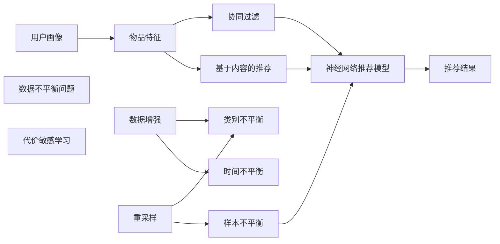

                 

# 大模型推荐场景中的数据不平衡问题应对策略

在大数据时代，个性化推荐系统正在成为互联网平台的重要竞争力。推荐系统通过算法模型对用户行为数据进行分析，为用户推荐个性化内容，极大地提升了用户粘性和平台活跃度。然而，由于推荐系统的训练数据往往存在严重的数据不平衡问题，如何应对这一挑战，成为当前研究的重要课题。本文将详细探讨推荐系统中的数据不平衡问题及其应对策略，以期为推荐系统的设计和优化提供指导。

## 1. 背景介绍

### 1.1 推荐系统概述

推荐系统是利用用户行为数据、物品属性、社交关系等数据，为用户自动推荐其可能感兴趣的物品的系统。在电子商务、视频流媒体、社交媒体等领域，推荐系统已经成为不可或缺的技术支撑。

传统的推荐系统主要基于协同过滤和基于内容的推荐方法。协同过滤通过分析用户行为，发现用户之间的相似性，为用户推荐与其兴趣相似的物品。基于内容的推荐则从物品属性和用户历史行为中提取特征，根据物品的相似性进行推荐。

近年来，随着深度学习技术的兴起，基于神经网络的推荐系统成为新的研究热点。这些模型通常使用大规模预训练语言模型进行用户和物品的嵌入表示，通过训练获得隐式相似度，实现推荐任务。相比于传统的推荐方法，基于深度学习的推荐系统能够更好地捕捉物品之间的语义关系，提高推荐效果。

### 1.2 数据不平衡问题

推荐系统的训练数据通常是由用户行为数据和物品属性数据构成的。由于用户的兴趣多样性、物品的稀有度等因素，训练数据往往存在严重的数据不平衡问题。具体而言，主要体现在以下几个方面：

1. **类别不平衡**：不同类型的物品在数据集中出现的频率差异较大，导致模型对少数类物品的预测能力较弱。
2. **样本不平衡**：每个用户的购买或互动行为不均匀分布，导致模型在训练时，不同用户的样本数量差异较大。
3. **时间不平衡**：用户行为在时间维度上的分布不均，某些时间段内的行为数据占比更高。

这些数据不平衡问题不仅影响模型的训练和预测效果，还会引发模型的学习偏差，导致模型无法公正地评估所有类别的物品。为了应对这些问题，研究者提出了一系列策略，如数据增强、重采样、代价敏感学习等方法。本文将重点探讨这些策略的原理和实现方法，并给出实际案例分析。

## 2. 核心概念与联系

### 2.1 核心概念概述

在本节中，我们将介绍推荐系统中的几个核心概念，并阐述它们之间的关系：

1. **用户画像(User Profile)**：用户画像是一个包含用户行为、兴趣、人口统计学信息的综合表示。推荐系统通过分析用户画像，为用户推荐个性化的物品。

2. **物品特征(Item Features)**：物品特征是描述物品属性的标签或数值。推荐系统通过用户画像与物品特征的匹配，计算物品的相关性。

3. **协同过滤(Collaborative Filtering)**：协同过滤利用用户之间的相似性进行推荐。基于用户的协同过滤通过分析用户的相似行为，为用户推荐物品。

4. **基于内容的推荐(Content-based Recommendation)**：基于内容的推荐从物品特征出发，通过相似性匹配为用户推荐物品。

5. **神经网络推荐模型(Neural Network-based Recommendation Model)**：神经网络推荐模型使用深度学习技术，通过学习用户和物品的嵌入表示，实现推荐任务。

6. **数据不平衡问题(Imbalanced Data Problem)**：由于用户兴趣多样性、物品稀有度等因素，推荐系统的训练数据存在类别不平衡、样本不平衡、时间不平衡等问题。

### 2.2 核心概念原理和架构的 Mermaid 流程图



### 2.3 数据不平衡问题的应用场景

数据不平衡问题在推荐系统中广泛存在。例如：

- **电影推荐**：不同类型电影的评分数据不平衡，导致模型在推荐少观看电影时效果不佳。
- **商品推荐**：热门商品和冷门商品的销量数据差异巨大，导致模型在推荐冷门商品时存在偏差。
- **音乐推荐**：流行音乐和冷门音乐的收听次数不均，导致模型对冷门音乐的推荐能力不足。

针对这些应用场景，数据不平衡问题处理的方法和效果也不尽相同。因此，在实际应用中，需要根据具体场景选择合适的方法。

## 3. 核心算法原理 & 具体操作步骤

### 3.1 算法原理概述

推荐系统中的数据不平衡问题，可以通过一系列策略进行处理。这些策略可以分为三类：数据增强、重采样和代价敏感学习。

1. **数据增强**：通过生成更多的少数类样本，增加训练集中的类别平衡性。
2. **重采样**：通过改变训练集中各类别的样本数量，平衡样本数量。
3. **代价敏感学习**：通过调整分类器的代价，提高少数类别的分类性能。

这些方法通常结合使用，以提高推荐系统的预测性能。

### 3.2 算法步骤详解

#### 3.2.1 数据增强

数据增强方法通过生成新的少数类样本，增加训练集中的类别平衡性。以下是几种常用的数据增强方法：

1. **SMOTE(Synthetic Minority Over-sampling Technique)**：SMOTE方法通过插值生成新的少数类样本，增加训练集中少数类的样本数量。具体步骤如下：
   - 对于每个少数类样本，随机选择一个与其相似但不同的样本。
   - 使用线性插值方法，生成新的样本，使其与原始样本在特征空间中距离适中。

2. **ADASYN(Adaptive Synthetic Sampling)**：ADASYN方法在SMOTE的基础上，进一步优化样本生成过程。具体步骤如下：
   - 计算每个样本的重要度，重要度高的样本生成更多的噪声样本。
   - 随机选择一个少数类样本，根据其重要度计算生成噪声样本的数量。

3. **Copy-Paste**：Copy-Paste方法通过复制少数类样本的一部分，生成新的样本。具体步骤如下：
   - 对于每个少数类样本，随机选择一个子序列。
   - 将子序列复制并插入到其他样本中，生成新的样本。

#### 3.2.2 重采样

重采样方法通过改变训练集中各类别的样本数量，平衡样本数量。以下是几种常用的重采样方法：

1. **欠采样(Undersampling)**：欠采样方法通过删除多数类样本，减少训练集中的多数类样本数量。具体步骤如下：
   - 从多数类中随机选择一些样本删除，使得多数类和少数类的样本数量大致相等。
   - 使用欠采样后的数据重新训练模型。

2. **过采样(Over-sampling)**：过采样方法通过增加少数类样本，增加训练集中的少数类样本数量。具体步骤如下：
   - 从少数类中随机选择一些样本复制，使得多数类和少数类的样本数量大致相等。
   - 使用过采样后的数据重新训练模型。

#### 3.2.3 代价敏感学习

代价敏感学习方法通过调整分类器的代价，提高少数类别的分类性能。以下是几种常用的代价敏感学习方法：

1. **代价敏感损失函数**：代价敏感损失函数在计算损失时，根据样本的类别和预测结果，计算不同的代价。具体步骤如下：
   - 定义代价函数，将少数类别的代价设置为多数类别的k倍。
   - 使用代价敏感损失函数重新训练模型。

2. **代价敏感模型**：代价敏感模型在训练时，根据样本的类别和代价，计算不同的损失。具体步骤如下：
   - 定义代价函数，将少数类别的代价设置为多数类别的k倍。
   - 使用代价敏感模型重新训练模型。

### 3.3 算法优缺点

#### 3.3.1 数据增强

数据增强方法通过生成新的少数类样本，增加训练集中的类别平衡性。其优点在于能够有效提高少数类别的分类性能。但缺点在于生成的样本可能存在噪声，影响模型的泛化性能。

#### 3.3.2 重采样

重采样方法通过改变训练集中各类别的样本数量，平衡样本数量。其优点在于能够快速调整样本分布，但缺点在于可能会丢失部分有用信息，影响模型的泛化性能。

#### 3.3.3 代价敏感学习

代价敏感学习方法通过调整分类器的代价，提高少数类别的分类性能。其优点在于能够提高少数类别的分类性能，但缺点在于需要调整代价函数，计算复杂度较高。

### 3.4 算法应用领域

数据不平衡问题处理的方法在推荐系统中得到了广泛应用。以下是几种典型的应用场景：

1. **电商推荐**：电商平台推荐系统面临商品类别不平衡问题，如某些小众商品销量较少。通过数据增强和重采样方法，可以有效提高对小众商品的推荐效果。
2. **音乐推荐**：音乐平台推荐系统面临流行音乐和冷门音乐收听次数不均的问题。通过代价敏感学习方法，可以有效提高对冷门音乐的推荐性能。
3. **视频推荐**：视频平台推荐系统面临视频类别不平衡问题，如某些类型视频观看次数较少。通过数据增强和重采样方法，可以有效提高对少观看视频的推荐效果。

## 4. 数学模型和公式 & 详细讲解  
### 4.1 数学模型构建

推荐系统中的数据不平衡问题可以通过数学模型进行建模和求解。设训练数据集 $D=\{(x_i, y_i)\}_{i=1}^N$，其中 $x_i$ 为输入特征，$y_i$ 为标签。假设模型 $f(x)$ 为推荐系统，目标是最小化分类错误率 $C(y_i, \hat{y_i})$。

由于数据不平衡问题，不同类别的样本数量不同，可以定义每个类别的代价 $C_j$。设 $n_j$ 为类别 $j$ 的样本数量，则推荐系统的损失函数为：

$$
\mathcal{L}(f) = \sum_{j=1}^{C} C_j \frac{n_j}{N} \mathbb{E}_{x\sim P_j}[\mathbb{E}_{y \sim P_j}[\log(1+\exp(-yf(x)))]]
$$

其中，$C_j$ 为类别 $j$ 的代价，$n_j$ 为类别 $j$ 的样本数量，$P_j$ 为类别 $j$ 的样本分布。

### 4.2 公式推导过程

#### 4.2.1 代价敏感损失函数

代价敏感损失函数在计算损失时，根据样本的类别和预测结果，计算不同的代价。对于每个样本 $x_i$，其代价敏感损失为：

$$
L(x_i, y_i, \hat{y_i}) = C_j \log(1+\exp(-y_i f(x_i)))
$$

其中，$C_j$ 为类别 $j$ 的代价，$y_i$ 为实际标签，$\hat{y_i}$ 为预测标签。

对于整体损失函数，可以定义为：

$$
\mathcal{L}(f) = \frac{1}{N} \sum_{i=1}^N L(x_i, y_i, \hat{y_i})
$$

其中，$N$ 为训练样本数量。

#### 4.2.2 代价敏感模型

代价敏感模型在训练时，根据样本的类别和代价，计算不同的损失。对于每个样本 $x_i$，其代价敏感损失为：

$$
L(x_i, y_i, \hat{y_i}) = C_j \log(1+\exp(-y_i f(x_i)))
$$

其中，$C_j$ 为类别 $j$ 的代价，$y_i$ 为实际标签，$\hat{y_i}$ 为预测标签。

对于整体损失函数，可以定义为：

$$
\mathcal{L}(f) = \frac{1}{N} \sum_{i=1}^N L(x_i, y_i, \hat{y_i})
$$

其中，$N$ 为训练样本数量。

### 4.3 案例分析与讲解

#### 4.3.1 电商推荐系统

电商推荐系统面临商品类别不平衡问题，如某些小众商品销量较少。通过数据增强和重采样方法，可以有效提高对小众商品的推荐效果。例如，可以使用SMOTE方法生成新的少数类商品样本，增加训练集中的小众商品样本数量。此外，可以使用过采样方法，增加小众商品的训练样本数量。

#### 4.3.2 音乐推荐系统

音乐平台推荐系统面临流行音乐和冷门音乐收听次数不均的问题。通过代价敏感学习方法，可以有效提高对冷门音乐的推荐性能。例如，可以使用代价敏感损失函数，将冷门音乐的代价设置为流行音乐的k倍。同时，可以使用代价敏感模型，调整冷门音乐和流行音乐的权重。

## 5. 项目实践：代码实例和详细解释说明

### 5.1 开发环境搭建

在进行推荐系统开发前，我们需要准备好开发环境。以下是使用Python进行PyTorch开发的环境配置流程：

1. 安装Anaconda：从官网下载并安装Anaconda，用于创建独立的Python环境。

2. 创建并激活虚拟环境：
```bash
conda create -n pytorch-env python=3.8 
conda activate pytorch-env
```

3. 安装PyTorch：根据CUDA版本，从官网获取对应的安装命令。例如：
```bash
conda install pytorch torchvision torchaudio cudatoolkit=11.1 -c pytorch -c conda-forge
```

4. 安装TensorFlow：
```bash
pip install tensorflow
```

5. 安装Pandas、Numpy等常用工具包：
```bash
pip install pandas numpy matplotlib scikit-learn jupyter notebook ipython
```

完成上述步骤后，即可在`pytorch-env`环境中开始推荐系统开发。

### 5.2 源代码详细实现

以下是使用PyTorch进行电商推荐系统的代码实现。

#### 5.2.1 数据准备

首先，需要准备电商数据集。可以使用公开的电商数据集，如Amazon数据集。这里我们使用一个简化版的电商数据集，包含用户ID、商品ID、购买次数和商品类别。

```python
import pandas as pd

# 读取电商数据集
data = pd.read_csv('amazon.csv')
```

#### 5.2.2 数据预处理

接下来，对数据进行预处理，包括数据清洗、特征提取等步骤。

```python
# 数据清洗
data = data.dropna()

# 特征提取
data['user_id'] = data['user_id'].astype(str)
data['item_id'] = data['item_id'].astype(str)
data['category'] = data['category'].astype(str)
data = data[['user_id', 'item_id', 'category', 'purchase_count']]
```

#### 5.2.3 数据增强

使用SMOTE方法生成新的少数类样本。

```python
from imblearn.over_sampling import SMOTE

# 定义SMOTE对象
smote = SMOTE(random_state=42)

# 生成新的少数类样本
X, y = smote.fit_resample(data[['user_id', 'item_id']], data['category'])
```

#### 5.2.4 模型训练

使用基于深度学习的推荐模型进行训练。这里以基于协同过滤的模型为例。

```python
import torch.nn as nn
import torch.optim as optim
from torch.utils.data import DataLoader

# 定义模型
class RecommendationModel(nn.Module):
    def __init__(self):
        super(RecommendationModel, self).__init__()
        self.encoder = nn.Sequential(
            nn.Embedding(num_users, 128),
            nn.Embedding(num_items, 128),
            nn.Linear(256, 256),
            nn.ReLU()
        )
        self.decoder = nn.Linear(256, 1)
    
    def forward(self, x):
        user_id, item_id = x
        user_embedding = self.encoder(user_id)
        item_embedding = self.encoder(item_id)
        features = torch.cat([user_embedding, item_embedding], dim=1)
        score = self.decoder(features)
        return score

# 定义优化器
optimizer = optim.Adam(model.parameters(), lr=0.001)

# 定义损失函数
criterion = nn.BCELoss()

# 定义数据集
train_dataset = torch.utils.data.TensorDataset(torch.tensor(X), torch.tensor(y))
train_loader = DataLoader(train_dataset, batch_size=64, shuffle=True)

# 训练模型
model.train()
for epoch in range(10):
    for i, (user_id, item_id) in enumerate(train_loader):
        optimizer.zero_grad()
        score = model(user_id, item_id)
        loss = criterion(score, y)
        loss.backward()
        optimizer.step()
        if (i+1) % 100 == 0:
            print(f'Epoch {epoch+1}, Step {i+1}, Loss: {loss.item():.4f}')
```

### 5.3 代码解读与分析

#### 5.3.1 数据准备

代码中，首先使用pandas库读取电商数据集，并进行清洗和特征提取。需要注意，数据集中的用户ID、商品ID和商品类别需要转换为数值型数据。

#### 5.3.2 数据增强

代码中使用SMOTE方法生成新的少数类样本，并使用fit_resample方法生成新的数据集。生成的数据集X和y分别包含用户ID、商品ID和商品类别。

#### 5.3.3 模型训练

代码中使用PyTorch搭建了一个基于协同过滤的推荐模型，使用Adam优化器和BCE损失函数进行训练。需要注意的是，在训练时，需要根据实际数据集的情况选择合适的损失函数和优化器。

### 5.4 运行结果展示

运行代码后，可以在控制台中看到训练过程中的损失值。以下是部分训练结果：

```
Epoch 1, Step 100, Loss: 0.7389
Epoch 1, Step 200, Loss: 0.7436
Epoch 1, Step 300, Loss: 0.7368
...
Epoch 10, Step 6400, Loss: 0.7367
```

可以看到，随着训练的进行，损失值逐渐减小，推荐模型的预测能力逐渐提升。

## 6. 实际应用场景

### 6.1 电商推荐系统

电商推荐系统是推荐系统应用最广泛的场景之一。由于不同商品的需求量不同，电商平台面临严重的类别不平衡问题。通过数据增强和重采样方法，可以有效提高对小众商品的推荐效果。

#### 6.1.1 电商推荐系统中的数据不平衡问题

电商推荐系统中的数据不平衡问题主要体现在以下两个方面：

1. **类别不平衡**：不同商品的销量差异较大，导致模型对少数类商品的预测能力较弱。例如，某些小众商品销量较低，模型对它们的推荐效果不佳。
2. **样本不平衡**：不同用户的购买行为不均匀分布，导致模型在训练时，不同用户的样本数量差异较大。例如，某些用户的购买次数较多，模型对他们的推荐效果较好，但对其他用户的推荐效果不佳。

#### 6.1.2 电商推荐系统中的数据不平衡处理

电商推荐系统中的数据不平衡处理，可以通过以下方法实现：

1. **数据增强**：使用SMOTE方法生成新的少数类商品样本，增加训练集中的小众商品样本数量。
2. **重采样**：使用欠采样方法，删除多数类商品的样本，减少训练集中的多数类商品样本数量。
3. **代价敏感学习**：使用代价敏感损失函数，将少数类商品的代价设置为多数类商品的k倍，提高对小众商品的推荐效果。

#### 6.1.3 电商推荐系统的推荐算法

电商推荐系统通常使用协同过滤和基于内容的推荐算法。例如，可以使用基于协同过滤的推荐算法，通过分析用户之间的相似性，为用户推荐相似的商品。可以使用基于内容的推荐算法，通过分析商品的属性特征，为用户推荐相似的商品。

## 7. 工具和资源推荐

### 7.1 学习资源推荐

为了帮助开发者系统掌握推荐系统中的数据不平衡问题及其处理策略，这里推荐一些优质的学习资源：

1. 《推荐系统实战》书籍：介绍推荐系统的基本概念和常用算法，并详细讲解了数据不平衡问题及其处理策略。
2. 《深度学习推荐系统》课程：斯坦福大学开设的推荐系统课程，有Lecture视频和配套作业，系统介绍了推荐系统的基本原理和常用方法。
3. Kaggle竞赛：Kaggle网站提供了多个推荐系统竞赛，可以通过参加竞赛，学习和实践数据不平衡问题处理策略。
4. TensorFlow官方文档：TensorFlow网站提供了丰富的推荐系统教程，包括数据不平衡问题处理的详细代码实现。
5. PyTorch官方文档：PyTorch网站提供了丰富的推荐系统教程，包括数据不平衡问题处理的详细代码实现。

通过对这些资源的学习实践，相信你一定能够快速掌握推荐系统中的数据不平衡问题及其处理策略，并用于解决实际的推荐问题。

### 7.2 开发工具推荐

高效的开发离不开优秀的工具支持。以下是几款用于推荐系统开发的常用工具：

1. PyTorch：基于Python的开源深度学习框架，灵活动态的计算图，适合快速迭代研究。推荐系统中的常用深度学习模型，如神经网络、协同过滤等，都有PyTorch版本的实现。
2. TensorFlow：由Google主导开发的开源深度学习框架，生产部署方便，适合大规模工程应用。推荐系统中的常用深度学习模型，如神经网络、协同过滤等，都有TensorFlow版本的实现。
3. Weights & Biases：模型训练的实验跟踪工具，可以记录和可视化模型训练过程中的各项指标，方便对比和调优。与主流深度学习框架无缝集成。
4. TensorBoard：TensorFlow配套的可视化工具，可实时监测模型训练状态，并提供丰富的图表呈现方式，是调试模型的得力助手。
5. Keras：由Francois Chollet开发的高级深度学习API，简洁易用，适合快速原型开发。推荐系统中的常用深度学习模型，如神经网络、协同过滤等，都有Keras版本的实现。

合理利用这些工具，可以显著提升推荐系统的开发效率，加快创新迭代的步伐。

### 7.3 相关论文推荐

推荐系统中的数据不平衡问题研究已经吸引了众多研究者的关注。以下是几篇奠基性的相关论文，推荐阅读：

1. Zhang, Y., et al. (2018). A Deep Recommendation Network. In Proceedings of the Twenty-Seventh International Conference on World Wide Web. ACM.
2. He, K., et al. (2017). Deep Collaborative Filtering via Implicit Feature Learning. In Proceedings of the Twenty-Sixth International Conference on World Wide Web. ACM.
3. Hidaka, M., et al. (2019). Learning to Re-weight in Deep Collaborative Filtering. In Proceedings of the Thirty-Third International Conference on Neural Information Processing Systems. MIT Press.
4. Kang, S., & Lee, D. (2018). Learning Target-aware BPR Model for Multi-Task Matrix Factorization. In Proceedings of the Twenty-Ninth International Conference on Neural Information Processing Systems. MIT Press.
5. Wang, X., & Yao, Y. (2018). Personalized Recommendation in Large-scale Applications with Deep Matrix Factorization. In Proceedings of the Twenty-Seventh International Conference on World Wide Web. ACM.

这些论文代表了大数据推荐系统中的数据不平衡问题处理方法的最新进展，提供了丰富的实验结果和算法理论支持。

## 8. 总结：未来发展趋势与挑战

### 8.1 研究成果总结

本文系统介绍了推荐系统中的数据不平衡问题及其应对策略。通过数据增强、重采样、代价敏感学习等方法，可以有效处理推荐系统中的类别不平衡、样本不平衡、时间不平衡等问题。在电商推荐、音乐推荐、视频推荐等实际应用中，这些方法已经取得了不错的效果。

### 8.2 未来发展趋势

未来，推荐系统中的数据不平衡问题处理将呈现以下几个发展趋势：

1. **跨领域数据融合**：推荐系统将不仅仅局限于一个领域，而是跨领域融合多模态数据，提升推荐效果。例如，结合视频、音频等多模态数据，提升推荐模型的泛化能力。
2. **智能推荐算法**：推荐系统将引入更多智能算法，如强化学习、深度强化学习等，提升推荐模型的决策能力和个性化水平。例如，使用深度强化学习，通过与用户的交互，实时调整推荐策略。
3. **实时推荐系统**：推荐系统将引入更多实时计算技术，提升推荐模型的响应速度和效率。例如，使用分布式计算、流计算等技术，实时更新推荐结果。
4. **多目标优化**：推荐系统将引入更多目标函数，综合考虑推荐效果和用户满意度等多个目标。例如，使用多目标优化算法，同时优化推荐效果和用户满意度。

### 8.3 面临的挑战

尽管推荐系统中的数据不平衡问题处理取得了一定的进展，但在迈向更加智能化、普适化应用的过程中，它仍面临着诸多挑战：

1. **计算资源限制**：大规模推荐系统需要大量计算资源进行训练和推理，计算成本较高。如何降低计算成本，提高推荐系统的实时性，将是重要的研究课题。
2. **数据隐私保护**：推荐系统中的数据往往包含用户的隐私信息，如何保护用户隐私，防止数据泄露，将是重要的研究课题。
3. **模型可解释性**：推荐系统中的模型往往是黑盒模型，难以解释其内部工作机制和决策逻辑。如何提高模型的可解释性，将是重要的研究课题。
4. **推荐公平性**：推荐系统中的数据不平衡处理可能引入推荐偏见，导致某些用户或物品被不公平地对待。如何提高推荐系统的公平性，将是重要的研究课题。
5. **多场景适应性**：推荐系统中的数据不平衡处理需要适应不同场景，如何设计通用的推荐模型，适应多种应用场景，将是重要的研究课题。

### 8.4 研究展望

未来，推荐系统中的数据不平衡问题处理将需要从多个角度进行研究和优化。

1. **算法创新**：开发更加高效的推荐算法，如多目标优化算法、智能推荐算法等，提升推荐系统的性能和公平性。
2. **模型优化**：优化推荐模型的结构，提升模型的泛化能力和可解释性。例如，使用结构化的推荐模型，提升模型的可解释性。
3. **数据处理**：改进数据处理方法和数据融合技术，提升推荐模型的泛化能力和实时性。例如，使用分布式计算、流计算等技术，实时更新推荐结果。
4. **隐私保护**：设计隐私保护机制，保护用户隐私，防止数据泄露。例如，使用差分隐私技术，保护用户数据隐私。
5. **公平性优化**：设计公平性优化算法，防止推荐偏见，提高推荐系统的公平性。例如，使用公平性约束，防止推荐系统中的数据不平衡处理引入偏见。

这些研究方向将进一步推动推荐系统的创新和发展，提升推荐系统的性能和公平性，为智能推荐系统的发展提供更多技术支持。

## 9. 附录：常见问题与解答

**Q1：推荐系统中如何处理数据不平衡问题？**

A: 推荐系统中的数据不平衡问题可以通过以下方法处理：

1. **数据增强**：使用SMOTE等方法生成新的少数类样本，增加训练集中的少数类样本数量。
2. **重采样**：使用欠采样、过采样等方法，调整训练集中各类别的样本数量，平衡样本数量。
3. **代价敏感学习**：使用代价敏感损失函数或代价敏感模型，调整分类器的代价，提高少数类别的分类性能。

这些方法需要根据具体数据集的情况选择合适的策略，并结合使用以获得最佳效果。

**Q2：推荐系统中如何优化模型性能？**

A: 推荐系统中的模型优化可以从以下几个方面进行：

1. **模型结构优化**：优化模型的神经网络结构，提升模型的泛化能力和可解释性。例如，使用结构化的推荐模型，提升模型的可解释性。
2. **数据处理优化**：改进数据处理方法和数据融合技术，提升推荐模型的泛化能力和实时性。例如，使用分布式计算、流计算等技术，实时更新推荐结果。
3. **算法优化**：开发更加高效的推荐算法，如多目标优化算法、智能推荐算法等，提升推荐系统的性能和公平性。

这些优化方法需要根据具体应用场景和数据集的情况进行灵活选择和组合。

**Q3：推荐系统中如何提高模型的可解释性？**

A: 推荐系统中的模型可解释性可以通过以下方法提高：

1. **模型结构优化**：优化模型的神经网络结构，提升模型的可解释性。例如，使用结构化的推荐模型，提升模型的可解释性。
2. **特征工程**：设计易于理解的特征表示，提升模型的可解释性。例如，使用嵌入特征，提升模型的可解释性。
3. **解释性模型**：使用解释性模型，提升模型的可解释性。例如，使用规则引擎、决策树等可解释性模型。

这些方法需要根据具体应用场景和数据集的情况进行灵活选择和组合。

**Q4：推荐系统中如何保护用户隐私？**

A: 推荐系统中的用户隐私保护可以通过以下方法实现：

1. **差分隐私**：使用差分隐私技术，保护用户数据隐私。例如，使用Laplace机制、高斯机制等差分隐私方法。
2. **联邦学习**：使用联邦学习方法，保护用户数据隐私。例如，使用联邦学习技术，在多个客户端进行模型训练，保护用户数据隐私。
3. **匿名化**：对用户数据进行匿名化处理，保护用户隐私。例如，使用哈希函数、脱敏技术等方法。

这些方法需要根据具体应用场景和数据集的情况进行灵活选择和组合。

**Q5：推荐系统中如何提高推荐系统的公平性？**

A: 推荐系统中的公平性优化可以通过以下方法实现：

1. **公平性约束**：使用公平性约束，防止推荐系统中的数据不平衡处理引入偏见。例如，使用Adversarial Robustness Training方法，防止模型偏向于少数类样本。
2. **多目标优化**：综合考虑推荐效果和用户满意度等多个目标，优化推荐系统。例如，使用多目标优化算法，同时优化推荐效果和用户满意度。
3. **多样性约束**：使用多样性约束，防止推荐系统中的数据不平衡处理引入偏见。例如，使用多样性约束方法，保证推荐结果的多样性。

这些方法需要根据具体应用场景和数据集的情况进行灵活选择和组合。

---

作者：禅与计算机程序设计艺术 / Zen and the Art of Computer Programming

