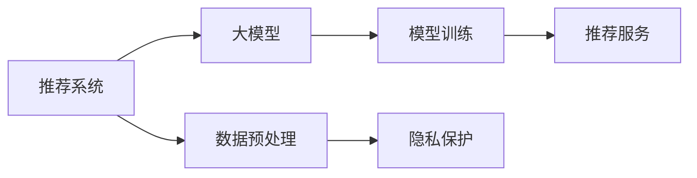

                 

# 大模型推荐系统的隐私保护问题

## 1. 背景介绍

随着人工智能技术在各行各业的深入应用，推荐系统成为众多平台提升用户体验、增加收益的重要工具。然而，传统推荐系统主要基于用户行为数据进行个性化推荐，难以确保用户的隐私权益。在数据隐私保护日益受到重视的背景下，基于大模型的推荐系统应运而生，该系统利用用户行为数据进行预训练，然后将大模型应用到个性化推荐场景，避免对用户隐私的直接暴露。但与此同时，大模型推荐系统也面临着隐私保护的新挑战。

### 1.1 问题由来
当前主流推荐系统主要基于协同过滤、基于内容的推荐等方法，通过分析用户行为数据（如浏览、点击、购买记录等）来推荐个性化的内容。然而，这些方法存在数据隐私泄露的风险，用户行为数据被不当使用，可能导致用户隐私泄露。特别是在线上购物、社交媒体、视频网站等平台，用户的隐私保护尤为关键。此外，一些企业出于商业竞争考量，可能会利用用户行为数据进行反竞争分析，如了解用户的消费习惯、兴趣偏好等。

相比之下，基于大模型的推荐系统通过学习海量数据，能够在保持用户隐私的同时，提供更加精准和个性化的推荐服务。近年来，Google、Amazon、Netflix等公司纷纷采用大模型进行推荐系统优化，显著提升了推荐效果。但大模型的使用也带来了新的隐私保护问题，如何在利用大模型提供推荐服务的同时，确保用户隐私安全，成为推荐系统隐私保护的新焦点。

## 2. 核心概念与联系

### 2.1 核心概念概述

为了深入理解大模型推荐系统的隐私保护问题，本节将介绍几个关键概念及其相互联系：

- 推荐系统：通过分析用户行为数据，向用户推荐符合其兴趣和需求的个性化内容。传统的推荐系统基于协同过滤、基于内容的推荐等方法，而大模型推荐系统则通过预训练模型进行推荐。
- 大模型：指通过大规模数据预训练的深度学习模型，如BERT、GPT-3、Transformer等。大模型通常具有更强的泛化能力，能够在保持隐私的同时，提供更精准的推荐。
- 隐私保护：指在数据收集、存储、使用、传输等各个环节，采取措施保护用户数据的安全性和用户隐私。大模型推荐系统在隐私保护方面，需要考虑从数据预处理、模型训练、推荐服务等多个维度进行保护。
- 数据预处理：指对原始用户数据进行去标识化、匿名化、脱敏等处理，以降低隐私泄露风险。常用的方法包括K-匿名化、L-多样性、差分隐私等。
- 模型训练：指利用预处理后的数据进行模型训练，以优化模型参数，提升推荐效果。在大模型推荐系统中，需要特别关注训练数据来源和数据处理方式。
- 推荐服务：指根据用户行为数据，使用训练好的模型进行个性化推荐。在大模型推荐系统中，需要确保推荐过程不暴露用户数据。

这些概念构成了大模型推荐系统的核心，它们之间的关系可以用以下Mermaid流程图来展示：



在这个流程图中，推荐系统利用数据预处理后的数据进行大模型训练，并通过训练好的模型进行推荐服务。在这个过程中，隐私保护贯穿始终，保护用户数据的安全性和隐私。

## 3. 核心算法原理 & 具体操作步骤
### 3.1 算法原理概述

基于大模型的推荐系统，通常采用监督学习和迁移学习的思想。首先，利用海量无标签数据对大模型进行预训练，使其能够学习到通用的用户行为表示。然后，将预训练好的大模型应用于具体的推荐场景，通过少量标注数据进行微调，优化推荐模型。

在大模型推荐系统中，隐私保护是一个重要组成部分。为了保护用户隐私，需要在推荐模型的训练和推理过程中，尽可能减少用户数据的使用和暴露。常见的隐私保护技术包括差分隐私、联邦学习、多方安全计算等。

### 3.2 算法步骤详解

以下是基于大模型的推荐系统隐私保护的主要步骤：

**Step 1: 数据预处理**
- 数据去标识化：对原始用户数据进行去标识化处理，如去除用户的姓名、身份证号、地理位置等敏感信息。
- 数据匿名化：通过数据扰动等技术，使数据中的个体难以被识别，如添加噪声、随机置换等。
- 数据脱敏：对敏感数据进行遮盖、掩盖等处理，如将部分用户数据转化为虚拟数据。
- 数据差分隐私：在数据处理和模型训练过程中，采用差分隐私技术，确保单个用户数据对模型输出的影响很小。

**Step 2: 数据集划分**
- 将预处理后的数据集分为训练集、验证集和测试集。
- 对每个数据集进行划分，确保各个数据集中的用户数据分布相似。

**Step 3: 模型训练**
- 选择合适的预训练语言模型，如BERT、GPT等。
- 使用预处理后的训练集对大模型进行微调，优化推荐模型。
- 在模型训练过程中，使用差分隐私等技术保护用户隐私。

**Step 4: 推荐服务**
- 在推荐服务过程中，不暴露用户行为数据，只使用预训练和微调后的模型进行推荐。
- 通过统计特征、用户画像等方法，替代部分用户行为数据。
- 在推荐服务过程中，采用多方安全计算等技术保护用户隐私。

**Step 5: 隐私保护评估**
- 定期评估推荐系统在隐私保护方面的表现，如隐私泄露风险、用户隐私保护效果等。
- 根据评估结果，调整隐私保护策略和推荐模型参数。

### 3.3 算法优缺点

基于大模型的推荐系统隐私保护方法具有以下优点：

1. **高推荐精度**：利用大模型的强大表示能力，推荐系统能够提供更精准的个性化推荐。
2. **泛化能力**：大模型通常具有更好的泛化能力，能够在不同场景下保持稳定的推荐效果。
3. **隐私保护**：通过数据预处理、差分隐私等技术，保护用户隐私，避免隐私泄露。

然而，该方法也存在一些缺点：

1. **计算成本高**：大模型的训练和推理计算成本较高，对硬件要求较高。
2. **隐私保护技术复杂**：隐私保护技术如差分隐私、联邦学习等，技术复杂度高，实现难度大。
3. **推荐个性化不足**：由于隐私保护限制，部分用户行为数据可能无法使用，导致推荐个性化程度降低。

## 4. 数学模型和公式 & 详细讲解 & 举例说明
### 4.1 数学模型构建

在大模型推荐系统中，隐私保护是一个重要的考虑因素。为了构建数学模型，我们需要引入隐私保护的相关概念和指标。

假设推荐系统需要预测用户对每个物品的评分，记为 $y_{ui}$，其中 $u$ 表示用户，$i$ 表示物品。模型的目标是最小化预测误差和隐私保护误差之和。

**预测误差**：
$$
\min_{\theta} \sum_{u,i}(y_{ui} - \hat{y}_{ui})^2
$$

**隐私保护误差**：
$$
\min_{\epsilon} \sum_{u,i}(y_{ui} - \hat{y}_{ui})^2 + \epsilon
$$

其中，$\epsilon$ 表示隐私保护误差，需要满足差分隐私的要求。差分隐私定义如下：
$$
\min_{\epsilon} \sum_{u,i}(y_{ui} - \hat{y}_{ui})^2 + \epsilon
$$

**差分隐私**：
$$
\epsilon
$$

差分隐私要求模型对任何单个用户的隐私泄露风险不超过 $\epsilon$。常用的差分隐私技术包括Laplace机制、高斯机制等。

### 4.2 公式推导过程

在实际应用中，差分隐私常用于隐私预算分配和隐私保护。差分隐私的核心思想是对模型输出的预测结果加入噪声，从而保护用户隐私。

假设模型对用户 $u$ 的物品 $i$ 的预测结果为 $\hat{y}_{ui}$，真实的用户评分 $y_{ui}$ 与预测结果的误差为 $\delta_{ui}$。为了保护用户隐私，需要在预测结果上加入噪声 $\delta$，从而得到最终的推荐结果。

噪声 $\delta$ 的加入方式有多种，常见的包括Laplace机制和高斯机制。以下以Laplace机制为例，推导差分隐私的加入方式。

**Laplace机制**：
$$
\hat{y}_{ui} = \hat{y}_{ui} + \delta
$$

其中，$\delta$ 的取值满足Laplace分布，即 $\delta \sim \mathcal{L}(\Delta)$，$\Delta$ 为隐私保护预算，即 $\Delta = \frac{\epsilon}{2}$。

在实际应用中，差分隐私的加入方式需要根据具体任务和隐私保护需求进行调整。通常，需要在预测结果中加入噪声 $\delta$，确保单个用户对模型输出的影响很小。

### 4.3 案例分析与讲解

假设推荐系统需要预测用户 $u$ 对物品 $i$ 的评分。模型的训练数据为 $D$，其中 $D = \{(x_j, y_j)\}_{j=1}^N$，$x_j$ 表示用户行为数据，$y_j$ 表示物品评分。

**案例1：差分隐私**
- 假设模型需要输出预测结果 $y_{ui}$。为了保护用户隐私，需要在预测结果上加入噪声 $\delta$，从而得到最终的推荐结果。

**案例2：联邦学习**
- 假设推荐系统需要与多个合作伙伴进行数据交换，每个合作伙伴提供部分用户数据。为了保护用户隐私，可以使用联邦学习技术，将数据分布式训练，避免数据集中存储和处理。

## 5. 项目实践：代码实例和详细解释说明
### 5.1 开发环境搭建

在进行隐私保护的大模型推荐系统开发之前，需要准备好开发环境。以下是使用Python进行PyTorch开发的环境配置流程：

1. 安装Anaconda：从官网下载并安装Anaconda，用于创建独立的Python环境。

2. 创建并激活虚拟环境：
```bash
conda create -n pytorch-env python=3.8 
conda activate pytorch-env
```

3. 安装PyTorch：根据CUDA版本，从官网获取对应的安装命令。例如：
```bash
conda install pytorch torchvision torchaudio cudatoolkit=11.1 -c pytorch -c conda-forge
```

4. 安装TensorFlow：如果需要使用TensorFlow，可以使用以下命令安装：
```bash
conda install tensorflow
```

5. 安装Transformers库：
```bash
pip install transformers
```

6. 安装各类工具包：
```bash
pip install numpy pandas scikit-learn matplotlib tqdm jupyter notebook ipython
```

完成上述步骤后，即可在`pytorch-env`环境中开始开发。

### 5.2 源代码详细实现

下面以基于差分隐私的推荐系统为例，给出使用PyTorch进行模型训练和推理的代码实现。

首先，定义推荐模型的预测函数：

```python
import torch
from transformers import BertForSequenceClassification

class RecommendationModel(torch.nn.Module):
    def __init__(self, num_labels):
        super(RecommendationModel, self).__init__()
        self.bert = BertForSequenceClassification.from_pretrained('bert-base-cased', num_labels=num_labels)
    
    def forward(self, input_ids, attention_mask, labels=None):
        outputs = self.bert(input_ids, attention_mask=attention_mask)
        if labels is None:
            return outputs.logits
        else:
            loss = self.bert.loss(input_ids, attention_mask, labels)
            return loss, outputs.logits
```

然后，定义差分隐私模型训练函数：

```python
from torch.utils.data import DataLoader
from transformers import AdamW

def train_model(model, train_dataset, val_dataset, epochs, batch_size, learning_rate, epsilon):
    device = torch.device('cuda') if torch.cuda.is_available() else torch.device('cpu')
    model.to(device)
    
    optimizer = AdamW(model.parameters(), lr=learning_rate)
    loss_fn = torch.nn.CrossEntropyLoss()
    
    for epoch in range(epochs):
        model.train()
        train_loss = 0.0
        train_correct = 0
        
        for batch in DataLoader(train_dataset, batch_size=batch_size, shuffle=True):
            input_ids = batch['input_ids'].to(device)
            attention_mask = batch['attention_mask'].to(device)
            labels = batch['labels'].to(device)
            
            outputs = model(input_ids, attention_mask)
            loss = outputs[0]
            logits = outputs[1]
            
            optimizer.zero_grad()
            loss.backward()
            optimizer.step()
            
            train_loss += loss.item()
            predicted = torch.argmax(logits, dim=1)
            train_correct += (predicted == labels).sum().item()
            
        train_loss /= len(train_dataset)
        train_acc = train_correct / len(train_dataset)
        
        model.eval()
        val_loss = 0.0
        val_correct = 0
        
        for batch in DataLoader(val_dataset, batch_size=batch_size, shuffle=False):
            input_ids = batch['input_ids'].to(device)
            attention_mask = batch['attention_mask'].to(device)
            labels = batch['labels'].to(device)
            
            outputs = model(input_ids, attention_mask)
            loss = outputs[0]
            logits = outputs[1]
            
            val_loss += loss.item()
            predicted = torch.argmax(logits, dim=1)
            val_correct += (predicted == labels).sum().item()
        
        val_loss /= len(val_dataset)
        val_acc = val_correct / len(val_dataset)
        
        print(f'Epoch {epoch+1}, train loss: {train_loss:.4f}, train acc: {train_acc:.4f}, val loss: {val_loss:.4f}, val acc: {val_acc:.4f}')
```

最后，在训练过程中加入差分隐私的实现：

```python
def privacy_train_model(model, train_dataset, val_dataset, epochs, batch_size, learning_rate, epsilon):
    device = torch.device('cuda') if torch.cuda.is_available() else torch.device('cpu')
    model.to(device)
    
    optimizer = AdamW(model.parameters(), lr=learning_rate)
    loss_fn = torch.nn.CrossEntropyLoss()
    
    for epoch in range(epochs):
        model.train()
        train_loss = 0.0
        train_correct = 0
        
        for batch in DataLoader(train_dataset, batch_size=batch_size, shuffle=True):
            input_ids = batch['input_ids'].to(device)
            attention_mask = batch['attention_mask'].to(device)
            labels = batch['labels'].to(device)
            
            with torch.no_grad():
                outputs = model(input_ids, attention_mask)
                loss = outputs[0]
                logits = outputs[1]
            
            noisy_logits = torch.randn_like(logits) * epsilon
            noisy_logits += logits
            loss_noisy = loss_fn(noisy_logits, labels)
            
            optimizer.zero_grad()
            loss_noisy.backward()
            optimizer.step()
            
            train_loss += loss.item()
            predicted = torch.argmax(noisy_logits, dim=1)
            train_correct += (predicted == labels).sum().item()
            
        train_loss /= len(train_dataset)
        train_acc = train_correct / len(train_dataset)
        
        model.eval()
        val_loss = 0.0
        val_correct = 0
        
        for batch in DataLoader(val_dataset, batch_size=batch_size, shuffle=False):
            input_ids = batch['input_ids'].to(device)
            attention_mask = batch['attention_mask'].to(device)
            labels = batch['labels'].to(device)
            
            with torch.no_grad():
                outputs = model(input_ids, attention_mask)
                loss = outputs[0]
                logits = outputs[1]
            
            noisy_logits = torch.randn_like(logits) * epsilon
            noisy_logits += logits
            loss_noisy = loss_fn(noisy_logits, labels)
            
            val_loss += loss_noisy.item()
            predicted = torch.argmax(noisy_logits, dim=1)
            val_correct += (predicted == labels).sum().item()
        
        val_loss /= len(val_dataset)
        val_acc = val_correct / len(val_dataset)
        
        print(f'Epoch {epoch+1}, train loss: {train_loss:.4f}, train acc: {train_acc:.4f}, val loss: {val_loss:.4f}, val acc: {val_acc:.4f}')
```

## 6. 实际应用场景
### 6.1 智能推荐系统

基于差分隐私的大模型推荐系统，可以应用于智能推荐系统。推荐系统需要根据用户行为数据，推荐符合其兴趣和需求的商品、文章、视频等内容。

在实际应用中，推荐系统需要考虑用户隐私保护。具体而言，可以使用差分隐私技术，对用户的浏览、点击等行为数据进行去标识化处理，确保用户隐私不被泄露。同时，利用大模型的强大表示能力，提供更精准和个性化的推荐服务。

**案例分析**：
- 假设推荐系统需要预测用户对电影内容的评分。首先，使用差分隐私技术对用户的浏览记录进行去标识化处理。然后，利用BERT等大模型进行微调，预测用户对电影内容的评分。最终，使用预测结果进行推荐。

### 6.2 社交媒体平台

社交媒体平台需要根据用户的兴趣和行为，推荐相关的内容和广告。基于差分隐私的大模型推荐系统，可以在保护用户隐私的前提下，提供更精准和个性化的推荐。

在实际应用中，社交媒体平台需要考虑用户隐私保护。具体而言，可以使用差分隐私技术，对用户的点赞、评论、分享等行为数据进行去标识化处理。同时，利用大模型的强大表示能力，提供更精准和个性化的内容推荐和广告推荐。

**案例分析**：
- 假设社交媒体平台需要推荐用户感兴趣的文章。首先，使用差分隐私技术对用户的点赞、评论等行为数据进行去标识化处理。然后，利用BERT等大模型进行微调，预测用户对文章内容的兴趣程度。最终，使用预测结果进行推荐。

### 6.3 视频网站

视频网站需要根据用户的浏览行为，推荐相关视频内容。基于差分隐私的大模型推荐系统，可以在保护用户隐私的前提下，提供更精准和个性化的视频推荐。

在实际应用中，视频网站需要考虑用户隐私保护。具体而言，可以使用差分隐私技术，对用户的浏览记录进行去标识化处理。同时，利用大模型的强大表示能力，提供更精准和个性化的视频推荐。

**案例分析**：
- 假设视频网站需要推荐用户感兴趣的视频内容。首先，使用差分隐私技术对用户的浏览记录进行去标识化处理。然后，利用BERT等大模型进行微调，预测用户对视频内容的兴趣程度。最终，使用预测结果进行推荐。

## 7. 工具和资源推荐
### 7.1 学习资源推荐

为了帮助开发者系统掌握大模型推荐系统的隐私保护理论基础和实践技巧，这里推荐一些优质的学习资源：

1. 《Recommender Systems: The Textbook》系列博文：由大模型推荐系统专家撰写，深入浅出地介绍了推荐系统的工作原理、常见问题和解决策略，提供了丰富的案例分析。

2. CS445《信息检索与推荐系统》课程：斯坦福大学开设的推荐系统明星课程，有Lecture视频和配套作业，带你入门推荐系统领域的基本概念和经典模型。

3. 《Introduction to Recommender Systems》书籍：推荐系统经典教材，全面介绍了推荐系统的理论基础和实践技巧，是推荐系统学习的必备资源。

4. Kaggle数据集：推荐系统竞赛常用数据集，包含各类推荐任务的数据和注释，是推荐系统实践的绝佳平台。

通过对这些资源的学习实践，相信你一定能够快速掌握大模型推荐系统的隐私保护方法，并用于解决实际的推荐系统问题。

### 7.2 开发工具推荐

高效的开发离不开优秀的工具支持。以下是几款用于大模型推荐系统开发的常用工具：

1. PyTorch：基于Python的开源深度学习框架，灵活动态的计算图，适合快速迭代研究。大部分预训练语言模型都有PyTorch版本的实现。

2. TensorFlow：由Google主导开发的开源深度学习框架，生产部署方便，适合大规模工程应用。同样有丰富的预训练语言模型资源。

3. Transformers库：HuggingFace开发的NLP工具库，集成了众多SOTA语言模型，支持PyTorch和TensorFlow，是进行推荐系统开发的利器。

4. Weights & Biases：模型训练的实验跟踪工具，可以记录和可视化模型训练过程中的各项指标，方便对比和调优。与主流深度学习框架无缝集成。

5. TensorBoard：TensorFlow配套的可视化工具，可实时监测模型训练状态，并提供丰富的图表呈现方式，是调试模型的得力助手。

6. Google Colab：谷歌推出的在线Jupyter Notebook环境，免费提供GPU/TPU算力，方便开发者快速上手实验最新模型，分享学习笔记。

合理利用这些工具，可以显著提升大模型推荐系统的开发效率，加快创新迭代的步伐。

### 7.3 相关论文推荐

大模型推荐系统隐私保护的研究源于学界的持续研究。以下是几篇奠基性的相关论文，推荐阅读：

1. Differential Privacy in Recommendation Systems：提出基于差分隐私的推荐系统算法，保护用户隐私。

2. Privacy-Preserving Collaborative Filtering Based on Federated Learning：利用联邦学习技术，保护用户隐私，同时提高推荐系统的性能。

3. Multi-Party Computation in Recommender Systems：提出基于多方安全计算的推荐系统算法，保护用户隐私。

4. Secure Recommendation System Using Differential Privacy：利用差分隐私技术，保护用户隐私，同时提高推荐系统的安全性。

5. Privacy-Aware Recommendation System Using Clustering and Differential Privacy：提出基于聚类和差分隐私的推荐系统算法，保护用户隐私，同时提高推荐系统的性能。

这些论文代表了大模型推荐系统隐私保护的发展脉络。通过学习这些前沿成果，可以帮助研究者把握学科前进方向，激发更多的创新灵感。

## 8. 总结：未来发展趋势与挑战
### 8.1 总结

本文对基于差分隐私的大模型推荐系统进行了全面系统的介绍。首先阐述了推荐系统的背景和隐私保护的重要性，明确了差分隐私在大模型推荐系统中的应用价值。其次，从原理到实践，详细讲解了差分隐私的数学模型和实现方法，给出了推荐系统开发的完整代码实例。同时，本文还广泛探讨了差分隐私在大模型推荐系统中的应用场景，展示了差分隐私范式的广泛应用。此外，本文精选了差分隐私学习的各类学习资源，力求为读者提供全方位的技术指引。

通过本文的系统梳理，可以看到，基于差分隐私的大模型推荐系统正在成为推荐系统领域的重要范式，极大地拓展了推荐系统的应用边界，催生了更多的落地场景。得益于差分隐私和大模型的协同应用，推荐系统能够在不影响用户隐私的前提下，提供更精准和个性化的服务。未来，伴随差分隐私和大模型技术的持续演进，相信推荐系统将在更广阔的应用领域大放异彩，深刻影响人类的生产生活方式。

### 8.2 未来发展趋势

展望未来，差分隐私在大模型推荐系统中的应用将呈现以下几个发展趋势：

1. 技术成熟度提高。随着差分隐私技术的不断发展，差分隐私在大模型推荐系统中的应用将更加成熟，能够更好地平衡隐私保护和推荐效果。

2. 应用场景多样化。差分隐私技术将被广泛应用于各类推荐场景，如社交媒体、视频网站、电子商务等，提供更精准和个性化的推荐服务。

3. 隐私保护策略多元化。除了差分隐私技术外，联邦学习、多方安全计算等隐私保护技术也将在大模型推荐系统中得到广泛应用，提供更强大的隐私保护能力。

4. 隐私保护和推荐效果的均衡。如何在保持隐私保护的前提下，提升推荐系统的性能，将是未来的重要研究方向。

5. 跨领域应用。差分隐私技术将在更多领域得到应用，如医疗、金融、教育等，推动不同领域的技术融合和创新。

以上趋势凸显了大模型推荐系统隐私保护技术的广阔前景。这些方向的探索发展，必将进一步提升推荐系统的性能和应用范围，为人类生产生活方式的进步提供新的动力。

### 8.3 面临的挑战

尽管差分隐私在大模型推荐系统中的应用已经取得了一定进展，但在迈向更加智能化、普适化应用的过程中，它仍面临着诸多挑战：

1. 隐私保护与推荐效果的平衡。差分隐私技术虽然能够保护用户隐私，但可能会牺牲部分推荐效果。如何在隐私保护和推荐效果之间找到平衡，将是未来的重要研究方向。

2. 隐私预算分配。差分隐私技术的核心是隐私预算的分配，需要根据具体应用场景和隐私需求，合理分配隐私预算，确保隐私保护的效果。

3. 计算资源消耗。差分隐私技术需要在训练和推理过程中加入噪声，可能会导致计算资源消耗增加。如何在保证隐私保护的前提下，提高计算效率，是一个重要的研究方向。

4. 算法复杂性。差分隐私技术涉及复杂的算法和参数调整，需要研究者具备深厚的数学和算法背景，才能有效应用。

5. 用户隐私感知。差分隐私技术虽然能够保护用户隐私，但用户对其信任度如何，是否感知到隐私保护的效果，也是一个需要考虑的问题。

6. 模型解释性。差分隐私技术加入噪声后，模型的输出解释性变差，如何提高模型的可解释性，是一个亟待解决的问题。

以上挑战是差分隐私技术在大模型推荐系统中应用过程中需要克服的问题。只有深入研究和解决这些问题，才能使差分隐私技术在大模型推荐系统中发挥更大的作用。

### 8.4 研究展望

面向未来，差分隐私技术在大模型推荐系统中的应用需要从以下几个方向进行突破：

1. 结合联邦学习和差分隐私技术。联邦学习能够在大模型推荐系统中进行分布式训练，减少隐私泄露风险。结合差分隐私技术，能够更好地保护用户隐私，提高推荐系统的性能。

2. 引入因果推断方法。因果推断方法能够在大模型推荐系统中进行因果关系建模，提高推荐系统的鲁棒性和可靠性。结合差分隐私技术，能够更好地保护用户隐私，提高推荐系统的公平性和可解释性。

3. 引入多任务学习。多任务学习能够在不同任务间共享知识，提高推荐系统的泛化能力和性能。结合差分隐私技术，能够更好地保护用户隐私，提高推荐系统的稳定性和可靠性。

4. 引入对抗训练方法。对抗训练方法能够在推荐系统中对抗噪声和攻击，提高推荐系统的鲁棒性和安全性。结合差分隐私技术，能够更好地保护用户隐私，提高推荐系统的性能和安全性。

这些研究方向的探索，必将引领差分隐私技术在大模型推荐系统中的应用走向更高的台阶，为推荐系统技术的未来发展提供新的动力。

## 9. 附录：常见问题与解答

**Q1：差分隐私在大模型推荐系统中的应用有哪些优点？**

A: 差分隐私在大模型推荐系统中的应用具有以下优点：

1. 保护用户隐私。差分隐私技术能够保护用户隐私，避免用户行为数据被泄露。

2. 提高推荐精度。差分隐私技术加入噪声后，模型能够更好地泛化到新数据，提高推荐系统的性能。

3. 适应性强。差分隐私技术适用于不同场景和不同类型的数据，能够广泛应用到各类推荐系统中。

4. 可解释性。差分隐私技术能够提供透明的隐私保护机制，提高模型的可解释性和可信度。

**Q2：差分隐私技术在大模型推荐系统中的应用有哪些局限性？**

A: 差分隐私技术在大模型推荐系统中的应用存在以下局限性：

1. 隐私保护与推荐效果之间的平衡。差分隐私技术虽然能够保护用户隐私，但可能会牺牲部分推荐效果。如何在隐私保护和推荐效果之间找到平衡，将是未来的重要研究方向。

2. 隐私预算分配。差分隐私技术的核心是隐私预算的分配，需要根据具体应用场景和隐私需求，合理分配隐私预算，确保隐私保护的效果。

3. 计算资源消耗。差分隐私技术需要在训练和推理过程中加入噪声，可能会导致计算资源消耗增加。如何在保证隐私保护的前提下，提高计算效率，是一个重要的研究方向。

4. 算法复杂性。差分隐私技术涉及复杂的算法和参数调整，需要研究者具备深厚的数学和算法背景，才能有效应用。

5. 用户隐私感知。差分隐私技术虽然能够保护用户隐私，但用户对其信任度如何，是否感知到隐私保护的效果，也是一个需要考虑的问题。

6. 模型解释性。差分隐私技术加入噪声后，模型的输出解释性变差，如何提高模型的可解释性，是一个亟待解决的问题。

**Q3：如何在大模型推荐系统中实现隐私保护？**

A: 在大模型推荐系统中实现隐私保护，可以采用以下策略：

1. 数据预处理：对原始用户数据进行去标识化、匿名化、脱敏等处理，以降低隐私泄露风险。

2. 差分隐私：在数据处理和模型训练过程中，采用差分隐私技术，确保单个用户数据对模型输出的影响很小。

3. 联邦学习：利用联邦学习技术，将数据分布式训练，避免数据集中存储和处理。

4. 多方安全计算：利用多方安全计算技术，确保模型推理过程中不暴露用户数据。

5. 对抗训练：引入对抗训练方法，提高模型鲁棒性和安全性。

6. 可解释性模型：使用可解释性模型，提高模型的可解释性和透明度。

通过以上策略，可以在大模型推荐系统中实现隐私保护，确保用户数据的安全性和隐私性。

**Q4：差分隐私技术在大模型推荐系统中的具体应用有哪些？**

A: 差分隐私技术在大模型推荐系统中的具体应用包括：

1. 数据预处理：对原始用户数据进行去标识化、匿名化、脱敏等处理，以降低隐私泄露风险。

2. 差分隐私模型训练：在模型训练过程中，加入噪声保护用户隐私。

3. 差分隐私推荐服务：在推荐服务过程中，不暴露用户行为数据，只使用差分隐私模型进行推荐。

4. 差分隐私聚类：利用差分隐私技术，对用户数据进行聚类，保护用户隐私。

5. 差分隐私异常检测：利用差分隐私技术，对用户数据进行异常检测，保护用户隐私。

6. 差分隐私关联规则挖掘：利用差分隐私技术，对用户数据进行关联规则挖掘，保护用户隐私。

通过以上应用，差分隐私技术能够在大模型推荐系统中实现隐私保护，确保用户数据的安全性和隐私性。

**Q5：差分隐私技术在大模型推荐系统中的关键步骤有哪些？**

A: 差分隐私技术在大模型推荐系统中的关键步骤包括：

1. 数据预处理：对原始用户数据进行去标识化、匿名化、脱敏等处理，以降低隐私泄露风险。

2. 差分隐私模型训练：在模型训练过程中，加入噪声保护用户隐私。

3. 差分隐私推荐服务：在推荐服务过程中，不暴露用户行为数据，只使用差分隐私模型进行推荐。

4. 隐私保护评估：定期评估推荐系统在隐私保护方面的表现，如隐私泄露风险、用户隐私保护效果等。

5. 调整隐私保护策略：根据隐私保护评估结果，调整隐私保护策略和推荐模型参数。

通过以上关键步骤，可以在大模型推荐系统中实现隐私保护，确保用户数据的安全性和隐私性。

