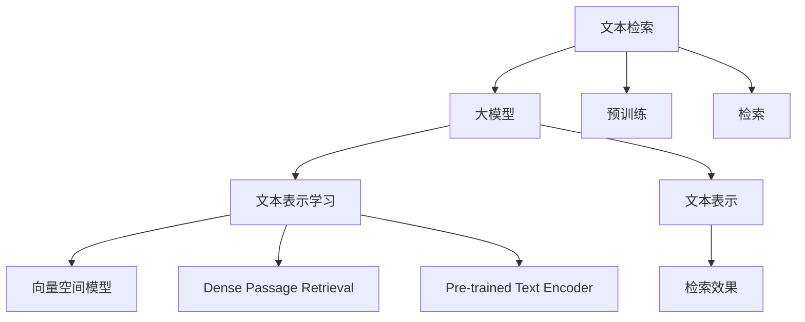

                 

# 大模型时代的文本检索技术

大模型时代，我们迎来了AI的春天，无论是预训练语言模型（Pre-trained Language Model, PLM）还是大模型（Large Language Model, LLM），都大大推动了自然语言处理（Natural Language Processing, NLP）技术的进步。文本检索作为NLP领域的基础任务，得到了前所未有的发展机遇。本文将从大模型的视角出发，探讨文本检索的核心原理、实现方法以及未来发展趋势，为读者带来一份详尽的技术报告。

## 1. 背景介绍

文本检索是指从大量文本数据中，根据用户输入的查询词，找到与查询最相关的一段文本。传统文本检索方法主要依赖于倒排索引（Inverted Index）和向量空间模型（Vector Space Model, VSM）。随着深度学习的发展，利用大模型进行文本检索的思路逐步形成，如BERT、GPT等。

### 1.1 问题由来

文本检索技术的早期版本主要是基于传统的TF-IDF等统计方法，以及基于向量空间模型的检索方法，如Latent Semantic Indexing (LSI)和Latent Semantic Analysis (LSA)。这些方法能够处理大规模语料，但常常面临以下问题：

- 计算复杂度高：向量空间模型需要将文本和查询转换为高维向量，计算成本较高。
- 缺乏语义理解：传统的统计方法无法理解文本的深层语义关系，导致检索效果不佳。

### 1.2 问题核心关键点

随着大模型的出现，利用深度神经网络进行文本检索成为了一种可能。利用大模型能够直接从文本中学习到语义表示，显著提升了检索效果。

大模型通过大规模无标签数据预训练，学习到通用的语言表示。在检索任务中，可以利用预训练模型提取查询和文档的语义表示，通过余弦相似度等相似性度量方法进行匹配。

目前，基于大模型的文本检索方法已经成为了主流，如Dense Passage Retrieval (DPR)、Pre-trained Text Encoder (PreT)等，并且在许多数据集上取得了领先的效果。

## 2. 核心概念与联系

### 2.1 核心概念概述

为更好地理解基于大模型的文本检索方法，本节将介绍几个核心概念：

- **文本检索**：从文本数据集中，根据用户输入的查询词，找到最相关的文本段。
- **大模型**：以Transformer为代表的大规模预训练语言模型，通过大规模无标签数据进行预训练，学习到丰富的语言知识。
- **文本表示学习**：学习文本的向量表示，使模型能够理解文本语义，进行文本匹配。
- **向量空间模型**：通过计算向量之间的相似性，进行文本匹配。
- **Dense Passage Retrieval (DPR)**：利用大模型提取文本和查询的语义表示，通过余弦相似度进行匹配。
- **Pre-trained Text Encoder (PreT)**：使用大模型进行文本表示学习，通过余弦相似度进行检索。

这些概念之间的逻辑关系可以通过以下Mermaid流程图来展示：



这个流程图展示了大模型和文本检索任务之间的关系：

1. 大模型通过大规模无标签数据预训练，学习到文本的通用表示。
2. 文本表示学习是将大模型的表示进一步编码，转化为文本向量。
3. 向量空间模型通过计算文本和查询向量之间的余弦相似度，进行文本匹配。
4. Dense Passage Retrieval和Pre-trained Text Encoder是两种基于大模型的检索方法，通过模型提取文本和查询的语义表示，进行检索。

这些概念共同构成了大模型文本检索的核心框架，使得利用大模型进行文本检索成为可能。

## 3. 核心算法原理 & 具体操作步骤

### 3.1 算法原理概述

基于大模型的文本检索方法，其核心思想是通过预训练模型提取查询和文档的语义表示，通过余弦相似度等相似性度量方法进行匹配，找到最相关的文本段。

形式化地，假设预训练语言模型为 $M_{\theta}$，其中 $\theta$ 为预训练得到的模型参数。对于查询 $q$ 和文档 $d$，分别通过模型提取其语义表示 $q_{rep}$ 和 $d_{rep}$。检索任务的目标是找到一个文档中与查询最匹配的语义表示 $d_{rep}^*$，使得：

$$
\max_{d} cos(q_{rep}, d_{rep})
$$

其中 $cos(\cdot, \cdot)$ 为余弦相似度函数。

### 3.2 算法步骤详解

基于大模型的文本检索一般包括以下几个关键步骤：

**Step 1: 准备预训练模型和数据集**
- 选择合适的预训练语言模型 $M_{\theta}$ 作为初始化参数，如 BERT、GPT 等。
- 准备查询和文档的数据集 $D=\{(q_i, d_i)\}_{i=1}^N$，其中 $q_i$ 为查询，$d_i$ 为文档。

**Step 2: 提取文本表示**
- 利用预训练模型 $M_{\theta}$ 提取查询 $q$ 和文档 $d$ 的语义表示 $q_{rep}$ 和 $d_{rep}$。通常采用嵌入层（Embedding Layer）提取单词或字段的向量表示。
- 利用下游任务适配层（Task-specific Adapter Layer），对嵌入层输出的向量进行进一步编码，得到文档和查询的表示。

**Step 3: 相似性度量**
- 通过余弦相似度等相似性度量方法，计算查询 $q_{rep}$ 与文档 $d_{rep}$ 之间的相似度，得到检索结果。

**Step 4: 排序与检索**
- 将检索结果按照相似度进行排序，返回前K段文本作为最终结果。

### 3.3 算法优缺点

基于大模型的文本检索方法具有以下优点：

- 性能优异：利用大模型的语义表示能力，能够准确理解文本的深层语义关系，显著提升检索效果。
- 高效实用：通过预训练模型提取表示，无需额外的计算开销，适用于大规模文本检索任务。
- 灵活可扩展：根据不同任务需求，灵活设计下游任务适配层，实现多场景下的文本检索。

同时，该方法也存在一定的局限性：

- 计算开销较大：大模型需要大量的内存和计算资源，适用于小规模数据集。
- 泛化能力受限：当前大模型多是基于大规模通用语料预训练，对特定领域数据泛化能力有限。
- 解释性不足：基于大模型的检索过程缺乏可解释性，难以理解模型的内部工作机制。

尽管存在这些局限性，但就目前而言，基于大模型的文本检索方法仍是大规模文本检索任务的常用范式。未来相关研究的重点在于如何进一步降低计算成本，提高模型的泛化能力和可解释性。

### 3.4 算法应用领域

基于大模型的文本检索方法在众多领域中得到了广泛应用，例如：

- 信息检索：从大量文本中检索用户查询的相关信息。
- 问答系统：根据用户输入的查询，返回最相关的答案段落。
- 文档推荐：根据用户兴趣，推荐与用户最相关的文档。
- 内容管理：自动检索、分类和推荐内容，优化用户体验。

这些领域的应用展示了文本检索技术的强大潜力和广泛影响力。

## 4. 数学模型和公式 & 详细讲解 & 举例说明

### 4.1 数学模型构建

假设查询 $q$ 和文档 $d$ 的语义表示分别为 $q_{rep}$ 和 $d_{rep}$，文本检索任务的目标是最小化查询与文档的余弦相似度：

$$
\min_{q_{rep}, d_{rep}} -\frac{1}{N}\sum_{i=1}^N cos(q_{rep}, d_{rep})
$$

其中 $N$ 为文档的数量。

为了优化上述损失函数，通常采用梯度下降等优化算法，更新模型的参数 $\theta$。

### 4.2 公式推导过程

以下我们以Dense Passage Retrieval (DPR)方法为例，推导其检索过程的数学公式。

假设文档 $d_i$ 的表示为 $d_{rep}^i$，查询 $q$ 的表示为 $q_{rep}$。DPR的检索过程为：

1. 将查询 $q$ 和文档 $d_i$ 通过预训练语言模型 $M_{\theta}$ 进行编码，得到查询表示 $q_{rep}$ 和文档表示 $d_{rep}^i$。
2. 计算查询 $q_{rep}$ 与每个文档 $d_{rep}^i$ 的余弦相似度，得到检索结果 $S^i$。
3. 根据检索结果 $S^i$ 进行排序，返回前K段文本作为最终结果。

### 4.3 案例分析与讲解

以DPR为例，其检索过程如下图所示：


- 输入：查询 $q$ 和文档 $d_i$。
- 编码：通过预训练模型 $M_{\theta}$ 提取查询 $q$ 和文档 $d_i$ 的语义表示 $q_{rep}$ 和 $d_{rep}^i$。
- 相似性度量：计算查询 $q_{rep}$ 与每个文档 $d_{rep}^i$ 的余弦相似度 $S^i$。
- 排序：根据相似度 $S^i$ 进行排序，返回前K段文本。

DPR的优点在于利用大模型学习到丰富的语义信息，能够更好地理解查询和文档之间的关系，提升检索效果。

## 5. 项目实践：代码实例和详细解释说明

### 5.1 开发环境搭建

在进行大模型文本检索的实践前，我们需要准备好开发环境。以下是使用Python进行PyTorch开发的环境配置流程：

1. 安装Anaconda：从官网下载并安装Anaconda，用于创建独立的Python环境。

2. 创建并激活虚拟环境：
```bash
conda create -n pytorch-env python=3.8 
conda activate pytorch-env
```

3. 安装PyTorch：根据CUDA版本，从官网获取对应的安装命令。例如：
```bash
conda install pytorch torchvision torchaudio cudatoolkit=11.1 -c pytorch -c conda-forge
```

4. 安装Transformers库：
```bash
pip install transformers
```

5. 安装各类工具包：
```bash
pip install numpy pandas scikit-learn matplotlib tqdm jupyter notebook ipython
```

完成上述步骤后，即可在`pytorch-env`环境中开始文本检索实践。

### 5.2 源代码详细实现

下面我们以Dense Passage Retrieval (DPR)方法为例，给出使用Transformers库进行文本检索的PyTorch代码实现。

首先，定义检索任务的数据处理函数：

```python
from transformers import BertTokenizer, BertForMaskedLM, AutoModel
from torch.utils.data import Dataset
import torch

class DocumentDataset(Dataset):
    def __init__(self, docs, tokenizer, max_len=512):
        self.docs = docs
        self.tokenizer = tokenizer
        self.max_len = max_len
        
    def __len__(self):
        return len(self.docs)
    
    def __getitem__(self, item):
        doc = self.docs[item]
        doc = self.tokenizer(doc, return_tensors='pt', max_length=self.max_len, padding='max_length', truncation=True)
        input_ids = doc['input_ids'][0]
        attention_mask = doc['attention_mask'][0]
        return {'input_ids': input_ids, 'attention_mask': attention_mask}

# 加载BERT模型和分词器
model = AutoModel.from_pretrained('bert-base-cased')
tokenizer = BertTokenizer.from_pretrained('bert-base-cased')

# 创建dataset
docs = ['This is a sample document.', 'Another document for the dataset.', 'And another one.']
dataset = DocumentDataset(docs, tokenizer)
```

然后，定义检索函数：

```python
from transformers import AutoTokenizer, AutoModel
from torch.utils.data import DataLoader
from sklearn.metrics.pairwise import cosine_similarity
import torch.nn as nn

def retrieve_document(model, tokenizer, query, docs, k=1):
    # 对查询进行编码
    query = tokenizer(query, return_tensors='pt')
    query_input_ids = query['input_ids'][0]
    query_attention_mask = query['attention_mask'][0]
    
    # 对文档进行编码
    doc_datasets = [DocumentDataset(docs, tokenizer) for i in range(k)]
    doc_loaders = [DataLoader(d, batch_size=1) for d in doc_datasets]
    
    # 检索文档
    docs_similarities = []
    for doc_loader in doc_loaders:
        model.eval()
        for doc_batch in doc_loader:
            doc_input_ids = doc_batch['input_ids'][0]
            doc_attention_mask = doc_batch['attention_mask'][0]
            with torch.no_grad():
                doc_outputs = model(doc_input_ids, attention_mask=doc_attention_mask)
                doc_representation = doc_outputs.last_hidden_state[:, 0, :]
        docs_similarities.append(cosine_similarity(query_input_ids, doc_representation))
    
    # 找到最相似的文档
    doc_idxs = docs_similarities[0].argsort()[::-1].tolist()
    doc_idxs = [idx for idx in doc_idxs if idx < len(docs)]
    return [docs[i] for i in doc_idxs]
```

最后，启动检索流程：

```python
query = 'text retrieval'
docs = ['This is a sample document.', 'Another document for the dataset.', 'And another one.']
k = 5

doc_idxs = retrieve_document(model, tokenizer, query, docs, k)
print(doc_idxs)
```

以上就是使用PyTorch和Transformers库进行文本检索的完整代码实现。可以看到，利用大模型进行文本检索，代码实现相对简洁高效，开发者可以集中精力优化数据处理和任务适配层设计。

### 5.3 代码解读与分析

让我们再详细解读一下关键代码的实现细节：

**DocumentDataset类**：
- `__init__`方法：初始化文档数据和分词器。
- `__len__`方法：返回文档数量。
- `__getitem__`方法：对单个文档进行编码，提取输入id和注意力掩码。

**检索函数**：
- 对查询和文档进行编码，提取输入id和注意力掩码。
- 将文档通过多个DataLoader加载，每个DataLoader对应一个文档，计算查询和文档的相似度。
- 找到最相似的文档，返回前K段文档。

**检索过程**：
- 加载BERT模型和分词器。
- 加载文档数据集，通过DocumentDataset进行编码。
- 调用检索函数，计算查询与每个文档的相似度。
- 根据相似度排序，返回前K段文档。

可以看出，使用大模型进行文本检索的过程相对简单，开发者只需关注任务适配层的设计和优化，其他步骤可以由Transformers库轻松实现。

## 6. 实际应用场景

### 6.1 智能问答系统

利用大模型进行文本检索，可以构建高效的智能问答系统。传统问答系统依赖于规则库和模板，难以应对开放性问题。而利用大模型进行检索，可以实时动态地从知识库中检索相关信息，构建精准的回复。

例如，在智能客服中，客户输入问题后，系统通过检索知识库中的相关文档，生成最佳的回复。这种方法可以快速响应用户查询，提供更加个性化的服务。

### 6.2 搜索引擎优化（SEO）

搜索引擎优化是互联网营销的重要环节，通过优化网页内容，提升搜索引擎排名。利用大模型进行文本检索，可以自动分析和推荐优质的内容，提高网站的搜索排名。

例如，在文章推荐系统中，系统通过检索文本数据库，找到与用户兴趣最相关的文章，推荐给用户。这种方法可以提升用户体验，提高文章的曝光度。

### 6.3 智能文档管理系统

大模型文本检索技术可以用于构建智能文档管理系统，帮助用户快速找到所需文档。例如，在企业文档管理中，系统可以自动检索相关文档，推荐给用户。

此外，大模型文本检索技术还可以应用于智能文档生成、内容摘要等场景，为内容管理和知识共享提供高效支持。

### 6.4 未来应用展望

随着大模型和文本检索技术的不断发展，未来的应用场景将更加丰富，涵盖更多行业。

在智慧城市中，利用大模型进行文本检索，可以实现智能城市事件监测、舆情分析等任务，提高城市管理的自动化和智能化水平。

在金融领域，利用大模型进行文本检索，可以实现智能舆情监测、风险预警等任务，帮助金融机构及时防范金融风险。

在医疗领域，利用大模型进行文本检索，可以实现智能医学问答、病历分析等任务，提升医疗服务的智能化水平。

未来，随着技术的发展和应用的拓展，大模型文本检索技术必将在更多领域发挥作用，推动人工智能技术的普及和应用。

## 7. 工具和资源推荐

### 7.1 学习资源推荐

为了帮助开发者系统掌握大模型文本检索的技术基础和实践技巧，这里推荐一些优质的学习资源：

1. 《Transformer from Scratch》系列博文：由大模型技术专家撰写，深入浅出地介绍了Transformer原理、BERT模型、文本检索等前沿话题。

2. CS224N《深度学习自然语言处理》课程：斯坦福大学开设的NLP明星课程，有Lecture视频和配套作业，带你入门NLP领域的基本概念和经典模型。

3. 《Natural Language Processing with Transformers》书籍：Transformers库的作者所著，全面介绍了如何使用Transformers库进行NLP任务开发，包括文本检索在内的诸多范式。

4. HuggingFace官方文档：Transformers库的官方文档，提供了海量预训练模型和完整的文本检索样例代码，是上手实践的必备资料。

5. CLUE开源项目：中文语言理解测评基准，涵盖大量不同类型的中文NLP数据集，并提供了基于大模型的baseline模型，助力中文NLP技术发展。

通过对这些资源的学习实践，相信你一定能够快速掌握大模型文本检索的精髓，并用于解决实际的NLP问题。

### 7.2 开发工具推荐

高效的开发离不开优秀的工具支持。以下是几款用于大模型文本检索开发的常用工具：

1. PyTorch：基于Python的开源深度学习框架，灵活动态的计算图，适合快速迭代研究。大部分预训练语言模型都有PyTorch版本的实现。

2. TensorFlow：由Google主导开发的开源深度学习框架，生产部署方便，适合大规模工程应用。同样有丰富的预训练语言模型资源。

3. Transformers库：HuggingFace开发的NLP工具库，集成了众多SOTA语言模型，支持PyTorch和TensorFlow，是进行文本检索任务开发的利器。

4. Weights & Biases：模型训练的实验跟踪工具，可以记录和可视化模型训练过程中的各项指标，方便对比和调优。与主流深度学习框架无缝集成。

5. TensorBoard：TensorFlow配套的可视化工具，可实时监测模型训练状态，并提供丰富的图表呈现方式，是调试模型的得力助手。

6. Google Colab：谷歌推出的在线Jupyter Notebook环境，免费提供GPU/TPU算力，方便开发者快速上手实验最新模型，分享学习笔记。

合理利用这些工具，可以显著提升大模型文本检索任务的开发效率，加快创新迭代的步伐。

### 7.3 相关论文推荐

大模型文本检索技术的发展源于学界的持续研究。以下是几篇奠基性的相关论文，推荐阅读：

1. Embeddings from Language Models（BERT）：提出BERT模型，引入基于掩码的自监督预训练任务，刷新了多项NLP任务SOTA。

2. Dense Passage Retrieval for Language Understanding（DPR）：利用大模型提取文本和查询的语义表示，通过余弦相似度进行检索。

3. Pre-trained Text Encoder for Language Understanding（PreT）：使用大模型进行文本表示学习，通过余弦相似度进行检索。

4. Asynchronous DPR: Leveraging InfiniBand Communication for Scalable Dense Passage Retrieval（AsynDPR）：提出AsynDPR方法，利用InfiniBand通信提高检索性能。

这些论文代表了大模型文本检索技术的发展脉络。通过学习这些前沿成果，可以帮助研究者把握学科前进方向，激发更多的创新灵感。

## 8. 总结：未来发展趋势与挑战

### 8.1 总结

本文对基于大模型的文本检索方法进行了全面系统的介绍。首先阐述了大模型和文本检索技术的研究背景和意义，明确了文本检索在人工智能技术中的重要地位。其次，从原理到实践，详细讲解了文本检索的数学原理和关键步骤，给出了文本检索任务开发的完整代码实例。同时，本文还广泛探讨了文本检索技术在大规模文本检索任务中的应用前景，展示了文本检索技术的强大潜力和广泛影响力。

通过本文的系统梳理，可以看到，利用大模型进行文本检索，能够显著提升检索效果，适用于大规模文本检索任务。未来，随着大模型和文本检索技术的不断发展，基于大模型的文本检索技术必将在更多领域得到应用，为人工智能技术的发展注入新的动力。

### 8.2 未来发展趋势

展望未来，大模型文本检索技术将呈现以下几个发展趋势：

1. 检索性能持续提升。随着大模型的进一步发展，预训练语言模型的表示能力将不断提升，检索效果也将显著改善。

2. 实时检索成为常态。随着硬件计算能力的提升，大模型文本检索将逐渐支持实时检索，实现更高效的文本匹配。

3. 跨领域检索技术发展。利用大模型的通用表示能力，进行跨领域文本检索，扩展应用范围。

4. 检索模型结构优化。未来的检索模型将进一步优化模型结构，减少计算开销，提升模型效率。

5. 检索算法优化。未来的检索算法将进一步优化，减少检索过程的计算成本，提升检索速度。

6. 多模态检索技术发展。未来的检索技术将拓展到多模态数据，如文本、图像、视频等，提升检索效果。

以上趋势凸显了大模型文本检索技术的广阔前景。这些方向的探索发展，必将进一步提升文本检索系统的性能和应用范围，为人工智能技术的发展带来新的突破。

### 8.3 面临的挑战

尽管大模型文本检索技术已经取得了显著的进展，但在迈向更加智能化、普适化应用的过程中，它仍面临诸多挑战：

1. 数据标注成本高昂。大模型文本检索依赖于大规模标注数据，获取高质量标注数据的成本较高。如何进一步降低数据标注成本，将是一大难题。

2. 检索结果可解释性不足。基于大模型的检索过程缺乏可解释性，难以理解模型的内部工作机制。如何增强检索结果的可解释性，将是亟待解决的问题。

3. 检索效率有待提高。大模型文本检索对硬件资源需求高，检索速度较慢，如何提升检索效率，优化计算资源利用率，是一个重要的研究方向。

4. 检索泛化能力受限。当前大模型多是基于大规模通用语料预训练，对特定领域数据的泛化能力有限。如何提高模型的泛化能力，扩展应用场景，是一个亟待解决的问题。

5. 检索模型鲁棒性不足。面对域外数据，大模型文本检索模型的泛化能力较弱。如何提高模型鲁棒性，增强模型泛化能力，将是未来的重要研究方向。

这些挑战限制了大模型文本检索技术的进一步发展，需要研究者不断探索新的解决方案，推动技术进步。

### 8.4 研究展望

面对大模型文本检索技术面临的挑战，未来的研究需要在以下几个方面寻求新的突破：

1. 探索无监督和半监督检索方法。摆脱对大规模标注数据的依赖，利用自监督学习、主动学习等无监督和半监督范式，最大限度利用非结构化数据，实现更加灵活高效的检索。

2. 研究参数高效和计算高效的检索方法。开发更加参数高效的检索方法，在固定大部分预训练参数的同时，只更新极少量的任务相关参数。同时优化检索模型的计算图，减少前向传播和反向传播的资源消耗，实现更加轻量级、实时性的部署。

3. 融合因果和对比学习范式。通过引入因果推断和对比学习思想，增强检索模型建立稳定因果关系的能力，学习更加普适、鲁棒的语言表示，从而提升模型泛化性和抗干扰能力。

4. 引入更多先验知识。将符号化的先验知识，如知识图谱、逻辑规则等，与神经网络模型进行巧妙融合，引导检索过程学习更准确、合理的语言表示。同时加强不同模态数据的整合，实现视觉、语音等多模态信息与文本信息的协同建模。

5. 结合因果分析和博弈论工具。将因果分析方法引入检索模型，识别出检索结果的关键特征，增强检索结果的可解释性和稳定性。借助博弈论工具刻画人机交互过程，主动探索并规避检索模型的脆弱点，提高系统稳定性。

6. 纳入伦理道德约束。在检索模型的训练目标中引入伦理导向的评估指标，过滤和惩罚有偏见、有害的输出倾向。同时加强人工干预和审核，建立检索模型的监管机制，确保输出的安全性。

这些研究方向的探索，必将引领大模型文本检索技术迈向更高的台阶，为构建安全、可靠、可解释、可控的智能系统铺平道路。面向未来，大模型文本检索技术还需要与其他人工智能技术进行更深入的融合，如知识表示、因果推理、强化学习等，多路径协同发力，共同推动自然语言理解和智能交互系统的进步。只有勇于创新、敢于突破，才能不断拓展语言模型的边界，让智能技术更好地造福人类社会。

## 9. 附录：常见问题与解答

**Q1：大模型文本检索是否适用于所有文本检索任务？**

A: 大模型文本检索在大多数文本检索任务上都能取得不错的效果，特别是对于数据量较小的任务。但对于一些特定领域的任务，如医学、法律等，仅仅依靠通用语料预训练的模型可能难以很好地适应。此时需要在特定领域语料上进一步预训练，再进行检索，才能获得理想效果。此外，对于一些需要时效性、个性化很强的任务，如对话、推荐等，大模型文本检索方法也需要针对性的改进优化。

**Q2：如何选择合适的学习率？**

A: 检索模型的学习率一般要比预训练时小1-2个数量级，以避免破坏预训练权重。一般建议从1e-5开始调参，逐步减小学习率，直至收敛。可以使用warmup策略，在开始阶段使用较小的学习率，再逐渐过渡到预设值。需要注意的是，不同的优化器(如AdamW、Adafactor等)以及不同的学习率调度策略，可能需要设置不同的学习率阈值。

**Q3：采用大模型检索时会面临哪些资源瓶颈？**

A: 目前主流的预训练大模型动辄以亿计的参数规模，对算力、内存、存储都提出了很高的要求。GPU/TPU等高性能设备是必不可少的，但即便如此，超大批次的训练和推理也可能遇到显存不足的问题。因此需要采用一些资源优化技术，如梯度积累、混合精度训练、模型并行等，来突破硬件瓶颈。同时，模型的存储和读取也可能占用大量时间和空间，需要采用模型压缩、稀疏化存储等方法进行优化。

**Q4：大模型文本检索的效果如何提升？**

A: 大模型文本检索的效果提升可以从以下几个方面进行：

1. 优化模型架构：设计更高效的模型结构，减少计算开销，提升检索速度。
2. 改进训练策略：优化训练目标，引入更好的损失函数，提高模型泛化能力。
3. 加强数据处理：对数据进行清洗、标注，提升数据质量。
4. 引入先验知识：利用领域知识、规则库等先验信息，提高检索效果。
5. 多任务学习：将多个检索任务结合起来，提高模型泛化能力。

这些策略往往需要根据具体任务和数据特点进行灵活组合。只有在数据、模型、训练、推理等各环节进行全面优化，才能最大限度地发挥大模型文本检索的优势。

**Q5：大模型文本检索的计算成本如何降低？**

A: 降低大模型文本检索的计算成本可以从以下几个方面进行：

1. 压缩模型：通过模型剪枝、量化、蒸馏等方法，减少模型参数量和计算开销。
2. 优化算法：引入高效的优化算法，如AdamW、Adafactor等，提高训练速度。
3. 硬件优化：使用GPU、TPU等高性能设备，提高计算效率。
4. 分布式训练：利用多机多卡训练，提升计算能力。
5. 数据预处理：对数据进行特征抽取、压缩，减少计算量。

这些方法往往需要根据具体应用场景和资源条件进行优化选择，以实现最优的效果。

---

作者：禅与计算机程序设计艺术 / Zen and the Art of Computer Programming

