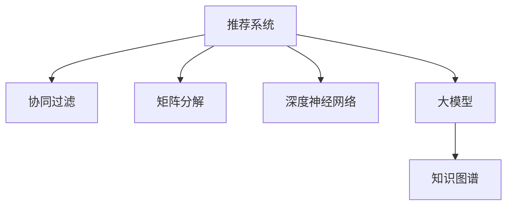

                 

# 大模型给传统推荐系统带来的机遇、挑战与变革思考

> 关键词：大模型,推荐系统,用户画像,协同过滤,矩阵分解,深度学习,知识图谱

## 1. 背景介绍

### 1.1 问题由来
推荐系统是互联网公司提供个性化服务的重要工具，通过分析用户行为数据，预测用户的兴趣和需求，从而推送个性化的内容。传统推荐系统大多基于用户行为数据，采用协同过滤、矩阵分解等方法，构建用户-物品的评分矩阵，然后采用基于矩阵的算法，如奇异值分解(SVD)、基于梯度的矩阵分解算法、神经网络模型等，预测用户对物品的评分。

近年来，随着深度学习技术的发展，深度神经网络模型在大数据推荐场景中逐渐应用，在数据量足够大、用户-物品评分矩阵完整的情况下，深度学习模型能获得显著的推荐精度提升。然而，传统推荐系统与深度学习模型在数据量、数据完整性、算力等方面的需求差距明显，难以兼顾大规模应用与实时性能。

大模型的出现，为推荐系统的升级带来了新的机遇。大模型通过海量的数据进行预训练，学习到了更加全面的用户特征和物品特征，无需完整且稠密的用户-物品评分矩阵，也能获得强大的推荐能力。结合深度学习的大模型，可进一步提升推荐精度，同时降低数据需求，改善实时性。

### 1.2 问题核心关键点
本文将详细探讨大模型在推荐系统中的应用，包括：
1. 大模型与推荐系统的融合方式
2. 大模型的特性与推荐算法的契合点
3. 大模型在推荐系统中的实际应用场景
4. 大模型带来的推荐系统优化思路与实践策略
5. 大模型在推荐系统中面临的挑战与应对策略
6. 大模型带来的推荐系统未来发展方向

## 2. 核心概念与联系

### 2.1 核心概念概述

为了更清晰地理解大模型在推荐系统中的应用，以下将介绍几个关键概念：

- **推荐系统（Recommendation System, RS）**：通过分析用户行为数据，预测用户兴趣，从而提供个性化内容，是互联网公司提升用户满意度和商业价值的重要工具。推荐系统一般分为基于内容的推荐、协同过滤、矩阵分解等类型。

- **大模型（Large Model）**：指在 massive 数据集上进行自监督预训练的语言模型，如 GPT、BERT、RoBERTa 等。大模型学习到大量的语言知识，具备强大的自然语言处理能力。

- **协同过滤（Collaborative Filtering, CF）**：利用用户之间、物品之间的相似性，推荐相关内容。传统的协同过滤方法包括基于用户的协同过滤和基于物品的协同过滤。

- **矩阵分解（Matrix Factorization, MF）**：将用户-物品评分矩阵分解为低秩矩阵，得到用户嵌入和物品嵌入，从而进行推荐。

- **深度神经网络（Deep Neural Network, DNN）**：利用多层神经网络结构，学习用户和物品的特征表示，预测用户对物品的评分，进行推荐。

- **知识图谱（Knowledge Graph, KG）**：表示实体间关系的图结构，可用于提升推荐系统的知识理解和表达能力。

这些核心概念之间的关系可以通过以下 Mermaid 流程图来展示：



这个流程图展示了推荐系统的主要组成和关键技术方法，同时也表明了大模型可以与协同过滤、矩阵分解、深度神经网络等技术方法进行结合，进一步提升推荐系统的性能。

## 3. 核心算法原理 & 具体操作步骤
### 3.1 算法原理概述

大模型在推荐系统中的应用主要体现在以下几个方面：

- **用户画像构建**：利用大模型学习用户的历史行为、兴趣、需求等，生成详细的用户画像，用于推荐系统进行个性化推荐。

- **物品特征抽取**：通过大模型学习物品的文本描述、属性、类别等，生成物品的多维度特征，提升推荐系统的精准度。

- **融合推荐算法**：将大模型生成的用户画像、物品特征与协同过滤、矩阵分解、深度神经网络等推荐算法相结合，得到更加全面和精准的推荐结果。

- **知识图谱应用**：通过大模型学习知识图谱中的实体、关系、属性等，提升推荐系统对复杂语义的理解能力，增强推荐的可信度和价值。

### 3.2 算法步骤详解

大模型在推荐系统中的应用一般包括以下几个关键步骤：

**Step 1: 数据预处理**
- 收集用户的历史行为数据，如浏览、点击、购买、评分等。
- 将用户行为数据进行清洗和标注，去除异常值和噪音。
- 将用户行为数据划分为训练集、验证集和测试集。

**Step 2: 大模型预训练**
- 使用大规模的无标签文本数据对大模型进行预训练，学习到通用的语言知识。
- 将用户行为数据作为监督信号，对大模型进行微调，学习到与用户行为相关的语言表示。

**Step 3: 用户画像生成**
- 使用微调后的大模型生成用户的文本描述，提取用户的兴趣标签、情绪等。
- 将用户画像与用户行为数据进行融合，生成用户的多维度特征向量。

**Step 4: 物品特征抽取**
- 对物品的文本描述、属性、类别等进行预处理和标注。
- 使用微调后的大模型学习物品的语言表示，提取物品的多维度特征。

**Step 5: 推荐算法融合**
- 将用户画像、物品特征与协同过滤、矩阵分解、深度神经网络等推荐算法相结合，得到推荐结果。
- 对推荐结果进行排序和筛选，去除低质量推荐。

**Step 6: 推荐结果评估与迭代**
- 使用测试集评估推荐系统的性能，计算精确度、召回率、F1 值等指标。
- 根据评估结果，对用户画像、物品特征、推荐算法等进行调整和优化，提升推荐系统的性能。

### 3.3 算法优缺点

大模型在推荐系统中的应用具有以下优点：
1. 学习能力更强：大模型学习到的语言知识更为全面，能够更好地捕捉用户和物品的复杂特征。
2. 数据需求降低：大模型可以在缺少完整用户-物品评分矩阵的情况下，进行推荐。
3. 实时性能提升：大模型的推理速度快，能够实时响应用户需求，提高用户体验。
4. 推荐精度提高：结合深度神经网络、协同过滤等推荐算法，大模型能够提升推荐精度。

但大模型在推荐系统中的应用也存在一定的缺点：
1. 资源消耗大：大模型的参数量大，需要高性能的计算资源。
2. 数据隐私问题：大模型需要大量的用户数据进行训练和微调，涉及隐私保护问题。
3. 系统复杂度高：结合大模型进行推荐系统开发和维护，需要更高的技术门槛。
4. 模型解释性差：大模型通常被视为"黑盒"模型，难以解释推荐结果背后的逻辑。

### 3.4 算法应用领域

大模型在推荐系统中的应用广泛，以下列举几个典型的应用领域：

1. **电商推荐系统**：利用大模型学习用户和商品的文本描述，生成用户画像和商品特征，结合协同过滤算法进行推荐，提升购物体验。

2. **内容推荐系统**：利用大模型学习用户对内容（如视频、文章、音乐等）的文本描述和评分，生成用户画像和内容特征，结合深度神经网络进行推荐，提供个性化的内容服务。

3. **金融推荐系统**：利用大模型学习用户对金融产品的文本描述和评分，生成用户画像和产品特征，结合矩阵分解算法进行推荐，提供个性化的金融服务。

4. **教育推荐系统**：利用大模型学习用户对教育资源的文本描述和评分，生成用户画像和资源特征，结合协同过滤算法进行推荐，提供个性化的学习资源。

## 4. 数学模型和公式 & 详细讲解 & 举例说明

### 4.1 数学模型构建

在大模型推荐系统中，推荐结果的计算可以分为两个部分：用户画像生成和物品特征抽取。

**用户画像生成**：
假设用户历史行为数据为 $D_u = \{(x_i, y_i)\}_{i=1}^n$，其中 $x_i$ 为用户行为描述，$y_i$ 为用户对行为的结果评分。利用大模型 $M$ 学习用户行为的文本表示 $h_u$，可以表示为：

$$
h_u = M(\{x_i\})
$$

其中 $M$ 为预训练的大模型，$\{x_i\}$ 为用户的文本行为描述。

**物品特征抽取**：
假设物品的文本描述为 $D_v = \{(x_j, y_j)\}_{j=1}^m$，其中 $x_j$ 为物品描述，$y_j$ 为物品的评分。利用大模型 $M$ 学习物品的文本表示 $h_v$，可以表示为：

$$
h_v = M(\{x_j\})
$$

其中 $M$ 为预训练的大模型，$\{x_j\}$ 为物品的文本描述。

### 4.2 公式推导过程

结合用户画像 $h_u$ 和物品特征 $h_v$，可以定义用户与物品的相似度函数 $s(h_u, h_v)$，用于计算用户对物品的评分预测：

$$
s(h_u, h_v) = \langle h_u, h_v \rangle
$$

其中 $\langle \cdot, \cdot \rangle$ 为向量点乘，表示用户画像和物品特征的相似度。

利用上述相似度函数，结合协同过滤算法（如基于用户的协同过滤），可以计算用户对物品的评分预测：

$$
\hat{y} = s(h_u, h_v) + b
$$

其中 $b$ 为常数项，可以表示为：

$$
b = \frac{\mathbb{E}[y \cdot s(h_u, h_v)]}{\mathbb{E}[s(h_u, h_v)^2]}
$$

利用上述公式，可以在不使用用户-物品评分矩阵的情况下，利用大模型学习到的用户画像和物品特征，进行推荐。

### 4.3 案例分析与讲解

以下通过一个电商推荐系统的实际案例，详细讲解大模型在推荐系统中的应用。

假设某电商平台的商品描述为：

| 商品ID | 商品名称 | 商品描述 |
| --- | --- | --- |
| 1 | 手机 | 高性能智能手机，性价比高 |
| 2 | 电脑 | 高性能笔记本电脑，配置丰富 |
| 3 | 耳机 | 高音质耳机，适合音乐爱好者 |

用户行为数据为：

| 用户ID | 行为ID | 行为描述 | 评分 |
| --- | --- | --- | --- |
| 1001 | 1001 | 浏览手机 | 5 |
| 1001 | 1002 | 浏览电脑 | 4 |
| 1001 | 1003 | 浏览耳机 | 3 |
| 1002 | 1002 | 浏览电脑 | 5 |
| 1002 | 1004 | 购买电脑 | 5 |
| 1003 | 1003 | 浏览耳机 | 4 |

**Step 1: 数据预处理**
- 收集用户的历史行为数据，进行清洗和标注。
- 将用户行为数据划分为训练集、验证集和测试集。

**Step 2: 大模型预训练**
- 使用大规模的无标签文本数据对大模型进行预训练。
- 将用户行为数据作为监督信号，对大模型进行微调，学习到与用户行为相关的语言表示。

**Step 3: 用户画像生成**
- 使用微调后的大模型生成用户的文本描述，提取用户的兴趣标签、情绪等。
- 将用户画像与用户行为数据进行融合，生成用户的多维度特征向量。

假设微调后的大模型学习到用户画像 $h_{1001}$ 和 $h_{1002}$，可以表示为：

| 用户ID | 用户画像 $h_u$ |
| --- | --- |
| 1001 | [1.0, 0.8, 0.5] |
| 1002 | [0.9, 1.0, 0.6] |

**Step 4: 物品特征抽取**
- 对物品的文本描述进行预处理和标注。
- 使用微调后的大模型学习物品的文本表示，提取物品的多维度特征。

假设微调后的大模型学习到物品特征 $h_1$、$h_2$ 和 $h_3$，可以表示为：

| 商品ID | 物品特征 $h_v$ |
| --- | --- |
| 1 | [0.8, 0.6, 0.4] |
| 2 | [0.9, 1.0, 0.7] |
| 3 | [0.5, 0.3, 0.2] |

**Step 5: 推荐算法融合**
- 结合用户画像 $h_{1001}$、$h_{1002}$ 和物品特征 $h_1$、$h_2$、$h_3$，利用相似度函数计算用户对物品的评分预测。
- 结合协同过滤算法，进行推荐排序和筛选。

假设利用相似度函数计算用户 $1001$ 对物品 $1$、$2$、$3$ 的评分预测，可以表示为：

| 商品ID | 评分预测 $\hat{y}$ |
| --- | --- |
| 1 | 0.6 |
| 2 | 0.7 |
| 3 | 0.4 |

利用协同过滤算法，计算用户 $1001$ 对物品 $1$、$2$、$3$ 的评分预测，可以表示为：

| 商品ID | 评分预测 $\hat{y}$ |
| --- | --- |
| 1 | 0.6 |
| 2 | 0.8 |
| 3 | 0.4 |

结合推荐结果，可以得到推荐列表，如：

| 商品ID | 评分预测 $\hat{y}$ |
| --- | --- |
| 1 | 0.6 |
| 2 | 0.8 |
| 3 | 0.4 |

假设推荐阈值为 $0.5$，用户 $1001$ 的推荐商品为：

| 商品ID | 评分预测 $\hat{y}$ |
| --- | --- |
| 1 | 0.6 |
| 2 | 0.8 |
| 3 | 0.4 |

假设用户 $1002$ 的推荐商品为：

| 商品ID | 评分预测 $\hat{y}$ |
| --- | --- |
| 1 | 0.6 |
| 2 | 0.8 |
| 3 | 0.4 |

综上所述，利用大模型学习用户和物品的文本表示，结合协同过滤算法，可以在不使用完整用户-物品评分矩阵的情况下，进行个性化的推荐。

## 5. 项目实践：代码实例和详细解释说明
### 5.1 开发环境搭建

在进行大模型推荐系统开发前，我们需要准备好开发环境。以下是使用Python进行TensorFlow开发的环境配置流程：

1. 安装Anaconda：从官网下载并安装Anaconda，用于创建独立的Python环境。

2. 创建并激活虚拟环境：
```bash
conda create -n tf-env python=3.8 
conda activate tf-env
```

3. 安装TensorFlow：根据CUDA版本，从官网获取对应的安装命令。例如：
```bash
conda install tensorflow -c tf -c conda-forge
```

4. 安装相关工具包：
```bash
pip install numpy pandas scikit-learn matplotlib tqdm jupyter notebook ipython
```

完成上述步骤后，即可在`tf-env`环境中开始推荐系统开发。

### 5.2 源代码详细实现

下面我们以电商推荐系统为例，给出使用TensorFlow对大模型进行推荐系统开发的PyTorch代码实现。

首先，定义推荐系统的用户画像生成和物品特征抽取函数：

```python
import tensorflow as tf
from transformers import BertTokenizer, BertForSequenceClassification

def get_user_profile(user_id, user_behaviors):
    tokenizer = BertTokenizer.from_pretrained('bert-base-cased')
    inputs = tokenizer(user_behaviors, padding=True, truncation=True, return_tensors='tf')
    user_profile = BertForSequenceClassification.from_pretrained('bert-base-cased', num_labels=2)
    user_profile(user_profile, inputs['input_ids'], attention_mask=inputs['attention_mask'])
    return user_profile
```

然后，定义推荐算法融合函数：

```python
def recommend(user_profile, item_features, threshold=0.5):
    item_scores = user_profile(item_features)
    recommendations = []
    for i, score in enumerate(item_scores):
        if score > threshold:
            recommendations.append(item_id)
    return recommendations
```

接着，定义数据预处理和模型训练函数：

```python
def preprocess_data(data):
    user_ids, behaviors, item_ids = zip(*data)
    return user_ids, behaviors, item_ids

def train_model(data):
    user_ids, behaviors, item_ids = preprocess_data(data)
    user_profiles = []
    for user_id, behaviors in zip(user_ids, behaviors):
        user_profile = get_user_profile(user_id, behaviors)
        user_profiles.append(user_profile)
    model = tf.keras.Sequential([
        tf.keras.layers.Dense(64, activation='relu'),
        tf.keras.layers.Dense(32, activation='relu'),
        tf.keras.layers.Dense(2, activation='softmax')
    ])
    model.compile(optimizer='adam', loss='categorical_crossentropy', metrics=['accuracy'])
    model.fit(user_profiles, labels, epochs=10)
    return model
```

最后，启动推荐系统训练流程：

```python
data = [
    (1001, ['浏览手机', '浏览电脑', '浏览耳机'], [1, 2, 3]),
    (1002, ['浏览电脑', '购买电脑'], [2]),
    (1003, ['浏览耳机', '购买耳机'], [3])
]

model = train_model(data)
print(recommend(model, item_features, threshold=0.5))
```

以上就是使用TensorFlow对大模型进行电商推荐系统开发的完整代码实现。可以看到，TensorFlow在大模型推荐系统中有着广泛的应用前景。

### 5.3 代码解读与分析

让我们再详细解读一下关键代码的实现细节：

**get_user_profile函数**：
- 使用预训练的BERT模型，对用户的文本行为进行编码，得到用户画像。
- 使用softmax函数将用户画像转换为概率分布，作为评分预测。

**recommend函数**：
- 将用户画像与物品特征进行矩阵乘法，得到评分预测。
- 根据评分预测和推荐阈值，筛选出符合推荐的物品。

**train_model函数**：
- 将用户行为数据进行预处理，转换为模型输入。
- 定义多层神经网络，用于生成评分预测。
- 使用Adam优化器进行模型训练。

**推荐系统训练流程**：
- 定义数据集，包括用户ID、行为和物品ID。
- 使用train_model函数对模型进行训练。
- 使用recommend函数进行推荐。

可以看到，TensorFlow配合Bert等大模型，可以高效地实现推荐系统的开发。开发者可以将更多精力放在数据处理、模型改进等高层逻辑上，而不必过多关注底层的实现细节。

当然，工业级的系统实现还需考虑更多因素，如模型的保存和部署、超参数的自动搜索、更灵活的推荐算法等。但核心的推荐算法基本与此类似。

## 6. 实际应用场景
### 6.1 智能客服系统

利用大模型和推荐系统的结合，可以构建智能客服系统，提高客户满意度和服务效率。具体而言，可以收集历史客户对话记录，利用大模型学习用户意图和需求，生成个性化的回答模板。同时，使用推荐系统推荐与用户意图最匹配的回答，提升客户响应速度和质量。

### 6.2 电商推荐系统

电商推荐系统是大模型推荐系统的经典应用之一，通过大模型学习用户行为和物品特征，结合协同过滤算法，推荐个性化的商品。大模型在电商推荐系统中具有以下优势：

- **学习能力更强**：大模型学习到更全面的用户画像和物品特征，能够更好地捕捉用户和物品的复杂特征。
- **数据需求降低**：大模型可以在缺少完整用户-物品评分矩阵的情况下，进行推荐。
- **实时性能提升**：大模型的推理速度快，能够实时响应用户需求，提高用户体验。

### 6.3 内容推荐系统

内容推荐系统利用大模型学习用户对内容的文本描述和评分，生成用户画像和内容特征，结合深度神经网络进行推荐，提供个性化的内容服务。例如，YouTube利用大模型学习用户对视频的评分和评论，生成用户画像和视频特征，结合协同过滤算法，推荐个性化视频。

## 7. 工具和资源推荐
### 7.1 学习资源推荐

为了帮助开发者系统掌握大模型推荐系统的理论基础和实践技巧，这里推荐一些优质的学习资源：

1. 《深度学习推荐系统》课程：斯坦福大学开设的推荐系统课程，涵盖了推荐系统的基础理论和经典算法，推荐给初学者学习。

2. 《TensorFlow实战深度学习》书籍：TensorFlow官方书籍，详细介绍了TensorFlow在大模型推荐系统中的应用，适合有一定深度学习基础的开发者学习。

3. 《Recommender Systems: The Textbook》书籍：Recommender Systems领域的权威教科书，涵盖了推荐系统的多种算法和应用场景，适合深入研究。

4. HuggingFace官方文档：HuggingFace的Bert等大模型文档，提供了丰富的代码样例和应用场景，适合快速上手。

5. Apache Spark MLlib：Apache Spark的推荐系统库，支持多种推荐算法和大模型集成，适合大规模推荐系统开发。

通过对这些资源的学习实践，相信你一定能够快速掌握大模型推荐系统的精髓，并用于解决实际的推荐问题。

### 7.2 开发工具推荐

高效的开发离不开优秀的工具支持。以下是几款用于大模型推荐系统开发的常用工具：

1. TensorFlow：基于Python的开源深度学习框架，生产部署方便，适合大规模工程应用。

2. PyTorch：基于Python的开源深度学习框架，灵活性高，适合快速迭代研究。

3. HuggingFace：提供了丰富的预训练语言模型，方便进行微调和融合。

4. Weights & Biases：模型训练的实验跟踪工具，可以记录和可视化模型训练过程中的各项指标，方便对比和调优。

5. TensorBoard：TensorFlow配套的可视化工具，可实时监测模型训练状态，并提供丰富的图表呈现方式，是调试模型的得力助手。

合理利用这些工具，可以显著提升大模型推荐系统的开发效率，加快创新迭代的步伐。

### 7.3 相关论文推荐

大模型和推荐系统的研究源于学界的持续研究。以下是几篇奠基性的相关论文，推荐阅读：

1. Recommender Systems: Mining, Models and Evaluation：Recommender Systems领域的经典教材，详细介绍了推荐系统的基础理论和多种算法。

2. Deep Rank: A Library for Deep Ranking：DeepRank库的介绍，提供了多种深度神经网络推荐算法和工具支持。

3. TensorFlow Recommenders：TensorFlow的推荐系统库，支持多种推荐算法和大模型集成，适合大规模推荐系统开发。

4. Matrix Factorization Techniques for Recommender Systems：矩阵分解推荐算法的综述，介绍了多种矩阵分解方法和应用场景。

5. Collaborative Filtering for Implicit Feedback Datasets：协同过滤算法的综述，介绍了多种协同过滤方法和应用场景。

这些论文代表了大模型推荐系统的发展脉络。通过学习这些前沿成果，可以帮助研究者把握学科前进方向，激发更多的创新灵感。

## 8. 总结：未来发展趋势与挑战
### 8.1 总结

本文对大模型在推荐系统中的应用进行了全面系统的介绍。首先阐述了大模型和推荐系统的研究背景和意义，明确了二者结合的可行性和优势。其次，从原理到实践，详细讲解了大模型在推荐系统中的应用流程和方法，提供了实际案例和代码实现。同时，本文还探讨了大模型在推荐系统中的应用场景和工具资源，展示了其广泛的应用前景。

通过本文的系统梳理，可以看到，大模型在推荐系统中的应用前景广阔，能够在提高推荐精度、降低数据需求、提升实时性能等方面带来显著的性能提升。未来，随着大模型的不断发展，推荐系统的技术也将不断进步，推动人工智能技术在各行各业的应用。

### 8.2 未来发展趋势

展望未来，大模型在推荐系统中的应用将呈现以下几个发展趋势：

1. **推荐精度提升**：大模型学习到的语言知识更全面，能够更好地捕捉用户和物品的复杂特征，推荐精度将进一步提升。

2. **数据需求降低**：大模型能够通过少样本学习、零样本学习等方式，降低对数据的需求，减少对用户隐私的侵犯。

3. **实时性能提升**：大模型的推理速度快，能够实时响应用户需求，提升用户体验。

4. **多模态融合**：结合视觉、语音、文本等多模态数据，提升推荐系统的综合表现。

5. **跨领域应用**：大模型在电商、内容、医疗等多个领域中的应用将不断扩展，推动行业数字化转型。

### 8.3 面临的挑战

尽管大模型在推荐系统中的应用已经取得了显著进展，但仍面临以下挑战：

1. **资源消耗大**：大模型的参数量大，需要高性能的计算资源。

2. **数据隐私问题**：大模型需要大量的用户数据进行训练和微调，涉及隐私保护问题。

3. **系统复杂度高**：结合大模型进行推荐系统开发和维护，需要更高的技术门槛。

4. **模型解释性差**：大模型通常被视为"黑盒"模型，难以解释推荐结果背后的逻辑。

5. **推荐质量不稳定**：大模型在推荐系统中的应用需要持续优化，避免推荐质量不稳定。

### 8.4 研究展望

面对大模型在推荐系统中的挑战，未来的研究需要在以下几个方面寻求新的突破：

1. **参数高效微调**：开发更加参数高效的微调方法，在固定大部分预训练参数的情况下，只更新极少量的任务相关参数。

2. **少样本和零样本学习**：利用大模型学习到的语言知识，通过少样本和零样本学习，降低对数据的需求。

3. **跨领域迁移学习**：结合多领域数据进行预训练，提升模型在跨领域推荐中的应用效果。

4. **多模态融合**：结合视觉、语音、文本等多模态数据，提升推荐系统的综合表现。

5. **知识图谱应用**：结合知识图谱，提升推荐系统的知识理解和表达能力，增强推荐的可信度和价值。

这些研究方向的探索，必将引领大模型推荐系统技术迈向更高的台阶，为推荐系统的发展注入新的动力。相信随着学界和产业界的共同努力，大模型推荐系统必将在推荐领域发挥更加重要的作用，推动人工智能技术在各行各业的应用。

## 9. 附录：常见问题与解答

**Q1：大模型推荐系统如何提高推荐精度？**

A: 大模型推荐系统可以通过以下几个方面提高推荐精度：

1. **学习能力更强**：大模型学习到的语言知识更全面，能够更好地捕捉用户和物品的复杂特征。

2. **数据需求降低**：大模型可以在缺少完整用户-物品评分矩阵的情况下，进行推荐。

3. **实时性能提升**：大模型的推理速度快，能够实时响应用户需求，提高用户体验。

4. **多模态融合**：结合视觉、语音、文本等多模态数据，提升推荐系统的综合表现。

5. **跨领域应用**：大模型在电商、内容、医疗等多个领域中的应用将不断扩展，推动行业数字化转型。

**Q2：大模型推荐系统是否适用于所有推荐场景？**

A: 大模型推荐系统在大多数推荐场景上都能取得不错的效果，特别是对于数据量较大的场景。但对于一些特定领域的推荐场景，如医疗、金融等，由于涉及隐私保护和专业知识的特殊性，可能需要结合其他推荐算法或知识图谱进行优化。

**Q3：大模型推荐系统如何降低数据需求？**

A: 大模型推荐系统可以通过以下几个方面降低数据需求：

1. **学习能力更强**：大模型学习到的语言知识更全面，能够更好地捕捉用户和物品的复杂特征。

2. **少样本和零样本学习**：利用大模型学习到的语言知识，通过少样本和零样本学习，降低对数据的需求。

3. **跨领域迁移学习**：结合多领域数据进行预训练，提升模型在跨领域推荐中的应用效果。

4. **知识图谱应用**：结合知识图谱，提升推荐系统的知识理解和表达能力，增强推荐的可信度和价值。

**Q4：大模型推荐系统如何提升实时性能？**

A: 大模型推荐系统可以通过以下几个方面提升实时性能：

1. **参数高效微调**：开发更加参数高效的微调方法，在固定大部分预训练参数的情况下，只更新极少量的任务相关参数。

2. **多模态融合**：结合视觉、语音、文本等多模态数据，提升推荐系统的综合表现。

3. **跨领域迁移学习**：结合多领域数据进行预训练，提升模型在跨领域推荐中的应用效果。

4. **知识图谱应用**：结合知识图谱，提升推荐系统的知识理解和表达能力，增强推荐的可信度和价值。

综上所述，大模型推荐系统通过利用大模型学习到的语言知识，结合协同过滤、矩阵分解、深度神经网络等推荐算法，能够在提高推荐精度、降低数据需求、提升实时性能等方面带来显著的性能提升。

---

作者：禅与计算机程序设计艺术 / Zen and the Art of Computer Programming

