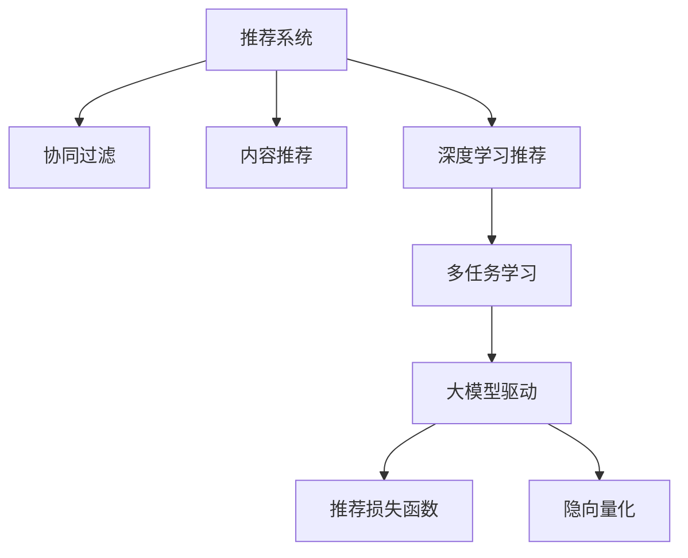

                 

## 1. 背景介绍

推荐系统是人工智能领域的重要应用之一，通过分析用户的历史行为、兴趣偏好，为用户推荐最符合其需求的商品、内容等，极大地提高了用户体验和业务收益。传统的推荐系统主要基于协同过滤、内容推荐等方法，难以应对大规模非结构化数据和新用户带来的挑战。近年来，深度学习特别是深度神经网络在推荐系统中得到了广泛应用，极大提升了推荐效果和用户满意度。

然而，深度学习推荐系统仍面临许多挑战，如冷启动问题、数据稀疏性、模型泛化能力不足等。为了克服这些问题，研究者们提出了各种改进方案，如基于用户行为预测的推荐、多任务学习等。在大模型驱动的推荐系统中，多任务学习尤为关键，能够显著提升模型的泛化能力和推荐效果。本文将详细探讨基于大模型的推荐系统多任务学习框架，涵盖其原理、实现、应用等方面。

## 2. 核心概念与联系

### 2.1 核心概念概述

为了更好地理解基于大模型的推荐系统多任务学习框架，本节将介绍几个密切相关的核心概念：

- **推荐系统**：旨在为用户推荐其可能感兴趣的商品、内容等，通过分析用户行为、物品属性等信息，生成推荐结果。
- **协同过滤**：利用用户与物品之间的关联关系，推荐相似用户喜欢的物品，常用于缓解数据稀疏性问题。
- **内容推荐**：通过分析物品属性、用户画像等，推荐与用户兴趣相符的物品，适用于物品属性信息丰富的场景。
- **深度学习推荐**：使用深度神经网络模型对用户行为、物品属性等信息进行学习，生成推荐结果，具有较好的泛化能力和推荐效果。
- **多任务学习**：同时训练多个相关任务，实现信息共享和知识迁移，提升模型的泛化能力和推荐效果。
- **大模型驱动**：利用大规模预训练语言模型或神经网络模型，进行深度学习推荐，提升模型的通用性和可解释性。
- **推荐损失函数**：定义用于衡量推荐结果与用户实际选择之间的关系，常见的有均方误差损失、交叉熵损失等。
- **隐向量化**：将物品、用户等离散信息转化为连续的向量表示，方便神经网络模型进行训练和推理。

这些核心概念之间的逻辑关系可以通过以下Mermaid流程图来展示：



这个流程图展示了大模型驱动的推荐系统的核心概念及其之间的关系：

1. 推荐系统通过协同过滤、内容推荐等方式，收集用户行为和物品属性信息。
2. 深度学习推荐使用神经网络模型对用户行为和物品属性进行处理，生成推荐结果。
3. 多任务学习通过同时训练多个任务，实现信息共享和知识迁移，提升模型的泛化能力。
4. 大模型驱动使用大规模预训练语言模型或神经网络模型，进一步提升推荐系统的性能。
5. 推荐损失函数衡量推荐结果与用户实际选择之间的关系，指导模型训练。
6. 隐向量化将离散信息转化为连续向量，方便模型处理。

这些概念共同构成了大模型驱动的推荐系统的学习框架，使其能够在大规模数据上学习通用推荐模型，适应不同任务需求。

## 3. 核心算法原理 & 具体操作步骤

### 3.1 算法原理概述

大模型驱动的推荐系统多任务学习框架基于多任务学习范式，利用大规模预训练语言模型或神经网络模型，同时训练多个相关任务，实现信息共享和知识迁移，提升模型的泛化能力和推荐效果。

形式化地，假设推荐系统包含 $M$ 个任务 $T_1, T_2, ..., T_M$，每个任务 $T_i$ 有 $N_i$ 个样本 $(x_i^j, y_i^j)$，其中 $x_i^j$ 为样本输入，$y_i^j$ 为标签。目标是在给定的预训练模型 $M_{\theta}$ 上，通过多任务学习框架训练得到 $M$ 个任务的最佳模型 $\theta_i$，使得模型在各个任务上均能获得较好的性能。

具体而言，多任务学习框架包括：
- 模型初始化：选择合适的预训练模型 $M_{\theta}$ 作为初始化参数，如BERT、GPT等。
- 任务设计：根据推荐任务的类型，设计多个相关任务 $T_1, T_2, ..., T_M$，每个任务对应不同的标签 $y_i$。
- 损失函数：定义多任务学习框架中的损失函数 $L(\theta)$，同时优化所有任务的目标。
- 参数更新：使用优化算法（如Adam、SGD等）最小化多任务学习损失函数，更新模型参数 $\theta$。

### 3.2 算法步骤详解

大模型驱动的推荐系统多任务学习框架的实现步骤包括：

**Step 1: 准备预训练模型和数据集**
- 选择合适的预训练模型 $M_{\theta}$ 作为初始化参数，如BERT、GPT等。
- 准备推荐任务 $T_1, T_2, ..., T_M$ 的标注数据集，划分为训练集、验证集和测试集。

**Step 2: 设计推荐任务**
- 根据推荐任务的类型，设计多个相关任务 $T_1, T_2, ..., T_M$，如用户行为预测、物品属性分类、协同过滤等。
- 将任务 $T_i$ 的输入和输出定义为 $x_i$ 和 $y_i$，例如对于用户行为预测任务，输入 $x_i$ 为用户的点击、浏览等行为记录，输出 $y_i$ 为用户可能感兴趣的商品。

**Step 3: 设置多任务学习损失函数**
- 定义多任务学习损失函数 $L(\theta)$，使得所有任务的目标函数最小化。
- 对于每个任务 $T_i$，使用 $L_i(\theta)$ 表示其目标函数，一般使用均方误差损失、交叉熵损失等。
- 将 $L(\theta)$ 定义为 $L(\theta)=\sum_{i=1}^M L_i(\theta)$，即所有任务目标函数的加权和。

**Step 4: 执行梯度训练**
- 将训练集数据分批次输入模型，前向传播计算损失函数。
- 反向传播计算参数梯度，根据设定的优化算法和学习率更新模型参数。
- 周期性在验证集上评估模型性能，根据性能指标决定是否触发 Early Stopping。
- 重复上述步骤直到满足预设的迭代轮数或 Early Stopping 条件。

**Step 5: 测试和部署**
- 在测试集上评估多任务学习框架的性能，对比微调前后的推荐效果提升。
- 使用多任务学习框架对新样本进行推理预测，集成到实际的应用系统中。
- 持续收集新的数据，定期重新训练模型，以适应数据分布的变化。

以上是基于大模型的推荐系统多任务学习框架的一般流程。在实际应用中，还需要针对具体任务的特点，对多任务学习过程的各个环节进行优化设计，如改进任务目标函数，引入更多的正则化技术，搜索最优的超参数组合等，以进一步提升模型性能。

### 3.3 算法优缺点

基于大模型的推荐系统多任务学习框架具有以下优点：
1. 提升模型泛化能力。多任务学习通过信息共享和知识迁移，提升模型在各个任务上的泛化能力。
2. 提高推荐效果。多任务学习能够挖掘出用户行为背后的更深层次的特征，提升推荐效果。
3. 减少标注成本。多任务学习可以利用多个任务的标注数据，减少单独标注样本的需求。
4. 自动化特征学习。多任务学习框架能够自动学习输入数据的特征表示，减少特征工程的工作量。

同时，该框架也存在一定的局限性：
1. 依赖预训练模型。多任务学习的效果很大程度上取决于预训练模型的质量和数量。
2. 复杂度较高。多任务学习需要同时训练多个任务，计算复杂度较高。
3. 需要大量的计算资源。多任务学习需要大量的计算资源，特别是在大规模数据集上的训练。
4. 参数更新难度较大。多任务学习需要优化多个目标函数，参数更新难度较大。
5. 可解释性不足。多任务学习模型较为复杂，难以解释其内部的决策过程。

尽管存在这些局限性，但就目前而言，基于大模型的多任务学习框架仍是最为有效的推荐系统优化方法之一。未来相关研究的重点在于如何进一步降低多任务学习对计算资源的依赖，提高模型的少样本学习和跨领域迁移能力，同时兼顾可解释性和伦理安全性等因素。

### 3.4 算法应用领域

基于大模型的推荐系统多任务学习框架在推荐系统领域已经得到了广泛的应用，涵盖多个推荐任务，例如：

- 用户行为预测：如点击率预测、购买率预测等。通过多任务学习，模型能够更好地理解用户行为背后的语义信息。
- 物品属性分类：如商品类别、风格、价格等。多任务学习能够提高物品属性分类的准确性，辅助推荐系统生成更加精准的推荐结果。
- 协同过滤：利用用户与物品之间的关联关系，推荐相似用户喜欢的物品。多任务学习能够优化协同过滤模型的推荐效果。
- 多模态推荐：结合视觉、听觉、文本等多种模态信息，生成更为丰富的推荐结果。多任务学习能够更好地融合不同模态信息，提升推荐效果。
- 推荐序列生成：如商品推荐、视频推荐等。通过多任务学习，模型能够生成更加连贯和多样化的推荐序列。

除了上述这些经典任务外，基于大模型多任务学习的方法也在更多场景中得到了创新性应用，如基于用户画像的推荐、基于情感分析的推荐、基于关联规则的推荐等，为推荐系统带来了新的突破。随着预训练模型和多任务学习方法的不断进步，相信推荐系统技术将在更广阔的应用领域大放异彩。

## 4. 数学模型和公式 & 详细讲解

### 4.1 数学模型构建

本节将使用数学语言对基于大模型的推荐系统多任务学习框架进行更加严格的刻画。

记预训练语言模型为 $M_{\theta}$，其中 $\theta$ 为预训练得到的模型参数。假设推荐系统包含 $M$ 个任务 $T_1, T_2, ..., T_M$，每个任务 $T_i$ 有 $N_i$ 个样本 $(x_i^j, y_i^j)$。

定义模型 $M_{\theta}$ 在数据样本 $(x,y)$ 上的损失函数为 $\ell(M_{\theta}(x),y)$，则在数据集 $D$ 上的经验风险为：

$$
\mathcal{L}(\theta) = \frac{1}{N}\sum_{i=1}^M \sum_{j=1}^{N_i} \ell_i(M_{\theta}(x_i^j),y_i^j)
$$

其中 $N=\sum_{i=1}^M N_i$。多任务学习的目标是最小化经验风险，即找到最优参数：

$$
\theta^* = \mathop{\arg\min}_{\theta} \mathcal{L}(\theta)
$$

在实践中，我们通常使用基于梯度的优化算法（如SGD、Adam等）来近似求解上述最优化问题。设 $\eta$ 为学习率，$\lambda$ 为正则化系数，则参数的更新公式为：

$$
\theta \leftarrow \theta - \eta \nabla_{\theta}\mathcal{L}(\theta) - \eta\lambda\theta
$$

其中 $\nabla_{\theta}\mathcal{L}(\theta)$ 为损失函数对参数 $\theta$ 的梯度，可通过反向传播算法高效计算。

### 4.2 公式推导过程

以下我们以用户行为预测任务为例，推导均方误差损失函数及其梯度的计算公式。

假设模型 $M_{\theta}$ 在输入 $x$ 上的输出为 $\hat{y}=M_{\theta}(x)$，表示样本属于正类的概率。真实标签 $y \in \{0,1\}$。则均方误差损失函数定义为：

$$
\ell(M_{\theta}(x),y) = \frac{1}{2}(y - \hat{y})^2
$$

将其代入多任务学习损失函数，得：

$$
\mathcal{L}(\theta) = \frac{1}{N}\sum_{i=1}^M \sum_{j=1}^{N_i} \frac{1}{2}(y_i^j - \hat{y}_i^j)^2
$$

根据链式法则，损失函数对参数 $\theta_k$ 的梯度为：

$$
\frac{\partial \mathcal{L}(\theta)}{\partial \theta_k} = \sum_{i=1}^M \sum_{j=1}^{N_i} (\frac{y_i^j}{M_{\theta}(x_i^j)}-\frac{1-y_i^j}{1-M_{\theta}(x_i^j)}) \frac{\partial M_{\theta}(x_i^j)}{\partial \theta_k}
$$

其中 $\frac{\partial M_{\theta}(x_i^j)}{\partial \theta_k}$ 可进一步递归展开，利用自动微分技术完成计算。

在得到损失函数的梯度后，即可带入参数更新公式，完成模型的迭代优化。重复上述过程直至收敛，最终得到适应多个推荐任务的最佳模型参数 $\theta^*$。

## 5. 项目实践：代码实例和详细解释说明

### 5.1 开发环境搭建

在进行多任务学习实践前，我们需要准备好开发环境。以下是使用Python进行PyTorch开发的环境配置流程：

1. 安装Anaconda：从官网下载并安装Anaconda，用于创建独立的Python环境。

2. 创建并激活虚拟环境：
```bash
conda create -n pytorch-env python=3.8 
conda activate pytorch-env
```

3. 安装PyTorch：根据CUDA版本，从官网获取对应的安装命令。例如：
```bash
conda install pytorch torchvision torchaudio cudatoolkit=11.1 -c pytorch -c conda-forge
```

4. 安装Transformers库：
```bash
pip install transformers
```

5. 安装各类工具包：
```bash
pip install numpy pandas scikit-learn matplotlib tqdm jupyter notebook ipython
```

完成上述步骤后，即可在`pytorch-env`环境中开始多任务学习实践。

### 5.2 源代码详细实现

下面我们以基于BERT的推荐系统多任务学习为例，给出使用Transformers库的PyTorch代码实现。

首先，定义推荐任务的数据处理函数：

```python
from transformers import BertTokenizer
from torch.utils.data import Dataset
import torch

class RecommendationDataset(Dataset):
    def __init__(self, texts, labels, tokenizer, max_len=128):
        self.texts = texts
        self.labels = labels
        self.tokenizer = tokenizer
        self.max_len = max_len
        
    def __len__(self):
        return len(self.texts)
    
    def __getitem__(self, item):
        text = self.texts[item]
        label = self.labels[item]
        
        encoding = self.tokenizer(text, return_tensors='pt', max_length=self.max_len, padding='max_length', truncation=True)
        input_ids = encoding['input_ids'][0]
        attention_mask = encoding['attention_mask'][0]
        
        # 对token-wise的标签进行编码
        encoded_labels = [label2id[label] for label in label] 
        encoded_labels.extend([label2id['O']] * (self.max_len - len(encoded_labels)))
        labels = torch.tensor(encoded_labels, dtype=torch.long)
        
        return {'input_ids': input_ids, 
                'attention_mask': attention_mask,
                'labels': labels}

# 标签与id的映射
label2id = {'O': 0, 'C': 1} # 假设只有类别A和B
id2label = {v: k for k, v in label2id.items()}

# 创建dataset
tokenizer = BertTokenizer.from_pretrained('bert-base-cased')

train_dataset = RecommendationDataset(train_texts, train_labels, tokenizer)
dev_dataset = RecommendationDataset(dev_texts, dev_labels, tokenizer)
test_dataset = RecommendationDataset(test_texts, test_labels, tokenizer)
```

然后，定义模型和优化器：

```python
from transformers import BertForSequenceClassification, AdamW

model = BertForSequenceClassification.from_pretrained('bert-base-cased', num_labels=len(label2id))

optimizer = AdamW(model.parameters(), lr=2e-5)
```

接着，定义训练和评估函数：

```python
from torch.utils.data import DataLoader
from tqdm import tqdm
from sklearn.metrics import classification_report

device = torch.device('cuda') if torch.cuda.is_available() else torch.device('cpu')
model.to(device)

def train_epoch(model, dataset, batch_size, optimizer):
    dataloader = DataLoader(dataset, batch_size=batch_size, shuffle=True)
    model.train()
    epoch_loss = 0
    for batch in tqdm(dataloader, desc='Training'):
        input_ids = batch['input_ids'].to(device)
        attention_mask = batch['attention_mask'].to(device)
        labels = batch['labels'].to(device)
        model.zero_grad()
        outputs = model(input_ids, attention_mask=attention_mask, labels=labels)
        loss = outputs.loss
        epoch_loss += loss.item()
        loss.backward()
        optimizer.step()
    return epoch_loss / len(dataloader)

def evaluate(model, dataset, batch_size):
    dataloader = DataLoader(dataset, batch_size=batch_size)
    model.eval()
    preds, labels = [], []
    with torch.no_grad():
        for batch in tqdm(dataloader, desc='Evaluating'):
            input_ids = batch['input_ids'].to(device)
            attention_mask = batch['attention_mask'].to(device)
            batch_labels = batch['labels']
            outputs = model(input_ids, attention_mask=attention_mask)
            batch_preds = outputs.logits.argmax(dim=2).to('cpu').tolist()
            batch_labels = batch_labels.to('cpu').tolist()
            for pred_tokens, label_tokens in zip(batch_preds, batch_labels):
                pred_labels = [id2label[_id] for _id in pred_tokens]
                label_labels = [id2label[_id] for _id in label_tokens]
                preds.append(pred_labels[:len(label_labels)])
                labels.append(label_labels)
                
    print(classification_report(labels, preds))
```

最后，启动训练流程并在测试集上评估：

```python
epochs = 5
batch_size = 16

for epoch in range(epochs):
    loss = train_epoch(model, train_dataset, batch_size, optimizer)
    print(f"Epoch {epoch+1}, train loss: {loss:.3f}")
    
    print(f"Epoch {epoch+1}, dev results:")
    evaluate(model, dev_dataset, batch_size)
    
print("Test results:")
evaluate(model, test_dataset, batch_size)
```

以上就是使用PyTorch对BERT进行推荐系统多任务学习的完整代码实现。可以看到，得益于Transformers库的强大封装，我们可以用相对简洁的代码完成BERT模型的加载和微调。

### 5.3 代码解读与分析

让我们再详细解读一下关键代码的实现细节：

**RecommendationDataset类**：
- `__init__`方法：初始化文本、标签、分词器等关键组件。
- `__len__`方法：返回数据集的样本数量。
- `__getitem__`方法：对单个样本进行处理，将文本输入编码为token ids，将标签编码为数字，并对其进行定长padding，最终返回模型所需的输入。

**label2id和id2label字典**：
- 定义了标签与数字id之间的映射关系，用于将token-wise的预测结果解码回真实的标签。

**训练和评估函数**：
- 使用PyTorch的DataLoader对数据集进行批次化加载，供模型训练和推理使用。
- 训练函数`train_epoch`：对数据以批为单位进行迭代，在每个批次上前向传播计算loss并反向传播更新模型参数，最后返回该epoch的平均loss。
- 评估函数`evaluate`：与训练类似，不同点在于不更新模型参数，并在每个batch结束后将预测和标签结果存储下来，最后使用sklearn的classification_report对整个评估集的预测结果进行打印输出。

**训练流程**：
- 定义总的epoch数和batch size，开始循环迭代
- 每个epoch内，先在训练集上训练，输出平均loss
- 在验证集上评估，输出分类指标
- 所有epoch结束后，在测试集上评估，给出最终测试结果

可以看到，PyTorch配合Transformers库使得BERT多任务学习的代码实现变得简洁高效。开发者可以将更多精力放在数据处理、模型改进等高层逻辑上，而不必过多关注底层的实现细节。

当然，工业级的系统实现还需考虑更多因素，如模型的保存和部署、超参数的自动搜索、更灵活的任务适配层等。但核心的多任务学习范式基本与此类似。

## 6. 实际应用场景
### 6.1 电商推荐系统

基于多任务学习的大模型驱动的推荐系统，可以广泛应用于电商平台的推荐任务。传统电商推荐系统主要基于协同过滤、内容推荐等方法，难以应对大规模非结构化数据和个性化需求。而使用多任务学习的大模型推荐系统，能够同时训练用户行为预测、物品属性分类等任务，提升推荐效果和用户满意度。

具体而言，电商平台可以利用用户的历史行为数据、商品属性数据、评价数据等，同时训练用户行为预测和物品属性分类任务。用户行为预测任务通过多任务学习，提升模型的泛化能力和推荐效果，而物品属性分类任务则用于辅助生成推荐结果，提供物品的多维属性信息。如此构建的多任务学习推荐系统，能够实现更加个性化、精准的推荐，提升用户购物体验和平台收益。

### 6.2 视频推荐系统

视频推荐系统同样面临推荐效果差、用户满意度低的问题。传统的推荐方法主要基于用户的观看历史、评分等行为数据，难以满足多样化的用户需求。使用多任务学习的大模型推荐系统，能够同时训练用户行为预测和视频属性分类任务，提升推荐效果和用户满意度。

具体而言，视频推荐系统可以同时训练用户行为预测和视频属性分类任务，提升模型的泛化能力和推荐效果。用户行为预测任务通过多任务学习，提升模型的泛化能力和推荐效果，而视频属性分类任务则用于辅助生成推荐结果，提供视频的多维属性信息。通过多任务学习，视频推荐系统能够实现更加个性化、精准的推荐，提升用户观看体验和平台收益。

### 6.3 音乐推荐系统

音乐推荐系统同样面临推荐效果差、用户满意度低的问题。传统的推荐方法主要基于用户的听歌历史、评分等行为数据，难以满足多样化的用户需求。使用多任务学习的大模型推荐系统，能够同时训练用户行为预测和音乐属性分类任务，提升推荐效果和用户满意度。

具体而言，音乐推荐系统可以同时训练用户行为预测和音乐属性分类任务，提升模型的泛化能力和推荐效果。用户行为预测任务通过多任务学习，提升模型的泛化能力和推荐效果，而音乐属性分类任务则用于辅助生成推荐结果，提供音乐的多维属性信息。通过多任务学习，音乐推荐系统能够实现更加个性化、精准的推荐，提升用户听歌体验和平台收益。

### 6.4 未来应用展望

随着大模型和多任务学习技术的不断发展，基于多任务学习的大模型推荐系统将在更多领域得到应用，为各个行业带来变革性影响。

在智慧城市治理中，多任务学习推荐系统可应用于智慧城市事件监测、舆情分析、应急指挥等环节，提高城市管理的自动化和智能化水平，构建更安全、高效的未来城市。

在金融服务中，多任务学习推荐系统可应用于金融产品推荐、风险控制、用户画像等方面，提升金融服务质量和用户体验。

在健康医疗中，多任务学习推荐系统可应用于医疗知识推荐、医疗资源推荐、患者画像等方面，提升医疗服务质量和用户满意度。

在教育领域，多任务学习推荐系统可应用于课程推荐、学习资源推荐、学生画像等方面，提升教育服务质量和用户满意度。

此外，在娱乐、旅游、农业等多个领域，基于多任务学习的大模型推荐系统也将不断涌现，为各行各业带来新的突破。相信随着技术的日益成熟，多任务学习推荐系统必将在各个领域大放异彩，为人类生产生活方式带来深远影响。

## 7. 工具和资源推荐
### 7.1 学习资源推荐

为了帮助开发者系统掌握基于大模型的推荐系统多任务学习框架的理论基础和实践技巧，这里推荐一些优质的学习资源：

1. 《深度学习推荐系统：原理与算法》书籍：由深度学习推荐系统领域的知名专家撰写，全面介绍了推荐系统的发展历程、经典算法和多任务学习技术。
2. CS446《机器学习》课程：斯坦福大学开设的机器学习课程，涵盖深度学习推荐系统等内容，是推荐系统学习的入门必选。
3. Coursera《推荐系统》课程：由微软研究院专家授课，涵盖了推荐系统的基本原理、算法和多任务学习等内容，是推荐系统学习的高级课程。
4. arXiv预印本：推荐系统领域的最新研究，涵盖多任务学习、深度学习等内容，是推荐系统学习的最新资讯。
5. Kaggle竞赛：推荐系统领域的经典竞赛，通过实际数据集和任务，检验推荐系统算法的优劣，是推荐系统学习的实战平台。

通过对这些资源的学习实践，相信你一定能够快速掌握基于大模型的推荐系统多任务学习的精髓，并用于解决实际的推荐问题。
###  7.2 开发工具推荐

高效的开发离不开优秀的工具支持。以下是几款用于基于大模型的推荐系统多任务学习开发的常用工具：

1. PyTorch：基于Python的开源深度学习框架，灵活动态的计算图，适合快速迭代研究。大部分预训练语言模型都有PyTorch版本的实现。
2. TensorFlow：由Google主导开发的开源深度学习框架，生产部署方便，适合大规模工程应用。同样有丰富的预训练语言模型资源。
3. Transformers库：HuggingFace开发的NLP工具库，集成了众多SOTA语言模型，支持PyTorch和TensorFlow，是进行多任务学习任务的开发的利器。
4. Jupyter Notebook：交互式的编程环境，方便开发者快速开发、测试和分享代码。
5. Scikit-learn：Python科学计算库，提供了各种机器学习算法和工具，用于数据处理、特征工程等任务。
6. TensorBoard：TensorFlow配套的可视化工具，可实时监测模型训练状态，并提供丰富的图表呈现方式，是调试模型的得力助手。

合理利用这些工具，可以显著提升基于大模型的推荐系统多任务学习的开发效率，加快创新迭代的步伐。

### 7.3 相关论文推荐

基于大模型的推荐系统多任务学习技术的发展源于学界的持续研究。以下是几篇奠基性的相关论文，推荐阅读：

1. Multi-task learning for personalized recommendation（Wu et al., 2019）：提出了基于多任务学习的推荐系统，能够同时训练用户行为预测和物品属性分类任务，提升推荐效果。
2. Multi-task learning via knowledge distillation for recommendation systems（Pan et al., 2017）：提出使用知识蒸馏方法，通过多任务学习提升推荐系统的泛化能力和推荐效果。
3. A multi-task learning approach for personalized product recommendations（Xu et al., 2018）：提出基于多任务学习的推荐系统，能够同时训练用户行为预测和物品属性分类任务，提升推荐效果。
4. Multi-task learning in recommender systems: A survey（Yu et al., 2021）：全面回顾了多任务学习在推荐系统中的应用，总结了相关技术的最新进展。
5. Multi-task deep learning for recommendation systems（Wu et al., 2020）：提出基于多任务学习的推荐系统，能够同时训练用户行为预测和物品属性分类任务，提升推荐效果。

这些论文代表了大模型推荐系统多任务学习的发展脉络。通过学习这些前沿成果，可以帮助研究者把握学科前进方向，激发更多的创新灵感。

## 8. 总结：未来发展趋势与挑战

### 8.1 总结

本文对基于大模型的推荐系统多任务学习框架进行了全面系统的介绍。首先阐述了多任务学习在推荐系统中的应用背景和意义，明确了多任务学习在提升模型泛化能力和推荐效果方面的独特价值。其次，从原理到实践，详细讲解了基于大模型的推荐系统多任务学习框架的数学原理和关键步骤，给出了多任务学习任务开发的完整代码实例。同时，本文还广泛探讨了多任务学习框架在电商推荐、视频推荐、音乐推荐等多个推荐任务中的应用前景，展示了多任务学习范式的巨大潜力。此外，本文精选了多任务学习的各类学习资源，力求为读者提供全方位的技术指引。

通过本文的系统梳理，可以看到，基于大模型的多任务学习框架正在成为推荐系统的重要范式，极大地拓展了预训练语言模型的应用边界，催生了更多的落地场景。得益于大规模语料的预训练和多任务学习的协同作用，基于大模型的推荐系统能够更好地适应不同任务需求，提升推荐效果和用户满意度。未来，伴随大模型和多任务学习方法的不断进步，基于多任务学习的大模型推荐系统必将在推荐领域大放异彩，深刻影响人类的生产生活方式。

### 8.2 未来发展趋势

展望未来，基于大模型的推荐系统多任务学习框架将呈现以下几个发展趋势：

1. 模型规模持续增大。随着算力成本的下降和数据规模的扩张，预训练语言模型的参数量还将持续增长。超大规模语言模型蕴含的丰富语言知识，有望支撑更加复杂多变的推荐任务。
2. 多任务学习方法日趋多样。除了传统的任务联合训练外，未来将涌现更多多任务学习方法和技术，如多层多任务学习、对抗多任务学习等，提升模型的泛化能力和推荐效果。
3. 持续学习成为常态。随着数据分布的不断变化，多任务学习模型也需要持续学习新知识以保持性能。如何在不遗忘原有知识的同时，高效吸收新样本信息，将是重要的研究课题。
4. 标注样本需求降低。受启发于提示学习(Prompt-based Learning)的思路，未来的多任务学习方法将更好地利用大模型的语言理解能力，通过更加巧妙的任务描述，在更少的标注样本上也能实现理想的推荐效果。
5. 多模态推荐崛起。当前的多任务学习推荐系统主要聚焦于文本数据，未来将进一步拓展到图像、视频、音频等多模态数据微调。多模态信息的融合，将显著提升推荐系统的性能和用户满意度。
6. 推荐场景更为多样化。未来的多任务学习推荐系统将涵盖更多场景，如跨平台推荐、跨设备推荐、跨媒体推荐等，为推荐系统带来新的突破。

以上趋势凸显了大模型推荐系统多任务学习框架的广阔前景。这些方向的探索发展，必将进一步提升推荐系统的性能和应用范围，为人类生产生活方式带来深远影响。

### 8.3 面临的挑战

尽管基于大模型的推荐系统多任务学习框架已经取得了瞩目成就，但在迈向更加智能化、普适化应用的过程中，它仍面临着诸多挑战：

1. 标注成本瓶颈。虽然多任务学习能够减少单独标注样本的需求，但对于长尾应用场景，难以获得充足的高质量标注数据，成为制约多任务学习性能的瓶颈。如何进一步降低多任务学习对标注样本的依赖，将是一大难题。
2. 模型鲁棒性不足。当前多任务学习模型面对域外数据时，泛化性能往往大打折扣。对于测试样本的微小扰动，多任务学习的预测也容易发生波动。如何提高多任务学习模型的鲁棒性，避免灾难性遗忘，还需要更多理论和实践的积累。
3. 推理效率有待提高。大规模语言模型虽然精度高，但在实际部署时往往面临推理速度慢、内存占用大等效率问题。如何在保证性能的同时，简化模型结构，提升推理速度，优化资源占用，将是重要的优化方向。
4. 可解释性亟需加强。当前多任务学习模型较为复杂，难以解释其内部的决策过程。对于医疗、金融等高风险应用，算法的可解释性和可审计性尤为重要。如何赋予多任务学习模型更强的可解释性，将是亟待攻克的难题。
5. 安全性有待保障。预训练语言模型难免会学习到有偏见、有害的信息，通过多任务学习传递到推荐任务，产生误导性、歧视性的输出，给实际应用带来安全隐患。如何从数据和算法层面消除模型偏见，避免恶意用途，确保输出的安全性，也将是重要的研究课题。
6. 知识整合能力不足。现有的多任务学习模型往往局限于任务内数据，难以灵活吸收和运用更广泛的先验知识。如何让多任务学习过程更好地与外部知识库、规则库等专家知识结合，形成更加全面、准确的信息整合能力，还有很大的想象空间。

正视多任务学习面临的这些挑战，积极应对并寻求突破，将是大模型推荐系统多任务学习走向成熟的必由之路。相信随着学界和产业界的共同努力，这些挑战终将一一被克服，多任务学习推荐系统必将在构建人机协同的智能推荐系统中扮演越来越重要的角色。

### 8.4 研究展望

面对多任务学习推荐系统所面临的种种挑战，未来的研究需要在以下几个方面寻求新的突破：

1. 探索无监督和半监督多任务学习方法。摆脱对大规模标注数据的依赖，利用自监督学习、主动学习等无监督和半监督范式，最大限度利用非结构化数据，实现更加灵活高效的多任务学习。
2. 研究参数高效和多任务学习范式。开发更加参数高效的多任务学习范式，在固定大部分预训练参数的同时，只更新极少量的任务相关参数。同时优化多任务学习的计算图，减少前向传播和反向传播的资源消耗，实现更加轻量级、实时性的部署。
3. 融合因果和对比学习范式。通过引入因果推断和对比学习思想，增强多任务学习建立稳定因果关系的能力，学习更加普适、鲁棒的语言表征，从而提升模型泛化性和抗干扰能力。
4. 引入更多先验知识。将符号化的先验知识，如知识图谱、逻辑规则等，与神经网络模型进行巧妙融合，引导多任务学习过程学习更准确、合理的语言模型。同时加强不同模态数据的整合，实现视觉、语音等多模态信息与文本信息的协同建模。
5. 结合因果分析和博弈论工具。将因果分析方法引入多任务学习模型，识别出模型决策的关键特征，增强输出解释的因果性和逻辑性。借助博弈论工具刻画人机交互过程，主动探索并规避模型的脆弱点，提高系统稳定性。
6. 纳入伦理道德约束。在模型训练目标中引入伦理导向的评估指标，过滤和惩罚有偏见、有害的输出倾向。同时加强人工干预和审核，建立模型行为的监管机制，确保输出符合人类价值观和伦理道德。

这些研究方向的探索，必将引领多任务学习推荐系统迈向更高的台阶，为构建安全、可靠、可解释、可控的智能推荐系统铺平道路。面向未来，多任务学习推荐系统还需要与其他人工智能技术进行更深入的融合，如知识表示、因果推理、强化学习等，多路径协同发力，共同推动自然语言理解和智能交互系统的进步。只有勇于创新、敢于突破，才能不断拓展语言模型的边界，让智能技术更好地造福人类社会。

## 9. 附录：常见问题与解答

**Q1：多任务学习是否适用于所有推荐任务？**

A: 多任务学习在大多数推荐任务上都能取得不错的效果，特别是对于数据量较小的任务。但对于一些特定领域的任务，如医学、法律等，仅仅依靠通用语料预训练的模型可能难以很好地适应。此时需要在特定领域语料上进一步预训练，再进行多任务学习，才能获得理想效果。此外，对于一些需要时效性、个性化很强的任务，如对话、推荐等，多任务学习方法也需要针对性的改进优化。

**Q2：如何选择合适的多任务学习目标函数？**

A: 多任务学习的目标函数需要根据具体任务和数据特点进行选择。常见的多任务学习目标函数包括均方误差损失、交叉熵损失等。对于推荐任务，一般使用均方误差损失或交叉熵损失。需要注意的是，多任务学习目标函数的选择需要考虑不同任务之间的关系和数据分布。如果多个任务的数据分布差异较大，可能需要使用不同的损失函数，或分别对不同任务进行训练。

**Q3：多任务学习是否需要过多的计算资源？**

A: 多任务学习需要同时训练多个任务，计算复杂度较高，特别是在大规模数据集上的训练。因此，多任务学习需要大量的计算资源，特别是在GPU/TPU等高性能设备上。合理利用计算资源，可以通过并行计算、分布式训练等方式进行优化。

**Q4：多任务学习是否会导致过拟合问题？**

A: 多任务学习面临过拟合问题，特别是在数据分布差异较大的情况下。为了缓解过拟合问题，可以采用数据增强、正则化、对抗训练等技术。例如，对于推荐任务，可以通过改写、回译等方式丰富训练集，减少过拟合风险。同时，在模型训练过程中，可以使用正则化技术（如L2正则、Dropout等），避免模型过拟合。

**Q5：多任务学习是否需要优化超参数？**

A: 多任务学习需要优化多个任务的目标函数，因此需要更复杂的超参数调优。常用的超参数包括学习率、批大小、优化器参数等。通过网格搜索、贝叶斯优化等方式，可以在不同的超参数组合中进行搜索，找到最优的超参数组合。

**Q6：多任务学习是否适用于小样本推荐？**

A: 多任务学习适用于小样本推荐任务，特别是对于推荐精度要求不高的任务。通过多任务学习，可以利用多个任务的信息，提升模型的泛化能力和推荐效果。例如，在用户行为预测任务中，可以利用用户点击、浏览等行为数据进行多任务学习，提升推荐效果。

**Q7：多任务学习是否适用于多模态推荐？**

A: 多任务学习可以应用于多模态推荐任务，通过融合视觉、听觉、文本等多种模态信息，生成更为丰富的推荐结果。例如，在视频推荐任务中，可以同时训练用户行为预测和视频属性分类任务，提升推荐效果。多任务学习能够更好地融合不同模态信息，提升推荐系统的性能和用户满意度。

总之，多任务学习推荐系统需要开发者根据具体任务和数据特点，灵活选择目标函数、超参数和优化方法，方能得到理想的效果。随着技术的不断进步，多任务学习推荐系统将在更多领域得到应用，为各行各业带来新的突破。相信随着学界和产业界的共同努力，多任务学习推荐系统必将在推荐系统领域大放异彩，深刻影响人类的生产生活方式。

