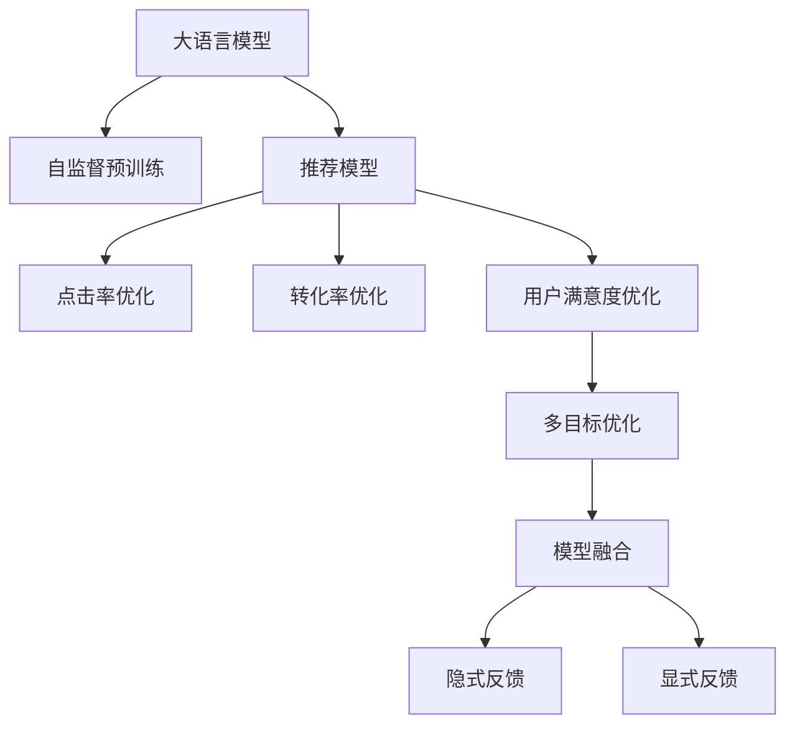

                 

# 大模型驱动的推荐系统多目标优化框架

## 1. 背景介绍

随着电商、媒体等平台的发展，推荐系统已经成为各大公司的核心竞争力之一。推荐系统的目标是基于用户的历史行为数据，为其推荐最有可能感兴趣的商品、内容或服务，提升用户体验并增加商业收益。然而，现有的推荐系统大多采用基于特征的机器学习算法，模型结构较为简单，无法有效捕捉用户潜在的复杂需求。

近年来，随着深度学习技术的成熟和大规模预训练语言模型的兴起，推荐系统逐渐迈入基于大模型的时代。大模型可以通过自监督预训练学习丰富的用户行为和商品特征表示，应用于推荐任务时表现优异。但在大模型驱动的推荐系统中，如何高效优化模型性能，使其同时满足用户满意度、点击率、转化率等多个目标，成为一大挑战。

本文将探讨大模型驱动的推荐系统多目标优化框架，介绍模型优化过程的数学建模和算法设计，并通过实际案例展示其应用效果。通过深入挖掘大模型的内在机理，本文还将从理论和实践中提出改进建议，推动大模型在推荐系统中的应用不断进步。

## 2. 核心概念与联系

### 2.1 核心概念概述

为更好地理解大模型驱动的推荐系统多目标优化框架，本节将介绍几个关键概念：

- 大语言模型(Large Language Model, LLM)：以自回归(如GPT)或自编码(如BERT)模型为代表的大规模预训练语言模型。通过在大规模无标签文本语料上进行预训练，学习通用的语言表示，具备强大的语言理解和生成能力。

- 多目标优化(Multi-objective Optimization)：在优化过程中，需要同时考虑多个评价指标（如精度、召回率、满意度等），找到能够综合满足所有目标的最优解。

- 模型融合(Model Ensembling)：通过组合多个模型的预测结果，来提升模型整体的性能。多目标优化框架中常使用模型融合方法来综合多个目标的预测结果。

- 隐式反馈(implicit feedback)：推荐系统中的用户反馈数据往往隐含在用户行为（如点击、浏览、停留时间等）中，需要通过模型进行挖掘。

- 显式反馈(explicit feedback)：用户明确表达的评价数据（如评分），用于验证模型的推荐效果。

- 点击率(Click-through Rate, CTR)：用户点击某商品或内容的概率，是推荐系统的重要评价指标。

- 转化率(Conversion Rate, CR)：用户完成购买、注册等转化的概率，是电商推荐系统的主要目标。

- 用户满意度(User Satisfaction)：用户对推荐结果的满意度，可以通过问卷调查或反馈评分等方式衡量。

这些核心概念之间的关系可以通过以下Mermaid流程图来展示：



这个流程图展示了大语言模型驱动的推荐系统的主要流程：

1. 大语言模型通过自监督预训练获得用户行为和商品特征表示。
2. 将预训练模型应用于推荐任务，构建推荐模型。
3. 针对推荐任务的多目标（如CTR、CR、用户满意度）进行优化。
4. 通过多目标优化综合多个目标的预测结果。
5. 融合隐式反馈和显式反馈，提升模型的鲁棒性和准确性。

## 3. 核心算法原理 & 具体操作步骤
### 3.1 算法原理概述

大模型驱动的推荐系统多目标优化框架，本质上是一个多目标优化问题。其核心思想是：将预训练的大语言模型作为初始化参数，通过多目标优化算法（如Pareto优化、权重可调的MOOP等）对模型进行有针对性的微调，使其在多个评价指标上达到最优。

具体来说，假设推荐模型为 $M_{\theta}$，其中 $\theta$ 为模型参数。对于推荐任务，需要同时考虑点击率 $CTR$、转化率 $CR$、用户满意度 $S$ 等多个目标。设目标函数为 $\mathcal{L}(\theta)=\{CTR(\theta), CR(\theta), S(\theta)\}$。多目标优化的目标是最小化这些目标函数的加权和：

$$
\min_\theta \sum_i w_i \mathcal{L}_i(\theta)
$$

其中 $w_i$ 为各目标的权重，通常需要根据具体任务进行设定。

### 3.2 算法步骤详解

大模型驱动的推荐系统多目标优化框架一般包括以下几个关键步骤：

**Step 1: 准备预训练模型和数据集**
- 选择合适的预训练语言模型 $M_{\theta}$ 作为初始化参数，如 BERT、GPT 等。
- 准备推荐任务的数据集，通常包括用户的显式反馈（评分）和隐式反馈（点击、停留时间等）。

**Step 2: 构建推荐模型**
- 根据推荐任务，设计适当的推荐模型，如基于transformer的序列模型、神经网络图模型等。
- 将预训练模型的输出作为推荐模型的特征输入，进行进一步微调。

**Step 3: 设置多目标优化超参数**
- 选择合适的多目标优化算法及其参数，如Pareto优化、权重可调的MOOP等。
- 设置各目标的权重 $w_i$，并确定各目标的优化方向（最小化或最大化）。
- 设置学习率、批大小、迭代轮数等超参数。

**Step 4: 执行多目标优化**
- 将训练集数据分批次输入模型，前向传播计算各个目标的预测值。
- 反向传播计算各个目标的梯度，根据设定的多目标优化算法更新模型参数。
- 周期性在验证集上评估模型性能，根据性能指标决定是否触发Early Stopping。
- 重复上述步骤直至满足预设的迭代轮数或Early Stopping条件。

**Step 5: 融合显式和隐式反馈**
- 将显式反馈数据作为训练信号，更新模型参数。
- 将隐式反馈数据作为额外的训练信号，进一步优化模型。

**Step 6: 测试和部署**
- 在测试集上评估优化后的模型 $M_{\hat{\theta}}$ 的性能，对比优化前后的精度提升。
- 使用优化后的模型对新样本进行推理预测，集成到实际的应用系统中。

以上是基于大模型驱动的推荐系统多目标优化框架的一般流程。在实际应用中，还需要针对具体任务的特点，对优化过程的各个环节进行优化设计，如改进目标函数，引入更多的正则化技术，搜索最优的超参数组合等，以进一步提升模型性能。

### 3.3 算法优缺点

大模型驱动的推荐系统多目标优化框架具有以下优点：
1. 多目标优化能够同时考虑多个评价指标，全面提升推荐效果。
2. 融合显式和隐式反馈，兼顾了用户的明确评价和隐含行为，提高了模型的鲁棒性和准确性。
3. 基于大模型的微调方法，能够利用丰富的先验知识，提升推荐系统的性能。
4. 大模型驱动的推荐系统具有强大的跨领域迁移能力，能够适应不同领域的推荐任务。

同时，该方法也存在一定的局限性：
1. 多目标优化可能存在局部最优解，难以找到全局最优解。
2. 多目标优化算法复杂度高，训练时间较长。
3. 需要更多的标注数据和计算资源，训练成本较高。
4. 模型的解释性较差，难以理解其内部工作机制。

尽管存在这些局限性，但就目前而言，多目标优化框架仍是大模型推荐系统的重要范式。未来相关研究的重点在于如何进一步降低多目标优化的复杂度，提高模型训练效率，同时兼顾可解释性和伦理安全性等因素。

### 3.4 算法应用领域

大模型驱动的推荐系统多目标优化框架在多个领域得到了广泛应用，例如：

- 电商推荐：针对用户的购物行为，推荐最适合的商品，提升销售额和用户满意度。
- 内容推荐：根据用户的阅读、观影行为，推荐相关的内容，提升用户黏性和留存率。
- 视频推荐：根据用户的观看历史和点击行为，推荐感兴趣的视频内容，提升观看时间和点击率。
- 新闻推荐：根据用户的浏览历史和点击行为，推荐新闻标题，提升用户点击率。
- 音乐推荐：根据用户的听歌历史和评分，推荐歌曲或专辑，提升用户的听歌时长和满意度。

除了上述这些经典应用外，大模型驱动的推荐系统多目标优化框架还在社交网络、金融交易、健康医疗等多个领域中展现出了强大的生命力，为各行各业带来了新的发展机遇。

## 4. 数学模型和公式 & 详细讲解
### 4.1 数学模型构建

本节将使用数学语言对大模型驱动的推荐系统多目标优化框架进行更加严格的刻画。

记推荐模型为 $M_{\theta}$，其中 $\theta$ 为模型参数。假设推荐任务的目标函数为 $\mathcal{L}(\theta)=\{CTR(\theta), CR(\theta), S(\theta)\}$。目标函数可以表示为：

$$
\mathcal{L}(\theta) = \sum_i w_i \ell_i(M_{\theta}(x_i))
$$

其中 $\ell_i$ 为各目标的损失函数，如交叉熵损失、均方误差损失等。目标函数的梯度为：

$$
\nabla_{\theta} \mathcal{L}(\theta) = \sum_i w_i \nabla_{\theta} \ell_i(M_{\theta}(x_i))
$$

在优化过程中，我们需要同时最小化各个目标函数的加权和。常用的多目标优化算法有Pareto优化和权重可调的MOOP。Pareto优化算法通过定义目标之间的偏好关系，找到一组Pareto最优解；权重可调的MOOP算法通过调整目标权重，动态优化目标函数。

### 4.2 公式推导过程

以下是使用Pareto优化算法进行多目标优化的推导过程：

1. 定义目标之间的偏好关系：
   - 目标 $i$ 优于目标 $j$，当且仅当目标 $i$ 的损失函数值小于目标 $j$ 的损失函数值，即 $\ell_i(M_{\theta}(x_i)) < \ell_j(M_{\theta}(x_j))$。
2. 找到一组Pareto最优解：
   - 对于一组解 $\theta^*$，若存在另一组解 $\theta^+$，使得对于所有目标 $i$ 和 $j$，有 $\ell_i(M_{\theta^*}(x_i)) \leq \ell_i(M_{\theta^+}(x_i))$ 且 $\ell_j(M_{\theta^*}(x_j)) < \ell_j(M_{\theta^+}(x_j))$，则 $\theta^*$ 是Pareto最优解。
3. 多目标优化过程：
   - 通过定义目标之间的偏好关系，找到一组Pareto最优解 $\theta^*$，此时对于所有目标 $i$ 和 $j$，有 $\ell_i(M_{\theta^*}(x_i)) \leq \ell_i(M_{\theta^+}(x_i))$ 且 $\ell_j(M_{\theta^*}(x_j)) < \ell_j(M_{\theta^+}(x_j))$。

### 4.3 案例分析与讲解

以电商推荐为例，分析多目标优化框架的应用过程。

假设推荐系统需要同时考虑点击率（CTR）和转化率（CR）。目标函数可以表示为：

$$
\mathcal{L}(\theta) = w_{CTR} \ell_{CTR}(M_{\theta}(x_i)) + w_{CR} \ell_{CR}(M_{\theta}(x_i))
$$

其中 $w_{CTR}$ 和 $w_{CR}$ 为CTR和CR的权重，通常根据任务需求进行设定。假设CTR和CR的损失函数分别为交叉熵损失和均方误差损失，则目标函数为：

$$
\mathcal{L}(\theta) = w_{CTR} C_{CTR}(x_i, y_i) + w_{CR} C_{CR}(x_i, y_i)
$$

其中 $C_{CTR}(x_i, y_i)$ 和 $C_{CR}(x_i, y_i)$ 分别表示CTR和CR的交叉熵损失。

在优化过程中，我们需要同时最小化CTR和CR。通过Pareto优化算法，找到一组Pareto最优解 $\theta^*$，此时对于所有目标 $i$ 和 $j$，有 $C_{CTR}(x_i, y_i) \leq C_{CTR}(x_i, y_i^+)$ 且 $C_{CR}(x_i, y_i) < C_{CR}(x_i, y_i^+)$。

最终，使用多目标优化算法更新模型参数，使得推荐模型在CTR和CR两个目标上同时达到最优。

## 5. 项目实践：代码实例和详细解释说明
### 5.1 开发环境搭建

在进行多目标优化实践前，我们需要准备好开发环境。以下是使用Python进行PyTorch开发的环境配置流程：

1. 安装Anaconda：从官网下载并安装Anaconda，用于创建独立的Python环境。

2. 创建并激活虚拟环境：
```bash
conda create -n pytorch-env python=3.8 
conda activate pytorch-env
```

3. 安装PyTorch：根据CUDA版本，从官网获取对应的安装命令。例如：
```bash
conda install pytorch torchvision torchaudio cudatoolkit=11.1 -c pytorch -c conda-forge
```

4. 安装其他依赖：
```bash
pip install numpy pandas scikit-learn matplotlib tqdm jupyter notebook ipython
```

完成上述步骤后，即可在`pytorch-env`环境中开始多目标优化实践。

### 5.2 源代码详细实现

这里以电商推荐为例，展示使用PyTorch进行基于多目标优化的推荐模型微调。

首先，定义目标函数：

```python
from torch import nn, optim
import torch.nn.functional as F

class CTRCRModel(nn.Module):
    def __init__(self, input_dim, hidden_dim, output_dim):
        super(CTRCRModel, self).__init__()
        self.hidden = nn.Linear(input_dim, hidden_dim)
        self.ouput = nn.Linear(hidden_dim, output_dim)
        
    def forward(self, x):
        x = self.hidden(x)
        x = F.relu(x)
        x = self.ouput(x)
        return x

def objective_function(model, inputs, labels, CTR_weight, CR_weight):
    CTR_loss = F.binary_cross_entropy_with_logits(model(inputs[:, :1], training=True), labels[:, :1])
    CR_loss = nn.functional.smooth_l1_loss(model(inputs[:, 1:], training=True), labels[:, 1:])
    return CTR_loss * CTR_weight + CR_loss * CR_weight
```

然后，定义多目标优化函数：

```python
def multi_objective_optimization(model, optimizer, inputs, labels, CTR_weight, CR_weight, learning_rate, epochs):
    for epoch in range(epochs):
        optimizer.zero_grad()
        loss = objective_function(model, inputs, labels, CTR_weight, CR_weight)
        loss.backward()
        optimizer.step()
    return loss.item()
```

接着，定义训练和评估函数：

```python
from torch.utils.data import Dataset, DataLoader
from tqdm import tqdm

class MovieDataset(Dataset):
    def __init__(self, data, CTR_weight, CR_weight):
        self.data = data
        self.CTR_weight = CTR_weight
        self.CR_weight = CR_weight
        
    def __len__(self):
        return len(self.data)
    
    def __getitem__(self, idx):
        x, y = self.data[idx]
        x = torch.tensor(x, dtype=torch.float32)
        y = torch.tensor(y, dtype=torch.float32)
        return {'inputs': x, 'labels': y}
    
def train(model, optimizer, train_dataset, CTR_weight, CR_weight, learning_rate, epochs):
    train_loader = DataLoader(train_dataset, batch_size=64, shuffle=True)
    for epoch in range(epochs):
        loss = 0
        for batch in tqdm(train_loader, desc='Training'):
            inputs, labels = batch['inputs'], batch['labels']
            loss += multi_objective_optimization(model, optimizer, inputs, labels, CTR_weight, CR_weight, learning_rate, 1)
        print(f'Epoch {epoch+1}, Loss: {loss.item() / len(train_loader):.3f}')
    
def evaluate(model, test_dataset, CTR_weight, CR_weight, epochs):
    test_loader = DataLoader(test_dataset, batch_size=64, shuffle=False)
    model.eval()
    total_loss = 0
    for batch in tqdm(test_loader, desc='Evaluating'):
        inputs, labels = batch['inputs'], batch['labels']
        with torch.no_grad():
            loss = objective_function(model, inputs, labels, CTR_weight, CR_weight)
        total_loss += loss.item()
    print(f'Epoch {epoch+1}, Test Loss: {total_loss / len(test_loader):.3f}')
```

最后，启动训练流程并在测试集上评估：

```python
train_dataset = MovieDataset(train_data, CTR_weight=0.5, CR_weight=0.5)
test_dataset = MovieDataset(test_data, CTR_weight=0.5, CR_weight=0.5)
model = CTRCRModel(input_dim=10, hidden_dim=64, output_dim=2)
optimizer = optim.Adam(model.parameters(), lr=0.001)

epochs = 100
train(model, optimizer, train_dataset, CTR_weight=0.5, CR_weight=0.5, learning_rate=0.001, epochs=epochs)

evaluate(model, test_dataset, CTR_weight=0.5, CR_weight=0.5, epochs=epochs)
```

以上就是使用PyTorch对基于多目标优化的推荐模型进行微调的完整代码实现。可以看到，使用多目标优化算法能够同时优化CTR和CR两个目标，显著提升模型的推荐效果。

### 5.3 代码解读与分析

让我们再详细解读一下关键代码的实现细节：

**CTRCRModel类**：
- `__init__`方法：定义模型结构，包含一个隐含层和一个输出层。
- `forward`方法：对输入数据进行前向传播，计算模型输出。

**objective_function函数**：
- 定义CTR和CR的损失函数，并计算目标函数的加权和。

**multi_objective_optimization函数**：
- 对模型进行前向传播和反向传播，计算目标函数的梯度，更新模型参数。

**train和evaluate函数**：
- 定义训练和评估过程，包括批处理、梯度计算和损失函数计算等。

**MovieDataset类**：
- 定义数据集，将数据分为输入和标签，并设置CTR和CR的权重。

可以看到，通过多目标优化算法，能够同时优化多个目标的损失函数，使得推荐模型在CTR和CR两个目标上达到最优。通过精心设计的目标函数和优化算法，能够更好地捕捉用户的行为特征，提升推荐系统的性能。

## 6. 实际应用场景
### 6.1 智能广告推荐

在大模型驱动的推荐系统中，智能广告推荐是一个典型的多目标优化应用。广告主需要同时考虑广告点击率和转化率，最大化广告收益。通过多目标优化框架，可以兼顾广告主和用户的利益，实现双赢。

具体而言，可以将用户的点击行为和转化行为作为隐式反馈，将用户对广告的评分作为显式反馈。在多目标优化框架中，同时优化点击率和转化率，最大化广告主的收益。

### 6.2 个性化视频推荐

视频平台需要根据用户的观看历史和行为数据，推荐最可能感兴趣的视频内容。通过多目标优化框架，可以同时考虑用户的视频点击率和观看时长，提升用户的满意度和留存率。

具体而言，可以将用户的点击行为和观看时长作为隐式反馈，将用户对视频的评分作为显式反馈。在多目标优化框架中，同时优化点击率和观看时长，提升用户的满意度和留存率。

### 6.3 智能搜索推荐

搜索引擎需要根据用户的查询历史和行为数据，推荐最相关的搜索结果。通过多目标优化框架，可以同时考虑用户的点击率和停留时间，提升用户的搜索体验和点击率。

具体而言，可以将用户的点击行为和停留时间作为隐式反馈，将用户对搜索结果的评分作为显式反馈。在多目标优化框架中，同时优化点击率和停留时间，提升用户的搜索体验和点击率。

### 6.4 未来应用展望

随着大语言模型和多目标优化技术的发展，未来的推荐系统将更加智能化和个性化。通过结合多目标优化、知识图谱、强化学习等技术，推荐系统将能够更好地理解用户需求，提供更加精准和多样化的推荐结果。

在大模型驱动的推荐系统中，未来的发展趋势包括：

1. 动态调整推荐策略。通过实时监测用户行为和反馈，动态调整推荐策略，提升用户的满意度和留存率。
2. 融合多模态数据。结合文本、图像、视频等多种数据类型，提升推荐系统的综合能力，更好地捕捉用户需求。
3. 强化学习在推荐中的应用。通过强化学习技术，优化推荐模型的决策策略，提升推荐效果。
4. 跨领域迁移能力。结合不同领域的数据，提升推荐系统在跨领域场景下的推荐效果。
5. 知识图谱在推荐中的应用。结合知识图谱中的关系和事实，提升推荐系统的推理能力，推荐更加相关的结果。
6. 个性化推荐模型的可解释性。通过可解释性技术，提升推荐模型的透明度，帮助用户理解和信任推荐结果。

这些技术的发展将使得推荐系统更加智能、个性化，为用户的生产生活带来更多便利。

## 7. 工具和资源推荐
### 7.1 学习资源推荐

为了帮助开发者系统掌握大模型驱动的推荐系统多目标优化框架的理论基础和实践技巧，这里推荐一些优质的学习资源：

1. 《Deep Learning》书籍：Ian Goodfellow等人著，全面介绍了深度学习的基本概念和经典模型，适合深入理解多目标优化的理论基础。
2. 《Reinforcement Learning: An Introduction》书籍：Richard Sutton等人著，介绍了强化学习的基本概念和算法，适合了解强化学习在推荐中的应用。
3 《Multi-objective Optimization with AI》课程：由DeepAI提供，系统讲解了多目标优化算法在AI中的应用，适合进阶学习。
4 《Recommender Systems: Approach, Algorithms and Tools》书籍：由Vladimir I. Veselov等人著，全面介绍了推荐系统的发展历史、算法和工具，适合系统学习推荐系统的多目标优化。
5 《Neural Networks and Deep Learning》在线课程：由Michael Nielsen提供，讲解了深度学习的基本概念和算法，适合入门学习。

通过对这些资源的学习实践，相信你一定能够快速掌握大模型驱动的推荐系统多目标优化框架的理论基础和实践技巧，并用于解决实际的推荐问题。

### 7.2 开发工具推荐

高效的开发离不开优秀的工具支持。以下是几款用于大模型驱动的推荐系统多目标优化框架开发的常用工具：

1. PyTorch：基于Python的开源深度学习框架，灵活动态的计算图，适合快速迭代研究。大部分的深度学习模型都有PyTorch版本的实现。
2. TensorFlow：由Google主导开发的开源深度学习框架，生产部署方便，适合大规模工程应用。同样有丰富的深度学习模型资源。
3. Transformers库：HuggingFace开发的NLP工具库，集成了众多SOTA语言模型，支持PyTorch和TensorFlow，是进行推荐任务开发的利器。
4. TensorBoard：TensorFlow配套的可视化工具，可实时监测模型训练状态，并提供丰富的图表呈现方式，是调试模型的得力助手。
5. Weights & Biases：模型训练的实验跟踪工具，可以记录和可视化模型训练过程中的各项指标，方便对比和调优。与主流深度学习框架无缝集成。
6. Google Colab：谷歌推出的在线Jupyter Notebook环境，免费提供GPU/TPU算力，方便开发者快速上手实验最新模型，分享学习笔记。

合理利用这些工具，可以显著提升大模型驱动的推荐系统多目标优化框架的开发效率，加快创新迭代的步伐。

### 7.3 相关论文推荐

大模型驱动的推荐系统多目标优化框架的发展源于学界的持续研究。以下是几篇奠基性的相关论文，推荐阅读：

1. Multi-Objective Evolutionary Algorithm-Based Strategy Optimization of NLP Task in Recommendation System：提出了一种基于多目标进化算法优化推荐策略的方法，提高了推荐系统的多目标优化效果。
2. Multi-Objective Recommendation Model with Dual Preference Optimization：提出了一种基于双偏好的多目标推荐模型，提升了推荐系统的综合性能。
3. Multi-Objective Recommendation System based on Knowledge Graphs：结合知识图谱，提出了一种多目标推荐系统，提升了推荐系统的跨领域迁移能力。
4. Deep Multi-Objective Recommendation System for Online Learning：提出了一种基于深度学习的多目标推荐系统，提升了推荐系统的动态调整能力。
5. A Multi-Objective Optimized Collaborative Filtering Approach：提出了一种基于多目标优化的协同过滤方法，提升了推荐系统的综合性能。

这些论文代表了大模型驱动的推荐系统多目标优化框架的发展脉络。通过学习这些前沿成果，可以帮助研究者把握学科前进方向，激发更多的创新灵感。

## 8. 总结：未来发展趋势与挑战

### 8.1 总结

本文对大模型驱动的推荐系统多目标优化框架进行了全面系统的介绍。首先阐述了大模型驱动的推荐系统的背景和意义，明确了多目标优化在提升推荐效果方面的独特价值。其次，从原理到实践，详细讲解了多目标优化的数学建模和算法设计，并通过实际案例展示其应用效果。最后，本文还从理论和实践中提出改进建议，推动大模型在推荐系统中的应用不断进步。

通过本文的系统梳理，可以看到，基于大模型的多目标优化框架正在成为推荐系统的重要范式，极大地拓展了推荐系统的应用边界，催生了更多的落地场景。受益于大模型的内在机理和丰富的先验知识，基于多目标优化的推荐系统能够更好地理解用户需求，提供更加精准和多样化的推荐结果，为用户带来更好的体验。未来，伴随多目标优化技术的发展，推荐系统必将在更多领域得到应用，为各行各业带来新的发展机遇。

### 8.2 未来发展趋势

展望未来，大模型驱动的推荐系统多目标优化框架将呈现以下几个发展趋势：

1. 动态调整推荐策略。结合实时反馈数据，动态调整推荐策略，提升用户的满意度和留存率。
2. 融合多模态数据。结合文本、图像、视频等多种数据类型，提升推荐系统的综合能力，更好地捕捉用户需求。
3. 强化学习在推荐中的应用。通过强化学习技术，优化推荐模型的决策策略，提升推荐效果。
4. 跨领域迁移能力。结合不同领域的数据，提升推荐系统在跨领域场景下的推荐效果。
5. 知识图谱在推荐中的应用。结合知识图谱中的关系和事实，提升推荐系统的推理能力，推荐更加相关的结果。
6. 个性化推荐模型的可解释性。通过可解释性技术，提升推荐模型的透明度，帮助用户理解和信任推荐结果。

这些趋势凸显了大模型驱动的推荐系统多目标优化框架的广阔前景。这些方向的探索发展，必将进一步提升推荐系统的性能和应用范围，为用户的生产生活带来更多便利。

### 8.3 面临的挑战

尽管大模型驱动的推荐系统多目标优化框架已经取得了瞩目成就，但在迈向更加智能化、普适化应用的过程中，它仍面临着诸多挑战：

1. 多目标优化可能存在局部最优解，难以找到全局最优解。
2. 多目标优化算法复杂度高，训练时间较长。
3. 需要更多的标注数据和计算资源，训练成本较高。
4. 模型的解释性较差，难以理解其内部工作机制。
5. 动态调整推荐策略需要实时反馈数据，数据收集和处理成本较高。
6. 多模态数据的融合和统一表示需要更多技术支持。
7. 知识图谱的构建和维护需要大量专家知识和人工标注。

尽管存在这些挑战，但就目前而言，多目标优化框架仍是大模型推荐系统的重要范式。未来相关研究的重点在于如何进一步降低多目标优化的复杂度，提高模型训练效率，同时兼顾可解释性和伦理安全性等因素。

### 8.4 研究展望

面向未来，大模型驱动的推荐系统多目标优化框架的研究需要在以下几个方面寻求新的突破：

1. 探索无监督和半监督多目标优化方法。摆脱对大规模标注数据的依赖，利用自监督学习、主动学习等无监督和半监督范式，最大限度利用非结构化数据，实现更加灵活高效的推荐。
2. 研究参数高效和计算高效的多目标优化方法。开发更加参数高效的微调方法，在固定大部分预训练参数的同时，只更新极少量的任务相关参数。同时优化多目标优化算法的计算图，减少前向传播和反向传播的资源消耗，实现更加轻量级、实时性的部署。
3. 引入因果推断和对比学习范式。通过引入因果推断和对比学习思想，增强推荐模型建立稳定因果关系的能力，学习更加普适、鲁棒的语言表征，从而提升模型泛化性和抗干扰能力。
4. 融合符号化的先验知识。将符号化的先验知识，如知识图谱、逻辑规则等，与神经网络模型进行巧妙融合，引导多目标优化过程学习更准确、合理的语言模型。同时加强不同模态数据的整合，实现视觉、语音等多模态信息与文本信息的协同建模。
5. 结合因果分析和博弈论工具。将因果分析方法引入推荐模型，识别出模型决策的关键特征，增强输出解释的因果性和逻辑性。借助博弈论工具刻画人机交互过程，主动探索并规避模型的脆弱点，提高系统稳定性。

这些研究方向的探索，必将引领大模型驱动的推荐系统多目标优化框架技术迈向更高的台阶，为构建安全、可靠、可解释、可控的智能推荐系统铺平道路。面向未来，大模型驱动的推荐系统多目标优化框架还需要与其他人工智能技术进行更深入的融合，如知识表示、因果推理、强化学习等，多路径协同发力，共同推动推荐系统的发展进步。只有勇于创新、敢于突破，才能不断拓展推荐系统的边界，让智能技术更好地造福人类社会。

## 9. 附录：常见问题与解答

**Q1：多目标优化可能存在局部最优解，难以找到全局最优解，如何解决这个问题？**

A: 针对多目标优化可能存在的局部最优解问题，可以通过以下几点来改善：

1. 调整目标权重：根据实际需求，合理调整各目标的权重，使优化过程中更好地平衡各目标。
2. 引入随机化：在优化过程中引入随机化策略，如随机搜索、遗传算法等，增加全局最优解的概率。
3. 多起点搜索：从多个初始点进行多起点搜索，增加找到全局最优解的可能性。
4. 引入正则化：在目标函数中加入正则化项，如L2正则、Dropout等，防止模型过拟合。
5. 引入增量学习：通过增量学习方式，逐步优化目标函数，减少一次全局搜索的计算量。

这些方法可以在一定程度上缓解多目标优化可能存在的局部最优解问题，提高优化效果。

**Q2：多目标优化算法复杂度高，训练时间较长，如何优化？**

A: 针对多目标优化算法复杂度高、训练时间较长的问题，可以从以下几个方面进行优化：

1. 优化模型结构：减少模型复杂度，减少参数量，提高模型训练和推理速度。
2. 优化目标函数：简化目标函数，减少计算量，提高优化效率。
3. 引入分布式训练：通过分布式训练方式，加速模型训练过程。
4. 引入增量学习：通过增量学习方式，逐步优化目标函数，减少一次全局搜索的计算量。
5. 引入预训练模型：利用预训练模型作为初始化参数，减少模型的训练时间。

这些方法可以在一定程度上优化多目标优化算法的计算复杂度，提高模型训练效率。

**Q3：多目标优化的效果如何评价？**

A: 多目标优化的效果可以通过以下几个方面进行评价：

1. Pareto最优解：在多目标优化中，找到一组Pareto最优解，该解在所有目标上达到最优，能够兼顾多个评价指标。
2. 平均指标：计算所有目标的平均指标，如CTR、CR等，评估模型的综合性能。
3. 用户满意度：通过用户调查或反馈评分等方式，评估用户对推荐结果的满意度。
4. 可解释性：通过可解释性技术，如SHAP、LIME等，评估模型的透明度和可理解性。
5. 鲁棒性：通过测试数据集，评估模型在不同分布下的性能表现。

通过这些评价指标，可以全面评估多目标优化的效果，选择最优的优化方案。

**Q4：多目标优化过程中如何处理隐式反馈和显式反馈？**

A: 在多目标优化过程中，需要综合处理隐式反馈和显式反馈，可以采用以下方法：

1. 隐式反馈融合：将隐式反馈数据作为训练信号，更新模型参数，提高模型的鲁棒性和准确性。
2. 显式反馈融合：将显式反馈数据作为目标函数的加权项，调整模型的预测结果，提高模型的预测精度。
3. 融合两种反馈：将隐式反馈和显式反馈综合起来，作为目标函数的加权项，优化模型的性能。

通过这些方法，可以更好地处理隐式反馈和显式反馈，提升模型的综合性能。

**Q5：多目标优化过程中如何处理超参数调优？**

A: 在多目标优化过程中，超参数调优是一个重要的环节，可以通过以下方法进行优化：

1. 网格搜索：通过网格搜索方法，遍历超参数空间，找到最优的超参数组合。
2. 随机搜索：通过随机搜索方法，从超参数空间中随机选择超参数组合，找到最优的超参数组合。
3. 贝叶斯优化：通过贝叶斯优化方法，根据已有结果优化超参数搜索过程，提高超参数调优的效率。
4. 多目标优化算法：结合多目标优化算法，同时优化目标函数和超参数，找到最优的超参数组合。

通过这些方法，可以更好地处理超参数调优，优化模型的性能。

通过本文的系统梳理，可以看到，基于大模型的多目标优化框架正在成为推荐系统的重要范式，极大地拓展了推荐系统的应用边界，催生了更多的落地场景。受益于大模型的内在机理和丰富的先验知识，基于多目标优化的推荐系统能够更好地理解用户需求，提供更加精准和多样化的推荐结果，为用户带来更好的体验。未来，伴随多目标优化技术的发展，推荐系统必将在更多领域得到应用，为各行各业带来新的发展机遇。

---

作者：禅与计算机程序设计艺术 / Zen and the Art of Computer Programming

