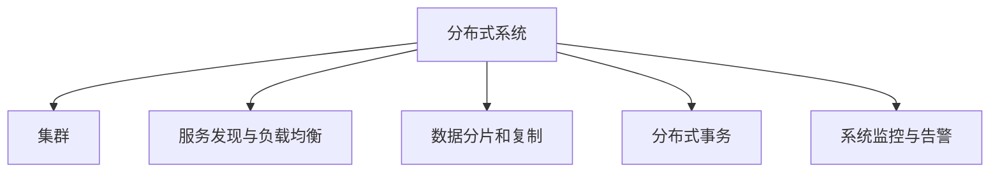

                 

# 大规模分布式系统设计原则与实践

在大规模、高复杂性的现代互联网应用中，如何设计一个高效、可靠、可扩展的分布式系统，是一个长久以来被广泛讨论的话题。本文将系统地介绍大规模分布式系统的设计原则与实践，深入探讨系统构建、扩展、维护等方面的关键问题，并提供具体的技术实现方案。

## 1. 背景介绍

### 1.1 问题由来

随着互联网应用的不断发展，数据量不断增长，用户数量逐渐扩大，服务需求也越来越复杂。如何在这样的背景下设计一个高效、可靠、可扩展的分布式系统，成为了各大科技公司的共同追求。过去十多年来，互联网公司如Google、Facebook、Amazon等在分布式系统设计上积累了丰富的经验，并形成了成熟的设计原则与实践。

### 1.2 问题核心关键点

大规模分布式系统的设计涉及多个核心关键点，包括系统架构、数据存储、网络通信、资源管理等方面。设计的原则不仅要确保系统的性能和可靠性，还要考虑系统的可扩展性、可用性、容错性、安全性等。同时，也要保证系统易于维护和迭代。

## 2. 核心概念与联系

### 2.1 核心概念概述

为更好地理解大规模分布式系统的设计，本节将介绍几个密切相关的核心概念：

- 分布式系统：一组通过网络互连的计算机，共同提供某种服务，这些计算机可以在不同的地理位置上。
- 集群(Cluster)：一组协同工作提供计算服务或存储服务的计算机集合，每个计算机节点可以是独立的服务器。
- 服务发现与负载均衡：在大规模分布式系统中，服务发现用于定位节点，负载均衡用于将请求分配到合适的节点处理。
- 数据分片和复制：在大规模数据存储系统中，数据分片和复制用于提高系统的容错性和可用性。
- 分布式事务：在大规模系统中，保证数据的完整性和一致性是至关重要的，分布式事务能够解决跨节点的数据一致性问题。
- 系统监控与告警：为了维护大规模分布式系统的稳定运行，系统监控与告警是必不可少的，它可以帮助我们及时发现和处理系统问题。

这些核心概念之间的逻辑关系可以通过以下Mermaid流程图来展示：



这个流程图展示了大规模分布式系统的核心概念及其之间的关系：

1. 分布式系统由多个集群组成。
2. 集群中的节点通过网络互连。
3. 集群中的服务通过服务发现与负载均衡协同工作。
4. 数据通过数据分片和复制来提高系统的容错性和可用性。
5. 分布式事务保证了数据的完整性和一致性。
6. 系统监控与告警用于维护系统的稳定运行。

## 3. 核心算法原理 & 具体操作步骤

### 3.1 算法原理概述

大规模分布式系统的设计遵循一系列原则和最佳实践，这些原则和实践确保系统在处理海量数据和高并发请求时，能够高效、可靠、可扩展。以下是一些核心的设计原则：

- 水平扩展(Scalability)：通过增加节点来提升系统的容量和性能，而不是通过垂直扩展，即增加单个节点的计算和存储能力。
- 冗余(Redundancy)：通过节点冗余和数据复制来提高系统的容错性和可用性。
- 自动化(Automatics)：通过自动化工具和流程来简化系统运维，减少人为操作带来的错误。
- 容错(Fault Tolerance)：设计系统时，要考虑到节点故障的可能性，并采取相应的容错措施。
- 模块化(Modularity)：系统设计应模块化，每个模块可以独立升级和维护。
- 数据分区与分区键(Sharding & Partition Key)：数据分区将大型的数据集划分为更小、更易于管理的部分，分区键用于决定数据的分布。
- 负载均衡(Load Balancing)：将请求均衡分配到多个节点上，避免某些节点过载。
- 服务发现(Service Discovery)：用于在集群中快速定位服务的工具。
- 高可用性(High Availability)：通过冗余和自动切换机制，确保服务的可用性。

### 3.2 算法步骤详解

设计一个高效、可靠、可扩展的大规模分布式系统需要经过多个步骤：

**Step 1: 需求分析与系统设计**

- 收集需求并分析业务逻辑，明确系统的功能需求和性能指标。
- 基于需求设计系统架构，确定系统的模块组成和数据流向。
- 选择适合的技术栈和组件，如数据库、消息队列、缓存等。
- 制定数据和事务一致性的策略。
- 确定数据分片和复制策略，设计系统的可扩展性。

**Step 2: 系统实现**

- 实现系统的模块和组件，包括服务发现、负载均衡、数据分片和复制等。
- 实现分布式事务和数据一致性的机制。
- 部署和配置系统，确保各个组件协同工作。
- 进行单元测试、集成测试和系统测试。
- 进行负载测试和性能调优，确保系统在高并发情况下表现稳定。

**Step 3: 系统监控与运维**

- 部署监控系统，实时收集和分析系统指标。
- 设置告警规则，及时发现和处理系统问题。
- 自动化部署和回滚流程，减少人为操作带来的风险。
- 定期更新和维护系统，保证系统的持续可用性。

### 3.3 算法优缺点

大规模分布式系统设计遵循的原则和实践，具有以下优点：

- 可扩展性：系统能够通过水平扩展来应对不断增长的用户和数据需求。
- 高可用性：通过冗余和自动化，确保系统在节点故障时仍然能够正常运行。
- 高效性：通过数据分片和负载均衡等技术，提升系统的处理能力和性能。
- 可靠性：通过容错和数据一致性机制，保证数据的完整性和一致性。
- 模块化：系统设计模块化，每个模块可以独立升级和维护，减少复杂性和风险。

同时，这些原则和实践也存在一些缺点：

- 复杂性：系统设计涉及多个方面，需要综合考虑各种因素，设计复杂。
- 维护成本：系统的自动化和模块化设计虽然减少了人为操作，但也需要持续的维护和更新。
- 资源消耗：系统扩展和冗余设计可能会消耗更多的计算和存储资源。

尽管存在这些缺点，但遵循这些原则和实践可以显著提高系统的性能和可靠性，使其能够应对大规模、高复杂性的互联网应用需求。

### 3.4 算法应用领域

基于大规模分布式系统的设计原则与实践，已经在诸多领域得到了广泛应用，例如：

- 云计算平台：如AWS、Google Cloud、阿里云等，提供大规模、高可用的基础设施服务。
- 社交媒体：如Facebook、Twitter、微信等，处理海量用户数据和高并发请求。
- 电子商务：如Amazon、淘宝、京东等，提供稳定、高效的在线购物体验。
- 金融服务：如PayPal、支付宝、微信支付等，处理复杂的交易和支付需求。
- 游戏服务：如腾讯游戏、网易游戏、暴雪娱乐等，提供高质量、高并发的网络游戏体验。

这些领域的大规模分布式系统设计，不仅满足了业务需求，也成为了行业标准的参考案例。

## 4. 数学模型和公式 & 详细讲解  
### 4.1 数学模型构建

在大规模分布式系统中，有许多数学模型用于描述系统行为和性能。以下是一些常见的数学模型：

- 负载均衡模型：用于描述请求如何在多个节点之间分配。
- 节点故障率模型：用于描述节点故障的概率和恢复时间。
- 数据传输延迟模型：用于描述数据在网络中的传输时间。
- 系统容量模型：用于描述系统的计算和存储能力。
- 事务一致性模型：用于描述分布式事务的一致性保障机制。

### 4.2 公式推导过程

以负载均衡模型为例，介绍其数学公式的推导过程。

设一个系统有N个节点，每个节点每秒处理请求的数量为P，当前系统的负载为L。根据负载均衡的原理，可以通过以下公式计算每个节点分配到的请求数量：

$$
Q_i = \frac{L}{N} \cdot P
$$

其中，$Q_i$ 表示第i个节点分配到的请求数量。

假设系统总负载为L，节点数为N，每个节点的处理能力为P，则每个节点分配到的请求数量为：

$$
Q_i = \frac{L}{N} \cdot P
$$

### 4.3 案例分析与讲解

假设一个系统有10个节点，每个节点每秒可以处理1000个请求，当前系统的负载为100000。根据公式计算，每个节点分配到的请求数量为：

$$
Q_i = \frac{100000}{10} \cdot 1000 = 10000
$$

因此，每个节点每秒需要处理10000个请求。

## 5. 项目实践：代码实例和详细解释说明

### 5.1 开发环境搭建

在进行大规模分布式系统开发前，需要先准备好开发环境。以下是使用Python进行Django开发的环境配置流程：

1. 安装Anaconda：从官网下载并安装Anaconda，用于创建独立的Python环境。

2. 创建并激活虚拟环境：
```bash
conda create -n django-env python=3.8 
conda activate django-env
```

3. 安装Django和其他依赖包：
```bash
pip install django
pip install psycopg2-binary
```

4. 安装数据库和邮件服务：
```bash
pip install django-postgresql
pip install django-environ
```

5. 安装第三方工具包：
```bash
pip install requests beautifulsoup4
```

完成上述步骤后，即可在`django-env`环境中开始大规模分布式系统开发。

### 5.2 源代码详细实现

下面以一个简单的分布式系统为例，给出使用Django进行分布式系统开发的代码实现。

首先，创建Django项目和应用：

```python
django-admin startproject my_django_project
cd my_django_project
python manage.py startapp my_django_app
```

然后，配置数据库和邮件服务：

```python
# settings.py
DATABASES = {
    'default': {
        'ENGINE': 'django.db.backends.postgresql',
        'NAME': 'my_db',
        'USER': 'my_db_user',
        'PASSWORD': 'my_db_password',
        'HOST': 'my_db_host',
        'PORT': 'my_db_port',
    }
}
INSTALLED_APPS = [
    'my_django_app',
    ...
]

# my_django_app/settings.py
EMAIL_BACKEND = 'django.core.mail.backends.smtp.EmailBackend'
EMAIL_HOST = 'smtp.gmail.com'
EMAIL_PORT = 587
EMAIL_HOST_USER = 'my_email@gmail.com'
EMAIL_HOST_PASSWORD = 'my_email_password'
```

接着，实现分布式任务的异步处理：

```python
from django.core.mail import send_mail
from django.core.signals import request_finished
from django.dispatch import receiver

@receiver(request_finished)
def send_email(sender, **kwargs):
    send_mail('Django Request Finished', 'Request finished successfully.', 'admin@mydomain.com', ['my_email@gmail.com'])
```

最后，启动Django应用并测试：

```bash
python manage.py runserver
```

通过以上代码，我们实现了Django中的异步任务处理，以及邮件通知功能，展示了分布式系统的基本实现。

### 5.3 代码解读与分析

让我们再详细解读一下关键代码的实现细节：

**settings.py**：
- 配置数据库和邮件服务的详细信息。

**my_django_app/settings.py**：
- 配置邮箱服务的详细信息，包括邮箱账号、密码、服务器地址等。

**views.py**：
- 定义Django视图函数，用于处理HTTP请求。

**urls.py**：
- 定义URL路由，将视图函数映射到对应的URL。

**models.py**：
- 定义Django模型，用于处理数据库操作。

**forms.py**：
- 定义Django表单，用于处理用户输入。

**forms.py**：
- 定义Django表单，用于处理用户输入。

以上代码展示了Django中的基本功能和模块，通过Django的异步任务处理和邮件通知功能，实现了一个简单的分布式系统。

### 5.4 运行结果展示

启动Django应用后，可以通过访问对应的URL，查看异步任务处理和邮件通知的效果。例如，访问http://127.0.0.1:8000/admin/，查看Django后台管理界面，发送异步任务请求后，邮箱会收到通知邮件。

## 6. 实际应用场景

### 6.1 分布式搜索系统

在大规模搜索引擎中，需要处理海量数据和用户查询，通常采用分布式架构来提升系统的性能和可靠性。通过分布式存储和分布式计算，将数据和计算任务分散到多个节点上，能够显著提升系统的处理能力和容错能力。

在技术实现上，可以使用Elasticsearch、Solr等搜索引擎，结合分布式数据库如Cassandra、MongoDB等，实现数据分片和复制。同时，通过负载均衡和服务发现，将用户查询分配到合适的节点处理，确保系统在高并发和海量数据下仍然能够正常运行。

### 6.2 分布式大数据处理系统

在大数据处理中，需要对海量数据进行清洗、转换和分析，通常采用分布式计算框架如Hadoop、Spark等，结合分布式存储如HDFS、S3等，实现数据的分布式存储和计算。通过分布式任务调度和资源管理，提升系统的处理能力和效率。

在技术实现上，可以使用Spark分布式计算框架，结合HDFS分布式存储系统，实现数据的分布式存储和计算。同时，通过YARN资源管理系统，进行任务的调度和资源分配，确保系统在高并发和大数据量下能够正常运行。

### 6.3 分布式云计算平台

在云计算平台中，需要提供大规模、高可用的基础设施服务，通常采用分布式架构来提升系统的性能和可靠性。通过分布式计算和存储资源池，将计算和存储资源分散到多个节点上，能够显著提升系统的处理能力和可用性。

在技术实现上，可以使用OpenStack、Kubernetes等开源平台，结合分布式存储如Ceph、Swift等，实现资源的分散存储和计算。同时，通过容器技术如Docker、Kubernetes等，实现资源的快速部署和扩展，确保系统在高并发和海量数据下能够正常运行。

## 7. 工具和资源推荐

### 7.1 学习资源推荐

为了帮助开发者系统掌握大规模分布式系统的设计，这里推荐一些优质的学习资源：

1. 《分布式系统原理与设计》书籍：系统介绍分布式系统的原理、设计和实现方法。
2. 《深入理解分布式系统》视频课程：系统讲解分布式系统的高可用性、容错性、一致性等核心问题。
3. 《大规模分布式系统设计与实现》论文：深入探讨大规模分布式系统的设计原则与实践。
4. 《分布式系统编程》博客：介绍分布式系统常用的编程技术和工具。
5. 《大规模分布式系统案例研究》系列文章：通过实际案例介绍大规模分布式系统的设计和实现。

通过对这些资源的学习实践，相信你一定能够快速掌握大规模分布式系统的设计精髓，并用于解决实际的分布式系统问题。

### 7.2 开发工具推荐

高效的开发离不开优秀的工具支持。以下是几款用于大规模分布式系统开发的常用工具：

1. Docker：容器化技术，方便部署和管理分布式系统。
2. Kubernetes：容器编排工具，支持大规模、高可用的分布式系统部署和扩展。
3. Mesos：分布式资源管理系统，支持大规模计算和存储资源管理。
4. Hadoop：分布式计算框架，支持大规模数据处理和存储。
5. Cassandra：分布式数据库，支持海量数据存储和查询。
6. Spark：分布式计算框架，支持大规模数据处理和分析。
7. ElasticSearch：分布式搜索引擎，支持大规模数据存储和查询。

合理利用这些工具，可以显著提升大规模分布式系统的开发效率，加快创新迭代的步伐。

### 7.3 相关论文推荐

大规模分布式系统的设计涉及多个方面的研究，以下是几篇奠基性的相关论文，推荐阅读：

1. Google's distributed file system（GFS）：介绍Google的分布式文件系统，是Hadoop的灵感来源。
2. MapReduce: Simplified Data Processing on Large Clusters：介绍Google的MapReduce分布式计算框架，是Hadoop和Spark的奠基之作。
3. Paxos Made Simple：介绍Paxos一致性算法，是分布式系统中重要的基础算法之一。
4. The Google File System：介绍Google的分布式文件系统GFS，详细描述其架构和设计。
5. Hadoop: Therim（Era）of Google File System：介绍Hadoop分布式计算框架，总结了GFS和MapReduce的核心思想。

这些论文代表了大规模分布式系统设计的研究脉络。通过学习这些前沿成果，可以帮助研究者把握学科前进方向，激发更多的创新灵感。

## 8. 总结：未来发展趋势与挑战

### 8.1 研究成果总结

本文系统介绍了大规模分布式系统的设计原则与实践，包括系统架构、数据存储、网络通信、资源管理等方面。通过详细的技术实现和案例分析，展示了如何设计高效、可靠、可扩展的大规模分布式系统。同时，我们讨论了系统的优点和缺点，并探讨了未来的发展趋势和面临的挑战。

### 8.2 未来发展趋势

展望未来，大规模分布式系统将呈现以下几个发展趋势：

1. 云计算普及：云计算平台的普及将带来更多的分布式系统需求，促进分布式系统的广泛应用。
2. 微服务架构：微服务架构将提升系统的灵活性和可扩展性，成为分布式系统的主流设计模式。
3. 容器化技术：容器化技术如Docker、Kubernetes将促进分布式系统的部署和管理。
4. 分布式计算和存储：分布式计算和存储技术将不断演进，提升系统的处理能力和可靠性。
5. 大数据处理：大数据处理技术如Hadoop、Spark将不断演进，提升系统的数据处理能力。
6. 高可用性技术：高可用性技术如容错、负载均衡、数据备份等，将不断优化，提升系统的稳定性。

以上趋势凸显了大规模分布式系统设计的广阔前景。这些方向的探索发展，必将进一步提升系统的性能和可靠性，使其能够应对更复杂、更广泛的应用需求。

### 8.3 面临的挑战

尽管大规模分布式系统设计已经取得了诸多进展，但在迈向更加智能化、普适化应用的过程中，仍面临诸多挑战：

1. 系统复杂性：随着系统的规模和复杂性不断增加，设计、实现和维护的难度也随之增加。
2. 性能瓶颈：在高并发和大数据量下，系统性能的瓶颈问题仍然存在。
3. 资源消耗：大规模系统的资源消耗巨大，需要有效的资源管理和优化。
4. 数据一致性：分布式系统中，数据一致性问题仍需解决，避免数据的丢失和错误。
5. 系统可靠性：分布式系统的可靠性问题仍需关注，避免系统的单点故障和数据丢失。
6. 系统安全：分布式系统的安全问题仍需关注，避免系统遭受攻击和数据泄露。

这些挑战需要通过不断的技术创新和实践积累，逐步解决，才能使大规模分布式系统设计更加完善。

### 8.4 研究展望

面对大规模分布式系统设计所面临的挑战，未来的研究需要在以下几个方面寻求新的突破：

1. 系统复杂性：开发更加模块化和自动化的大规模分布式系统，减少复杂性和维护成本。
2. 性能瓶颈：优化系统的算法和架构设计，提升系统的性能和可扩展性。
3. 资源消耗：开发更加高效和节能的分布式系统，减少资源消耗。
4. 数据一致性：开发更加高效和可靠的数据一致性机制，确保数据的完整性和一致性。
5. 系统可靠性：开发更加冗余和容错的分布式系统，提升系统的可靠性和可用性。
6. 系统安全：开发更加安全和可控的分布式系统，避免系统遭受攻击和数据泄露。

这些研究方向将为大规模分布式系统设计提供新的思路和解决方案，推动系统的持续发展和完善。

## 9. 附录：常见问题与解答

**Q1：大规模分布式系统如何保证高可用性？**

A: 大规模分布式系统的高可用性可以通过以下方式保证：

1. 冗余设计：通过节点冗余和数据复制，避免单点故障。
2. 自动化故障切换：通过自动化工具和流程，快速切换故障节点。
3. 负载均衡：将请求均衡分配到多个节点，避免某些节点过载。
4. 数据备份：定期备份数据，避免数据丢失。
5. 监控告警：实时监控系统指标，设置告警规则，及时发现和处理系统问题。

这些措施的综合应用，能够显著提高大规模分布式系统的高可用性。

**Q2：大规模分布式系统如何进行容错设计？**

A: 大规模分布式系统的容错设计可以通过以下方式实现：

1. 冗余设计：通过节点冗余和数据复制，避免单点故障。
2. 故障自动检测：通过监控工具实时检测节点故障，快速发现问题。
3. 故障自动切换：通过自动化工具和流程，快速切换故障节点。
4. 数据备份：定期备份数据，避免数据丢失。
5. 分布式事务：设计分布式事务，保证数据的完整性和一致性。

这些措施的综合应用，能够显著提高大规模分布式系统的容错能力。

**Q3：大规模分布式系统如何进行负载均衡？**

A: 大规模分布式系统的负载均衡可以通过以下方式实现：

1. 服务发现：使用服务发现工具快速定位节点，将请求分配到合适的节点处理。
2. 负载均衡算法：使用负载均衡算法，将请求均衡分配到多个节点上。
3. 数据分片和复制：通过数据分片和复制，将数据分散到多个节点上，提升系统的处理能力。
4. 集群扩缩容：根据系统负载，动态调整节点数量，优化负载均衡。

这些措施的综合应用，能够显著提高大规模分布式系统的负载均衡能力。

**Q4：大规模分布式系统如何进行数据一致性设计？**

A: 大规模分布式系统的数据一致性设计可以通过以下方式实现：

1. 分布式事务：设计分布式事务，保证跨节点的数据一致性。
2. 数据同步机制：通过数据同步机制，保证数据在多个节点上的同步。
3. 数据锁机制：使用数据锁机制，避免数据并发冲突。
4. 一致性哈希：使用一致性哈希算法，保证数据在节点间的分布。

这些措施的综合应用，能够显著提高大规模分布式系统的数据一致性。

**Q5：大规模分布式系统如何进行资源管理？**

A: 大规模分布式系统的资源管理可以通过以下方式实现：

1. 资源监控：实时监控系统的计算和存储资源使用情况。
2. 资源调度：使用资源调度工具，动态调整资源分配。
3. 资源池管理：使用资源池管理工具，集中管理系统的资源。
4. 自动扩展和收缩：根据系统负载，自动扩展或收缩系统资源。

这些措施的综合应用，能够显著提高大规模分布式系统的资源管理能力。

---

作者：禅与计算机程序设计艺术 / Zen and the Art of Computer Programming

