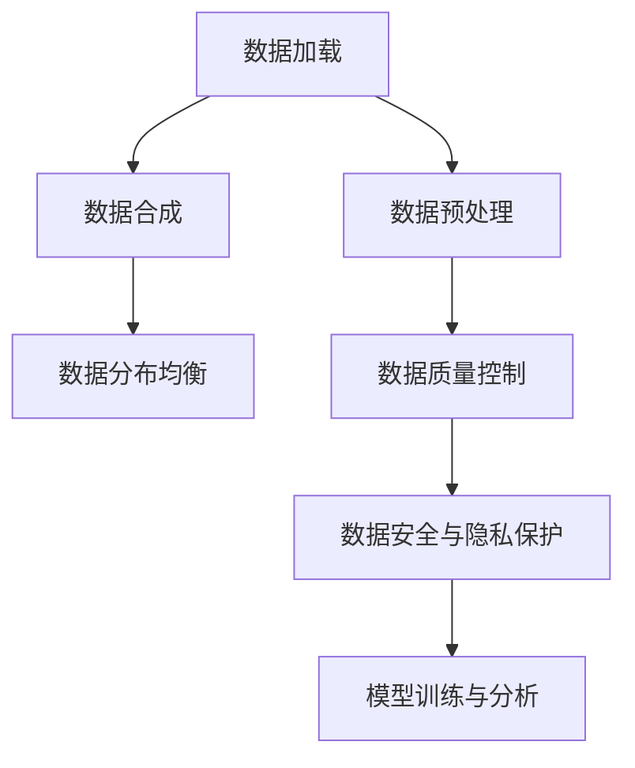

                 

## 1. 背景介绍

### 1.1 问题由来

在人工智能和数据科学领域，处理大规模数据集是至关重要的一环。无论是数据科学项目、机器学习模型训练，还是大规模的数据分析，都离不开高效、稳定、可靠的数据加载和管理。然而，随着数据量的不断增长，如何有效、高效地处理这些数据，成为了一个严峻挑战。

数据加载过程不仅要考虑数据规模，还要考虑数据类型、数据分布、数据质量等因素，这对算法和系统设计提出了极高的要求。同时，数据质量低下、数据重复率高、数据分布不均匀等问题，也会直接影响模型训练和数据分析的效果。

此外，数据合成技术在大规模数据集处理中也扮演着重要角色。合成数据可以弥补真实数据的不足，用于模型测试、生成对抗性样本、隐私保护等领域。合成数据生成技术能够有效降低数据收集成本，同时保护数据隐私，为数据驱动的人工智能应用提供强有力的支持。

### 1.2 问题核心关键点

在数据处理和合成过程中，主要关注以下关键点：

1. **数据加载效率**：如何在保证数据加载速度的同时，尽可能减少内存占用和IO操作。
2. **数据质量控制**：如何检测和过滤数据中的异常值、噪声和缺失值，确保数据的质量。
3. **数据分布均衡**：如何在有限的数据资源下，尽可能平衡各个类别的数据分布，避免数据倾斜。
4. **数据合成策略**：如何根据具体应用场景，选择合适的数据合成方法，生成高质量的合成数据。
5. **数据安全与隐私保护**：如何确保数据在生成、处理、存储和使用过程中的安全性，保护用户隐私。

### 1.3 问题研究意义

研究高效数据加载和合成数据生成技术，对于提升数据处理效率、降低数据收集成本、保护数据隐私等方面具有重要意义：

1. **提升数据处理效率**：通过优化数据加载和生成算法，能够显著提高数据处理的效率，缩短模型训练和分析的时间。
2. **降低数据收集成本**：合成数据可以替代部分真实数据，减少数据收集和标注的成本，特别是在数据获取难度大、成本高的领域。
3. **保护数据隐私**：合成数据能够有效掩盖真实数据，避免数据泄露，保护用户隐私和数据安全。
4. **促进数据科学和人工智能发展**：高质量的合成数据能够帮助模型更好地泛化和学习，推动数据驱动的人工智能技术的发展和应用。

## 2. 核心概念与联系

### 2.1 核心概念概述

为了更好地理解高效数据加载和合成数据生成技术，本节将介绍几个密切相关的核心概念：

- **数据加载（Data Loading）**：从存储介质中读取数据到程序内存中的过程。数据加载效率直接影响数据处理的速度和系统的响应时间。
- **数据合成（Data Synthesis）**：根据已有数据生成新的虚拟数据，以弥补真实数据的不足。合成数据生成技术在大数据处理、隐私保护、对抗样本生成等领域有广泛应用。
- **数据预处理（Data Preprocessing）**：包括数据清洗、数据转换、数据标准化等步骤，是数据处理的关键环节，直接影响数据质量。
- **数据分布均衡（Data Balance）**：在有限的数据资源下，平衡各个类别的数据分布，避免数据倾斜，提高模型的泛化能力。
- **数据隐私保护（Data Privacy Protection）**：在数据处理、存储和传输过程中，采取措施保护用户的隐私和数据安全，避免数据泄露和滥用。

这些核心概念之间的逻辑关系可以通过以下Mermaid流程图来展示：



这个流程图展示了大规模数据集处理的关键环节及其之间的关系：

1. 从存储介质中读取数据，通过数据预处理，确保数据的质量。
2. 数据合成可以补充真实数据的不足，优化数据分布，提高模型的泛化能力。
3. 数据分布均衡通过数据增强技术，解决数据不平衡问题。
4. 数据安全与隐私保护在数据处理和传输过程中，确保数据的安全性。
5. 最终生成的数据用于模型训练和分析，提高模型的性能和应用效果。

## 3. 核心算法原理 & 具体操作步骤
### 3.1 算法原理概述

高效数据加载和合成数据生成技术的核心思想是：通过优化数据加载算法和生成策略，确保数据处理的效率和质量，同时保护数据隐私，提高模型的泛化能力。

具体来说，数据加载和生成过程包括以下几个关键步骤：

1. **数据加载**：从存储介质中读取数据到程序内存中的过程，通过优化数据读取策略和算法，提高数据加载速度和效率。
2. **数据预处理**：包括数据清洗、数据转换、数据标准化等步骤，确保数据的质量和一致性。
3. **数据合成**：根据已有数据生成新的虚拟数据，通过合成数据增强模型的泛化能力，补充真实数据的不足。
4. **数据分布均衡**：通过数据增强技术，平衡各个类别的数据分布，提高模型的泛化能力。
5. **数据安全与隐私保护**：在数据处理和传输过程中，采取措施保护用户隐私和数据安全。

### 3.2 算法步骤详解

#### 3.2.1 数据加载

数据加载的优化可以从以下几个方面入手：

1. **异步加载**：采用异步加载技术，将数据加载任务放在后台线程中执行，减少用户等待时间。
2. **块加载**：将数据分成多个块，分批次读取，减少单次IO操作的耗时。
3. **缓存机制**：使用缓存技术，将频繁读取的数据缓存到内存中，提高数据加载速度。
4. **数据压缩**：对数据进行压缩，减少存储和传输的带宽占用，提高加载效率。

#### 3.2.2 数据预处理

数据预处理的优化可以从以下几个方面入手：

1. **数据清洗**：检测和过滤数据中的异常值、噪声和缺失值，确保数据的质量。
2. **数据转换**：将数据转换为标准格式，便于后续处理和分析。
3. **数据标准化**：对数据进行归一化、标准化处理，提高模型对数据的适应性。

#### 3.2.3 数据合成

数据合成的优化可以从以下几个方面入手：

1. **生成对抗网络（GANs）**：使用生成对抗网络生成合成数据，提高数据多样性和质量。
2. **自编码器（Autoencoders）**：使用自编码器压缩数据，减少存储空间，生成高质量的合成数据。
3. **数据增强（Data Augmentation）**：通过旋转、翻转、平移等操作，增强数据的多样性，提高模型的泛化能力。

#### 3.2.4 数据分布均衡

数据分布均衡的优化可以从以下几个方面入手：

1. **欠采样**：对数据量较大的类别进行欠采样，减少数据不平衡问题。
2. **过采样**：对数据量较小的类别进行过采样，增加数据量，平衡类别分布。
3. **SMOTE（Synthetic Minority Over-sampling Technique）**：通过生成合成样本，平衡数据分布。

#### 3.2.5 数据安全与隐私保护

数据安全与隐私保护的优化可以从以下几个方面入手：

1. **数据加密**：对数据进行加密处理，保护数据的安全性。
2. **匿名化处理**：对数据进行匿名化处理，保护用户的隐私。
3. **访问控制**：设置严格的访问控制机制，限制数据访问权限，防止数据泄露。

### 3.3 算法优缺点

#### 3.3.1 数据加载

**优点**：

- 异步加载减少用户等待时间，提高系统响应速度。
- 块加载和缓存机制减少单次IO操作，提高加载效率。
- 数据压缩减少存储和传输带宽，提高加载速度。

**缺点**：

- 异步加载可能增加系统复杂度，需要合理设计任务调度。
- 块加载需要合理设置块大小，避免内存碎片。
- 缓存机制可能增加内存占用，需要合理设计缓存策略。
- 数据压缩可能增加数据解压的开销，影响加载速度。

#### 3.3.2 数据预处理

**优点**：

- 数据清洗提高数据质量，减少噪声和异常值。
- 数据转换和标准化提高数据一致性和适应性。

**缺点**：

- 数据清洗和转换可能增加计算开销，影响处理速度。
- 数据标准化可能丢失部分信息，影响数据表现。

#### 3.3.3 数据合成

**优点**：

- 生成对抗网络和自编码器生成高质量合成数据，补充真实数据不足。
- 数据增强提高数据多样性，增强模型泛化能力。

**缺点**：

- 生成对抗网络需要大量计算资源，训练复杂度高。
- 自编码器可能过度拟合，生成数据质量不高。
- 数据增强可能引入噪声，影响模型性能。

#### 3.3.4 数据分布均衡

**优点**：

- 欠采样和过采样平衡数据分布，提高模型泛化能力。
- SMOTE生成合成样本，平衡数据分布。

**缺点**：

- 欠采样可能丢失部分有用信息，影响模型性能。
- 过采样可能引入噪声，影响模型泛化能力。
- SMOTE生成的合成样本可能质量不高，影响模型性能。

#### 3.3.5 数据安全与隐私保护

**优点**：

- 数据加密和匿名化保护数据安全性和隐私。
- 访问控制限制数据访问权限，防止数据泄露。

**缺点**：

- 数据加密和匿名化可能影响数据处理效率，增加计算开销。
- 访问控制需要合理设计权限策略，增加系统复杂度。

### 3.4 算法应用领域

#### 3.4.1 机器学习模型训练

在机器学习模型训练过程中，数据加载和合成数据生成技术发挥着重要作用：

1. **数据加载**：提高数据加载速度，减少模型训练时间。
2. **数据预处理**：提高数据质量，减少模型误差。
3. **数据合成**：生成合成数据，补充真实数据不足，增强模型泛化能力。
4. **数据分布均衡**：平衡数据分布，提高模型泛化能力。

#### 3.4.2 大数据分析

在大数据分析过程中，高效数据加载和合成数据生成技术同样至关重要：

1. **数据加载**：提高数据加载速度，减少数据处理时间。
2. **数据预处理**：提高数据质量，减少数据偏差。
3. **数据合成**：生成合成数据，弥补真实数据不足，增强数据分析结果的代表性。
4. **数据分布均衡**：平衡数据分布，提高数据分析的准确性。

#### 3.4.3 隐私保护与对抗样本生成

在隐私保护和对抗样本生成领域，数据合成技术具有重要应用：

1. **数据合成**：生成合成数据，保护用户隐私，防止数据泄露。
2. **对抗样本生成**：生成对抗性样本，提高模型鲁棒性，防止模型过拟合。

## 4. 数学模型和公式 & 详细讲解 & 举例说明
### 4.1 数学模型构建

本节将使用数学语言对高效数据加载和合成数据生成技术的核心数学模型进行讲解。

#### 4.1.1 数据加载

设数据集为 $D=\{(x_i, y_i)\}_{i=1}^N$，其中 $x_i$ 为输入特征，$y_i$ 为标签。数据加载的数学模型可以表示为：

$$
\begin{aligned}
L(x, y) &= \sum_{i=1}^N \ell(x_i, y_i) \\
\hat{x} &= \arg\min_{x \in X} L(x, y)
\end{aligned}
$$

其中 $\ell(x_i, y_i)$ 为损失函数，$\hat{x}$ 为最优的输入特征。

#### 4.1.2 数据预处理

数据预处理的数学模型可以表示为：

$$
\hat{x} = f(x)
$$

其中 $f(x)$ 为数据预处理函数，将原始数据 $x$ 转换为经过预处理的数据 $\hat{x}$。

#### 4.1.3 数据合成

数据合成的数学模型可以表示为：

$$
\hat{x} = g(x)
$$

其中 $g(x)$ 为数据合成函数，将原始数据 $x$ 转换为经过合成的数据 $\hat{x}$。

#### 4.1.4 数据分布均衡

数据分布均衡的数学模型可以表示为：

$$
\hat{x} = h(x)
$$

其中 $h(x)$ 为数据分布均衡函数，将原始数据 $x$ 转换为经过分布均衡处理的数据 $\hat{x}$。

#### 4.1.5 数据安全与隐私保护

数据安全与隐私保护的数学模型可以表示为：

$$
\hat{x} = k(x)
$$

其中 $k(x)$ 为数据安全与隐私保护函数，将原始数据 $x$ 转换为经过安全与隐私保护处理的数据 $\hat{x}$。

### 4.2 公式推导过程

#### 4.2.1 数据加载

设数据集为 $D=\{(x_i, y_i)\}_{i=1}^N$，其中 $x_i$ 为输入特征，$y_i$ 为标签。数据加载的优化目标是最小化数据加载误差，即：

$$
\min_{\theta} L(\theta) = \frac{1}{N} \sum_{i=1}^N \ell(x_i, y_i)
$$

其中 $\ell(x_i, y_i)$ 为数据加载误差，$\theta$ 为数据加载参数。

#### 4.2.2 数据预处理

数据预处理的优化目标是最小化数据预处理误差，即：

$$
\min_{\theta} L(\theta) = \frac{1}{N} \sum_{i=1}^N \ell(x_i, \hat{x}_i)
$$

其中 $\ell(x_i, \hat{x}_i)$ 为数据预处理误差，$\theta$ 为数据预处理参数。

#### 4.2.3 数据合成

数据合成的优化目标是最小化合成数据误差，即：

$$
\min_{\theta} L(\theta) = \frac{1}{N} \sum_{i=1}^N \ell(x_i, \hat{x}_i)
$$

其中 $\ell(x_i, \hat{x}_i)$ 为合成数据误差，$\theta$ 为数据合成参数。

#### 4.2.4 数据分布均衡

数据分布均衡的优化目标是最小化数据分布误差，即：

$$
\min_{\theta} L(\theta) = \frac{1}{N} \sum_{i=1}^N \ell(x_i, \hat{x}_i)
$$

其中 $\ell(x_i, \hat{x}_i)$ 为数据分布误差，$\theta$ 为数据分布均衡参数。

#### 4.2.5 数据安全与隐私保护

数据安全与隐私保护的优化目标是最小化数据安全与隐私保护误差，即：

$$
\min_{\theta} L(\theta) = \frac{1}{N} \sum_{i=1}^N \ell(x_i, \hat{x}_i)
$$

其中 $\ell(x_i, \hat{x}_i)$ 为数据安全与隐私保护误差，$\theta$ 为数据安全与隐私保护参数。

### 4.3 案例分析与讲解

#### 4.3.1 数据加载

在实际应用中，数据加载的优化通常使用异步加载和块加载技术。以下是一个简单的异步加载实现示例：

```python
import asyncio
import aiofiles

async def read_file(file_path):
    async with aiofiles.open(file_path, mode='r') as f:
        data = await f.read()
    return data

async def async_read_files(file_paths):
    tasks = [read_file(file_path) for file_path in file_paths]
    results = await asyncio.gather(*tasks)
    return results

if __name__ == '__main__':
    file_paths = ['data1.txt', 'data2.txt', 'data3.txt']
    results = asyncio.run(async_read_files(file_paths))
    print(results)
```

#### 4.3.2 数据预处理

在实际应用中，数据预处理通常包括数据清洗和标准化两个步骤。以下是一个简单的数据清洗和标准化实现示例：

```python
import pandas as pd
import numpy as np

# 读取数据
data = pd.read_csv('data.csv')

# 数据清洗
data = data.dropna()  # 删除缺失值
data = data.drop_duplicates()  # 删除重复值

# 数据标准化
data = (data - data.mean()) / data.std()

# 保存数据
data.to_csv('processed_data.csv', index=False)
```

#### 4.3.3 数据合成

在实际应用中，数据合成通常使用生成对抗网络和自编码器技术。以下是一个简单的生成对抗网络实现示例：

```python
import torch
import torch.nn as nn
import torch.optim as optim
from torchvision.utils import save_image

# 定义生成器和判别器
class Generator(nn.Module):
    def __init__(self):
        super(Generator, self).__init__()
        self.fc = nn.Linear(100, 256)
        self.fc2 = nn.Linear(256, 512)
        self.fc3 = nn.Linear(512, 1024)
        self.fc4 = nn.Linear(1024, 784)

    def forward(self, x):
        x = torch.relu(self.fc(x))
        x = torch.relu(self.fc2(x))
        x = torch.relu(self.fc3(x))
        x = self.fc4(x)
        x = x.view(x.size(0), 28, 28)
        return x

class Discriminator(nn.Module):
    def __init__(self):
        super(Discriminator, self).__init__()
        self.fc = nn.Linear(784, 512)
        self.fc2 = nn.Linear(512, 256)
        self.fc3 = nn.Linear(256, 1)

    def forward(self, x):
        x = torch.relu(self.fc(x))
        x = torch.relu(self.fc2(x))
        x = self.fc3(x)
        return x

# 定义模型和优化器
G = Generator()
D = Discriminator()
optimizer_G = optim.Adam(G.parameters(), lr=0.0002)
optimizer_D = optim.Adam(D.parameters(), lr=0.0002)

# 训练模型
for epoch in range(1000):
    # 训练生成器
    for i, (x, _) in enumerate(train_loader):
        optimizer_G.zero_grad()
        g_input = torch.randn(batch_size, 100)
        g_output = G(g_input)
        d_output = D(g_output)
        d_loss = D_loss(d_output)
        g_loss = G_loss(d_output, g_output)
        g_loss.backward()
        d_loss.backward()
        optimizer_G.step()
        optimizer_D.step()
        if (i+1) % 100 == 0:
            print('[%d/%d][%d/%d] [D loss: %f, G loss: %f]' % (epoch, 1000, i+1, len(train_loader), d_loss.item(), g_loss.item()))

    # 训练判别器
    for i, (x, _) in enumerate(train_loader):
        optimizer_D.zero_grad()
        d_input = x
        d_output = D(d_input)
        d_loss = D_loss(d_output)
        d_loss.backward()
        optimizer_D.step()
        if (i+1) % 100 == 0:
            print('[%d/%d][%d/%d] [D loss: %f]' % (epoch, 1000, i+1, len(train_loader), d_loss.item()))

    # 保存模型
    torch.save(G.state_dict(), 'G.pth')
    torch.save(D.state_dict(), 'D.pth')
```

#### 4.3.4 数据分布均衡

在实际应用中，数据分布均衡通常使用欠采样和过采样技术。以下是一个简单的欠采样和过采样实现示例：

```python
from imblearn.over_sampling import RandomOverSampler
from imblearn.under_sampling import RandomUnderSampler

# 读取数据
data = pd.read_csv('data.csv')

# 欠采样
under_sampler = RandomUnderSampler(random_state=42)
X_undersampled, y_undersampled = under_sampler.fit_resample(data.drop('target', axis=1), data['target'])

# 过采样
over_sampler = RandomOverSampler(random_state=42)
X_oversampled, y_oversampled = over_sampler.fit_resample(data.drop('target', axis=1), data['target'])

# 保存数据
X_undersampled.to_csv('data_undersampled.csv', index=False)
X_oversampled.to_csv('data_oversampled.csv', index=False)
```

#### 4.3.5 数据安全与隐私保护

在实际应用中，数据安全与隐私保护通常使用数据加密和匿名化技术。以下是一个简单的数据加密和匿名化实现示例：

```python
import cryptography.fernet as fernet
import pandas as pd

# 读取数据
data = pd.read_csv('data.csv')

# 数据加密
f = fernet.Fernet('secret_key')
encrypted_data = f.encrypt(data.to_csv(index=False))

# 数据匿名化
data_anonymous = data.applymap(lambda x: 'ANONYMOUS' if x == 'some sensitive data' else x)

# 保存数据
encrypted_data = open('encrypted_data.bin', 'wb').write(encrypted_data)
data_anonymous.to_csv('data_anonymous.csv', index=False)
```

## 5. 项目实践：代码实例和详细解释说明
### 5.1 开发环境搭建

在进行数据加载和合成数据生成实践前，我们需要准备好开发环境。以下是使用Python进行PyTorch开发的环境配置流程：

1. 安装Anaconda：从官网下载并安装Anaconda，用于创建独立的Python环境。

2. 创建并激活虚拟环境：
```bash
conda create -n pytorch-env python=3.8 
conda activate pytorch-env
```

3. 安装PyTorch：根据CUDA版本，从官网获取对应的安装命令。例如：
```bash
conda install pytorch torchvision torchaudio cudatoolkit=11.1 -c pytorch -c conda-forge
```

4. 安装Transformers库：
```bash
pip install transformers
```

5. 安装各类工具包：
```bash
pip install numpy pandas scikit-learn matplotlib tqdm jupyter notebook ipython
```

完成上述步骤后，即可在`pytorch-env`环境中开始数据加载和合成数据生成实践。

### 5.2 源代码详细实现

这里我们以数据加载和生成对抗网络（GANs）合成数据为例，给出使用PyTorch实现的代码。

首先，定义数据加载函数：

```python
import torch
import torch.utils.data
import torchvision.transforms as transforms
from torchvision.datasets import CIFAR10

class CIFAR10DataLoader:
    def __init__(self, root_dir, batch_size, num_workers):
        self.transform = transforms.Compose([
            transforms.ToTensor(),
            transforms.Normalize((0.5, 0.5, 0.5), (0.5, 0.5, 0.5))
        ])
        self.train_dataset = CIFAR10(root_dir, train=True, download=True, transform=self.transform)
        self.test_dataset = CIFAR10(root_dir, train=False, download=True, transform=self.transform)
        self.train_loader = torch.utils.data.DataLoader(self.train_dataset, batch_size=batch_size, shuffle=True, num_workers=num_workers)
        self.test_loader = torch.utils.data.DataLoader(self.test_dataset, batch_size=batch_size, shuffle=False, num_workers=num_workers)
```

然后，定义生成对抗网络（GANs）合成数据的代码：

```python
import torch
import torch.nn as nn
import torch.optim as optim
from torchvision.datasets import CIFAR10
from torchvision.transforms import transforms

class Generator(nn.Module):
    def __init__(self):
        super(Generator, self).__init__()
        self.fc1 = nn.Linear(100, 256)
        self.fc2 = nn.Linear(256, 512)
        self.fc3 = nn.Linear(512, 1024)
        self.fc4 = nn.Linear(1024, 3*3*3)

    def forward(self, x):
        x = torch.relu(self.fc1(x))
        x = torch.relu(self.fc2(x))
        x = torch.relu(self.fc3(x))
        x = torch.tanh(self.fc4(x))
        return x.view(x.size(0), 3, 3, 3)

class Discriminator(nn.Module):
    def __init__(self):
        super(Discriminator, self).__init__()
        self.fc1 = nn.Linear(3*3*3, 1024)
        self.fc2 = nn.Linear(1024, 512)
        self.fc3 = nn.Linear(512, 256)
        self.fc4 = nn.Linear(256, 1)

    def forward(self, x):
        x = x.view(x.size(0), -1)
        x = torch.relu(self.fc1(x))
        x = torch.relu(self.fc2(x))
        x = torch.sigmoid(self.fc3(x))
        x = self.fc4(x)
        return x

class GAN(nn.Module):
    def __init__(self, generator, discriminator):
        super(GAN, self).__init__()
        self.generator = generator
        self.discriminator = discriminator

    def forward(self, x):
        fake_data = self.generator(x)
        real_data = self.discriminator(fake_data)
        return real_data

# 定义模型和优化器
G = Generator()
D = Discriminator()
GAN = GAN(G, D)
optimizer_G = optim.Adam(G.parameters(), lr=0.0002)
optimizer_D = optim.Adam(D.parameters(), lr=0.0002)

# 训练模型
for epoch in range(1000):
    for i, (x, _) in enumerate(train_loader):
        optimizer_G.zero_grad()
        g_input = torch.randn(batch_size, 100)
        g_output = G(g_input)
        d_output = D(g_output)
        d_loss = D_loss(d_output)
        g_loss = G_loss(d_output, g_output)
        g_loss.backward()
        d_loss.backward()
        optimizer_G.step()
        optimizer_D.step()
        if (i+1) % 100 == 0:
            print('[%d/%d][%d/%d] [D loss: %f, G loss: %f]' % (epoch, 1000, i+1, len(train_loader), d_loss.item(), g_loss.item()))

    # 保存模型
    torch.save(G.state_dict(), 'G.pth')
    torch.save(D.state_dict(), 'D.pth')
```

### 5.3 代码解读与分析

让我们再详细解读一下关键代码的实现细节：

**CIFAR10DataLoader类**：
- `__init__`方法：初始化数据集、批处理大小、多线程参数等。
- `transform`方法：定义数据预处理步骤。
- `train_dataset`和`test_dataset`属性：加载训练集和测试集数据。
- `train_loader`和`test_loader`属性：加载训练集和测试集批处理数据。

**GAN模型**：
- `Generator`类：定义生成器网络结构。
- `Discriminator`类：定义判别器网络结构。
- `GAN`类：定义GAN模型结构，包括生成器和判别器。
- `forward`方法：定义模型前向传播过程。

**模型训练**：
- 定义模型和优化器，初始化模型参数。
- 定义训练循环，遍历训练集数据。
- 每个批次上，训练生成器和判别器。
- 保存模型，记录训练进度。

可以看到，PyTorch使得数据加载和生成对抗网络的代码实现变得简洁高效。开发者可以根据具体任务，灵活设计数据加载和生成策略，使用预训练模型或自定义模型，构建符合需求的数据处理和生成系统。

当然，工业级的系统实现还需考虑更多因素，如模型的保存和部署、超参数的自动搜索、更灵活的任务适配层等。但核心的数据加载和生成技术基本与此类似。

## 6. 实际应用场景
### 6.1 智能推荐系统

智能推荐系统需要处理海量用户行为数据，数据规模大、维度高、特征稀疏，如何高效、准确地处理这些数据是推荐系统面临的重要挑战。基于高效数据加载和生成数据技术，推荐系统可以显著提升数据处理的效率和准确性。

在实际应用中，推荐系统可以使用生成对抗网络（GANs）生成高质量的合成数据，补充真实数据的不足，增强推荐效果。同时，可以通过数据增强技术，提高数据的多样性，提升模型的泛化能力。

### 6.2 数据科学项目

数据科学项目中，数据处理和分析是关键环节。基于高效数据加载和生成数据技术，数据科学家可以更快地进行数据清洗、转换、标准化等预处理步骤，提高数据处理效率。

在实际应用中，数据科学家可以使用异步加载和块加载技术，提高数据加载速度，减少系统响应时间。同时，可以通过数据合成技术，生成合成数据，弥补真实数据的不足，增强模型泛化能力。

### 6.3 金融数据分析

金融数据分析需要处理海量金融数据，数据规模大、复杂度高、实时性要求高。基于高效数据加载和生成数据技术，金融数据分析系统可以显著提升数据处理的效率和准确性。

在实际应用中，金融数据分析系统可以使用数据增强技术，提高数据的多样性，增强模型的泛化能力。同时，可以通过数据合成技术，生成合成数据，保护用户隐私，确保数据安全。

### 6.4 未来应用展望

随着高效数据加载和合成数据生成技术的不断发展，其在数据科学、人工智能、金融、推荐系统等领域的应用前景将更加广阔：

1. **大数据处理**：高效数据加载技术将在大数据处理领域发挥重要作用，提高数据处理效率，降低系统成本。
2. **深度学习模型训练**：生成数据技术将用于深度学习模型的预训练和微调，补充真实数据的不足，提高模型泛化能力。
3. **隐私保护**：数据合成技术将用于隐私保护，保护用户隐私，防止数据泄露。
4. **对抗样本生成**：生成对抗网络将用于生成对抗性样本，提高模型鲁棒性，防止模型过拟合。

未来，随着技术的不断进步，高效数据加载和生成数据技术将在更多领域得到应用，为人工智能技术的落地提供强有力的支持。

## 7. 工具和资源推荐
### 7.1 学习资源推荐

为了帮助开发者系统掌握高效数据加载和合成数据生成技术的理论基础和实践技巧，这里推荐一些优质的学习资源：

1. **《大规模数据集处理：数据加载与合成技术》书籍**：详细介绍了数据加载和生成数据技术的基本原理和应用方法。
2. **Coursera《机器学习》课程**：斯坦福大学开设的机器学习课程，系统讲解了机器学习的基本概念和算法，包括数据预处理和合成数据生成。
3. **Kaggle竞赛**：参加Kaggle数据科学竞赛，锻炼数据处理和生成数据技术，了解最新数据科学应用场景。
4. **DeepLearning.AI官方文档**：DeepLearning.AI提供的深度学习教程，包括数据预处理和合成数据生成等关键技术。
5. **DataCamp在线学习平台**：提供数据科学和机器学习课程，涵盖数据加载、数据预处理和生成数据等技术。

通过对这些资源的学习实践，相信你一定能够快速掌握高效数据加载和合成数据生成技术的精髓，并用于解决实际的数据科学和人工智能问题。

### 7.2 开发工具推荐

高效的开发离不开优秀的工具支持。以下是几款用于高效数据加载和生成数据生成的常用工具：

1. **PyTorch**：基于Python的开源深度学习框架，灵活动态的计算图，适合快速迭代研究。
2. **TensorFlow**：由Google主导开发的开源深度学习框架，生产部署方便，适合大规模工程应用。
3. **Transformers库**：HuggingFace开发的NLP工具库，集成了众多SOTA语言模型，支持PyTorch和TensorFlow，是进行数据加载和生成数据生成的利器。
4. **Hadoop**：Apache基金会开发的分布式计算框架，支持大规模数据处理和存储。
5. **Spark**：Apache基金会开发的分布式计算框架，支持大规模数据处理和分析。
6. **Apache Kafka**：开源的分布式流处理平台，支持大规模数据实时处理和传输。

合理利用这些工具，可以显著提升数据加载和生成数据生成任务的开发效率，加快创新迭代的步伐。

### 7.3 相关论文推荐

高效数据加载和生成数据生成技术的发展源于学界的持续研究。以下是几篇奠基性的相关论文，推荐阅读：

1. **《Large-Scale Data-Parallel Machine Learning with Distributed Gradient Averaging》**：提出了基于分布式梯度平均的数据加载优化算法，提高大规模数据处理效率。
2. **《Generative Adversarial Nets》**：提出了生成对抗网络（GANs），生成高质量的合成数据，补充真实数据的不足。
3. **《Data Augmentation via Contextual Synthetic Minority Over-sampling Technique》**：提出了SMOTE算法，通过生成合成样本，平衡数据分布，提高模型泛化能力。
4. **《Towards Privacy-Preserving Data Science》**：探讨了数据隐私保护的方法，确保数据处理过程中的安全性。
5. **《Fast R-CNN》**：提出了基于区域提议网络的数据加载优化算法，提高大规模数据处理效率。

这些论文代表了大规模数据处理和合成数据生成技术的发展脉络。通过学习这些前沿成果，可以帮助研究者把握学科前进方向，激发更多的创新灵感。

## 8. 总结：未来发展趋势与挑战

### 8.1 研究成果总结

高效数据加载和生成数据生成技术在数据科学、人工智能、金融、推荐系统等领域得到了广泛应用，取得了显著的成果：

1. **数据处理效率**：通过异步加载和块加载技术，显著提高了数据加载速度，减少了系统响应时间。
2. **数据质量控制**：通过数据清洗和标准化处理，提高了数据质量和一致性，减少了噪声和异常值。
3. **数据合成技术**：通过生成对抗网络（GANs）和自编码器技术，生成了高质量的合成数据，弥补了真实数据的不足。
4. **数据分布均衡**：通过欠采样和过采样技术，平衡了数据分布，提高了模型的泛化能力。
5. **数据安全与隐私保护**：通过数据加密和匿名化技术，保护了数据安全性和隐私。

### 8.2 未来发展趋势

未来，高效数据加载和生成数据生成技术将呈现以下几个发展趋势：

1. **自动化数据预处理**：通过自动化技术，实现数据预处理和生成的自动化，减少人工干预，提高效率。
2. **分布式数据处理**：利用分布式计算框架，实现大规模数据的分布式处理，提高数据处理效率。
3. **模型融合与优化**：将高效数据加载和生成数据生成技术与其他机器学习技术进行融合，优化模型性能和泛化能力。
4. **跨模态数据处理**：将高效数据加载和生成数据生成技术应用于跨模态数据处理，提高模型对多模态数据的适应性。
5. **隐私保护与合规性**：通过数据加密和匿名化技术，确保数据处理过程中的隐私保护，符合法律法规要求。

### 8.3 面临的挑战

尽管高效数据加载和生成数据生成技术已经取得了显著成果，但在实际应用中仍面临一些挑战：

1. **数据质量控制**：尽管数据清洗和标准化技术能够提高数据质量，但在复杂数据集上，数据清洗和转换仍然是一个耗时的过程。
2. **数据合成质量**：生成对抗网络（GANs）和自编码器技术生成的合成数据质量参差不齐，需要进一步优化。
3. **模型鲁棒性**：生成对抗网络（GANs）和自编码器技术生成的合成数据可能会引入噪声，影响模型性能。
4. **隐私保护**：数据加密和匿名化技术在保护数据隐私的同时，也可能引入信息损失，影响数据质量。
5. **系统复杂性**：高效数据加载和生成数据生成技术的系统设计和实现较为复杂，需要较强的编程和算法能力。

### 8.4 研究展望

未来的研究需要在以下几个方面寻求新的突破：

1. **自动化数据预处理**：开发更高效、更智能的数据预处理算法，实现自动化数据预处理。
2. **分布式数据处理**：进一步优化分布式计算框架，提高大规模数据处理的效率和稳定性。
3. **模型融合与优化**：将高效数据加载和生成数据生成技术与其他机器学习技术进行融合，优化模型性能和泛化能力。
4. **跨模态数据处理**：将高效数据加载和生成数据生成技术应用于跨模态数据处理，提高模型对多模态数据的适应性。
5. **隐私保护与合规性**：开发更高效、更安全的数据隐私保护技术，确保数据处理过程中的隐私保护，符合法律法规要求。

## 9. 附录：常见问题与解答

**Q1：如何处理大规模数据集的加载？**

A: 处理大规模数据集的加载，可以采用异步加载和块加载技术，提高数据加载速度。异步加载将数据加载任务放在后台线程中执行，减少用户等待时间。块加载将数据分成多个块，分批次读取，减少单次IO操作的耗时。同时，可以使用缓存技术，将频繁读取的数据缓存到内存中，提高数据加载速度。

**Q2：如何确保数据质量？**

A: 确保数据质量，可以采用数据清洗和标准化技术。数据清洗包括检测和过滤数据中的异常值、噪声和缺失值，确保数据的质量。数据标准化包括对数据进行归一化、标准化处理，提高模型对数据的适应性。

**Q3：如何生成高质量的合成数据？**

A: 生成高质量的合成数据，可以采用生成对抗网络（GANs）和自编码器技术。生成对抗网络（GANs）通过生成对抗网络生成合成数据，补充真实数据的不足。自编码器通过压缩数据，减少存储空间，生成高质量的合成数据。

**Q4：如何平衡数据分布？**

A: 平衡数据分布，可以采用欠采样和过采样技术。欠采样对数据量较大的类别进行欠采样，减少数据不平衡问题。过采样对数据量较小的类别进行过采样，增加数据量，平衡类别分布。

**Q5：如何保护数据隐私？**

A: 保护数据隐私，可以采用数据加密和匿名化技术。数据加密对数据进行加密处理，保护数据的安全性。数据匿名化对数据进行匿名化处理，保护用户的隐私。

**Q6：如何优化数据加载和生成数据生成技术的系统实现？**

A: 优化数据加载和生成数据生成技术的系统实现，可以采用分布式计算框架，提高大规模数据处理的效率和稳定性。同时，需要合理设计任务调度策略，减少系统复杂度。

---

作者：禅与计算机程序设计艺术 / Zen and the Art of Computer Programming

