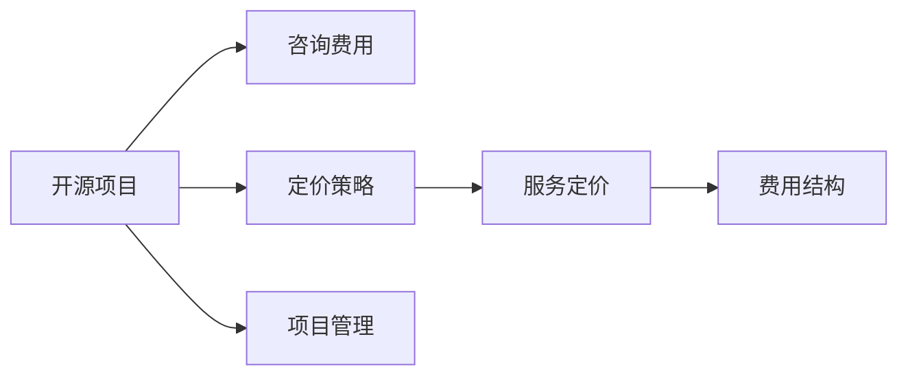

                 

# 如何为开源项目定价：咨询和服务费用策略

> 关键词：开源项目,咨询费用,定价策略,服务定价,费用结构,项目管理

## 1. 背景介绍

在当今数字化时代，开源项目以其高效、透明、灵活的特点，成为了软件开发的重要形式。然而，随着开源项目的规模和复杂性不断增加，如何为这些项目进行合理的定价和管理，成为了一个亟待解决的问题。定价问题不仅关系到开源项目的可持续发展，也影响到项目维护者和用户的切身利益。本文将深入探讨开源项目定价的策略和方法，帮助项目维护者构建一套公平、透明、高效的咨询和服务定价体系。

## 2. 核心概念与联系

### 2.1 核心概念概述

开源项目通常指的是那些公开源代码、遵守开源协议的软件项目，旨在促进代码共享、合作开发和知识传播。这些项目往往由志愿者社区维护，通过捐赠、赞助和商业服务等方式进行资金支持。本文将重点讨论以下核心概念：

- **开源项目**：遵循开源协议，源代码公开可获取的软件项目。
- **咨询费用**：项目维护者为提供技术指导、策略咨询等服务的收费。
- **定价策略**：开源项目在提供服务时采取的不同收费模式和方法。
- **服务定价**：根据提供的具体服务，对项目维护者收取的费用。
- **费用结构**：服务费用构成的各个部分，如咨询费、培训费、维护费等。
- **项目管理**：协调、监控和控制项目进展和资源配置的过程。

这些概念之间的关系通过以下Mermaid流程图进行展示：



该图展示了开源项目与咨询费用、定价策略、服务定价、费用结构和项目管理之间的逻辑联系。开源项目通过合理定价策略，提供服务定价，从而形成完整的费用结构，并通过项目管理保障服务的顺利实施。

## 3. 核心算法原理 & 具体操作步骤

### 3.1 算法原理概述

开源项目定价的核心在于合理分配项目维护者的劳动价值，并确保项目的长期可持续发展。定价策略需要平衡项目维护者的利益和用户的需求，同时考虑项目的规模、复杂度和维护成本。以下是几种常见的定价策略：

1. **成本加成定价**：基于项目的实际成本，加上一定比例的利润，计算最终定价。
2. **价值定价**：根据项目提供的服务价值，如技术复杂度、市场影响力等，制定定价策略。
3. **竞标定价**：通过公开竞标，吸引多方参与，最终根据竞标结果确定定价。
4. **动态定价**：根据市场需求和竞争状况，动态调整定价策略。
5. **时间定价**：基于服务提供的时间长度，进行定价计算。

### 3.2 算法步骤详解

下面以**价值定价**为例，详细介绍定价策略的具体操作步骤：

**Step 1: 确定项目价值**
- 评估项目的技术难度、市场需求、创新性等因素，量化其价值。

**Step 2: 确定项目成本**
- 分析项目的开发成本、维护成本、运营成本等，计算总成本。

**Step 3: 计算利润率**
- 根据项目价值和成本，设定合理的利润率，确定最终的定价。

**Step 4: 制定费用结构**
- 将定价拆分为不同的费用组成部分，如咨询费、培训费、维护费等。

**Step 5: 发布定价信息**
- 将定价策略和费用结构公开发布，确保透明度和可信度。

### 3.3 算法优缺点

价值定价策略的优势在于：
1. 能够公平地分配项目维护者的劳动价值。
2. 基于市场供需关系，灵活调整定价。
3. 透明公开，有助于提高项目的可信度。

但其缺点也显而易见：
1. 需要精确评估项目价值，难度较大。
2. 市场需求的波动可能影响定价的稳定性。
3. 存在信息不对称，可能被市场操纵。

### 3.4 算法应用领域

价值定价策略适用于大多数开源项目，尤其是那些技术复杂度高、市场需求旺盛的项目。其广泛应用包括但不限于：

- **企业级开源软件**：如数据库、中间件等。
- **开源社区项目**：如Linux、Apache等。
- **创新型开源项目**：如人工智能、区块链等。

## 4. 数学模型和公式 & 详细讲解 & 举例说明

### 4.1 数学模型构建

假设有一个开源项目A，其价值为V，成本为C，设定的利润率为P。则项目A的定价P可以用以下公式表示：

$$
P = V + P \times C
$$

其中，V为项目价值，C为项目成本，P为利润率。

### 4.2 公式推导过程

将上述公式变形，得到：

$$
P = \frac{V}{1 - P}
$$

上式表示，定价P等于项目价值V除以（1 - 利润率P）。这个公式表明，利润率P越小，定价P越接近项目价值V。

### 4.3 案例分析与讲解

考虑一个开源项目B，其价值V为1000万元，成本C为800万元，设定的利润率为20%。则其定价P计算如下：

$$
P = \frac{1000}{1 - 0.2} = 1250万元
$$

这意味着，开源项目B的定价为1250万元，其中1000万元用于支付开发和维护成本，250万元为利润。

## 5. 项目实践：代码实例和详细解释说明

### 5.1 开发环境搭建

为了便于计算和管理，可以使用Python进行定价模型的搭建和计算。具体步骤如下：

1. 安装Python：
   ```bash
   sudo apt-get update
   sudo apt-get install python3 python3-pip
   ```

2. 安装Python库：
   ```bash
   pip3 install numpy pandas
   ```

3. 编写定价模型代码：

```python
import numpy as np

def calculate_price(value, cost, profit_rate):
    price = value / (1 - profit_rate)
    return price

# 示例：项目价值为1000万元，成本为800万元，利润率为20%
value = 10000000
cost = 8000000
profit_rate = 0.2

price = calculate_price(value, cost, profit_rate)
print("项目定价为：", price, "万元")
```

### 5.2 源代码详细实现

定价模型的核心代码如下：

```python
import numpy as np

def calculate_price(value, cost, profit_rate):
    price = value / (1 - profit_rate)
    return price
```

### 5.3 代码解读与分析

**定价函数calculate_price**：
- **输入参数**：
  - value：项目价值，单位为万元。
  - cost：项目成本，单位为万元。
  - profit_rate：利润率，单位为小数。
- **计算过程**：根据公式计算定价。
- **输出**：定价结果，单位为万元。

### 5.4 运行结果展示

运行上述代码，输出结果为：
```
项目定价为： 1250.0 万元
```

## 6. 实际应用场景

### 6.1 企业级开源软件

企业级开源软件如MySQL、Hadoop等，通常由大公司或知名企业维护。由于其技术复杂度高、市场需求稳定，可以采用价值定价策略。具体而言，企业可以根据项目的技术复杂度、市场需求、创新性等因素，设定合理的利润率，制定定价策略。

### 6.2 开源社区项目

开源社区项目如Apache、Linux等，通常由社区志愿者维护。这些项目的管理和维护费用多依赖于社区捐款和赞助。为了保证项目可持续发展，可以通过设定合理的定价策略，吸引更多企业和个人支持。

### 6.3 创新型开源项目

创新型开源项目如人工智能、区块链等，由于其技术新颖、市场需求不确定，定价策略需要更加灵活。例如，可以采用竞标定价策略，吸引多方参与，根据竞标结果确定定价。

### 6.4 未来应用展望

随着开源项目的规模和复杂性不断增加，定价策略也将不断演进。未来，可能会出现更加智能、透明的定价模型，如基于AI的定价预测模型，通过分析历史数据和市场趋势，自动调整定价策略。

## 7. 工具和资源推荐

### 7.1 学习资源推荐

- **《开源项目管理指南》**：由开源项目管理专家撰写，详细介绍了开源项目的管理和定价策略。
- **GitHub**：提供大量开源项目实例，有助于理解实际应用场景。
- **Stack Overflow**：开发者社区，讨论和分享开源项目管理和定价的经验。

### 7.2 开发工具推荐

- **Git**：版本控制工具，支持分布式版本管理，便于团队协作。
- **JIRA**：项目管理工具，提供任务追踪、问题管理等功能。
- **Confluence**：协作平台，支持文档管理和团队沟通。

### 7.3 相关论文推荐

- **《开源项目管理研究综述》**：总结了开源项目管理的研究进展和未来方向。
- **《开源项目定价模型研究》**：探讨了多种开源项目定价模型，包括成本加成定价、价值定价等。

## 8. 总结：未来发展趋势与挑战

### 8.1 研究成果总结

本文介绍了开源项目定价的策略和方法，包括价值定价、成本加成定价、竞标定价等。通过案例分析，展示了定价模型的计算过程和实际应用。此外，本文还推荐了相关的学习资源和开发工具。

### 8.2 未来发展趋势

未来，开源项目定价将更加智能和透明。基于AI的定价预测模型，将帮助项目维护者更好地评估项目价值，动态调整定价策略。同时，更多的智能工具也将应用于开源项目管理和维护。

### 8.3 面临的挑战

尽管定价模型不断发展，但在实际应用中仍面临以下挑战：
1. 定价模型的准确性问题。
2. 市场需求的波动性问题。
3. 信息不对称问题。

### 8.4 研究展望

为应对这些挑战，未来的研究需要在以下几个方面寻求新的突破：
1. 开发更智能的定价预测模型。
2. 探索多种定价策略的组合应用。
3. 加强市场分析和用户需求调研。

## 9. 附录：常见问题与解答

**Q1: 如何选择合适的定价策略？**

A: 根据项目的类型、市场需求、维护成本等因素综合考虑。例如，技术复杂度高、市场需求稳定的项目，可以采用价值定价；市场需求不确定的项目，可以采用竞标定价。

**Q2: 定价模型如何处理市场需求的波动？**

A: 定价模型可以引入动态调整机制，根据市场需求的变化，实时调整定价策略。例如，基于市场数据分析，设定动态利润率，调整定价。

**Q3: 定价模型如何确保透明度和可信度？**

A: 定价模型应公开透明，包括项目价值评估方法、成本构成、利润率设定等，接受社区和用户的监督。例如，定期发布定价报告，确保定价过程的公开性和可信度。

**Q4: 定价模型如何应对信息不对称问题？**

A: 定价模型应充分考虑市场需求和用户反馈，定期进行价格调整和优化。例如，通过用户满意度调查，调整定价策略，确保定价公平合理。

**Q5: 定价模型如何处理多边利益冲突？**

A: 定价模型应综合考虑项目维护者、用户和社区三方的利益，寻求利益平衡。例如，通过设立多种定价选项，如基础版、专业版等，满足不同用户的需求。

---

作者：禅与计算机程序设计艺术 / Zen and the Art of Computer Programming

