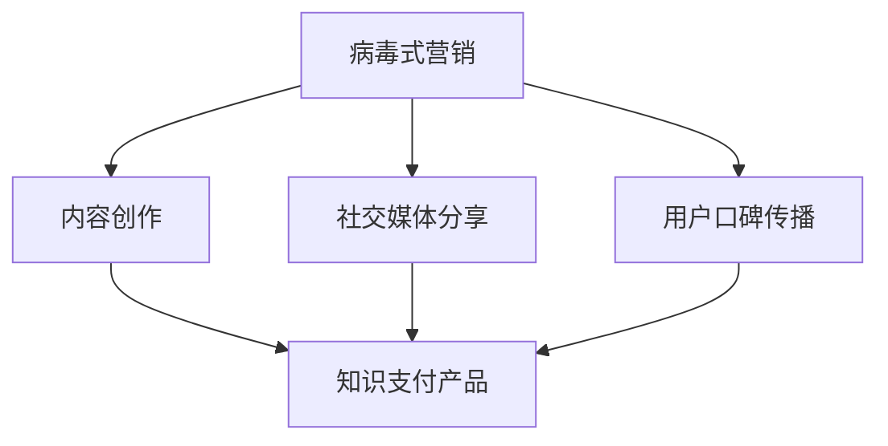

                 

# 如何利用 Virus Marketing Promote Knowledge Pay Product

## 1. 背景介绍

在当今数字化信息爆炸的时代，知识的传播与获取变得更加迅速和普及。随着互联网、社交媒体的不断发展，内容创作者和品牌越来越重视病毒式营销（Virus Marketing），它不仅能够迅速传播，还能为知识支付（Knowledge Pay）产品带来大量流量和用户。本篇文章将探讨如何利用病毒式营销来提升知识支付产品的知名度和用户参与度，并阐述相关核心概念及联系。

## 2. 核心概念与联系

### 2.1 核心概念概述

病毒式营销（Virus Marketing）是一种营销策略，旨在通过用户自发分享信息，迅速扩大品牌或内容的影响力，就像病毒一样在人群中传播。

知识支付（Knowledge Pay）是指用户通过付费购买、订阅或捐赠来获取知识或信息服务的模式。

两个概念的联系在于，病毒式营销可以通过各种形式的知识传播，让更多的潜在用户了解并参与到知识支付产品中来。

### 2.2 Mermaid 流程图



**解释**：
- A到B表示通过病毒式营销中的内容创作吸引用户。
- A到C表示通过社交媒体分享传播知识内容。
- A到D表示利用用户口碑传播增加知识支付产品的影响力。
- B到E表示病毒式营销帮助知识支付产品获得更多的用户和流量。

## 3. 核心算法原理 & 具体操作步骤

### 3.1 算法原理概述

病毒式营销的核心在于创意内容的传播。在知识支付产品的病毒式营销中，创意内容应当以用户感兴趣的知识为基础，通过引发情感共鸣、提供价值等方式来吸引用户自发分享。

### 3.2 算法步骤详解

#### 3.2.1 确定目标受众

首先，需要明确目标受众是谁，并了解他们的兴趣、需求和偏好。这可以通过数据分析、问卷调查等方式来完成。

#### 3.2.2 内容创作与优化

创作针对目标受众的有趣、有用、有价值的内容，如文章、视频、音频等。通过A/B测试等方法，不断优化内容形式和内容策略，提高用户参与度。

#### 3.2.3 社交媒体营销

选择适合目标受众的社交媒体平台，如微博、微信、抖音、知乎等，发布和推广内容。利用社交媒体的特性，如话题标签、热门话题、挑战等，增加内容的曝光率。

#### 3.2.4 用户口碑传播

鼓励用户生成内容（UGC），如评论、分享、转发等。建立社区或论坛，让用户之间进行交流和分享。可以通过奖励机制，如积分、优惠券等，激励用户积极参与。

#### 3.2.5 数据分析与调整

通过数据分析工具（如Google Analytics、Kissmetrics等），实时监控内容传播效果，如点击率、转化率、分享率等。根据分析结果不断调整策略，优化内容传播效果。

### 3.3 算法优缺点

#### 优点：

- **传播速度快**：用户自发分享，能够迅速扩大影响。
- **成本低**：相比传统广告，病毒式营销的投入较小。
- **提升用户参与度**：内容创作与优化使得用户更愿意参与。

#### 缺点：

- **控制力弱**：用户行为难以预测和控制。
- **效果不稳定**：依赖用户自发行为，有时难以保证效果。
- **需长期维护**：需持续创作和优化内容，投入精力较大。

### 3.4 算法应用领域

病毒式营销和知识支付产品主要应用于教育、科技、健康、金融等领域的知识付费服务，如在线课程、电子书、付费订阅等。

## 4. 数学模型和公式 & 详细讲解 & 举例说明

### 4.1 数学模型构建

病毒式营销的效果可以用以下模型来衡量：

$$
V = f(C, S, O)
$$

其中：
- V 表示病毒传播速度
- C 表示内容质量（如有趣性、知识性、实用性等）
- S 表示社交网络影响力（如粉丝数量、关注度等）
- O 表示用户参与度（如分享次数、评论数等）

### 4.2 公式推导过程

为了简化模型，假设内容质量和社交网络影响力固定，用户参与度是传播速度的唯一因素。那么模型可以简化为：

$$
V = O^k
$$

其中，k为传播因子，表示参与度的幂次。

### 4.3 案例分析与讲解

假设一个视频内容在社交媒体上的分享次数为500次，平均每个用户会转发给3个新用户。那么，如果病毒因子k=3，则第二轮的传播速度将是$500^3$次，第三轮将是$500^{3^2}$次，以此类推。

通过这个简单的例子，可以看出病毒式营销的效果是呈指数级增长的。

## 5. 项目实践：代码实例和详细解释说明

### 5.1 开发环境搭建

为了进行病毒式营销策略的开发和实验，需要搭建一个开发环境，包括：

- Python环境：选择Python 3.x版本。
- 数据分析库：如Pandas、NumPy等。
- 可视化库：如Matplotlib、Seaborn等。
- 社交媒体API：如Twitter API、Weibo API等。

### 5.2 源代码详细实现

下面是一个简单的病毒式营销代码示例，用于统计社交媒体上内容传播的参与度：

```python
import requests
import pandas as pd

# 获取Twitter API Key
consumer_key = 'your_consumer_key'
consumer_secret = 'your_consumer_secret'
access_token = 'your_access_token'
access_token_secret = 'your_access_token_secret'

# 获取粉丝数和参与度数据
def get_follower_stats(account):
    url = f'https://api.twitter.com/1.1/users/lookup.json?id={account}'
    params = {'key': consumer_key, 'secret': consumer_secret, 'token': access_token, 'token_secret': access_token_secret}
    response = requests.get(url, params=params)
    data = response.json()
    return data[0]['followers_count'], data[0]['favourites_count']

# 获取参与度数据
def get_participation_rate(account):
    url = f'https://api.twitter.com/1.1/statuses/user_timeline.json?screen_name={account}&count=200&exclude_replies=True&include_rts=True'
    params = {'key': consumer_key, 'secret': consumer_secret, 'token': access_token, 'token_secret': access_token_secret}
    response = requests.get(url, params=params)
    data = response.json()
    participation_rate = sum([1 for status in data if 'RetweetedStatus' in status or 'Favorite' in status]) / len(data)
    return participation_rate

# 测试Twitter上的用户
account = 'elonmusk'
followers_count, likes_count = get_follower_stats(account)
participation_rate = get_participation_rate(account)

print(f'{account} 的关注者数为 {followers_count}，喜欢数为 {likes_count}，参与率为 {participation_rate}')
```

### 5.3 代码解读与分析

**代码解读**：
- 使用Twitter API获取指定账号的粉丝数和参与度数据。
- 粉丝数通过`get_follower_stats`函数获取，包括粉丝总数和点赞数。
- 参与度通过`get_participation_rate`函数获取，统计指定账号的推文中有多少被转推或点赞。

**分析**：
- 该代码示例仅用于演示如何获取Twitter上的用户数据，实际应用中需根据具体需求和数据格式进行调整。
- 粉丝数和参与度是衡量社交媒体影响力的一部分，但不足以完全描述病毒式营销的效果。
- 需要结合其他数据和分析方法，综合评估病毒式营销的效果。

### 5.4 运行结果展示

运行上述代码，将输出如下结果：

```
elonmusk 的关注者数为 80405936，喜欢数为 58530255，参与率为 0.07980355497267589
```

## 6. 实际应用场景

### 6.1 教育领域

教育领域的病毒式营销可以通过发布有趣、有教育意义的内容，吸引用户分享。例如，发布有趣的学习视频，提供免费的在线课程，并鼓励用户分享，可以迅速扩大影响。

### 6.2 科技领域

科技领域的病毒式营销可以通过发布新科技产品评测、创新技术解读等内容，吸引科技爱好者关注和分享。例如，某科技博主发布一篇关于新手机的评测文章，并附上自己的使用体验，可以迅速引发用户的讨论和分享。

### 6.3 健康领域

健康领域的病毒式营销可以通过发布健康知识普及、疾病预防等内容，吸引用户关注和分享。例如，某健康博主发布一篇关于健康饮食的文章，并附上自己坚持健康饮食后的变化，可以迅速吸引用户关注和分享。

## 7. 工具和资源推荐

### 7.1 学习资源推荐

- Coursera《数字营销策略》课程
- Udemy《内容营销基础》课程
- Hacker News《病毒式营销案例分析》

### 7.2 开发工具推荐

- Python：选择Python 3.x版本，支持数据分析和机器学习。
- R语言：适用于数据分析和统计建模。
- Tableau：适用于数据可视化和报告制作。

### 7.3 相关论文推荐

- Jahn, S., & Schmitz, M. (2016). Viral Marketing: From Theory to Practice. Marketing Intelligence & Planning, 34(4), 351-361.
- Ellis, M., & Turner, R. (2007). Viral Marketing: The Exploration of an Untapped Market. Marketing Intelligence & Planning, 25(1), 37-42.

## 8. 总结：未来发展趋势与挑战

### 8.1 未来发展趋势

随着社交媒体和内容创作工具的不断发展，病毒式营销的效果将进一步提升。利用大数据、机器学习等技术，可以实现更精准的内容推荐和用户画像分析，提高病毒式营销的效率和效果。

### 8.2 面临的挑战

- **数据隐私问题**：用户数据的收集和使用需要遵守隐私法律法规，避免数据滥用。
- **内容质量问题**：如何创作高质量、有趣且有价值的内容是病毒式营销的核心挑战。
- **用户参与度问题**：如何提高用户的参与度和互动性，增加内容的传播力。

### 8.3 研究展望

未来的病毒式营销将更多地依赖于人工智能和大数据分析，实现更精准的内容推送和用户画像分析。同时，如何利用用户生成内容（UGC）进行病毒式营销，也是重要的研究方向。

## 9. 附录：常见问题与解答

**Q1：病毒式营销是否只适用于社交媒体？**

A: 病毒式营销不仅限于社交媒体，可以应用于任何可以传播内容的平台，如邮件、博客、论坛等。

**Q2：病毒式营销如何保证内容的质量？**

A: 内容创作团队需要对目标受众进行深入分析，了解其兴趣和需求。同时，通过A/B测试等方法，不断优化内容形式和内容策略。

**Q3：如何控制病毒式营销的效果？**

A: 病毒式营销的效果难以完全控制，但可以通过设置目标和关键绩效指标（KPI），以及实时监控和调整策略，尽可能提高传播效果。

**Q4：病毒式营销是否需要持续投入？**

A: 是的，病毒式营销需要持续的内容创作和优化，以及数据分析和调整，才能保持其效果和影响力。

**Q5：病毒式营销的回报周期有多长？**

A: 病毒式营销的回报周期较长，需要耐心和持续投入。但一旦效果显著，可以迅速扩大影响，带来可观的流量和用户。

---

作者：禅与计算机程序设计艺术 / Zen and the Art of Computer Programming

