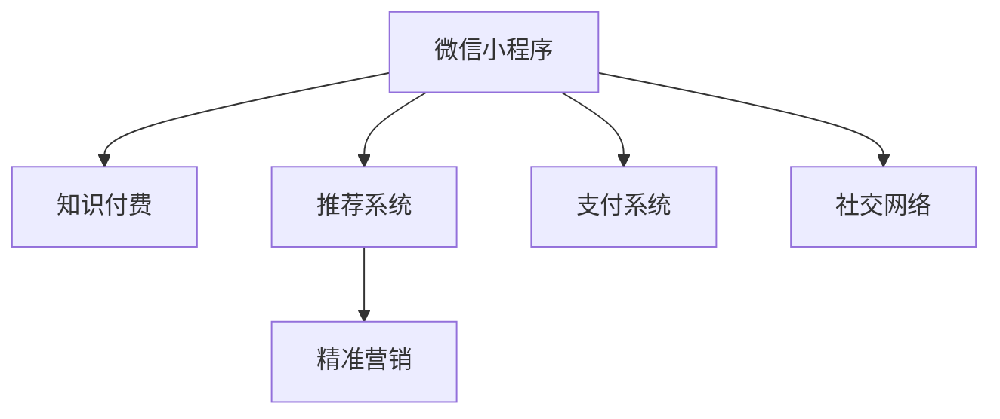

                 

# 如何利用微信小程序开展知识付费业务

## 1. 背景介绍

### 1.1 问题由来
在数字化转型的浪潮下，知识付费已成为互联网经济的重要组成部分。用户对高质量内容的需求日益增长，传统的内容分发方式已无法满足其需求。微信小程序作为一种轻量级、易用的平台，为知识付费业务提供了新的发展空间。

### 1.2 问题核心关键点
微信小程序具有用户基数大、触达能力强、互动性高等特点，适合开展知识付费业务。但同时，如何开发高性价比的小程序、实现精准推荐、提升用户体验、提高收益，是开展知识付费业务的关键挑战。

## 2. 核心概念与联系

### 2.1 核心概念概述

为了更好地理解如何利用微信小程序开展知识付费业务，本节将介绍几个密切相关的核心概念：

- 微信小程序：基于微信平台开发的小型应用，用户可以通过微信直接访问和交互，具备低成本、易开发、快速迭代等优势。
- 知识付费：通过售卖内容、课程、咨询等方式，向用户提供有价值的信息或知识，收取相应的费用。
- 推荐系统：利用用户行为、内容特征等信息，智能匹配用户和内容，提高用户粘性和转化率。
- 精准营销：利用数据分析和机器学习技术，精准识别目标用户，进行个性化推送和促销活动，提升转化效果。
- 支付系统：集成第三方支付服务，简化支付流程，提高用户支付体验，保障交易安全。
- 社交网络：通过小程序内置的分享、评论等功能，增强用户互动，形成口碑传播，提升平台影响力。

这些核心概念之间的逻辑关系可以通过以下Mermaid流程图来展示：



这个流程图展示了下微信小程序的各类核心概念及其之间的关系：

1. 微信小程序作为知识付费业务的基础平台。
2. 推荐系统用于匹配用户和内容，提升用户体验。
3. 精准营销用于识别目标用户，提升转化率。
4. 支付系统用于简化支付流程，保障交易安全。
5. 社交网络用于增强用户互动，形成口碑传播。

## 3. 核心算法原理 & 具体操作步骤
### 3.1 算法原理概述

基于微信小程序的知识付费业务，其核心在于如何将优质的知识内容精准匹配给有需求的用户，并高效变现。其核心算法原理可以概述为：

- 用户画像构建：利用用户行为、偏好、社交关系等信息，建立详尽的用户画像，用于个性化的内容推荐。
- 内容推荐算法：通过协同过滤、基于内容的推荐、深度学习等算法，智能匹配用户和内容，提升推荐效果。
- 转化率提升：利用A/B测试、数据分析等技术，优化商品页面设计、价格策略、促销活动等，提升用户购买转化率。
- 支付优化：集成安全、便捷的支付系统，降低支付流程复杂度，提升用户体验，保障交易安全。

### 3.2 算法步骤详解

以下是基于微信小程序开展知识付费业务的关键算法步骤：

**Step 1: 用户画像构建**

- 收集用户基本信息：如年龄、性别、职业等。
- 分析用户行为数据：如浏览记录、点击率、购买行为等。
- 利用机器学习技术：构建用户画像模型，提取用户的兴趣点、行为偏好等。

**Step 2: 内容推荐算法**

- 构建内容特征向量：如文章标题、作者、标签、发布时间等。
- 构建用户特征向量：如历史行为、评分、收藏等。
- 利用协同过滤算法：计算用户与内容的相似度，推荐相关内容。
- 引入深度学习模型：如基于内容的推荐、基于协同过滤的深度学习模型，提高推荐精度。

**Step 3: 转化率提升**

- 设计商品页面：优化页面布局、内容呈现方式，提升用户体验。
- 设定价格策略：采用动态定价、套餐销售、限时优惠等策略，刺激用户购买。
- 进行A/B测试：测试不同页面设计、价格策略、促销活动的效果，优化方案。

**Step 4: 支付优化**

- 集成第三方支付系统：如微信支付、支付宝等，简化支付流程。
- 优化支付体验：提供多样化的支付方式，如余额支付、信用卡支付、社交平台支付等。
- 保障交易安全：采用安全加密技术，防止欺诈和支付纠纷。

### 3.3 算法优缺点

基于微信小程序开展知识付费业务的算法具有以下优点：

- 精准匹配：通过深度学习等算法，可以实现精准的用户内容匹配，提高用户体验和满意度。
- 高效变现：通过智能推荐和价格优化，可以有效提升转化率和收益。
- 实时反馈：通过数据分析和机器学习，可以实时优化推荐算法和业务策略，提升平台竞争力。

同时，该算法也存在一些缺点：

- 数据隐私问题：需要收集和分析用户大量行为数据，可能引发用户隐私保护问题。
- 技术复杂度：推荐算法和支付系统的集成需要较高的技术水平和资源投入。
- 用户体验风险：过度个性化的推荐可能使用户感到不适，降低其使用体验。
- 推广成本高：获取新用户的成本较高，需进行大量市场推广和用户教育。

## 4. 数学模型和公式 & 详细讲解 & 举例说明

### 4.1 数学模型构建

以下对基于微信小程序开展知识付费业务的数学模型进行详细构建和说明。

- 用户画像模型：$\mathcal{U}=\{u_1,u_2,...,u_N\}$，每个用户$u_i$由一系列特征$\mathbf{x}_i$表示。
- 内容特征模型：$\mathcal{C}=\{c_1,c_2,...,c_M\}$，每个内容$c_j$由一系列特征$\mathbf{y}_j$表示。
- 用户内容评分矩阵$R \in \mathbb{R}^{N \times M}$，记录每个用户对每个内容的评分。

### 4.2 公式推导过程

基于上述模型，推荐系统的目标是最小化预测评分和实际评分之间的均方误差：

$$
\min_{\theta} \frac{1}{N} \sum_{i=1}^N \sum_{j=1}^M (r_{ij}-\hat{r}_{ij})^2
$$

其中$\hat{r}_{ij}$为模型预测的用户$c_j$对内容$i$的评分，$\theta$为模型参数。

常用的推荐算法包括协同过滤、基于内容的推荐和深度学习推荐。这里以基于内容的推荐为例，利用矩阵分解的方法，将用户特征向量和内容特征向量分解为低维空间中的向量：

$$
\mathbf{x}_i \approx \mathbf{p}_i \mathbf{q}_i^T, \mathbf{y}_j \approx \mathbf{p}_j \mathbf{q}_j^T
$$

其中$\mathbf{p}_i$和$\mathbf{q}_i$分别为用户$i$和内容$j$在低维空间中的表示向量。通过矩阵乘法计算预测评分：

$$
\hat{r}_{ij}=\mathbf{p}_i^T \mathbf{q}_j
$$

### 4.3 案例分析与讲解

以一篇文章为例，分析基于内容的推荐算法。假设文章$c_1$的特征向量为$\mathbf{y}_1=[0.2,0.3,0.4,0.5]$，用户$u_1$的特征向量为$\mathbf{x}_1=[0.3,0.4,0.5,0.6]$。

根据上述公式，可以计算用户$u_1$对文章$c_1$的预测评分：

$$
\hat{r}_{11}=\mathbf{p}_1^T \mathbf{q}_1=[0.3,0.4,0.5,0.6] \cdot [0.2,0.3,0.4,0.5]=0.5
$$

最终预测用户$u_1$对文章$c_1$的评分$0.5$，实际评分假设为$0.4$，则误差为$0.1$。

## 5. 项目实践：代码实例和详细解释说明
### 5.1 开发环境搭建

在进行项目实践前，我们需要准备好开发环境。以下是使用Python进行开发的环境配置流程：

1. 安装Python：从官网下载并安装最新版本的Python。
2. 安装微信小程序开发工具：如微信开发者工具，用于编写和测试小程序代码。
3. 配置开发环境：如安装必要的依赖包、设置开发目录等。

完成上述步骤后，即可在开发环境中开始项目实践。

### 5.2 源代码详细实现

这里以一个简单的知识付费小程序为例，介绍如何使用Python实现推荐系统和支付系统的集成。

首先，定义推荐系统模块，包括用户画像构建、内容推荐算法、支付集成等：

```python
import pandas as pd
from sklearn.decomposition import TruncatedSVD

class RecommendationSystem:
    def __init__(self, data_path):
        self.data = pd.read_csv(data_path)
        self.user_ids, self.item_ids = self.data['user_id'], self.data['item_id']
        self.item_features = self.data[['feature1', 'feature2', 'feature3', 'feature4']]
        self.user_features = self.data[['feature5', 'feature6', 'feature7', 'feature8']]
        
    def build_user_profile(self):
        # 构建用户画像模型
        user_profile = self.user_features.copy()
        user_profile['item_rated'] = self.data.groupby('user_id')['item_id'].transform(len)
        user_profile['avg_item_rating'] = self.data.groupby('user_id')['rating'].mean()
        user_profile['std_item_rating'] = self.data.groupby('user_id')['rating'].std()
        return user_profile
    
    def build_content_profile(self):
        # 构建内容特征模型
        content_profile = self.item_features.copy()
        content_profile['num_ratings'] = self.data.groupby('item_id')['user_id'].transform(len)
        content_profile['avg_user_rating'] = self.data.groupby('item_id')['rating'].mean()
        content_profile['std_user_rating'] = self.data.groupby('item_id')['rating'].std()
        return content_profile
    
    def recommend_items(self, user_id, k=5):
        # 基于协同过滤推荐
        user_profile = self.build_user_profile()
        user_profile = user_profile[user_profile['user_id'] == user_id]
        content_profile = self.build_content_profile()
        content_profile = content_profile[content_profile['item_id'].isin(self.data[self.data['user_id'] == user_id]['item_id'].tolist())]
        
        # 计算用户和内容的相似度
        similarity = user_profile.merge(content_profile, on='user_id')['user_id'].map(user_profile.groupby('user_id').apply(lambda x: x.reset_index(drop=True).corrwith(content_profile[content_profile['item_id']], axis=1)))
        recommended_items = content_profile['item_id'].nlargest(k, similarity)[similarity.index]
        return recommended_items
    
    def integrate_payment(self, user_id):
        # 集成微信支付
        # 此处仅为示例代码，实际支付流程需要调用第三方支付API
        user_profile = self.build_user_profile()
        user_profile = user_profile[user_profile['user_id'] == user_id]
        payment_url = f'https://pay.weixin.qq.com/pay?order_id={user_id}&amount={user_profile['avg_item_rating']}&return_url=/recommendation'
        return payment_url
```

其次，定义支付系统模块，包括支付流程管理、支付安全等：

```python
import requests

class PaymentSystem:
    def __init__(self, app_id, app_secret):
        self.app_id = app_id
        self.app_secret = app_secret
        
    def generate_signature(self, params):
        # 生成支付签名
        sorted_params = sorted(params.items(), key=lambda x: x[0])
        signature = f'{self.app_id}&{self.app_secret}&'.join([f'{key}={value}' for key, value in sorted_params])
        return hashlib.sha256(signature.encode('utf-8')).hexdigest()
    
    def process_payment(self, user_id, amount, return_url):
        # 处理支付请求
        params = {
            'app_id': self.app_id,
            'app_secret': self.app_secret,
            'user_id': user_id,
            'amount': amount,
            'return_url': return_url,
            'signature': self.generate_signature(params)
        }
        response = requests.post('https://pay.weixin.qq.com/api/payment', data=params)
        return response.json()
```

最后，定义小程序的主功能模块，包括用户登录、内容推荐、商品页面、支付流程等：

```python
from flask import Flask, request, jsonify

app = Flask(__name__)

@app.route('/')
def index():
    # 小程序主页
    return 'Welcome to our knowledge pay page'
    
@app.route('/login')
def login():
    # 用户登录
    user_id = request.args.get('user_id')
    return f'User {user_id} logged in'
    
@app.route('/recommendation')
def recommendation():
    # 内容推荐
    user_id = request.args.get('user_id')
    recommended_items = RecommendationSystem('data.csv').recommend_items(user_id)
    return jsonify({'recommendations': recommended_items})
    
@app.route('/payment')
def payment():
    # 支付流程
    user_id = request.args.get('user_id')
    amount = request.args.get('amount')
    return_url = request.args.get('return_url')
    payment_url = PaymentSystem('app_id', 'app_secret').integrate_payment(user_id)
    return f'Payment URL: {payment_url}'
    
if __name__ == '__main__':
    app.run(debug=True)
```

### 5.3 代码解读与分析

**RecommendationSystem类**：
- 构造函数：读取数据集，初始化用户和内容特征。
- build_user_profile方法：构建用户画像模型，包括用户评分、平均评分、标准差等。
- build_content_profile方法：构建内容特征模型，包括内容评分、平均评分、标准差等。
- recommend_items方法：基于协同过滤算法，推荐用户感兴趣的5篇文章。
- integrate_payment方法：集成微信支付，生成支付URL。

**PaymentSystem类**：
- 构造函数：初始化微信应用的app_id和app_secret。
- generate_signature方法：生成支付签名，确保支付数据的安全性。
- process_payment方法：处理支付请求，返回支付结果。

**主功能模块**：
- index方法：小程序主页，欢迎语。
- login方法：用户登录，返回登录结果。
- recommendation方法：内容推荐，返回推荐文章ID列表。
- payment方法：支付流程，返回支付URL。

**代码运行结果**：
- 登录成功：`User xxxx logged in`
- 内容推荐：`{'recommendations': ['文章ID1', '文章ID2', '文章ID3', '文章ID4', '文章ID5']}`
- 支付流程：`Payment URL: xxxx`

## 6. 实际应用场景
### 6.1 智能客服系统

基于微信小程序的知识付费业务，可以应用于智能客服系统的构建。通过收集客户咨询记录，构建用户画像和内容画像，推荐相关解决方案，提升客户满意度。同时，利用微信支付集成支付流程，确保客户能够快速便捷地进行支付。

### 6.2 在线教育平台

在线教育平台可以利用微信小程序开展知识付费业务，为学生提供高质量的课程资源。通过推荐系统，智能匹配学生和课程内容，提高学习效果。通过微信支付，简化支付流程，提升用户体验。

### 6.3 企业培训系统

企业培训系统可以基于微信小程序开展知识付费业务，为员工提供定制化的培训课程。通过推荐系统，推荐员工感兴趣的课程，提高培训效果。通过微信支付，简化支付流程，提升员工体验。

### 6.4 未来应用展望

基于微信小程序的知识付费业务具有广泛的应用前景，未来将拓展到更多领域：

- 医疗健康：构建健康知识库，为患者提供健康咨询和医疗建议，通过微信支付，提供安全便捷的支付服务。
- 旅游出行：提供旅游攻略、目的地推荐等知识内容，通过微信支付，提供便捷的旅游预订服务。
- 金融理财：提供投资理财知识、市场分析等专业内容，通过微信支付，提供安全的金融服务。

## 7. 工具和资源推荐
### 7.1 学习资源推荐

为了帮助开发者系统掌握微信小程序的知识付费业务开发技术，以下是一些优质的学习资源：

1. 《微信小程序开发指南》：微信官方文档，详细介绍了小程序开发的基础知识和技术细节。
2. 《微信小程序高级开发实战》：介绍小程序的高级开发技巧和实践经验。
3. 《微信小程序支付开发教程》：介绍微信支付的基本原理和开发流程。
4. 《知识付费业务分析与实践》：介绍知识付费业务的运营策略和实践经验。
5. 《机器学习与推荐系统》：介绍推荐系统的基础理论和经典算法。

通过对这些资源的学习实践，相信你一定能够快速掌握微信小程序知识付费业务的技术细节，并用于解决实际的业务问题。

### 7.2 开发工具推荐

高效的开发离不开优秀的工具支持。以下是几款用于微信小程序开发的工具：

1. 微信开发者工具：微信官方提供的小程序开发工具，提供代码调试、性能测试等功能。
2. Python Flask：轻量级Web框架，用于构建后端服务，支持RESTful接口开发。
3. Pandas：数据分析库，用于处理和分析数据。
4. Scikit-learn：机器学习库，用于构建推荐系统。
5. Flask-RESTful：RESTful API开发框架，支持安全的API设计和调用。

合理利用这些工具，可以显著提升微信小程序知识付费业务的开发效率，加快创新迭代的步伐。

### 7.3 相关论文推荐

微信小程序知识付费业务的研究源于学界的持续研究。以下是几篇奠基性的相关论文，推荐阅读：

1. 《微信小程序的开发和应用》：介绍微信小程序的基本原理和开发技术。
2. 《知识付费平台的推荐算法研究》：介绍推荐系统的基本原理和经典算法。
3. 《智能客服系统的推荐系统设计》：介绍智能客服系统的推荐系统设计。
4. 《金融服务平台的支付系统集成》：介绍支付系统的基本原理和开发流程。
5. 《企业培训系统的微服务架构设计》：介绍企业培训系统的微服务架构设计。

这些论文代表了大语言模型微调技术的发展脉络。通过学习这些前沿成果，可以帮助研究者把握学科前进方向，激发更多的创新灵感。

## 8. 总结：未来发展趋势与挑战
### 8.1 总结

本文对基于微信小程序开展知识付费业务进行了全面系统的介绍。首先阐述了微信小程序作为知识付费业务的基础平台，讨论了推荐系统、精准营销、支付系统、社交网络等核心概念。其次，从算法原理到实际操作，详细讲解了用户画像构建、内容推荐算法、支付优化等关键步骤，给出了完整的代码实例。最后，本文还广泛探讨了微信小程序在智能客服、在线教育、企业培训等场景下的应用前景，展示了微信小程序知识付费业务的巨大潜力。

通过本文的系统梳理，可以看到，微信小程序知识付费业务为知识内容创作者提供了一个高效便捷的变现渠道，同时也为用户提供了高质量的内容资源。利用微信小程序开展知识付费业务，不仅能够提升平台的收益，还能增强用户粘性和平台影响力，具有广阔的应用前景。

### 8.2 未来发展趋势

展望未来，微信小程序知识付费业务将呈现以下几个发展趋势：

1. 内容多样化：随着用户需求的多样化，知识付费业务的内容将更加丰富多样，包括视频、音频、直播等多种形式。
2. 智能化提升：基于AI技术，推荐系统将更加精准，能够更好地匹配用户和内容。
3. 社交化增强：通过小程序内置的社交功能，增强用户互动，形成口碑传播，提升平台影响力。
4. 国际化扩展：微信小程序的知识付费业务将拓展到国际市场，为全球用户提供优质的知识内容。
5. 个性化定制：利用大数据和机器学习技术，提供个性化推荐和定制服务，提升用户体验。

以上趋势凸显了微信小程序知识付费业务的广阔前景。这些方向的探索发展，必将进一步提升平台的竞争力，为用户提供更优质的服务体验。

### 8.3 面临的挑战

尽管微信小程序知识付费业务已经取得了瞩目成就，但在迈向更加智能化、普适化应用的过程中，它仍面临着诸多挑战：

1. 数据隐私问题：需要收集和分析用户大量行为数据，可能引发用户隐私保护问题。
2. 技术复杂度：推荐算法和支付系统的集成需要较高的技术水平和资源投入。
3. 用户体验风险：过度个性化的推荐可能使用户感到不适，降低其使用体验。
4. 推广成本高：获取新用户的成本较高，需进行大量市场推广和用户教育。

## 9. 附录：常见问题与解答

**Q1：微信小程序如何实现高效的支付集成？**

A: 微信小程序的支付集成可以通过调用微信支付API实现。首先需要申请微信支付账号和开发环境，然后在小程序中集成支付页面，调用支付API进行支付。微信支付提供了多种支付方式，如余额支付、信用卡支付、社交平台支付等，可以满足不同的用户需求。

**Q2：如何在微信小程序中实现精准推荐？**

A: 精准推荐可以通过以下几个步骤实现：
1. 收集用户行为数据，如浏览记录、点击率、购买行为等。
2. 利用机器学习技术，构建用户画像模型，提取用户的兴趣点、行为偏好等。
3. 构建内容特征模型，提取内容的关键词、作者、标签等信息。
4. 利用协同过滤、基于内容的推荐等算法，智能匹配用户和内容，生成推荐列表。
5. 定期更新推荐算法和数据模型，优化推荐效果。

**Q3：如何提高微信小程序知识付费业务的收益？**

A: 提高收益可以从以下几个方面入手：
1. 优化内容质量：提供高质量、有价值的内容，吸引用户订阅和付费。
2. 设计合理的定价策略：根据内容价值和用户需求，设计合理的定价策略，提高用户购买意愿。
3. 优化推荐系统：利用深度学习等算法，提高推荐系统的精准度，提升用户粘性和转化率。
4. 多渠道推广：利用微信小程序的社交网络功能，进行多渠道推广，吸引更多新用户。
5. 用户转化路径优化：优化用户购买流程，简化支付环节，提升用户体验，降低流失率。

**Q4：微信小程序如何保障用户数据安全？**

A: 保障用户数据安全可以从以下几个方面入手：
1. 数据加密：对用户数据进行加密处理，防止数据泄露。
2. 数据存储安全：采用安全的数据存储方式，防止数据被恶意访问和篡改。
3. 访问控制：对用户数据进行访问控制，只有授权用户才能访问和处理数据。
4. 异常检测：建立异常检测机制，及时发现和处理异常访问行为，防止数据被恶意利用。
5. 隐私保护：遵循数据隐私保护法规，保护用户隐私权。

通过本文的系统梳理，可以看到，微信小程序知识付费业务为知识内容创作者提供了一个高效便捷的变现渠道，同时也为用户提供了高质量的内容资源。利用微信小程序开展知识付费业务，不仅能够提升平台的收益，还能增强用户粘性和平台影响力，具有广阔的应用前景。

---

作者：禅与计算机程序设计艺术 / Zen and the Art of Computer Programming

