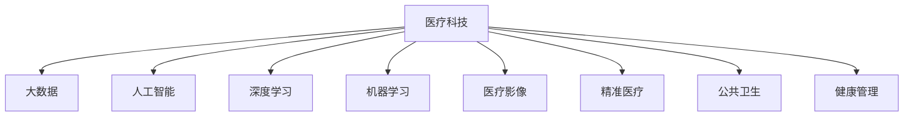

                 

# 如何利用技术能力进行医疗科技创新

> 关键词：医疗科技,人工智能,深度学习,大数据,机器学习,智能诊断,医疗影像,精准医疗,公共卫生,健康管理,疾病预测

## 1. 背景介绍

### 1.1 问题由来

随着信息技术的发展，医疗科技领域正经历着前所未有的变革。大数据、人工智能(AI)、深度学习等先进技术，正逐步渗透到医疗服务的各个环节，推动医疗科技向智能化、精准化、个性化方向发展。人工智能技术的引入，不仅提升了医疗诊断的效率和精度，还拓展了医疗服务的边界，为医疗健康产业带来了新的突破。

然而，当前医疗科技的发展仍面临诸多挑战。例如，如何有效地利用海量医疗数据进行疾病预测和精准诊断？如何在提高诊疗效率的同时，保障患者隐私和数据安全？如何构建一个普惠、可持续的医疗健康生态系统？这些都是需要我们进一步探索和解决的问题。

### 1.2 问题核心关键点

医疗科技创新的核心在于如何利用先进的技术手段，提升医疗服务的质量和效率。具体而言，包括以下几个关键点：

- **数据驱动**：以大数据为支撑，挖掘医疗数据的潜在价值，进行疾病预测和精准诊疗。
- **智能诊断**：利用机器学习和深度学习技术，实现自动化和智能化的疾病诊断和治疗方案推荐。
- **个性化医疗**：基于患者个体特征和病历数据，定制个性化的医疗服务方案，提升治疗效果。
- **医疗影像分析**：通过图像识别和分析技术，提高医疗影像的诊断效率和准确性。
- **健康管理**：通过智能设备和云平台，实现对患者健康状况的持续监测和管理。
- **公共卫生**：利用大数据和AI技术，提升疾病监测和预警能力，保障公共卫生安全。

### 1.3 问题研究意义

在当前社会环境下，医疗科技的创新发展具有重要的现实意义：

- **提升医疗服务质量**：通过智能化手段，提高诊疗效率和精度，改善医疗服务质量。
- **降低医疗成本**：利用AI技术辅助诊断和治疗，减少人工误诊，降低医疗资源浪费。
- **促进医疗公平**：通过远程医疗和智能辅助，缩小城乡医疗资源差距，促进医疗公平。
- **支撑健康中国战略**：通过大数据和AI技术，推动健康中国战略的实现，提升全民健康水平。

## 2. 核心概念与联系

### 2.1 核心概念概述

为更好地理解医疗科技创新的技术基础，本节将介绍几个密切相关的核心概念：

- **医疗科技**：指应用信息技术手段，提高医疗服务的质量、效率和可及性的技术。涵盖数据采集、存储、处理、分析等全过程。

- **大数据**：指规模庞大、类型多样的数据集合，通过数据挖掘和分析，可以揭示医疗数据背后的规律和趋势。

- **人工智能**：利用算法和大规模数据，使机器具备类似于人类的智能行为，包括感知、学习、推理等能力。

- **深度学习**：一种基于神经网络的人工智能技术，通过多层次的数据抽象，学习复杂的数据模式和结构。

- **机器学习**：通过数据训练模型，使机器能够自主学习和改进，广泛应用于医疗诊断、预测等任务。

- **医疗影像**：指通过影像设备获取的医学图像，包括X光片、CT、MRI等，是医疗诊断的重要依据。

- **精准医疗**：基于患者的基因信息和临床数据，进行个性化、精准化的诊断和治疗，提升治疗效果。

- **公共卫生**：指通过数据监测和分析，预防和控制疾病的传播，保障公共健康安全。

- **健康管理**：通过智能设备和云平台，对患者健康状况进行持续监测和管理，提升生活质量。

这些核心概念之间的逻辑关系可以通过以下Mermaid流程图来展示：



这个流程图展示了大数据、人工智能、深度学习和机器学习如何共同支撑医疗科技创新的主要技术框架，以及它们在医疗影像、精准医疗、公共卫生和健康管理中的应用。

## 3. 核心算法原理 & 具体操作步骤

### 3.1 算法原理概述

医疗科技创新的核心算法原理主要包括：

- **数据预处理**：包括数据清洗、归一化、特征提取等，将原始医疗数据转化为可用于模型训练的形式。
- **特征工程**：通过特征选择、降维等方法，提取出对模型有帮助的特征，降低模型复杂度。
- **模型训练**：利用机器学习和深度学习技术，训练得到预测模型。
- **模型评估**：通过交叉验证、AUC等指标评估模型性能，选择最优模型。
- **模型部署**：将训练好的模型部署到医疗系统中，进行实际应用。

### 3.2 算法步骤详解

基于以上原理，医疗科技创新的操作步骤如下：

1. **数据收集与预处理**：
   - 收集医疗数据，包括病历记录、影像数据、基因数据等。
   - 进行数据清洗和预处理，去除异常值和噪声，确保数据质量。
   - 进行特征提取和选择，提取出对模型有帮助的特征。

2. **模型训练与选择**：
   - 选择合适的机器学习或深度学习模型，如决策树、随机森林、神经网络等。
   - 利用训练数据训练模型，通过交叉验证等方法评估模型性能。
   - 选择性能最优的模型，进行后续部署和应用。

3. **模型评估与调优**：
   - 使用测试数据集对模型进行评估，计算准确率、召回率、AUC等指标。
   - 根据评估结果，进行模型调优，如调整超参数、增加数据量等。
   - 通过多次迭代，优化模型性能。

4. **模型部署与应用**：
   - 将训练好的模型部署到医疗系统中，进行实际应用。
   - 收集模型应用反馈，进行持续优化和改进。
   - 建立模型监控和维护机制，确保模型稳定运行。

### 3.3 算法优缺点

医疗科技创新的算法具有以下优点：

- **数据驱动**：通过大规模数据训练模型，提高预测和诊断的准确性。
- **自动化**：利用AI技术，实现自动化和智能化的诊断和治疗方案推荐。
- **个性化**：基于患者个体特征，定制个性化医疗服务方案，提升治疗效果。
- **高效性**：提高诊断和治疗的效率，减少人工误诊和资源浪费。

同时，该算法也存在一定的局限性：

- **数据隐私**：医疗数据涉及患者隐私，数据收集和使用需遵守相关法律法规。
- **模型复杂度**：模型复杂度高，训练和部署成本较高。
- **模型泛化**：模型需具备良好的泛化能力，避免在特定场景下性能下降。
- **技术门槛**：需要专业技术人员进行模型开发和优化，对技术要求较高。

尽管存在这些局限性，但就目前而言，医疗科技创新的算法是提升医疗服务质量和效率的重要手段。未来相关研究的重点在于如何进一步降低技术门槛，提高模型的易用性和泛化能力，同时兼顾数据隐私和安全等伦理问题。

### 3.4 算法应用领域

医疗科技创新的算法在多个领域得到了广泛应用，例如：

- **疾病预测与诊断**：通过大数据和机器学习，进行疾病预测和精准诊断。
- **医疗影像分析**：利用图像识别技术，提高医疗影像的诊断效率和准确性。
- **精准医疗**：基于患者基因信息和病历数据，进行个性化、精准化的诊断和治疗方案推荐。
- **健康管理**：通过智能设备和云平台，实现对患者健康状况的持续监测和管理。
- **公共卫生**：利用大数据和AI技术，提升疾病监测和预警能力，保障公共卫生安全。

除了上述这些经典应用外，医疗科技创新的算法还被创新性地应用到更多场景中，如智能问诊、药物研发、智能排班等，为医疗健康产业带来了全新的突破。随着算法的不断进步，医疗科技创新的应用范围将进一步扩大，为医疗健康事业的发展注入新的动力。

## 4. 数学模型和公式 & 详细讲解  
### 4.1 数学模型构建

本节将使用数学语言对医疗科技创新的算法过程进行更加严格的刻画。

记医疗数据集为 $D=\{(x_i,y_i)\}_{i=1}^N$，其中 $x_i$ 为输入，$y_i$ 为输出标签。假设定义了模型 $M_{\theta}:\mathcal{X} \rightarrow \mathcal{Y}$，其中 $\mathcal{X}$ 为输入空间，$\mathcal{Y}$ 为输出空间，$\theta$ 为模型参数。

定义模型 $M_{\theta}$ 在数据样本 $(x,y)$ 上的损失函数为 $\ell(M_{\theta}(x),y)$，则在数据集 $D$ 上的经验风险为：

$$
\mathcal{L}(\theta) = \frac{1}{N} \sum_{i=1}^N \ell(M_{\theta}(x_i),y_i)
$$

微调的目标是最小化经验风险，即找到最优参数：

$$
\theta^* = \mathop{\arg\min}_{\theta} \mathcal{L}(\theta)
$$

在实践中，我们通常使用基于梯度的优化算法（如SGD、Adam等）来近似求解上述最优化问题。设 $\eta$ 为学习率，$\lambda$ 为正则化系数，则参数的更新公式为：

$$
\theta \leftarrow \theta - \eta \nabla_{\theta}\mathcal{L}(\theta) - \eta\lambda\theta
$$

其中 $\nabla_{\theta}\mathcal{L}(\theta)$ 为损失函数对参数 $\theta$ 的梯度，可通过反向传播算法高效计算。

### 4.2 公式推导过程

以下我们以二分类任务为例，推导交叉熵损失函数及其梯度的计算公式。

假设模型 $M_{\theta}$ 在输入 $x$ 上的输出为 $\hat{y}=M_{\theta}(x) \in [0,1]$，表示样本属于正类的概率。真实标签 $y \in \{0,1\}$。则二分类交叉熵损失函数定义为：

$$
\ell(M_{\theta}(x),y) = -[y\log \hat{y} + (1-y)\log (1-\hat{y})]
$$

将其代入经验风险公式，得：

$$
\mathcal{L}(\theta) = -\frac{1}{N}\sum_{i=1}^N [y_i\log M_{\theta}(x_i)+(1-y_i)\log(1-M_{\theta}(x_i))]
$$

根据链式法则，损失函数对参数 $\theta_k$ 的梯度为：

$$
\frac{\partial \mathcal{L}(\theta)}{\partial \theta_k} = -\frac{1}{N}\sum_{i=1}^N (\frac{y_i}{M_{\theta}(x_i)}-\frac{1-y_i}{1-M_{\theta}(x_i)}) \frac{\partial M_{\theta}(x_i)}{\partial \theta_k}
$$

其中 $\frac{\partial M_{\theta}(x_i)}{\partial \theta_k}$ 可进一步递归展开，利用自动微分技术完成计算。

在得到损失函数的梯度后，即可带入参数更新公式，完成模型的迭代优化。重复上述过程直至收敛，最终得到适应医疗任务的最优模型参数 $\theta^*$。

## 5. 项目实践：代码实例和详细解释说明
### 5.1 开发环境搭建

在进行医疗科技创新的项目实践前，我们需要准备好开发环境。以下是使用Python进行PyTorch开发的环境配置流程：

1. 安装Anaconda：从官网下载并安装Anaconda，用于创建独立的Python环境。

2. 创建并激活虚拟环境：
```bash
conda create -n pytorch-env python=3.8 
conda activate pytorch-env
```

3. 安装PyTorch：根据CUDA版本，从官网获取对应的安装命令。例如：
```bash
conda install pytorch torchvision torchaudio cudatoolkit=11.1 -c pytorch -c conda-forge
```

4. 安装TensorFlow：由Google主导开发的开源深度学习框架，生产部署方便，适合大规模工程应用。同样有丰富的医疗相关模型资源。

5. 安装Transformers库：HuggingFace开发的NLP工具库，集成了众多SOTA医疗相关模型，支持PyTorch和TensorFlow，是进行医疗科技创新任务开发的利器。

6. 安装各类工具包：
```bash
pip install numpy pandas scikit-learn matplotlib tqdm jupyter notebook ipython
```

完成上述步骤后，即可在`pytorch-env`环境中开始医疗科技创新实践。

### 5.2 源代码详细实现

下面我们以疾病预测任务为例，给出使用Transformers库对BERT模型进行医疗科技创新微调的PyTorch代码实现。

首先，定义疾病预测任务的数据处理函数：

```python
from transformers import BertTokenizer
from torch.utils.data import Dataset
import torch

class DiseasePredictionDataset(Dataset):
    def __init__(self, texts, labels, tokenizer, max_len=128):
        self.texts = texts
        self.labels = labels
        self.tokenizer = tokenizer
        self.max_len = max_len
        
    def __len__(self):
        return len(self.texts)
    
    def __getitem__(self, item):
        text = self.texts[item]
        label = self.labels[item]
        
        encoding = self.tokenizer(text, return_tensors='pt', max_length=self.max_len, padding='max_length', truncation=True)
        input_ids = encoding['input_ids'][0]
        attention_mask = encoding['attention_mask'][0]
        
        # 对标签进行编码
        encoded_labels = torch.tensor([label], dtype=torch.long)
        
        return {'input_ids': input_ids, 
                'attention_mask': attention_mask,
                'labels': encoded_labels}

# 标签与id的映射
label2id = {'Cancer': 0, 'Heart Disease': 1, 'Diabetes': 2, 'Hypertension': 3}
id2label = {v: k for k, v in label2id.items()}

# 创建dataset
tokenizer = BertTokenizer.from_pretrained('bert-base-cased')

train_dataset = DiseasePredictionDataset(train_texts, train_labels, tokenizer)
dev_dataset = DiseasePredictionDataset(dev_texts, dev_labels, tokenizer)
test_dataset = DiseasePredictionDataset(test_texts, test_labels, tokenizer)
```

然后，定义模型和优化器：

```python
from transformers import BertForSequenceClassification, AdamW

model = BertForSequenceClassification.from_pretrained('bert-base-cased', num_labels=len(label2id))

optimizer = AdamW(model.parameters(), lr=2e-5)
```

接着，定义训练和评估函数：

```python
from torch.utils.data import DataLoader
from tqdm import tqdm
from sklearn.metrics import classification_report

device = torch.device('cuda') if torch.cuda.is_available() else torch.device('cpu')
model.to(device)

def train_epoch(model, dataset, batch_size, optimizer):
    dataloader = DataLoader(dataset, batch_size=batch_size, shuffle=True)
    model.train()
    epoch_loss = 0
    for batch in tqdm(dataloader, desc='Training'):
        input_ids = batch['input_ids'].to(device)
        attention_mask = batch['attention_mask'].to(device)
        labels = batch['labels'].to(device)
        model.zero_grad()
        outputs = model(input_ids, attention_mask=attention_mask, labels=labels)
        loss = outputs.loss
        epoch_loss += loss.item()
        loss.backward()
        optimizer.step()
    return epoch_loss / len(dataloader)

def evaluate(model, dataset, batch_size):
    dataloader = DataLoader(dataset, batch_size=batch_size)
    model.eval()
    preds, labels = [], []
    with torch.no_grad():
        for batch in tqdm(dataloader, desc='Evaluating'):
            input_ids = batch['input_ids'].to(device)
            attention_mask = batch['attention_mask'].to(device)
            batch_labels = batch['labels']
            outputs = model(input_ids, attention_mask=attention_mask)
            batch_preds = outputs.logits.argmax(dim=1).to('cpu').tolist()
            batch_labels = batch_labels.to('cpu').tolist()
            for pred, label in zip(batch_preds, batch_labels):
                preds.append(id2label[pred])
                labels.append(id2label[label])
                
    print(classification_report(labels, preds))
```

最后，启动训练流程并在测试集上评估：

```python
epochs = 5
batch_size = 16

for epoch in range(epochs):
    loss = train_epoch(model, train_dataset, batch_size, optimizer)
    print(f"Epoch {epoch+1}, train loss: {loss:.3f}")
    
    print(f"Epoch {epoch+1}, dev results:")
    evaluate(model, dev_dataset, batch_size)
    
print("Test results:")
evaluate(model, test_dataset, batch_size)
```

以上就是使用PyTorch对BERT进行疾病预测任务医疗科技创新微调的完整代码实现。可以看到，得益于Transformers库的强大封装，我们可以用相对简洁的代码完成BERT模型的加载和微调。

### 5.3 代码解读与分析

让我们再详细解读一下关键代码的实现细节：

**DiseasePredictionDataset类**：
- `__init__`方法：初始化文本、标签、分词器等关键组件。
- `__len__`方法：返回数据集的样本数量。
- `__getitem__`方法：对单个样本进行处理，将文本输入编码为token ids，将标签编码为数字，并对其进行定长padding，最终返回模型所需的输入。

**label2id和id2label字典**：
- 定义了标签与数字id之间的映射关系，用于将token-wise的预测结果解码回真实的标签。

**训练和评估函数**：
- 使用PyTorch的DataLoader对数据集进行批次化加载，供模型训练和推理使用。
- 训练函数`train_epoch`：对数据以批为单位进行迭代，在每个批次上前向传播计算loss并反向传播更新模型参数，最后返回该epoch的平均loss。
- 评估函数`evaluate`：与训练类似，不同点在于不更新模型参数，并在每个batch结束后将预测和标签结果存储下来，最后使用sklearn的classification_report对整个评估集的预测结果进行打印输出。

**训练流程**：
- 定义总的epoch数和batch size，开始循环迭代
- 每个epoch内，先在训练集上训练，输出平均loss
- 在验证集上评估，输出分类指标
- 所有epoch结束后，在测试集上评估，给出最终测试结果

可以看到，PyTorch配合Transformers库使得BERT微调的代码实现变得简洁高效。开发者可以将更多精力放在数据处理、模型改进等高层逻辑上，而不必过多关注底层的实现细节。

当然，工业级的系统实现还需考虑更多因素，如模型的保存和部署、超参数的自动搜索、更灵活的任务适配层等。但核心的微调范式基本与此类似。

## 6. 实际应用场景
### 6.1 智能诊断系统

基于大语言模型微调的智能诊断系统，可以广泛应用于医院和诊所，辅助医生进行疾病诊断和治疗方案推荐。传统医生诊断需要耗费大量时间和精力，容易出现误诊和漏诊，且诊断结果受主观因素影响较大。而使用微调后的智能诊断系统，能够快速、准确地分析患者病历和影像数据，提供精准的诊断和治疗建议，提升诊断效率和准确性。

在技术实现上，可以收集医院和诊所的历史诊断数据，将病历记录、影像数据和诊断结果构建成监督数据，在此基础上对预训练模型进行微调。微调后的模型能够学习到疾病诊断的特征和模式，当新患者就诊时，系统能够快速分析其病历和影像数据，给出诊断和治疗建议。

### 6.2 药物研发

药物研发是医疗科技创新的重要领域，利用大数据和机器学习技术，可以加速新药的发现和验证过程。传统药物研发往往需要耗费数年时间和巨额成本，而利用微调后的智能分析系统，能够通过海量的化合物数据和临床试验数据，预测药物的活性、副作用和疗效，缩短新药研发周期，降低研发成本。

具体而言，可以收集各类化合物的性质和临床试验数据，利用机器学习模型预测药物的疗效和副作用，筛选出潜在的候选药物。微调后的模型能够在更短的时间内完成新药的筛选和验证，加速药物研发的进程。

### 6.3 健康管理

智能健康管理系统的应用场景非常广泛，包括疾病预防、个性化健康建议、慢性病管理等。利用智能设备和云平台，可以实现对患者健康状况的持续监测和管理。

例如，通过智能手表和智能秤等设备，实时采集患者的健康数据，如心率、血压、血糖等。利用微调后的健康管理系统，可以对患者健康数据进行实时分析和预警，提供个性化的健康建议和治疗方案。

### 6.4 未来应用展望

随着医疗科技创新的不断深入，基于大语言模型的微调方法将在更多领域得到应用，为医疗健康产业带来新的突破。

在精准医疗领域，基于微调的医疗影像分析、基因诊断和个性化治疗方案推荐，将大幅提升诊疗效果，降低医疗成本。

在远程医疗领域，利用智能诊断系统和药物推荐系统，可以实现远程诊疗和医疗资源共享，缩小城乡医疗资源差距，促进医疗公平。

在公共卫生领域，利用大数据和AI技术，提升疾病监测和预警能力，保障公共卫生安全。例如，通过智能分析系统，实时监测疫情动态，及时预警疫情爆发。

此外，在智能问诊、医疗设备智能辅助、药物研发等领域，基于大语言模型的微调方法也将不断涌现，为医疗健康事业的发展注入新的动力。

## 7. 工具和资源推荐
### 7.1 学习资源推荐

为了帮助开发者系统掌握医疗科技创新中的技术基础和实践技巧，这里推荐一些优质的学习资源：

1. **《深度学习在医疗健康中的应用》系列博文**：由医疗科技领域的专家撰写，深入浅出地介绍了深度学习在医疗健康中的应用，涵盖疾病预测、智能诊断、健康管理等多个方面。

2. **CS229《机器学习》课程**：斯坦福大学开设的机器学习明星课程，内容涵盖机器学习的基本概念、算法和应用，适合对医疗科技创新感兴趣的学生和开发者。

3. **《医学数据科学与人工智能》书籍**：全面介绍了医学数据科学和人工智能在医疗健康领域的应用，包括数据预处理、模型训练、结果评估等各个环节。

4. **Kaggle医疗健康竞赛**：参加Kaggle的医疗健康竞赛，可以锻炼医疗数据处理和模型优化的能力，了解医疗创新领域的最新动态。

5. **IEEE T-Bioinformatics《生物信息学与生物医学工程》期刊**：涵盖生物信息学和生物医学工程领域的最新研究成果，提供丰富的研究案例和技术实践经验。

通过对这些资源的学习实践，相信你一定能够快速掌握医疗科技创新的精髓，并用于解决实际的医疗问题。

### 7.2 开发工具推荐

高效的开发离不开优秀的工具支持。以下是几款用于医疗科技创新开发的常用工具：

1. **Jupyter Notebook**：支持Python、R等语言，可实时显示代码运行结果，方便调试和展示。

2. **TensorBoard**：用于可视化模型的训练过程和结果，包括训练进度、损失函数、模型参数等。

3. **Keras**：深度学习框架，简单易用，适合初学者快速上手。

4. **PyTorch Lightning**：基于PyTorch的深度学习框架，支持分布式训练，方便开发高性能模型。

5. **AWS SageMaker**：亚马逊提供的云平台服务，支持模型训练、部署和监控，适合大规模工程应用。

合理利用这些工具，可以显著提升医疗科技创新的开发效率，加快创新迭代的步伐。

### 7.3 相关论文推荐

医疗科技创新的技术发展源于学界的持续研究。以下是几篇奠基性的相关论文，推荐阅读：

1. **Deep Learning for Healthcare: A Review**：综述了深度学习在医疗健康领域的应用，涵盖了疾病预测、图像分析、药物研发等多个方面。

2. **A Survey on Machine Learning in Healthcare**：总结了机器学习在医疗健康领域的最新进展，包括数据预处理、模型训练、结果评估等关键技术。

3. **Deep Learning for Medical Image Analysis**：介绍了深度学习在医疗影像分析中的应用，包括图像分类、分割、识别等任务。

4. **Precision Medicine: The Coming Age of Personalized Healthcare**：探讨了精准医疗的概念和应用，展示了如何利用基因信息和临床数据，实现个性化诊疗。

5. **AI in Health Care: The Promise and the Reality**：分析了AI技术在医疗健康领域的应用前景和挑战，提供了丰富的研究案例和技术实践经验。

这些论文代表了大语言模型微调技术的发展脉络。通过学习这些前沿成果，可以帮助研究者把握学科前进方向，激发更多的创新灵感。

## 8. 总结：未来发展趋势与挑战

### 8.1 总结

本文对医疗科技创新的算法过程进行了全面系统的介绍。首先阐述了医疗科技创新的背景和意义，明确了微调在提升医疗服务质量和效率方面的重要价值。其次，从原理到实践，详细讲解了医疗科技创新的数学模型和关键步骤，给出了医疗科技创新任务开发的完整代码实例。同时，本文还广泛探讨了医疗科技创新的实际应用场景，展示了其广阔的应用前景。此外，本文精选了医疗科技创新中的各类学习资源，力求为读者提供全方位的技术指引。

通过本文的系统梳理，可以看到，医疗科技创新的算法过程涉及到数据处理、模型训练、模型评估等多个环节，复杂度较高。但只要掌握核心算法原理和实践技巧，即可构建出高效、智能的医疗科技创新系统。

### 8.2 未来发展趋势

展望未来，医疗科技创新的算法将呈现以下几个发展趋势：

1. **数据驱动**：利用海量医疗数据进行模型训练，提升疾病预测和诊断的准确性。
2. **智能化**：引入深度学习技术，实现自动化和智能化的诊断和治疗方案推荐。
3. **个性化**：基于患者个体特征，定制个性化的医疗服务方案，提升治疗效果。
4. **高效性**：提高诊断和治疗的效率，减少人工误诊和资源浪费。
5. **跨领域融合**：与其他领域的先进技术进行深度融合，如智能问诊、健康管理等，实现医疗科技的全面发展。

以上趋势凸显了医疗科技创新的技术前景。这些方向的探索发展，必将进一步提升医疗服务质量和效率，为医疗健康事业的发展注入新的动力。

### 8.3 面临的挑战

尽管医疗科技创新的算法已经取得了一定的成果，但在迈向更加智能化、普适化应用的过程中，它仍面临着诸多挑战：

1. **数据隐私**：医疗数据涉及患者隐私，数据收集和使用需遵守相关法律法规。
2. **模型复杂度**：模型复杂度高，训练和部署成本较高。
3. **模型泛化**：模型需具备良好的泛化能力，避免在特定场景下性能下降。
4. **技术门槛**：需要专业技术人员进行模型开发和优化，对技术要求较高。
5. **伦理问题**：需关注模型的公平性、可解释性和安全性，避免产生偏见和歧视。

尽管存在这些挑战，但就目前而言，医疗科技创新的算法是提升医疗服务质量和效率的重要手段。未来相关研究的重点在于如何进一步降低技术门槛，提高模型的易用性和泛化能力，同时兼顾数据隐私和安全等伦理问题。

### 8.4 研究展望

面对医疗科技创新的挑战，未来的研究需要在以下几个方面寻求新的突破：

1. **数据隐私保护**：开发数据隐私保护技术，确保医疗数据的保密性和安全性。
2. **模型压缩**：优化模型结构，减小模型尺寸，提高推理效率。
3. **模型解释性**：提升模型的可解释性，增强对医疗决策的信任度。
4. **跨领域融合**：与其他领域的先进技术进行深度融合，如智能问诊、健康管理等，实现医疗科技的全面发展。
5. **伦理道德约束**：在模型训练目标中引入伦理导向的评估指标，过滤和惩罚有偏见、有害的输出倾向。

这些研究方向的探索，必将引领医疗科技创新的技术迈向更高的台阶，为构建安全、可靠、可解释、可控的智能系统铺平道路。面向未来，医疗科技创新的算法还需要与其他人工智能技术进行更深入的融合，如知识表示、因果推理、强化学习等，多路径协同发力，共同推动医疗健康事业的发展。

## 9. 附录：常见问题与解答

**Q1：医疗科技创新中如何平衡数据隐私和模型性能？**

A: 在医疗科技创新中，数据隐私是首要考虑的问题。为平衡数据隐私和模型性能，可以采取以下措施：
- **数据匿名化**：去除或模糊患者身份信息，确保数据隐私性。
- **差分隐私**：在数据收集和处理过程中，加入噪声或随机化处理，确保数据匿名性。
- **联邦学习**：利用分布式计算技术，在多个医疗机构之间共享模型，避免数据集中存储。
- **本地数据处理**：在患者本地设备上处理医疗数据，减少数据泄露风险。
- **合规审查**：遵守相关法律法规，确保数据处理和使用的合法合规性。

**Q2：如何优化医疗科技创新中的模型训练效率？**

A: 医疗科技创新中的模型训练效率优化可以从以下几个方面入手：
- **模型压缩**：使用模型压缩技术，减小模型尺寸，提高推理效率。
- **数据增广**：通过数据增强技术，增加数据样本多样性，提高模型的泛化能力。
- **分布式训练**：利用分布式计算技术，加速模型训练过程。
- **混合精度训练**：使用混合精度训练技术，提高训练效率和模型精度。
- **硬件优化**：选择适合的硬件设备，如GPU、TPU等，优化模型训练速度。

**Q3：如何在医疗科技创新中实现模型的高效部署？**

A: 在医疗科技创新中，模型的高效部署可以从以下几个方面入手：
- **模型裁剪**：去除不必要的层和参数，减小模型尺寸，提高推理效率。
- **量化加速**：将浮点模型转为定点模型，压缩存储空间，提高计算效率。
- **服务化封装**：将模型封装为标准化服务接口，便于集成调用。
- **弹性伸缩**：根据请求流量动态调整资源配置，平衡服务质量和成本。
- **监控告警**：实时采集系统指标，设置异常告警阈值，确保服务稳定性。

**Q4：如何在医疗科技创新中提升模型的泛化能力？**

A: 在医疗科技创新中，模型的泛化能力是评估其性能的重要指标。为提升模型的泛化能力，可以采取以下措施：
- **数据多样性**：收集多样化的医疗数据，涵盖不同的疾病类型和患者特征。
- **模型集成**：利用模型集成技术，组合多个模型的预测结果，提高泛化能力。
- **对抗训练**：引入对抗样本，提高模型鲁棒性，提升泛化能力。
- **迁移学习**：利用迁移学习技术，将模型在类似任务上训练的知识迁移到当前任务中，提高泛化能力。
- **模型验证**：在多个数据集上验证模型的泛化能力，确保模型的泛化性。

这些措施可以帮助提升模型的泛化能力，确保其在实际应用中具有良好的表现。

