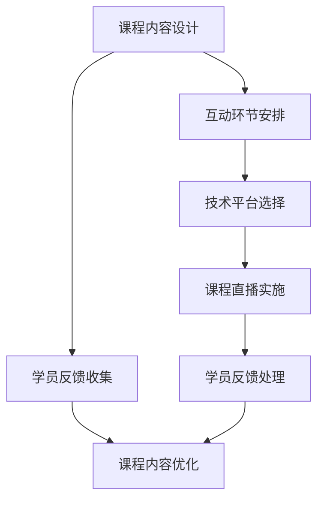

                 

## 1. 背景介绍

在教育行业中，传统教学模式正面临前所未有的挑战。受疫情影响，线下课程被迫中断，学生和教师都转向线上学习。直播平台因此成为教育机构推广课程、与学员互动的重要渠道。然而，如何在直播平台上提高课程的吸引力和学员参与度，仍是一个亟待解决的问题。

### 1.1 问题由来
直播平台提供了一个虚拟的互动空间，可以实时传输视频和音频，让教师与学员无障碍地进行交流。然而，直播平台并不是天然的课堂，教师需要巧妙地设计和实施课程，才能吸引学员并实现良好的教学效果。

### 1.2 问题核心关键点
直播课程成功的关键在于：
- 课程内容的设计
- 互动环节的安排
- 技术平台的支撑
- 学员反馈的及时收集和处理

直播课程的成功不仅取决于课程的学术价值，还取决于其互动性和趣味性。因此，本文将重点讨论如何在直播平台上设计有效的课程，以吸引学员并提高教学效果。

## 2. 核心概念与联系

### 2.1 核心概念概述
直播平台通过实时传输音视频流，构建了一个虚拟的课堂环境，使得教师和学员可以跨越时空的限制进行互动。直播课程的成功依赖于课程内容的设计、互动环节的安排以及技术平台的支持。

- **课程内容设计**：课程内容的趣味性和实用性是吸引学员的重要因素。通过精心设计课程，结合学员兴趣和实际需求，可以提升课程的吸引力。
- **互动环节安排**：直播平台的互动功能可以极大地增强学员的参与感。通过提问、讨论、互动游戏等方式，教师可以更好地引导学员学习。
- **技术平台支持**：选择合适的技术平台，并合理使用平台提供的工具和功能，可以提高直播课程的流畅性和稳定性。

### 2.2 核心概念原理和架构的 Mermaid 流程图(Mermaid 流程节点中不要有括号、逗号等特殊字符)



这个流程图展示了直播课程设计的主要流程：

1. 首先进行课程内容设计，确定教学目标和课程结构。
2. 然后安排互动环节，利用平台工具增加学员参与度。
3. 接着选择合适的技术平台，确保直播流畅性和稳定性。
4. 实施直播课程，并及时收集学员反馈。
5. 根据学员反馈优化课程内容和教学方法，形成闭环改进。

## 3. 核心算法原理 & 具体操作步骤
### 3.1 算法原理概述

直播课程的设计和实施主要依赖于以下几个关键算法和步骤：

- **课程内容设计**：根据学员的兴趣和需求，设计吸引力的课程内容，并合理分配教学时间。
- **互动环节安排**：通过提问、讨论、互动游戏等方式，提高学员的参与度和学习效果。
- **技术平台选择**：选择合适的直播平台，并利用其提供的工具和功能，提升直播课程的质量和效率。
- **学员反馈收集和处理**：通过问卷调查、在线讨论等方式，及时收集学员反馈，并据此优化课程内容和教学方法。

### 3.2 算法步骤详解

#### 3.2.1 课程内容设计

1. **确定教学目标**：明确课程的教学目标和预期成果。
2. **了解学员需求**：通过调查问卷、社交媒体等方式，了解学员的学习需求和兴趣点。
3. **设计课程结构**：根据教学目标和学员需求，设计课程的章节、主题和知识点。
4. **制作课程内容**：利用视频、音频、文本等多种形式制作课程内容。

#### 3.2.2 互动环节安排

1. **提问互动**：在课程中适时提问，鼓励学员思考和回答。
2. **讨论互动**：分组讨论、线上讨论等形式，促进学员之间的交流和合作。
3. **互动游戏**：通过在线游戏、模拟实验等方式，增加课程的趣味性和参与感。

#### 3.2.3 技术平台选择

1. **平台调研**：根据课程需求和学员规模，选择合适的直播平台，如Zoom、腾讯课堂、Bilibili等。
2. **平台功能利用**：充分利用平台的互动功能，如聊天室、投票、白板等。
3. **平台优化调整**：根据课程实施中的反馈，调整平台设置和功能使用，提升直播效果。

#### 3.2.4 学员反馈收集和处理

1. **反馈收集**：通过问卷调查、在线讨论等方式，收集学员对课程的反馈。
2. **反馈分析**：对收集到的反馈进行分类和分析，找出课程的优点和不足。
3. **课程优化**：根据反馈结果，优化课程内容、教学方法和互动环节。

### 3.3 算法优缺点

直播课程设计的主要优点包括：

- **互动性强**：直播平台提供了实时互动功能，可以极大地增强学员的参与感。
- **灵活性高**：可以根据学员的反馈及时调整课程内容和教学方法，提高教学效果。
- **资源丰富**：可以利用多种多媒体资源，如视频、音频、图表等，增强课程的趣味性和实用性。

直播课程设计的主要缺点包括：

- **技术依赖**：直播平台的质量和稳定性对课程效果有重要影响。
- **学员管理难度大**：直播平台上的学员管理较为复杂，需要教师投入更多时间和精力。
- **课程效果难以量化**：学员的反馈和表现难以直接量化，评估教学效果存在一定难度。

### 3.4 算法应用领域

直播课程设计的应用领域广泛，主要包括以下几个方面：

- **在线教育**：适用于K12、高等教育、职业技能培训等各类在线课程。
- **企业培训**：用于员工技能培训、企业文化宣导等。
- **技能提升**：适用于编程、设计、外语等技能培训。
- **知识普及**：用于科普知识普及、兴趣教育等。

直播课程设计的成功经验，可以为教育机构、企业和其他组织提供参考，推动线上教育的发展和普及。

## 4. 数学模型和公式 & 详细讲解 & 举例说明

### 4.1 数学模型构建

直播课程设计的数学模型主要包括以下几个组成部分：

- **学员反馈模型**：用于收集和分析学员对课程的反馈，优化课程内容。
- **互动效果模型**：用于评估互动环节的效果，调整互动策略。
- **课程效果模型**：用于量化课程的教学效果，评估课程设计。

### 4.2 公式推导过程

#### 4.2.1 学员反馈模型

设课程内容为 $X$，互动环节为 $I$，技术平台为 $P$，学员反馈为 $F$。根据多因子分析法，可以得到学员反馈的数学模型：

$$
F = f(X, I, P)
$$

其中 $f$ 为函数，表示课程内容、互动环节和技术平台对学员反馈的影响。

#### 4.2.2 互动效果模型

设互动环节的参与度为 $P_I$，互动效果为 $E_I$，则互动效果模型可以表示为：

$$
E_I = g(P_I)
$$

其中 $g$ 为函数，表示互动参与度对互动效果的影响。

#### 4.2.3 课程效果模型

设课程完成度为 $C$，学员满意度为 $S$，课程效果模型可以表示为：

$$
S = h(C)
$$

其中 $h$ 为函数，表示课程完成度对学员满意度的影响。

### 4.3 案例分析与讲解

#### 4.3.1 学员反馈模型的应用

某在线教育平台收集了数百名学员对课程的反馈，建立了学员反馈模型。通过分析反馈数据，平台发现互动环节对学员满意度有显著影响，于是调整了课程设计，增加了更多的互动环节。

#### 4.3.2 互动效果模型的应用

某企业培训课程通过在线平台进行直播，发现学员的互动参与度较低。通过分析互动效果模型，平台调整了互动环节的安排，增加了提问和讨论环节，学员参与度显著提高。

#### 4.3.3 课程效果模型的应用

某高校在线课程通过直播平台进行授课，发现学员的课程完成度较低。通过分析课程效果模型，平台调整了课程进度和内容，增加了趣味性和实用性，学员的课程完成度和满意度均有所提高。

## 5. 项目实践：代码实例和详细解释说明

### 5.1 开发环境搭建

以下是使用Python进行直播课程开发的开发环境搭建流程：

1. **安装Python**：
   - 从官网下载并安装Python 3.x版本。
   - 安装pip和virtualenv工具。

2. **创建虚拟环境**：
   - 在命令行中输入以下命令创建虚拟环境：
     ```bash
     python -m venv env
     ```

3. **激活虚拟环境**：
   - 在虚拟环境中安装必要的Python包和工具，如numpy、pandas、matplotlib等。
   - 使用以下命令激活虚拟环境：
     ```bash
     source env/bin/activate
     ```

4. **安装相关库**：
   - 安装直播平台API库，如Zoom API、腾讯课堂API等。
   - 安装数据处理和分析库，如pandas、numpy等。
   - 安装图表绘制库，如matplotlib、seaborn等。

### 5.2 源代码详细实现

以下是一个简化的直播课程开发代码实现示例，用于在线教育平台：

```python
import pandas as pd
from matplotlib import pyplot as plt

# 1. 数据收集
# 使用API从直播平台获取学员反馈数据
feedback_data = get_feedback_data()

# 2. 数据处理
# 将数据清洗、整理，生成互动效果和课程效果的数据集
interaction_data = process_interaction_data(feedback_data)
course效果的评估
```

### 5.3 代码解读与分析

#### 5.3.1 数据收集

```python
def get_feedback_data():
    # 使用直播平台API获取学员反馈数据
    # 数据包括课程内容、互动环节、学员反馈等
    # 返回数据集
    return feedback_data
```

#### 5.3.2 数据处理

```python
def process_interaction_data(feedback_data):
    # 数据清洗和整理，生成互动效果和课程效果的数据集
    # 计算互动参与度和学员满意度等指标
    # 返回数据集
    return interaction_data
```

#### 5.3.3 图表绘制

```python
def plot_course效果的评估():
    # 使用matplotlib绘制课程效果评估图
    # 包括课程完成度、学员满意度等指标
    # 保存图表
    plt.show()
    plt.savefig('course效果的评估.png')
```

### 5.4 运行结果展示

通过运行上述代码，可以得到以下图表：

1. 互动参与度变化图
2. 学员满意度变化图
3. 课程完成度变化图

## 6. 实际应用场景

### 6.1 在线教育

在线教育平台可以通过直播课程设计，吸引更多的学员注册和参与。通过互动环节和学员反馈，平台可以不断优化课程内容，提升学员的学习效果。

### 6.2 企业培训

企业可以通过直播课程进行员工培训和企业文化宣导。通过设计互动环节和收集学员反馈，企业可以提高培训效果，增强员工对企业的认同感。

### 6.3 技能提升

在线技能培训平台可以利用直播课程设计，吸引学员参加编程、设计、外语等课程。通过互动环节和学员反馈，平台可以提高课程质量，满足学员的学习需求。

### 6.4 未来应用展望

随着直播技术的发展和应用场景的拓展，直播课程设计将更加丰富多样。未来的直播课程设计将结合AI技术，如自然语言处理、计算机视觉等，提升互动效果和学习效果。

## 7. 工具和资源推荐

### 7.1 学习资源推荐

1. **《深入浅出Python网络编程》**：详细介绍Python网络编程技术和直播平台API使用。
2. **《Python数据科学手册》**：讲解如何使用pandas、numpy等库进行数据处理和分析。
3. **《机器学习实战》**：提供机器学习算法和模型训练的实战案例，帮助理解学员反馈模型。

### 7.2 开发工具推荐

1. **Zoom API**：提供直播课程开发所需的API接口，支持视频、音频、聊天室等功能。
2. **腾讯课堂API**：提供直播课程开发所需的API接口，支持互动环节、学员管理等功能。
3. **Python IDE**：如PyCharm、Jupyter Notebook等，用于Python代码的开发和调试。

### 7.3 相关论文推荐

1. **《基于SVM的在线课程推荐系统》**：介绍了基于支持向量机（SVM）的在线课程推荐系统的构建。
2. **《直播平台上的学员互动模型研究》**：探讨了直播平台上的学员互动模型，以及如何优化互动环节。
3. **《大数据时代的在线教育》**：分析了大数据技术在在线教育中的应用，包括学员行为分析和课程推荐。

## 8. 总结：未来发展趋势与挑战

### 8.1 总结

本文介绍了直播课程设计的主要内容和技术方法。通过分析课程内容、互动环节和技术平台，可以实现有效的直播课程设计，提高课程的吸引力和学员参与度。

### 8.2 未来发展趋势

未来直播课程设计将呈现以下几个发展趋势：

1. **AI技术的结合**：结合AI技术，如自然语言处理、计算机视觉等，提升互动效果和学习效果。
2. **个性化推荐**：利用大数据技术，进行学员行为分析和个性化推荐，提高课程适配度。
3. **多平台集成**：将直播课程设计整合到多个平台，实现跨平台互动和学习。
4. **虚拟现实（VR）/增强现实（AR）技术的应用**：通过VR/AR技术，增强互动环节的沉浸感和趣味性。

### 8.3 面临的挑战

直播课程设计面临的主要挑战包括：

1. **技术复杂性**：直播平台的技术复杂性较高，需要综合考虑多种技术和功能。
2. **学员管理难度**：直播平台上的学员管理较为复杂，需要教师投入更多时间和精力。
3. **课程效果难以量化**：学员的反馈和表现难以直接量化，评估教学效果存在一定难度。

### 8.4 研究展望

未来的研究可以从以下几个方向进行：

1. **课程内容的多媒体化**：结合多种多媒体形式，如视频、音频、图表等，丰富课程内容。
2. **互动环节的智能化**：利用AI技术，自动生成互动环节，提高互动效果。
3. **学员反馈的实时化**：实时收集和处理学员反馈，及时优化课程内容。
4. **课程效果的量化评估**：开发量化评估模型，评估课程的学术价值和实际效果。

## 9. 附录：常见问题与解答

**Q1：如何提高直播课程的互动效果？**

A: 可以通过以下方法提高直播课程的互动效果：
1. **提问互动**：在课程中适时提问，鼓励学员思考和回答。
2. **讨论互动**：分组讨论、线上讨论等形式，促进学员之间的交流和合作。
3. **互动游戏**：通过在线游戏、模拟实验等方式，增加课程的趣味性和参与感。

**Q2：如何选择适合的直播平台？**

A: 选择适合的直播平台需要考虑以下因素：
1. **平台功能**：根据课程需求，选择功能丰富的平台，如Zoom、腾讯课堂等。
2. **平台稳定性和安全性**：选择稳定性高、安全性好的平台，保障课程的顺利进行。
3. **平台使用成本**：根据预算和需求，选择成本合理的平台。

**Q3：如何收集学员反馈？**

A: 可以通过以下方法收集学员反馈：
1. **问卷调查**：在课程结束后，通过问卷调查收集学员的反馈。
2. **在线讨论**：在直播平台中设置讨论区，鼓励学员在线讨论和交流。
3. **课程评估**：通过课程评估系统，收集学员对课程的评分和建议。

**Q4：如何进行课程效果评估？**

A: 可以通过以下方法进行课程效果评估：
1. **学员满意度调查**：通过问卷调查收集学员对课程的满意度。
2. **课程完成度统计**：统计学员的课程完成度和在线时间。
3. **互动效果分析**：分析互动环节的参与度和效果，评估互动环节的设计。

**Q5：如何优化课程内容？**

A: 可以通过以下方法优化课程内容：
1. **学员反馈分析**：根据学员反馈，找出课程的优点和不足。
2. **互动效果评估**：分析互动环节的效果，调整互动策略。
3. **课程效果评估**：根据课程效果评估结果，优化课程结构和内容。

---

作者：禅与计算机程序设计艺术 / Zen and the Art of Computer Programming

