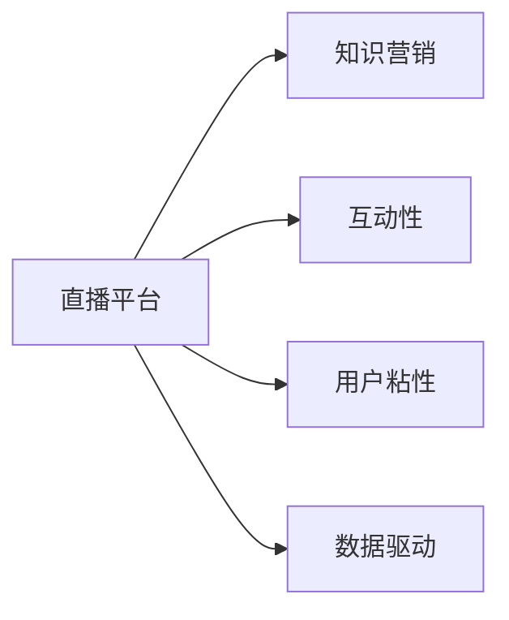

                 

# 如何利用直播平台进行知识营销

## 1. 背景介绍

随着互联网技术的快速发展，直播平台已逐渐成为知识传播的重要渠道之一。传统知识营销方式多以单向传播为主，缺乏互动性，难以有效吸引用户。而直播平台通过实时互动、即时反馈的特点，可以将知识营销变得更加生动有趣，更容易获得用户的关注和参与。同时，直播平台的技术和应用生态也逐渐成熟，为企业和品牌提供了丰富的工具和手段，可以进行多样化的知识营销尝试。

### 1.1 直播平台的兴起

直播平台的兴起源于移动互联网的普及和智能手机的广泛应用。从早期的YY语音、陌陌直播，到现在的斗鱼、虎牙、抖音等，直播平台逐渐从游戏直播扩展到教育、医疗、金融等多个领域。直播平台的实时性、互动性和社区化特性，使得知识传播更加生动、个性化，也更加贴近用户实际需求。

### 1.2 知识营销的优势

知识营销通过将知识与商业结合，利用用户对知识的渴求，达到品牌宣传和产品推广的目的。与传统的硬性广告相比，知识营销的优势在于：

- **用户参与度高**：直播平台通过实时互动，拉近了知识传播者和受众的距离，用户参与度大大提升。
- **传播效果好**：通过故事化、案例化的讲解，能够更有效地传达知识和理念。
- **品牌影响力增强**：直播平台上的专业内容与品牌形象结合，提升品牌在用户心中的认知和信任度。
- **用户粘性提高**：长期的知识传播和互动，使品牌与用户之间建立起更紧密的联系，增加用户粘性。

## 2. 核心概念与联系

### 2.1 核心概念概述

本节将介绍几个核心概念，帮助理解直播平台知识营销的原理和框架：

- **直播平台**：以实时视频流和互动为核心的社交平台。
- **知识营销**：通过知识传播，达到品牌推广和产品销售的目的。
- **互动性**：直播平台的核心特性，通过实时互动增强用户参与感。
- **用户粘性**：指用户对平台和内容的长期依赖度。
- **数据驱动**：通过分析用户行为数据，优化知识营销策略。

### 2.2 核心概念原理和架构的 Mermaid 流程图



此图展示了直播平台知识营销的关键组件及其相互关系。直播平台通过实时视频流和互动特性，实现知识传播和用户参与。互动性和用户粘性通过数据分析不断优化，提升知识营销效果。

## 3. 核心算法原理 & 具体操作步骤

### 3.1 算法原理概述

直播平台知识营销的核心算法可以概括为**"互动式知识传播"**。其基本原理是通过直播平台的实时互动特性，将知识传播与用户参与相结合，形成有效的知识营销循环。知识营销的算法主要包括以下几个环节：

1. **知识传播策略设计**：确定直播内容的主题和形式，选择合适的直播平台和主播。
2. **互动机制设计**：设计互动环节，如问答、投票、评论区互动等，增强用户参与度。
3. **数据收集与分析**：通过直播平台的数据收集和分析工具，了解用户行为和反馈，优化传播策略。
4. **内容优化**：根据用户反馈和数据分析结果，不断优化直播内容，提升传播效果。

### 3.2 算法步骤详解

下面将详细介绍知识营销的算法步骤，以帮助开发者更好地实现这一过程。

#### 3.2.1 知识传播策略设计

**步骤1: 确定直播内容主题**
- 根据目标用户群体的需求和兴趣，选择适合的知识主题。如技术教程、产品使用指南、行业趋势分析等。
- 设计详细的直播计划，包括直播时间、主播、直播形式等。

**步骤2: 选择直播平台和主播**
- 根据目标用户群体和内容类型，选择适合的直播平台（如抖音、知乎、YouTube等）。
- 寻找合适的直播主播，或与品牌方合作，邀请专业讲师或行业专家进行直播。

**步骤3: 设计互动环节**
- 设计直播互动环节，如实时问答、观众投票、评论区互动等，增加用户参与度。
- 设计合适的奖励机制，鼓励观众积极参与和互动。

#### 3.2.2 互动机制设计

**步骤1: 实时问答环节**
- 在直播中设置问答环节，主播实时回答观众问题。
- 利用直播平台的互动功能，如举手提问、弹幕互动等，增强观众参与感。

**步骤2: 观众投票环节**
- 在直播中设计观众投票环节，让观众对某个问题或主题进行投票。
- 根据投票结果调整直播内容，满足更多观众的需求。

**步骤3: 评论区互动**
- 在直播结束后，利用评论区进行深入交流和讨论。
- 主播和观众可以在评论区继续互动，解答未尽的问题。

#### 3.2.3 数据收集与分析

**步骤1: 数据收集**
- 利用直播平台提供的数据分析工具，收集观众的实时互动数据，如提问次数、投票结果、弹幕内容等。
- 使用第三方数据分析工具，收集直播内容的视频观看数据，如观看时长、用户留存率等。

**步骤2: 数据处理**
- 对收集到的数据进行清洗和预处理，去除噪音数据和异常值。
- 对数据进行统计分析和可视化，形成可解读的报告和图表。

**步骤3: 数据分析**
- 根据数据分析结果，了解观众的兴趣点和需求，优化直播内容和互动机制。
- 分析直播效果，如观众参与度、知识传播效果等，为后续直播提供参考。

#### 3.2.4 内容优化

**步骤1: 内容调整**
- 根据观众反馈和数据分析结果，调整直播内容和互动环节。
- 增加观众感兴趣的知识点，减少过于专业或晦涩的内容。

**步骤2: 主播优化**
- 根据观众反馈，优化主播的表现和互动方式。
- 培训主播，提升其专业性和互动技巧。

**步骤3: 直播形式创新**
- 尝试新的直播形式，如多人连麦、虚拟现实(VR)直播等，增加新鲜感和趣味性。
- 引入新技术和工具，提升直播质量和用户体验。

### 3.3 算法优缺点

直播平台知识营销的算法具有以下优点：

- **实时互动性强**：通过实时互动，增强用户参与感，提升知识传播效果。
- **数据驱动优化**：通过数据分析，不断优化知识传播策略，提升用户粘性和互动性。
- **形式多样**：可以选择不同的直播形式和主播，满足不同用户的需求。

同时，该算法也存在一些缺点：

- **主播专业性要求高**：需要选择合适的直播主播，其专业性和互动能力直接影响直播效果。
- **互动环节设计复杂**：需要精心设计互动环节，避免过度商业化，提升用户体验。
- **数据隐私问题**：直播平台收集的数据可能涉及用户隐私，需要做好数据保护工作。

### 3.4 算法应用领域

直播平台知识营销已经在多个领域得到了广泛应用，如教育、金融、医疗等。以下是几个典型应用场景：

- **在线教育**：通过直播平台进行在线课程讲解，互动答疑，提升教学效果。
- **产品发布**：利用直播平台发布新产品，进行互动演示，增加用户参与感。
- **行业分析**：邀请行业专家进行行业分析，实时互动，增加用户对行业动态的了解。
- **品牌推广**：通过直播平台推广品牌，进行互动营销，提升品牌知名度和用户粘性。
- **健康医疗**：通过直播平台进行健康咨询，实时互动，提升用户健康意识。

## 4. 数学模型和公式 & 详细讲解 & 举例说明

### 4.1 数学模型构建

本节将使用数学语言对直播平台知识营销的算法进行更加严格的刻画。

设直播平台上的知识营销过程为 $X$，包括内容传播、观众参与和数据收集等环节。知识传播效果为 $Y$，衡量指标包括观看时长、观众参与度、转化率等。观众反馈为 $Z$，包括实时互动数据、评论数据等。直播平台的数据分析能力为 $D$。

定义知识传播效果的数学模型为：

$$
Y = f(X)
$$

其中 $f$ 为传播效果函数，需要根据具体情况进行建模。

### 4.2 公式推导过程

以下我们以观众参与度为例，推导观众参与度的计算公式及其影响因素。

设观众参与度为 $I$，包括实时互动次数、评论次数、观看时长等。则观众参与度的计算公式为：

$$
I = \alpha_1 \times \text{互动次数} + \alpha_2 \times \text{评论次数} + \alpha_3 \times \text{观看时长}
$$

其中 $\alpha_1$、$\alpha_2$、$\alpha_3$ 为权重系数，需要通过数据分析确定。

### 4.3 案例分析与讲解

假设在一场关于编程语言学习的直播中，观众参与度 $I$ 通过以下公式计算：

$$
I = 0.5 \times \text{互动次数} + 0.2 \times \text{评论次数} + 0.3 \times \text{观看时长}
$$

根据实时数据，互动次数为 500，评论次数为 300，观看时长为 30分钟，则观众参与度 $I$ 计算如下：

$$
I = 0.5 \times 500 + 0.2 \times 300 + 0.3 \times 30 = 475
$$

通过该公式，可以清晰地量化观众的参与程度，为后续直播优化提供数据支持。

## 5. 项目实践：代码实例和详细解释说明

### 5.1 开发环境搭建

在进行知识营销项目开发前，我们需要准备好开发环境。以下是使用Python进行开发的环境配置流程：

1. 安装Anaconda：从官网下载并安装Anaconda，用于创建独立的Python环境。

2. 创建并激活虚拟环境：
```bash
conda create -n marketing-env python=3.8 
conda activate marketing-env
```

3. 安装所需库：
```bash
conda install pandas numpy matplotlib jupyter notebook ipython
```

4. 安装直播平台API库：
```bash
pip install streamlit ffmpeg
```

5. 安装直播平台API库：
```bash
pip install requests
```

完成上述步骤后，即可在`marketing-env`环境中开始项目开发。

### 5.2 源代码详细实现

下面是使用Python和Streamlit实现直播平台知识营销的完整代码实现：

```python
import streamlit as st
import pandas as pd
import numpy as np
import matplotlib.pyplot as plt
import requests

# 读取观众参与数据
data = pd.read_csv('interaction_data.csv')

# 数据清洗
data = data.dropna()
data = data[data['interaction_type'].isin(['互动次数', '评论次数', '观看时长'])]

# 数据转换
data['interaction_value'] = data['interaction_type'].apply(lambda x: {
    '互动次数': 1,
    '评论次数': 2,
    '观看时长': 3
}[x])

# 计算观众参与度
data['观众参与度'] = 0.5 * data['互动次数'] + 0.2 * data['评论次数'] + 0.3 * data['观看时长']
data['观众参与度'] = data['观众参与度'].astype(int)

# 可视化观众参与度
st.title('观众参与度分析')
st.line_chart(data.groupby('时间')['观众参与度'].mean().plot(kind='line').figure)
```

### 5.3 代码解读与分析

让我们再详细解读一下关键代码的实现细节：

**代码实现步骤**：
- 第一步，读取观众参与数据，并进行初步清洗和转换。
- 第二步，利用Streamlit库创建一个可视化页面，展示观众参与度随时间的变化。
- 第三步，对数据进行可视化分析，通过图表展示观众参与度的高低变化趋势。

**代码解读**：
- 通过读取CSV文件，将数据导入到Pandas中。
- 对数据进行清洗，去除缺失值和异常值。
- 将互动类型转换为数字，方便后续计算。
- 根据公式计算观众参与度。
- 使用Streamlit库创建页面，并通过matplotlib库绘制图表。
- 最后，展示观众参与度的变化趋势图。

**代码分析**：
- 数据清洗是关键环节，确保数据的完整性和准确性。
- 数据转换使用字典，方便后续计算。
- 观众参与度计算公式和权重系数，需要根据具体场景进行调整。
- Streamlit库和matplotlib库的结合使用，实现高效的可视化。

## 6. 实际应用场景

### 6.1 教育行业

教育行业可以利用直播平台进行知识营销，帮助学生更好地理解课程内容。以下是几个具体应用场景：

- **在线课程讲解**：邀请专家进行在线课程讲解，实时互动答疑，提升教学效果。
- **编程教程**：通过直播平台展示编程过程，观众可以实时参与编程调试，提升编程技能。
- **知识竞赛**：组织编程竞赛、数学竞赛等，通过直播平台实时互动，增加学生参与感。

### 6.2 金融行业

金融行业可以利用直播平台进行知识传播和品牌推广。以下是几个具体应用场景：

- **理财讲座**：邀请理财专家进行理财讲座，实时互动答疑，提升客户理财知识水平。
- **股票分析**：通过直播平台进行股票分析，实时互动，帮助客户做出投资决策。
- **风险预警**：利用直播平台发布市场风险预警信息，实时互动解答客户疑问，提升客户风险意识。

### 6.3 医疗行业

医疗行业可以利用直播平台进行健康知识传播和品牌推广。以下是几个具体应用场景：

- **健康咨询**：通过直播平台进行健康咨询，实时互动答疑，提升患者健康意识。
- **医疗科普**：利用直播平台进行医疗科普，讲解常见疾病预防和治疗知识，提升公众健康素养。
- **心理辅导**：通过直播平台进行心理辅导，实时互动，帮助患者缓解压力，提升心理健康水平。

## 7. 工具和资源推荐

### 7.1 学习资源推荐

为了帮助开发者系统掌握直播平台知识营销的理论基础和实践技巧，这里推荐一些优质的学习资源：

1. **《直播平台知识营销》系列博文**：由大平台技术专家撰写，深入浅出地介绍了直播平台知识营销的基本概念和具体应用。
2. **《直播平台技术指南》书籍**：该书系统介绍了直播平台的技术实现细节，包括流媒体传输、互动机制设计等。
3. **《直播平台知识营销》课程**：由知名高校或在线教育平台开设的课程，涵盖直播平台知识营销的各类理论和实践案例。
4. **《直播平台数据驱动营销》书籍**：该书详细介绍了直播平台的数据收集、分析和应用，帮助开发者更好地优化知识营销策略。

### 7.2 开发工具推荐

高效的开发离不开优秀的工具支持。以下是几款用于直播平台知识营销开发的常用工具：

1. **Streamlit**：开源的Python可视化工具，可以方便地创建可视化页面，展示数据和分析结果。
2. **Jupyter Notebook**：交互式Python环境，方便进行数据处理和模型训练。
3. **PyTorch**：深度学习框架，支持自定义模型和算法。
4. **TensorFlow**：另一个流行的深度学习框架，支持大规模模型训练和部署。
5. **Google Colab**：谷歌提供的在线Jupyter Notebook环境，免费提供GPU/TPU算力，方便快速上手实验。

### 7.3 相关论文推荐

直播平台知识营销的研究方兴未艾，以下是几篇奠基性的相关论文，推荐阅读：

1. **《直播平台知识传播策略》**：探讨了直播平台知识传播的策略和效果，提出了多维度传播模型。
2. **《直播平台用户参与度分析》**：通过实证研究，分析了直播平台用户参与度的影响因素，提出优化建议。
3. **《直播平台互动机制设计》**：研究了直播平台互动机制的设计和优化，提出了多种互动形式和策略。
4. **《直播平台数据驱动营销》**：详细介绍了直播平台的数据收集、分析和应用，帮助优化知识营销效果。

## 8. 总结：未来发展趋势与挑战

### 8.1 研究成果总结

直播平台知识营销通过实时互动和数据驱动，极大地提升了知识传播效果和用户参与度，成为NLP技术落地的重要手段。目前，直播平台知识营销已经在教育、金融、医疗等多个领域得到了广泛应用，显示出巨大的市场潜力。

### 8.2 未来发展趋势

展望未来，直播平台知识营销将呈现以下几个发展趋势：

1. **技术创新**：未来将更多引入AI和机器学习技术，提升内容定制化和推荐精准度。
2. **数据驱动**：将进一步利用大数据和AI技术，提升知识营销的智能化和自动化水平。
3. **互动多样化**：将尝试更多的互动形式和工具，增强观众参与感和互动体验。
4. **平台整合**：将与其他社交媒体、搜索引擎等平台进行深度整合，扩大知识传播的覆盖面。
5. **内容创新**：将更加注重内容创意和制作，提升知识传播的吸引力和趣味性。

### 8.3 面临的挑战

尽管直播平台知识营销已经取得了显著成效，但仍面临一些挑战：

1. **内容制作成本高**：高质量内容的制作需要投入大量时间和精力，内容创意和制作成本较高。
2. **数据隐私问题**：直播平台的数据收集和分析可能涉及用户隐私，数据保护和合规问题需要重视。
3. **用户参与度波动**：用户参与度的波动可能影响知识传播效果，如何保持用户长期参与是一个难题。
4. **互动效果有限**：部分互动形式可能效果有限，需要不断探索新的互动方式。
5. **技术壁垒高**：直播平台技术复杂，需要具备较高的技术能力和资源投入。

### 8.4 研究展望

未来直播平台知识营销的研究方向可以从以下几个方面进行探讨：

1. **内容自动化生成**：研究内容生成模型，如GPT、BERT等，自动生成高质量的知识内容。
2. **数据隐私保护**：研究数据隐私保护技术，确保数据收集和分析过程中的隐私安全。
3. **互动效果优化**：研究互动效果优化方法，提升观众参与度和互动体验。
4. **平台整合优化**：研究与其他平台的深度整合方法，提升知识传播覆盖面。
5. **技术创新**：研究新技术和工具，提升知识营销的效果和效率。

这些研究方向的探索，将进一步推动直播平台知识营销的发展，为NLP技术在实际应用中发挥更大的作用提供新思路。

## 9. 附录：常见问题与解答

**Q1：直播平台知识营销是否适用于所有行业？**

A: 直播平台知识营销适用于大多数行业，特别是那些需要实时互动和数据驱动的领域。如教育、金融、医疗、健康等。但对于一些对互动要求不高的行业，直播平台的优势可能不明显。

**Q2：如何选择合适的直播平台和主播？**

A: 选择直播平台和主播时，需要根据目标用户群体的特征和需求，选择合适的平台和主播。可以通过观众反馈和数据分析，选择效果最佳的直播平台和主播。

**Q3：如何提升直播内容的互动效果？**

A: 提升直播内容的互动效果，可以从以下几个方面入手：
1. 设计有趣的话题和互动环节，增加观众参与感。
2. 引入观众投票、问答、竞赛等互动形式，增强观众参与度。
3. 利用观众反馈和数据分析，优化互动策略。

**Q4：如何保护用户隐私？**

A: 保护用户隐私是直播平台知识营销的重要前提。可以通过以下措施保护用户隐私：
1. 明确隐私政策，告知用户数据收集和使用情况。
2. 使用数据匿名化处理，去除用户个人信息。
3. 遵守相关法律法规，确保数据合规使用。

**Q5：直播平台知识营销的效果如何评估？**

A: 直播平台知识营销的效果可以从以下几个方面进行评估：
1. 观众参与度：包括互动次数、评论次数、观看时长等。
2. 知识传播效果：包括观看时长、用户留存率、转化率等。
3. 用户反馈：包括满意度、评价等。
4. 数据分析：通过数据可视化，了解观众行为和反馈。

通过以上措施，可以全面评估直播平台知识营销的效果，不断优化策略，提升传播效果。

---

作者：禅与计算机程序设计艺术 / Zen and the Art of Computer Programming

