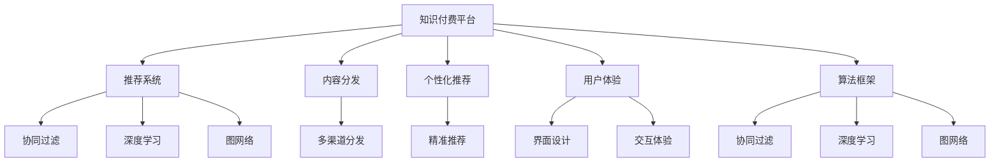

                 

# 如何利用知识付费实现产业升级与转型？

## 1. 背景介绍

### 1.1 问题由来
随着信息时代的到来，知识付费平台如雨后春笋般涌现，逐渐成为互联网经济的新增长点。知识付费模式不仅改变了传统的知识传播方式，也为各行各业提供了新的增值机会。然而，如何利用知识付费技术实现产业升级与转型，成为当下企业亟需解决的问题。

### 1.2 问题核心关键点
知识付费的实质是通过有价值的知识内容，帮助消费者提升个人或企业的竞争力，进而带来经济收益。核心问题在于：

- **知识内容的筛选和创作**：如何高效、精准地筛选和创作优质内容，以满足用户需求。
- **用户需求精准匹配**：如何通过推荐系统，将优质内容精准推荐给目标用户。
- **多渠道分发**：如何通过不同渠道分发内容，最大化内容覆盖面和收益。
- **商业模式创新**：如何基于知识付费模式，打造新的增值服务，提升用户粘性。
- **技术架构和系统建设**：如何构建高效、可靠的技术架构，支撑知识付费平台的运营。

### 1.3 问题研究意义
知识付费技术的运用，可以极大提升企业核心竞争力，实现产业升级与转型：

- **提升品牌价值**：通过优质内容塑造品牌形象，增强用户信任度。
- **优化用户体验**：通过精准推荐和个性定制，提升用户满意度。
- **拓宽收益渠道**：通过增值服务和多元化收费模式，增加收入来源。
- **推动技术创新**：通过数据驱动的推荐系统，提升算法创新能力。
- **促进产业融合**：通过跨界合作，构建内容生态系统，实现产业链上下游整合。

## 2. 核心概念与联系

### 2.1 核心概念概述

为更好地理解知识付费技术及其应用，本节将介绍几个密切相关的核心概念：

- **知识付费平台**：以内容为核心的互联网平台，通过订阅、单次购买等方式收费，实现知识变现。
- **推荐系统**：利用算法技术，通过分析用户行为，将内容推荐给最合适的用户。
- **内容分发**：将优质内容通过不同的渠道分发，提高内容的曝光率和收益。
- **个性化推荐**：通过了解用户兴趣和行为，提供个性化内容推荐。
- **用户体验**：包括界面设计、交互体验、推荐算法等，提供愉悦的用户体验。
- **算法框架**：包括协同过滤、深度学习、图网络等算法，支撑推荐系统运行。

这些核心概念之间的逻辑关系可以通过以下Mermaid流程图来展示：



这个流程图展示的知识付费平台的各个关键组件及其之间的联系：

1. 知识付费平台为推荐系统提供数据支持，内容分发则将优质内容推送给用户。
2. 推荐系统通过个性化推荐算法，实现内容的精准推送。
3. 个性化推荐需要依托于优质的用户体验设计。
4. 算法框架包括多种算法技术，用于支撑推荐系统高效运行。
5. 多渠道分发扩大了内容的覆盖面，带来更大的收益。
6. 协同过滤、深度学习和图网络是当前主流算法框架。

## 3. 核心算法原理 & 具体操作步骤
### 3.1 算法原理概述

知识付费平台的核心算法包括推荐系统和个性化推荐算法。其核心思想是：利用用户的历史行为数据和内容特征，通过协同过滤、深度学习等技术，找出与用户兴趣相符的优质内容，并实现精准推送。

推荐系统的工作原理可以概括为以下几步：

1. **数据采集**：收集用户的浏览、购买、评分等行为数据。
2. **特征提取**：提取内容的相关特征，如标签、作者、评论等。
3. **模型训练**：利用协同过滤、深度学习等算法，训练推荐模型。
4. **内容匹配**：通过模型预测，找出与用户兴趣最匹配的内容。
5. **推荐展示**：将匹配的内容推荐给用户，并进行动态调整。

### 3.2 算法步骤详解

知识付费平台的推荐系统构建分为以下几个步骤：

**Step 1: 数据预处理**
- 数据清洗：去除无效数据，填补缺失值。
- 数据归一化：对数据进行归一化处理，便于后续算法应用。
- 特征选择：选择有意义的特征，减少维度，提高算法效率。

**Step 2: 模型选择与训练**
- 协同过滤算法：通过用户与内容的相似性，找出与用户兴趣相似的内容。
- 深度学习算法：通过神经网络模型，学习内容表示，实现内容的精准推荐。
- 图网络算法：通过构建用户-内容图，实现全局信息共享和内容关联。

**Step 3: 模型评估与调优**
- 交叉验证：使用交叉验证技术评估模型性能。
- A/B测试：对比不同模型的推荐效果，选择最优模型。
- 参数调优：调整模型参数，提高模型精度和泛化能力。

**Step 4: 实时推荐**
- 用户行为捕捉：实时捕捉用户的行为数据，进行动态调整。
- 推荐引擎：根据实时数据，实时计算推荐结果。
- 推荐展示：将推荐结果展示给用户，并根据反馈进行调整。

### 3.3 算法优缺点

知识付费平台推荐系统的优点包括：

- **精准推荐**：通过深度学习等技术，实现内容的精准推荐，提升用户满意度。
- **多维推荐**：通过协同过滤、深度学习、图网络等算法，实现多维度的推荐。
- **实时性**：通过实时数据处理和推荐，提升用户体验。
- **个性化**：根据用户行为和特征，实现个性化推荐，提高用户粘性。

然而，该系统也存在一些局限性：

- **数据依赖**：推荐系统的效果很大程度上依赖于数据质量，数据不足可能导致推荐效果不佳。
- **模型复杂性**：深度学习等复杂算法，对计算资源要求较高，增加了技术难度。
- **冷启动问题**：新用户缺乏行为数据，难以进行精准推荐。
- **隐私保护**：如何保护用户隐私，防止数据泄露，是必须面对的问题。

### 3.4 算法应用领域

知识付费平台的推荐系统已经被广泛应用于多种场景中，例如：

- **在线教育**：通过推荐优质课程，提升用户学习效果。
- **数字出版**：推荐优质图书和文章，扩大市场覆盖面。
- **健康医疗**：推荐优质健康信息，提升用户健康水平。
- **财经金融**：推荐优质财经资讯，提供投资建议。
- **职场发展**：推荐职业技能培训课程，助力职业发展。
- **旅行旅游**：推荐优质旅游攻略和目的地，提升旅行体验。

除了上述这些经典应用外，知识付费平台推荐系统还被创新性地应用到更多场景中，如可控内容生成、智能客服、个性化推荐引擎等，为知识付费平台带来新的突破。

## 4. 数学模型和公式 & 详细讲解 & 举例说明

### 4.1 数学模型构建

为了更好地理解知识付费平台的推荐系统，本节将使用数学语言对推荐系统的工作原理进行严格刻画。

记用户集合为 $U$，内容集合为 $V$，用户与内容的交互行为集合为 $R \subseteq U \times V$。假设用户对内容 $v$ 的评分向量为 $u_v \in \mathbb{R}^d$，内容 $v$ 的特征向量为 $v_i \in \mathbb{R}^d$，则用户对内容 $v$ 的评分可以表示为：

$$
\hat{y}_{uv} = \theta^T \phi(u_v) \phi(v_i)
$$

其中 $\theta \in \mathbb{R}^d$ 为评分模型的权重向量，$\phi(\cdot)$ 为特征映射函数。评分模型通过最小化均方误差损失函数进行训练：

$$
\min_{\theta} \sum_{(u,v) \in R} (y_{uv} - \hat{y}_{uv})^2
$$

### 4.2 公式推导过程

以下我们以协同过滤算法为例，推导评分模型的损失函数及其梯度计算公式。

假设用户对内容 $v$ 的评分向量为 $u_v$，内容 $v$ 的特征向量为 $v_i$，评分向量为 $\hat{y}_{uv}$。协同过滤算法通过计算用户与内容的相似度，预测用户对内容的评分。假设用户 $u$ 与内容 $v$ 的相似度为 $s_{uv}$，则协同过滤算法的评分预测公式为：

$$
\hat{y}_{uv} = \sum_{v' \in V} s_{uv'} \hat{y}_{uv'} \frac{\hat{y}_{u'v}}{\sum_{v'' \in V} s_{u'v''} \hat{y}_{u'v''}}
$$

其中 $u'$ 为与 $u$ 最相似的用户，$s_{uv'}$ 为用户和内容之间的相似度。协同过滤算法的损失函数为：

$$
\mathcal{L}(\theta) = \sum_{(u,v) \in R} (y_{uv} - \hat{y}_{uv})^2
$$

根据链式法则，评分模型权重向量 $\theta$ 的梯度计算公式为：

$$
\frac{\partial \mathcal{L}(\theta)}{\partial \theta} = -\frac{2}{N} \sum_{(u,v) \in R} (y_{uv} - \hat{y}_{uv}) \phi(u_v) \phi(v_i)
$$

其中 $N$ 为样本数量。通过反向传播算法，可高效计算评分模型的梯度，并更新权重向量 $\theta$。

### 4.3 案例分析与讲解

假设我们有一个在线教育平台，希望通过推荐优质课程，提升用户学习效果。通过分析用户的历史行为数据，得到用户对课程的评分向量 $u_v \in \mathbb{R}^d$ 和课程的特征向量 $v_i \in \mathbb{R}^d$。我们可以使用协同过滤算法，对用户和课程进行相似度计算，得到相似度矩阵 $S_{uv} \in \mathbb{R}^{N \times N}$，其中 $N$ 为用户和课程的数量。

假设用户 $u_1$ 对课程 $v_1$ 的评分向量为 $u_{v_1} = [5, 4, 3]^T$，内容 $v_1$ 的特征向量为 $v_{v_1} = [1, 2, 3]^T$，用户 $u_1$ 与内容 $v_1$ 的相似度为 $s_{v_1} = 0.8$。设用户 $u_1$ 对课程 $v_2$ 的评分向量为 $u_{v_2} = [4, 3, 2]^T$，内容 $v_2$ 的特征向量为 $v_{v_2} = [2, 1, 3]^T$，用户 $u_1$ 与内容 $v_2$ 的相似度为 $s_{v_2} = 0.7$。设用户 $u_2$ 对课程 $v_3$ 的评分向量为 $u_{v_3} = [3, 4, 5]^T$，内容 $v_3$ 的特征向量为 $v_{v_3} = [3, 2, 1]^T$，用户 $u_2$ 与内容 $v_3$ 的相似度为 $s_{v_3} = 0.6$。

根据协同过滤算法，用户 $u_1$ 对课程 $v_2$ 的评分预测为：

$$
\hat{y}_{u_1v_2} = s_{v_2} \frac{5}{\sum_{v' \in V} s_{v'} \hat{y}_{u_1v'}}
$$

将 $s_{v_2} = 0.7$ 和 $\hat{y}_{u_1v'}$ 带入，得到：

$$
\hat{y}_{u_1v_2} = 0.7 \times \frac{5}{\sum_{v' \in V} s_{v'} \hat{y}_{u_1v'}}
$$

通过协同过滤算法，我们能够实现用户与课程之间的相似度计算，进而预测用户对课程的评分，并实现精准推荐。

## 5. 项目实践：代码实例和详细解释说明
### 5.1 开发环境搭建

在进行知识付费平台推荐系统开发前，我们需要准备好开发环境。以下是使用Python进行PyTorch开发的环境配置流程：

1. 安装Anaconda：从官网下载并安装Anaconda，用于创建独立的Python环境。

2. 创建并激活虚拟环境：
```bash
conda create -n pytorch-env python=3.8 
conda activate pytorch-env
```

3. 安装PyTorch：根据CUDA版本，从官网获取对应的安装命令。例如：
```bash
conda install pytorch torchvision torchaudio cudatoolkit=11.1 -c pytorch -c conda-forge
```

4. 安装TensorFlow：由Google主导开发的开源深度学习框架，生产部署方便，适合大规模工程应用。同样有丰富的预训练语言模型资源。

5. 安装TensorFlow：
```bash
pip install tensorflow
```

6. 安装各类工具包：
```bash
pip install numpy pandas scikit-learn matplotlib tqdm jupyter notebook ipython
```

完成上述步骤后，即可在`pytorch-env`环境中开始推荐系统开发实践。

### 5.2 源代码详细实现

下面以在线教育平台推荐优质课程为例，给出使用PyTorch和TensorFlow进行推荐系统的PyTorch代码实现。

首先，定义推荐系统的基础数据结构：

```python
import pandas as pd
import numpy as np
from scipy.sparse import csr_matrix

# 用户行为数据
user_behavior = pd.read_csv('user_behavior.csv')
# 课程信息数据
course_info = pd.read_csv('course_info.csv')

# 将用户行为数据转换为稀疏矩阵
user_behavior_matrix = csr_matrix(user_behavior[['uid', 'cid', 'score']].values)
```

然后，实现协同过滤算法：

```python
from scipy.sparse import coo_matrix

# 计算用户与课程的相似度矩阵
def compute_similarity_matrix(user_behavior_matrix):
    u_n, v_n = user_behavior_matrix.shape
    similarity_matrix = np.zeros((u_n, v_n))
    for i in range(u_n):
        for j in range(v_n):
            similarity_matrix[i][j] = np.dot(user_behavior_matrix[i].data, user_behavior_matrix[j].data) / (np.linalg.norm(user_behavior_matrix[i].data) * np.linalg.norm(user_behavior_matrix[j].data))
    return similarity_matrix

# 预测用户对课程的评分
def predict_user_course_score(similarity_matrix, user_course_scores):
    u_n, v_n = similarity_matrix.shape
    user_course_scores = np.array(user_course_scores)
    predicted_scores = np.zeros((u_n, v_n))
    for i in range(u_n):
        predicted_scores[i] = np.dot(similarity_matrix[i], user_course_scores)
    return predicted_scores

# 推荐课程给用户
def recommend_courses(similarity_matrix, user_course_scores, num_recommendations):
    user_n = similarity_matrix.shape[0]
    courses = []
    for i in range(user_n):
        scores = predict_user_course_score(similarity_matrix, user_course_scores[i])
        top_n_scores = np.argsort(scores)[-num_recommendations:]
        courses.append(course_info.iloc[top_n_scores].cid.values)
    return courses
```

最后，启动推荐系统并展示推荐结果：

```python
# 计算用户与课程的相似度矩阵
similarity_matrix = compute_similarity_matrix(user_behavior_matrix)

# 预测用户对课程的评分
user_course_scores = predict_user_course_score(similarity_matrix, user_behavior_matrix.data)

# 推荐课程给用户
courses = recommend_courses(similarity_matrix, user_course_scores, 5)

# 展示推荐结果
print(courses)
```

以上就是使用PyTorch和TensorFlow进行在线教育平台课程推荐系统的完整代码实现。可以看到，通过Python和深度学习框架，我们能够高效构建推荐系统，实现精准推荐。

### 5.3 代码解读与分析

让我们再详细解读一下关键代码的实现细节：

**在线教育平台推荐课程：**
- `compute_similarity_matrix`方法：计算用户与课程的相似度矩阵。
- `predict_user_course_score`方法：根据相似度矩阵和用户行为数据，预测用户对课程的评分。
- `recommend_courses`方法：根据用户对课程的评分预测，推荐课程给用户。

**代码细节**：
- 用户行为数据和课程信息数据通过Pandas加载，转化为稀疏矩阵表示。
- 相似度矩阵通过遍历用户和课程的所有组合，计算点积并除以向量长度得到。
- 用户对课程的评分预测通过相似度矩阵与用户行为数据的点积得到。
- 推荐课程给用户，通过选取评分预测中前$num_recommendations$个课程。

可以看到，PyTorch和TensorFlow的强大封装，使得构建推荐系统变得简洁高效。开发者可以将更多精力放在数据处理、模型改进等高层逻辑上，而不必过多关注底层的实现细节。

当然，工业级的系统实现还需考虑更多因素，如模型的保存和部署、超参数的自动搜索、更灵活的任务适配层等。但核心的推荐算法基本与此类似。

## 6. 实际应用场景
### 6.1 在线教育

在线教育平台通过推荐优质课程，提升用户学习效果。平台收集用户的历史行为数据，如浏览、观看、测试成绩等，提取用户特征和课程特征，建立用户与课程的相似度矩阵。通过协同过滤等算法，预测用户对课程的评分，推荐高评分课程给用户。推荐结果通过界面展示给用户，并通过用户的反馈动态调整推荐策略。

### 6.2 数字出版

数字出版平台通过推荐优质图书和文章，扩大市场覆盖面。平台收集用户的阅读行为数据，如浏览时间、点击率等，提取用户特征和图书/文章特征，建立用户与图书/文章的相似度矩阵。通过协同过滤等算法，预测用户对图书/文章的评分，推荐高评分图书/文章给用户。推荐结果通过界面展示给用户，并通过用户的反馈动态调整推荐策略。

### 6.3 健康医疗

健康医疗平台通过推荐优质健康信息，提升用户健康水平。平台收集用户的健康行为数据，如饮食、运动、体检结果等，提取用户特征和健康信息特征，建立用户与健康信息的相似度矩阵。通过协同过滤等算法，预测用户对健康信息的评分，推荐高评分健康信息给用户。推荐结果通过界面展示给用户，并通过用户的反馈动态调整推荐策略。

### 6.4 财经金融

财经金融平台通过推荐优质财经资讯，提供投资建议。平台收集用户的投资行为数据，如投资组合、交易记录等，提取用户特征和财经资讯特征，建立用户与财经资讯的相似度矩阵。通过协同过滤等算法，预测用户对财经资讯的评分，推荐高评分财经资讯给用户。推荐结果通过界面展示给用户，并通过用户的反馈动态调整推荐策略。

### 6.5 职场发展

职场发展平台通过推荐职业技能培训课程，助力职业发展。平台收集用户的职业行为数据，如工作年限、技能认证等，提取用户特征和课程特征，建立用户与课程的相似度矩阵。通过协同过滤等算法，预测用户对课程的评分，推荐高评分课程给用户。推荐结果通过界面展示给用户，并通过用户的反馈动态调整推荐策略。

### 6.6 旅行旅游

旅行旅游平台通过推荐优质旅游攻略和目的地，提升旅行体验。平台收集用户的旅行行为数据，如旅行时间、目的地等，提取用户特征和旅行攻略特征，建立用户与旅行攻略的相似度矩阵。通过协同过滤等算法，预测用户对旅行攻略的评分，推荐高评分旅行攻略给用户。推荐结果通过界面展示给用户，并通过用户的反馈动态调整推荐策略。

除了上述这些经典应用外，知识付费平台推荐系统还被创新性地应用到更多场景中，如可控内容生成、智能客服、个性化推荐引擎等，为知识付费平台带来新的突破。

## 7. 工具和资源推荐
### 7.1 学习资源推荐

为了帮助开发者系统掌握推荐系统理论基础和实践技巧，这里推荐一些优质的学习资源：

1. 《推荐系统基础》课程：由斯坦福大学开设的在线课程，系统讲解推荐系统的基本原理和算法。
2. 《深度学习与推荐系统》书籍：详细讲解深度学习在推荐系统中的应用，包括协同过滤、深度学习等算法。
3. 《Python推荐系统实战》书籍：通过实战案例，讲解如何使用Python和Scikit-learn构建推荐系统。
4. 《TensorFlow推荐系统实战》教程：利用TensorFlow框架，实现推荐系统的多种算法，并进行实际部署。
5. Kaggle竞赛平台：提供丰富的推荐系统竞赛数据集和模型，供开发者学习和竞赛。

通过对这些资源的学习实践，相信你一定能够快速掌握推荐系统技术，并用于解决实际的推荐问题。
###  7.2 开发工具推荐

高效的开发离不开优秀的工具支持。以下是几款用于推荐系统开发的常用工具：

1. PyTorch：基于Python的开源深度学习框架，灵活动态的计算图，适合快速迭代研究。
2. TensorFlow：由Google主导开发的开源深度学习框架，生产部署方便，适合大规模工程应用。
3. Scikit-learn：基于Python的机器学习库，提供丰富的数据处理和算法工具。
4. Apache Spark：分布式计算框架，支持大规模数据处理，适合推荐系统的大规模部署。
5. Hadoop：分布式计算框架，支持海量数据的处理和存储，适合推荐系统的大规模存储。
6. Elasticsearch：分布式搜索引擎，支持推荐系统的高效搜索和推荐。

合理利用这些工具，可以显著提升推荐系统开发效率，加快创新迭代的步伐。

### 7.3 相关论文推荐

推荐系统的研究源于学界的持续研究。以下是几篇奠基性的相关论文，推荐阅读：

1. Matrix Factorization Techniques for Recommender Systems（矩阵分解推荐算法）：提出矩阵分解算法，通过低秩分解实现推荐。
2. Deep Collaborative Filtering（深度协同过滤）：提出深度神经网络，用于推荐系统。
3. Factorization Machines for Adaptive Recommender Systems（因子机推荐算法）：提出因子机算法，通过高效计算实现推荐。
4. Adaptative Recommender Systems with User Interests Modeling（基于用户兴趣建模的推荐系统）：提出基于兴趣建模的推荐算法，提升推荐精度。
5. Neural Collaborative Filtering（神经协同过滤）：提出神经协同过滤算法，提升推荐效果。

这些论文代表推荐系统的研究脉络。通过学习这些前沿成果，可以帮助研究者把握学科前进方向，激发更多的创新灵感。

## 8. 总结：未来发展趋势与挑战
### 8.1 总结

本文对知识付费平台的推荐系统进行了全面系统的介绍。首先阐述了推荐系统的研究背景和意义，明确了推荐系统在知识付费平台的应用价值。其次，从原理到实践，详细讲解了推荐系统的数学原理和关键步骤，给出了推荐系统开发代码实例。同时，本文还广泛探讨了推荐系统在多个行业领域的应用前景，展示了推荐系统的巨大潜力。此外，本文精选了推荐系统的各类学习资源，力求为开发者提供全方位的技术指引。

通过本文的系统梳理，可以看到，推荐系统作为知识付费平台的重要组件，能够极大地提升平台的用户体验和粘性，实现产业升级与转型。推荐系统技术的应用，不仅推动了在线教育、数字出版等领域的快速发展，也为健康医疗、财经金融等传统行业带来了新的价值。未来，伴随推荐系统的持续演进，知识付费平台必将在更多领域大放异彩，为各行各业注入新的创新动力。

### 8.2 未来发展趋势

推荐系统的未来发展趋势主要包括：

1. **算法多样化**：推荐系统将从传统的协同过滤、深度学习算法，拓展到更多复杂算法，如强化学习、生成模型等。
2. **实时性提升**：通过分布式计算和实时数据处理，推荐系统将实现更快速的实时推荐。
3. **跨领域应用**：推荐系统将从单一领域应用，拓展到多领域融合，实现更广泛的价值。
4. **个性化提升**：推荐系统将通过更精细的用户画像和行为分析，实现更个性化的推荐。
5. **多样性增强**：推荐系统将从单一内容推荐，拓展到多样化的内容形式，如视频、直播等。
6. **技术融合**：推荐系统将与人工智能、区块链等前沿技术进行更深入的融合，实现更全面的应用。

以上趋势展示了推荐系统未来的广阔前景。这些方向的探索发展，必将进一步提升推荐系统的精准度和用户满意度，为知识付费平台带来更大的商业价值。

### 8.3 面临的挑战

尽管推荐系统技术已经取得了显著成效，但在迈向更加智能化、普适化应用的过程中，它仍面临着诸多挑战：

1. **数据质量问题**：推荐系统的效果很大程度上依赖于数据质量，数据不足或数据质量低，可能导致推荐效果不佳。
2. **计算资源限制**：推荐系统算法复杂，对计算资源要求较高，可能会面临计算资源不足的问题。
3. **冷启动问题**：新用户缺乏行为数据，难以进行精准推荐。
4. **隐私保护**：如何保护用户隐私，防止数据泄露，是必须面对的问题。
5. **公平性和可解释性**：推荐系统需要考虑如何避免偏见，提升算法的公平性和可解释性。

### 8.4 研究展望

面对推荐系统面临的种种挑战，未来的研究需要在以下几个方面寻求新的突破：

1. **数据增强和清洗**：通过数据增强和清洗技术，提升数据质量，增强推荐系统效果。
2. **分布式计算**：利用分布式计算技术，提升推荐系统的大规模部署能力。
3. **实时推荐系统**：通过实时数据处理和推荐，提升用户体验。
4. **跨领域推荐**：通过跨领域推荐技术，提升推荐系统的多样性和覆盖面。
5. **隐私保护技术**：通过隐私保护技术，保障用户隐私。
6. **公平性和可解释性**：通过公平性算法和可解释性技术，提升推荐系统的公正性和透明度。

这些研究方向的探索，必将引领推荐系统技术迈向更高的台阶，为知识付费平台带来更大的商业价值和社会价值。面向未来，推荐系统需要与其他人工智能技术进行更深入的融合，如知识图谱、深度学习等，多路径协同发力，共同推动人工智能技术的发展。只有勇于创新、敢于突破，才能不断拓展推荐系统的边界，让知识付费平台更好地服务于社会。

## 9. 附录：常见问题与解答

**Q1：推荐系统如何实现精准推荐？**

A: 推荐系统通过分析用户的历史行为数据，提取用户特征和内容特征，建立用户与内容的相似度矩阵。然后，通过协同过滤、深度学习等算法，预测用户对内容的评分，推荐高评分内容给用户。通过不断地迭代优化，推荐系统能够实现精准推荐。

**Q2：推荐系统如何应对冷启动问题？**

A: 冷启动问题是指新用户缺乏行为数据，难以进行精准推荐。推荐系统通常通过以下方法应对冷启动问题：
1. 利用用户的属性信息，如年龄、性别、职业等，进行初始推荐。
2. 引入新用户的兴趣标签，如通过问卷调查等方式获取用户的兴趣偏好。
3. 利用用户的社交网络信息，进行交叉推荐。
4. 引入推荐系统中的内容标签，进行基于内容的推荐。
5. 利用协同过滤等算法，对新用户进行相似性匹配，推荐相似用户的兴趣内容。

**Q3：推荐系统如何保护用户隐私？**

A: 推荐系统需要保护用户隐私，防止数据泄露。推荐系统通常通过以下方法保护用户隐私：
1. 数据匿名化：去除用户标识信息，保护用户隐私。
2. 数据加密：对用户数据进行加密处理，防止数据泄露。
3. 访问控制：限制用户数据的访问权限，防止未经授权的访问。
4. 隐私保护算法：采用隐私保护算法，如差分隐私、联邦学习等，保护用户隐私。
5. 用户同意机制：在使用用户数据前，征得用户同意，保护用户隐私。

**Q4：推荐系统如何提升用户满意度？**

A: 推荐系统需要提升用户满意度，满足用户需求。推荐系统通常通过以下方法提升用户满意度：
1. 个性化推荐：根据用户行为和兴趣，提供个性化推荐，提升用户满意度。
2. 实时推荐：通过实时数据处理和推荐，提升用户体验。
3. 多维度推荐：从内容、时间、地点等多个维度进行推荐，提升推荐效果。
4. 用户反馈机制：通过用户反馈机制，不断优化推荐算法，提升推荐精度。
5. 用户教育：通过用户教育，提升用户对推荐系统的信任和依赖。

**Q5：推荐系统如何提升广告效果？**

A: 推荐系统通过精准推荐广告，提升广告效果。推荐系统通常通过以下方法提升广告效果：
1. 目标人群筛选：通过用户画像和行为分析，筛选目标人群，提高广告精准度。
2. 个性化广告推荐：根据用户兴趣和行为，进行个性化广告推荐，提升广告效果。
3. 实时广告投放：通过实时数据处理和推荐，实现广告的实时投放，提高广告效果。
4. 多渠道广告推荐：通过多渠道广告推荐，提升广告覆盖面，提高广告效果。
5. 用户行为追踪：通过用户行为追踪，优化广告投放策略，提高广告效果。

这些建议和解决方案，将有助于开发者更好地利用推荐系统技术，提升知识付费平台的商业价值和用户体验。希望通过本文的介绍，你对推荐系统的理论和实践有了更全面的了解，能够将这些技术应用于实际场景中，实现知识付费平台的产业升级与转型。

---

作者：禅与计算机程序设计艺术 / Zen and the Art of Computer Programming

