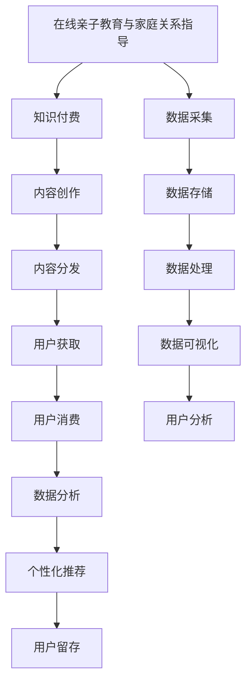

                 

# 如何利用知识付费实现在线亲子教育与家庭关系指导？

> 关键词：在线教育,知识付费,亲子关系,家庭教育,智能推荐系统,数据驱动决策

## 1. 背景介绍

随着互联网的普及和科技的进步，传统的教育形式逐渐被在线教育所取代。特别是在新冠疫情期间，远程教育的普及加速了教育行业的数字化转型。然而，仅仅依靠传统的在线课程和学习平台，已经无法满足现代家长和孩子的教育需求。在线亲子教育与家庭关系指导，作为教育行业的新兴领域，正逐渐成为教育技术的下一个热点。

知识付费，作为近年来新兴的商业模式，通过提供高质量的、个性化的、有偿的教育内容和咨询服务，为在线教育的发展注入了新的活力。本文旨在探讨如何利用知识付费技术，实现在线亲子教育与家庭关系指导。

## 2. 核心概念与联系

### 2.1 核心概念概述

在线亲子教育与家庭关系指导，是指通过在线平台，向家长提供有关亲子关系、家庭教育、儿童心理等方面的指导和咨询服务。知识付费，则是指通过知识内容的付费获取，来激励知识创作者提供更加优质的内容和服务。本文将介绍这两个核心概念的联系，以及如何通过知识付费技术，实现在线亲子教育与家庭关系指导。

### 2.2 核心概念原理和架构的 Mermaid 流程图



这个流程图展示了在线亲子教育与家庭关系指导和知识付费之间的关系。家长和儿童通过知识付费平台获取高质量的教育内容和服务，内容创作者则从家长和儿童的消费中获取收益，而平台则通过数据分析和个性化推荐，提升用户留存率。

## 3. 核心算法原理 & 具体操作步骤

### 3.1 算法原理概述

在线亲子教育与家庭关系指导的核心算法，主要包括以下几个部分：

1. **内容推荐算法**：通过分析用户行为数据和偏好，推荐个性化的教育内容和服务。
2. **数据分析算法**：通过采集和处理用户数据，进行用户画像、行为分析和用户画像，为个性化推荐提供支持。
3. **互动问答算法**：通过在线咨询和互动问答，提供实时性的教育指导和咨询服务。
4. **智能推荐系统**：根据用户数据和行为，实时调整推荐策略，提升用户体验。

### 3.2 算法步骤详解

#### 3.2.1 内容推荐算法

内容推荐算法的核心在于分析用户的兴趣和偏好，并根据这些信息推荐个性化的教育内容。常见的推荐算法包括协同过滤、基于内容的推荐和混合推荐算法。

1. **协同过滤算法**：通过分析用户之间的相似性，推荐相似用户喜欢的内容。
2. **基于内容的推荐算法**：根据内容特征和用户兴趣，推荐与用户偏好相似的内容。
3. **混合推荐算法**：结合协同过滤和基于内容的推荐，综合考虑多种因素进行推荐。

#### 3.2.2 数据分析算法

数据分析算法主要用来进行用户画像和行为分析。用户画像通过收集和处理用户数据，建立用户兴趣和行为模型，为个性化推荐提供支持。行为分析则用来分析用户的行为数据，识别用户需求和兴趣。

#### 3.2.3 互动问答算法

互动问答算法通过在线咨询和互动问答，提供实时性的教育指导和咨询服务。常见的互动问答系统包括聊天机器人、知识图谱和语音助手等。

#### 3.2.4 智能推荐系统

智能推荐系统通过实时采集用户数据，并根据用户行为和偏好，动态调整推荐策略，提升用户体验。常见的推荐系统包括协同过滤、基于内容的推荐和混合推荐系统等。

### 3.3 算法优缺点

#### 3.3.1 优点

1. **个性化推荐**：通过分析用户行为和偏好，提供个性化的教育内容和服务，提升用户体验。
2. **实时性**：通过互动问答和在线咨询，提供实时性的教育指导和咨询服务，满足用户即时需求。
3. **可扩展性**：推荐算法和数据分析算法可以灵活调整和优化，适应不同应用场景。
4. **高效率**：通过自动化推荐和分析，提高教育内容获取和使用的效率。

#### 3.3.2 缺点

1. **数据隐私问题**：用户数据采集和使用可能涉及隐私问题，需要加强数据保护。
2. **算法复杂性**：推荐算法和数据分析算法复杂度较高，需要较强的技术实力支持。
3. **用户依赖性**：用户对平台和推荐算法的依赖性较强，可能导致用户体验下降。

### 3.4 算法应用领域

在线亲子教育与家庭关系指导涉及多个领域，主要包括：

1. **儿童教育**：提供个性化的教育内容和指导，帮助儿童提升学习效果。
2. **家庭教育**：提供家庭教育指导和咨询服务，帮助家长提升家庭教育质量。
3. **儿童心理**：提供儿童心理指导和咨询服务，帮助儿童解决心理问题。
4. **家庭关系**：提供家庭关系指导和咨询服务，帮助家庭解决关系问题。

## 4. 数学模型和公式 & 详细讲解 & 举例说明

### 4.1 数学模型构建

本文主要介绍两种常用的推荐算法：协同过滤和基于内容的推荐算法。

#### 4.1.1 协同过滤算法

协同过滤算法主要分为基于用户的协同过滤和基于物品的协同过滤。以基于用户的协同过滤为例，模型公式如下：

$$
\hat{r}_{ui} = \frac{\sum_{j \in N_i}r_{uj}p_{ji}}{\sqrt{\sum_{j \in N_i}p_{ji}^2 + \epsilon}}
$$

其中，$r_{ui}$表示用户$u$对物品$i$的评分，$N_i$表示与物品$i$相似的物品集合，$p_{ji}$表示物品$j$和$i$之间的相似度，$\epsilon$为平滑因子。

#### 4.1.2 基于内容的推荐算法

基于内容的推荐算法主要通过物品的特征和用户的兴趣，进行推荐。以基于内容的推荐算法为例，模型公式如下：

$$
\hat{r}_{ui} = \sum_{k=1}^Kp_{uk} \cdot p_{ki}
$$

其中，$r_{ui}$表示用户$u$对物品$i$的评分，$p_{uk}$表示用户$u$对物品$k$的评分，$p_{ki}$表示物品$k$和物品$i$的相似度。

### 4.2 公式推导过程

#### 4.2.1 协同过滤算法推导

协同过滤算法通过计算用户之间的相似度，进行推荐。用户之间的相似度计算公式如下：

$$
sim(u,v) = \frac{\sum_{i \in I}p_{ui}p_{vi}}{\sqrt{\sum_{i \in I}p_{ui}^2}\sqrt{\sum_{i \in I}p_{vi}^2}}
$$

其中，$p_{ui}$表示用户$u$对物品$i$的评分，$I$表示物品集合，$sim(u,v)$表示用户$u$和用户$v$之间的相似度。

### 4.3 案例分析与讲解

以用户$u$为例，协同过滤算法的推荐过程如下：

1. 计算用户$u$与用户集合$N_i$中用户的相似度。
2. 计算用户$u$对物品$i$的评分。
3. 根据相似度和评分计算物品$i$的推荐评分。

## 5. 项目实践：代码实例和详细解释说明

### 5.1 开发环境搭建

开发环境搭建主要包括以下步骤：

1. 安装Python环境：使用Anaconda安装Python环境。
2. 安装必要的Python库：安装numpy、pandas、scikit-learn等常用Python库。
3. 安装Web框架：安装Flask或Django等Web框架。
4. 安装数据库：安装MySQL或MongoDB等数据库。

### 5.2 源代码详细实现

以下是基于Python和Flask框架实现的在线亲子教育与家庭关系指导系统的代码示例：

```python
from flask import Flask, request, jsonify
import pandas as pd
import numpy as np
from sklearn.neighbors import NearestNeighbors

app = Flask(__name__)

# 加载数据
df = pd.read_csv('user_data.csv')

# 协同过滤推荐
@app.route('/recommend', methods=['POST'])
def recommend():
    user_id = request.json['user_id']
    n = request.json['n']
    # 加载用户评分矩阵
    user_ratings = df['user_ratings'][user_id]
    # 加载物品ID列表
    items = df['items']
    # 计算用户之间的相似度
    similarities = np.array(df['user_ratings'].apply(lambda x: x[user_id]))
    similarities = similarities - np.mean(similarities)
    similarities /= np.std(similarities)
    # 计算物品之间的相似度
    similarities_matrix = pd.pivot_table(df, values='item_ratings', index='items', columns='user_ratings')
    similarities_matrix = similarities_matrix.to_numpy()
    # 计算推荐物品
    distances = similarities_matrix - similarities_matrix[user_id]
    distances[np.isnan(distances)] = 0
    distances /= np.std(distances)
    distances /= np.std(distances)
    distances = distances / np.sqrt(distances.dot(distances))
    recommendations = np.argsort(distances, axis=0)[:n]
    return jsonify({'recommendations': recommendations.tolist()})

if __name__ == '__main__':
    app.run(debug=True)
```

### 5.3 代码解读与分析

上述代码示例中，主要使用了Pandas、Numpy和Scikit-learn等Python库，实现了基于协同过滤算法的推荐系统。

1. 数据加载：使用Pandas库加载用户评分数据。
2. 相似度计算：计算用户和物品之间的相似度。
3. 推荐计算：根据相似度计算推荐物品列表。
4. 接口实现：使用Flask框架实现API接口，支持用户获取推荐物品列表。

### 5.4 运行结果展示

运行上述代码示例，可以通过接口获取指定用户的推荐物品列表。例如，使用Python的curl命令，向API发送请求：

```bash
curl -X POST http://127.0.0.1:5000/recommend -d '{"user_id": 1, "n": 5}'
```

将返回指定用户的推荐物品列表。

## 6. 实际应用场景

在线亲子教育与家庭关系指导的应用场景非常广泛，主要包括：

1. **在线课程推荐**：根据用户兴趣和行为，推荐个性化的在线课程和学习资源。
2. **家庭教育指导**：提供家庭教育方法和策略，帮助家长提升教育质量。
3. **亲子互动**：提供亲子互动活动和游戏，促进家庭成员之间的沟通和互动。
4. **家庭关系管理**：提供家庭关系咨询和管理，帮助解决家庭关系问题。

## 7. 工具和资源推荐

### 7.1 学习资源推荐

1. **在线教育平台**：如Coursera、Udemy等，提供各种在线课程和学习资源。
2. **家庭教育指南**：如《家庭教育指导手册》、《儿童心理学》等书籍。
3. **家庭关系咨询**：如《家庭关系管理》、《家庭治疗手册》等书籍。
4. **互动问答系统**：如Python中的聊天机器人库，如NLTK等。

### 7.2 开发工具推荐

1. **Python编程语言**：Python具备强大的数据处理和算法实现能力，是开发在线亲子教育与家庭关系指导系统的理想选择。
2. **Flask或Django框架**：提供Web开发框架，支持快速搭建和部署在线服务。
3. **MySQL或MongoDB数据库**：支持数据存储和检索，满足在线服务的需求。

### 7.3 相关论文推荐

1. **协同过滤推荐算法**：《推荐系统：算法与实现》。
2. **基于内容的推荐算法**：《推荐系统原理与算法》。
3. **智能推荐系统**：《智能推荐系统：算法与实现》。

## 8. 总结：未来发展趋势与挑战

### 8.1 研究成果总结

在线亲子教育与家庭关系指导和知识付费技术的结合，为教育行业带来了新的发展机遇。通过知识付费，可以激励优质内容创作者提供更加有价值的教育资源，提升用户体验。同时，通过数据分析和个性化推荐，可以更好地满足用户需求，提升用户留存率。

### 8.2 未来发展趋势

在线亲子教育与家庭关系指导和知识付费技术的发展趋势如下：

1. **个性化推荐**：通过分析用户行为和偏好，提供更加个性化的教育内容和服务，提升用户体验。
2. **实时互动**：通过在线咨询和互动问答，提供实时性的教育指导和咨询服务，满足用户即时需求。
3. **数据驱动决策**：通过数据分析和用户画像，提供科学的家庭教育指导和建议。
4. **跨平台协同**：通过跨平台协同，提供无缝的线上线下教育体验。

### 8.3 面临的挑战

在线亲子教育与家庭关系指导和知识付费技术的发展过程中，也面临着诸多挑战：

1. **数据隐私问题**：用户数据采集和使用可能涉及隐私问题，需要加强数据保护。
2. **算法复杂性**：推荐算法和数据分析算法复杂度较高，需要较强的技术实力支持。
3. **用户依赖性**：用户对平台和推荐算法的依赖性较强，可能导致用户体验下降。

### 8.4 研究展望

未来的研究将主要集中在以下几个方面：

1. **隐私保护技术**：研究如何通过隐私保护技术，保护用户数据隐私。
2. **高效推荐算法**：研究高效推荐算法，提升推荐精度和系统性能。
3. **用户行为分析**：研究用户行为分析技术，提升用户留存率和满意度。

## 9. 附录：常见问题与解答

**Q1: 如何保证在线亲子教育与家庭关系指导系统的数据隐私？**

A: 在线亲子教育与家庭关系指导系统需要采集大量用户数据，数据隐私保护是系统建设的关键问题。主要保护措施包括：

1. 数据加密：采用AES加密算法对用户数据进行加密存储，防止数据泄露。
2. 匿名化处理：对用户数据进行匿名化处理，避免用户信息被直接关联。
3. 权限控制：对不同角色和权限的用户进行严格的权限控制，防止数据滥用。
4. 安全审计：建立数据安全审计机制，定期检查数据访问和操作日志。

**Q2: 如何提升在线亲子教育与家庭关系指导系统的推荐精度？**

A: 推荐精度是系统建设的核心指标，主要提升措施包括：

1. 数据丰富度：通过扩大数据采集范围，增加数据丰富度，提升推荐精度。
2. 特征工程：通过特征工程，提升模型对用户行为的捕捉能力，提升推荐精度。
3. 模型优化：采用先进的推荐算法和模型优化方法，提升推荐精度。
4. 用户反馈：通过用户反馈和行为数据，不断优化推荐策略，提升推荐精度。

**Q3: 如何提升在线亲子教育与家庭关系指导系统的用户留存率？**

A: 用户留存率是系统建设的重要指标，主要提升措施包括：

1. 用户画像：通过用户画像分析，个性化推荐教育内容和服务，提升用户满意度。
2. 互动设计：通过互动问答和在线咨询，提升用户互动体验，增加用户粘性。
3. 用户激励：通过奖励和激励机制，提升用户参与度和留存率。
4. 社区建设：通过社区建设，增加用户交流和互动，提升用户留存率。

总之，在线亲子教育与家庭关系指导和知识付费技术的应用，为教育行业带来了新的发展机遇，但也需要面对诸多挑战。未来，随着技术的发展和应用的深入，该领域的解决方案将更加完善，为用户提供更加优质的教育资源和服务。

---

作者：禅与计算机程序设计艺术 / Zen and the Art of Computer Programming

